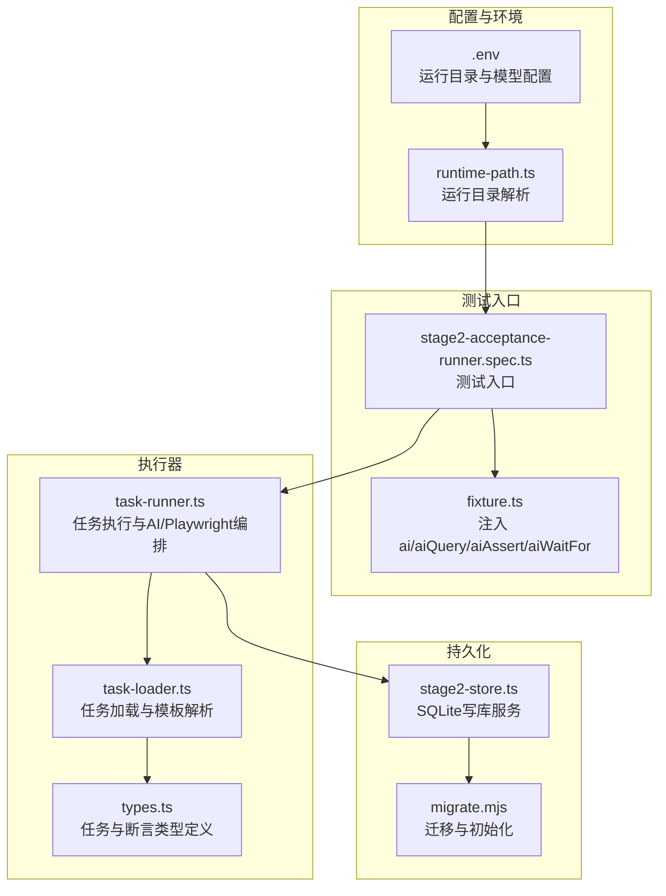
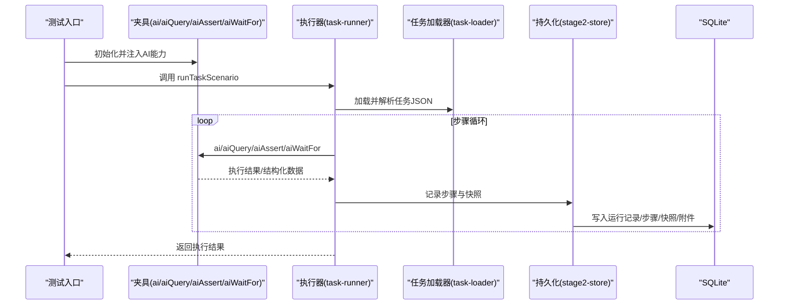
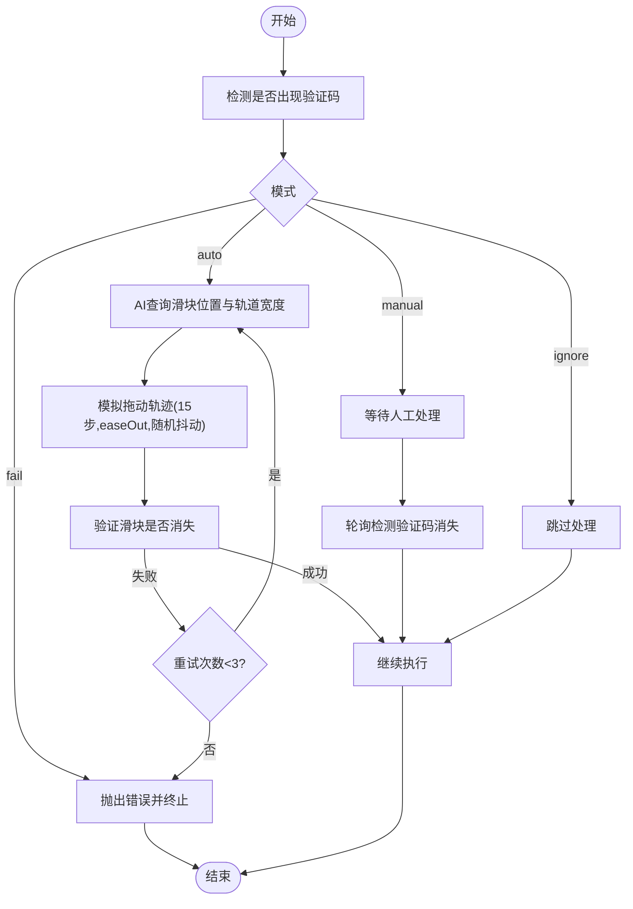
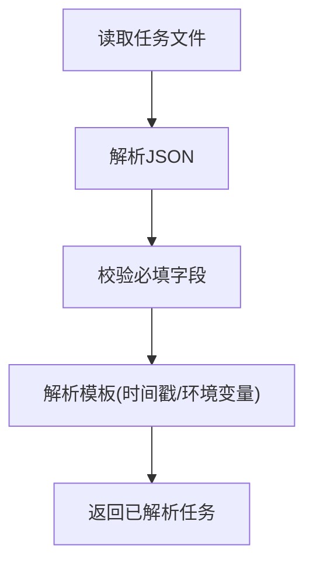
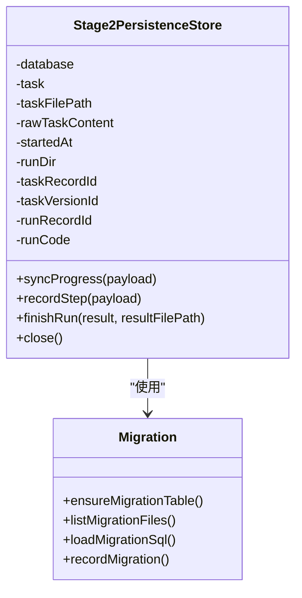
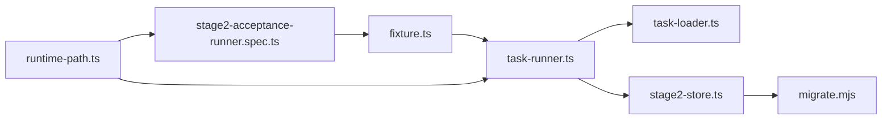

# 最佳实践与使用指南

<cite>
**本文引用的文件**   
- [README.md](file://README.md)
- [package.json](file://package.json)
- [playwright.config.ts](file://playwright.config.ts)
- [src/stage2/task-runner.ts](file://src/stage2/task-runner.ts)
- [src/stage2/types.ts](file://src/stage2/types.ts)
- [src/stage2/task-loader.ts](file://src/stage2/task-loader.ts)
- [src/persistence/stage2-store.ts](file://src/persistence/stage2-store.ts)
- [tests/generated/stage2-acceptance-runner.spec.ts](file://tests/generated/stage2-acceptance-runner.spec.ts)
- [tests/fixture/fixture.ts](file://tests/fixture/fixture.ts)
- [specs/tasks/acceptance-task.template.json](file://specs/tasks/acceptance-task.template.json)
- [config/runtime-path.ts](file://config/runtime-path.ts)
- [scripts/db/migrate.mjs](file://scripts/db/migrate.mjs)
- [AGENTS.md](file://AGENTS.md)
- [.tasks/AI自主代理验收系统开发改造方案_2026-03-11.md](file://.tasks/AI自主代理验收系统开发改造方案_2026-03-11.md)
- [.plans/第二段数据持久化改造方案_2026-03-12.md](file://.plans/第二段数据持久化改造方案_2026-03-12.md)
</cite>

## 目录
1. [简介](#简介)
2. [项目结构](#项目结构)
3. [核心组件](#核心组件)
4. [架构总览](#架构总览)
5. [详细组件分析](#详细组件分析)
6. [依赖关系分析](#依赖关系分析)
7. [性能考虑](#性能考虑)
8. [故障排查指南](#故障排查指南)
9. [结论](#结论)
10. [附录](#附录)

## 简介
本指南面向在 Midscene AI 能力与 Playwright 集成的项目中进行自动化测试的工程师与测试工程师。文档聚焦于：
- 在不同测试场景中组合使用 Midscene AI 能力与传统 Playwright 方法
- AI 断言与条件等待的使用时机与判断标准
- 复杂断言场景的解决方案与数据提取策略
- AI 操作的错误处理与重试机制
- 性能优化建议（批量、缓存复用、资源管理）
- AI 能力的局限性与替代方案
- 常见使用模式与调试技巧

## 项目结构
项目采用“任务 JSON 驱动 + Midscene + Playwright 执行”的两段式架构：
- 第一段：探索建模，输出草稿任务 JSON
- 第二段：执行验证，读取任务 JSON 并执行，生成结构化结果与报告

**图表来源**
- [playwright.config.ts:1-95](file://playwright.config.ts#L1-L95)
- [tests/generated/stage2-acceptance-runner.spec.ts:1-39](file://tests/generated/stage2-acceptance-runner.spec.ts#L1-L39)
- [tests/fixture/fixture.ts:1-100](file://tests/fixture/fixture.ts#L1-L100)
- [src/stage2/task-runner.ts:1-800](file://src/stage2/task-runner.ts#L1-L800)
- [src/stage2/task-loader.ts:1-91](file://src/stage2/task-loader.ts#L1-L91)
- [src/stage2/types.ts:1-180](file://src/stage2/types.ts#L1-L180)
- [src/persistence/stage2-store.ts:1-655](file://src/persistence/stage2-store.ts#L1-L655)
- [scripts/db/migrate.mjs:1-52](file://scripts/db/migrate.mjs#L1-L52)

**章节来源**
- [README.md:136-223](file://README.md#L136-L223)
- [playwright.config.ts:1-95](file://playwright.config.ts#L1-L95)
- [tests/generated/stage2-acceptance-runner.spec.ts:1-39](file://tests/generated/stage2-acceptance-runner.spec.ts#L1-L39)
- [tests/fixture/fixture.ts:1-100](file://tests/fixture/fixture.ts#L1-L100)
- [src/stage2/task-runner.ts:1-800](file://src/stage2/task-runner.ts#L1-L800)
- [src/stage2/task-loader.ts:1-91](file://src/stage2/task-loader.ts#L1-L91)
- [src/stage2/types.ts:1-180](file://src/stage2/types.ts#L1-L180)
- [src/persistence/stage2-store.ts:1-655](file://src/persistence/stage2-store.ts#L1-L655)
- [scripts/db/migrate.mjs:1-52](file://scripts/db/migrate.mjs#L1-L52)

## 核心组件
- 测试夹具与 AI 能力注入：通过夹具注入 ai、aiQuery、aiAssert、aiWaitFor，统一缓存与报告生成。
- 任务加载器：解析任务 JSON，支持环境变量与时间戳模板替换。
- 执行器：编排登录、导航、弹窗、表单、查询、断言、清理等步骤，内置验证码自动处理与等待策略。
- 持久化服务：将运行主记录、步骤明细、快照与附件路径写入 SQLite，支持迁移与幂等写入。
- 配置与运行目录：集中管理运行产物目录，统一收敛到 t_runtime。

**章节来源**
- [tests/fixture/fixture.ts:23-99](file://tests/fixture/fixture.ts#L23-L99)
- [src/stage2/task-loader.ts:79-91](file://src/stage2/task-loader.ts#L79-L91)
- [src/stage2/task-runner.ts:18-706](file://src/stage2/task-runner.ts#L18-L706)
- [src/persistence/stage2-store.ts:74-641](file://src/persistence/stage2-store.ts#L74-L641)
- [config/runtime-path.ts:13-45](file://config/runtime-path.ts#L13-L45)

## 架构总览
整体执行链路由“测试入口 -> 夹具注入 -> 执行器 -> 持久化 -> 报告输出”构成，AI 与 Playwright 能力在执行器中协同使用，断言优先采用 Playwright 硬检测，AI 作为兜底与补充。

**图表来源**
- [tests/generated/stage2-acceptance-runner.spec.ts:12-37](file://tests/generated/stage2-acceptance-runner.spec.ts#L12-L37)
- [tests/fixture/fixture.ts:23-99](file://tests/fixture/fixture.ts#L23-L99)
- [src/stage2/task-runner.ts:18-706](file://src/stage2/task-runner.ts#L18-L706)
- [src/stage2/task-loader.ts:79-91](file://src/stage2/task-loader.ts#L79-L91)
- [src/persistence/stage2-store.ts:470-630](file://src/persistence/stage2-store.ts#L470-L630)

## 详细组件分析

### 组件A：任务执行器（task-runner）
- 职责：编排登录、菜单导航、弹窗表单、列表查询、断言与清理；内置滑块验证码自动处理与等待策略。
- 关键能力：
  - aiQuery：结构化数据提取
  - aiAssert：AI 断言
  - aiWaitFor：在 Playwright 常规等待不适用时使用
  - ai：通用 AI 操作
- 验证码处理：支持 auto/manual/fail/ignore 四种模式，自动模式下通过 AI 查询滑块位置与轨道宽度，再用 Playwright 模拟拖动轨迹，最多重试三次。
- 等待与可见性：提供多种等待与可见性判断工具，避免脆弱断言。

**图表来源**
- [src/stage2/task-runner.ts:483-706](file://src/stage2/task-runner.ts#L483-L706)

**章节来源**
- [src/stage2/task-runner.ts:18-706](file://src/stage2/task-runner.ts#L18-L706)
- [README.md:58-76](file://README.md#L58-L76)

### 组件B：任务加载器（task-loader）
- 职责：读取任务 JSON，校验必填字段，解析模板字符串（含时间戳与环境变量）。
- 模板解析：支持 NOW_YYYYMMDDHHMMSS 与环境变量占位符，递归替换字符串/数组/对象。

**图表来源**
- [src/stage2/task-loader.ts:79-91](file://src/stage2/task-loader.ts#L79-L91)

**章节来源**
- [src/stage2/task-loader.ts:79-91](file://src/stage2/task-loader.ts#L79-L91)

### 组件C：持久化服务（stage2-store）
- 职责：将运行主记录、步骤明细、快照与附件路径写入 SQLite，支持迁移与幂等写入。
- 写库范围：ai_task、ai_task_version、ai_run、ai_run_step、ai_snapshot、ai_artifact、ai_audit_log。
- 容错：持久化初始化失败仅记录错误，不阻断执行。

**图表来源**
- [src/persistence/stage2-store.ts:74-641](file://src/persistence/stage2-store.ts#L74-L641)
- [scripts/db/migrate.mjs:15-51](file://scripts/db/migrate.mjs#L15-L51)

**章节来源**
- [src/persistence/stage2-store.ts:74-641](file://src/persistence/stage2-store.ts#L74-L641)
- [.plans/第二段数据持久化改造方案_2026-03-12.md:15-33](file://.plans/第二段数据持久化改造方案_2026-03-12.md#L15-L33)

### 组件D：夹具与AI能力注入（fixture）
- 职责：为每个测试用例注入 ai、aiQuery、aiAssert、aiWaitFor，设置缓存 ID、组名与报告生成。
- 缓存与日志：统一缓存 ID 规范，日志目录由运行目录解析模块提供。

**章节来源**
- [tests/fixture/fixture.ts:23-99](file://tests/fixture/fixture.ts#L23-L99)
- [config/runtime-path.ts:13-45](file://config/runtime-path.ts#L13-L45)

### 组件E：任务类型定义（types）
- 职责：定义 AcceptanceTask、TaskAssertion、TaskCleanup、TaskRuntime 等类型，支撑任务 JSON 的结构化约束与断言配置。

**章节来源**
- [src/stage2/types.ts:141-180](file://src/stage2/types.ts#L141-L180)

## 依赖关系分析
- 测试入口依赖夹具提供的 AI 能力，夹具内部通过 Midscene Agent 与 Playwright Page 交互。
- 执行器依赖任务加载器与持久化服务，负责协调 AI 与 Playwright 的具体步骤。
- 配置模块集中管理运行目录，Playwright 配置与报告输出也受其影响。

**图表来源**
- [tests/generated/stage2-acceptance-runner.spec.ts:12-37](file://tests/generated/stage2-acceptance-runner.spec.ts#L12-L37)
- [tests/fixture/fixture.ts:23-99](file://tests/fixture/fixture.ts#L23-L99)
- [src/stage2/task-runner.ts:18-706](file://src/stage2/task-runner.ts#L18-L706)
- [src/stage2/task-loader.ts:79-91](file://src/stage2/task-loader.ts#L79-L91)
- [src/persistence/stage2-store.ts:74-641](file://src/persistence/stage2-store.ts#L74-L641)
- [config/runtime-path.ts:13-45](file://config/runtime-path.ts#L13-L45)

**章节来源**
- [tests/generated/stage2-acceptance-runner.spec.ts:12-37](file://tests/generated/stage2-acceptance-runner.spec.ts#L12-L37)
- [tests/fixture/fixture.ts:23-99](file://tests/fixture/fixture.ts#L23-L99)
- [src/stage2/task-runner.ts:18-706](file://src/stage2/task-runner.ts#L18-L706)
- [src/stage2/task-loader.ts:79-91](file://src/stage2/task-loader.ts#L79-L91)
- [src/persistence/stage2-store.ts:74-641](file://src/persistence/stage2-store.ts#L74-L641)
- [config/runtime-path.ts:13-45](file://config/runtime-path.ts#L13-L45)

## 性能考虑
- 批量与缓存复用
  - 复用夹具中的缓存 ID，避免重复初始化 Agent，减少模型调用与截图开销。
  - 对高频定位目标启用可缓存策略，但不将其视为唯一方案。
- 资源管理
  - 统一收敛运行产物目录，避免磁盘碎片与 IO 竞争。
  - 合理设置截图与 trace 开关，仅在必要步骤开启。
- 等待策略
  - 优先使用 Playwright 显式等待与可见性判断，AI 等待仅在必要时使用。
  - 验证码自动处理采用固定步数与抖动模拟，平衡成功率与稳定性。

**章节来源**
- [tests/fixture/fixture.ts:23-99](file://tests/fixture/fixture.ts#L23-L99)
- [README.md:144-157](file://README.md#L144-L157)
- [src/stage2/task-runner.ts:561-648](file://src/stage2/task-runner.ts#L561-L648)

## 故障排查指南
- 验证码相关
  - 模式配置：auto/manual/fail/ignore，自动模式失败时可切换为 manual 或调整检测策略。
  - 自动处理失败：检查页面截图确认滑块样式，调整检测选择器或增大等待时间。
- 断言与等待
  - 关键断言优先使用 aiQuery + 代码断言，降低幻觉风险。
  - 避免仅依赖 toast 或“看起来成功”的断言，采用关键字搜索与表格首行提取。
- 持久化与报告
  - 持久化初始化失败不会阻断执行，但会记录错误日志，检查数据库文件与权限。
  - 报告与产物目录由运行目录解析模块统一管理，确认 .env 配置正确。

**章节来源**
- [README.md:58-76](file://README.md#L58-L76)
- [README.md:144-157](file://README.md#L144-L157)
- [src/persistence/stage2-store.ts:632-641](file://src/persistence/stage2-store.ts#L632-L641)
- [config/runtime-path.ts:13-45](file://config/runtime-path.ts#L13-L45)

## 结论
本项目通过“任务 JSON 驱动 + Midscene + Playwright”的两段式架构，实现了从探索建模到执行验证的闭环。执行器在 AI 与 Playwright 之间建立稳健的协作模式，断言优先采用硬检测，AI 作为兜底与补充。配合统一的运行目录与 SQLite 持久化，项目具备良好的可复用性与可追踪性。建议在复杂场景中遵循“步骤拆分、结构化断言、AI 等待兜底”的实践，持续优化缓存与等待策略，提升稳定性与性能。

## 附录
- 常用运行命令
  - 初始化数据库：npm run db:init
  - 执行迁移：npm run db:migrate
  - 第二段执行（带界面）：npm run stage2:run:headed
- 任务模板与示例
  - 任务模板：specs/tasks/acceptance-task.template.json
  - 示例任务：specs/tasks/acceptance-task.community-create.example.json
- 配置要点
  - 运行目录：通过 .env 与 runtime-path.ts 统一管理
  - 模型配置：OPENAI_API_KEY、OPENAI_BASE_URL、MIDSCENE_MODEL_NAME 等

**章节来源**
- [package.json:6-12](file://package.json#L6-L12)
- [README.md:39-56](file://README.md#L39-L56)
- [specs/tasks/acceptance-task.template.json:1-141](file://specs/tasks/acceptance-task.template.json#L1-L141)
- [config/runtime-path.ts:13-45](file://config/runtime-path.ts#L13-L45)