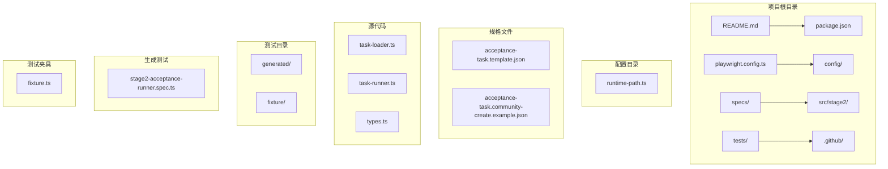
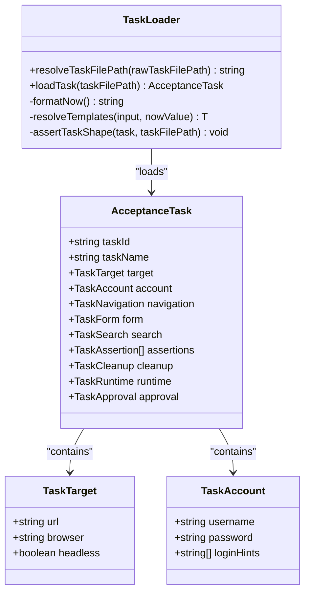
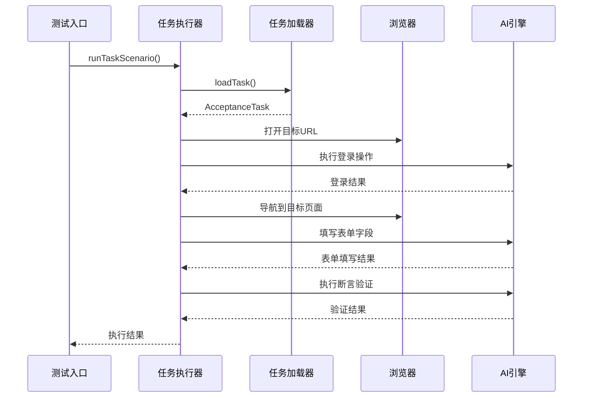
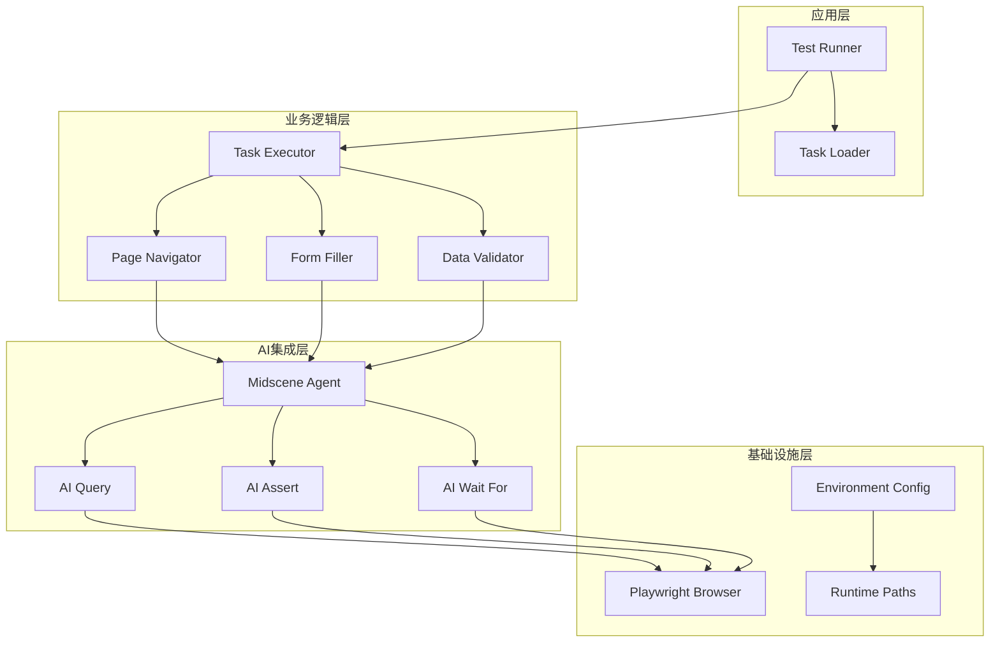
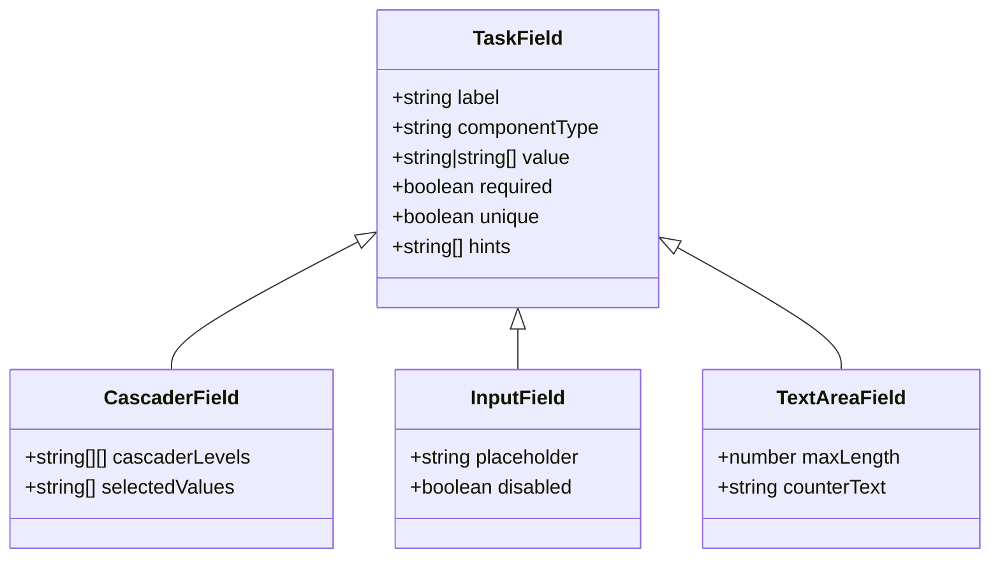
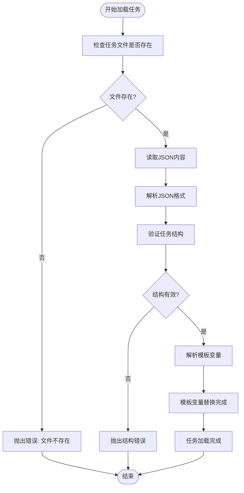
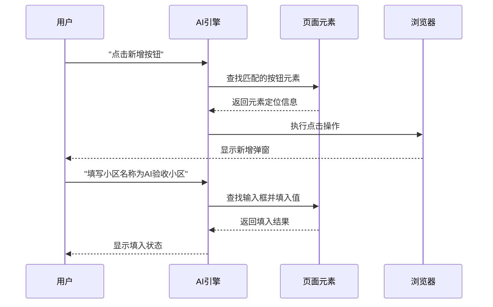
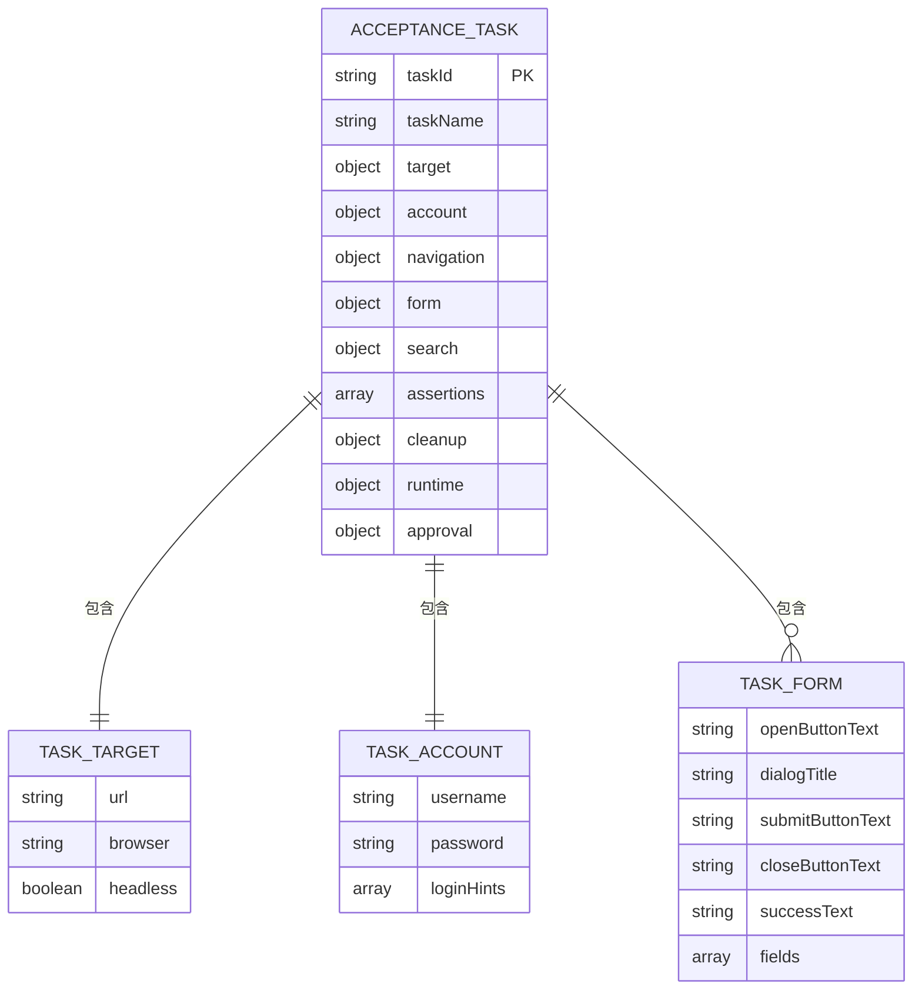
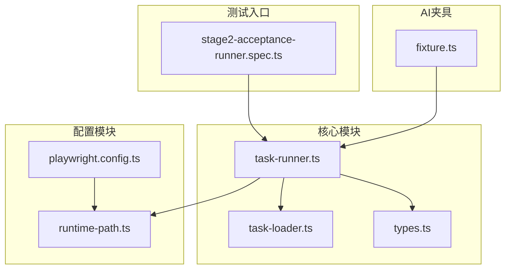

# 任务驱动测试原理

<cite>
**本文档引用的文件**
- [README.md](file://README.md)
- [task-loader.ts](file://src/stage2/task-loader.ts)
- [task-runner.ts](file://src/stage2/task-runner.ts)
- [types.ts](file://src/stage2/types.ts)
- [acceptance-task.template.json](file://specs/tasks/acceptance-task.template.json)
- [acceptance-task.community-create.example.json](file://specs/tasks/acceptance-task.community-create.example.json)
- [stage2-acceptance-runner.spec.ts](file://tests/generated/stage2-acceptance-runner.spec.ts)
- [fixture.ts](file://tests/fixture/fixture.ts)
- [runtime-path.ts](file://config/runtime-path.ts)
- [package.json](file://package.json)
- [playwright.config.ts](file://playwright.config.ts)
</cite>

## 目录
1. [引言](#引言)
2. [项目结构](#项目结构)
3. [核心组件](#核心组件)
4. [架构概览](#架构概览)
5. [详细组件分析](#详细组件分析)
6. [依赖关系分析](#依赖关系分析)
7. [性能考虑](#性能考虑)
8. [故障排除指南](#故障排除指南)
9. [结论](#结论)
10. [附录](#附录)

## 引言

HI-TEST 项目是一个基于 Playwright 和 Midscene.js 的 AI 自动化测试框架，专注于任务驱动测试原理的实现。该框架的核心理念是将自然语言业务场景转换为可执行的结构化任务，通过 JSON 格式的任务定义来描述完整的业务流程，包括用户登录、页面导航、表单填写、数据查询和断言验证等环节。

任务驱动测试相比传统测试方法具有显著优势：
- **可复用性**：任务模板可以被多个测试场景共享和扩展
- **可维护性**：结构化的任务定义便于维护和更新
- **可追踪性**：完整的执行日志和截图支持问题定位和审计
- **可扩展性**：支持 AI 辅助的智能断言和页面元素识别

## 项目结构

HI-TEST 项目采用模块化设计，主要包含以下核心目录和文件：



**图表来源**
- [README.md](file://README.md#L1-L144)
- [package.json](file://package.json#L1-L24)

**章节来源**
- [README.md](file://README.md#L1-L144)
- [package.json](file://package.json#L1-L24)

## 核心组件

### 任务加载器 (Task Loader)

任务加载器负责从 JSON 文件中加载和解析任务定义，执行模板变量替换，并进行必要的数据验证。



**图表来源**
- [task-loader.ts](file://src/stage2/task-loader.ts#L79-L89)
- [types.ts](file://src/stage2/types.ts#L86-L98)

### 任务执行器 (Task Runner)

任务执行器是整个系统的核心，负责执行具体的业务流程，包括页面导航、表单填写、数据查询和断言验证。



**图表来源**
- [stage2-acceptance-runner.spec.ts](file://tests/generated/stage2-acceptance-runner.spec.ts#L12-L37)
- [task-runner.ts](file://src/stage2/task-runner.ts#L1-L50)

### 类型定义系统

系统使用 TypeScript 接口来定义任务的数据结构，确保类型安全和代码可维护性。

**章节来源**
- [task-loader.ts](file://src/stage2/task-loader.ts#L1-L91)
- [task-runner.ts](file://src/stage2/task-runner.ts#L1-L1344)
- [types.ts](file://src/stage2/types.ts#L1-L125)

## 架构概览

HI-TEST 项目采用分层架构设计，将业务逻辑、数据处理和 UI 自动化分离：



**图表来源**
- [task-runner.ts](file://src/stage2/task-runner.ts#L1-L200)
- [fixture.ts](file://tests/fixture/fixture.ts#L23-L99)
- [runtime-path.ts](file://config/runtime-path.ts#L38-L40)

## 详细组件分析

### 任务输入格式设计原则

任务 JSON 文件遵循严格的结构化设计，确保任务定义的完整性和可执行性：

#### 基础字段要求

每个任务必须包含以下必需字段：

| 字段名 | 类型 | 必需 | 描述 |
|--------|------|------|------|
| taskId | string | ✓ | 任务唯一标识符 |
| taskName | string | ✓ | 任务名称 |
| target.url | string | ✓ | 目标网站URL |
| account.username | string | ✓ | 用户名 |
| account.password | string | ✓ | 密码 |
| form.openButtonText | string | ✓ | 打开表单按钮文本 |
| form.submitButtonText | string | ✓ | 提交按钮文本 |
| form.fields | TaskField[] | ✓ | 表单字段数组 |

#### 表单字段设计

表单字段支持多种组件类型和验证规则：



**图表来源**
- [types.ts](file://src/stage2/types.ts#L23-L40)

#### 模板变量系统

系统支持动态模板变量替换，包括环境变量和时间戳变量：

| 变量类型 | 示例 | 描述 |
|----------|------|------|
| 环境变量 | ${TEST_USERNAME} | 从 .env 文件读取 |
| 时间戳 | ${NOW_YYYYMMDDHHMMSS} | 当前时间格式化 |
| 自定义变量 | ${CUSTOM_VAR} | 用户自定义环境变量 |

**章节来源**
- [task-loader.ts](file://src/stage2/task-loader.ts#L19-L48)
- [acceptance-task.template.json](file://specs/tasks/acceptance-task.template.json#L10-L16)

### 任务解析器工作机制

任务解析器负责将 JSON 任务定义转换为可执行的操作序列：

#### 加载和验证流程



**图表来源**
- [task-loader.ts](file://src/stage2/task-loader.ts#L79-L89)

#### 模板变量解析

模板解析器支持递归处理嵌套对象，确保所有字符串值都被正确替换：

**章节来源**
- [task-loader.ts](file://src/stage2/task-loader.ts#L19-L48)

### 从自然语言到可执行步骤的转换

系统通过 AI 引擎实现自然语言到可执行操作的智能转换：

#### AI 驱动的页面交互



**图表来源**
- [task-runner.ts](file://src/stage2/task-runner.ts#L718-L721)
- [fixture.ts](file://tests/fixture/fixture.ts#L24-L42)

#### 智能断言机制

系统支持多种断言类型，包括 toast 提示、表格行存在性、单元格内容等：

| 断言类型 | 用途 | 参数示例 |
|----------|------|----------|
| toast | 验证页面提示信息 | { expectedText: "操作成功" } |
| table-row-exists | 验证表格行存在 | { matchField: "小区名称" } |
| table-cell-equals | 验证单元格内容相等 | { column: "所在地区", expectedFromField: "省市区" } |
| table-cell-contains | 验证单元格包含内容 | { column: "负责人", expectedFromField: "负责人" } |

**章节来源**
- [task-runner.ts](file://src/stage2/task-runner.ts#L787-L803)
- [acceptance-task.community-create.example.json](file://specs/tasks/acceptance-task.community-create.example.json#L140-L166)

### 任务模板系统

任务模板提供了标准化的任务定义框架，支持快速创建新的测试场景：

#### 模板字段详解



**图表来源**
- [types.ts](file://src/stage2/types.ts#L86-L98)
- [acceptance-task.template.json](file://specs/tasks/acceptance-task.template.json#L1-L85)

#### 模板使用最佳实践

1. **字段命名规范**：使用清晰、唯一的字段标签
2. **提示信息完整**：为每个字段提供详细的辅助描述
3. **断言策略明确**：定义具体的断言规则和期望值
4. **环境变量使用**：敏感信息通过环境变量管理
5. **时间戳应用**：使用动态时间戳避免数据冲突

**章节来源**
- [acceptance-task.template.json](file://specs/tasks/acceptance-task.template.json#L1-L85)
- [acceptance-task.community-create.example.json](file://specs/tasks/acceptance-task.community-create.example.json#L1-L184)

## 依赖关系分析

### 外部依赖

HI-TEST 项目依赖以下关键外部库：

```mermaid
graph LR
subgraph "核心依赖"
A[Playwright] --> B[UI自动化]
C[Midscene.js] --> D[AI能力]
E[dotenv] --> F[环境变量]
end
subgraph "运行时依赖"
G[TypeScript] --> H[类型安全]
I[@midscene/web] --> J[AI集成]
K[@playwright/test] --> L[测试框架]
end
subgraph "开发依赖"
M[Node.js] --> N[运行环境]
O[Webpack] --> P[构建工具]
end
```

**图表来源**
- [package.json](file://package.json#L13-L22)

### 内部模块依赖



**图表来源**
- [stage2-acceptance-runner.spec.ts](file://tests/generated/stage2-acceptance-runner.spec.ts#L1-L39)
- [task-runner.ts](file://src/stage2/task-runner.ts#L1-L200)
- [runtime-path.ts](file://config/runtime-path.ts#L1-L41)

**章节来源**
- [package.json](file://package.json#L1-L24)
- [playwright.config.ts](file://playwright.config.ts#L1-L95)

## 性能考虑

### 执行效率优化

1. **并行执行**：支持多浏览器并行测试
2. **智能等待**：基于元素可见性的动态等待机制
3. **缓存策略**：AI 查询结果缓存减少重复计算
4. **资源管理**：自动清理临时文件和缓存

### 内存和存储优化

- **运行时目录统一**：所有生成文件集中管理
- **报告压缩**：测试报告自动压缩存储
- **日志轮转**：避免日志文件无限增长

## 故障排除指南

### 常见问题及解决方案

#### 任务加载失败

**问题症状**：任务文件不存在或格式错误
**解决方法**：
1. 检查任务文件路径配置
2. 验证 JSON 格式有效性
3. 确认必需字段完整性

#### 页面元素定位失败

**问题症状**：AI 无法找到指定的页面元素
**解决方法**：
1. 更新元素定位提示信息
2. 检查页面结构变化
3. 调整等待超时时间

#### 滑块验证码处理

**问题症状**：自动滑块处理失败
**解决方法**：
1. 检查滑块检测选择器配置
2. 调整自动处理参数
3. 切换到人工处理模式

**章节来源**
- [task-runner.ts](file://src/stage2/task-runner.ts#L647-L703)
- [README.md](file://README.md#L54-L72)

## 结论

HI-TEST 项目通过任务驱动测试原理，成功地将复杂的业务场景抽象为可执行的结构化任务。该系统的主要优势体现在：

1. **高度可复用**：模板化的设计使得任务可以在不同场景间共享
2. **强可维护性**：清晰的类型定义和模块化架构便于长期维护
3. **智能执行**：结合 AI 能力实现自然语言到可执行操作的智能转换
4. **完整可观测性**：全面的执行日志、截图和报告支持问题诊断

通过合理使用任务模板和遵循设计原则，开发者可以快速创建高质量的自动化测试，显著提升测试效率和质量。

## 附录

### 任务 JSON 示例详解

以下是一个完整的任务定义示例，展示了各个字段的具体用法：

```json
{
  "taskId": "wyt-community-create-001",
  "taskName": "物业平台-新增小区并回查",
  "target": {
    "url": "https://wyt-pf-test.fuioupay.com/",
    "browser": "chromium",
    "headless": false
  },
  "account": {
    "username": "xwytlb001",
    "password": "888888",
    "loginHints": [
      "登录页存在账号和密码输入框",
      "登录按钮文案通常为登录"
    ]
  },
  "navigation": {
    "homeReadyText": "首页",
    "menuPath": ["小区管理", "小区信息管理"],
    "menuHints": [
      "左侧为层级菜单",
      "进入首页后再执行菜单点击"
    ]
  },
  "form": {
    "openButtonText": "新增小区",
    "dialogTitle": "新增小区",
    "submitButtonText": "确定",
    "closeButtonText": "取消",
    "successText": "操作成功",
    "fields": [
      {
        "label": "小区名称",
        "componentType": "input",
        "value": "AI验收小区_${NOW_YYYYMMDDHHMMSS}",
        "required": true,
        "unique": true,
        "hints": [
          "输入框占位文案为小区名称",
          "使用时间戳避免与历史数据重复"
        ]
      }
    ]
  },
  "assertions": [
    {
      "type": "toast",
      "expectedText": "操作成功"
    },
    {
      "type": "table-row-exists",
      "matchField": "小区名称"
    }
  ],
  "runtime": {
    "stepTimeoutMs": 30000,
    "pageTimeoutMs": 60000,
    "screenshotOnStep": true,
    "trace": true
  }
}
```

### 环境配置说明

系统通过 `.env` 文件管理运行时配置，支持以下关键配置项：

| 配置项 | 默认值 | 说明 |
|--------|--------|------|
| OPENAI_API_KEY | - | AI 模型访问密钥 |
| OPENAI_BASE_URL | - | AI 模型服务地址 |
| MIDSCENE_MODEL_NAME | qwen3-vl-plus | AI 模型名称 |
| RUNTIME_DIR_PREFIX | t_runtime/ | 运行时目录前缀 |
| PLAYWRIGHT_OUTPUT_DIR | t_runtime/test-results | Playwright 输出目录 |
| ACCEPTANCE_RESULT_DIR | t_runtime/acceptance-results | 接受度测试结果目录 |
| STAGE2_TASK_FILE | specs/tasks/acceptance-task.community-create.example.json | 任务文件路径 |
| STAGE2_CAPTCHA_MODE | manual | 滑块验证码处理模式 |
| STAGE2_CAPTCHA_WAIT_TIMEOUT_MS | 120000 | 人工处理等待超时时间 |

**章节来源**
- [README.md](file://README.md#L39-L52)
- [acceptance-task.community-create.example.json](file://specs/tasks/acceptance-task.community-create.example.json#L1-L184)