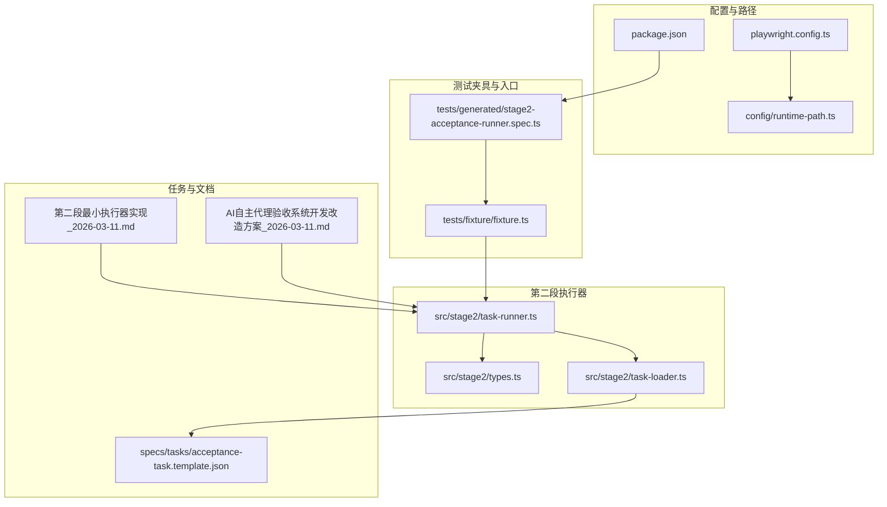
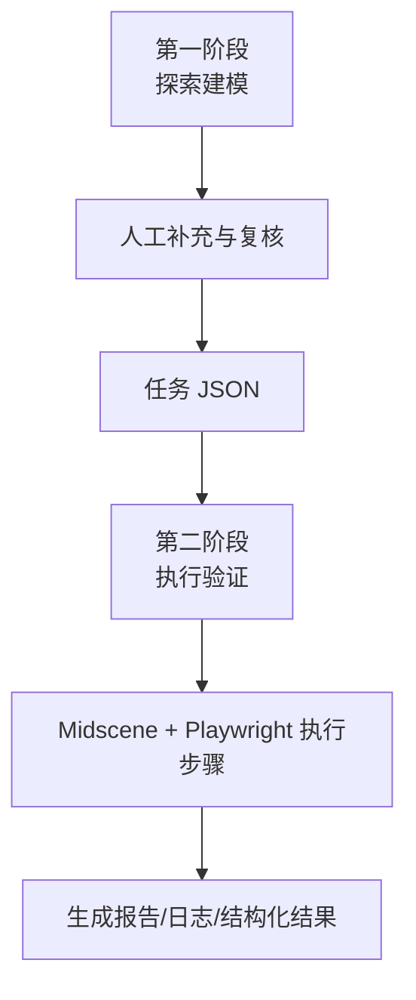
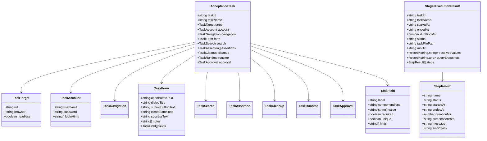
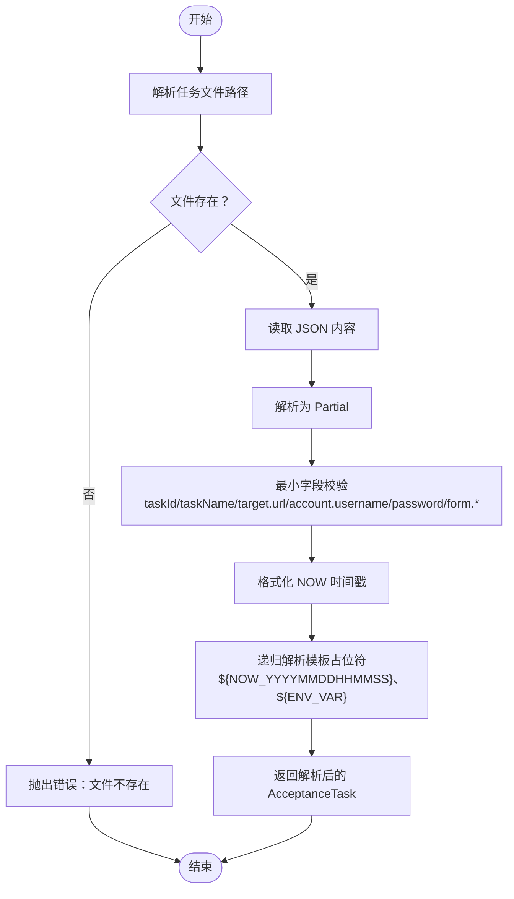
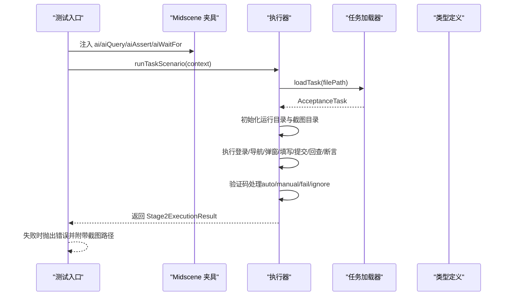
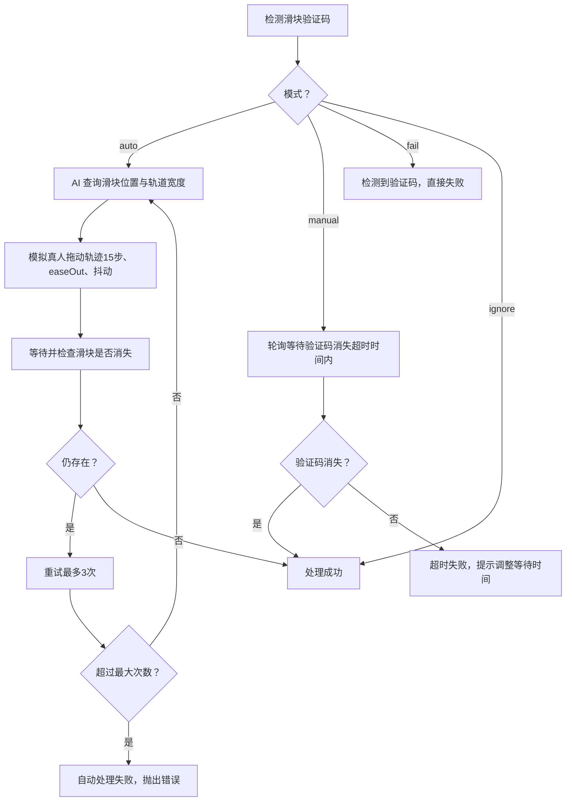
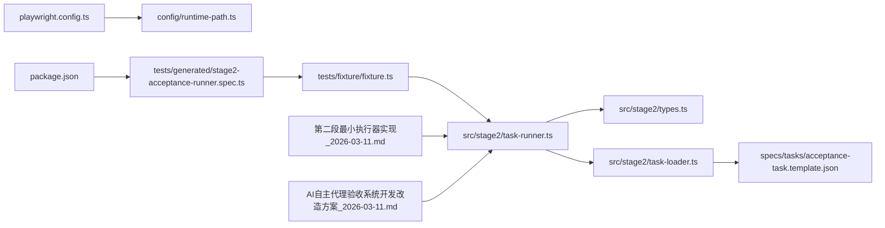

# 同仓双阶段开发模式

<cite>
**本文引用的文件**
- [README.md](file://README.md)
- [package.json](file://package.json)
- [playwright.config.ts](file://playwright.config.ts)
- [config/runtime-path.ts](file://config/runtime-path.ts)
- [src/stage2/types.ts](file://src/stage2/types.ts)
- [src/stage2/task-loader.ts](file://src/stage2/task-loader.ts)
- [src/stage2/task-runner.ts](file://src/stage2/task-runner.ts)
- [tests/generated/stage2-acceptance-runner.spec.ts](file://tests/generated/stage2-acceptance-runner.spec.ts)
- [tests/fixture/fixture.ts](file://tests/fixture/fixture.ts)
- [specs/tasks/acceptance-task.template.json](file://specs/tasks/acceptance-task.template.json)
- [.tasks/第二段最小执行器实现_2026-03-11.md](file://.tasks/第二段最小执行器实现_2026-03-11.md)
- [.tasks/AI自主代理验收系统开发改造方案_2026-03-11.md](file://.tasks/AI自主代理验收系统开发改造方案_2026-03-11.md)
- [AGENTS.md](file://AGENTS.md)
</cite>

## 目录
1. [简介](#简介)
2. [项目结构](#项目结构)
3. [核心组件](#核心组件)
4. [架构总览](#架构总览)
5. [详细组件分析](#详细组件分析)
6. [依赖关系分析](#依赖关系分析)
7. [性能考虑](#性能考虑)
8. [故障排查指南](#故障排查指南)
9. [结论](#结论)
10. [附录](#附录)

## 简介
本文件面向 HI-TEST 项目，系统化阐述“同仓双阶段开发模式”的架构设计与实施策略。该模式将测试自动化流程拆分为两个阶段：
- 第一阶段（探索建模）：以自然语言与基础信息为输入，借助 AI 探索页面、截图、提取元素与流程，经人工补充与复核，产出标准化任务 JSON。
- 第二阶段（执行验证）：读取任务 JSON，通过 Midscene + Playwright 自动执行步骤，生成报告、日志与结构化结果。

同时，文档解释人工门禁机制（STAGE2_REQUIRE_APPROVAL）与最小落地原则，强调先完成第二段最小执行器并稳定联调，再串联第一段探索流程，以降低整体风险与提升可复用性。

## 项目结构
仓库围绕“第二段执行器”进行组织，核心文件分布如下：
- 配置与运行产物路径：config/runtime-path.ts
- 第二段任务模型与执行器：src/stage2/types.ts、src/stage2/task-loader.ts、src/stage2/task-runner.ts
- 测试夹具与入口：tests/fixture/fixture.ts、tests/generated/stage2-acceptance-runner.spec.ts
- 任务模板与说明：specs/tasks/acceptance-task.template.json、.tasks/第二段最小执行器实现_2026-03-11.md、.tasks/AI自主代理验收系统开发改造方案_2026-03-11.md
- 运行与报告配置：playwright.config.ts、package.json、README.md

图表来源
- [config/runtime-path.ts](file://config/runtime-path.ts#L1-L41)
- [playwright.config.ts](file://playwright.config.ts#L1-L95)
- [package.json](file://package.json#L1-L24)
- [src/stage2/types.ts](file://src/stage2/types.ts#L1-L125)
- [src/stage2/task-loader.ts](file://src/stage2/task-loader.ts#L1-L91)
- [src/stage2/task-runner.ts](file://src/stage2/task-runner.ts#L1-L1344)
- [tests/fixture/fixture.ts](file://tests/fixture/fixture.ts#L1-L100)
- [tests/generated/stage2-acceptance-runner.spec.ts](file://tests/generated/stage2-acceptance-runner.spec.ts#L1-L39)
- [specs/tasks/acceptance-task.template.json](file://specs/tasks/acceptance-task.template.json#L1-L85)
- [.tasks/第二段最小执行器实现_2026-03-11.md](file://.tasks/第二段最小执行器实现_2026-03-11.md#L1-L73)
- [.tasks/AI自主代理验收系统开发改造方案_2026-03-11.md](file://.tasks/AI自主代理验收系统开发改造方案_2026-03-11.md#L1-L463)

章节来源
- [README.md](file://README.md#L1-L144)
- [AGENTS.md](file://AGENTS.md#L1-L61)

## 核心组件
- 任务模型与结果模型：定义任务输入结构（目标、账号、导航、表单、断言、清理、运行时、审批）与执行结果结构（步骤结果、聚合结果）。
- 任务加载器：解析任务文件、校验最小字段、解析模板占位符（NOW 时间戳、环境变量）。
- 执行器：编排登录、菜单导航、弹窗打开、表单填写、提交、回查、断言等步骤；支持验证码处理、失败回看与自动修复、截图与日志记录；输出结构化结果与报告。
- 测试夹具：注入 Midscene AI 能力（ai、aiQuery、aiAssert、aiWaitFor），统一缓存与报告目录。
- 运行配置：Playwright 报告、Midscene 报告、运行产物目录统一由 .env 与 runtime-path.ts 管理。

章节来源
- [src/stage2/types.ts](file://src/stage2/types.ts#L1-L125)
- [src/stage2/task-loader.ts](file://src/stage2/task-loader.ts#L1-L91)
- [src/stage2/task-runner.ts](file://src/stage2/task-runner.ts#L1-L1344)
- [tests/fixture/fixture.ts](file://tests/fixture/fixture.ts#L1-L100)
- [config/runtime-path.ts](file://config/runtime-path.ts#L1-L41)

## 架构总览
双阶段模式的总体链路如下：
- 第一阶段（探索建模）：以自然语言与基础信息为输入，AI 探索页面、截图、提取元素与流程，人工补充与复核，产出标准化任务 JSON。
- 第二阶段（执行验证）：读取任务 JSON，执行登录、导航、弹窗、表单、提交、回查与断言，生成报告、日志与结构化结果。

图表来源
- [.tasks/AI自主代理验收系统开发改造方案_2026-03-11.md](file://.tasks/AI自主代理验收系统开发改造方案_2026-03-11.md#L434-L463)

## 详细组件分析

### 任务模型与结果模型（types.ts）
- 任务输入模型涵盖：目标系统、账号信息、导航提示、表单字段、搜索与断言、清理策略、运行时参数、审批信息。
- 执行结果模型包含：任务元信息、运行目录、解析后的字段值、查询快照、步骤结果列表（含状态、耗时、截图、错误信息）。

图表来源
- [src/stage2/types.ts](file://src/stage2/types.ts#L1-L125)

章节来源
- [src/stage2/types.ts](file://src/stage2/types.ts#L1-L125)

### 任务加载器（task-loader.ts）
- 职责：解析任务文件路径、读取 JSON、最小字段校验、模板占位符解析（NOW 时间戳、环境变量）、返回解析后的任务对象。
- 关键点：默认任务文件路径、绝对/相对路径解析、NOW_YYYYMMDDHHMMSS 占位符、环境变量占位符、严格字段校验。

图表来源
- [src/stage2/task-loader.ts](file://src/stage2/task-loader.ts#L1-L91)

章节来源
- [src/stage2/task-loader.ts](file://src/stage2/task-loader.ts#L1-L91)
- [specs/tasks/acceptance-task.template.json](file://specs/tasks/acceptance-task.template.json#L1-L85)

### 执行器（task-runner.ts）
- 职责：编排整条执行链路，包含登录、菜单导航、弹窗打开、表单填写、提交、回查、断言、验证码处理、失败回看与自动修复、截图与日志记录、结构化结果输出。
- 关键点：
  - 验证码处理：支持 auto/manual/fail/ignore 四种模式，自动模式通过 AI 查询滑块位置与轨道宽度，模拟真人拖动轨迹；人工模式在超时时间内轮询等待；fail 模式直接失败；ignore 模式忽略检测。
  - 表单填写：支持级联选择（多级动态点选）、候选定位（弹窗范围 + label/placeholder/hint）、失败回看与自动修复（根据表单错误提示回填对应字段后重试）。
  - 结果输出：生成运行目录、截图目录、result.json、中间 partial 结果、Midscene 报告与 Playwright HTML 报告。

图表来源
- [tests/generated/stage2-acceptance-runner.spec.ts](file://tests/generated/stage2-acceptance-runner.spec.ts#L1-L39)
- [tests/fixture/fixture.ts](file://tests/fixture/fixture.ts#L1-L100)
- [src/stage2/task-runner.ts](file://src/stage2/task-runner.ts#L1-L1344)
- [src/stage2/task-loader.ts](file://src/stage2/task-loader.ts#L1-L91)
- [src/stage2/types.ts](file://src/stage2/types.ts#L1-L125)

章节来源
- [src/stage2/task-runner.ts](file://src/stage2/task-runner.ts#L1-L1344)

### 验证码处理流程（task-runner.ts）
- 检测：通过文本关键词与选择器模式检测滑块验证码。
- 自动模式：AI 查询滑块位置与轨道宽度，模拟真人拖动轨迹（15步、easeOut 缓动、随机抖动），最多重试 3 次。
- 人工模式：在超时时间内轮询等待验证码消失。
- fail 模式：检测到即失败。
- ignore 模式：忽略检测。

图表来源
- [src/stage2/task-runner.ts](file://src/stage2/task-runner.ts#L480-L703)

章节来源
- [src/stage2/task-runner.ts](file://src/stage2/task-runner.ts#L480-L703)

### 人工门禁机制（STAGE2_REQUIRE_APPROVAL）
- 当 STAGE2_REQUIRE_APPROVAL=true 时，任务 JSON 必须包含 approval.approved=true，否则第二段执行直接拒绝。
- 该机制确保第一阶段探索完成后，第二阶段执行需经人工审批，避免误执行。

章节来源
- [.tasks/AI自主代理验收系统开发改造方案_2026-03-11.md](file://.tasks/AI自主代理验收系统开发改造方案_2026-03-11.md#L450-L457)
- [.tasks/第二段最小执行器实现_2026-03-11.md](file://.tasks/第二段最小执行器实现_2026-03-11.md#L26-L26)

### 最小落地原则
- 先完成第二段最小执行器并稳定联调，再串联第一段探索流程。
- 通过“先稳定执行链路，再接入探索产出”的方式，降低前端页面与复杂调度带来的风险，优先保证执行稳定性与可复盘能力。

章节来源
- [.tasks/AI自主代理验收系统开发改造方案_2026-03-11.md](file://.tasks/AI自主代理验收系统开发改造方案_2026-03-11.md#L458-L462)

## 依赖关系分析
- 运行配置与产物路径：playwright.config.ts 读取 .env 并通过 runtime-path.ts 统一管理运行产物目录；package.json 定义第二段执行脚本。
- 执行器依赖：task-runner.ts 依赖 types.ts（模型）、task-loader.ts（任务加载）、runtime-path.ts（运行目录）。
- 测试夹具：fixture.ts 注入 Midscene AI 能力，统一缓存与报告目录，供执行器使用。
- 文档与模板：第二段最小执行器实现与 AI 自主代理验收系统开发改造方案明确了双阶段目标、最小落地原则与人工门禁机制。

图表来源
- [playwright.config.ts](file://playwright.config.ts#L1-L95)
- [config/runtime-path.ts](file://config/runtime-path.ts#L1-L41)
- [package.json](file://package.json#L1-L24)
- [tests/generated/stage2-acceptance-runner.spec.ts](file://tests/generated/stage2-acceptance-runner.spec.ts#L1-L39)
- [tests/fixture/fixture.ts](file://tests/fixture/fixture.ts#L1-L100)
- [src/stage2/task-runner.ts](file://src/stage2/task-runner.ts#L1-L1344)
- [src/stage2/types.ts](file://src/stage2/types.ts#L1-L125)
- [src/stage2/task-loader.ts](file://src/stage2/task-loader.ts#L1-L91)
- [specs/tasks/acceptance-task.template.json](file://specs/tasks/acceptance-task.template.json#L1-L85)
- [.tasks/第二段最小执行器实现_2026-03-11.md](file://.tasks/第二段最小执行器实现_2026-03-11.md#L1-L73)
- [.tasks/AI自主代理验收系统开发改造方案_2026-03-11.md](file://.tasks/AI自主代理验收系统开发改造方案_2026-03-11.md#L1-L463)

章节来源
- [playwright.config.ts](file://playwright.config.ts#L1-L95)
- [config/runtime-path.ts](file://config/runtime-path.ts#L1-L41)
- [package.json](file://package.json#L1-L24)
- [tests/fixture/fixture.ts](file://tests/fixture/fixture.ts#L1-L100)
- [src/stage2/task-runner.ts](file://src/stage2/task-runner.ts#L1-L1344)
- [src/stage2/task-loader.ts](file://src/stage2/task-loader.ts#L1-L91)
- [src/stage2/types.ts](file://src/stage2/types.ts#L1-L125)
- [specs/tasks/acceptance-task.template.json](file://specs/tasks/acceptance-task.template.json#L1-L85)
- [.tasks/第二段最小执行器实现_2026-03-11.md](file://.tasks/第二段最小执行器实现_2026-03-11.md#L1-L73)
- [.tasks/AI自主代理验收系统开发改造方案_2026-03-11.md](file://.tasks/AI自主代理验收系统开发改造方案_2026-03-11.md#L1-L463)

## 性能考虑
- 运行时超时与重试：通过 runtime.pageTimeoutMs、runtime.stepTimeoutMs 控制页面与步骤超时；CI 环境启用有限重试，避免偶发失败影响构建。
- 报告与日志：Playwright HTML 报告与 Midscene 报告并行输出，便于快速定位问题；运行产物统一收敛至 t_runtime/，便于 CI 上传与归档。
- 验证码处理：自动模式通过 AI 查询与模拟拖动减少人工干预；人工模式设置合理等待超时，平衡稳定性与效率。

章节来源
- [README.md](file://README.md#L74-L92)
- [playwright.config.ts](file://playwright.config.ts#L22-L48)
- [src/stage2/task-runner.ts](file://src/stage2/task-runner.ts#L58-L84)

## 故障排查指南
- 任务文件缺失或字段不全：检查 STAGE2_TASK_FILE 指向的文件是否存在，以及 taskId、taskName、target.url、account.username/password、form.openButtonText/form.submitButtonText、form.fields 等字段是否齐全。
- 验证码导致执行中断：根据 STAGE2_CAPTCHA_MODE 设置调整模式；若为 auto，检查滑块检测选择器与 AI 查询准确性；若为 manual，适当增大 STAGE2_CAPTCHA_WAIT_TIMEOUT_MS。
- 执行失败定位：查看 Playwright HTML 报告与 Midscene 报告；检查第二段执行失败时抛出的错误信息与截图路径；关注 result.json 中最后失败步骤的名称、消息与截图。
- 人工门禁拒绝：当 STAGE2_REQUIRE_APPROVAL=true 时，确认任务 JSON 中 approval.approved=true。

章节来源
- [src/stage2/task-loader.ts](file://src/stage2/task-loader.ts#L50-L69)
- [src/stage2/task-runner.ts](file://src/stage2/task-runner.ts#L647-L703)
- [tests/generated/stage2-acceptance-runner.spec.ts](file://tests/generated/stage2-acceptance-runner.spec.ts#L27-L36)
- [.tasks/AI自主代理验收系统开发改造方案_2026-03-11.md](file://.tasks/AI自主代理验收系统开发改造方案_2026-03-11.md#L450-L457)

## 结论
“同仓双阶段开发模式”通过“探索建模 + 执行验证”的分层设计，将 AI 探索与人工复核沉淀为标准化任务 JSON，再由稳定的第二段执行器驱动 Midscene + Playwright 自动化执行。配合人工门禁机制与最小落地原则，项目能够在不开发前端页面的前提下，快速建立可复用、可追溯、可复盘的验收自动化体系。

## 附录
- 运行与产物说明：参见 README 中“运行测试”、“运行第二段（任务 JSON 执行）”、“运行产物目录”等章节。
- 配置规范：参见 AGENTS.md 中“配置规范”、“日志规范”、“自动生成目录规范”。

章节来源
- [README.md](file://README.md#L106-L144)
- [AGENTS.md](file://AGENTS.md#L22-L46)