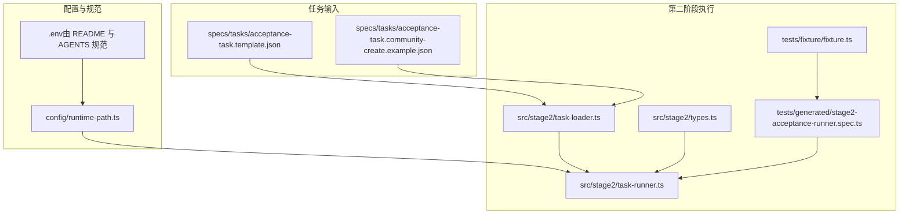
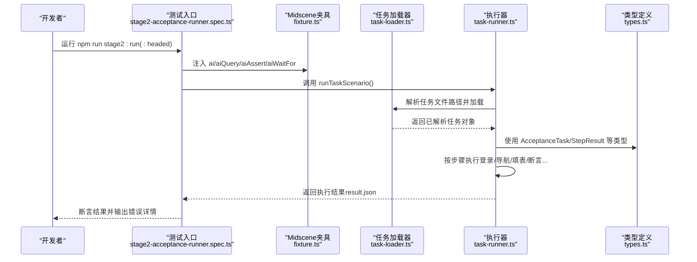
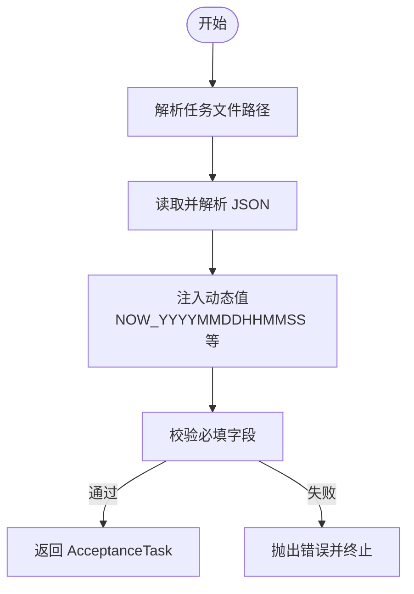
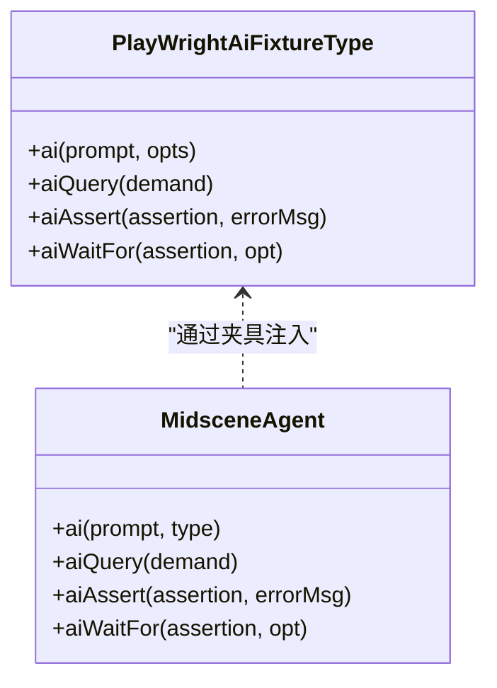
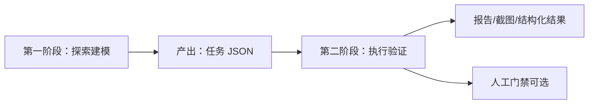
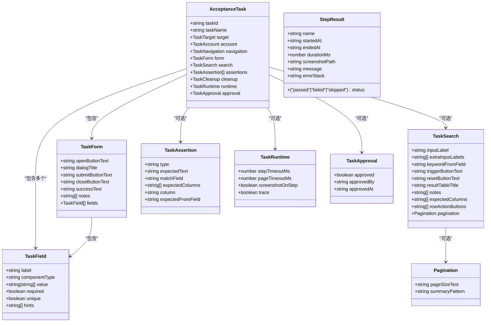
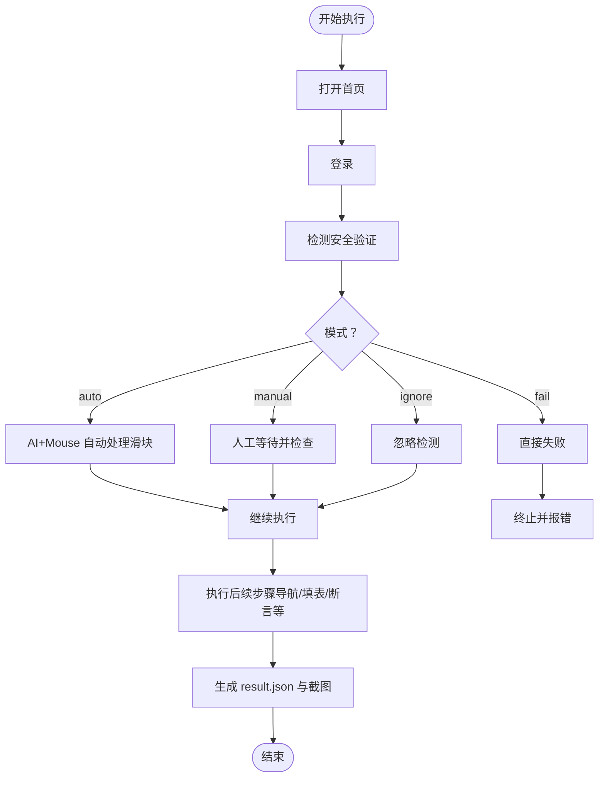
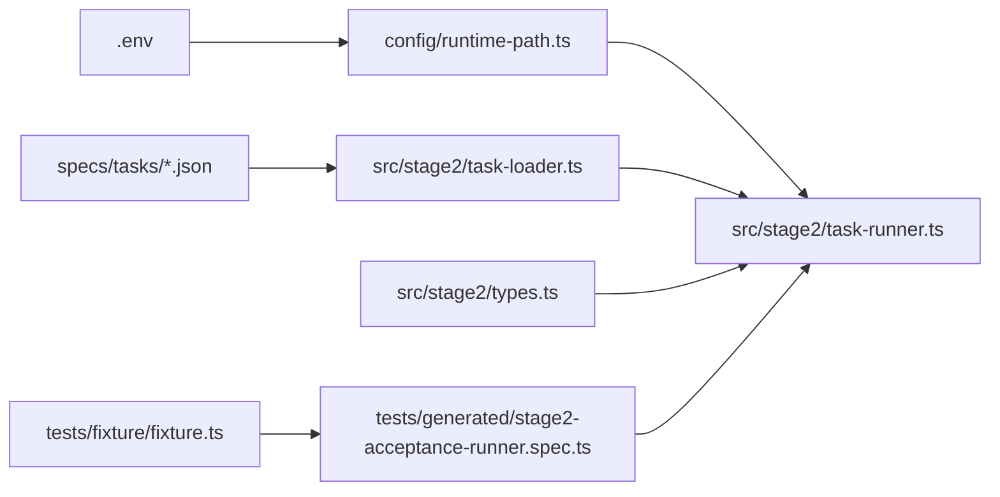

# 核心概念

<cite>
**本文引用的文件**
- [README.md](file://README.md)
- [package.json](file://package.json)
- [AGENTS.md](file://AGENTS.md)
- [.tasks/AI自主代理验收系统开发改造方案_2026-03-11.md](file://.tasks/AI自主代理验收系统开发改造方案_2026-03-11.md)
- [.plans/stage2登录安全验证人工兜底方案_2026-03-12.md](file://.plans/stage2登录安全验证人工兜底方案_2026-03-12.md)
- [config/runtime-path.ts](file://config/runtime-path.ts)
- [specs/tasks/acceptance-task.template.json](file://specs/tasks/acceptance-task.template.json)
- [specs/tasks/acceptance-task.community-create.example.json](file://specs/tasks/acceptance-task.community-create.example.json)
- [src/stage2/types.ts](file://src/stage2/types.ts)
- [src/stage2/task-loader.ts](file://src/stage2/task-loader.ts)
- [src/stage2/task-runner.ts](file://src/stage2/task-runner.ts)
- [tests/fixture/fixture.ts](file://tests/fixture/fixture.ts)
- [tests/generated/stage2-acceptance-runner.spec.ts](file://tests/generated/stage2-acceptance-runner.spec.ts)
</cite>

## 目录
1. [引言](#引言)
2. [项目结构](#项目结构)
3. [核心组件](#核心组件)
4. [架构总览](#架构总览)
5. [详细组件分析](#详细组件分析)
6. [依赖关系分析](#依赖关系分析)
7. [性能考量](#性能考量)
8. [故障排查指南](#故障排查指南)
9. [结论](#结论)
10. [附录](#附录)

## 引言
本文件面向 HI-TEST 项目的核心概念与实践，围绕“任务驱动测试”“AI 辅助自动化”“同仓双阶段开发模式”三大主题，系统阐述如何将自然语言业务场景转化为可执行的结构化任务，并通过 Midscene.js 与 Playwright 实现页面元素识别、结构化数据提取与智能断言。文档同时介绍 AcceptanceTask 任务模型的完整结构与关键数据模型（TaskField、TaskForm、StepResult 等），并通过具体文件路径与流程图帮助开发者快速理解与落地。

## 项目结构
项目采用“同仓双阶段”组织方式：第一阶段探索建模，第二阶段执行验证。第二阶段以 JSON 任务为输入，通过执行器驱动 Midscene.js 与 Playwright 完成端到端自动化。

图表来源
- [config/runtime-path.ts](file://config/runtime-path.ts#L1-L41)
- [specs/tasks/acceptance-task.template.json](file://specs/tasks/acceptance-task.template.json#L1-L85)
- [specs/tasks/acceptance-task.community-create.example.json](file://specs/tasks/acceptance-task.community-create.example.json#L1-L184)
- [src/stage2/task-loader.ts](file://src/stage2/task-loader.ts#L1-L91)
- [src/stage2/types.ts](file://src/stage2/types.ts#L1-L125)
- [src/stage2/task-runner.ts](file://src/stage2/task-runner.ts#L1-L1344)
- [tests/fixture/fixture.ts](file://tests/fixture/fixture.ts#L1-L100)
- [tests/generated/stage2-acceptance-runner.spec.ts](file://tests/generated/stage2-acceptance-runner.spec.ts#L1-L39)

章节来源
- [README.md](file://README.md#L1-L144)
- [AGENTS.md](file://AGENTS.md#L1-L61)

## 核心组件
- 任务模型与加载器：负责解析任务 JSON、注入动态值、校验必填项并加载为可执行任务对象。
- 执行器：按步骤编排登录、导航、弹窗填表、提交、搜索与断言，统一记录步骤日志、截图与结果。
- Midscene + Playwright 夹具：提供 ai、aiQuery、aiAssert、aiWaitFor 等能力，支撑页面元素识别与智能断言。
- 运行时路径与产物：统一收敛 t_runtime/ 目录下的报告、截图、中间结果与结构化输出。

章节来源
- [src/stage2/types.ts](file://src/stage2/types.ts#L1-L125)
- [src/stage2/task-loader.ts](file://src/stage2/task-loader.ts#L1-L91)
- [src/stage2/task-runner.ts](file://src/stage2/task-runner.ts#L1-L1344)
- [tests/fixture/fixture.ts](file://tests/fixture/fixture.ts#L1-L100)
- [config/runtime-path.ts](file://config/runtime-path.ts#L1-L41)

## 架构总览
第二阶段执行链路以“任务 JSON -> 加载与校验 -> 步骤编排 -> Midscene + Playwright 执行 -> 结果落盘”为主线，贯穿登录安全验证、菜单导航、弹窗表单、列表回查与断言。

图表来源
- [tests/generated/stage2-acceptance-runner.spec.ts](file://tests/generated/stage2-acceptance-runner.spec.ts#L1-L39)
- [tests/fixture/fixture.ts](file://tests/fixture/fixture.ts#L1-L100)
- [src/stage2/task-loader.ts](file://src/stage2/task-loader.ts#L1-L91)
- [src/stage2/task-runner.ts](file://src/stage2/task-runner.ts#L1062-L1344)
- [src/stage2/types.ts](file://src/stage2/types.ts#L86-L125)

章节来源
- [README.md](file://README.md#L93-L144)
- [package.json](file://package.json#L1-L24)

## 详细组件分析

### 任务驱动测试：从自然语言到结构化任务
- 任务输入采用 JSON 结构，包含目标系统、账号信息、导航路径、表单字段、断言与运行时参数等。
- 任务加载器负责：
  - 解析任务文件路径（支持绝对/相对路径与环境变量覆盖）
  - 注入动态值（如时间戳占位符）
  - 校验必填字段，确保任务可执行
- 示例任务模板与示例场景分别位于：
  - [specs/tasks/acceptance-task.template.json](file://specs/tasks/acceptance-task.template.json#L1-L85)
  - [specs/tasks/acceptance-task.community-create.example.json](file://specs/tasks/acceptance-task.community-create.example.json#L1-L184)

图表来源
- [src/stage2/task-loader.ts](file://src/stage2/task-loader.ts#L71-L91)
- [specs/tasks/acceptance-task.template.json](file://specs/tasks/acceptance-task.template.json#L1-L85)
- [specs/tasks/acceptance-task.community-create.example.json](file://specs/tasks/acceptance-task.community-create.example.json#L1-L184)

章节来源
- [src/stage2/task-loader.ts](file://src/stage2/task-loader.ts#L1-L91)
- [.tasks/AI自主代理验收系统开发改造方案_2026-03-11.md](file://.tasks/AI自主代理验收系统开发改造方案_2026-03-11.md#L193-L230)

### AI 辅助自动化：Midscene.js 的页面识别与断言
- Midscene 夹具提供 ai、aiQuery、aiAssert、aiWaitFor 等能力，统一在测试夹具中注入，供执行器按步骤调用。
- aiQuery 用于从页面提取结构化数据（如列表行数据），aiAssert 用于执行智能断言，aiWaitFor 用于等待页面状态变化。
- 执行器在关键步骤中调用上述能力，例如：
  - 登录与安全验证处理
  - 弹窗表单填写与校验
  - 列表搜索与数据提取
  - 断言类型路由（toast、表格行存在、单元格相等/包含）

图表来源
- [tests/fixture/fixture.ts](file://tests/fixture/fixture.ts#L23-L99)
- [src/stage2/task-runner.ts](file://src/stage2/task-runner.ts#L1020-L1060)

章节来源
- [tests/fixture/fixture.ts](file://tests/fixture/fixture.ts#L1-L100)
- [README.md](file://README.md#L100-L116)

### 同仓双阶段开发模式：探索与执行的统一
- 第一阶段（探索建模）：输入自然语言与基础信息，AI 探索页面、截图、提取元素与流程，人工补充与复核，产出执行计划与任务 JSON。
- 第二阶段（执行验证）：读取任务 JSON，Midscene + Playwright 执行步骤，生成报告、日志与结构化结果。
- 人工门禁：当 STAGE2_REQUIRE_APPROVAL=true 时，任务 JSON 需声明 approval.approved=true，否则第二阶段拒绝执行。

图表来源
- [.tasks/AI自主代理验收系统开发改造方案_2026-03-11.md](file://.tasks/AI自主代理验收系统开发改造方案_2026-03-11.md#L434-L463)

章节来源
- [.tasks/AI自主代理验收系统开发改造方案_2026-03-11.md](file://.tasks/AI自主代理验收系统开发改造方案_2026-03-11.md#L434-L463)

### AcceptanceTask 任务模型与关键数据结构
- AcceptanceTask：顶层任务对象，包含 taskId、taskName、target、account、navigation、form、search、assertions、cleanup、runtime、approval 等字段。
- TaskField：表单字段定义，含 label、componentType、value、required、unique、hints 等。
- TaskForm：弹窗表单定义，含 openButtonText、dialogTitle、submitButtonText、closeButtonText、successText、notes、fields。
- TaskSearch：搜索区定义，含 inputLabel、extraInputLabels、keywordFromField、triggerButtonText、resetButtonText、resultTableTitle、notes、expectedColumns、rowActionButtons、pagination。
- TaskAssertion：断言类型与参数，支持 toast、table-row-exists、table-cell-equals、table-cell-contains 等。
- TaskRuntime：运行时参数，如 stepTimeoutMs、pageTimeoutMs、screenshotOnStep、trace。
- TaskApproval：审批信息，包含 approved、approvedBy、approvedAt。
- StepResult：步骤执行结果，包含 name、status、startedAt、endedAt、durationMs、screenshotPath、message、errorStack。

图表来源
- [src/stage2/types.ts](file://src/stage2/types.ts#L5-L125)

章节来源
- [src/stage2/types.ts](file://src/stage2/types.ts#L1-L125)

### 执行器：步骤编排与安全验证
- 执行器按步骤编排：打开首页、登录、处理安全验证、等待首页就绪、点击菜单、打开弹窗、填写字段、提交表单、关闭弹窗、搜索列表、提取快照、执行断言。
- 安全验证处理：支持 auto/manual/fail/ignore 四种模式，自动模式通过 aiQuery 获取滑块位置与滑槽宽度，使用 mouse API 模拟真人拖动轨迹（easeOut 缓动 + 随机抖动），最多重试 3 次。
- 失败处理：每步捕获异常，记录截图、消息与堆栈，支持可选步骤（required=false）降级为 skipped。

图表来源
- [src/stage2/task-runner.ts](file://src/stage2/task-runner.ts#L58-L72)
- [src/stage2/task-runner.ts](file://src/stage2/task-runner.ts#L558-L703)
- [.plans/stage2登录安全验证人工兜底方案_2026-03-12.md](file://.plans/stage2登录安全验证人工兜底方案_2026-03-12.md#L16-L48)

章节来源
- [src/stage2/task-runner.ts](file://src/stage2/task-runner.ts#L1062-L1344)
- [.plans/stage2登录安全验证人工兜底方案_2026-03-12.md](file://.plans/stage2登录安全验证人工兜底方案_2026-03-12.md#L1-L57)

### 断言与数据提取：从页面到结构化结果
- 断言类型路由：toast、table-row-exists、table-cell-equals、table-cell-contains，其余未知类型回退到 aiAssert 文本断言。
- 列表数据提取：使用 aiQuery 提取列表快照（如前 N 行的关键字段），随后以代码断言进行硬化校验。
- 运行时参数：支持 stepTimeoutMs/pageTimeoutMs/screenshotOnStep/trace 等，影响步骤等待与截图策略。

章节来源
- [src/stage2/task-runner.ts](file://src/stage2/task-runner.ts#L1020-L1060)
- [src/stage2/task-runner.ts](file://src/stage2/task-runner.ts#L1305-L1311)

## 依赖关系分析
- 运行时路径统一：通过 config/runtime-path.ts 读取 .env 中的目录配置，统一收敛 t_runtime/ 下的产物目录。
- 任务文件解析：src/stage2/task-loader.ts 依赖环境变量与时间戳占位符，确保任务可复用且具备动态性。
- 执行器依赖：task-runner.ts 依赖夹具提供的 ai/aiQuery/aiAssert/aiWaitFor 能力，以及 types.ts 中的任务模型定义。
- 测试入口：tests/generated/stage2-acceptance-runner.spec.ts 作为第二段执行入口，调用 runTaskScenario 并断言最终结果。

图表来源
- [config/runtime-path.ts](file://config/runtime-path.ts#L1-L41)
- [src/stage2/task-loader.ts](file://src/stage2/task-loader.ts#L1-L91)
- [src/stage2/task-runner.ts](file://src/stage2/task-runner.ts#L1-L1344)
- [src/stage2/types.ts](file://src/stage2/types.ts#L1-L125)
- [tests/fixture/fixture.ts](file://tests/fixture/fixture.ts#L1-L100)
- [tests/generated/stage2-acceptance-runner.spec.ts](file://tests/generated/stage2-acceptance-runner.spec.ts#L1-L39)

章节来源
- [README.md](file://README.md#L74-L116)
- [AGENTS.md](file://AGENTS.md#L22-L46)

## 性能考量
- 步骤粒度与等待策略：将长流程拆分为细粒度步骤，配合 aiWaitFor 与显式等待，减少 AI 幻觉与定位失败带来的重试成本。
- 截图与日志：按需开启 screenshotOnStep 与 trace，平衡可观测性与磁盘占用。
- 缓动与抖动：自动滑块拖动采用 easeOut 缓动与随机抖动，提升通过率并降低被风控概率。
- 超时与重试：为关键步骤设置合理超时与最大重试次数，避免长时间卡死。

## 故障排查指南
- 登录后出现滑块/安全验证
  - 检查 STAGE2_CAPTCHA_MODE 与 STAGE2_CAPTCHA_WAIT_TIMEOUT_MS 设置
  - 自动模式下观察 Midscene 报告与截图，确认滑块位置与滑槽宽度识别是否成功
  - 若自动失败，切换 manual 模式并延长等待时间
- 步骤失败定位
  - 查看 result.json 与 result.partial.json 中的 steps 数组，定位最后失败步骤
  - 检查该步骤截图与 errorStack，结合页面文案与 hints 优化提示词
- 产物目录与报告
  - Playwright HTML 报告与 Midscene 报告统一收敛至 t_runtime/ 下，确保 .gitignore 与 CI 上传路径同步

章节来源
- [.plans/stage2登录安全验证人工兜底方案_2026-03-12.md](file://.plans/stage2登录安全验证人工兜底方案_2026-03-12.md#L54-L57)
- [README.md](file://README.md#L74-L116)
- [tests/generated/stage2-acceptance-runner.spec.ts](file://tests/generated/stage2-acceptance-runner.spec.ts#L27-L36)

## 结论
HI-TEST 项目通过“任务驱动 + AI 辅助 + 双阶段统一”的方式，将自然语言业务场景转化为可执行、可复用、可回溯的自动化流程。借助 Midscene.js 的页面识别与智能断言能力，结合结构化的 AcceptanceTask 模型与稳定的执行器，项目实现了从探索到执行的闭环，为后续扩展前端页面与任务中心奠定了坚实基础。

## 附录
- 运行命令与入口
  - npm run stage2:run / npm run stage2:run:headed
  - 入口文件：tests/generated/stage2-acceptance-runner.spec.ts
- 产物目录
  - t_runtime/test-results、t_runtime/playwright-report、t_runtime/midscene_run、t_runtime/acceptance-results
- 任务模板与示例
  - acceptance-task.template.json、acceptance-task.community-create.example.json

章节来源
- [README.md](file://README.md#L106-L144)
- [package.json](file://package.json#L6-L9)