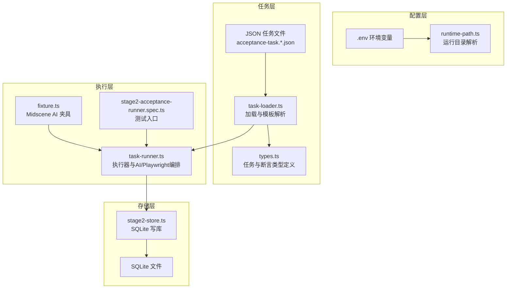
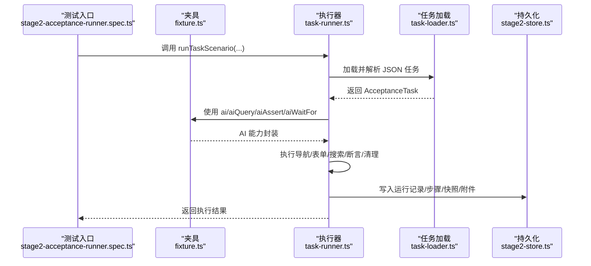
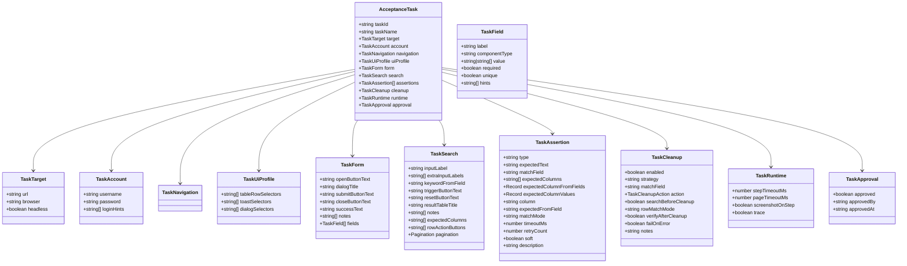
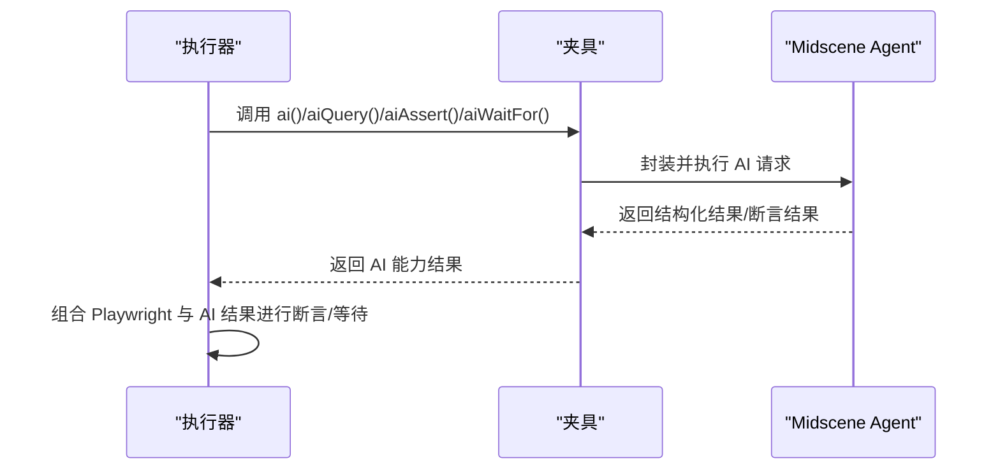
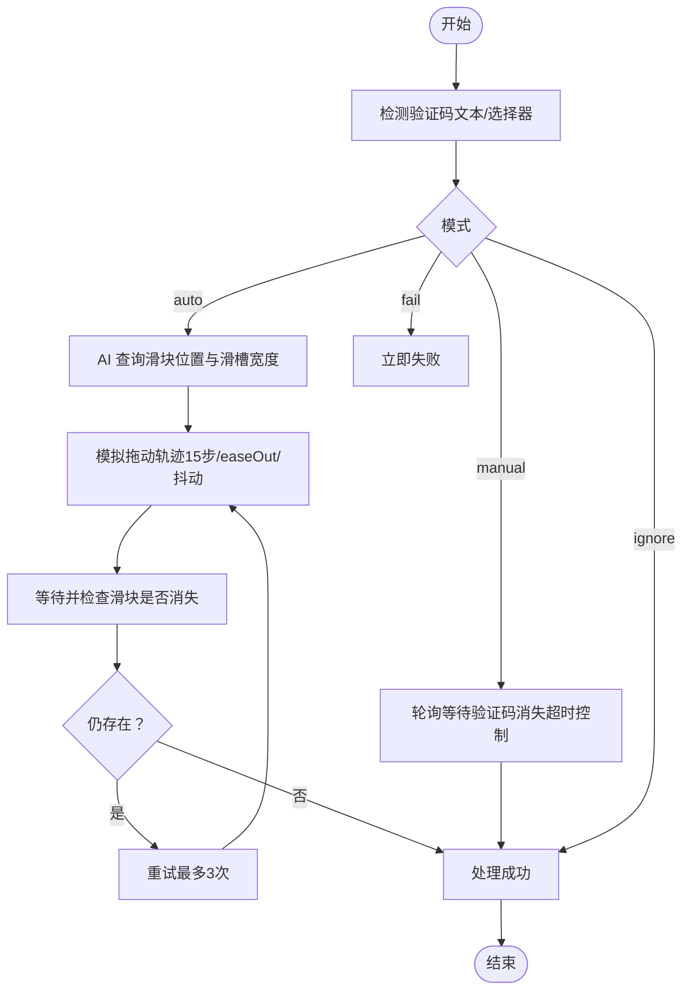
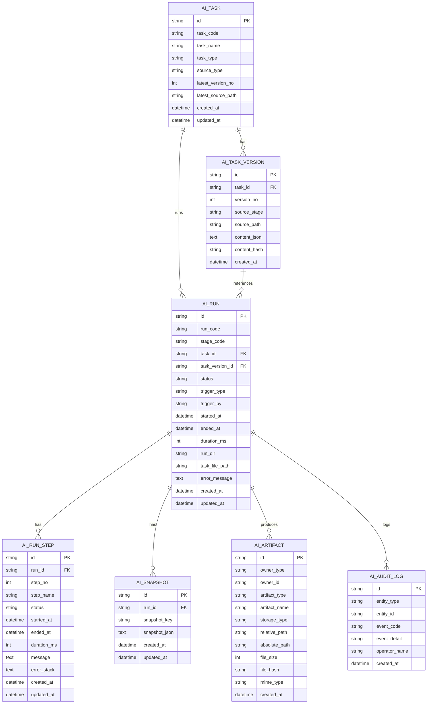
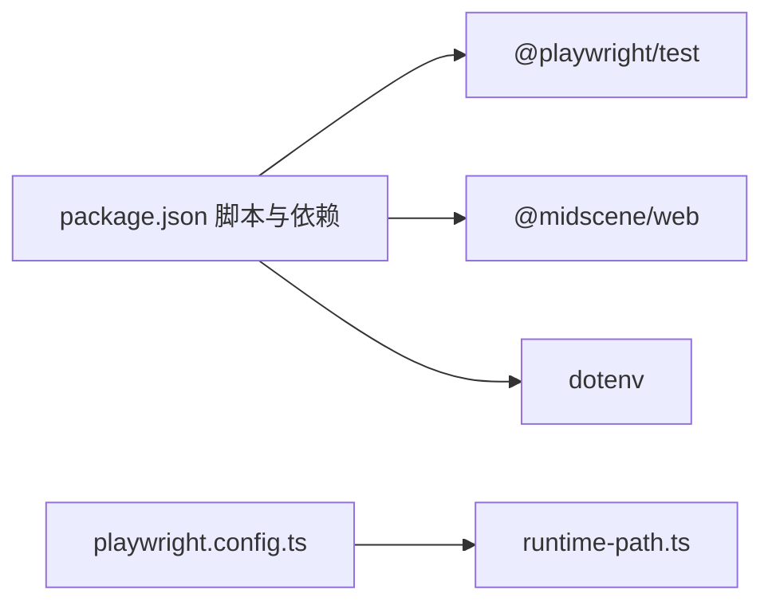

# 核心概念

<cite>
**本文引用的文件**
- [README.md](file://README.md)
- [package.json](file://package.json)
- [playwright.config.ts](file://playwright.config.ts)
- [src/stage2/types.ts](file://src/stage2/types.ts)
- [src/stage2/task-runner.ts](file://src/stage2/task-runner.ts)
- [src/stage2/task-loader.ts](file://src/stage2/task-loader.ts)
- [src/persistence/stage2-store.ts](file://src/persistence/stage2-store.ts)
- [config/runtime-path.ts](file://config/runtime-path.ts)
- [specs/tasks/acceptance-task.template.json](file://specs/tasks/acceptance-task.template.json)
- [specs/tasks/acceptance-task.community-create.example.json](file://specs/tasks/acceptance-task.community-create.example.json)
- [tests/generated/stage2-acceptance-runner.spec.ts](file://tests/generated/stage2-acceptance-runner.spec.ts)
- [tests/fixture/fixture.ts](file://tests/fixture/fixture.ts)
- [AGENTS.md](file://AGENTS.md)
- [specs/basic-operations.md](file://specs/basic-operations.md)
- [specs/login-e2e.md](file://specs/login-e2e.md)
</cite>

## 目录
1. [引言](#引言)
2. [项目结构](#项目结构)
3. [核心组件](#核心组件)
4. [架构总览](#架构总览)
5. [详细组件分析](#详细组件分析)
6. [依赖关系分析](#依赖关系分析)
7. [性能考量](#性能考量)
8. [故障排查指南](#故障排查指南)
9. [结论](#结论)
10. [附录](#附录)

## 引言
本文件面向 HI-TEST 项目，系统阐述 AI 自动化测试的基础理论与实践，重点覆盖：
- AI 能力在测试中的应用场景与优势
- JSON 任务模型的设计思想与使用方法
- Midscene.js AI 能力的集成方式与最佳实践
- 验证码处理机制（滑块验证码）与跨平台 UI 兼容策略
- 数据持久化与运行产物管理
- 丰富的示例与应用场景，帮助开发者快速理解与落地

## 项目结构
HI-TEST 采用“配置驱动 + JSON 任务 + Midscene AI + Playwright”的分层架构：
- 配置层：通过 .env 与 runtime-path.ts 统一管理运行产物目录与开关
- 任务层：以 JSON 任务定义业务流程与断言
- 执行层：task-runner 解析任务、驱动 Playwright 与 Midscene AI
- 存储层：SQLite 数据库存放结构化运行数据与附件元数据
- 测试层：Playwright 测试入口与夹具封装 Midscene AI 能力

图示来源
- [config/runtime-path.ts:1-41](file://config/runtime-path.ts#L1-L41)
- [src/stage2/task-loader.ts:1-91](file://src/stage2/task-loader.ts#L1-L91)
- [src/stage2/types.ts:1-180](file://src/stage2/types.ts#L1-L180)
- [src/stage2/task-runner.ts:1-200](file://src/stage2/task-runner.ts#L1-L200)
- [tests/fixture/fixture.ts:1-100](file://tests/fixture/fixture.ts#L1-L100)
- [tests/generated/stage2-acceptance-runner.spec.ts:1-39](file://tests/generated/stage2-acceptance-runner.spec.ts#L1-L39)
- [src/persistence/stage2-store.ts:1-120](file://src/persistence/stage2-store.ts#L1-L120)

章节来源
- [README.md:1-223](file://README.md#L1-L223)
- [package.json:1-26](file://package.json#L1-L26)
- [playwright.config.ts:1-95](file://playwright.config.ts#L1-L95)
- [config/runtime-path.ts:1-41](file://config/runtime-path.ts#L1-L41)

## 核心组件
- JSON 任务模型：以结构化 JSON 描述目标站点、账号、导航、表单、搜索、断言与清理策略，支持模板变量与跨平台 UI Profile
- Midscene AI 能力：通过夹具暴露 ai、aiQuery、aiAssert、aiWaitFor，实现“描述式操作 + 结构化查询 + AI 断言”
- 执行器：task-runner 负责任务解析、页面交互、AI/Playwright 编排、断言与清理
- 数据持久化：stage2-store 将运行主记录、步骤明细、快照与附件写入 SQLite
- 运行产物：统一收敛至 t_runtime/ 下的多目录，便于报告与审计

章节来源
- [src/stage2/types.ts:1-180](file://src/stage2/types.ts#L1-L180)
- [src/stage2/task-runner.ts:1-200](file://src/stage2/task-runner.ts#L1-L200)
- [src/persistence/stage2-store.ts:1-120](file://src/persistence/stage2-store.ts#L1-L120)
- [README.md:132-190](file://README.md#L132-L190)

## 架构总览
下图展示了从测试入口到执行器、AI 能力与持久化的端到端流程。

图示来源
- [tests/generated/stage2-acceptance-runner.spec.ts:1-39](file://tests/generated/stage2-acceptance-runner.spec.ts#L1-L39)
- [tests/fixture/fixture.ts:1-100](file://tests/fixture/fixture.ts#L1-L100)
- [src/stage2/task-runner.ts:1-200](file://src/stage2/task-runner.ts#L1-L200)
- [src/stage2/task-loader.ts:1-91](file://src/stage2/task-loader.ts#L1-L91)
- [src/persistence/stage2-store.ts:1-120](file://src/persistence/stage2-store.ts#L1-L120)

## 详细组件分析

### JSON 任务模型与使用方法
- 设计思想
  - 以“任务即配置”的方式，将业务流程结构化，便于跨团队协作与版本管理
  - 支持模板变量（如 NOW_YYYYMMDDHHMMSS）与环境变量注入，提升可移植性
  - 通过 uiProfile 提供跨框架选择器优先级，增强 UI 兼容性
- 关键字段
  - target/account/navigation：目标站点、账号与导航提示
  - form/search/assertions/cleanup：表单填写、搜索、断言与清理策略
  - runtime/approval：运行时超时、截图与审批信息
- 使用方法
  - 通过 STAGE2_TASK_FILE 指定任务文件，task-loader 负责加载与模板解析
  - 执行器读取任务并驱动页面交互与断言

图示来源
- [src/stage2/types.ts:1-180](file://src/stage2/types.ts#L1-L180)

章节来源
- [src/stage2/types.ts:1-180](file://src/stage2/types.ts#L1-L180)
- [src/stage2/task-loader.ts:1-91](file://src/stage2/task-loader.ts#L1-L91)
- [specs/tasks/acceptance-task.template.json:1-141](file://specs/tasks/acceptance-task.template.json#L1-L141)
- [specs/tasks/acceptance-task.community-create.example.json:1-229](file://specs/tasks/acceptance-task.community-create.example.json#L1-L229)

### Midscene.js AI 能力集成与最佳实践
- 集成方式
  - 通过夹具 fixture.ts 将 Midscene Agent 注入到测试上下文，暴露 ai、aiQuery、aiAssert、aiWaitFor
  - 在执行器中以 RunnerContext 组合使用，实现“Playwright 硬检测优先 + AI 兜底”的策略
- 核心 API 与使用场景
  - ai：描述式动作（如“点击按钮”、“在弹窗中输入字段”），适合 UI 不稳定或复杂交互
  - aiQuery：结构化查询（如“返回滑块位置信息”），用于 AI 辅助定位与决策
  - aiAssert：AI 断言（如“检查页面是否存在提示信息”），适合 Playwright 难以覆盖的场景
  - aiWaitFor：等待条件满足（仅在常规等待不适用时使用），避免硬编码轮询
- 最佳实践
  - 断言优先使用 Playwright 硬检测；复杂语义场景使用 aiQuery + 代码断言，降低幻觉风险
  - table-row-exists 作为硬门槛；table-cell-* 仅校验少量关键列，建议 soft=true
  - AI 操作作为兜底，不建议所有步骤都直接依赖自由文本 AI 操作

图示来源
- [tests/fixture/fixture.ts:1-100](file://tests/fixture/fixture.ts#L1-L100)
- [src/stage2/task-runner.ts:1-200](file://src/stage2/task-runner.ts#L1-L200)

章节来源
- [README.md:139-153](file://README.md#L139-L153)
- [tests/fixture/fixture.ts:1-100](file://tests/fixture/fixture.ts#L1-L100)
- [src/stage2/task-runner.ts:1024-1599](file://src/stage2/task-runner.ts#L1024-L1599)

### 验证码处理机制（滑块验证码）
- 模式与配置
  - auto：AI 自动处理滑块（默认）。使用 aiQuery 识别滑块位置与滑槽宽度，Playwright 模拟真人拖动轨迹
  - manual：检测到验证码后等待人工完成，再继续执行
  - fail：检测到验证码立即失败
  - ignore：忽略验证码检测（不建议）
- 自动处理流程
  - 检测验证码文本/选择器 → aiQuery 获取滑块位置与滑槽宽度 → Playwright mouse 模拟拖动（15 步、easeOut、抖动）→ 验证是否消失 → 最多重试 3 次
- 人工兜底与超时控制
  - manual 模式下按 STAGE2_CAPTCHA_WAIT_TIMEOUT_MS 轮询等待验证码消失，超时则失败

图示来源
- [src/stage2/task-runner.ts:483-706](file://src/stage2/task-runner.ts#L483-L706)

章节来源
- [README.md:56-74](file://README.md#L56-L74)
- [src/stage2/task-runner.ts:483-706](file://src/stage2/task-runner.ts#L483-L706)

### 跨平台 UI 兼容性设计
- 通用化字段
  - uiProfile.tableRowSelectors、uiProfile.toastSelectors、uiProfile.dialogSelectors：为不同 UI 框架提供选择器优先级列表
  - assertions[].matchMode：行匹配模式（exact/contains）
  - cleanup.rowMatchMode：清理时行匹配模式（建议 exact）
  - cleanup.verifyAfterCleanup：删除后是否强制校验目标行消失（建议 true）
- 适配策略
  - 优先使用 Playwright 硬检测（getByRole/getByLabel/getByTestId + 自动重试）
  - 对复杂语义场景使用 aiQuery + 代码断言
  - 表格断言优先尝试 Playwright 表格列值提取与代码比对，失败后再降级到 AI 结构化断言

章节来源
- [README.md:191-201](file://README.md#L191-L201)
- [src/stage2/task-runner.ts:1027-1599](file://src/stage2/task-runner.ts#L1027-L1599)

### 数据持久化与运行产物
- 目录收敛
  - 所有运行产物统一由 .env 管理，收敛至 t_runtime/ 下：Playwright 输出、HTML 报告、Midscene 报告、结果与数据库
- 数据模型
  - ai_task、ai_task_version、ai_run、ai_run_step、ai_snapshot、ai_artifact、ai_audit_log
- 写库流程
  - 初始化任务与版本记录 → 创建运行记录 → 步骤执行中写入步骤与截图 → 完成后写入最终结果与摘要
  - 敏感字段（如账号密码）入库前做掩码处理，原始任务文件以文件路径形式保留

图示来源
- [src/persistence/stage2-store.ts:1-120](file://src/persistence/stage2-store.ts#L1-L120)

章节来源
- [README.md:97-131](file://README.md#L97-L131)
- [src/persistence/stage2-store.ts:1-120](file://src/persistence/stage2-store.ts#L1-L120)

## 依赖关系分析
- 运行时依赖
  - Playwright：UI 自动化与报告
  - Midscene.js：AI 定位、提取、断言能力
  - dotenv：环境变量加载
- 项目脚本
  - db:init/db:migrate：数据库初始化与迁移
  - stage2:run/stage2:run:headed：第二段任务执行入口
- 配置与报告
  - playwright.config.ts：测试配置、报告器与设备项目
  - runtime-path.ts：运行产物目录解析

图示来源
- [package.json:1-26](file://package.json#L1-L26)
- [playwright.config.ts:1-95](file://playwright.config.ts#L1-L95)
- [config/runtime-path.ts:1-41](file://config/runtime-path.ts#L1-L41)

章节来源
- [package.json:1-26](file://package.json#L1-L26)
- [playwright.config.ts:1-95](file://playwright.config.ts#L1-L95)

## 性能考量
- 断言重试与轮询
  - 默认断言超时与重试次数可配置，避免瞬时波动导致误判
  - 断言轮询间隔与 Playwright 硬检测结合，平衡稳定性与性能
- 截图与追踪
  - 运行时可开启每步截图与 trace，便于问题定位但会增加 IO 与存储开销
- 选择器与匹配策略
  - 优先使用精确匹配与框架特定选择器，减少 DOM 遍历成本
  - 表格断言尽量利用 Playwright 的列值提取，避免全量结构化解析

## 故障排查指南
- 常见问题与定位
  - 任务文件缺失字段：task-loader 会在加载时校验 taskId、taskName、target.url、account、form.fields 等关键字段
  - 验证码处理失败：检查 aiQuery 返回与拖动轨迹；必要时切换 manual 模式或增大等待超时
  - 断言不稳定：适当提高断言超时与重试次数；优先使用 Playwright 硬检测
  - 运行产物缺失：确认 .env 中运行目录变量与 runtime-path.ts 解析一致
- 日志与报告
  - Midscene 报告与 Playwright HTML 报告分别位于 t_runtime/midscene_run/report 与 t_runtime/playwright-report
  - SQLite 数据库位于 t_runtime/db/hi_test.sqlite，可审计运行状态与失败步骤

章节来源
- [src/stage2/task-loader.ts:50-89](file://src/stage2/task-loader.ts#L50-L89)
- [README.md:76-131](file://README.md#L76-L131)
- [src/stage2/task-runner.ts:650-706](file://src/stage2/task-runner.ts#L650-L706)
- [src/persistence/stage2-store.ts:592-630](file://src/persistence/stage2-store.ts#L592-L630)

## 结论
HI-TEST 通过“配置驱动 + Midscene AI + Playwright”的组合，实现了高鲁棒性的 AI 自动化测试体系。JSON 任务模型使业务流程可描述、可复用、可审计；跨平台 UI 兼容策略与断言重试机制提升了稳定性；数据持久化与统一产物目录为回归与审计提供了坚实支撑。建议在复杂语义场景优先采用 aiQuery + 代码断言，在常规 UI 场景坚持 Playwright 硬检测优先，将 AI 作为可靠的兜底手段。

## 附录
- 示例与场景
  - 物业平台新增小区验收任务：演示完整的表单填写、搜索、断言与清理流程
  - TodoMVC 基础操作测试计划：提供端到端测试思路与步骤
  - 登录 E2E 测试计划：涵盖成功登录与密码错误两种场景

章节来源
- [specs/tasks/acceptance-task.community-create.example.json:1-229](file://specs/tasks/acceptance-task.community-create.example.json#L1-L229)
- [specs/basic-operations.md:1-34](file://specs/basic-operations.md#L1-L34)
- [specs/login-e2e.md:1-152](file://specs/login-e2e.md#L1-L152)
- [AGENTS.md:1-61](file://AGENTS.md#L1-L61)