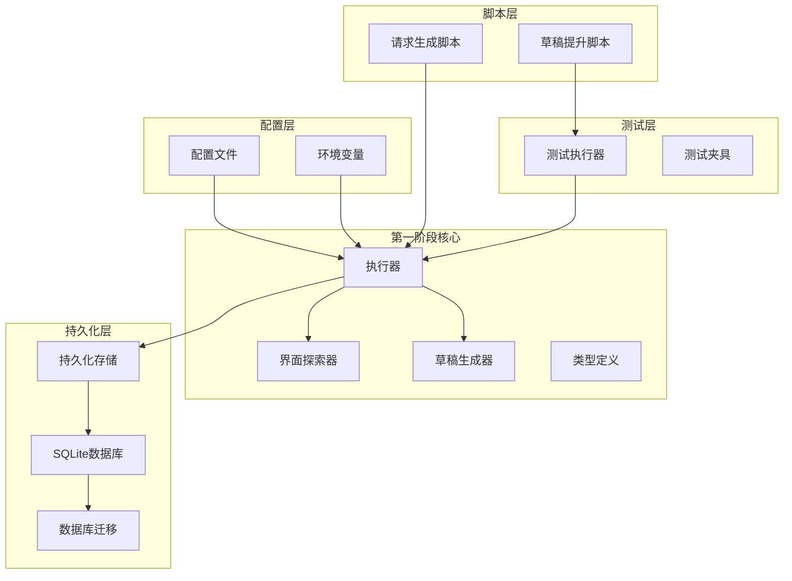
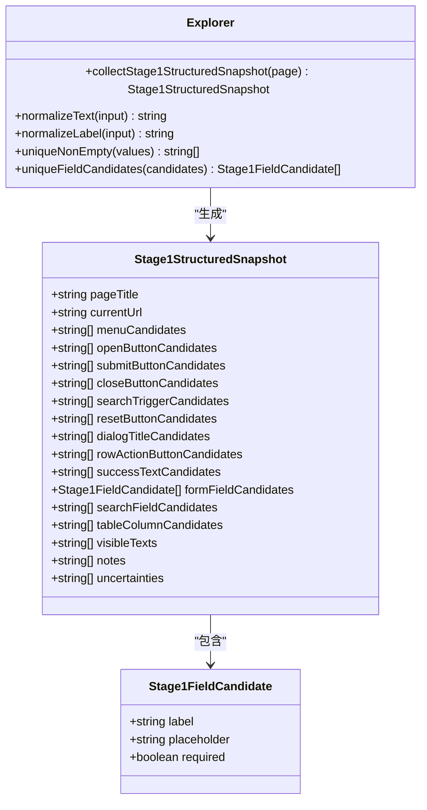
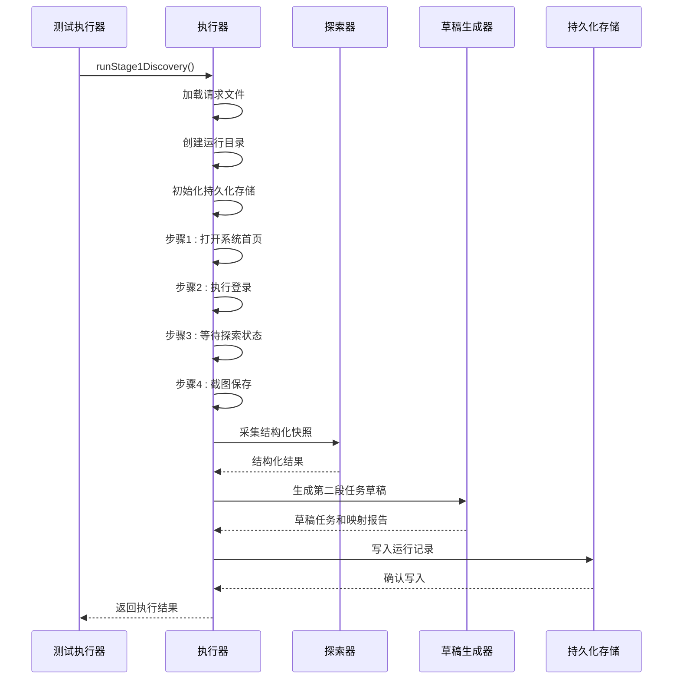
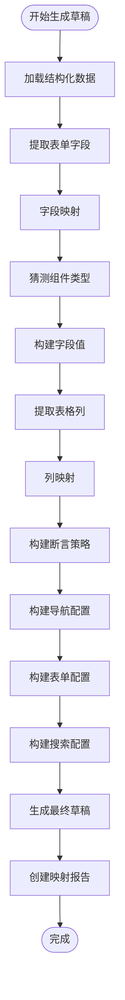
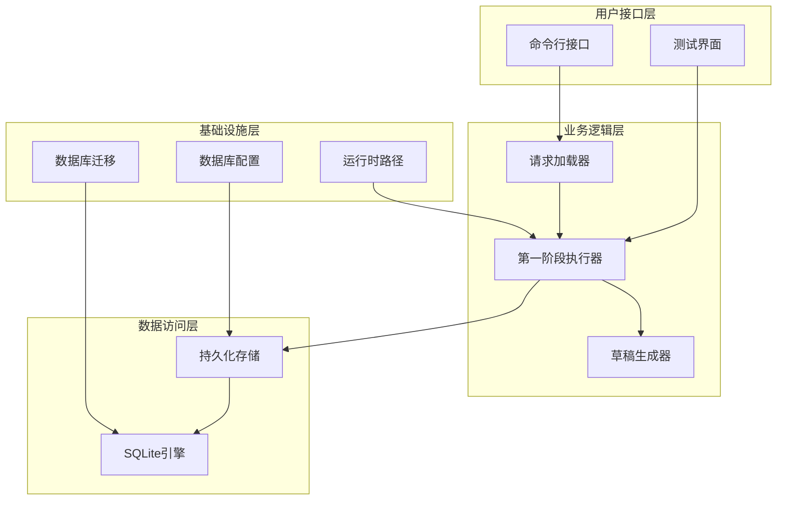
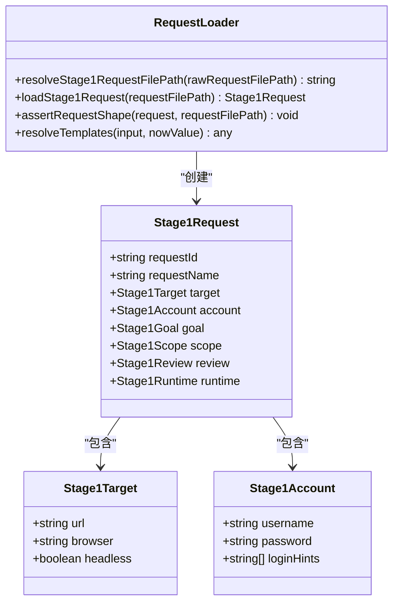
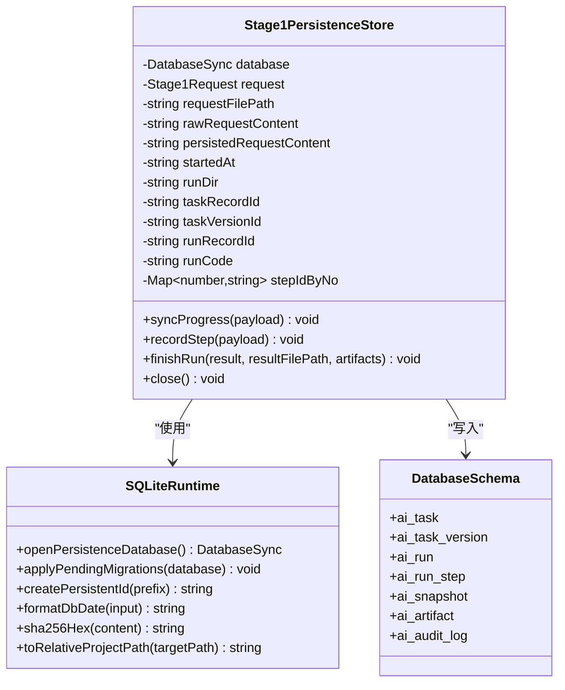
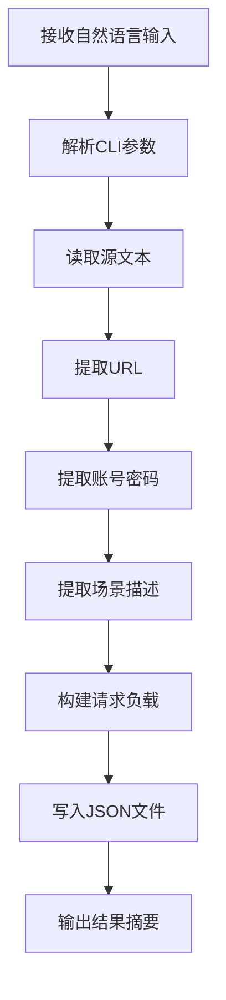
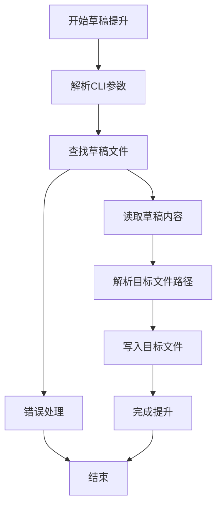
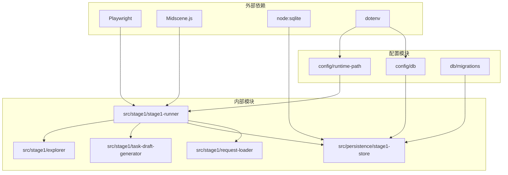

# 第一阶段探索建模系统

<cite>
**本文档引用的文件**
- [README.md](file://README.md)
- [package.json](file://package.json)
- [src/stage1/explorer.ts](file://src/stage1/explorer.ts)
- [src/stage1/stage1-runner.ts](file://src/stage1/stage1-runner.ts)
- [src/stage1/task-draft-generator.ts](file://src/stage1/task-draft-generator.ts)
- [src/stage1/types.ts](file://src/stage1/types.ts)
- [src/stage1/request-loader.ts](file://src/stage1/request-loader.ts)
- [src/persistence/stage1-store.ts](file://src/persistence/stage1-store.ts)
- [src/persistence/sqlite-runtime.ts](file://src/persistence/sqlite-runtime.ts)
- [config/runtime-path.ts](file://config/runtime-path.ts)
- [config/db.ts](file://config/db.ts)
- [scripts/stage1/generate-request.mjs](file://scripts/stage1/generate-request.mjs)
- [scripts/stage1/promote-draft.mjs](file://scripts/stage1/promote-draft.mjs)
- [tests/generated/stage1-discovery-runner.spec.ts](file://tests/generated/stage1-discovery-runner.spec.ts)
- [specs/stage1/stage1-request.template.json](file://specs/stage1/stage1-request.template.json)
- [db/migrations/001_global_persistence_init.sql](file://db/migrations/001_global_persistence_init.sql)
</cite>

## 目录
1. [简介](#简介)
2. [项目结构](#项目结构)
3. [核心组件](#核心组件)
4. [架构概览](#架构概览)
5. [详细组件分析](#详细组件分析)
6. [依赖关系分析](#依赖关系分析)
7. [性能考虑](#性能考虑)
8. [故障排除指南](#故障排除指南)
9. [结论](#结论)

## 简介

第一阶段探索建模系统是基于 Playwright 和 Midscene.js 构建的 AI 自动化测试项目的核心模块。该系统旨在通过 AI 技术自动探索 Web 应用界面，提取结构化信息并生成第二阶段执行任务的草稿。

系统采用分阶段设计，第一阶段专注于界面探索和结构化建模，第二阶段负责执行预定义的任务流程。通过智能的字段映射和断言策略生成，为后续的自动化测试提供了高质量的基础。

## 项目结构

项目采用模块化的组织方式，主要分为以下几个核心部分：

**图表来源**
- [src/stage1/stage1-runner.ts:115-376](file://src/stage1/stage1-runner.ts#L115-L376)
- [src/persistence/stage1-store.ts:86-715](file://src/persistence/stage1-store.ts#L86-L715)

**章节来源**
- [README.md:1-307](file://README.md#L1-L307)
- [package.json:1-30](file://package.json#L1-L30)

## 核心组件

### 界面探索器 (Explorer)

界面探索器负责从页面中提取结构化信息，包括按钮、表单字段、表格列等关键 UI 元素。

**图表来源**
- [src/stage1/explorer.ts:37-310](file://src/stage1/explorer.ts#L37-L310)
- [src/stage1/types.ts:75-93](file://src/stage1/types.ts#L75-L93)

### 执行器 (Stage1Runner)

执行器是第一阶段的核心协调器，负责管理完整的探索流程。

**图表来源**
- [src/stage1/stage1-runner.ts:115-376](file://src/stage1/stage1-runner.ts#L115-L376)
- [src/stage1/explorer.ts:37-310](file://src/stage1/explorer.ts#L37-L310)
- [src/stage1/task-draft-generator.ts:150-348](file://src/stage1/task-draft-generator.ts#L150-L348)

### 草稿生成器 (DraftGenerator)

草稿生成器根据探索结果自动生成第二阶段执行任务的草稿。

**图表来源**
- [src/stage1/task-draft-generator.ts:150-348](file://src/stage1/task-draft-generator.ts#L150-L348)

**章节来源**
- [src/stage1/explorer.ts:1-310](file://src/stage1/explorer.ts#L1-L310)
- [src/stage1/stage1-runner.ts:1-376](file://src/stage1/stage1-runner.ts#L1-L376)
- [src/stage1/task-draft-generator.ts:1-348](file://src/stage1/task-draft-generator.ts#L1-L348)

## 架构概览

系统采用分层架构设计，确保各组件职责清晰、耦合度低：

**图表来源**
- [src/stage1/stage1-runner.ts:115-376](file://src/stage1/stage1-runner.ts#L115-L376)
- [src/persistence/stage1-store.ts:86-715](file://src/persistence/stage1-store.ts#L86-L715)
- [config/runtime-path.ts:1-46](file://config/runtime-path.ts#L1-L46)
- [config/db.ts:1-28](file://config/db.ts#L1-L28)

## 详细组件分析

### 请求加载器 (RequestLoader)

请求加载器负责解析和验证第一阶段的请求配置文件。

**图表来源**
- [src/stage1/request-loader.ts:79-89](file://src/stage1/request-loader.ts#L79-L89)
- [src/stage1/types.ts:39-48](file://src/stage1/types.ts#L39-L48)

### 持久化存储 (PersistenceStore)

持久化存储模块负责将执行过程和结果写入数据库。

**图表来源**
- [src/persistence/stage1-store.ts:86-715](file://src/persistence/stage1-store.ts#L86-L715)
- [src/persistence/sqlite-runtime.ts:73-116](file://src/persistence/sqlite-runtime.ts#L73-L116)
- [db/migrations/001_global_persistence_init.sql:1-128](file://db/migrations/001_global_persistence_init.sql#L1-L128)

### 脚本工具

系统提供了两个重要的脚本工具来支持第一阶段的工作流：

#### 请求生成脚本

**图表来源**
- [scripts/stage1/generate-request.mjs:253-280](file://scripts/stage1/generate-request.mjs#L253-L280)

#### 草稿提升脚本

**图表来源**
- [scripts/stage1/promote-draft.mjs:147-184](file://scripts/stage1/promote-draft.mjs#L147-L184)

**章节来源**
- [src/stage1/request-loader.ts:1-89](file://src/stage1/request-loader.ts#L1-L89)
- [src/persistence/stage1-store.ts:1-729](file://src/persistence/stage1-store.ts#L1-L729)
- [scripts/stage1/generate-request.mjs:1-280](file://scripts/stage1/generate-request.mjs#L1-L280)
- [scripts/stage1/promote-draft.mjs:1-184](file://scripts/stage1/promote-draft.mjs#L1-L184)

## 依赖关系分析

系统的关键依赖关系如下：

**图表来源**
- [package.json:19-29](file://package.json#L19-L29)
- [src/stage1/stage1-runner.ts:1-20](file://src/stage1/stage1-runner.ts#L1-L20)
- [src/persistence/stage1-store.ts:1-17](file://src/persistence/stage1-store.ts#L1-L17)

**章节来源**
- [package.json:1-30](file://package.json#L1-L30)
- [README.md:3-50](file://README.md#L3-L50)

## 性能考虑

系统在设计时充分考虑了性能优化：

1. **异步处理**: 所有网络请求和文件操作都采用异步方式，避免阻塞主线程
2. **内存管理**: 合理的垃圾回收策略，及时释放不再使用的对象
3. **数据库优化**: 使用 SQLite 的事务机制批量写入，减少磁盘 I/O
4. **缓存策略**: 对重复的数据进行缓存，避免重复计算
5. **超时控制**: 为每个步骤设置合理的超时时间，防止长时间阻塞

## 故障排除指南

### 常见问题及解决方案

#### 数据库连接问题
- **症状**: 初始化持久化存储时抛出异常
- **原因**: 数据库文件路径配置错误或权限不足
- **解决**: 检查 `DB_FILE_PATH` 环境变量配置，确保目录存在且有写权限

#### 页面元素识别失败
- **症状**: 界面探索器无法识别预期的 UI 元素
- **原因**: 页面结构变化或选择器不匹配
- **解决**: 更新选择器配置，检查页面加载状态

#### 草稿生成错误
- **症状**: 草稿生成器抛出映射错误
- **原因**: 探索结果不完整或字段映射算法冲突
- **解决**: 手动调整映射规则，增加人工复核步骤

**章节来源**
- [src/persistence/stage1-store.ts:137-145](file://src/persistence/stage1-store.ts#L137-L145)
- [src/stage1/explorer.ts:48-59](file://src/stage1/explorer.ts#L48-L59)
- [src/stage1/task-draft-generator.ts:95-144](file://src/stage1/task-draft-generator.ts#L95-L144)

## 结论

第一阶段探索建模系统通过智能化的界面探索和结构化建模，为后续的自动化测试奠定了坚实基础。系统采用模块化设计，具有良好的扩展性和维护性。

关键优势包括：
- **智能化探索**: 自动识别 UI 元素并生成结构化快照
- **智能草稿生成**: 基于探索结果自动生成第二阶段执行任务
- **完善的持久化**: 全面记录执行过程和结果，便于追溯和分析
- **灵活的配置**: 支持多种配置方式，适应不同的使用场景

未来可以进一步优化的方向包括：增强 AI 识别能力、优化性能表现、扩展支持更多的 UI 框架等。