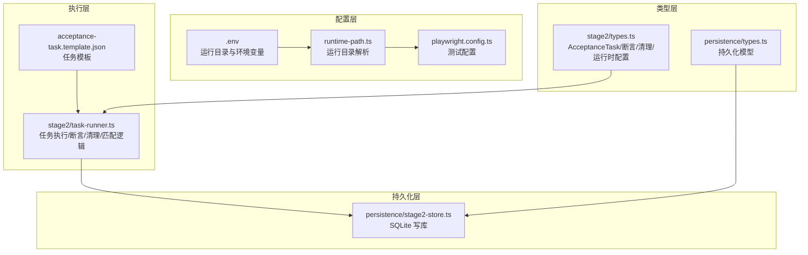
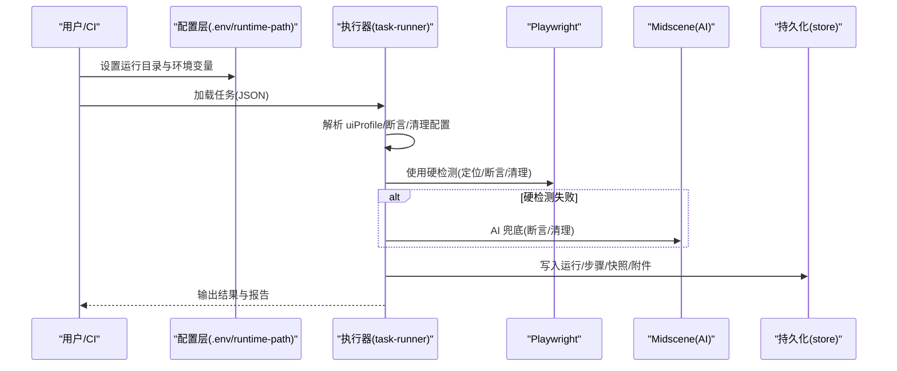
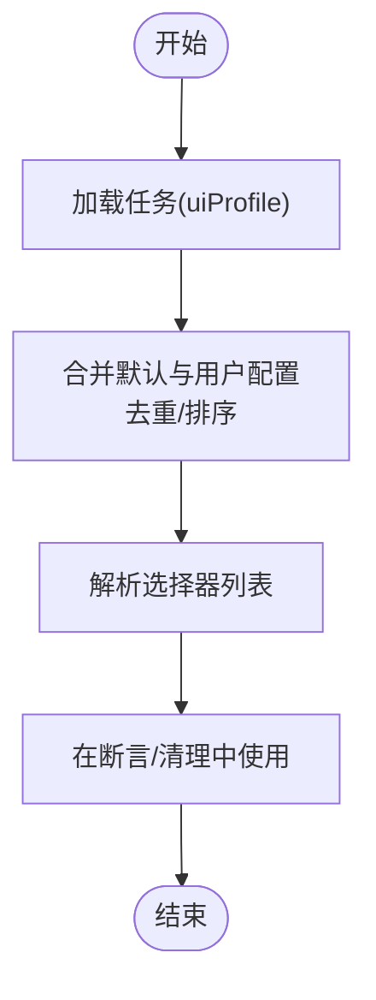
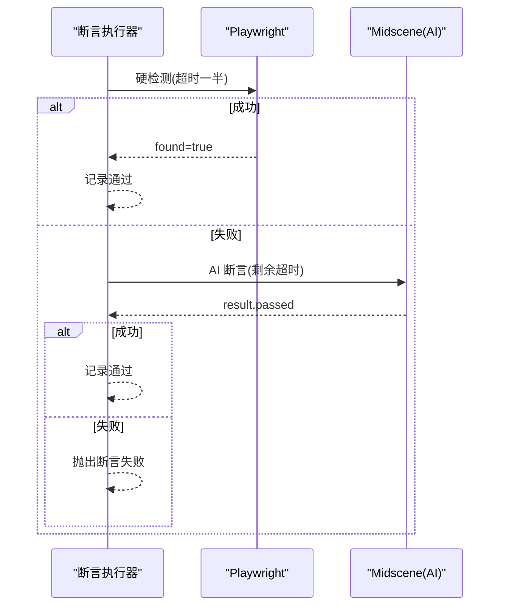
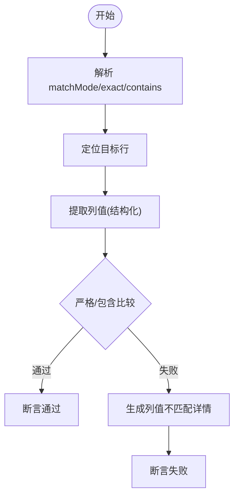
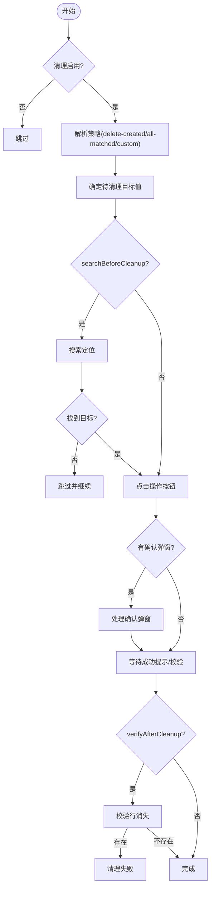
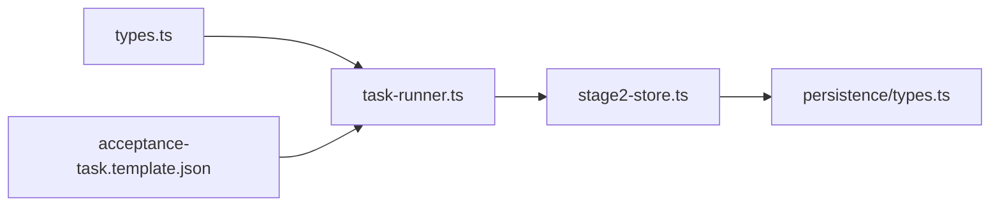

# 跨平台 UI 兼容性

<cite>
**本文引用的文件**
- [README.md](file://README.md)
- [playwright.config.ts](file://playwright.config.ts)
- [src/stage2/types.ts](file://src/stage2/types.ts)
- [src/stage2/task-runner.ts](file://src/stage2/task-runner.ts)
- [specs/tasks/acceptance-task.template.json](file://specs/tasks/acceptance-task.template.json)
- [config/runtime-path.ts](file://config/runtime-path.ts)
- [src/persistence/types.ts](file://src/persistence/types.ts)
- [src/persistence/stage2-store.ts](file://src/persistence/stage2-store.ts)
</cite>

## 目录
1. [引言](#引言)
2. [项目结构](#项目结构)
3. [核心组件](#核心组件)
4. [架构总览](#架构总览)
5. [详细组件分析](#详细组件分析)
6. [依赖关系分析](#依赖关系分析)
7. [性能考量](#性能考量)
8. [故障排查指南](#故障排查指南)
9. [结论](#结论)
10. [附录](#附录)

## 引言
本项目围绕“跨平台 UI 兼容性”目标，提供一套可在多 UI 框架（Element Plus、Ant Design、iView 等）之间稳定工作的自动化测试体系。其核心在于：
- 通过 uiProfile 配置为不同框架提供统一的选择器优先级列表，屏蔽框架差异；
- 在断言与清理流程中引入 matchMode（exact/contains）与统一的行匹配逻辑；
- 采用 Playwright 硬检测优先 + AI 断言兜底的混合策略，兼顾稳定性与可扩展性；
- 提供可复用的清理流程，支持删除后校验与失败控制。

## 项目结构
项目采用分层组织，核心集中在 stage2 执行器与任务 JSON 驱动：
- 配置层：环境变量与运行目录管理
- 类型层：任务结构与断言/清理配置的强类型定义
- 执行层：任务加载、断言与清理的统一实现
- 持久化层：运行结果与中间快照的本地 SQLite 存储

**图表来源**
- [playwright.config.ts:1-95](file://playwright.config.ts#L1-L95)
- [config/runtime-path.ts:1-41](file://config/runtime-path.ts#L1-L41)
- [src/stage2/types.ts:1-180](file://src/stage2/types.ts#L1-L180)
- [src/stage2/task-runner.ts:1-2657](file://src/stage2/task-runner.ts#L1-L2657)
- [specs/tasks/acceptance-task.template.json:1-141](file://specs/tasks/acceptance-task.template.json#L1-L141)
- [src/persistence/types.ts:1-125](file://src/persistence/types.ts#L1-L125)
- [src/persistence/stage2-store.ts:1-655](file://src/persistence/stage2-store.ts#L1-L655)

**章节来源**
- [README.md:132-229](file://README.md#L132-L229)
- [playwright.config.ts:1-95](file://playwright.config.ts#L1-L95)
- [config/runtime-path.ts:1-41](file://config/runtime-path.ts#L1-L41)

## 核心组件
- uiProfile 配置：为表格行、消息提示、弹窗容器分别提供跨平台选择器优先级列表，便于在不同 UI 框架间无缝切换。
- 断言引擎：支持 toast、table-row-exists、table-cell-equals、table-cell-contains、custom 等类型，内置 Playwright 硬检测 + AI 兜底的重试机制。
- 清理引擎：支持删除单条/全部匹配数据，删除后可强制校验行消失，失败可选择中断流程。
- 匹配模式：matchMode（exact/contains）与 rowMatchMode（断言与清理）统一行匹配策略，提升稳定性与可维护性。

**章节来源**
- [README.md:191-201](file://README.md#L191-L201)
- [src/stage2/types.ts:58-126](file://src/stage2/types.ts#L58-L126)
- [src/stage2/task-runner.ts:1027-1126](file://src/stage2/task-runner.ts#L1027-L1126)

## 架构总览
系统以任务 JSON 为驱动，通过执行器解析 uiProfile 与断言/清理配置，结合 Playwright 与 Midscene 的能力，实现跨平台 UI 的稳定测试。

**图表来源**
- [src/stage2/task-runner.ts:1562-1917](file://src/stage2/task-runner.ts#L1562-L1917)
- [src/stage2/task-runner.ts:2218-2316](file://src/stage2/task-runner.ts#L2218-L2316)
- [src/persistence/stage2-store.ts:470-630](file://src/persistence/stage2-store.ts#L470-L630)

## 详细组件分析

### uiProfile 与选择器适配机制
- 表格行选择器优先级：默认包含常见框架的行选择器，可通过 uiProfile.tableRowSelectors 进行覆盖与扩展。
- 消息提示选择器优先级：默认包含 Element Plus、Ant Design、iView 等框架的消息/通知选择器。
- 弹窗容器选择器优先级：默认包含对话框、确认弹窗等容器选择器，可按平台补充。

**图表来源**
- [src/stage2/task-runner.ts:1071-1090](file://src/stage2/task-runner.ts#L1071-L1090)
- [specs/tasks/acceptance-task.template.json:29-45](file://specs/tasks/acceptance-task.template.json#L29-L45)

**章节来源**
- [src/stage2/task-runner.ts:1027-1090](file://src/stage2/task-runner.ts#L1027-L1090)
- [specs/tasks/acceptance-task.template.json:29-45](file://specs/tasks/acceptance-task.template.json#L29-L45)

### 断言执行器（Playwright 硬检测优先 + AI 兜底）
- 支持类型：toast、table-row-exists、table-cell-equals、table-cell-contains、custom。
- 策略：先用 Playwright 硬检测，失败则使用 AI 断言，支持重试与软断言。
- 行匹配：通过 matchMode 控制 exact/contains，避免误匹配。

**图表来源**
- [src/stage2/task-runner.ts:1562-1917](file://src/stage2/task-runner.ts#L1562-L1917)

**章节来源**
- [src/stage2/task-runner.ts:1562-1917](file://src/stage2/task-runner.ts#L1562-L1917)

### 行匹配与列值断言
- 行匹配：支持 exact 与 contains 两种模式，优先在单元格内匹配，否则回退到整行文本。
- 列值断言：table-cell-equals 采用结构化列值提取与严格比对，避免“仅匹配到行即通过”的误判。
- 包含断言：table-cell-contains 基于返回的 cellValue 做包含判断，增强灵活性。

**图表来源**
- [src/stage2/task-runner.ts:1235-1272](file://src/stage2/task-runner.ts#L1235-L1272)
- [src/stage2/task-runner.ts:1697-1787](file://src/stage2/task-runner.ts#L1697-L1787)
- [src/stage2/task-runner.ts:1810-1871](file://src/stage2/task-runner.ts#L1810-L1871)

**章节来源**
- [src/stage2/task-runner.ts:1154-1272](file://src/stage2/task-runner.ts#L1154-L1272)
- [src/stage2/task-runner.ts:1697-1871](file://src/stage2/task-runner.ts#L1697-L1871)

### 清理流程（删除/自定义 + 删除后校验）
- 支持策略：delete-created、delete-all-matched、custom、none。
- 删除后校验：默认开启 verifyAfterCleanup，确保行消失；也可仅依赖成功提示文本。
- 失败控制：failOnError 控制清理失败是否中断任务。
- 搜索前置：searchBeforeCleanup 可在清理前进行搜索定位，提高成功率。

**图表来源**
- [src/stage2/task-runner.ts:2218-2316](file://src/stage2/task-runner.ts#L2218-L2316)
- [src/stage2/task-runner.ts:1927-2072](file://src/stage2/task-runner.ts#L1927-L2072)

**章节来源**
- [src/stage2/task-runner.ts:2218-2316](file://src/stage2/task-runner.ts#L2218-L2316)
- [src/stage2/task-runner.ts:1927-2072](file://src/stage2/task-runner.ts#L1927-L2072)

### matchMode 参数在断言中的应用
- exact：严格相等匹配，适合唯一标识（如编号、名称）。
- contains：包含匹配，适合模糊关键字或结构化文本（如“省/市/区”路径）。
- 推荐实践：
  - 表格行匹配优先使用 exact，降低误删风险；
  - 搜索/提示类断言可使用 contains，提升鲁棒性。

**章节来源**
- [src/stage2/types.ts:78-87](file://src/stage2/types.ts#L78-L87)
- [src/stage2/types.ts:119-122](file://src/stage2/types.ts#L119-L122)
- [README.md:146-152](file://README.md#L146-L152)

### cleanup.rowMatchMode 与 cleanup.verifyAfterCleanup
- rowMatchMode：清理时的行匹配模式，建议使用 exact 以避免误匹配。
- verifyAfterCleanup：删除后是否强制校验目标行消失，建议开启以保证数据一致性。
- failOnError：清理失败是否中断任务，建议在关键数据清理时开启。

**章节来源**
- [src/stage2/types.ts:119-122](file://src/stage2/types.ts#L119-L122)
- [src/stage2/task-runner.ts:2086-2090](file://src/stage2/task-runner.ts#L2086-L2090)
- [specs/tasks/acceptance-task.template.json:107-128](file://specs/tasks/acceptance-task.template.json#L107-L128)

### 配置示例与最佳实践
- uiProfile 示例：在任务 JSON 中为表格行、消息提示、弹窗容器分别提供优先级列表，覆盖 Element Plus、Ant Design、iView。
- 断言示例：使用 toast/table-row-exists/table-cell-equals/table-cell-contains/custom 等类型，合理设置 timeoutMs/retryCount/soft。
- 清理示例：启用 cleanup，配置 action（删除按钮文案、确认弹窗标题/按钮、成功提示），并开启 verifyAfterCleanup。

**章节来源**
- [specs/tasks/acceptance-task.template.json:29-128](file://specs/tasks/acceptance-task.template.json#L29-L128)
- [README.md:191-201](file://README.md#L191-L201)

## 依赖关系分析
- 类型依赖：AcceptanceTask 依赖 TaskUiProfile/TaskAssertion/TaskCleanup 等类型，统一断言与清理配置。
- 执行依赖：task-runner 依赖 Playwright 与 Midscene 能力，结合 uiProfile 与 matchMode 实现跨平台兼容。
- 持久化依赖：运行结果与快照写入 SQLite，支持审计与回溯。

**图表来源**
- [src/stage2/types.ts:141-154](file://src/stage2/types.ts#L141-L154)
- [src/stage2/task-runner.ts:1-50](file://src/stage2/task-runner.ts#L1-L50)
- [src/persistence/stage2-store.ts:1-50](file://src/persistence/stage2-store.ts#L1-L50)

**章节来源**
- [src/stage2/types.ts:141-154](file://src/stage2/types.ts#L141-L154)
- [src/stage2/task-runner.ts:1-50](file://src/stage2/task-runner.ts#L1-L50)
- [src/persistence/stage2-store.ts:1-50](file://src/persistence/stage2-store.ts#L1-L50)

## 性能考量
- 重试与轮询：断言与清理均采用重试与轮询策略，建议合理设置 timeoutMs/retryCount，避免过度重试导致执行时间过长。
- 选择器解析：uiProfile 与默认选择器合并后一次性解析，减少重复计算。
- 截图与报告：运行产物目录集中管理，避免磁盘碎片与 IO 抖动。

[本节为通用指导，无需特定文件引用]

## 故障排查指南
- 断言失败：
  - 检查 matchMode 是否与目标文本特性匹配（唯一标识用 exact，关键字用 contains）。
  - 查看断言详情（列值不匹配/缺失列）并补充 expectedColumnValues/expectedColumnFromFields。
- 清理失败：
  - 确认 rowButtonText/确认弹窗标题/成功提示文案是否正确。
  - 启用 verifyAfterCleanup 并检查行是否仍存在。
  - 若失败较多，考虑开启 failOnError 中断问题任务。
- 运行产物：
  - Playwright 报告与 Midscene 报告输出至统一目录，便于定位问题。

**章节来源**
- [src/stage2/task-runner.ts:1618-1668](file://src/stage2/task-runner.ts#L1618-L1668)
- [src/stage2/task-runner.ts:1671-1787](file://src/stage2/task-runner.ts#L1671-L1787)
- [src/stage2/task-runner.ts:2077-2144](file://src/stage2/task-runner.ts#L2077-L2144)
- [README.md:160-164](file://README.md#L160-L164)

## 结论
通过 uiProfile 的跨框架选择器优先级列表、matchMode 的统一行匹配策略以及 Playwright + AI 的混合断言/清理机制，本系统能够在 Element Plus、Ant Design、iView 等多 UI 框架下构建稳定可靠的自动化测试体系。建议在关键流程中使用 exact 匹配与删除后校验，并合理配置断言超时与重试，以获得更高的稳定性与可维护性。

[本节为总结，无需特定文件引用]

## 附录
- 运行与报告：统一运行目录由 .env 与 runtime-path.ts 管理，Playwright 与 Midscene 报告输出至 t_runtime/ 目录。
- 数据持久化：SQLite 写库支持运行、步骤、快照与附件的落库，便于审计与回溯。

**章节来源**
- [README.md:76-96](file://README.md#L76-L96)
- [config/runtime-path.ts:13-41](file://config/runtime-path.ts#L13-L41)
- [src/persistence/stage2-store.ts:470-630](file://src/persistence/stage2-store.ts#L470-L630)