# AI 自动处理机制

<cite>
**本文档引用的文件**
- [task-runner.ts](file://src/stage2/task-runner.ts)
- [types.ts](file://src/stage2/types.ts)
- [stage2-acceptance-runner.spec.ts](file://tests/generated/stage2-acceptance-runner.spec.ts)
- [README.md](file://README.md)
- [.tasks/AI自主代理验收系统开发改造方案_2026-03-11.md](file://.tasks/AI自主代理验收系统开发改造方案_2026-03-11.md)
- [acceptance-task.community-create.example.json](file://specs/tasks/acceptance-task.community-create.example.json)
</cite>

## 目录
1. [简介](#简介)
2. [项目结构](#项目结构)
3. [核心组件](#核心组件)
4. [架构概览](#架构概览)
5. [详细组件分析](#详细组件分析)
6. [依赖关系分析](#依赖关系分析)
7. [性能考虑](#性能考虑)
8. [故障排除指南](#故障排除指南)
9. [结论](#结论)

## 简介

本项目基于 Playwright 和 Midscene.js 构建，实现了完整的 AI 自动处理机制，专门针对滑块验证码进行自动化处理。该机制通过 AI 查询 API 分析页面截图，获取滑块精确位置和滑槽宽度，然后使用 15 步渐进拖动算法模拟真实用户行为，实现高成功率的滑块验证自动通过。

主要特性包括：
- 基于 Midscene AI 的页面截图分析
- 智能滑块位置检测和轨迹计算
- 真人模拟拖动行为（含随机抖动）
- 多重重试机制和错误处理
- 完整的结果验证和状态跟踪

## 项目结构

项目采用模块化架构，核心功能集中在 stage2 目录中：

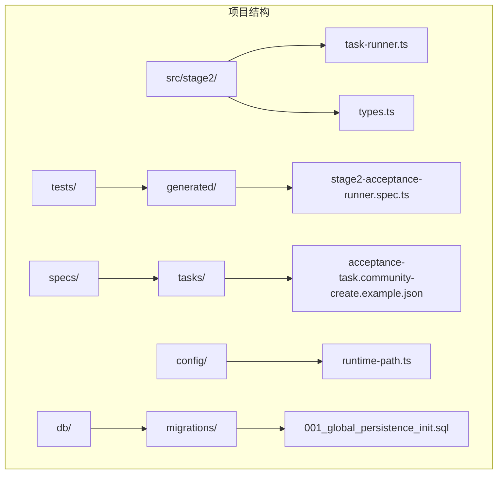

**图表来源**
- [task-runner.ts:1-50](file://src/stage2/task-runner.ts#L1-L50)
- [stage2-acceptance-runner.spec.ts:1-39](file://tests/generated/stage2-acceptance-runner.spec.ts#L1-L39)

**章节来源**
- [task-runner.ts:1-100](file://src/stage2/task-runner.ts#L1-L100)
- [README.md:1-50](file://README.md#L1-L50)

## 核心组件

### AI 自动处理引擎

系统的核心是 `autoSolveSliderCaptcha` 函数，它实现了完整的滑块验证码自动处理流程：

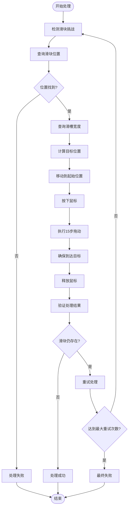

**图表来源**
- [task-runner.ts:561-648](file://src/stage2/task-runner.ts#L561-L648)

### 滑块位置查询系统

系统使用两个专门的 AI 查询函数来获取滑块信息：

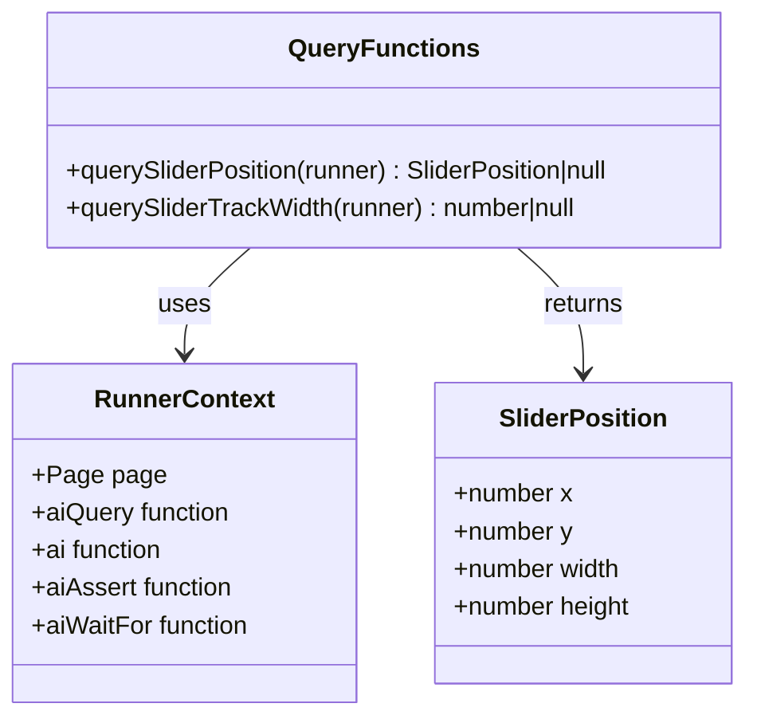

**图表来源**
- [task-runner.ts:503-559](file://src/stage2/task-runner.ts#L503-L559)

**章节来源**
- [task-runner.ts:503-559](file://src/stage2/task-runner.ts#L503-L559)

## 架构概览

系统采用分层架构设计，将 AI 智能分析与 Playwright 浏览器自动化有机结合：

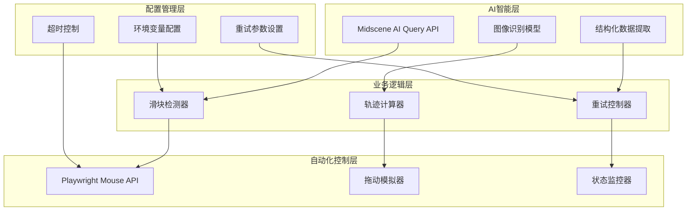

**图表来源**
- [task-runner.ts:61-87](file://src/stage2/task-runner.ts#L61-L87)
- [task-runner.ts:561-648](file://src/stage2/task-runner.ts#L561-L648)

## 详细组件分析

### 滑块位置查询组件

#### querySliderPosition 函数

该函数负责通过 AI 查询 API 获取滑块按钮的精确位置信息：

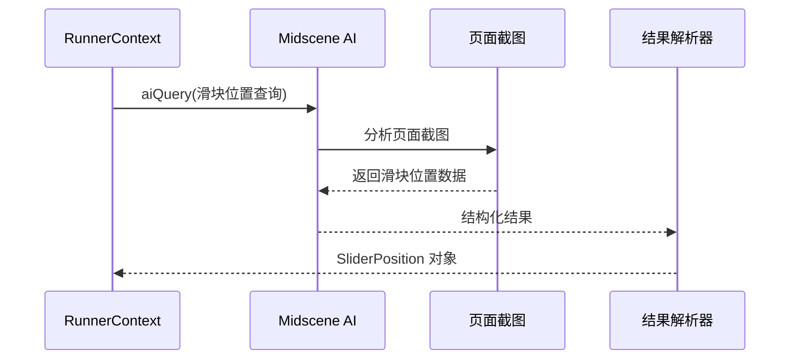

**图表来源**
- [task-runner.ts:510-538](file://src/stage2/task-runner.ts#L510-L538)

#### querySliderTrackWidth 函数

该函数专门查询滑块滑槽的总宽度：

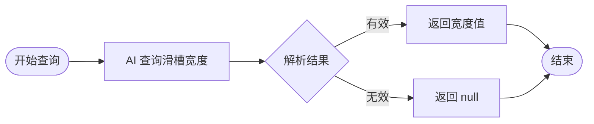

**图表来源**
- [task-runner.ts:540-559](file://src/stage2/task-runner.ts#L540-L559)

**章节来源**
- [task-runner.ts:510-559](file://src/stage2/task-runner.ts#L510-L559)

### 15步渐进拖动算法

#### 缓动函数实现

系统使用 `easeOut` 缓动函数来模拟真实用户的拖动行为：

```mermaid
flowchart TD
Start([开始拖动]) --> Init[初始化参数]
Init --> CalcDistance[计算总距离]
CalcDistance --> Steps[设置15步]
Steps --> Loop{循环步数}
Loop --> |计算进度| CalcProgress[progress = i/steps]
CalcProgress --> EaseOut[easeOut = 1-(1-progress)²]
EaseOut --> TargetX[计算目标X坐标]
TargetX --> AddJitter[添加随机抖动]
AddJitter --> MoveMouse[移动鼠标到新位置]
MoveMouse --> RandomDelay[随机延迟30-80ms]
RandomDelay --> NextStep[下一歩]
NextStep --> Loop
Loop --> |完成| EnsureTarget[确保到达目标]
EnsureTarget --> ReleaseMouse[释放鼠标]
ReleaseMouse --> End([结束])
```

**图表来源**
- [task-runner.ts:597-613](file://src/stage2/task-runner.ts#L597-L613)

#### 缓动函数数学原理

`easeOut` 函数采用二次缓动曲线，其数学表达式为：
- `easeOut(t) = 1 - (1 - t)²`
- 当 t=0 时，easeOut=0（启动时快速）
- 当 t=0.5 时，easeOut≈0.75（中间阶段保持速度）
- 当 t=1 时，easeOut=1（结束时减速）

这种缓动函数模拟了真实用户拖动滑块时的自然行为模式。

#### 随机抖动机制

系统实现精细的随机抖动来模拟真实用户的手部微小抖动：

| 方向 | 抖动范围 | 概率分布 | 实现方式 |
|------|----------|----------|----------|
| 水平 | -3 到 +3 像素 | 均匀分布 | `(Math.random() - 0.5) * 6` |
| 垂直 | -2 到 +2 像素 | 均匀分布 | `(Math.random() - 0.5) * 4` |

抖动参数经过精心调优，既能模拟真实人类行为，又不会影响滑块验证的成功率。

**章节来源**
- [task-runner.ts:597-613](file://src/stage2/task-runner.ts#L597-L613)

### 鼠标操作序列

系统严格按照真实用户操作流程执行鼠标拖动：

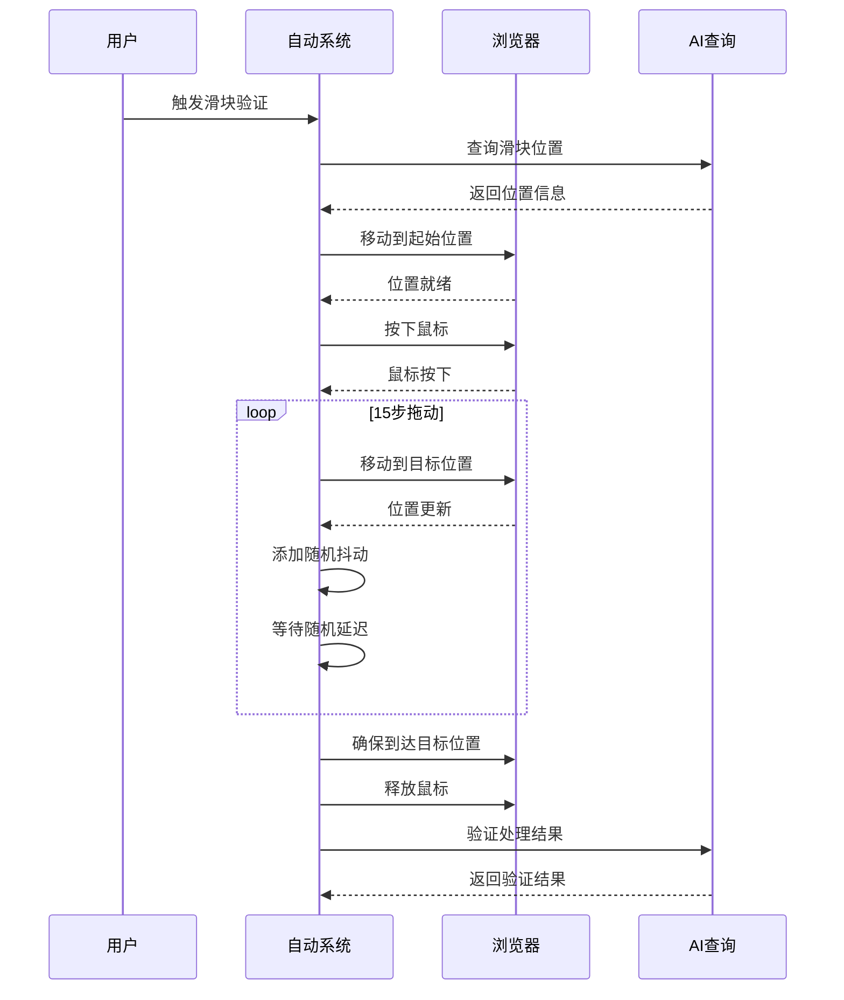

**图表来源**
- [task-runner.ts:584-621](file://src/stage2/task-runner.ts#L584-L621)

**章节来源**
- [task-runner.ts:584-621](file://src/stage2/task-runner.ts#L584-L621)

### 重试机制和错误处理

#### 多层重试策略

系统实现三层重试保护机制：

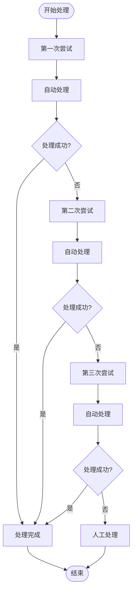

#### 错误处理策略

系统采用全面的错误处理机制：

| 错误类型 | 处理方式 | 防护措施 |
|----------|----------|----------|
| AI 查询失败 | 忽略并返回 null | try-catch 包裹 |
| 滑块位置获取失败 | 直接返回 false | 位置验证检查 |
| 拖动过程异常 | 确保释放鼠标 | finally 块确保清理 |
| 验证结果失败 | 记录日志并重试 | 最大重试次数限制 |

**章节来源**
- [task-runner.ts:668-686](file://src/stage2/task-runner.ts#L668-L686)

### 配置管理系统

#### 环境变量配置

系统支持灵活的配置管理：

| 配置项 | 默认值 | 说明 |
|--------|--------|------|
| STAGE2_CAPTCHA_MODE | auto | 滑块处理模式 |
| STAGE2_CAPTCHA_WAIT_TIMEOUT_MS | 120000 | 人工处理等待超时时间 |
| OPENAI_API_KEY | - | AI 模型访问密钥 |
| MIDSCENE_MODEL_NAME | qwen3-vl-plus | AI 模型名称 |

#### 模式切换机制

系统支持四种处理模式：

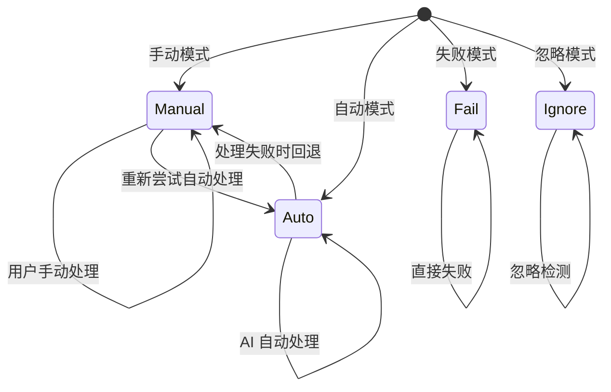

**图表来源**
- [task-runner.ts:61-75](file://src/stage2/task-runner.ts#L61-L75)

**章节来源**
- [task-runner.ts:61-87](file://src/stage2/task-runner.ts#L61-L87)
- [README.md:56-61](file://README.md#L56-L61)

## 依赖关系分析

系统依赖关系清晰，层次分明：

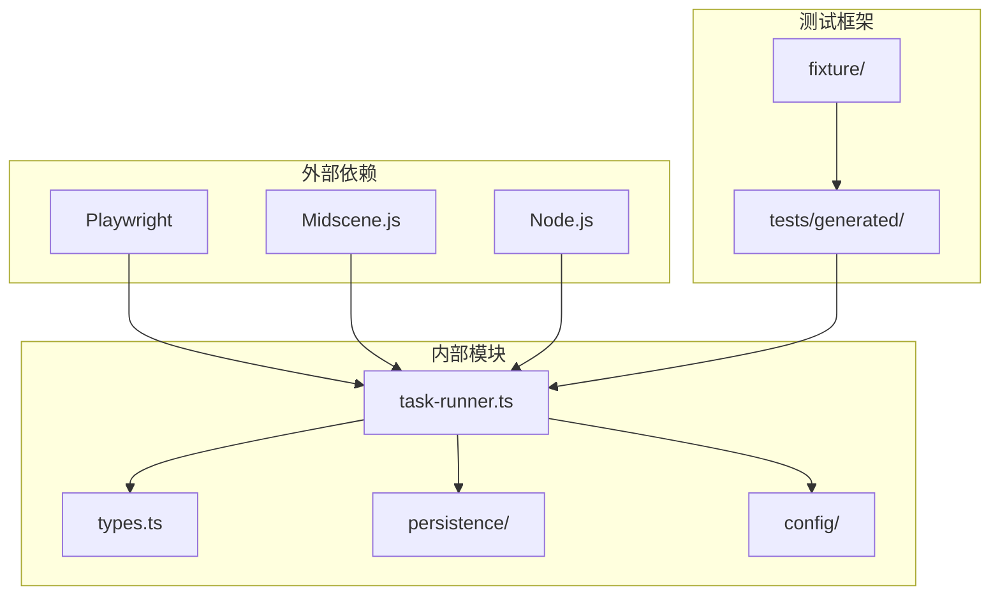

**图表来源**
- [task-runner.ts:1-16](file://src/stage2/task-runner.ts#L1-L16)
- [stage2-acceptance-runner.spec.ts:1-39](file://tests/generated/stage2-acceptance-runner.spec.ts#L1-L39)

**章节来源**
- [task-runner.ts:1-16](file://src/stage2/task-runner.ts#L1-L16)
- [stage2-acceptance-runner.spec.ts:1-39](file://tests/generated/stage2-acceptance-runner.spec.ts#L1-L39)

## 性能考虑

### 算法复杂度分析

| 组件 | 时间复杂度 | 空间复杂度 | 说明 |
|------|------------|------------|------|
| 滑块位置查询 | O(1) | O(1) | AI 查询固定耗时 |
| 轨迹计算 | O(n) | O(1) | n=15步拖动 |
| 随机抖动 | O(n) | O(1) | 每步添加抖动 |
| 重试机制 | O(k×n) | O(1) | k=最大重试次数 |

### 性能优化策略

1. **异步处理**: 所有 AI 查询和浏览器操作都是异步的
2. **智能等待**: 使用合理的等待时间避免过度等待
3. **缓存利用**: Midscene 提供的查询结果缓存机制
4. **资源管理**: 自动释放鼠标资源防止内存泄漏

## 故障排除指南

### 常见问题及解决方案

#### 滑块检测失败

**症状**: 控制台输出 "未检测到滑块位置"

**可能原因**:
- 页面截图质量不佳
- 滑块样式与预期不符
- AI 模型识别困难

**解决方案**:
1. 检查页面截图确认滑块样式
2. 调整为 manual 模式人工处理
3. 调整滑块检测选择器

#### 拖动轨迹异常

**症状**: 滑块移动过快或过慢

**可能原因**:
- 缓动函数参数调整
- 随机抖动过大
- 延迟时间不合适

**解决方案**:
1. 调整 `steps` 参数（当前为15步）
2. 修改抖动范围参数
3. 调整随机延迟范围

#### 处理结果验证失败

**症状**: 滑块验证可能失败，滑块仍然存在

**可能原因**:
- 目标位置计算错误
- 拖动精度不足
- 页面加载状态问题

**解决方案**:
1. 检查 `targetX` 计算逻辑
2. 增加拖动精度验证
3. 确保页面完全加载

**章节来源**
- [task-runner.ts:683-686](file://src/stage2/task-runner.ts#L683-L686)

### 日志分析

系统提供详细的日志输出，便于问题诊断：

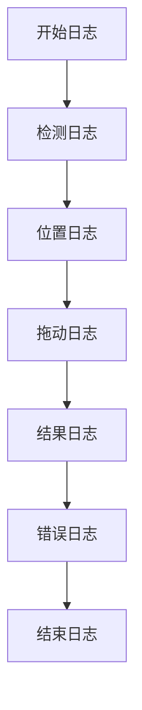

## 结论

本项目的 AI 自动处理机制展现了现代 AI 驱动的自动化测试系统的最佳实践。通过将 Midscene AI 的视觉识别能力与 Playwright 的浏览器自动化技术有机结合，实现了高成功率的滑块验证码自动处理。

### 主要优势

1. **高准确性**: 基于 AI 的视觉识别确保了滑块位置的精确获取
2. **真人模拟**: 15步渐进拖动和随机抖动模拟真实用户行为
3. **鲁棒性强**: 多层重试机制和完善的错误处理
4. **可扩展性**: 模块化设计便于功能扩展和维护

### 技术创新点

1. **缓动函数应用**: 使用 `easeOut` 函数模拟真实拖动行为
2. **随机抖动机制**: 精细控制的抖动参数提升真实性
3. **多策略重试**: 智能的重试策略提高成功率
4. **状态监控**: 完整的处理过程跟踪和验证

该系统为 AI 驱动的自动化测试提供了优秀的参考实现，展示了如何将人工智能技术有效地集成到传统的自动化测试框架中。