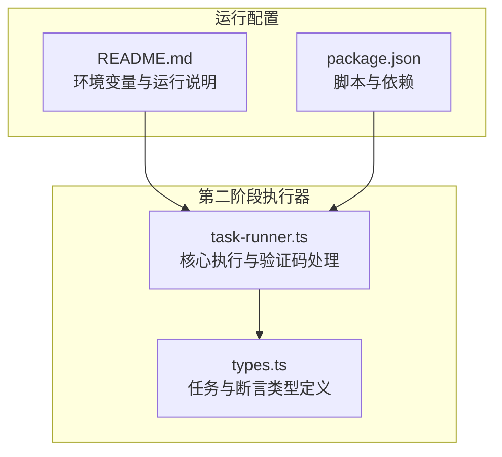
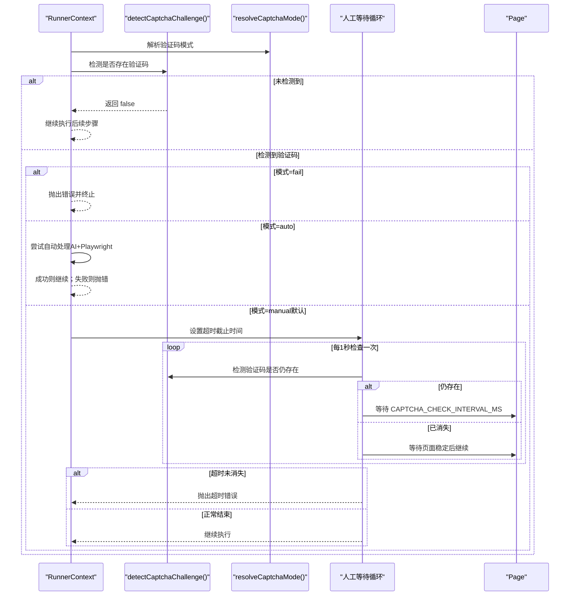
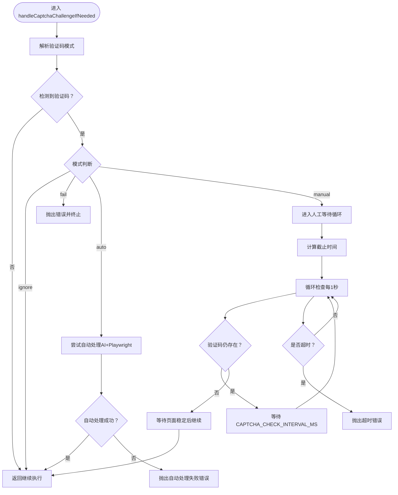
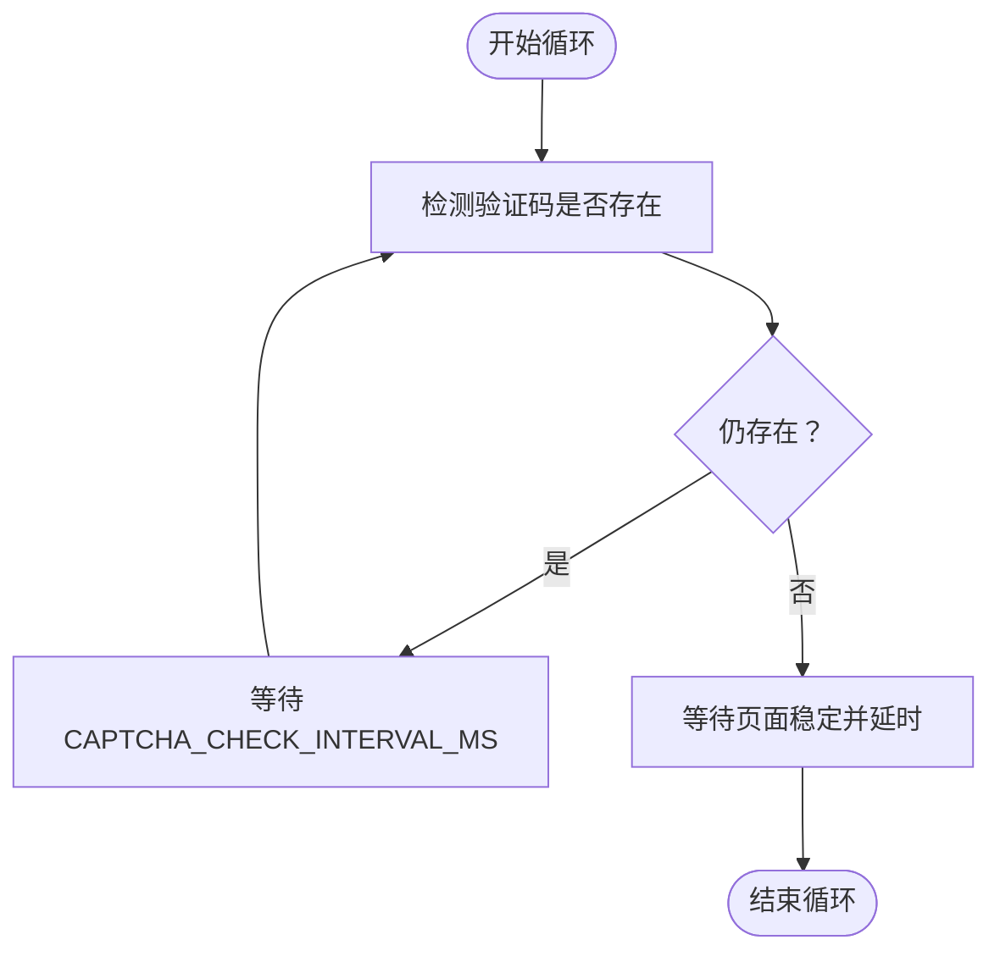
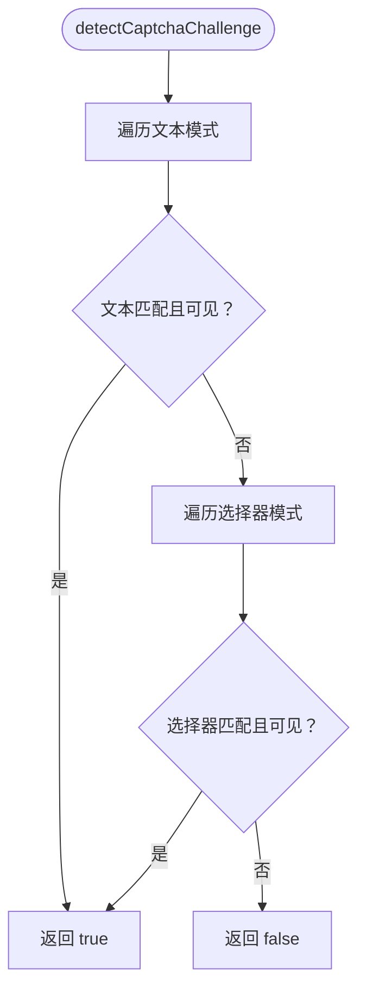
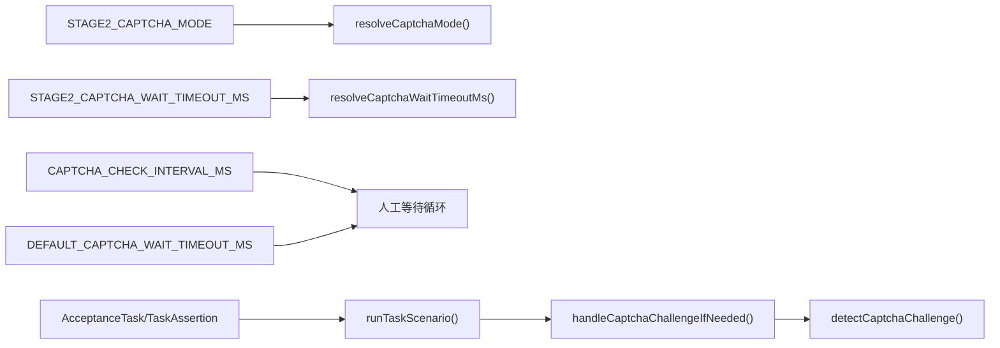

# 人工兜底处理机制

<cite>
**本文引用的文件**
- [task-runner.ts](file://src/stage2/task-runner.ts)
- [types.ts](file://src/stage2/types.ts)
- [README.md](file://README.md)
- [package.json](file://package.json)
</cite>

## 目录
1. [简介](#简介)
2. [项目结构](#项目结构)
3. [核心组件](#核心组件)
4. [架构总览](#架构总览)
5. [详细组件分析](#详细组件分析)
6. [依赖关系分析](#依赖关系分析)
7. [性能考量](#性能考量)
8. [故障排除指南](#故障排除指南)
9. [结论](#结论)
10. [附录](#附录)

## 简介
本文件围绕“人工兜底处理机制”进行系统化技术文档编制，重点解释在检测到安全验证码（如滑块验证码）时的人工模式等待与监控机制，以及 handleCaptchaChallengeIfNeeded 函数的实现逻辑。文档还涵盖：
- 超时检测循环的工作原理：每 1 秒检查一次验证码状态，超过设定超时时间后抛出错误终止执行
- CAPTCHA_CHECK_INTERVAL_MS 常量的作用与可调参数
- 人工兜底方案的设计理念与应用场景（复杂验证码、AI 识别失败、网络不稳定等）
- 最佳实践：合理设置超时时间、在 CI/CD 环境中配置人工模式、结合其他处理方式的混合策略
- 故障排除与性能优化建议

## 项目结构
该项目采用分层模块化组织，第二阶段执行器位于 src/stage2，核心逻辑集中在 task-runner.ts 中，类型定义位于 types.ts。README.md 提供了环境变量与运行说明，package.json 定义了脚本与依赖。

**图表来源**
- [task-runner.ts](file://src/stage2/task-runner.ts)
- [types.ts](file://src/stage2/types.ts)
- [README.md](file://README.md)
- [package.json](file://package.json)

**章节来源**
- [README.md](file://README.md)
- [package.json](file://package.json)

## 核心组件
- 人工模式常量与默认值
  - CAPTCHA_MODE_MANUAL、CAPTCHA_MODE_AUTO、CAPTCHA_MODE_FAIL、CAPTCHA_MODE_IGNORE
  - DEFAULT_CAPTCHA_MODE、DEFAULT_CAPTCHA_WAIT_TIMEOUT_MS、CAPTCHA_CHECK_INTERVAL_MS
- 环境变量解析
  - resolveCaptchaMode() 解析 STAGE2_CAPTCHA_MODE
  - resolveCaptchaWaitTimeoutMs() 解析 STAGE2_CAPTCHA_WAIT_TIMEOUT_MS
- 验证码检测与处理
  - detectCaptchaChallenge() 文本与选择器双模式检测
  - handleCaptchaChallengeIfNeeded() 人工兜底等待与超时控制
- 自动模式（可选）
  - autoSolveSliderCaptcha() 基于 AI + Playwright 的滑块自动处理

**章节来源**
- [task-runner.ts](file://src/stage2/task-runner.ts)

## 架构总览
人工兜底处理机制在任务执行流程的关键节点触发：登录后、进入业务页面前、点击菜单前等均会调用 handleCaptchaChallengeIfNeeded() 进行检测与处理。其工作流如下：

**图表来源**
- [task-runner.ts](file://src/stage2/task-runner.ts)

## 详细组件分析

### handleCaptchaChallengeIfNeeded 函数
该函数是人工兜底的核心入口，负责在检测到验证码后根据模式进行相应处理：
- 忽略模式：直接返回
- fail 模式：检测到即抛错终止
- auto 模式：尝试自动处理（AI+Playwright），失败则抛错
- manual 模式（默认）：进入超时等待循环，每 1 秒检查一次验证码状态，超时未消失则抛错

**图表来源**
- [task-runner.ts](file://src/stage2/task-runner.ts)

**章节来源**
- [task-runner.ts](file://src/stage2/task-runner.ts)

### 超时检测循环与 CAPTCHA_CHECK_INTERVAL_MS
- 循环策略：每次循环等待 CAPTCHA_CHECK_INTERVAL_MS 后再次检测验证码是否存在
- 默认间隔：1000 毫秒（1 秒）
- 超时策略：以 resolveCaptchaWaitTimeoutMs() 解析的超时时间作为截止时间，超过则抛错
- 页面稳定：验证码消失后，等待页面加载状态稳定并短暂延时，确保后续步骤顺利

**图表来源**
- [task-runner.ts](file://src/stage2/task-runner.ts)

**章节来源**
- [task-runner.ts](file://src/stage2/task-runner.ts)

### CAPTCHA 检测与识别
- 文本模式：匹配预设的验证码提示文本（如“请完成安全验证”、“请按住滑块”等）
- 选择器模式：匹配常见的验证码容器选择器（如 nc_wrapper、nc_scale 等）
- 可见性检测：通过 Playwright 定位器与 isVisible() 判断元素是否可见

**图表来源**
- [task-runner.ts](file://src/stage2/task-runner.ts)

**章节来源**
- [task-runner.ts](file://src/stage2/task-runner.ts)

### 自动模式与混合策略
- 自动模式（auto）：通过 AI 查询页面截图，识别滑块位置与滑槽宽度，使用 Playwright 模拟拖动轨迹，最多重试 3 次
- 混合策略建议：
  - 复杂验证码或网络不稳定时，优先使用 manual 模式并适当增大超时时间
  - 对于可识别的简单滑块，可使用 auto 模式提升自动化率
  - 在 CI/CD 环境中，建议开启 auto 作为首选，manual 作为兜底与调试手段

**章节来源**
- [task-runner.ts](file://src/stage2/task-runner.ts)

## 依赖关系分析
- 环境变量依赖
  - STAGE2_CAPTCHA_MODE：决定验证码处理模式（auto/manual/fail/ignore）
  - STAGE2_CAPTCHA_WAIT_TIMEOUT_MS：manual 模式下的人工等待超时时间（毫秒）
- 常量依赖
  - CAPTCHA_CHECK_INTERVAL_MS：等待循环的检查间隔（毫秒）
  - DEFAULT_CAPTCHA_WAIT_TIMEOUT_MS：默认等待超时时间（毫秒）
- 类型依赖
  - AcceptanceTask、TaskAssertion 等类型定义用于任务执行与断言流程

**图表来源**
- [task-runner.ts](file://src/stage2/task-runner.ts)
- [types.ts](file://src/stage2/types.ts)
- [README.md](file://README.md)

**章节来源**
- [task-runner.ts](file://src/stage2/task-runner.ts)
- [types.ts](file://src/stage2/types.ts)
- [README.md](file://README.md)

## 性能考量
- 检测频率与资源占用
  - 每 1 秒一次的轮询对 CPU 与内存开销较小，适合长时间等待场景
  - 建议在 CI/CD 环境中适度降低 CAPTCHA_CHECK_INTERVAL_MS 以缩短等待时间，但需平衡稳定性
- 页面稳定与等待
  - 验证码消失后等待页面加载稳定再继续，有助于避免后续步骤因页面未就绪而失败
- 自动处理的性能
  - auto 模式通过 AI 识别与 Playwright 模拟拖动，整体耗时取决于页面复杂度与网络状况
  - 建议在本地调试时开启 auto，CI 环境中结合 manual 与更长超时时间

[本节为通用性能讨论，无需特定文件引用]

## 故障排除指南
- 症状：验证码检测频繁误判或漏判
  - 排查：检查 CAPTCHA_TEXT_PATTERNS 与 CAPTCHA_SELECTOR_PATTERNS 是否覆盖目标页面
  - 建议：在目标页面截图中确认提示文本与容器选择器，必要时扩展匹配规则
- 症状：人工模式等待超时
  - 排查：确认 STAGE2_CAPTCHA_WAIT_TIMEOUT_MS 设置是否过短
  - 建议：在 CI/CD 环境中适当增大超时时间，或在本地使用 manual 模式配合截图定位问题
- 症状：自动模式失败
  - 排查：查看自动处理日志与截图，确认滑块位置与滑槽宽度识别是否准确
  - 建议：切换至 manual 模式，或优化 AI 识别提示词与选择器
- 症状：页面未稳定导致后续步骤失败
  - 排查：确认验证码消失后的页面稳定等待是否足够
  - 建议：在验证码消失后增加等待时间，确保 domcontentloaded 与后续交互稳定

**章节来源**
- [task-runner.ts](file://src/stage2/task-runner.ts)

## 结论
人工兜底处理机制通过“检测—决策—等待—超时”的闭环，为复杂验证码、AI 识别失败与网络不稳定等场景提供了稳健的保障。合理配置 CAPTCHA_CHECK_INTERVAL_MS 与 STAGE2_CAPTCHA_WAIT_TIMEOUT_MS，结合 auto/manual 的混合策略，可在保证稳定性的同时提升自动化效率。在 CI/CD 环境中，建议以 auto 为主、manual 为辅，并通过截图与日志进行问题定位与优化。

[本节为总结性内容，无需特定文件引用]

## 附录

### 环境变量与默认值
- STAGE2_CAPTCHA_MODE
  - auto：AI 自动处理滑块（默认）
  - manual：检测到验证码后等待人工完成
  - fail：检测到验证码立即失败
  - ignore：忽略验证码检测
- STAGE2_CAPTCHA_WAIT_TIMEOUT_MS：manual 模式下的人工等待超时时间（毫秒）

**章节来源**
- [README.md](file://README.md)
- [task-runner.ts](file://src/stage2/task-runner.ts)