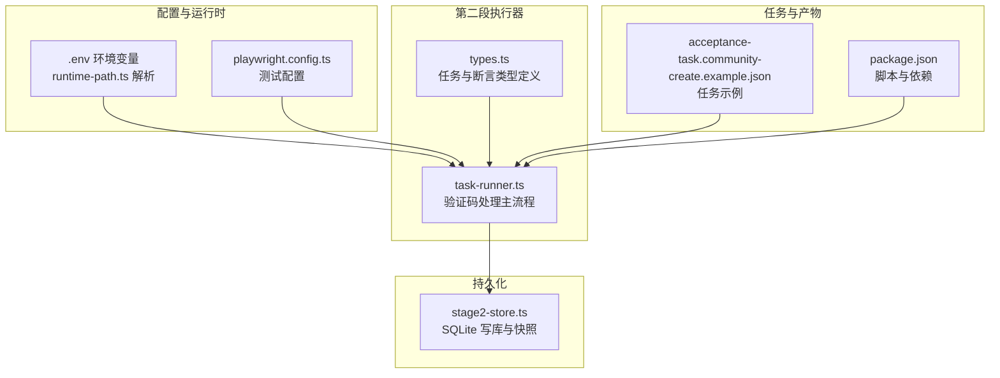
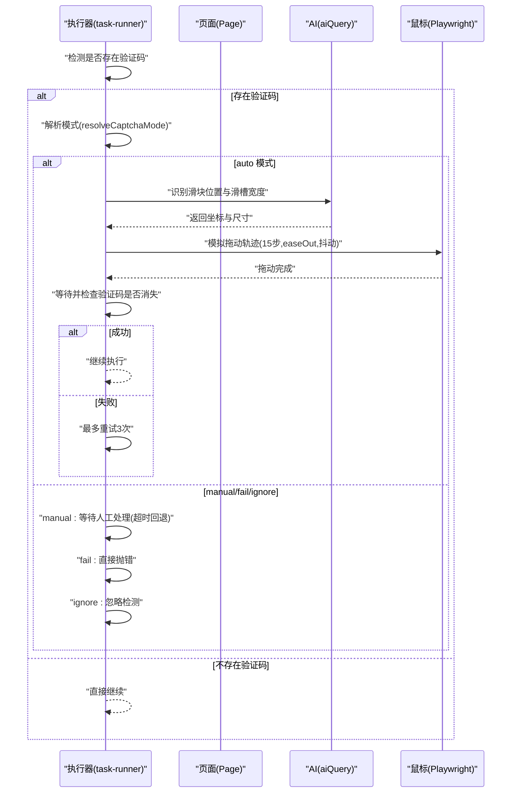
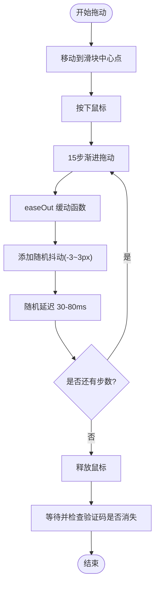
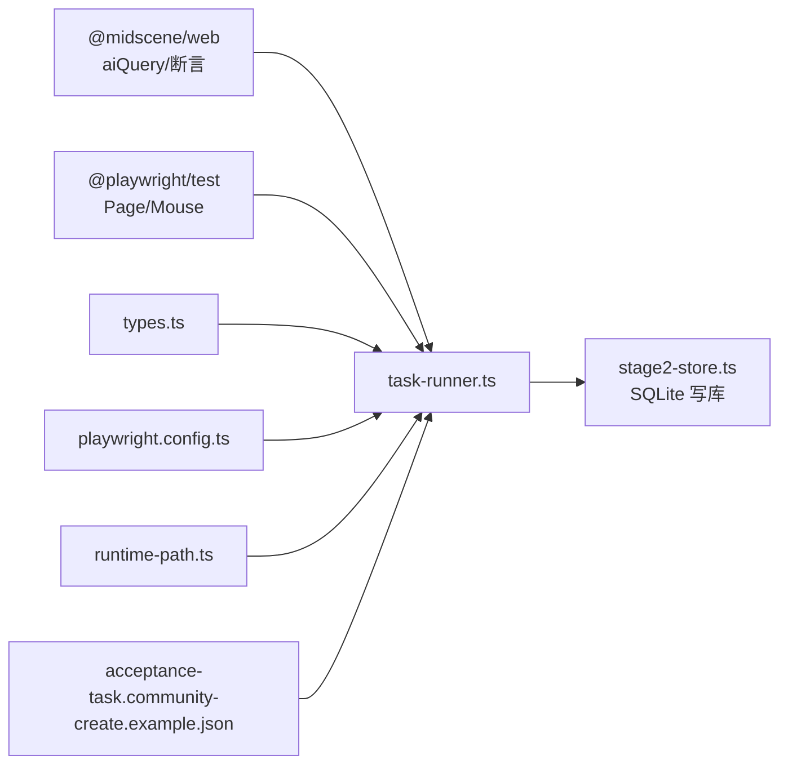

# 验证码处理机制

<cite>
**本文引用的文件**
- [src\stage2\task-runner.ts](file://src\stage2\task-runner.ts)
- [src\stage2\types.ts](file://src\stage2\types.ts)
- [src\persistence\stage2-store.ts](file://src\persistence\stage2-store.ts)
- [playwright.config.ts](file://playwright.config.ts)
- [package.json](file://package.json)
- [README.md](file://README.md)
- [config\runtime-path.ts](file://config\runtime-path.ts)
- [specs\tasks\acceptance-task.community-create.example.json](file://specs\tasks\acceptance-task.community-create.example.json)
</cite>

## 目录
1. [简介](#简介)
2. [项目结构](#项目结构)
3. [核心组件](#核心组件)
4. [架构总览](#架构总览)
5. [详细组件分析](#详细组件分析)
6. [依赖关系分析](#依赖关系分析)
7. [性能考量](#性能考量)
8. [故障排除指南](#故障排除指南)
9. [结论](#结论)
10. [附录](#附录)

## 简介
本文件针对验证码处理机制进行系统化技术文档编写，重点覆盖滑块验证码的自动识别与处理流程，包括：
- AI 识别算法（Midscene aiQuery）与截图分析
- 拖动轨迹模拟（Playwright mouse API、15步渐进、easeOut 缓动、随机抖动）
- 结果验证与重试机制
- STAGE2_CAPTCHA_MODE 四种模式（auto、manual、fail、ignore）的工作原理与配置
- 人工兜底方案（超时与回退机制）
- 代码示例路径与故障排除建议

## 项目结构
该项目采用分层与功能模块化组织，验证码处理位于第二段执行器的核心流程中，结合 Playwright、Midscene 与 SQLite 持久化能力。

图表来源
- [src\stage2\task-runner.ts](file://src\stage2\task-runner.ts)
- [src\stage2\types.ts](file://src\stage2\types.ts)
- [src\persistence\stage2-store.ts](file://src\persistence\stage2-store.ts)
- [playwright.config.ts](file://playwright.config.ts)
- [config\runtime-path.ts](file://config\runtime-path.ts)
- [specs\tasks\acceptance-task.community-create.example.json](file://specs\tasks\acceptance-task.community-create.example.json)
- [package.json](file://package.json)

章节来源
- [README.md](file://README.md)
- [config\runtime-path.ts](file://config\runtime-path.ts)
- [playwright.config.ts](file://playwright.config.ts)
- [package.json](file://package.json)

## 核心组件
- 验证码检测与处理入口：detectCaptchaChallenge、handleCaptchaChallengeIfNeeded
- AI 识别与截图分析：querySliderPosition、querySliderTrackWidth（aiQuery）
- 自动拖动模拟：autoSolveSliderCaptcha（Playwright mouse API）
- 模式解析与超时控制：resolveCaptchaMode、resolveCaptchaWaitTimeoutMs
- 重试与回退：自动模式最多3次重试；人工模式超时回退
- 人工兜底：manual 模式持续轮询验证码消失，超时抛错

章节来源
- [src\stage2\task-runner.ts](file://src\stage2\task-runner.ts)

## 架构总览
验证码处理在第二段执行器的“处理安全验证”步骤中被触发，贯穿 AI 识别、轨迹模拟、结果验证与重试回退。

图表来源
- [src\stage2\task-runner.ts](file://src\stage2\task-runner.ts)

## 详细组件分析

### 模式解析与配置
- 模式解析：STAGE2_CAPTCHA_MODE 支持 auto、manual、fail、ignore，默认 auto
- 超时解析：STAGE2_CAPTCHA_WAIT_TIMEOUT_MS 控制 manual 模式的等待时长（毫秒）
- 配置来源：.env 文件与 README 文档说明

章节来源
- [src\stage2\task-runner.ts](file://src\stage2\task-runner.ts)
- [README.md](file://README.md)

### 验证码检测
- 文本特征：包含“请完成安全验证”“请按住滑块”“拖动到最右边”“向右滑动”等提示
- 选择器特征：nc_wrapper、nc_scale、以 nc_ 开头的 wrapper、包含 captcha 的类名
- 检测逻辑：对文本与选择器进行可见性判断，任一匹配即视为存在验证码

章节来源
- [src\stage2\task-runner.ts](file://src\stage2\task-runner.ts)

### AI 识别与截图分析
- 滑块位置识别：aiQuery 返回滑块中心点坐标(x,y)与尺寸(width,height)
- 滑槽宽度识别：aiQuery 返回滑槽总宽度
- 返回格式约定：结构化 JSON，包含 found、x/y/width/height 等键

章节来源
- [src\stage2\task-runner.ts](file://src\stage2\task-runner.ts)

### 拖动轨迹模拟与缓动
- 起始移动：鼠标移动至滑块中心点
- 按下：mouse.down
- 拖动：15步渐进，每步计算 progress = i/15，使用 easeOut 缓动函数（先快后慢）
- 抖动：每步添加随机抖动（-3~3 像素水平，-2~2 像素垂直）
- 延迟：每步随机延迟 30~80ms
- 到达目标：确保最后一步到达目标 x
- 释放：mouse.up

图表来源
- [src\stage2\task-runner.ts](file://src\stage2\task-runner.ts)

章节来源
- [src\stage2\task-runner.ts](file://src\stage2\task-runner.ts)

### 结果验证与重试
- 验证：等待一段时间后再次检测验证码是否消失
- 重试：auto 模式最多重试 3 次，失败则抛错并给出建议
- 失败兜底：提示检查页面截图、调整检测选择器或切换为 manual 模式

章节来源
- [src\stage2\task-runner.ts](file://src\stage2\task-runner.ts)

### 人工兜底方案
- manual 模式：检测到验证码后，打印警告并持续轮询验证码消失
- 超时控制：基于 STAGE2_CAPTCHA_WAIT_TIMEOUT_MS 计算截止时间
- 轮询间隔：固定间隔检查验证码状态
- 超时回退：超过时限仍未消失则抛错，提示增大等待时间

章节来源
- [src\stage2\task-runner.ts](file://src\stage2\task-runner.ts)
- [README.md](file://README.md)

### fail 与 ignore 模式
- fail：检测到验证码立即抛错，阻止继续执行
- ignore：忽略验证码检测，不进行任何处理（不建议）

章节来源
- [src\stage2\task-runner.ts](file://src\stage2\task-runner.ts)
- [README.md](file://README.md)

### 与断言与持久化的集成
- 在“处理安全验证”步骤后继续执行后续业务流程
- 执行器将步骤截图、进度快照与最终结果写入本地 SQLite 数据库
- 任务 JSON 示例展示了断言与清理策略的配置方式

章节来源
- [src\stage2\task-runner.ts](file://src\stage2\task-runner.ts)
- [src\persistence\stage2-store.ts](file://src\persistence\stage2-store.ts)
- [specs\tasks\acceptance-task.community-create.example.json](file://specs\tasks\acceptance-task.community-create.example.json)

## 依赖关系分析
- 外部依赖
  - Playwright：页面自动化与鼠标 API
  - Midscene：aiQuery 截图分析与结构化提取
  - SQLite：本地持久化存储（node:sqlite）
- 内部依赖
  - task-runner.ts 依赖 types.ts 的任务与断言类型
  - playwright.config.ts 提供测试配置与报告输出
  - runtime-path.ts 统一解析运行时目录

图表来源
- [src\stage2\task-runner.ts](file://src\stage2\task-runner.ts)
- [src\stage2\types.ts](file://src\stage2\types.ts)
- [src\persistence\stage2-store.ts](file://src\persistence\stage2-store.ts)
- [playwright.config.ts](file://playwright.config.ts)
- [config\runtime-path.ts](file://config\runtime-path.ts)
- [specs\tasks\acceptance-task.community-create.example.json](file://specs\tasks\acceptance-task.community-create.example.json)

章节来源
- [package.json](file://package.json)
- [playwright.config.ts](file://playwright.config.ts)
- [config\runtime-path.ts](file://config\runtime-path.ts)

## 性能考量
- 拖动步数与缓动：15步 + easeOut + 随机抖动平衡稳定性与仿真度
- 随机延迟：降低被风控概率，同时增加执行时间
- 重试次数：自动模式最多3次，避免长时间阻塞
- 人工模式超时：通过合理设置等待时长避免无限等待
- I/O 与截图：步骤截图与持久化写库在可控范围内，避免过度 I/O

## 故障排除指南
- 自动处理失败
  - 现象：滑块验证可能失败，滑块仍然存在
  - 排查：检查页面截图确认滑块样式；调整 aiQuery 描述；切换为 manual 模式
  - 参考路径：[自动处理失败抛错与建议](file://src\stage2\task-runner.ts)
- 人工模式超时
  - 现象：验证码在设定时间内未完成
  - 排查：增大 STAGE2_CAPTCHA_WAIT_TIMEOUT_MS；确认页面验证码是否正常
  - 参考路径：[人工模式超时回退](file://src\stage2\task-runner.ts)
- 验证码检测不到
  - 现象：未检测到验证码，但页面存在
  - 排查：调整 CAPTCHA_TEXT_PATTERNS 与 CAPTCHA_SELECTOR_PATTERNS；确认页面元素可见性
  - 参考路径：[验证码检测逻辑](file://src\stage2\task-runner.ts)
- 模式配置错误
  - 现象：行为不符合预期
  - 排查：核对 .env 中 STAGE2_CAPTCHA_MODE 与 STAGE2_CAPTCHA_WAIT_TIMEOUT_MS
  - 参考路径：[模式解析与超时解析](file://src\stage2\task-runner.ts)，[README 模式说明](file://README.md)

章节来源
- [src\stage2\task-runner.ts](file://src\stage2\task-runner.ts)
- [README.md](file://README.md)

## 结论
本验证码处理机制通过 AI 识别与 Playwright 鼠标 API 的组合，实现了对滑块验证码的自动识别与仿真拖动。系统提供了四种模式以适配不同场景：auto（自动）、manual（人工）、fail（失败）、ignore（忽略）。配合重试与人工兜底，能够在保证稳定性的同时提升自动化覆盖率。建议在生产环境中根据页面验证码样式与风控策略，持续优化 aiQuery 描述与检测参数，并合理配置等待时长与重试策略。

## 附录
- 关键实现路径
  - [验证码检测与处理入口](file://src\stage2\task-runner.ts)
  - [AI 识别与截图分析](file://src\stage2\task-runner.ts)
  - [拖动轨迹模拟与缓动](file://src\stage2\task-runner.ts)
  - [人工兜底与超时控制](file://src\stage2\task-runner.ts)
  - [模式解析与配置](file://src\stage2\task-runner.ts)
  - [断言与持久化集成](file://src\stage2\task-runner.ts)
  - [任务示例与断言配置](file://specs\tasks\acceptance-task.community-create.example.json)
  - [运行时目录与配置](file://config\runtime-path.ts)
  - [Playwright 测试配置](file://playwright.config.ts)
  - [包脚本与依赖](file://package.json)
  - [项目说明与模式说明](file://README.md)