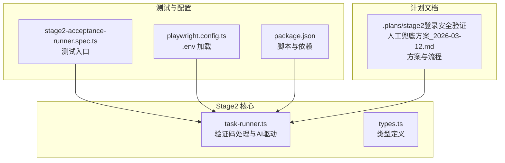
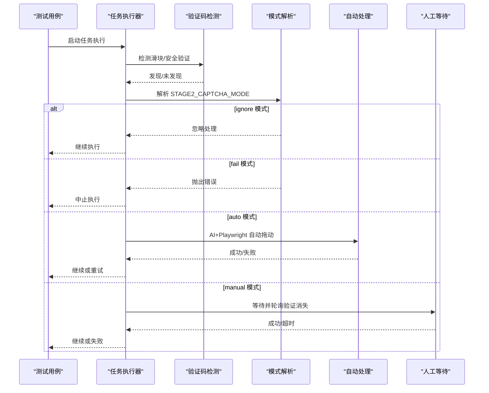
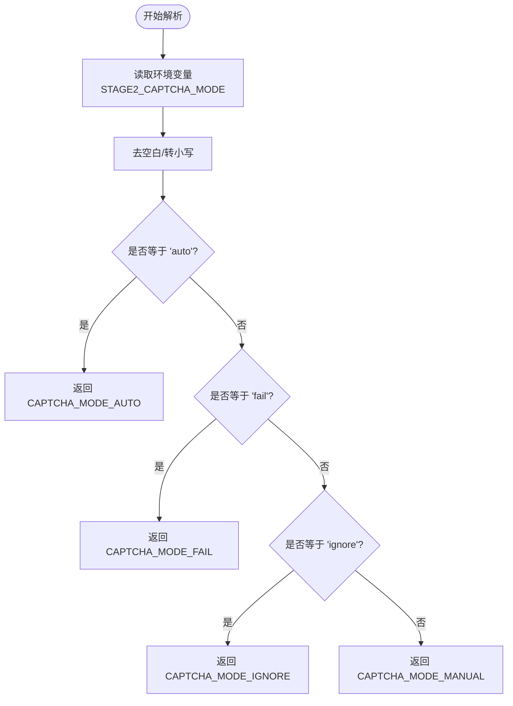
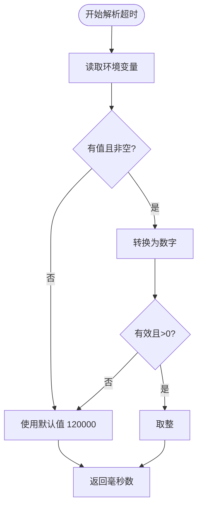
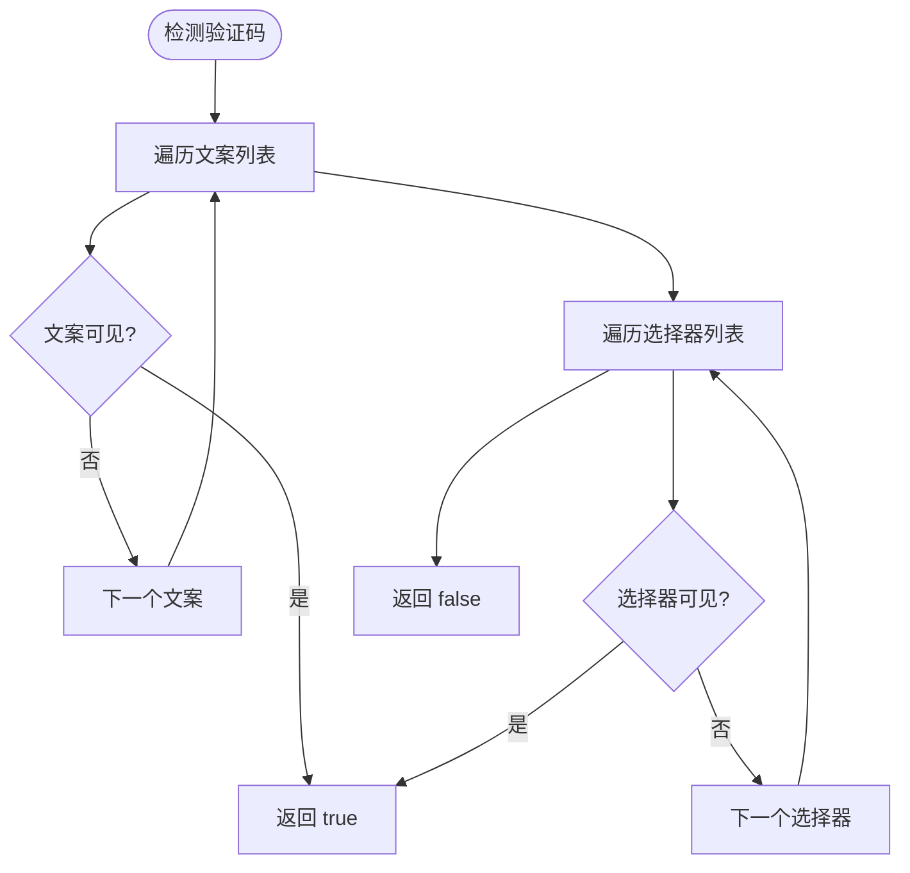
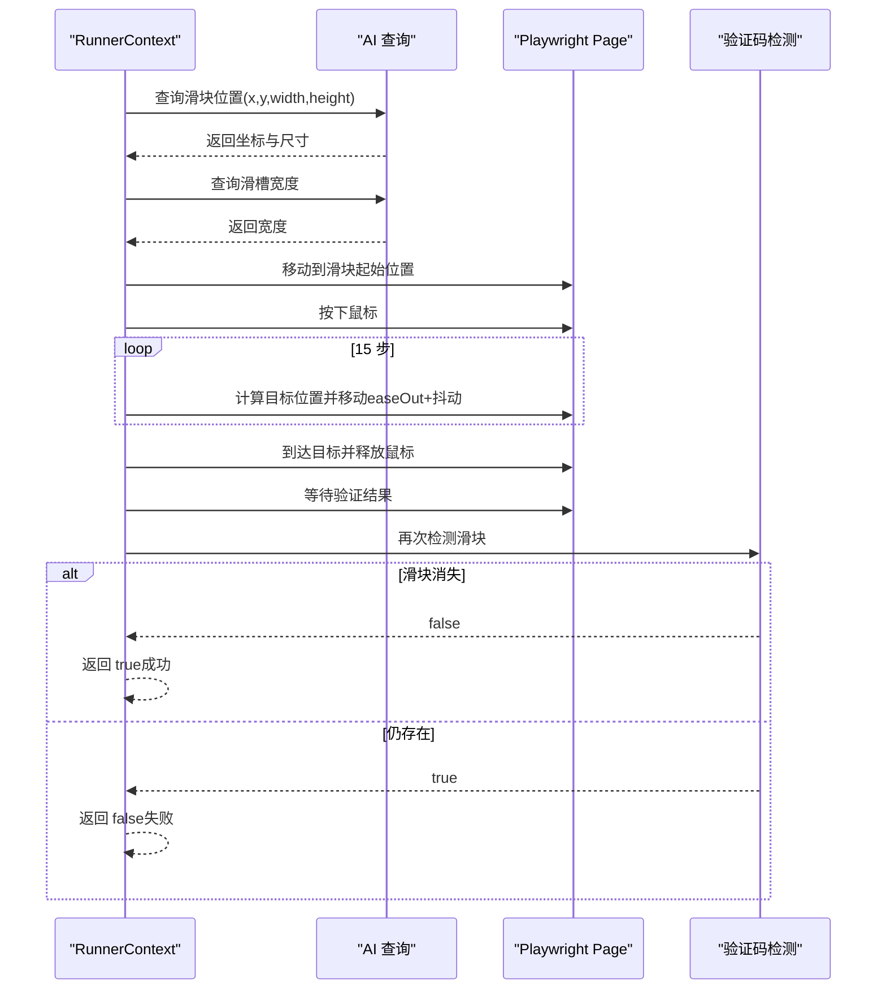
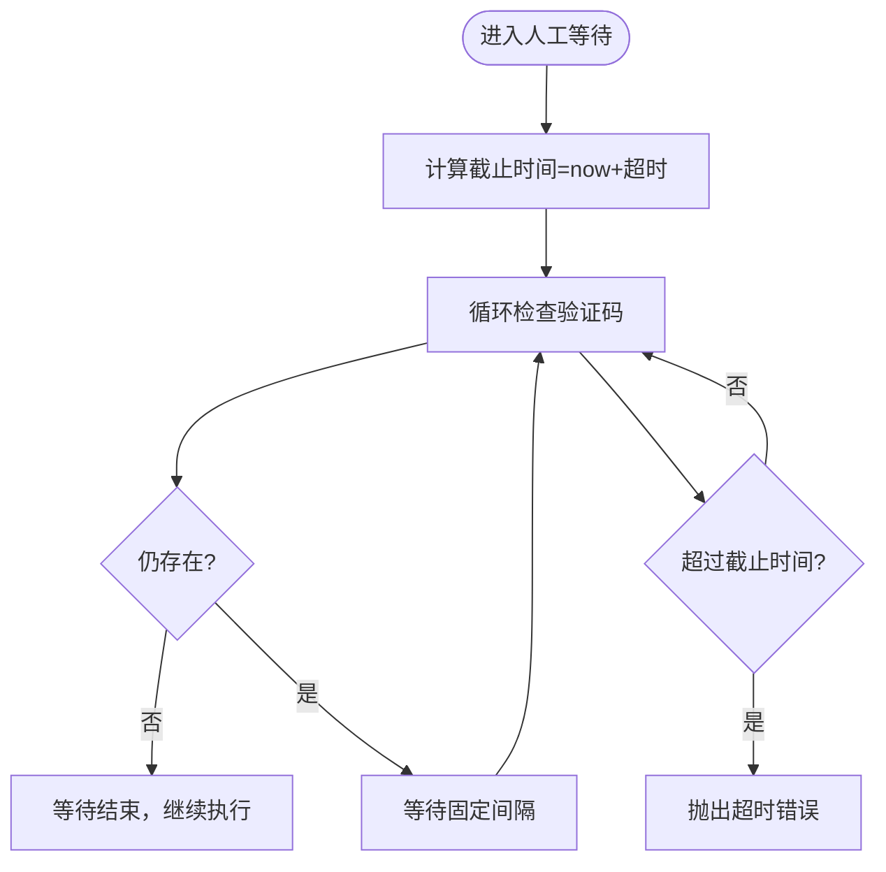
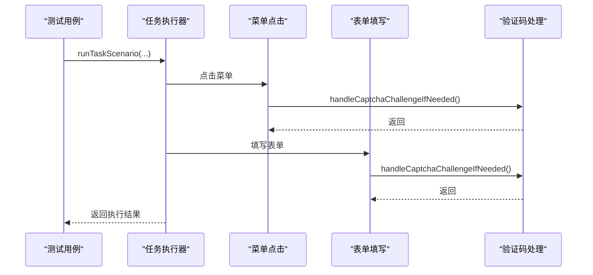
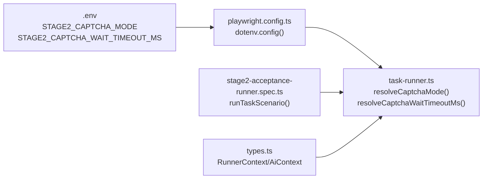

# 验证码处理模式配置

<cite>
**本文引用的文件**
- [task-runner.ts](file://src/stage2/task-runner.ts)
- [types.ts](file://src/stage2/types.ts)
- [stage2登录安全验证人工兜底方案_2026-03-12.md](file://.plans/stage2登录安全验证人工兜底方案_2026-03-12.md)
- [playwright.config.ts](file://playwright.config.ts)
- [package.json](file://package.json)
- [stage2-acceptance-runner.spec.ts](file://tests/generated/stage2-acceptance-runner.spec.ts)
</cite>

## 目录
1. [简介](#简介)
2. [项目结构](#项目结构)
3. [核心组件](#核心组件)
4. [架构概览](#架构概览)
5. [详细组件分析](#详细组件分析)
6. [依赖关系分析](#依赖关系分析)
7. [性能考量](#性能考量)
8. [故障排除指南](#故障排除指南)
9. [结论](#结论)
10. [附录](#附录)

## 简介
本文件面向验证码处理模式配置，围绕 STAGE2_CAPTCHA_MODE 环境变量的四种模式（auto、manual、fail、ignore）进行深入技术说明，并解释 CAPTCHA_WAIT_TIMEOUT_MS 的配置与超时机制。文档还涵盖 resolveCaptchaMode 解析逻辑、默认值处理、滑块自动处理的 AI 驱动实现、以及在不同场景下的最佳实践与故障排除建议。

## 项目结构
与验证码处理相关的核心代码位于 stage2 子模块中，主要涉及任务执行器、类型定义与计划文档。Playwright 测试配置负责加载 .env 环境变量，使环境变量在执行期间可用。

**图表来源**
- [task-runner.ts:1-120](file://src/stage2/task-runner.ts#L1-L120)
- [playwright.config.ts:1-20](file://playwright.config.ts#L1-L20)
- [package.json:1-28](file://package.json#L1-L28)
- [stage2-acceptance-runner.spec.ts:1-39](file://tests/generated/stage2-acceptance-runner.spec.ts#L1-L39)
- [.plans/stage2登录安全验证人工兜底方案_2026-03-12.md:1-57](file://.plans/stage2登录安全验证人工兜底方案_2026-03-12.md#L1-L57)

**章节来源**
- [task-runner.ts:1-120](file://src/stage2/task-runner.ts#L1-L120)
- [playwright.config.ts:1-20](file://playwright.config.ts#L1-L20)
- [package.json:1-28](file://package.json#L1-L28)
- [stage2-acceptance-runner.spec.ts:1-39](file://tests/generated/stage2-acceptance-runner.spec.ts#L1-L39)

## 核心组件
- 验证码模式常量与类型：定义四种模式枚举及 CaptchaMode 类型别名，用于统一处理逻辑分支。
- 模式解析函数：resolveCaptchaMode 将环境变量标准化为具体模式，包含默认值处理。
- 超时解析函数：resolveCaptchaWaitTimeoutMs 将环境变量解析为毫秒数，含边界校验与默认值。
- 安全验证检测：detectCaptchaChallenge 基于文案与选择器识别滑块/安全验证弹层。
- 自动处理：autoSolveSliderCaptcha 使用 AI 查询滑块位置与轨道宽度，再通过 Playwright 模拟拖动轨迹。
- 人工等待：handleCaptchaChallengeIfNeeded 在 manual/fail/ignore 模式下分别执行等待或失败。
- 默认超时：DEFAULT_CAPTCHA_WAIT_TIMEOUT_MS 设定默认等待时间为 120000 毫秒。

**章节来源**
- [task-runner.ts:35-87](file://src/stage2/task-runner.ts#L35-L87)
- [task-runner.ts:483-501](file://src/stage2/task-runner.ts#L483-L501)
- [task-runner.ts:561-648](file://src/stage2/task-runner.ts#L561-L648)
- [task-runner.ts:650-706](file://src/stage2/task-runner.ts#L650-L706)

## 架构概览
验证码处理在任务执行流程中的位置如下：在导航与表单填写等步骤前后，都会调用安全验证处理函数，以确保在进入关键业务前已通过验证。

**图表来源**
- [task-runner.ts:650-706](file://src/stage2/task-runner.ts#L650-L706)
- [task-runner.ts:561-648](file://src/stage2/task-runner.ts#L561-L648)
- [task-runner.ts:61-75](file://src/stage2/task-runner.ts#L61-L75)

## 详细组件分析

### 模式定义与解析逻辑
- 模式常量：manual、auto、fail、ignore；默认模式为 auto。
- 解析规则：
  - 若环境变量为空或非预期值，则回退到默认值。
  - 支持大小写不敏感与空白字符去除。
  - 严格匹配 auto/fail/ignore，其余一律视为 manual。
- 返回类型：CaptchaMode 字面量联合类型，保证编译期安全。

**图表来源**
- [task-runner.ts:61-75](file://src/stage2/task-runner.ts#L61-L75)

**章节来源**
- [task-runner.ts:35-75](file://src/stage2/task-runner.ts#L35-L75)

### 超时配置与解析
- 环境变量：STAGE2_CAPTCHA_WAIT_TIMEOUT_MS（单位毫秒）。
- 解析规则：
  - 未设置时使用默认值 120000。
  - 非数值、非有限正数时回退默认值。
  - 否则取整数部分作为等待时间。
- 用途：manual 模式下轮询检测验证消失的总时长。

**图表来源**
- [task-runner.ts:77-87](file://src/stage2/task-runner.ts#L77-L87)

**章节来源**
- [task-runner.ts:77-87](file://src/stage2/task-runner.ts#L77-L87)

### 安全验证检测
- 文案匹配：常见提示文案集合，如“请完成安全验证”“请按住滑块”“拖动到最右边”“向右滑动”等。
- 选择器匹配：滑块容器与相关元素的选择器集合，如 nc_wrapper、nc_scale、以 nc_ 开头的 wrapper 等。
- 实现：对每个文案与选择器进行可见性检测，任一命中即判定为存在验证码。

**图表来源**
- [task-runner.ts:483-501](file://src/stage2/task-runner.ts#L483-L501)

**章节来源**
- [task-runner.ts:42-53](file://src/stage2/task-runner.ts#L42-L53)
- [task-runner.ts:483-501](file://src/stage2/task-runner.ts#L483-L501)

### 自动模式：AI 驱动的滑块处理
- AI 查询：
  - 获取滑块按钮中心点坐标与尺寸。
  - 获取滑槽总宽度。
- 拖动模拟：
  - 使用 15 步缓动轨迹，easeOut 形状。
  - 每步添加小幅随机抖动，模拟真人手部动作。
  - 最终确保到达目标位置并释放鼠标。
- 结果判断：
  - 等待片刻后再次检测滑块是否消失。
  - 成功则继续执行；失败则最多重试 3 次。
- 错误处理：
  - 捕获拖动过程异常，确保释放鼠标。
  - 返回 false 并记录日志。

**图表来源**
- [task-runner.ts:561-648](file://src/stage2/task-runner.ts#L561-L648)

**章节来源**
- [task-runner.ts:510-559](file://src/stage2/task-runner.ts#L510-L559)
- [task-runner.ts:561-648](file://src/stage2/task-runner.ts#L561-L648)

### 人工模式：等待与超时控制
- 轮询检测：每隔固定间隔检查验证码是否消失。
- 超时机制：基于设定的总等待时间，超过时限则抛出错误。
- 日志提示：在开始等待时输出明确的超时时间与等待提示。

**图表来源**
- [task-runner.ts:688-706](file://src/stage2/task-runner.ts#L688-L706)

**章节来源**
- [task-runner.ts:688-706](file://src/stage2/task-runner.ts#L688-L706)

### fail 模式：直接失败
- 行为：一旦检测到验证码，立即抛出错误并终止执行。
- 适用场景：对自动化稳定性要求极高、不希望任何人工干预的生产环境。

**章节来源**
- [task-runner.ts:661-665](file://src/stage2/task-runner.ts#L661-L665)

### ignore 模式：跳过处理
- 行为：不进行验证码检测与处理，直接继续执行。
- 适用场景：已知不会出现验证码或对验证环节不关心的测试场景。

**章节来源**
- [task-runner.ts:654-656](file://src/stage2/task-runner.ts#L654-L656)

### 执行流程与集成点
- 导航与表单步骤前后均会调用验证码处理函数，确保在进入关键业务前已通过验证。
- 测试入口通过 runTaskScenario 触发完整流程，最终根据状态决定测试通过或失败。

**图表来源**
- [task-runner.ts:864-895](file://src/stage2/task-runner.ts#L864-L895)
- [stage2-acceptance-runner.spec.ts:12-37](file://tests/generated/stage2-acceptance-runner.spec.ts#L12-L37)

**章节来源**
- [task-runner.ts:864-895](file://src/stage2/task-runner.ts#L864-L895)
- [stage2-acceptance-runner.spec.ts:12-37](file://tests/generated/stage2-acceptance-runner.spec.ts#L12-L37)

## 依赖关系分析
- 环境变量加载：Playwright 配置在启动时加载 .env 文件，使 STAGE2_CAPTCHA_MODE 与 STAGE2_CAPTCHA_WAIT_TIMEOUT_MS 在运行时可用。
- 类型定义：types.ts 提供任务与断言等类型，为验证码处理流程提供上下文对象（page、ai 等）。
- 测试入口：测试文件通过注入的 AI 能力与页面对象，驱动任务执行器完成端到端流程。

**图表来源**
- [playwright.config.ts:8-9](file://playwright.config.ts#L8-L9)
- [task-runner.ts:61-87](file://src/stage2/task-runner.ts#L61-L87)
- [stage2-acceptance-runner.spec.ts:1-39](file://tests/generated/stage2-acceptance-runner.spec.ts#L1-L39)
- [types.ts:18-25](file://src/stage2/types.ts#L18-L25)

**章节来源**
- [playwright.config.ts:8-9](file://playwright.config.ts#L8-L9)
- [task-runner.ts:61-87](file://src/stage2/task-runner.ts#L61-L87)
- [stage2-acceptance-runner.spec.ts:1-39](file://tests/generated/stage2-acceptance-runner.spec.ts#L1-L39)
- [types.ts:18-25](file://src/stage2/types.ts#L18-L25)

## 性能考量
- 自动模式的 AI 查询与拖动模拟会引入额外开销，建议在页面稳定后再触发检测，减少误判与重试次数。
- 人工模式的轮询间隔与总等待时间需平衡用户体验与执行效率，避免过短导致频繁轮询，过长影响整体吞吐。
- 滑块拖动轨迹采用缓动与抖动，既提升成功率也降低被识别为机器行为的风险。
- 对于高并发场景，建议结合 CI/CD 的重试策略与超时配置，确保稳定性与可维护性。

## 故障排除指南
- 自动模式失败
  - 现象：多次重试后仍失败。
  - 排查：检查页面截图确认滑块样式与选择器；调整 AI 查询提示；必要时切换为 manual 模式。
  - 参考：自动处理失败时的错误提示与重试逻辑。
- 人工模式超时
  - 现象：在设定时间内未完成验证码。
  - 排查：增大 STAGE2_CAPTCHA_WAIT_TIMEOUT_MS；确认页面交互正常；检查网络与浏览器稳定性。
  - 参考：超时抛出的错误信息与等待逻辑。
- fail 模式误触发
  - 现象：正常流程被意外中断。
  - 排查：确认验证码检测逻辑是否误判；在需要时切换为 ignore 或 manual 模式。
- ignore 模式风险
  - 现象：页面出现验证码但未处理。
  - 排查：确保该场景确实不需要验证码处理；否则应调整为其他模式。
- 环境变量未生效
  - 现象：配置未按预期生效。
  - 排查：确认 .env 文件已正确加载；检查变量拼写与大小写；重启测试进程。

**章节来源**
- [task-runner.ts:683-685](file://src/stage2/task-runner.ts#L683-L685)
- [task-runner.ts:703-705](file://src/stage2/task-runner.ts#L703-L705)
- [task-runner.ts:661-665](file://src/stage2/task-runner.ts#L661-L665)
- [task-runner.ts:654-656](file://src/stage2/task-runner.ts#L654-L656)
- [playwright.config.ts:8-9](file://playwright.config.ts#L8-L9)

## 结论
验证码处理模式通过统一的解析与执行框架，实现了从自动 AI 处理到人工等待与失败终止的灵活组合。合理配置 STAGE2_CAPTCHA_MODE 与 STAGE2_CAPTCHA_WAIT_TIMEOUT_MS，可在保证自动化稳定性的同时，兼顾不同场景下的灵活性与可维护性。建议在生产环境中优先采用自动模式并配合监控与回滚策略，在测试与开发环境中可使用 manual 模式以获得更直观的人工反馈。

## 附录
- 环境变量清单
  - STAGE2_CAPTCHA_MODE：验证码处理模式，取值 auto/manual/fail/ignore。
  - STAGE2_CAPTCHA_WAIT_TIMEOUT_MS：人工等待超时（毫秒），默认 120000。
- 相关实现参考
  - 模式解析与超时解析：[task-runner.ts:61-87](file://src/stage2/task-runner.ts#L61-L87)
  - 验证码检测：[task-runner.ts:483-501](file://src/stage2/task-runner.ts#L483-L501)
  - 自动处理流程：[task-runner.ts:561-648](file://src/stage2/task-runner.ts#L561-L648)
  - 人工等待与超时：[task-runner.ts:688-706](file://src/stage2/task-runner.ts#L688-L706)
  - 计划文档与流程说明：[stage2登录安全验证人工兜底方案_2026-03-12.md:16-48](file://.plans/stage2登录安全验证人工兜底方案_2026-03-12.md#L16-L48)
  - 测试入口与运行脚本：[stage2-acceptance-runner.spec.ts:1-39](file://tests/generated/stage2-acceptance-runner.spec.ts#L1-L39)，[package.json:6-12](file://package.json#L6-L12)