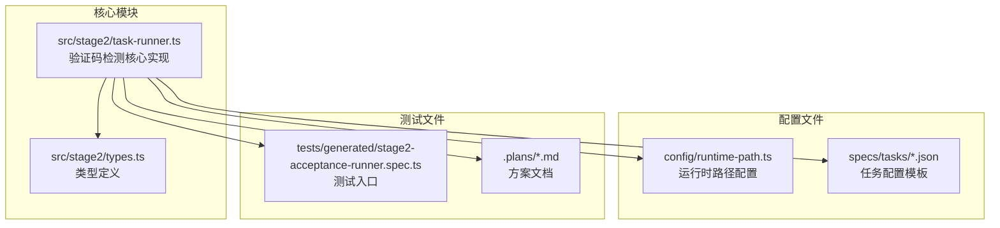
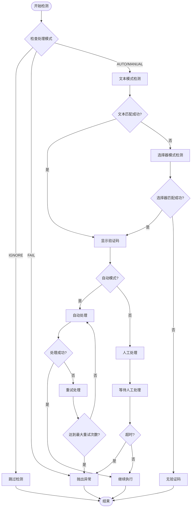
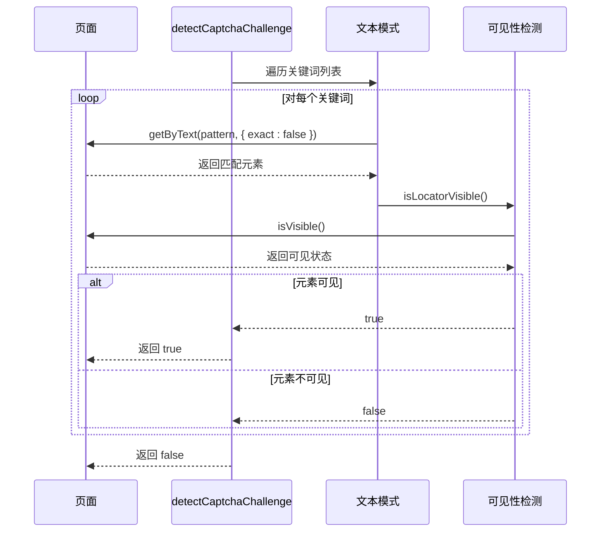
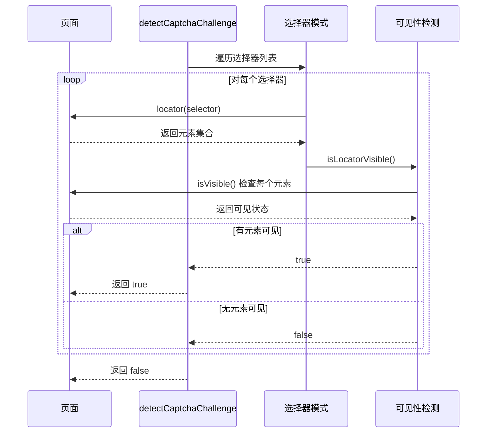
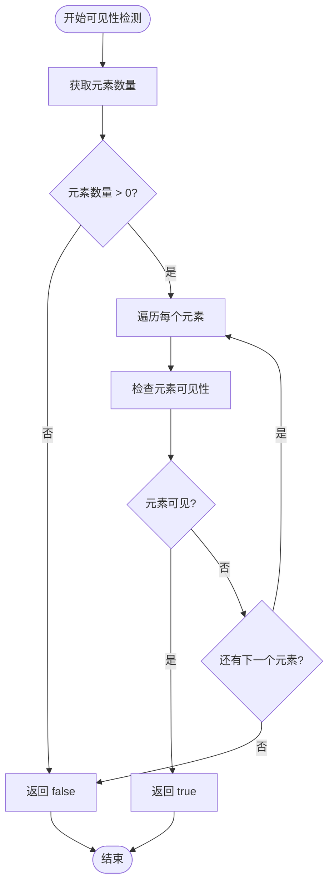
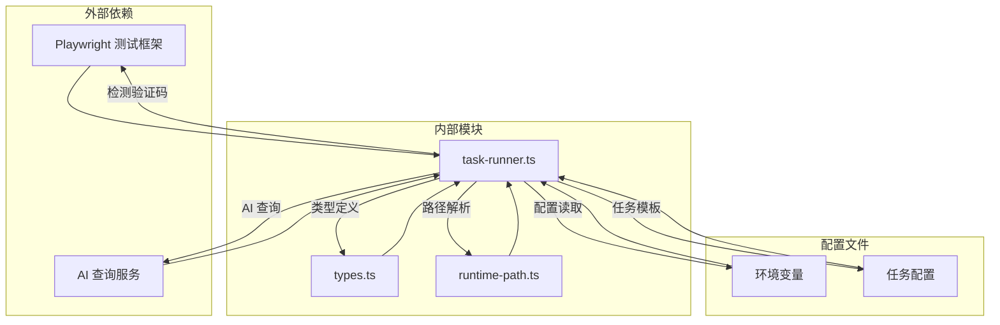

# 验证码检测机制

<cite>
**本文档引用的文件**
- [task-runner.ts](file://src/stage2/task-runner.ts)
- [types.ts](file://src/stage2/types.ts)
- [stage2-acceptance-runner.spec.ts](file://tests/generated/stage2-acceptance-runner.spec.ts)
- [runtime-path.ts](file://config/runtime-path.ts)
- [acceptance-task.template.json](file://specs/tasks/acceptance-task.template.json)
- [acceptance-task.community-create.example.json](file://specs/tasks/acceptance-task.community-create.example.json)
- [stage2登录安全验证人工兜底方案_2026-03-12.md](file://.plans/stage2登录安全验证人工兜底方案_2026-03-12.md)
</cite>

## 目录
1. [简介](#简介)
2. [项目结构](#项目结构)
3. [核心组件](#核心组件)
4. [架构概览](#架构概览)
5. [详细组件分析](#详细组件分析)
6. [依赖关系分析](#依赖关系分析)
7. [性能考虑](#性能考虑)
8. [故障排除指南](#故障排除指南)
9. [结论](#结论)

## 简介

本文档详细解析了 HI-TEST 项目中的验证码检测机制，重点分析 `detectCaptchaChallenge` 函数的工作原理。该机制采用双模式检测策略：文本模式匹配和选择器检测，能够有效识别不同 UI 框架的滑块验证码。

验证码检测机制是自动化测试流程中的关键组件，负责在页面出现安全验证时进行智能识别和处理，确保测试流程的连续性和稳定性。

## 项目结构

该项目采用模块化设计，验证码检测功能主要集中在 `src/stage2/task-runner.ts` 文件中，通过以下核心文件协同工作：

**图表来源**
- [task-runner.ts:1-50](file://src/stage2/task-runner.ts#L1-L50)
- [runtime-path.ts:1-41](file://config/runtime-path.ts#L1-L41)
- [stage2-acceptance-runner.spec.ts:1-39](file://tests/generated/stage2-acceptance-runner.spec.ts#L1-L39)

**章节来源**
- [task-runner.ts:1-100](file://src/stage2/task-runner.ts#L1-L100)
- [runtime-path.ts:1-41](file://config/runtime-path.ts#L1-L41)

## 核心组件

验证码检测机制包含以下核心组件：

### 1. 检测模式配置

系统支持四种验证码处理模式：
- **自动模式 (AUTO)**: 自动识别并处理验证码
- **人工模式 (MANUAL)**: 检测到验证码时暂停等待人工处理
- **失败模式 (FAIL)**: 检测到验证码时直接抛出异常
- **忽略模式 (IGNORE)**: 完全跳过验证码检测

### 2. 文本检测模式

系统维护一个预定义的文本关键词列表，用于识别页面中的验证码提示文本：

| 关键词 | 适用场景 | 匹配逻辑 |
|--------|----------|----------|
| 请完成安全验证 | 通用安全验证界面 | 精确匹配页面文本内容 |
| 请按住滑块 | 滑块验证码初始状态 | 支持模糊匹配，忽略多余字符 |
| 拖动到最右边 | 滑块验证码进行中 | 匹配滑块移动指示 |
| 向右滑动 | 滑块验证码标准提示 | 基础滑块操作提示 |

### 3. 选择器检测模式

系统使用 CSS 选择器模式识别不同 UI 框架的验证码元素：

| 选择器模式 | 适用框架 | 识别特征 |
|------------|----------|----------|
| `.nc_wrapper` | 原生滑块组件 | 传统滑块验证码容器 |
| `.nc_scale` | Element UI 组件库 | Element Plus 滑块样式 |
| `[id^='nc_'][id$='_wrapper']` | 动态 ID 滑块 | 支持动态生成的滑块 ID |
| `[class*='captcha']` | 通用验证码 | 匹配包含 captcha 的类名 |

**章节来源**
- [task-runner.ts:35-75](file://src/stage2/task-runner.ts#L35-L75)
- [task-runner.ts:42-53](file://src/stage2/task-runner.ts#L42-L53)

## 架构概览

验证码检测机制采用分层架构设计，通过多层检测确保高准确率：

**图表来源**
- [task-runner.ts:650-706](file://src/stage2/task-runner.ts#L650-L706)
- [task-runner.ts:483-501](file://src/stage2/task-runner.ts#L483-L501)

## 详细组件分析

### detectCaptchaChallenge 函数分析

`detectCaptchaChallenge` 函数是验证码检测的核心实现，采用双阶段检测策略：

#### 文本检测阶段

**图表来源**
- [task-runner.ts:483-493](file://src/stage2/task-runner.ts#L483-L493)
- [task-runner.ts:469-481](file://src/stage2/task-runner.ts#L469-L481)

#### 选择器检测阶段

**图表来源**
- [task-runner.ts:494-499](file://src/stage2/task-runner.ts#L494-L499)
- [task-runner.ts:469-481](file://src/stage2/task-runner.ts#L469-L481)

### 可见性检测机制

系统采用 `isLocatorVisible` 函数进行精确的元素可见性判断：

**图表来源**
- [task-runner.ts:469-481](file://src/stage2/task-runner.ts#L469-L481)

### 多模式检测优先级

验证码检测遵循严格的优先级顺序：

1. **文本模式优先**: 首先检查页面中的文本关键词
2. **选择器模式次之**: 文本检测失败时再检查 CSS 选择器
3. **可见性验证**: 确保检测到的元素在页面中可见
4. **容错处理**: 单个元素检测失败不影响整体检测结果

**章节来源**
- [task-runner.ts:483-501](file://src/stage2/task-runner.ts#L483-L501)
- [task-runner.ts:469-481](file://src/stage2/task-runner.ts#L469-L481)

## 依赖关系分析

验证码检测机制与其他系统组件的依赖关系如下：

**图表来源**
- [task-runner.ts:1-25](file://src/stage2/task-runner.ts#L1-L25)
- [runtime-path.ts:1-41](file://config/runtime-path.ts#L1-L41)

**章节来源**
- [task-runner.ts:1-25](file://src/stage2/task-runner.ts#L1-L25)
- [runtime-path.ts:1-41](file://config/runtime-path.ts#L1-L41)

## 性能考虑

验证码检测机制在设计时充分考虑了性能优化：

### 检测效率优化

1. **短路求值**: 文本检测成功后立即返回，避免不必要的选择器检查
2. **早期退出**: 可见性检测中发现第一个可见元素即返回
3. **异步处理**: 所有检测操作采用异步方式，避免阻塞主线程

### 内存使用优化

1. **元素计数限制**: 通过 `locator.count()` 限制元素数量，避免内存泄漏
2. **及时释放**: 检测完成后及时释放相关资源
3. **错误处理**: 捕获并处理检测过程中的异常，防止内存泄漏

### 并发处理能力

系统支持多页面并发检测，每个页面的验证码检测相互独立，互不干扰。

## 故障排除指南

### 常见检测失败原因

#### 1. 文本检测失败

**可能原因**:
- 页面语言非中文或关键词不匹配
- 动态加载导致文本延迟出现
- 页面布局变化影响文本识别

**解决方案**:
- 检查页面语言设置
- 增加页面加载等待时间
- 更新关键词列表以适应新页面

#### 2. 选择器检测失败

**可能原因**:
- 目标网站使用新的 UI 框架
- 动态 ID 生成规则变化
- CSS 类名命名规范更新

**解决方案**:
- 分析页面源码确定新的选择器
- 更新 `CAPTCHA_SELECTOR_PATTERNS` 配置
- 考虑添加更通用的选择器模式

#### 3. 可见性检测问题

**可能原因**:
- 元素被其他元素遮挡
- 动画效果影响可见性判断
- 视口大小影响元素显示

**解决方案**:
- 调整页面滚动位置
- 增加等待动画完成的时间
- 检查视口设置和分辨率

### 配置调整建议

#### 环境变量配置

| 环境变量 | 默认值 | 作用 | 调整建议 |
|----------|--------|------|----------|
| STAGE2_CAPTCHA_MODE | auto | 验证码处理模式 | 根据需求调整为 manual/fail/ignore |
| STAGE2_CAPTCHA_WAIT_TIMEOUT_MS | 120000 | 等待超时时间(ms) | 根据页面响应速度调整 |
| RUNTIME_DIR_PREFIX | t_runtime/ | 运行时目录前缀 | 确保磁盘空间充足 |

#### 自定义选择器配置

针对特定网站的验证码，可以通过以下方式扩展检测能力：

1. **分析页面结构**: 使用浏览器开发者工具检查验证码元素
2. **添加新的选择器**: 在 `CAPTCHA_SELECTOR_PATTERNS` 中添加适配的选择器
3. **测试验证**: 通过单元测试验证新选择器的有效性

#### 检测策略调整

1. **增加关键词**: 根据实际页面内容扩展文本检测关键词
2. **优化优先级**: 调整检测顺序以提高准确性
3. **增强容错**: 添加更多的异常处理和重试机制

**章节来源**
- [stage2登录安全验证人工兜底方案_2026-03-12.md:50-57](file://.plans/stage2登录安全验证人工兜底方案_2026-03-12.md#L50-L57)
- [task-runner.ts:61-87](file://src/stage2/task-runner.ts#L61-L87)

## 结论

HI-TEST 项目的验证码检测机制通过双模式检测策略实现了高准确率和高可靠性。该机制具有以下优势：

1. **多层检测保障**: 文本检测和选择器检测双重保障，提高检测准确性
2. **灵活配置**: 支持多种处理模式，适应不同的测试需求
3. **性能优化**: 采用异步处理和短路求值，确保检测效率
4. **易于扩展**: 模块化设计便于添加新的检测策略和适配新页面

通过合理配置和持续优化，该验证码检测机制能够有效支撑自动化测试流程，确保测试任务的稳定执行。