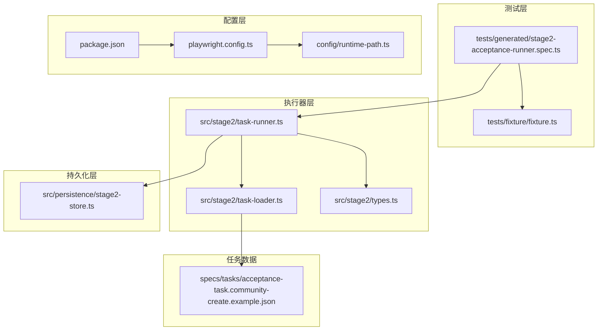
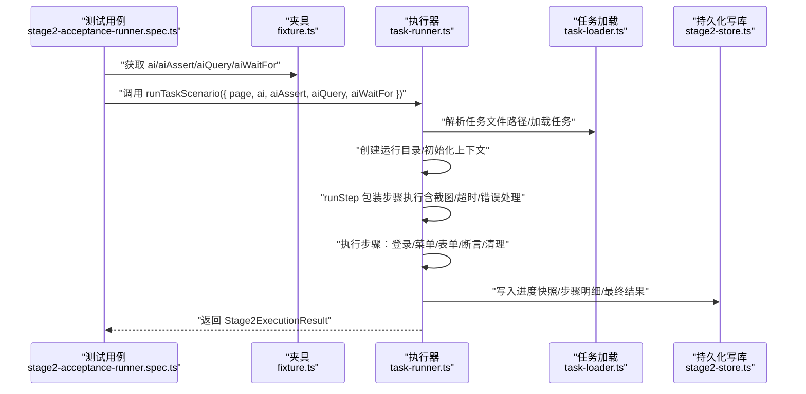
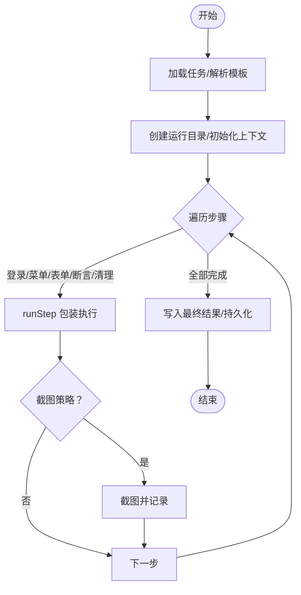
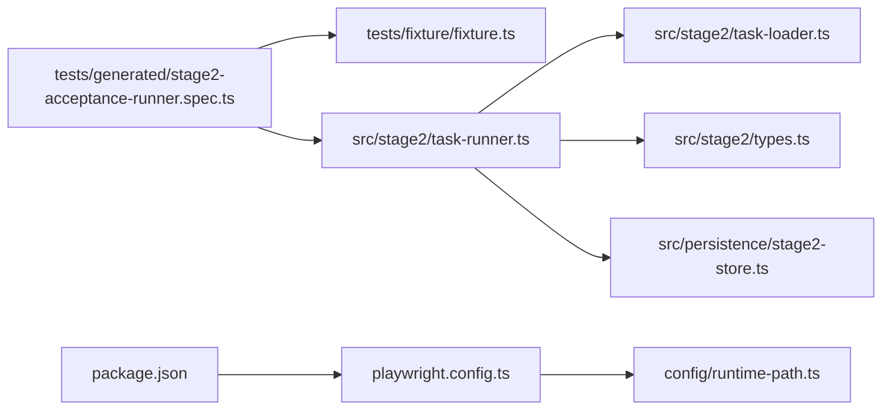

# 执行入口和流程

<cite>
**本文引用的文件**
- [playwright.config.ts](file://playwright.config.ts)
- [stage2-acceptance-runner.spec.ts](file://tests/generated/stage2-acceptance-runner.spec.ts)
- [task-runner.ts](file://src/stage2/task-runner.ts)
- [task-loader.ts](file://src/stage2/task-loader.ts)
- [types.ts](file://src/stage2/types.ts)
- [stage2-store.ts](file://src/persistence/stage2-store.ts)
- [runtime-path.ts](file://config/runtime-path.ts)
- [package.json](file://package.json)
- [acceptance-task.community-create.example.json](file://specs/tasks/acceptance-task.community-create.example.json)
- [fixture.ts](file://tests/fixture/fixture.ts)
- [README.md](file://README.md)
</cite>

## 目录
1. [简介](#简介)
2. [项目结构](#项目结构)
3. [核心组件](#核心组件)
4. [架构总览](#架构总览)
5. [详细组件分析](#详细组件分析)
6. [依赖关系分析](#依赖关系分析)
7. [性能考虑](#性能考虑)
8. [故障排查指南](#故障排查指南)
9. [结论](#结论)
10. [附录](#附录)

## 简介
本文聚焦“测试执行入口与流程”，围绕第二段执行入口 runTaskScenario 的配置与参数、测试场景编排与步骤管理、headed/headless 模式差异、超时与错误处理、性能优化与并发控制，以及具体执行示例与调试方法进行系统化说明。读者可据此快速理解如何从 JSON 任务驱动到 Playwright + Midscene 的自动化执行，并掌握在不同环境下的运行策略。

## 项目结构
本项目采用“Playwright + Midscene + SQLite 持久化”的架构，核心执行入口位于测试用例中，通过夹具注入 AI 能力，再委托给 stage2 执行器完成端到端场景编排。

**图表来源**
- [stage2-acceptance-runner.spec.ts:1-39](file://tests/generated/stage2-acceptance-runner.spec.ts#L1-L39)
- [task-runner.ts:2317-2657](file://src/stage2/task-runner.ts#L2317-L2657)
- [task-loader.ts:71-91](file://src/stage2/task-loader.ts#L71-L91)
- [stage2-store.ts:643-655](file://src/persistence/stage2-store.ts#L643-L655)
- [playwright.config.ts:22-95](file://playwright.config.ts#L22-L95)
- [runtime-path.ts:13-41](file://config/runtime-path.ts#L13-L41)
- [package.json:6-11](file://package.json#L6-L11)
- [acceptance-task.community-create.example.json:1-229](file://specs/tasks/acceptance-task.community-create.example.json#L1-L229)

**章节来源**
- [playwright.config.ts:22-95](file://playwright.config.ts#L22-L95)
- [stage2-acceptance-runner.spec.ts:1-39](file://tests/generated/stage2-acceptance-runner.spec.ts#L1-L39)
- [runtime-path.ts:13-41](file://config/runtime-path.ts#L13-L41)
- [package.json:6-11](file://package.json#L6-L11)

## 核心组件
- 执行入口与夹具
  - 测试入口：tests/generated/stage2-acceptance-runner.spec.ts 中的 run acceptance task from json 测试用例，调用 runTaskScenario。
  - 夹具：tests/fixture/fixture.ts 注入 ai、aiAssert、aiQuery、aiWaitFor 等 AI 能力，供执行器在必要时兜底。
- 执行器
  - src/stage2/task-runner.ts 提供 runTaskScenario 主流程，负责加载任务、编排步骤、执行断言、清理数据、持久化结果。
- 任务加载
  - src/stage2/task-loader.ts 解析任务文件路径、校验任务结构、模板变量替换（NOW_YYYYMMDDHHMMSS 等）。
- 类型定义
  - src/stage2/types.ts 定义 AcceptanceTask、TaskRuntime、TaskAssertion、Stage2ExecutionResult 等核心类型。
- 持久化
  - src/persistence/stage2-store.ts 将运行主记录、步骤明细、快照、附件写入本地 SQLite。
- 配置与运行目录
  - config/runtime-path.ts 读取 .env 中的运行目录前缀与各产物目录。
  - playwright.config.ts 定义 Playwright 测试配置（超时、并行、重试、报告器、项目等）。
  - package.json 提供 stage2:run 与 stage2:run:headed 脚本。

**章节来源**
- [stage2-acceptance-runner.spec.ts:12-37](file://tests/generated/stage2-acceptance-runner.spec.ts#L12-L37)
- [fixture.ts:23-99](file://tests/fixture/fixture.ts#L23-L99)
- [task-runner.ts:2317-2657](file://src/stage2/task-runner.ts#L2317-L2657)
- [task-loader.ts:71-91](file://src/stage2/task-loader.ts#L71-L91)
- [types.ts:141-180](file://src/stage2/types.ts#L141-L180)
- [stage2-store.ts:643-655](file://src/persistence/stage2-store.ts#L643-L655)
- [runtime-path.ts:13-41](file://config/runtime-path.ts#L13-L41)
- [playwright.config.ts:22-95](file://playwright.config.ts#L22-L95)
- [package.json:6-11](file://package.json#L6-L11)

## 架构总览
下面的序列图展示从测试入口到执行器再到 AI/Playwright 的调用链路，以及持久化写库流程。

**图表来源**
- [stage2-acceptance-runner.spec.ts:12-37](file://tests/generated/stage2-acceptance-runner.spec.ts#L12-L37)
- [fixture.ts:23-99](file://tests/fixture/fixture.ts#L23-L99)
- [task-runner.ts:2317-2657](file://src/stage2/task-runner.ts#L2317-L2657)
- [task-loader.ts:71-91](file://src/stage2/task-loader.ts#L71-L91)
- [stage2-store.ts:470-630](file://src/persistence/stage2-store.ts#L470-L630)

## 详细组件分析

### 执行入口与 runTaskScenario 参数
- 入口调用
  - 测试用例通过 runTaskScenario({ page, ai, aiAssert, aiQuery, aiWaitFor }) 启动执行。
  - 测试用例设置了测试超时为 5 分钟，确保长流程有足够时间完成。
- 参数说明
  - page：Playwright 页面对象，承载浏览器交互。
  - ai/aiAssert/aiQuery/aiWaitFor：由夹具注入的 AI 能力，用于兜底交互与断言。
  - options：可选 RunnerOptions，支持传入 rawTaskFilePath 覆盖默认任务文件。
- 任务文件解析
  - 通过 resolveTaskFilePath 读取任务文件路径（优先使用环境变量或显式参数），loadTask 校验并解析任务，同时进行模板变量替换（NOW_YYYYMMDDHHMMSS 等）。
- 审批控制
  - 若开启 STAGE2_REQUIRE_APPROVAL，则必须任务带有 approval.approved 才能执行，否则抛错。

**章节来源**
- [stage2-acceptance-runner.spec.ts:12-37](file://tests/generated/stage2-acceptance-runner.spec.ts#L12-L37)
- [task-runner.ts:2317-2330](file://src/stage2/task-runner.ts#L2317-L2330)
- [task-loader.ts:71-91](file://src/stage2/task-loader.ts#L71-L91)
- [acceptance-task.community-create.example.json:217-221](file://specs/tasks/acceptance-task.community-create.example.json#L217-L221)

### 测试场景编排与步骤管理
- 步骤包装 runStep
  - runStep(stepName, handler, options) 提供统一的步骤生命周期：开始、执行、截图、记录、持久化、失败处理。
  - 支持 required 选项：非必需步骤失败不会中断流程，但会记录为 skipped。
  - 截图策略：若 runtime.screenshotOnStep 为 true，则在步骤成功/失败时均截取全屏图片。
- 执行步骤清单
  - 打开系统首页、登录系统、处理安全验证、等待首页加载、点击菜单、打开新增弹窗、等待弹窗显示、填写字段、提交表单、检查提交提示、关闭弹窗、搜索与校验、断言、清理。
- 断言与清理
  - 断言支持软断言（soft=true）与硬断言（soft=false），软断言失败不影响整体流程。
  - 清理支持 delete-created/delete-all-matched/custom 等策略，可配置 failOnError 控制失败是否中断。

**图表来源**
- [task-runner.ts:2382-2435](file://src/stage2/task-runner.ts#L2382-L2435)
- [task-runner.ts:2437-2634](file://src/stage2/task-runner.ts#L2437-L2634)
- [stage2-store.ts:495-630](file://src/persistence/stage2-store.ts#L495-L630)

**章节来源**
- [task-runner.ts:2382-2435](file://src/stage2/task-runner.ts#L2382-L2435)
- [task-runner.ts:2437-2634](file://src/stage2/task-runner.ts#L2437-L2634)

### headed 与 headless 模式
- 模式差异
  - headless：默认无界面模式，适合 CI/自动化执行，节省资源。
  - headed：带界面模式，便于调试与可视化观察，适合本地开发与问题定位。
- 选择建议
  - 调试阶段使用 headed，CI/生产执行使用 headless。
- 配置入口
  - package.json 提供 stage2:run 与 stage2:run:headed 两个脚本，分别对应无头与有头模式。
  - playwright.config.ts 中 projects 仅启用 chromium，可按需扩展其他浏览器。

**章节来源**
- [package.json:9-10](file://package.json#L9-L10)
- [playwright.config.ts:51-86](file://playwright.config.ts#L51-L86)

### 超时配置与错误处理
- 超时配置
  - Playwright 层：playwright.config.ts 设置全局 timeout、fullyParallel、retries、workers 等。
  - 任务层：AcceptanceTask.runtime 支持 stepTimeoutMs/pageTimeoutMs，影响单步与页面级等待。
  - runTaskScenario 内部根据任务配置动态传入 withPageTimeout。
- 错误处理
  - runStep 捕获异常，记录 message/stack，必要时截图，失败步骤可被标记为 failed 或 skipped。
  - 断言与清理支持软断言，失败不中断流程。
  - 安全验证（滑块）支持 auto/manual/fail/ignore 四种模式，配合超时等待与自动拖动轨迹模拟。

**章节来源**
- [playwright.config.ts:25-34](file://playwright.config.ts#L25-L34)
- [types.ts:128-133](file://src/stage2/types.ts#L128-L133)
- [task-runner.ts:122-129](file://src/stage2/task-runner.ts#L122-L129)
- [task-runner.ts:2334-2339](file://src/stage2/task-runner.ts#L2334-L2339)
- [task-runner.ts:650-706](file://src/stage2/task-runner.ts#L650-L706)

### 性能优化与并发控制
- 并发策略
  - playwright.config.ts 在 CI 环境下限制 workers=1，避免并发竞争；本地开发默认并行执行。
  - fullyParallel: true，提升本地执行效率。
- 重试策略
  - CI 环境启用 retries，降低偶发失败率。
- 执行器内优化
  - runStep 统一截图与持久化，减少重复 IO。
  - 断言采用“Playwright 硬检测优先 + AI 兜底 + 重试”的组合，平衡稳定性与性能。
  - 级联选择与表单提交具备自动修复与重试逻辑，减少人工干预。

**章节来源**
- [playwright.config.ts:34-32](file://playwright.config.ts#L34-L32)
- [task-runner.ts:1027-1029](file://src/stage2/task-runner.ts#L1027-L1029)
- [task-runner.ts:976-1021](file://src/stage2/task-runner.ts#L976-L1021)

### 执行示例与调试方法
- 执行示例
  - 本地调试：npx playwright test --headed tests/generated/stage2-acceptance-runner.spec.ts
  - 无头执行：npm run stage2:run
  - 有头执行：npm run stage2:run:headed
- 调试方法
  - headed 模式观察页面交互与截图，结合 runStep 截图定位失败步骤。
  - 查看运行产物：Playwright HTML 报告、Midscene 报告、第二段结果目录（acceptance-results）。
  - 持久化数据库：通过 SQLite 文件查看运行记录、步骤明细、快照与附件元数据。
  - 环境变量：STAGE2_TASK_FILE、STAGE2_REQUIRE_APPROVAL、STAGE2_CAPTCHA_MODE、STAGE2_CAPTCHA_WAIT_TIMEOUT_MS 等。

**章节来源**
- [README.md:154-180](file://README.md#L154-L180)
- [package.json:9-10](file://package.json#L9-L10)
- [runtime-path.ts:13-36](file://config/runtime-path.ts#L13-L36)
- [stage2-store.ts:643-655](file://src/persistence/stage2-store.ts#L643-L655)

## 依赖关系分析
- 组件耦合
  - 测试入口仅依赖夹具与执行器接口，低耦合。
  - 执行器依赖任务加载器、类型定义、持久化服务，职责清晰。
  - 配置层通过环境变量与运行目录配置贯穿全局。
- 外部依赖
  - Playwright 与 Midscene 提供 UI 自动化与 AI 能力。
  - Node SQLite 驱动用于本地持久化。

**图表来源**
- [stage2-acceptance-runner.spec.ts:1-39](file://tests/generated/stage2-acceptance-runner.spec.ts#L1-L39)
- [fixture.ts:1-100](file://tests/fixture/fixture.ts#L1-L100)
- [task-runner.ts:1-26](file://src/stage2/task-runner.ts#L1-L26)
- [task-loader.ts:1-91](file://src/stage2/task-loader.ts#L1-L91)
- [stage2-store.ts:1-655](file://src/persistence/stage2-store.ts#L1-L655)
- [playwright.config.ts:1-95](file://playwright.config.ts#L1-L95)
- [runtime-path.ts:1-41](file://config/runtime-path.ts#L1-L41)
- [package.json:1-26](file://package.json#L1-L26)

**章节来源**
- [task-runner.ts:1-26](file://src/stage2/task-runner.ts#L1-L26)
- [stage2-store.ts:1-655](file://src/persistence/stage2-store.ts#L1-L655)

## 性能考虑
- 本地开发建议：
  - 使用 fullyParallel 并行执行，缩短总耗时。
  - 合理设置 stepTimeoutMs/pageTimeoutMs，避免过长等待。
- CI 环境建议：
  - workers=1 保证稳定性；启用 retries 降低偶发失败。
  - 使用 headless 模式，减少资源占用。
- 执行器优化：
  - 断言优先使用 Playwright 硬检测，AI 兜底仅在必要时使用。
  - 级联与表单提交具备自动修复与重试，减少失败回溯成本。

[本节为通用指导，无需特定文件引用]

## 故障排查指南
- 常见问题定位
  - 失败步骤定位：测试用例根据 result.steps 最后一个 failed 步骤输出详细信息（step、message、screenshot）。
  - 截图与报告：检查 acceptance-results 下的 screenshots 与 Playwright HTML 报告。
- 安全验证（滑块）处理
  - auto 模式：AI 识别滑块位置并模拟拖动轨迹，最多重试 3 次。
  - manual 模式：等待人工完成，超时后抛错。
  - fail 模式：检测到即失败。
  - ignore 模式：忽略检测（不建议）。
- 数据库写入
  - 若持久化失败，执行器会捕获错误并继续流程，同时在日志中输出错误信息。

**章节来源**
- [stage2-acceptance-runner.spec.ts:27-35](file://tests/generated/stage2-acceptance-runner.spec.ts#L27-L35)
- [task-runner.ts:650-706](file://src/stage2/task-runner.ts#L650-L706)
- [stage2-store.ts:125-133](file://src/persistence/stage2-store.ts#L125-L133)

## 结论
本项目通过“测试入口 + 夹具 + 执行器 + 持久化”的分层设计，实现了从 JSON 任务到 Playwright + Midscene 的端到端自动化执行。runTaskScenario 作为核心入口，提供了完善的步骤编排、超时与错误处理、截图与持久化能力。结合 headed/headless 模式与 CI/本地的并发策略，既能满足调试需求，也能保障生产执行的稳定性与可观测性。

[本节为总结，无需特定文件引用]

## 附录
- 关键配置项
  - STAGE2_TASK_FILE：任务文件路径
  - STAGE2_REQUIRE_APPROVAL：是否需要审批
  - STAGE2_CAPTCHA_MODE：滑块处理模式（auto/manual/fail/ignore）
  - STAGE2_CAPTCHA_WAIT_TIMEOUT_MS：人工处理等待时长（毫秒）
- 运行产物目录
  - PLAYWRIGHT_OUTPUT_DIR、PLAYWRIGHT_HTML_REPORT_DIR、MIDSCENE_RUN_DIR、ACCEPTANCE_RESULT_DIR、DB_FILE_PATH

**章节来源**
- [README.md:39-54](file://README.md#L39-L54)
- [runtime-path.ts:18-36](file://config/runtime-path.ts#L18-L36)
- [stage2-store.ts:643-655](file://src/persistence/stage2-store.ts#L643-L655)