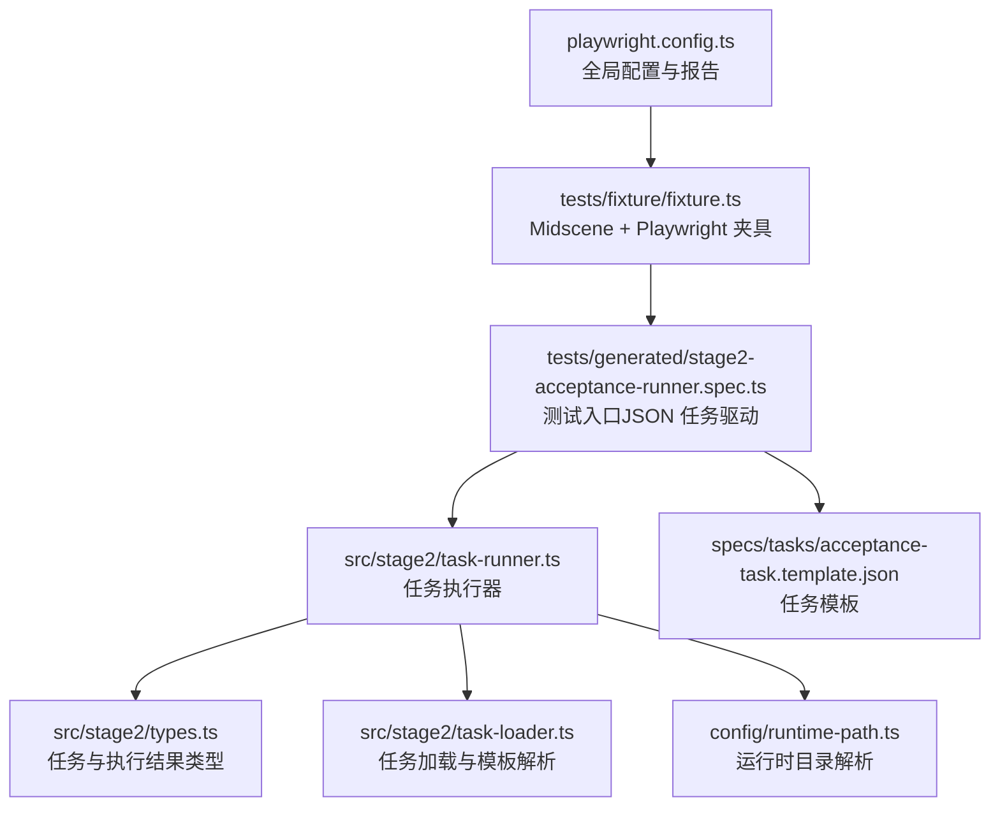
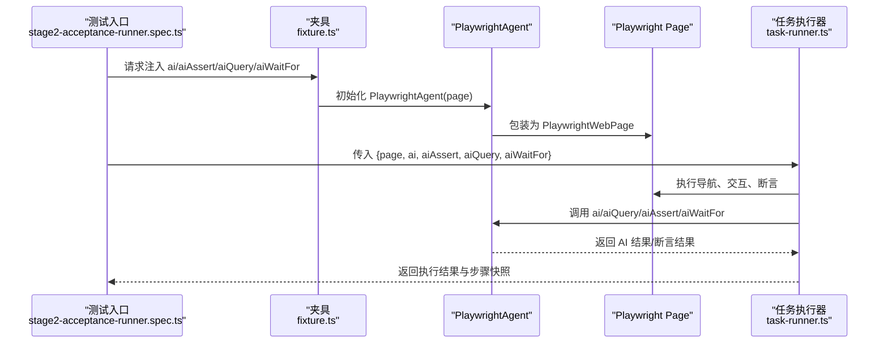
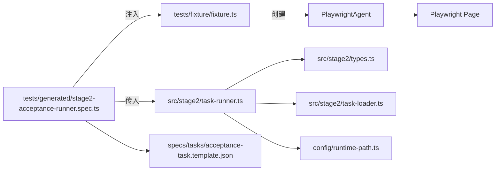

# 测试夹具配置

<cite>
**本文引用的文件**
- [playwright.config.ts](file://playwright.config.ts)
- [tests/fixture/fixture.ts](file://tests/fixture/fixture.ts)
- [tests/generated/stage2-acceptance-runner.spec.ts](file://tests/generated/stage2-acceptance-runner.spec.ts)
- [config/runtime-path.ts](file://config/runtime-path.ts)
- [package.json](file://package.json)
- [README.md](file://README.md)
- [src/stage2/task-runner.ts](file://src/stage2/task-runner.ts)
- [src/stage2/types.ts](file://src/stage2/types.ts)
- [src/stage2/task-loader.ts](file://src/stage2/task-loader.ts)
- [specs/tasks/acceptance-task.template.json](file://specs/tasks/acceptance-task.template.json)
</cite>

## 目录
1. [简介](#简介)
2. [项目结构](#项目结构)
3. [核心组件](#核心组件)
4. [架构总览](#架构总览)
5. [详细组件分析](#详细组件分析)
6. [依赖关系分析](#依赖关系分析)
7. [性能考量](#性能考量)
8. [故障排查指南](#故障排查指南)
9. [结论](#结论)
10. [附录](#附录)

## 简介
本文件面向 Midscene + Playwright 测试夹具的使用者与维护者，系统性阐述夹具的初始化、依赖注入与生命周期管理，以及各核心对象（page、ai、aiAssert、aiQuery、aiWaitFor 等）的职责、配置与使用方法。文档还覆盖测试环境设置（浏览器、视口、设备模拟）、扩展机制与自定义配置、最佳实践与常见问题，并提供可直接复用的配置模板与示例路径。

## 项目结构
该项目围绕 Playwright 与 Midscene 的集成构建，测试夹具集中于 tests/fixture/fixture.ts，通过 Playwright 配置文件进行全局环境与报告输出控制，运行时产物目录通过 .env 与 config/runtime-path.ts 统一收敛。

图表来源
- [playwright.config.ts:1-95](file://playwright.config.ts#L1-L95)
- [tests/fixture/fixture.ts:1-100](file://tests/fixture/fixture.ts#L1-L100)
- [tests/generated/stage2-acceptance-runner.spec.ts:1-39](file://tests/generated/stage2-acceptance-runner.spec.ts#L1-L39)
- [src/stage2/task-runner.ts:1-800](file://src/stage2/task-runner.ts#L1-L800)
- [src/stage2/types.ts:1-180](file://src/stage2/types.ts#L1-L180)
- [src/stage2/task-loader.ts:1-91](file://src/stage2/task-loader.ts#L1-L91)
- [config/runtime-path.ts:1-41](file://config/runtime-path.ts#L1-L41)
- [specs/tasks/acceptance-task.template.json:1-141](file://specs/tasks/acceptance-task.template.json#L1-L141)

章节来源
- [playwright.config.ts:1-95](file://playwright.config.ts#L1-L95)
- [tests/fixture/fixture.ts:1-100](file://tests/fixture/fixture.ts#L1-L100)
- [tests/generated/stage2-acceptance-runner.spec.ts:1-39](file://tests/generated/stage2-acceptance-runner.spec.ts#L1-L39)
- [config/runtime-path.ts:1-41](file://config/runtime-path.ts#L1-L41)

## 核心组件
- 夹具扩展与注入
  - 通过 Playwright base.test.extend 注入 Midscene 的 PlayWrightAiFixtureType 类型，暴露 ai、aiAction、aiQuery、aiAssert、aiWaitFor 等对象。
  - 每个注入的对象内部封装 PlaywrightAgent 与 PlaywrightWebPage，负责 AI 能力的调用、缓存与报告生成。
- 页面与环境
  - page 对象来自 Playwright，夹具通过注入的 ai 系列对象与之协作。
  - 浏览器、视口、设备模拟等通过 Playwright 配置文件 projects.devices 控制。
- 运行时产物与日志
  - Midscene 日志目录通过 setLogDir 设置，路径由 config/runtime-path.ts 解析，受 .env 控制。
  - Playwright 输出目录、HTML 报告目录同样由 config/runtime-path.ts 解析，受 .env 控制。

章节来源
- [tests/fixture/fixture.ts:23-99](file://tests/fixture/fixture.ts#L23-L99)
- [playwright.config.ts:51-86](file://playwright.config.ts#L51-L86)
- [config/runtime-path.ts:18-36](file://config/runtime-path.ts#L18-L36)

## 架构总览
夹具将 Midscene 的 AI 能力与 Playwright 的页面自动化能力整合，形成“页面 + AI”的统一测试上下文。测试入口通过 JSON 任务驱动执行器，执行器在运行时解析任务、执行步骤、收集结果并持久化。

图表来源
- [tests/generated/stage2-acceptance-runner.spec.ts:12-37](file://tests/generated/stage2-acceptance-runner.spec.ts#L12-L37)
- [tests/fixture/fixture.ts:23-99](file://tests/fixture/fixture.ts#L23-L99)
- [src/stage2/task-runner.ts:18-25](file://src/stage2/task-runner.ts#L18-L25)

## 详细组件分析

### 夹具初始化与生命周期
- 初始化时机
  - 在 tests/fixture/fixture.ts 中，通过 base.extend 注入 ai 系列对象。每个测试用例开始时，Playwright 会为该用例创建一个独立的 page 实例，并将 ai 系列对象注入到测试上下文中。
- 生命周期管理
  - ai 系列对象在 use 钩子中创建，随测试用例结束而销毁，确保每个用例的 AI 缓存与报告相互隔离。
  - 缓存 ID 与测试 ID 经过清洗，避免非法字符影响缓存与报告目录命名。
- 日志与报告
  - setLogDir 将 Midscene 运行日志目录设置为 config/runtime-path.ts 解析后的路径，受 .env 控制。
  - 生成的报告与截图统一收敛到 t_runtime/ 下的子目录，便于归档与检索。

章节来源
- [tests/fixture/fixture.ts:10-14](file://tests/fixture/fixture.ts#L10-L14)
- [tests/fixture/fixture.ts:23-99](file://tests/fixture/fixture.ts#L23-L99)
- [config/runtime-path.ts:28-31](file://config/runtime-path.ts#L28-L31)

### 依赖注入机制
- 注入类型
  - 通过 PlayWrightAiFixtureType 扩展 base.test，注入 ai、aiAction、aiQuery、aiAssert、aiWaitFor。
- 注入实现
  - 每个注入项内部构造 PlaywrightAgent，并将 PlaywrightWebPage 包装为页面适配层，随后通过 use 暴露给测试用例。
  - 注入对象均携带缓存与报告生成配置，确保 AI 调用的可追踪性与可复现性。

章节来源
- [tests/fixture/fixture.ts:23-99](file://tests/fixture/fixture.ts#L23-L99)

### 核心对象详解

#### ai（动作型 AI）
- 作用
  - 将自然语言描述转化为页面交互动作，适合通用场景的“描述即执行”。
- 配置与行为
  - 支持可选参数 type: 'action' | 'query'，默认为 'action'。
  - 内部封装 PlaywrightAgent.ai，传入 prompt 与 actionType。
- 使用建议
  - 将复杂业务流程拆分为多个步骤，避免单条长 Prompt 导致定位困难。
  - 与 aiQuery 结合，先提取结构化数据，再用代码断言，降低幻觉风险。

章节来源
- [tests/fixture/fixture.ts:24-42](file://tests/fixture/fixture.ts#L24-L42)

#### aiAction（动作封装）
- 作用
  - 专用于执行“动作型”AI 指令，简化调用。
- 配置与行为
  - 接收任务描述字符串，内部调用 PlaywrightAgent.aiAction。
- 使用建议
  - 适用于需要明确动作语义的场景，例如点击、输入、滚动等。

章节来源
- [tests/fixture/fixture.ts:43-56](file://tests/fixture/fixture.ts#L43-L56)

#### aiQuery（结构化查询）
- 作用
  - 从页面中提取结构化数据，适合复杂语义与表格场景。
- 配置与行为
  - 接收任意需求描述，内部调用 PlaywrightAgent.aiQuery，返回 Promise<T>。
- 使用建议
  - 与 Playwright 硬检测（getByRole/getByLabel/getByTestId）配合，先用结构化查询提取，再用代码断言，提升稳定性。

章节来源
- [tests/fixture/fixture.ts:57-70](file://tests/fixture/fixture.ts#L57-L70)

#### aiAssert（AI 断言）
- 作用
  - 基于自然语言描述执行断言，适合可读性强但非关键路径的断言。
- 配置与行为
  - 接收断言描述与可选错误信息，内部调用 PlaywrightAgent.aiAssert。
- 使用建议
  - 关键断言优先使用 Playwright 硬检测与代码断言，aiAssert 作为补充。

章节来源
- [tests/fixture/fixture.ts:71-84](file://tests/fixture/fixture.ts#L71-L84)

#### aiWaitFor（等待条件）
- 作用
  - 在 Playwright 常规等待不适用时，使用 AI 判断条件是否满足。
- 配置与行为
  - 接收断言描述与可选配置，内部调用 PlaywrightAgent.aiWaitFor。
- 使用建议
  - 仅在必要时使用，避免过度依赖 AI 等待导致不确定性。

章节来源
- [tests/fixture/fixture.ts:85-99](file://tests/fixture/fixture.ts#L85-L99)

### 测试环境设置
- 浏览器与设备
  - 通过 projects.devices 配置 Desktop Chrome、Firefox、WebKit 等桌面端设备，以及 Mobile Chrome、Mobile Safari 等移动端设备。
  - 可通过命令行参数选择项目，如 --project=chromium。
- 视口与无头模式
  - 无头模式与视口大小可通过设备配置或自定义项目控制。
- 报告与产物
  - Playwright 输出目录与 HTML 报告目录由 config/runtime-path.ts 解析，受 .env 控制。
  - Midscene 运行日志目录同样由 config/runtime-path.ts 解析，受 .env 控制。

章节来源
- [playwright.config.ts:51-86](file://playwright.config.ts#L51-L86)
- [config/runtime-path.ts:18-36](file://config/runtime-path.ts#L18-L36)

### 扩展机制与自定义配置
- 自定义夹具对象
  - 可在 tests/fixture/fixture.ts 中继续扩展新的夹具对象，例如 aiCustomAction、aiReport 等，遵循现有注入模式。
- 自定义缓存与报告
  - 通过 PlaywrightAgent 的构造参数控制缓存 ID、分组信息与报告生成开关，确保不同测试场景下的隔离与可追溯性。
- 任务驱动扩展
  - 通过 specs/tasks/acceptance-task.template.json 的 uiProfile、assertions、cleanup 等字段，扩展跨平台 UI 选择器、断言策略与清理策略。

章节来源
- [tests/fixture/fixture.ts:23-99](file://tests/fixture/fixture.ts#L23-L99)
- [specs/tasks/acceptance-task.template.json:29-128](file://specs/tasks/acceptance-task.template.json#L29-L128)

### 最佳实践
- 断言优先级
  - 硬检测优先：使用 Playwright 的 getByRole/getByLabel/getByTestId + 自动重试断言。
  - 结构化查询 + 代码断言：复杂语义场景优先使用 aiQuery + 代码断言，降低 aiAssert 幻觉风险。
  - 可读断言补充：关键结果以硬门槛（如 table-row-exists）为主，aiAssert 作为补充。
- 步骤拆分
  - 将长流程拆分为多个步骤，便于重试、截图、日志与失败补偿。
- 等待策略
  - 优先使用 Playwright 常规等待；仅在非常规场景使用 aiWaitFor。
- 滑块验证码处理
  - auto 模式：AI 分析截图识别滑块位置，Playwright 模拟真人拖动轨迹。
  - manual/fail/ignore 模式：根据业务需求选择，注意配置 STAGE2_CAPTCHA_MODE 与 STAGE2_CAPTCHA_WAIT_TIMEOUT_MS。

章节来源
- [README.md:146-152](file://README.md#L146-L152)
- [README.md:64-74](file://README.md#L64-L74)
- [src/stage2/task-runner.ts:61-87](file://src/stage2/task-runner.ts#L61-L87)

### 常见问题与解决方案
- 模型接入与 .env 配置
  - 确认 OPENAI_API_KEY、OPENAI_BASE_URL、MIDSCENE_MODEL_NAME 等环境变量正确设置。
  - 如需更换模型提供商，参考 Midscene 官方文档进行接入。
- 运行目录不一致
  - 确保 RUNTIME_DIR_PREFIX、PLAYWRIGHT_OUTPUT_DIR、PLAYWRIGHT_HTML_REPORT_DIR、MIDSCENE_RUN_DIR、ACCEPTANCE_RESULT_DIR 等 .env 变量指向预期目录。
- 滑块验证码无法自动处理
  - 检查 STAGE2_CAPTCHA_MODE 与 STAGE2_CAPTCHA_WAIT_TIMEOUT_MS 配置。
  - 若 auto 模式失败，可临时切换为 manual 模式，或调整滑块检测选择器与拖动轨迹参数。
- 报告与截图缺失
  - 确认 setLogDir 与 config/runtime-path.ts 的路径解析逻辑，检查 Midscene 与 Playwright 报告输出配置。

章节来源
- [README.md:39-54](file://README.md#L39-L54)
- [config/runtime-path.ts:13-40](file://config/runtime-path.ts#L13-L40)
- [src/stage2/task-runner.ts:650-706](file://src/stage2/task-runner.ts#L650-L706)

## 依赖关系分析
夹具与执行器之间的依赖关系清晰：测试入口将 page 与 ai 系列对象注入执行器，执行器在运行时解析任务、执行步骤并产出结果。

图表来源
- [tests/generated/stage2-acceptance-runner.spec.ts:12-37](file://tests/generated/stage2-acceptance-runner.spec.ts#L12-L37)
- [tests/fixture/fixture.ts:23-99](file://tests/fixture/fixture.ts#L23-L99)
- [src/stage2/task-runner.ts:18-25](file://src/stage2/task-runner.ts#L18-L25)
- [src/stage2/types.ts:141-154](file://src/stage2/types.ts#L141-L154)
- [src/stage2/task-loader.ts:79-89](file://src/stage2/task-loader.ts#L79-L89)
- [config/runtime-path.ts:18-36](file://config/runtime-path.ts#L18-L36)
- [specs/tasks/acceptance-task.template.json:1-141](file://specs/tasks/acceptance-task.template.json#L1-141)

章节来源
- [tests/generated/stage2-acceptance-runner.spec.ts:12-37](file://tests/generated/stage2-acceptance-runner.spec.ts#L12-L37)
- [tests/fixture/fixture.ts:23-99](file://tests/fixture/fixture.ts#L23-L99)
- [src/stage2/task-runner.ts:18-25](file://src/stage2/task-runner.ts#L18-L25)

## 性能考量
- 并行与重试
  - Playwright 配置启用 fullyParallel 与 CI 条件下的 retries，有助于提升吞吐与稳定性。
- 超时与等待
  - 合理设置 stepTimeoutMs、pageTimeoutMs 与断言超时，避免过长等待影响效率。
- 截图与跟踪
  - 在调试阶段开启 trace 与截图，生产环境可按需关闭以降低开销。

章节来源
- [playwright.config.ts:28-34](file://playwright.config.ts#L28-L34)
- [src/stage2/types.ts:128-133](file://src/stage2/types.ts#L128-L133)

## 故障排查指南
- 模型不可用或响应异常
  - 检查 OPENAI_API_KEY、OPENAI_BASE_URL、MIDSCENE_MODEL_NAME 是否正确，网络连通性是否正常。
- 报告目录为空
  - 确认 setLogDir 与 config/runtime-path.ts 的路径解析逻辑，检查 Midscene 与 Playwright 报告输出配置。
- 滑块验证码处理失败
  - 调整 STAGE2_CAPTCHA_MODE 与 STAGE2_CAPTCHA_WAIT_TIMEOUT_MS；若 auto 失败，切换为 manual 模式。
- 任务文件缺失或格式错误
  - 确认 STAGE2_TASK_FILE 指向的任务文件存在且符合 AcceptanceTask 结构；检查必需字段（taskId、taskName、target.url、account.username/password、form.openButtonText、form.submitButtonText、form.fields）。

章节来源
- [README.md:39-54](file://README.md#L39-L54)
- [config/runtime-path.ts:18-36](file://config/runtime-path.ts#L18-L36)
- [src/stage2/task-runner.ts:650-706](file://src/stage2/task-runner.ts#L650-L706)
- [src/stage2/task-loader.ts:50-69](file://src/stage2/task-loader.ts#L50-L69)

## 结论
本夹具将 Midscene 的 AI 能力与 Playwright 的页面自动化能力深度融合，提供了统一的测试上下文与可扩展的注入机制。通过合理的环境配置、任务驱动与最佳实践，可以高效地构建稳定可靠的验收测试体系。建议在关键断言上坚持“硬检测 + 结构化查询 + 代码断言”的组合策略，并在复杂场景中谨慎使用 aiWaitFor 与 aiAssert，以降低不确定性。

## 附录

### 配置模板与示例路径
- 环境变量模板（.env）
  - 参考路径：[README.md:39-54](file://README.md#L39-L54)
  - 关键变量：OPENAI_API_KEY、OPENAI_BASE_URL、MIDSCENE_MODEL_NAME、RUNTIME_DIR_PREFIX、PLAYWRIGHT_OUTPUT_DIR、PLAYWRIGHT_HTML_REPORT_DIR、MIDSCENE_RUN_DIR、ACCEPTANCE_RESULT_DIR、DB_DRIVER、DB_FILE_PATH、STAGE2_TASK_FILE、STAGE2_REQUIRE_APPROVAL、STAGE2_CAPTCHA_MODE、STAGE2_CAPTCHA_WAIT_TIMEOUT_MS
- 运行时目录解析
  - 参考路径：[config/runtime-path.ts:13-40](file://config/runtime-path.ts#L13-L40)
- Playwright 全局配置
  - 参考路径：[playwright.config.ts:22-94](file://playwright.config.ts#L22-L94)
- 夹具扩展
  - 参考路径：[tests/fixture/fixture.ts:23-99](file://tests/fixture/fixture.ts#L23-L99)
- 测试入口（JSON 任务驱动）
  - 参考路径：[tests/generated/stage2-acceptance-runner.spec.ts:12-37](file://tests/generated/stage2-acceptance-runner.spec.ts#L12-L37)
- 任务模板
  - 参考路径：[specs/tasks/acceptance-task.template.json:1-141](file://specs/tasks/acceptance-task.template.json#L1-L141)
- 任务类型定义
  - 参考路径：[src/stage2/types.ts:141-154](file://src/stage2/types.ts#L141-L154)
- 任务加载与模板解析
  - 参考路径：[src/stage2/task-loader.ts:79-89](file://src/stage2/task-loader.ts#L79-L89)