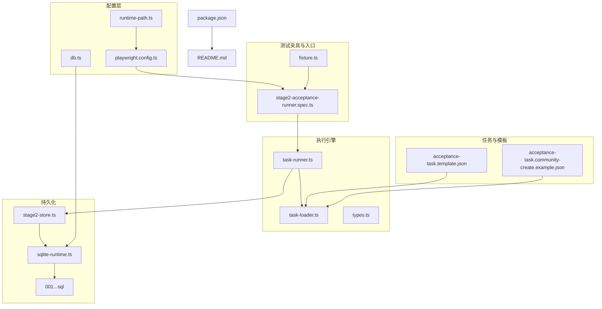
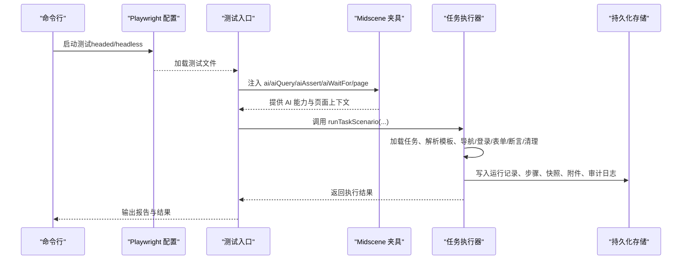
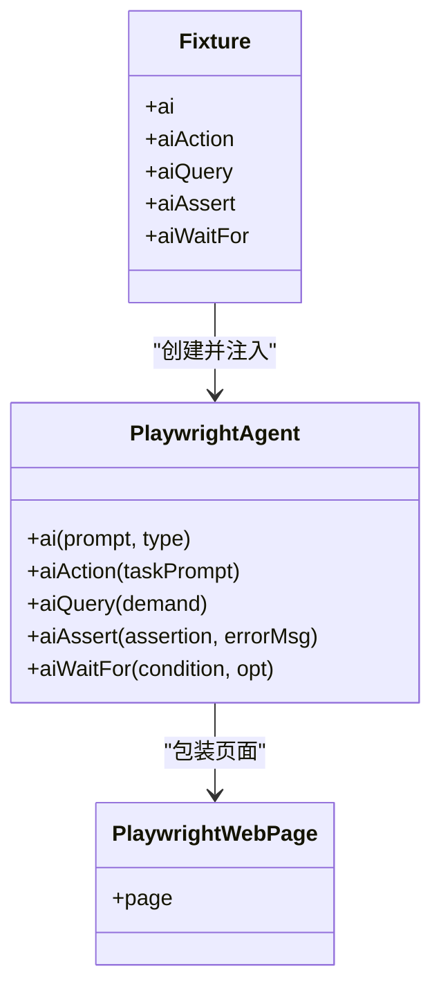
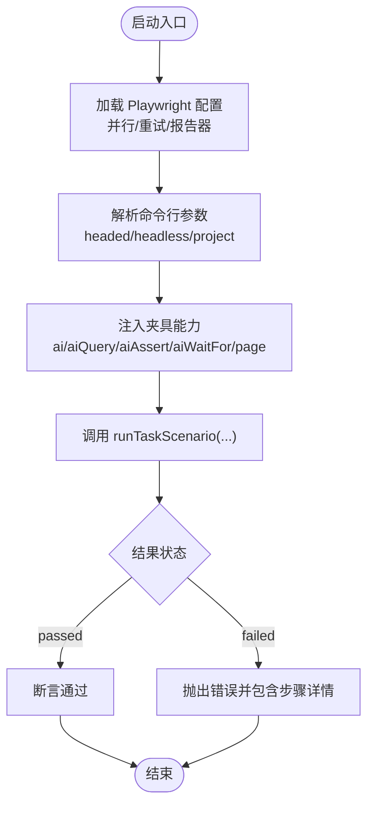
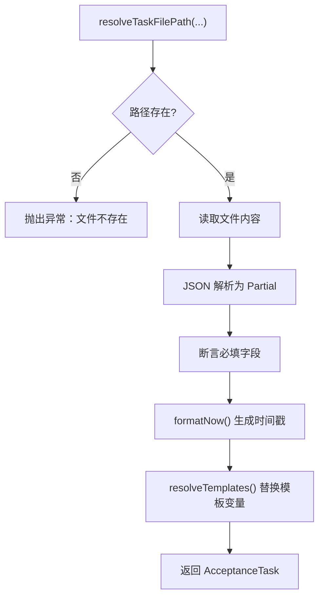
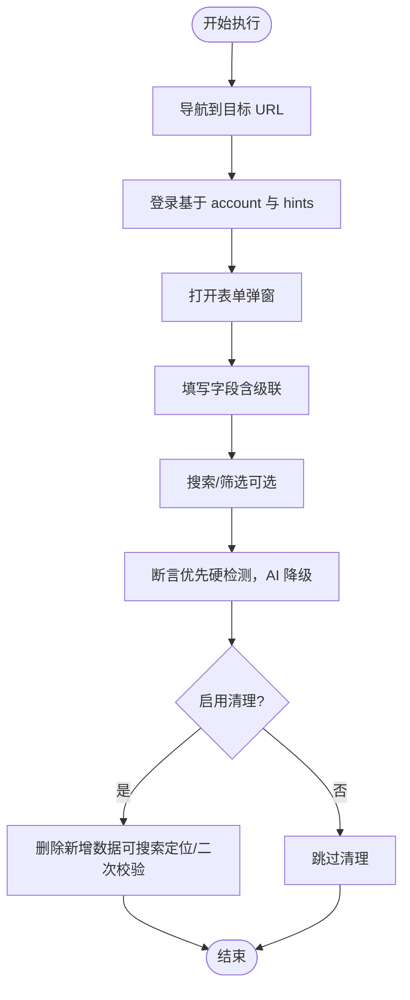
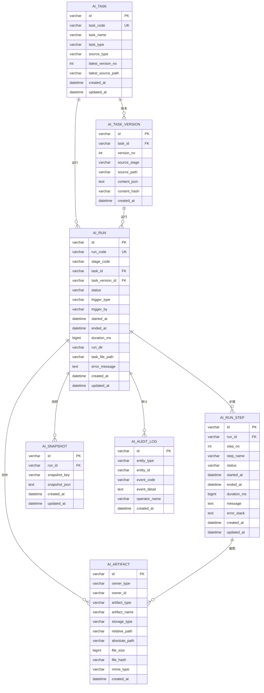
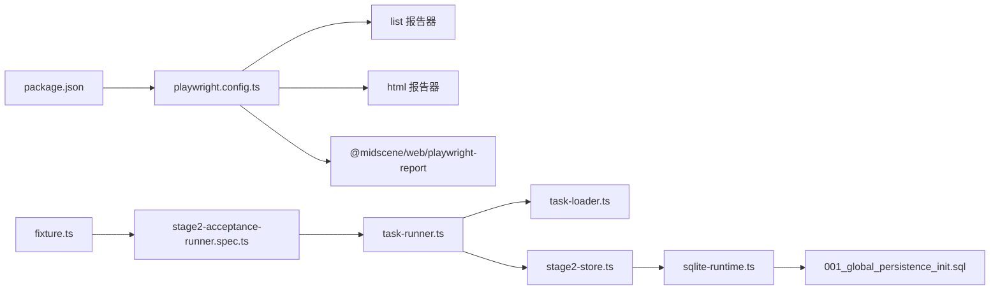

# 测试执行系统

<cite>
**本文引用的文件**
- [playwright.config.ts](file://playwright.config.ts)
- [package.json](file://package.json)
- [README.md](file://README.md)
- [tests/fixture/fixture.ts](file://tests/fixture/fixture.ts)
- [tests/generated/stage2-acceptance-runner.spec.ts](file://tests/generated/stage2-acceptance-runner.spec.ts)
- [src/stage2/task-runner.ts](file://src/stage2/task-runner.ts)
- [src/stage2/task-loader.ts](file://src/stage2/task-loader.ts)
- [src/stage2/types.ts](file://src/stage2/types.ts)
- [src/persistence/stage2-store.ts](file://src/persistence/stage2-store.ts)
- [src/persistence/sqlite-runtime.ts](file://src/persistence/sqlite-runtime.ts)
- [config/runtime-path.ts](file://config/runtime-path.ts)
- [config/db.ts](file://config/db.ts)
- [scripts/db/migrate.mjs](file://scripts/db/migrate.mjs)
- [db/migrations/001_global_persistence_init.sql](file://db/migrations/001_global_persistence_init.sql)
- [specs/tasks/acceptance-task.template.json](file://specs/tasks/acceptance-task.template.json)
- [specs/tasks/acceptance-task.community-create.example.json](file://specs/tasks/acceptance-task.community-create.example.json)
</cite>

## 目录
1. [简介](#简介)
2. [项目结构](#项目结构)
3. [核心组件](#核心组件)
4. [架构总览](#架构总览)
5. [详细组件分析](#详细组件分析)
6. [依赖关系分析](#依赖关系分析)
7. [性能考量](#性能考量)
8. [故障排除指南](#故障排除指南)
9. [结论](#结论)
10. [附录](#附录)

## 简介
本测试执行系统基于 Playwright 与 Midscene.js 的集成，提供端到端的验收测试自动化能力。系统通过 JSON 任务驱动第二段执行器，结合 Midscene 的 AI 能力进行页面交互、结构化提取与断言，并将执行过程与结果持久化至本地 SQLite 数据库。报告方面同时输出 Playwright HTML 报告与 Midscene 报告，便于可视化与审计。

## 项目结构
- 配置层
  - 运行时路径与环境变量解析：config/runtime-path.ts、config/db.ts
  - Playwright 测试配置：playwright.config.ts
  - 数据库迁移与初始化：scripts/db/migrate.mjs、db/migrations/001_global_persistence_init.sql
- 测试夹具与入口
  - Midscene + Playwright 夹具：tests/fixture/fixture.ts
  - 第二段执行入口：tests/generated/stage2-acceptance-runner.spec.ts
- 执行引擎与数据持久化
  - 任务加载与模板解析：src/stage2/task-loader.ts
  - 任务执行与滑块验证码处理：src/stage2/task-runner.ts
  - 类型定义：src/stage2/types.ts
  - 数据持久化与写库：src/persistence/stage2-store.ts、src/persistence/sqlite-runtime.ts
- 示例与模板
  - 任务模板与示例：specs/tasks/acceptance-task.template.json、specs/tasks/acceptance-task.community-create.example.json
- 包与脚本
  - npm 脚本与依赖：package.json
  - 项目说明：README.md

图表来源
- [playwright.config.ts:22-94](file://playwright.config.ts#L22-L94)
- [tests/fixture/fixture.ts:1-100](file://tests/fixture/fixture.ts#L1-L100)
- [tests/generated/stage2-acceptance-runner.spec.ts:1-39](file://tests/generated/stage2-acceptance-runner.spec.ts#L1-L39)
- [src/stage2/task-runner.ts:1-2657](file://src/stage2/task-runner.ts#L1-L2657)
- [src/stage2/task-loader.ts:1-91](file://src/stage2/task-loader.ts#L1-L91)
- [src/stage2/types.ts:1-180](file://src/stage2/types.ts#L1-L180)
- [src/persistence/stage2-store.ts:1-655](file://src/persistence/stage2-store.ts#L1-L655)
- [src/persistence/sqlite-runtime.ts:1-116](file://src/persistence/sqlite-runtime.ts#L1-L116)
- [config/runtime-path.ts:1-41](file://config/runtime-path.ts#L1-L41)
- [config/db.ts:1-28](file://config/db.ts#L1-L28)
- [db/migrations/001_global_persistence_init.sql:1-128](file://db/migrations/001_global_persistence_init.sql#L1-L128)
- [specs/tasks/acceptance-task.template.json:1-141](file://specs/tasks/acceptance-task.template.json#L1-L141)
- [specs/tasks/acceptance-task.community-create.example.json:1-229](file://specs/tasks/acceptance-task.community-create.example.json#L1-L229)
- [package.json:1-26](file://package.json#L1-L26)
- [README.md:1-223](file://README.md#L1-L223)

章节来源
- [README.md:1-223](file://README.md#L1-L223)
- [package.json:1-26](file://package.json#L1-L26)

## 核心组件
- 测试夹具（Midscene + Playwright）
  - 提供 ai、aiAction、aiQuery、aiAssert、aiWaitFor 等能力，封装 Midscene Agent 与 Playwright 页面交互，支持缓存、分组报告与日志目录设置。
- 任务加载器
  - 解析任务文件路径、校验必要字段、支持模板变量（如 NOW_YYYYMMDDHHMMSS）、加载并返回标准化任务对象。
- 任务执行器
  - 实现导航、登录、表单填写、级联选择、搜索、断言、清理等完整流程；内置滑块验证码自动处理与人工兜底策略。
- 数据持久化
  - 将任务、版本、运行、步骤、快照、附件与审计日志写入 SQLite，支持迁移与索引优化。
- 运行时路径与数据库配置
  - 统一通过 .env 与 runtime-path.ts 解析输出目录、报告目录、Midscene 日志目录、数据库文件路径等。
- Playwright 配置
  - 集成 list、HTML、Midscene 报告器；并行执行、重试策略、CI 适配、trace 收集等。

章节来源
- [tests/fixture/fixture.ts:1-100](file://tests/fixture/fixture.ts#L1-L100)
- [src/stage2/task-loader.ts:1-91](file://src/stage2/task-loader.ts#L1-L91)
- [src/stage2/task-runner.ts:1-2657](file://src/stage2/task-runner.ts#L1-L2657)
- [src/persistence/stage2-store.ts:1-655](file://src/persistence/stage2-store.ts#L1-L655)
- [src/persistence/sqlite-runtime.ts:1-116](file://src/persistence/sqlite-runtime.ts#L1-L116)
- [config/runtime-path.ts:1-41](file://config/runtime-path.ts#L1-L41)
- [config/db.ts:1-28](file://config/db.ts#L1-L28)
- [playwright.config.ts:22-94](file://playwright.config.ts#L22-L94)

## 架构总览
系统采用“配置 → 夹具 → 入口 → 执行器 → 持久化”的分层架构。入口通过夹具注入 AI 能力与页面上下文，执行器按任务 JSON 编排步骤，期间结合 Midscene 的 AI 查询与断言能力，最终将结构化结果与截图等附件落盘并写入数据库。

图表来源
- [playwright.config.ts:22-94](file://playwright.config.ts#L22-L94)
- [tests/generated/stage2-acceptance-runner.spec.ts:1-39](file://tests/generated/stage2-acceptance-runner.spec.ts#L1-L39)
- [tests/fixture/fixture.ts:1-100](file://tests/fixture/fixture.ts#L1-L100)
- [src/stage2/task-runner.ts:1-2657](file://src/stage2/task-runner.ts#L1-L2657)
- [src/persistence/stage2-store.ts:1-655](file://src/persistence/stage2-store.ts#L1-L655)

## 详细组件分析

### 测试夹具（Midscene + Playwright）
- 能力扩展
  - ai/aiAction/aiQuery/aiAssert/aiWaitFor：通过 PlaywrightAgent 封装，支持缓存 ID、分组报告与日志目录设置。
- 日志与缓存
  - setLogDir 设置 Midscene 日志目录；cacheId 基于 testId 与安全字符清洗，避免非法路径。
- 使用方式
  - 在测试入口中导入并解构使用，确保每个测试用例拥有独立的分组与缓存空间。

图表来源
- [tests/fixture/fixture.ts:1-100](file://tests/fixture/fixture.ts#L1-L100)

章节来源
- [tests/fixture/fixture.ts:1-100](file://tests/fixture/fixture.ts#L1-L100)

### 测试执行入口与参数配置
- 入口文件
  - tests/generated/stage2-acceptance-runner.spec.ts：定义 describe 与测试用例，注入页面与 AI 能力，调用 runTaskScenario 并断言结果。
- 参数与模式
  - headed/headless：通过 playwright test --headed 或 --project=chromium 控制浏览器可见性；任务 JSON 中 target.headless 可覆盖。
  - 超时与重试：入口设置较长超时，Playwright 配置设置全局超时、并行与重试策略。
- 运行脚本
  - package.json 提供 stage2:run 与 stage2:run:headed 两种执行方式，分别指定项目与可见模式。

图表来源
- [tests/generated/stage2-acceptance-runner.spec.ts:1-39](file://tests/generated/stage2-acceptance-runner.spec.ts#L1-L39)
- [playwright.config.ts:22-94](file://playwright.config.ts#L22-L94)
- [package.json:6-11](file://package.json#L6-L11)

章节来源
- [tests/generated/stage2-acceptance-runner.spec.ts:1-39](file://tests/generated/stage2-acceptance-runner.spec.ts#L1-L39)
- [package.json:6-11](file://package.json#L6-L11)
- [README.md:154-180](file://README.md#L154-L180)

### 任务加载与模板解析
- 路径解析
  - 支持传参、环境变量与默认路径，绝对/相对路径自动转换。
- 模板变量
  - NOW_YYYYMMDDHHMMSS：注入当前时间戳，避免重复数据。
  - 环境变量占位符：${VARNAME} 替换为 process.env.VARNAME。
- 校验与断言
  - 必填字段校验（taskId、taskName、target.url、account.username/password、form.openButtonText/submitButtonText、form.fields）。
- 加载流程
  - 读取文件 → JSON 解析 → 校验 → 模板替换 → 返回 AcceptanceTask。

图表来源
- [src/stage2/task-loader.ts:71-91](file://src/stage2/task-loader.ts#L71-L91)

章节来源
- [src/stage2/task-loader.ts:1-91](file://src/stage2/task-loader.ts#L1-L91)
- [specs/tasks/acceptance-task.template.json:1-141](file://specs/tasks/acceptance-task.template.json#L1-L141)
- [specs/tasks/acceptance-task.community-create.example.json:1-229](file://specs/tasks/acceptance-task.community-create.example.json#L1-L229)

### 任务执行器与生命周期管理
- 生命周期
  - 初始化：创建运行目录、截图目录、设置页面超时、初始化持久化存储。
  - 步骤执行：导航、登录、表单填写、级联选择、搜索、断言、清理。
  - 结束：更新运行记录、写入最终结果与快照、生成审计日志。
- 关键流程
  - 导航与登录：按任务 JSON 的 target.url 与 account.loginHints 执行。
  - 表单填写：支持普通输入与级联选择，候选选择器与占位提示增强鲁棒性。
  - 断言：优先使用 Playwright 硬检测；复杂场景使用 aiQuery + 代码断言；table-cell-equals/contains 降级策略。
  - 清理：支持删除新增数据，可选搜索定位与二次校验。
- 滑块验证码处理
  - 检测：基于文本与选择器模式识别挑战。
  - 自动：AI 查询滑块位置与轨道宽度，模拟真人拖动轨迹（easeOut、抖动、分步移动）。
  - 人工兜底：在超时内轮询等待挑战消失。
  - 失败策略：fail 模式直接抛错；ignore 模式跳过检测。

图表来源
- [src/stage2/task-runner.ts:1-2657](file://src/stage2/task-runner.ts#L1-L2657)

章节来源
- [src/stage2/task-runner.ts:1-2657](file://src/stage2/task-runner.ts#L1-L2657)
- [README.md:64-75](file://README.md#L64-L75)

### 数据持久化与报告
- 运行产物目录
  - Playwright 输出目录、HTML 报告目录、Midscene 日志与缓存目录、验收结果目录、数据库文件。
- 写库内容
  - ai_task、ai_task_version、ai_run、ai_run_step、ai_snapshot、ai_artifact、ai_audit_log。
  - 附件类型涵盖 task_json、result_json、progress_json、screenshot、playwright_report、midscene_report 等。
- 报告生成
  - Playwright：list + html 报告器，HTML 报告输出到指定目录。
  - Midscene：夹具设置 generateReport=true，日志目录由 runtime-path.ts 解析。
- 迁移与初始化
  - scripts/db/migrate.mjs 执行迁移文件，db/migrations/001_global_persistence_init.sql 定义表结构与索引。

图表来源
- [db/migrations/001_global_persistence_init.sql:1-128](file://db/migrations/001_global_persistence_init.sql#L1-L128)
- [src/persistence/stage2-store.ts:1-655](file://src/persistence/stage2-store.ts#L1-L655)
- [src/persistence/sqlite-runtime.ts:1-116](file://src/persistence/sqlite-runtime.ts#L1-L116)

章节来源
- [README.md:76-120](file://README.md#L76-L120)
- [config/runtime-path.ts:1-41](file://config/runtime-path.ts#L1-L41)
- [config/db.ts:1-28](file://config/db.ts#L1-L28)
- [scripts/db/migrate.mjs:1-52](file://scripts/db/migrate.mjs#L1-L52)
- [src/persistence/stage2-store.ts:1-655](file://src/persistence/stage2-store.ts#L1-L655)
- [src/persistence/sqlite-runtime.ts:1-116](file://src/persistence/sqlite-runtime.ts#L1-L116)

### 类型定义与任务模型
- 任务模型
  - AcceptanceTask：包含 target、account、navigation、uiProfile、form、search、assertions、cleanup、runtime、approval 等字段。
- 执行结果
  - Stage2ExecutionResult：包含任务标识、时间戳、状态、运行目录、解析值、快照、步骤列表等。
- 步骤结果
  - StepResult：包含步骤名称、状态、时间戳、耗时、截图路径、消息与错误栈。

章节来源
- [src/stage2/types.ts:1-180](file://src/stage2/types.ts#L1-L180)

## 依赖关系分析
- 外部依赖
  - @playwright/test：测试框架与浏览器驱动
  - @midscene/web：AI 能力与报告器
  - dotenv：环境变量加载
  - node:sqlite：本地数据库驱动（需 --experimental-sqlite）
- 内部模块耦合
  - 入口依赖夹具与执行器；执行器依赖任务加载器与持久化；持久化依赖数据库配置与迁移。
- 报告器链路
  - Playwright 配置中注册 list、html、@midscene/web/playwright-report 三类报告器，分别输出控制台列表、HTML 报告与 Midscene 报告。

图表来源
- [playwright.config.ts:36-40](file://playwright.config.ts#L36-L40)
- [tests/generated/stage2-acceptance-runner.spec.ts:1-39](file://tests/generated/stage2-acceptance-runner.spec.ts#L1-L39)
- [src/stage2/task-runner.ts:1-2657](file://src/stage2/task-runner.ts#L1-L2657)
- [src/stage2/task-loader.ts:1-91](file://src/stage2/task-loader.ts#L1-L91)
- [src/persistence/stage2-store.ts:1-655](file://src/persistence/stage2-store.ts#L1-L655)
- [src/persistence/sqlite-runtime.ts:1-116](file://src/persistence/sqlite-runtime.ts#L1-L116)
- [db/migrations/001_global_persistence_init.sql:1-128](file://db/migrations/001_global_persistence_init.sql#L1-L128)
- [tests/fixture/fixture.ts:1-100](file://tests/fixture/fixture.ts#L1-L100)
- [package.json:15-24](file://package.json#L15-L24)

章节来源
- [playwright.config.ts:36-40](file://playwright.config.ts#L36-L40)
- [package.json:15-24](file://package.json#L15-L24)

## 性能考量
- 并发与并行
  - Playwright fullyParallel: true，CI 环境 workers: 1，避免资源竞争；本地开发可充分利用多核。
- 超时与重试
  - 全局 timeout、步骤与页面超时、CI 上重试策略，平衡稳定性与速度。
- 截图与 Trace
  - 可按需开启截图与 trace，避免在大规模执行时产生过多 IO；建议仅在失败或关键步骤开启。
- 数据库写入
  - 写库采用事务化与索引优化，避免频繁小事务；批量写入快照与附件路径，减少磁盘压力。
- 滑块处理
  - 自动模式采用分步与抖动模拟，提升成功率；失败重试与人工兜底保障可用性。

## 故障排除指南
- 滑块验证码
  - 现象：页面出现滑块/安全验证。
  - 处理：根据 STAGE2_CAPTCHA_MODE 选择 fail/auto/manual/ignore；若自动失败，检查检测选择器与截图样式；人工模式可延长等待时间。
- 登录失败
  - 现象：登录页元素无法匹配。
  - 处理：核对 account.loginHints 与 target.url；确认页面加载完成后再执行登录。
- 断言失败
  - 现象：toast/table-row/table-cell 等断言不通过。
  - 处理：优先使用 Playwright 硬检测；AI 断言失败时，检查 aiQuery 的需求描述与页面结构变化。
- 清理失败
  - 现象：删除新增数据后仍存在。
  - 处理：启用 verifyAfterCleanup；检查 rowMatchMode 与搜索前置条件；确认确认弹窗文案。
- 报告与日志
  - Playwright HTML 报告：查看 t_runtime/playwright-report；Midscene 报告：查看 t_runtime/midscene_run/report；截图：t_runtime/acceptance-results/<taskId>/<timestamp>/screenshots。
- 数据库问题
  - 现象：写库失败或表结构缺失。
  - 处理：执行 npm run db:migrate；确认 db 驱动与文件路径；检查迁移是否已应用。

章节来源
- [README.md:64-95](file://README.md#L64-L95)
- [src/stage2/task-runner.ts:650-706](file://src/stage2/task-runner.ts#L650-L706)
- [scripts/db/migrate.mjs:1-52](file://scripts/db/migrate.mjs#L1-L52)
- [src/persistence/stage2-store.ts:1-655](file://src/persistence/stage2-store.ts#L1-L655)

## 结论
该测试执行系统通过 Playwright 与 Midscene 的深度集成，实现了从任务 JSON 到端到端执行再到结构化结果与持久化的完整闭环。系统具备良好的可配置性（headed/headless、超时、重试、报告器）、可扩展性（跨平台 UI Profile、断言降级策略）与可观测性（截图、Trace、报告、数据库审计）。配合合理的性能优化与故障排除策略，可在不同规模与环境下稳定运行。

## 附录
- 运行与调试
  - 本地调试：npx playwright test --headed tests/generated/stage2-acceptance-runner.spec.ts
  - 第二段执行：npm run stage2:run 或 npm run stage2:run:headed
  - 数据库初始化与迁移：npm run db:init、npm run db:migrate
- 最佳实践
  - 断言优先使用 Playwright 硬检测；AI 操作作为兜底；合理设置 soft 断言与重试；启用截图与 trace 以便复盘；清理策略应可验证且可回滚。