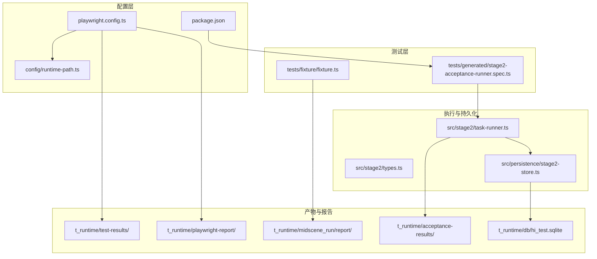
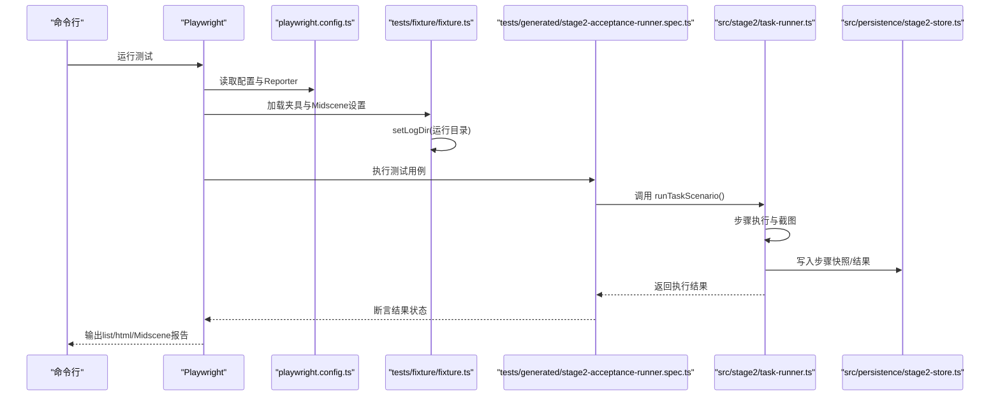
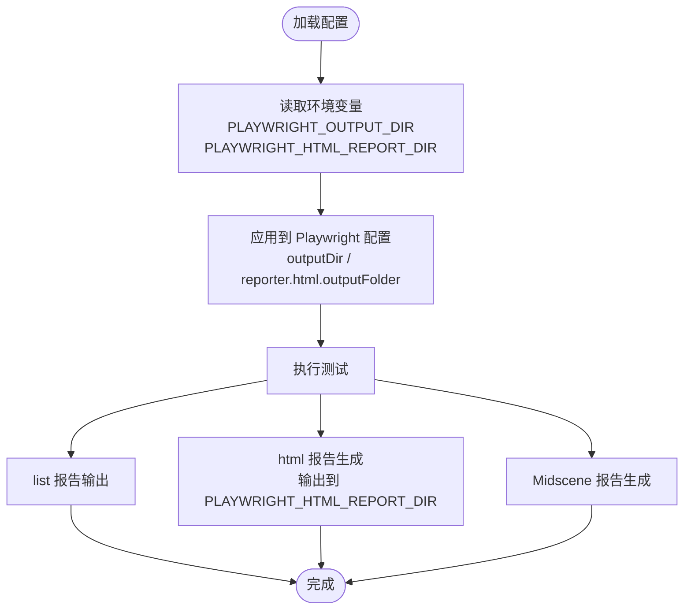
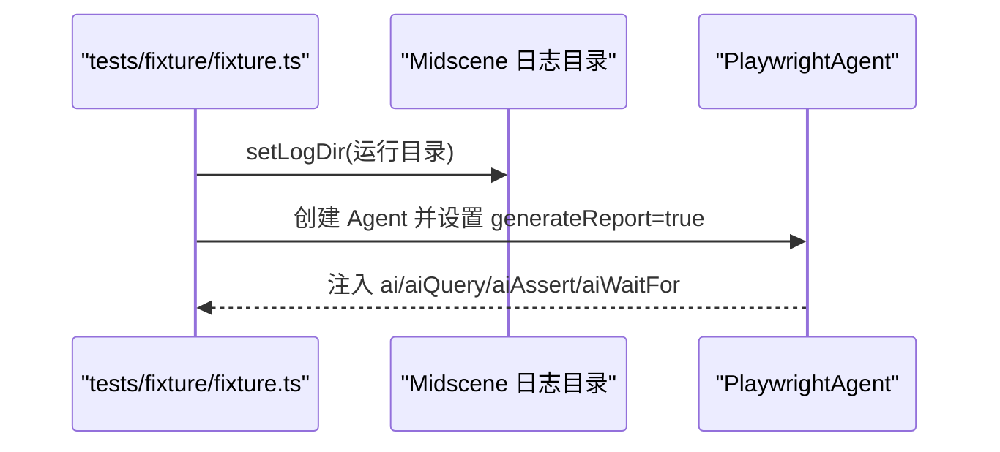
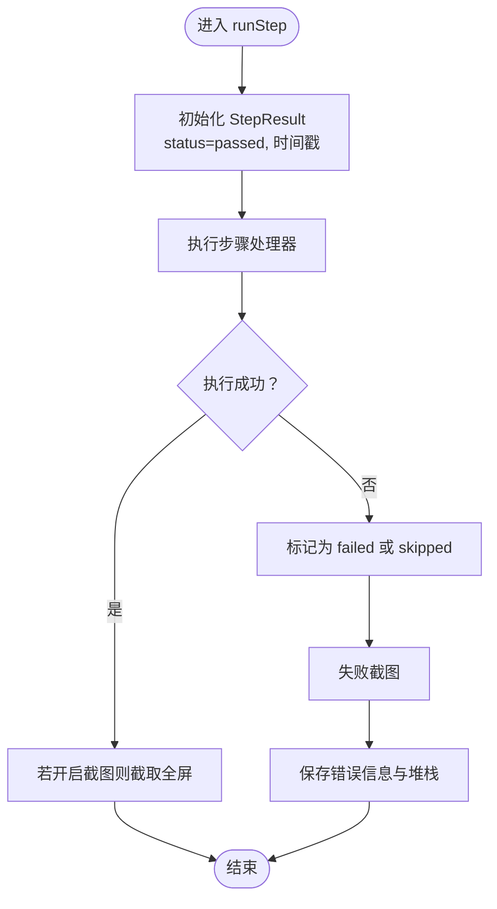
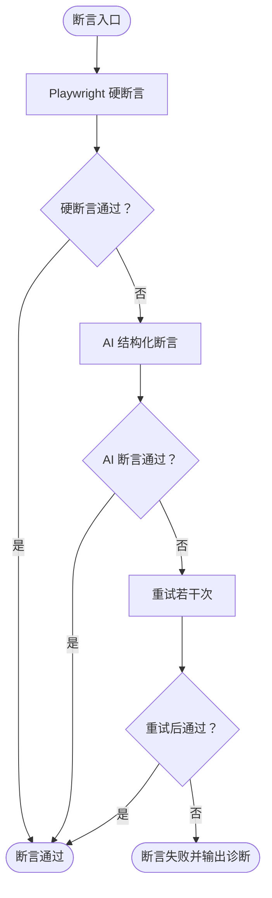
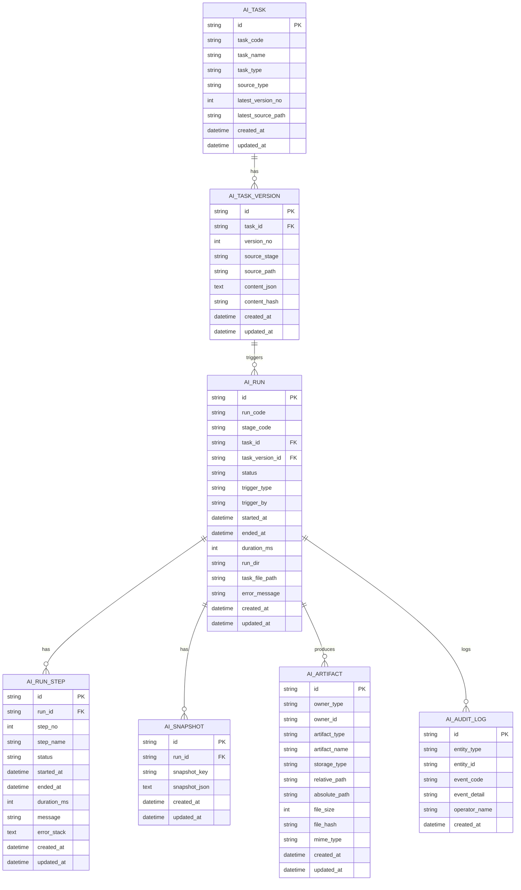
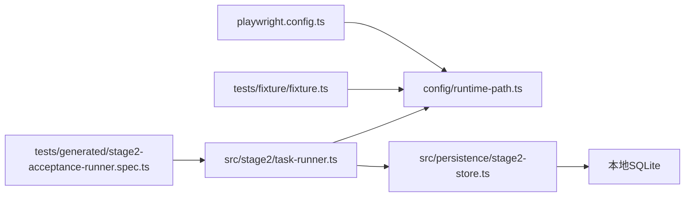

# 测试报告生成

<cite>
**本文引用的文件**
- [playwright.config.ts](file://playwright.config.ts)
- [package.json](file://package.json)
- [config/runtime-path.ts](file://config/runtime-path.ts)
- [tests/fixture/fixture.ts](file://tests/fixture/fixture.ts)
- [tests/generated/stage2-acceptance-runner.spec.ts](file://tests/generated/stage2-acceptance-runner.spec.ts)
- [src/stage2/task-runner.ts](file://src/stage2/task-runner.ts)
- [src/stage2/types.ts](file://src/stage2/types.ts)
- [src/persistence/stage2-store.ts](file://src/persistence/stage2-store.ts)
- [README.md](file://README.md)
</cite>

## 目录
1. [简介](#简介)
2. [项目结构](#项目结构)
3. [核心组件](#核心组件)
4. [架构总览](#架构总览)
5. [详细组件分析](#详细组件分析)
6. [依赖关系分析](#依赖关系分析)
7. [性能考量](#性能考量)
8. [故障排除指南](#故障排除指南)
9. [结论](#结论)
10. [附录](#附录)

## 简介
本文件聚焦于测试报告生成机制，涵盖测试执行结果的收集与处理、执行状态跟踪、步骤结果记录、错误信息收集、Playwright HTML 报告与 Midscene 报告的配置与输出、结果验证机制、以及报告分析与故障排除方法。文档面向不同技术背景的读者，既提供高层概览也包含代码级细节与可视化图示。

## 项目结构
该项目采用 Playwright + Midscene 的组合进行 AI 驱动的端到端测试，并通过统一的运行时目录配置与持久化存储，将测试产物（截图、报告、结果 JSON、数据库快照）集中管理。

图表来源
- [playwright.config.ts:22-40](file://playwright.config.ts#L22-L40)
- [config/runtime-path.ts:18-36](file://config/runtime-path.ts#L18-L36)
- [tests/fixture/fixture.ts:10](file://tests/fixture/fixture.ts#L10)
- [tests/generated/stage2-acceptance-runner.spec.ts:12-37](file://tests/generated/stage2-acceptance-runner.spec.ts#L12-L37)
- [src/stage2/task-runner.ts:111-120](file://src/stage2/task-runner.ts#L111-L120)
- [src/persistence/stage2-store.ts:592-630](file://src/persistence/stage2-store.ts#L592-L630)

章节来源
- [playwright.config.ts:22-40](file://playwright.config.ts#L22-L40)
- [config/runtime-path.ts:18-36](file://config/runtime-path.ts#L18-L36)
- [tests/fixture/fixture.ts:10](file://tests/fixture/fixture.ts#L10)
- [tests/generated/stage2-acceptance-runner.spec.ts:12-37](file://tests/generated/stage2-acceptance-runner.spec.ts#L12-L37)
- [src/stage2/task-runner.ts:111-120](file://src/stage2/task-runner.ts#L111-L120)
- [src/persistence/stage2-store.ts:592-630](file://src/persistence/stage2-store.ts#L592-L630)

## 核心组件
- Playwright 配置与报告
  - 通过配置文件启用 list、html、Midscene 报告三种 Reporter，并将输出目录与 HTML 报告目录从环境变量读取。
  - 配置了 trace 收集策略，便于失败重试时分析。
- Midscene 夹具与报告
  - 在测试夹具中设置 Midscene 日志目录，并注入 ai、aiQuery、aiAssert、aiWaitFor 等 AI 能力，开启报告生成。
- 执行器与结果持久化
  - 执行器负责步骤级的执行、截图、错误捕获与结果记录，并将中间快照与最终结果写入本地 SQLite 数据库。
- 结果验证与断言
  - 通过硬断言（Playwright 定位器）与 AI 断言相结合的方式，提供重试与降级策略，失败时输出详细诊断信息。

章节来源
- [playwright.config.ts:35-48](file://playwright.config.ts#L35-L48)
- [tests/fixture/fixture.ts:23-99](file://tests/fixture/fixture.ts#L23-L99)
- [src/stage2/task-runner.ts:2382-2412](file://src/stage2/task-runner.ts#L2382-L2412)
- [src/persistence/stage2-store.ts:470-493](file://src/persistence/stage2-store.ts#L470-L493)

## 架构总览
测试执行从 Playwright 测试入口开始，经由 Midscene 夹具调用 AI 能力，执行器按步骤执行并记录截图与错误，最终生成多种报告并持久化结果。

图表来源
- [playwright.config.ts:22-40](file://playwright.config.ts#L22-L40)
- [tests/fixture/fixture.ts:10](file://tests/fixture/fixture.ts#L10)
- [tests/generated/stage2-acceptance-runner.spec.ts:12-37](file://tests/generated/stage2-acceptance-runner.spec.ts#L12-L37)
- [src/stage2/task-runner.ts:2382-2412](file://src/stage2/task-runner.ts#L2382-L2412)
- [src/persistence/stage2-store.ts:470-493](file://src/persistence/stage2-store.ts#L470-L493)

## 详细组件分析

### Playwright HTML 报告配置与生成
- 报告器配置
  - 使用 list、html、Midscene 报告器组合，HTML 报告输出目录来自环境变量，避免硬编码。
- 输出路径
  - 执行产物目录与 HTML 报告目录均通过运行时路径模块解析，支持通过环境变量覆盖。
- Trace 收集
  - 在首次重试时收集 trace，便于失败分析。

图表来源
- [playwright.config.ts:22-40](file://playwright.config.ts#L22-L40)
- [config/runtime-path.ts:18-26](file://config/runtime-path.ts#L18-L26)

章节来源
- [playwright.config.ts:22-40](file://playwright.config.ts#L22-L40)
- [config/runtime-path.ts:18-26](file://config/runtime-path.ts#L18-L26)

### Midscene 报告配置与输出
- 日志目录设置
  - 在夹具中设置 Midscene 日志目录，确保报告、缓存、dump 等产物统一输出到运行时目录。
- 报告生成
  - 夹具注入的 AI 能力开启报告生成，测试结束后可在 Midscene 报告目录查看 AI 操作记录与断言结果。

图表来源
- [tests/fixture/fixture.ts:10](file://tests/fixture/fixture.ts#L10)
- [tests/fixture/fixture.ts:23-99](file://tests/fixture/fixture.ts#L23-L99)

章节来源
- [tests/fixture/fixture.ts:10](file://tests/fixture/fixture.ts#L10)
- [tests/fixture/fixture.ts:23-99](file://tests/fixture/fixture.ts#L23-L99)

### 执行状态跟踪与步骤结果记录
- 步骤执行框架
  - 每个步骤封装为 runStep，记录开始/结束时间、耗时、状态（passed/failed/skipped）、截图路径、错误信息与堆栈。
- 截图策略
  - 可根据配置在每步执行后截取全屏截图，失败时额外生成失败标记的截图。
- 错误信息收集
  - 捕获异常并填充 message 与 errorStack，便于后续报告与诊断。

图表来源
- [src/stage2/task-runner.ts:2382-2412](file://src/stage2/task-runner.ts#L2382-L2412)

章节来源
- [src/stage2/task-runner.ts:2382-2412](file://src/stage2/task-runner.ts#L2382-L2412)

### 结果验证机制与断言
- 验证策略
  - 优先使用 Playwright 硬断言（定位器 + 重试），AI 断言作为兜底，失败时输出详细诊断信息。
- 重试与降级
  - 断言执行器支持重试与降级策略，保留最后一次结果以便失败时输出诊断。
- 通过/失败判断
  - 测试用例根据最终执行结果 status 判断通过/失败，并在失败时抛出包含步骤名称、消息与截图路径的错误。

图表来源
- [src/stage2/task-runner.ts:1532-1556](file://src/stage2/task-runner.ts#L1532-L1556)
- [src/stage2/task-runner.ts:1562-1871](file://src/stage2/task-runner.ts#L1562-L1871)
- [tests/generated/stage2-acceptance-runner.spec.ts:27-36](file://tests/generated/stage2-acceptance-runner.spec.ts#L27-L36)

章节来源
- [src/stage2/task-runner.ts:1532-1556](file://src/stage2/task-runner.ts#L1532-L1556)
- [src/stage2/task-runner.ts:1562-1871](file://src/stage2/task-runner.ts#L1562-L1871)
- [tests/generated/stage2-acceptance-runner.spec.ts:27-36](file://tests/generated/stage2-acceptance-runner.spec.ts#L27-L36)

### Midscene 报告的特殊配置与输出格式
- 生成开关
  - 夹具中显式设置 generateReport 为 true，确保 Midscene 报告生成。
- 输出目录
  - 通过 setLogDir 将 Midscene 的 report、dump、tmp、cache 等输出统一到运行时目录。
- 内容组成
  - 报告包含 AI 操作记录（ai、aiQuery、aiAssert、aiWaitFor）、断言结果、截图与调试信息等。

章节来源
- [tests/fixture/fixture.ts:23-99](file://tests/fixture/fixture.ts#L23-L99)
- [tests/fixture/fixture.ts:10](file://tests/fixture/fixture.ts#L10)

### 结果持久化与报告产物
- 中间快照
  - 执行器定期写入 resolved_values、query_snapshots、progress_state 等快照。
- 步骤与运行记录
  - 每一步骤写入 ai_run_step，运行结束更新 ai_run，并写入最终结果摘要与 result.json。
- 附件与审计
  - 将截图、报告、结果文件等作为附件记录，同时写入审计日志。

图表来源
- [src/persistence/stage2-store.ts:135-331](file://src/persistence/stage2-store.ts#L135-L331)
- [src/persistence/stage2-store.ts:470-630](file://src/persistence/stage2-store.ts#L470-L630)

章节来源
- [src/persistence/stage2-store.ts:135-331](file://src/persistence/stage2-store.ts#L135-L331)
- [src/persistence/stage2-store.ts:470-630](file://src/persistence/stage2-store.ts#L470-L630)

## 依赖关系分析
- 配置依赖
  - playwright.config.ts 依赖 config/runtime-path.ts 解析输出目录与 HTML 报告目录。
- 夹具依赖
  - tests/fixture/fixture.ts 依赖 config/runtime-path.ts 设置 Midscene 日志目录。
- 执行器依赖
  - src/stage2/task-runner.ts 依赖 config/runtime-path.ts 生成运行目录与截图目录。
- 持久化依赖
  - src/persistence/stage2-store.ts 依赖 sqlite 数据库与迁移脚本，写入运行、步骤、快照、附件与审计日志。

图表来源
- [playwright.config.ts:22-40](file://playwright.config.ts#L22-L40)
- [config/runtime-path.ts:18-36](file://config/runtime-path.ts#L18-L36)
- [tests/fixture/fixture.ts:10](file://tests/fixture/fixture.ts#L10)
- [tests/generated/stage2-acceptance-runner.spec.ts:12-37](file://tests/generated/stage2-acceptance-runner.spec.ts#L12-L37)
- [src/stage2/task-runner.ts:111-120](file://src/stage2/task-runner.ts#L111-L120)
- [src/persistence/stage2-store.ts:592-630](file://src/persistence/stage2-store.ts#L592-L630)

章节来源
- [playwright.config.ts:22-40](file://playwright.config.ts#L22-L40)
- [config/runtime-path.ts:18-36](file://config/runtime-path.ts#L18-L36)
- [tests/fixture/fixture.ts:10](file://tests/fixture/fixture.ts#L10)
- [tests/generated/stage2-acceptance-runner.spec.ts:12-37](file://tests/generated/stage2-acceptance-runner.spec.ts#L12-L37)
- [src/stage2/task-runner.ts:111-120](file://src/stage2/task-runner.ts#L111-L120)
- [src/persistence/stage2-store.ts:592-630](file://src/persistence/stage2-store.ts#L592-L630)

## 性能考量
- 并行与重试
  - 配置中启用完全并行与 CI 环境下的重试策略，有助于提升执行效率，但需关注资源占用与报告一致性。
- 截图与报告体积
  - 步骤截图与 Midscene 报告会增加磁盘占用，建议在非必要场景关闭步骤截图或限制截图数量。
- 断言重试
  - 断言重试次数与延迟需平衡稳定性与执行时长，避免过度重试导致报告膨胀。

## 故障排除指南
- 查看 Playwright HTML 报告
  - 执行完成后在 HTML 报告目录查看测试结果与 trace，定位失败步骤与页面状态。
- 查看 Midscene 报告
  - 在 Midscene 报告目录查看 AI 操作记录、断言结果与截图，核对 AI 的理解与行为。
- 日志与截图分析
  - 检查第二段结果目录中的截图与 result.json，结合失败步骤的截图与错误堆栈定位问题。
- 错误诊断
  - 若断言失败，优先查看硬断言失败的定位器与期望值；若 AI 断言失败，查看 AI 查询与断言的返回结构。
- 环境变量与路径
  - 确认运行时目录前缀与各目录变量正确，避免报告与产物路径不一致。

章节来源
- [README.md:160-179](file://README.md#L160-L179)
- [src/stage2/task-runner.ts:2382-2412](file://src/stage2/task-runner.ts#L2382-L2412)
- [src/persistence/stage2-store.ts:470-493](file://src/persistence/stage2-store.ts#L470-L493)

## 结论
本项目通过 Playwright + Midscene 的组合实现了可追溯、可诊断的测试报告体系。执行器在步骤级记录截图与错误，持久化层将运行、步骤、快照与附件统一入库，配合多种报告输出，形成完整的测试闭环。建议在团队内统一运行目录与报告路径，合理配置断言重试与截图策略，以获得最佳的可维护性与诊断效率。

## 附录
- 运行与产物目录
  - 执行产物目录、HTML 报告目录、Midscene 报告目录、第二段结果目录、数据库文件等均由环境变量控制，建议统一通过 .env 管理。
- 最佳实践
  - 断言优先使用 Playwright 硬断言，AI 断言作为兜底；合理设置断言重试次数与延迟；在非必要场景关闭步骤截图；统一运行目录前缀与命名规范。

章节来源
- [README.md:76-96](file://README.md#L76-L96)
- [README.md:146-152](file://README.md#L146-L152)
- [config/runtime-path.ts:18-36](file://config/runtime-path.ts#L18-L36)