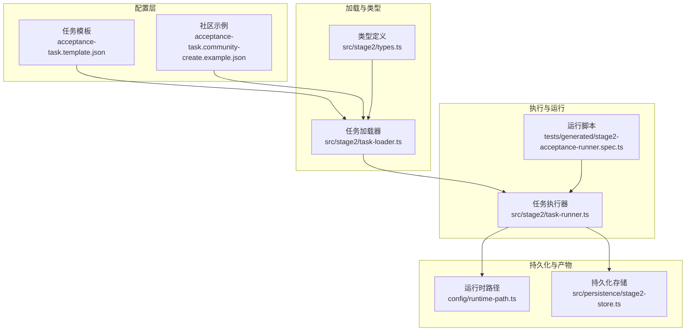
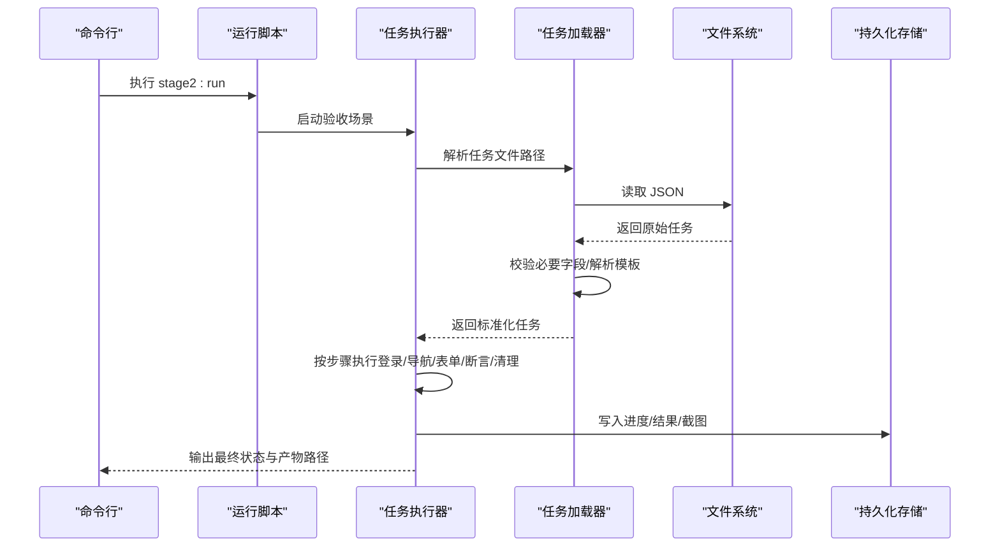
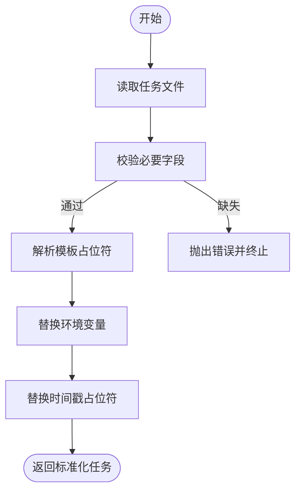
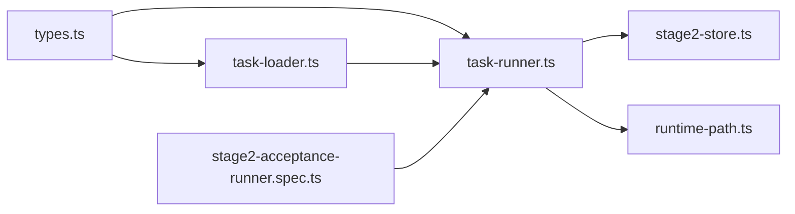

# 任务配置与模板

<cite>
**本文引用的文件**
- [acceptance-task.template.json](file://specs/tasks/acceptance-task.template.json)
- [acceptance-task.community-create.example.json](file://specs/tasks/acceptance-task.community-create.example.json)
- [types.ts](file://src/stage2/types.ts)
- [task-loader.ts](file://src/stage2/task-loader.ts)
- [task-runner.ts](file://src/stage2/task-runner.ts)
- [package.json](file://package.json)
- [runtime-path.ts](file://config/runtime-path.ts)
- [stage2-store.ts](file://src/persistence/stage2-store.ts)
- [stage2-acceptance-runner.spec.ts](file://tests/generated/stage2-acceptance-runner.spec.ts)
</cite>

## 目录
1. [简介](#简介)
2. [项目结构](#项目结构)
3. [核心组件](#核心组件)
4. [架构总览](#架构总览)
5. [详细组件分析](#详细组件分析)
6. [依赖关系分析](#依赖关系分析)
7. [性能考量](#性能考量)
8. [故障排查指南](#故障排查指南)
9. [结论](#结论)
10. [附录](#附录)

## 简介
本文件面向使用基于 JSON 的验收测试任务配置的工程师与测试人员，系统性说明 AcceptanceTask 接口的字段定义、数据类型与约束条件，详解任务模板的结构与使用方法，并提供最佳实践、参数化策略、条件执行逻辑、验证规则与调试技巧。文档同时给出社区创建任务示例与基础操作示例，帮助快速落地。

## 项目结构
本项目围绕“任务配置 → 加载解析 → 执行运行 → 结果持久化”的链路组织，关键目录与文件如下：
- specs/tasks：存放任务模板与社区示例 JSON
- src/stage2：任务类型定义、任务加载器、任务执行器
- config/runtime-path.ts：运行时目录与产物路径约定
- src/persistence：运行结果持久化存储
- tests/generated：生成的运行脚本，触发第二阶段验收执行

图表来源
- [acceptance-task.template.json:1-141](file://specs/tasks/acceptance-task.template.json#L1-L141)
- [acceptance-task.community-create.example.json:1-229](file://specs/tasks/acceptance-task.community-create.example.json#L1-L229)
- [types.ts:1-180](file://src/stage2/types.ts#L1-L180)
- [task-loader.ts:1-91](file://src/stage2/task-loader.ts#L1-L91)
- [task-runner.ts:1-2657](file://src/stage2/task-runner.ts#L1-L2657)
- [runtime-path.ts:1-40](file://config/runtime-path.ts#L1-L40)
- [stage2-store.ts:1-200](file://src/persistence/stage2-store.ts#L1-L200)
- [stage2-acceptance-runner.spec.ts:1-200](file://tests/generated/stage2-acceptance-runner.spec.ts#L1-L200)

章节来源
- [package.json:6-11](file://package.json#L6-L11)

## 核心组件
- AcceptanceTask 接口：定义任务配置的完整结构，包含目标、账户、导航、UI 配置、表单、搜索、断言、清理、运行时与审批等字段。
- 任务加载器：负责读取 JSON 文件、校验必要字段、解析模板变量（如环境变量与时间戳占位符）、输出标准化任务对象。
- 任务执行器：按步骤驱动 Playwright/AI 完成登录、导航、表单填写、提交、断言与清理，并记录步骤结果与截图。
- 类型系统：以 TypeScript 接口约束字段类型、可选性与默认行为，保证配置与执行的一致性。

章节来源
- [types.ts:141-154](file://src/stage2/types.ts#L141-L154)
- [task-loader.ts:50-89](file://src/stage2/task-loader.ts#L50-L89)
- [task-runner.ts:2318-2656](file://src/stage2/task-runner.ts#L2318-L2656)

## 架构总览
从配置到执行的关键流程如下：

图表来源
- [task-runner.ts:2318-2656](file://src/stage2/task-runner.ts#L2318-L2656)
- [task-loader.ts:71-89](file://src/stage2/task-loader.ts#L71-L89)
- [stage2-acceptance-runner.spec.ts:1-200](file://tests/generated/stage2-acceptance-runner.spec.ts#L1-L200)
- [stage2-store.ts:1-200](file://src/persistence/stage2-store.ts#L1-L200)

## 详细组件分析

### AcceptanceTask 接口与字段参考
- taskId: 字符串，唯一标识任务
- taskName: 字符串，任务名称
- target: TaskTarget
  - url: 字符串，必填
  - browser?: 字符串
  - headless?: 布尔值
- account: TaskAccount
  - username: 字符串，必填
  - password: 字符串，必填
  - loginHints?: 字符串数组
- navigation?: TaskNavigation
  - homeReadyText?: 字符串
  - menuPath?: 字符串数组
  - menuHints?: 字符串数组
- uiProfile?: TaskUiProfile
  - tableRowSelectors?: 字符串数组
  - toastSelectors?: 字符串数组
  - dialogSelectors?: 字符串数组
- form: TaskForm
  - openButtonText: 字符串，必填
  - dialogTitle?: 字符串
  - submitButtonText: 字符串，必填
  - closeButtonText?: 字符串
  - successText?: 字符串
  - notes?: 字符串数组
  - fields: TaskField[]
    - label: 字符串，必填
    - componentType: 'input' | 'textarea' | 'cascader' | string，必填
    - value: 字符串或字符串数组，必填
    - required?: 布尔值
    - unique?: 布尔值
    - hints?: 字符串数组
- search?: TaskSearch
  - inputLabel: 字符串，必填
  - extraInputLabels?: 字符串数组
  - keywordFromField?: 字符串
  - triggerButtonText?: 字符串
  - resetButtonText?: 字符串
  - resultTableTitle?: 字符串
  - notes?: 字符串数组
  - expectedColumns?: 字符串数组
  - rowActionButtons?: 字符串数组
  - pagination?: { pageSizeText?: string; summaryPattern?: string }
- assertions?: TaskAssertion[]
  - type: 字符串，必填
  - expectedText?: 字符串
  - matchField?: 字符串
  - expectedColumns?: 字符串数组
  - expectedColumnFromFields?: 记录映射
  - expectedColumnValues?: 记录映射
  - column?: 字符串
  - expectedFromField?: 字符串
  - matchMode?: 'exact' | 'contains'
  - timeoutMs?: 数字（毫秒）
  - retryCount?: 数字
  - soft?: 布尔值
  - description?: 字符串
- cleanup?: TaskCleanup
  - enabled?: 布尔值
  - strategy?: 'delete-created' | 'delete-all-matched' | 'custom' | 'none'
  - matchField?: 字符串
  - action?: TaskCleanupAction
    - actionType: 'delete' | 'custom'
    - rowButtonText?: 字符串
    - confirmDialogTitle?: 字符串
    - confirmButtonText?: 字符串
    - cancelButtonText?: 字符串
    - successText?: 字符串
    - customInstruction?: 字符串
    - hints?: 字符串数组
  - searchBeforeCleanup?: 布尔值
  - rowMatchMode?: 'exact' | 'contains'
  - verifyAfterCleanup?: 布尔值
  - failOnError?: 布尔值
  - notes?: 字符串
- runtime?: TaskRuntime
  - stepTimeoutMs?: 数字
  - pageTimeoutMs?: 数字
  - screenshotOnStep?: 布尔值
  - trace?: 布尔值
- approval?: TaskApproval
  - approved?: 布尔值
  - approvedBy?: 字符串
  - approvedAt?: ISO 时间字符串

章节来源
- [types.ts:5-154](file://src/stage2/types.ts#L5-L154)

### 任务模板与社区示例
- 基础模板：提供字段骨架与注释，便于快速填充
- 社区示例：以“物业平台-新增小区并回查”为例，展示字段取值、断言与清理策略

章节来源
- [acceptance-task.template.json:1-141](file://specs/tasks/acceptance-task.template.json#L1-L141)
- [acceptance-task.community-create.example.json:1-229](file://specs/tasks/acceptance-task.community-create.example.json#L1-L229)

### 参数化与模板解析
- 占位符支持
  - 环境变量：${ENV_NAME}，若未设置则解析为空字符串
  - 时间戳：${NOW_YYYYMMDDHHMMSS}，解析为当前时间的固定格式
- 解析流程
  - 读取 JSON
  - 校验必要字段（taskId、taskName、target.url、account.username/password、form.openButtonText/form.submitButtonText/form.fields）
  - 递归替换模板占位符
  - 输出标准化任务对象

图表来源
- [task-loader.ts:50-89](file://src/stage2/task-loader.ts#L50-L89)
- [task-loader.ts:19-48](file://src/stage2/task-loader.ts#L19-L48)

章节来源
- [task-loader.ts:50-89](file://src/stage2/task-loader.ts#L50-L89)

### 条件执行与断言策略
- 断言类型与策略
  - toast：优先使用 Playwright 硬检测，失败则使用 AI 断言兜底，支持重试
  - table-row-exists：先硬检测，失败则 AI 检测
  - table-cell-equals：先硬检测，失败则 AI 检测，支持列值映射与模糊比较
  - table-cell-contains：先硬检测，失败则 AI 检测
  - custom：由 AI 根据描述进行断言
- 行匹配模式：exact/contains，影响表格行定位与比较
- 软断言：soft=true 时，断言失败不中断流程，仅记录步骤失败

章节来源
- [task-runner.ts:1562-1917](file://src/stage2/task-runner.ts#L1562-L1917)

### 清理策略与回滚
- 策略
  - delete-created：删除本次新增数据（依据表单唯一字段）
  - delete-all-matched：通过 AI 查询当前列表，删除所有匹配项
  - custom：执行自定义 AI 指令
  - none：禁用清理
- 行为
  - 可选搜索定位、确认弹窗处理、成功提示检测、清理后校验
  - failOnError=true 时，清理失败会中断任务

章节来源
- [task-runner.ts:2218-2316](file://src/stage2/task-runner.ts#L2218-L2316)

### 运行时控制与产物
- 运行时参数
  - stepTimeoutMs/pageTimeoutMs：步骤与页面超时
  - screenshotOnStep：每步截图
  - trace：开启 Playwright Trace
- 产物
  - 截图目录：按任务 ID 与时间戳生成
  - 结果文件：result.json
  - 进度文件：result.partial.json
  - 持久化存储：运行记录、步骤记录、快照与工件

章节来源
- [task-runner.ts:2334-2341](file://src/stage2/task-runner.ts#L2334-L2341)
- [runtime-path.ts:1-40](file://config/runtime-path.ts#L1-L40)
- [stage2-store.ts:1-200](file://src/persistence/stage2-store.ts#L1-L200)

## 依赖关系分析
- 类型与实现耦合
  - types.ts 定义接口，task-runner.ts 严格遵循接口字段与默认行为
  - task-loader.ts 依赖 types.ts 的接口进行校验与解析
- 外部依赖
  - Playwright：页面自动化与断言
  - @midscene/web：AI 能力（ai、aiAssert、aiQuery、aiWaitFor）
  - dotenv：环境变量加载

图表来源
- [types.ts:1-180](file://src/stage2/types.ts#L1-L180)
- [task-runner.ts:1-2657](file://src/stage2/task-runner.ts#L1-L2657)
- [task-loader.ts:1-91](file://src/stage2/task-loader.ts#L1-L91)
- [stage2-store.ts:1-200](file://src/persistence/stage2-store.ts#L1-L200)
- [runtime-path.ts:1-40](file://config/runtime-path.ts#L1-L40)
- [stage2-acceptance-runner.spec.ts:1-200](file://tests/generated/stage2-acceptance-runner.spec.ts#L1-L200)

## 性能考量
- 重试与轮询
  - 断言默认重试次数与轮询间隔可调，避免瞬时不稳定导致失败
- 选择器优先级
  - uiProfile 中的表格/Toast/对话框选择器可按平台补充，减少误判
- 截图与 Trace
  - 截图与 Trace 有助于定位问题，但会增加 IO 与存储开销，建议按需开启

## 故障排查指南
- 常见错误与定位
  - 缺少必要字段：taskId、taskName、target.url、account.username/password、form.openButtonText/form.submitButtonText/form.fields
  - 登录失败：检查 account.loginHints 与页面元素匹配
  - 导航失败：确认 menuPath 与 menuHints，以及 homeReadyText 的可见性
  - 表单填写失败：核对字段 label/componentType/value，必要时使用 hints 辅助识别
  - 断言失败：区分 Playwright 硬检测与 AI 兜底，查看步骤截图与日志
  - 清理失败：确认 action 配置、确认弹窗标题/文案、清理后校验
- 调试技巧
  - 开启 screenshotOnStep 与 trace，结合运行目录截图与 Playwright 报告
  - 使用 NOW_YYYYMMDDHHMMSS 避免数据冲突，便于复现
  - 设置 STAGE2_CAPTCHA_MODE 控制安全验证处理策略
  - 使用 STAGE2_REQUIRE_APPROVAL 强制人工审批

章节来源
- [task-loader.ts:50-69](file://src/stage2/task-loader.ts#L50-L69)
- [task-runner.ts:650-706](file://src/stage2/task-runner.ts#L650-L706)
- [task-runner.ts:2318-2656](file://src/stage2/task-runner.ts#L2318-L2656)

## 结论
通过标准化的 AcceptanceTask 接口与严格的加载校验，配合 Playwright/AI 的混合断言与清理策略，本项目实现了高可维护、可扩展的验收测试配置体系。建议在团队内统一模板与最佳实践，结合参数化与条件执行，提升任务复用率与稳定性。

## 附录

### 字段参考速查
- 必填字段：taskId、taskName、target.url、account.username、account.password、form.openButtonText、form.submitButtonText、form.fields
- 可选字段：navigation、uiProfile、search、assertions、cleanup、runtime、approval
- 断言类型：toast、table-row-exists、table-cell-equals、table-cell-contains、custom
- 清理策略：delete-created、delete-all-matched、custom、none

章节来源
- [types.ts:5-154](file://src/stage2/types.ts#L5-L154)
- [task-loader.ts:50-69](file://src/stage2/task-loader.ts#L50-L69)

### 示例配置与最佳实践
- 基础操作示例：参见社区示例任务，覆盖表单填写、查询与断言
- 最佳实践
  - 明确唯一字段（unique）用于清理策略
  - 使用 hints 描述页面元素特征，提高定位稳定性
  - 为断言设置合理 timeoutMs 与 retryCount
  - 在 assertions 中区分软断言与硬断言，避免阻断流程
  - 清理策略选择 delete-created 并开启 verifyAfterCleanup

章节来源
- [acceptance-task.community-create.example.json:1-229](file://specs/tasks/acceptance-task.community-create.example.json#L1-L229)
- [task-runner.ts:1562-1917](file://src/stage2/task-runner.ts#L1562-L1917)