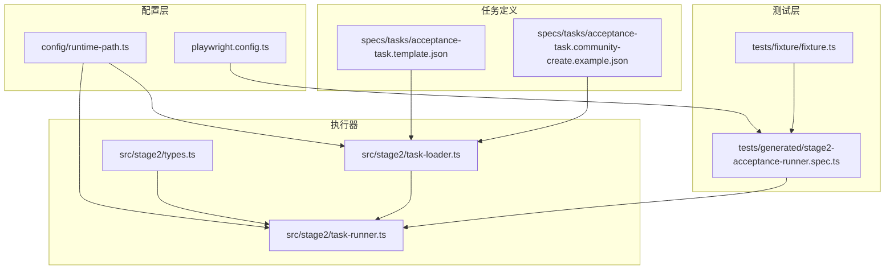
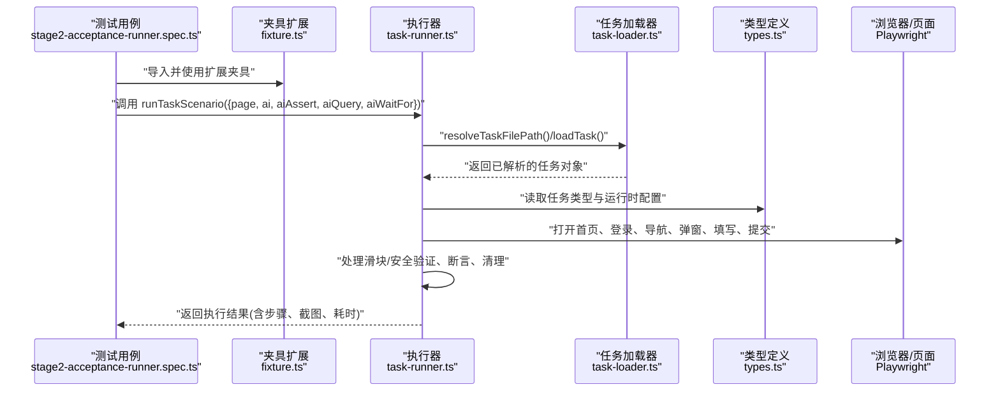
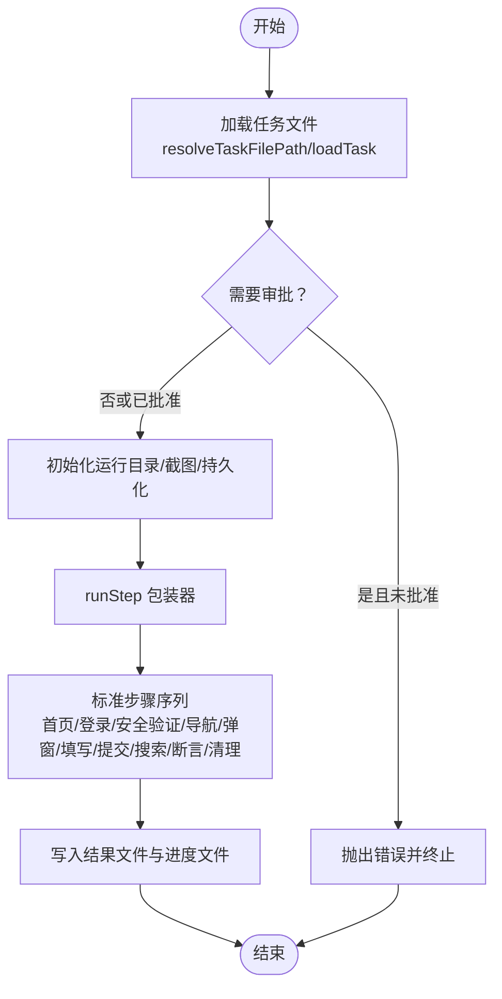
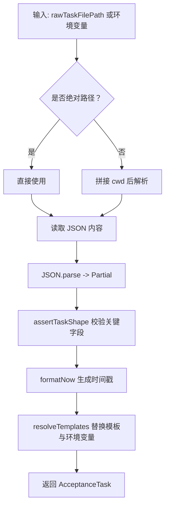
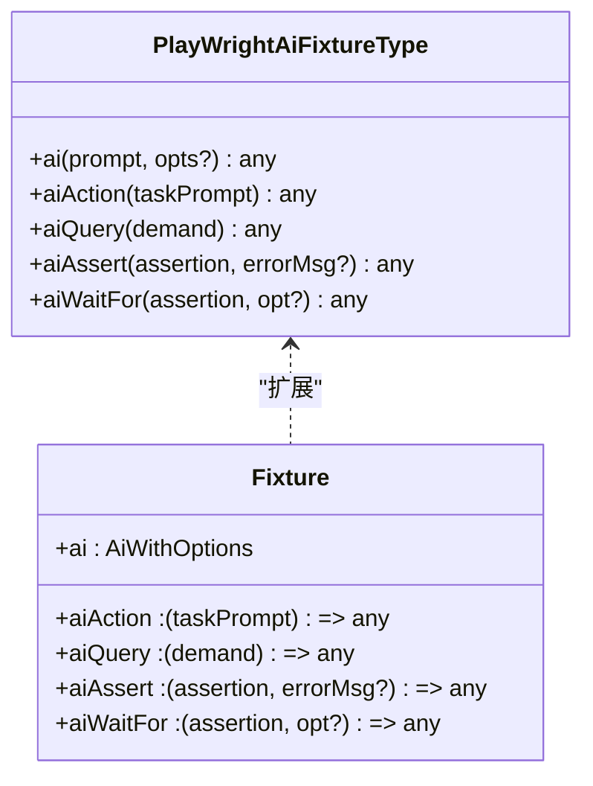
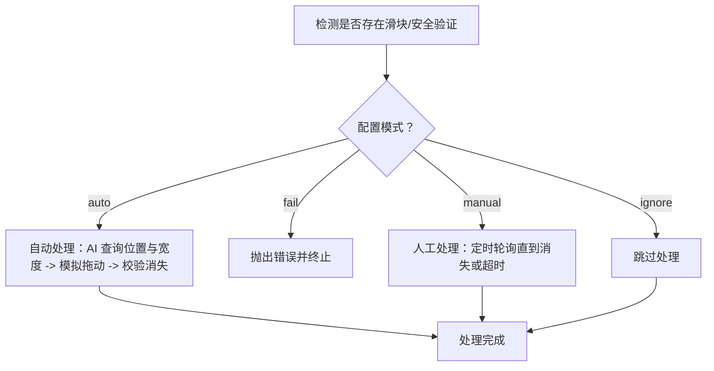
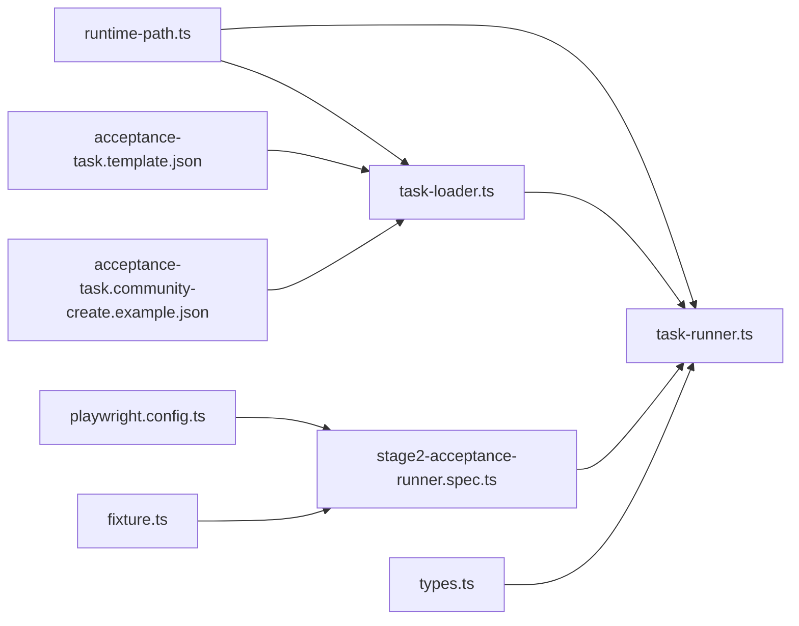

# 测试执行引擎

<cite>
**本文引用的文件**
- [src/stage2/task-runner.ts](file://src/stage2/task-runner.ts)
- [src/stage2/task-loader.ts](file://src/stage2/task-loader.ts)
- [src/stage2/types.ts](file://src/stage2/types.ts)
- [tests/fixture/fixture.ts](file://tests/fixture/fixture.ts)
- [tests/generated/stage2-acceptance-runner.spec.ts](file://tests/generated/stage2-acceptance-runner.spec.ts)
- [playwright.config.ts](file://playwright.config.ts)
- [config/runtime-path.ts](file://config/runtime-path.ts)
- [specs/tasks/acceptance-task.community-create.example.json](file://specs/tasks/acceptance-task.community-create.example.json)
- [specs/tasks/acceptance-task.template.json](file://specs/tasks/acceptance-task.template.json)
- [package.json](file://package.json)
</cite>

## 目录
1. [简介](#简介)
2. [项目结构](#项目结构)
3. [核心组件](#核心组件)
4. [架构总览](#架构总览)
5. [详细组件分析](#详细组件分析)
6. [依赖关系分析](#依赖关系分析)
7. [性能考虑](#性能考虑)
8. [故障排查指南](#故障排查指南)
9. [结论](#结论)
10. [附录](#附录)

## 简介
本文件面向“测试执行引擎”的使用者与维护者，系统性阐述基于 Playwright 的端到端测试执行流程，重点覆盖以下主题：
- runTaskScenario 函数的工作原理与参数配置
- 测试夹具（fixture）的设计与使用，涵盖 page、ai、aiAssert、aiQuery、aiWaitFor 等核心对象
- 任务加载器的工作机制、任务解析过程与执行上下文的构建
- 测试超时配置、错误处理策略与重试机制
- 性能优化建议与监控指标

该引擎通过 JSON 任务驱动，结合 Midscene 的 AI 能力与 Playwright 的自动化能力，实现从“任务定义 -> 页面交互 -> 断言与清理 -> 结果持久化”的全链路执行。

## 项目结构
仓库采用“功能域 + 层次化”组织方式：
- config：运行时路径与输出目录配置
- src/stage2：第二阶段执行器（任务加载、执行、断言、清理、持久化）
- tests：测试用例与夹具扩展
- specs：任务模板与示例
- playwright.config.ts：Playwright 测试框架配置
- package.json：脚本与依赖

图示来源
- [playwright.config.ts:1-95](file://playwright.config.ts#L1-L95)
- [config/runtime-path.ts:1-41](file://config/runtime-path.ts#L1-L41)
- [src/stage2/task-loader.ts:1-91](file://src/stage2/task-loader.ts#L1-L91)
- [src/stage2/task-runner.ts:1-2657](file://src/stage2/task-runner.ts#L1-L2657)
- [src/stage2/types.ts:1-180](file://src/stage2/types.ts#L1-L180)
- [tests/fixture/fixture.ts:1-100](file://tests/fixture/fixture.ts#L1-L100)
- [tests/generated/stage2-acceptance-runner.spec.ts:1-39](file://tests/generated/stage2-acceptance-runner.spec.ts#L1-L39)
- [specs/tasks/acceptance-task.template.json:1-141](file://specs/tasks/acceptance-task.template.json#L1-L141)
- [specs/tasks/acceptance-task.community-create.example.json:1-229](file://specs/tasks/acceptance-task.community-create.example.json#L1-L229)

章节来源
- [playwright.config.ts:1-95](file://playwright.config.ts#L1-L95)
- [config/runtime-path.ts:1-41](file://config/runtime-path.ts#L1-L41)
- [src/stage2/task-loader.ts:1-91](file://src/stage2/task-loader.ts#L1-L91)
- [src/stage2/task-runner.ts:1-2657](file://src/stage2/task-runner.ts#L1-L2657)
- [src/stage2/types.ts:1-180](file://src/stage2/types.ts#L1-L180)
- [tests/fixture/fixture.ts:1-100](file://tests/fixture/fixture.ts#L1-L100)
- [tests/generated/stage2-acceptance-runner.spec.ts:1-39](file://tests/generated/stage2-acceptance-runner.spec.ts#L1-L39)
- [specs/tasks/acceptance-task.template.json:1-141](file://specs/tasks/acceptance-task.template.json#L1-L141)
- [specs/tasks/acceptance-task.community-create.example.json:1-229](file://specs/tasks/acceptance-task.community-create.example.json#L1-L229)

## 核心组件
- 任务加载器：负责解析任务文件路径、读取 JSON、注入模板变量（含时间戳）、校验任务结构
- 执行器：以 runTaskScenario 为核心，串联打开首页、登录、菜单导航、弹窗打开、字段填写、提交、搜索、断言、清理等步骤
- 夹具扩展：在 Playwright 基础上扩展 ai、aiAssert、aiQuery、aiWaitFor 等 AI 能力，统一缓存与报告生成
- 类型系统：定义 AcceptanceTask、TaskRuntime、TaskAssertion、TaskCleanup 等结构，约束任务输入与执行结果
- 配置系统：运行时路径、Playwright 超时与重试、报告输出等

章节来源
- [src/stage2/task-loader.ts:71-89](file://src/stage2/task-loader.ts#L71-L89)
- [src/stage2/task-runner.ts:2318-2517](file://src/stage2/task-runner.ts#L2318-L2517)
- [tests/fixture/fixture.ts:23-99](file://tests/fixture/fixture.ts#L23-L99)
- [src/stage2/types.ts:141-180](file://src/stage2/types.ts#L141-L180)
- [playwright.config.ts:22-48](file://playwright.config.ts#L22-L48)

## 架构总览
整体执行链路由“测试用例 -> 夹具注入 -> 执行器 -> 页面与AI -> 结果持久化”构成。

图示来源
- [tests/generated/stage2-acceptance-runner.spec.ts:12-37](file://tests/generated/stage2-acceptance-runner.spec.ts#L12-L37)
- [tests/fixture/fixture.ts:23-99](file://tests/fixture/fixture.ts#L23-L99)
- [src/stage2/task-runner.ts:2318-2517](file://src/stage2/task-runner.ts#L2318-L2517)
- [src/stage2/task-loader.ts:71-89](file://src/stage2/task-loader.ts#L71-L89)
- [src/stage2/types.ts:141-180](file://src/stage2/types.ts#L141-L180)

## 详细组件分析

### runTaskScenario 执行流程与参数
- 输入上下文：RunnerContext 包含 page 与 AI 能力（ai、aiAssert、aiQuery、aiWaitFor）
- 参数选项：RunnerOptions 支持指定原始任务文件路径
- 关键步骤：
  - 初始化运行目录与截图目录，准备持久化存储
  - 读取任务文件并解析模板变量（含时间戳）
  - 可选审批校验（STAGE2_REQUIRE_APPROVAL）
  - 步骤执行器 runStep：封装超时、截图、错误捕获、持久化记录
  - 标准流程：打开首页 -> 登录 -> 处理安全验证 -> 导航菜单 -> 打开弹窗 -> 填写字段 -> 提交 -> 搜索与断言 -> 清理
  - 结果落盘：生成 result.json 与 partial.json，持久化运行记录

图示来源
- [src/stage2/task-runner.ts:2318-2517](file://src/stage2/task-runner.ts#L2318-L2517)
- [src/stage2/task-runner.ts:2382-2435](file://src/stage2/task-runner.ts#L2382-L2435)
- [src/stage2/task-loader.ts:71-89](file://src/stage2/task-loader.ts#L71-L89)

章节来源
- [src/stage2/task-runner.ts:2318-2517](file://src/stage2/task-runner.ts#L2318-L2517)
- [src/stage2/task-runner.ts:2382-2435](file://src/stage2/task-runner.ts#L2382-L2435)
- [src/stage2/task-loader.ts:71-89](file://src/stage2/task-loader.ts#L71-L89)

### 任务加载器与解析
- 任务文件路径解析：支持传参、环境变量、默认值
- 任务内容读取与校验：确保 taskId、taskName、target.url、account、form、assertions 等关键字段存在
- 模板解析：支持 NOW_YYYYMMDDHHMMSS 动态时间戳与环境变量占位符
- 返回类型：AcceptanceTask（强类型）

图示来源
- [src/stage2/task-loader.ts:71-89](file://src/stage2/task-loader.ts#L71-L89)

章节来源
- [src/stage2/task-loader.ts:71-89](file://src/stage2/task-loader.ts#L71-L89)

### 测试夹具（fixture）设计与使用
- 扩展对象：ai、aiAction、aiQuery、aiAssert、aiWaitFor
- 统一行为：
  - 为每个测试用例生成唯一缓存 ID，避免 AI 结果串扰
  - 设置分组信息（测试标题、文件路径），便于报告与审计
  - 可选生成报告与控制自动打印
- 接口约定：
  - ai/aiAction：执行动作型 AI 指令
  - aiQuery：执行查询型 AI 指令，返回结构化结果
  - aiAssert：执行断言型 AI 指令，支持错误信息
  - aiWaitFor：等待型 AI 指令，支持超时与轮询策略

图示来源
- [tests/fixture/fixture.ts:23-99](file://tests/fixture/fixture.ts#L23-L99)

章节来源
- [tests/fixture/fixture.ts:23-99](file://tests/fixture/fixture.ts#L23-L99)

### 任务解析与执行上下文构建
- 任务解析：由 task-loader 完成，返回强类型 AcceptanceTask
- 上下文构建：执行器读取任务中的 runtime 配置（stepTimeoutMs、pageTimeoutMs、screenshotOnStep、trace），决定页面超时、截图策略与追踪策略
- 运行目录：按任务 ID 与时间戳生成唯一运行目录，存放 result.json、partial.json 与截图

章节来源
- [src/stage2/task-runner.ts:2334-2341](file://src/stage2/task-runner.ts#L2334-L2341)
- [src/stage2/task-loader.ts:79-89](file://src/stage2/task-loader.ts#L79-L89)
- [src/stage2/types.ts:128-133](file://src/stage2/types.ts#L128-L133)

### 安全验证（滑块/验证码）处理
- 检测策略：基于文本与选择器模式识别滑块/安全验证
- 处理模式：
  - ignore：跳过处理
  - fail：检测到即报错终止
  - auto：自动尝试 AI+鼠标拖拽模拟
  - manual（默认）：人工处理，定时轮询直至消失或超时
- 自动模式：AI 查询滑块位置与滑槽宽度，模拟拖动轨迹，带缓动与抖动，失败时重试最多 3 次

图示来源
- [src/stage2/task-runner.ts:650-706](file://src/stage2/task-runner.ts#L650-L706)
- [src/stage2/task-runner.ts:561-648](file://src/stage2/task-runner.ts#L561-L648)

章节来源
- [src/stage2/task-runner.ts:650-706](file://src/stage2/task-runner.ts#L650-L706)
- [src/stage2/task-runner.ts:561-648](file://src/stage2/task-runner.ts#L561-L648)

### 断言与清理
- 断言：支持多种类型（如 toast、table-row-exists、table-cell-equals/contains 等），可配置超时与重试次数，支持软断言（失败不中断）
- 清理：支持按创建、按匹配、自定义三种策略，可配置前置搜索、匹配模式、清理后校验与失败是否中断

章节来源
- [src/stage2/task-runner.ts:2599-2631](file://src/stage2/task-runner.ts#L2599-L2631)
- [src/stage2/types.ts:67-126](file://src/stage2/types.ts#L67-L126)

### 错误处理与重试机制
- runStep：捕获异常，记录步骤状态、截图、消息与堆栈；根据 required 决定是否中断流程
- Playwright 层：全局超时、CI 下重试、并行策略、追踪
- 任务层：断言可软断言；清理可 failOnError 控制是否中断

章节来源
- [src/stage2/task-runner.ts:2382-2435](file://src/stage2/task-runner.ts#L2382-L2435)
- [playwright.config.ts:25-34](file://playwright.config.ts#L25-L34)
- [src/stage2/types.ts:67-88](file://src/stage2/types.ts#L67-L88)

## 依赖关系分析
- 外部依赖：@playwright/test、@midscene/web、dotenv
- 内部依赖：config/runtime-path.ts 为执行器与加载器提供运行时路径；playwright.config.ts 为测试框架提供全局超时与重试策略
- 任务依赖：任务 JSON 通过 task-loader 解析为强类型对象，供 task-runner 使用

图示来源
- [playwright.config.ts:1-95](file://playwright.config.ts#L1-L95)
- [config/runtime-path.ts:1-41](file://config/runtime-path.ts#L1-L41)
- [src/stage2/task-runner.ts:1-2657](file://src/stage2/task-runner.ts#L1-L2657)
- [src/stage2/task-loader.ts:1-91](file://src/stage2/task-loader.ts#L1-L91)
- [tests/fixture/fixture.ts:1-100](file://tests/fixture/fixture.ts#L1-L100)
- [tests/generated/stage2-acceptance-runner.spec.ts:1-39](file://tests/generated/stage2-acceptance-runner.spec.ts#L1-L39)
- [specs/tasks/acceptance-task.template.json:1-141](file://specs/tasks/acceptance-task.template.json#L1-L141)
- [specs/tasks/acceptance-task.community-create.example.json:1-229](file://specs/tasks/acceptance-task.community-create.example.json#L1-L229)
- [src/stage2/types.ts:1-180](file://src/stage2/types.ts#L1-L180)

章节来源
- [playwright.config.ts:1-95](file://playwright.config.ts#L1-L95)
- [config/runtime-path.ts:1-41](file://config/runtime-path.ts#L1-L41)
- [src/stage2/task-runner.ts:1-2657](file://src/stage2/task-runner.ts#L1-L2657)
- [src/stage2/task-loader.ts:1-91](file://src/stage2/task-loader.ts#L1-L91)
- [tests/fixture/fixture.ts:1-100](file://tests/fixture/fixture.ts#L1-L100)
- [tests/generated/stage2-acceptance-runner.spec.ts:1-39](file://tests/generated/stage2-acceptance-runner.spec.ts#L1-L39)
- [specs/tasks/acceptance-task.template.json:1-141](file://specs/tasks/acceptance-task.template.json#L1-L141)
- [specs/tasks/acceptance-task.community-create.example.json:1-229](file://specs/tasks/acceptance-task.community-create.example.json#L1-L229)
- [src/stage2/types.ts:1-180](file://src/stage2/types.ts#L1-L180)

## 性能考虑
- 截图策略：按需开启 screenshotOnStep，避免过多全屏截图造成 I/O 压力
- 超时设置：合理设置 stepTimeoutMs 与 pageTimeoutMs，避免过短导致频繁失败、过长导致资源占用
- 并行与重试：CI 环境启用重试，本地开发禁用重试；workers 在 CI 默认串行，避免并发竞争
- 自动安全验证：自动模式可减少人工等待，但需注意拖动轨迹与页面稳定性；必要时切换为 manual 模式
- 持久化：运行进度与最终结果异步写入，避免阻塞主流程

## 故障排查指南
- 任务文件缺失或格式错误：检查任务文件路径与关键字段，确保存在 taskId、taskName、target.url、account、form、assertions
- 登录失败或首页加载超时：检查 target.url 与 homeReadyText；适当增大 stepTimeoutMs/pageTimeoutMs
- 安全验证卡住：检查 STAGE2_CAPTCHA_MODE 与 STAGE2_CAPTCHA_WAIT_TIMEOUT_MS；必要时切换为 manual 模式
- 断言失败：区分软断言与硬断言；查看 partial.json 中最后失败步骤的截图与消息
- 清理失败：检查 cleanup 配置与 failOnError；查看清理结果与错误集合
- Playwright 超时或重试：查看 HTML 报告与 trace；在 CI 环境复现问题

章节来源
- [src/stage2/task-runner.ts:2382-2435](file://src/stage2/task-runner.ts#L2382-L2435)
- [playwright.config.ts:25-48](file://playwright.config.ts#L25-L48)
- [tests/generated/stage2-acceptance-runner.spec.ts:27-36](file://tests/generated/stage2-acceptance-runner.spec.ts#L27-L36)

## 结论
该测试执行引擎以 JSON 任务为中心，结合 Playwright 与 Midscene 的 AI 能力，实现了高可配置、可观测、可扩展的端到端执行体系。通过清晰的夹具扩展、严格的任务解析与完善的错误处理，能够在复杂 UI 场景下稳定地完成从登录到断言再到清理的全流程自动化。

## 附录

### 运行与调试
- 运行命令：通过 npm scripts 调用 Playwright 测试，支持无头与有头模式
- 任务文件：可通过环境变量或参数指定任务文件路径

章节来源
- [package.json:6-11](file://package.json#L6-L11)
- [src/stage2/task-loader.ts:71-77](file://src/stage2/task-loader.ts#L71-L77)

### 任务输入模型要点
- 任务 ID 与名称：唯一标识与可读性
- 目标与凭证：URL、浏览器与无头模式；账号与登录提示
- 导航与 UI 配置：首页就绪文本、菜单路径与提示、UI 选择器
- 表单与搜索：弹窗标题、字段定义、搜索输入与触发按钮
- 断言与清理：断言类型、超时与重试、清理策略与验证
- 运行时配置：步骤超时、页面超时、截图与追踪

章节来源
- [src/stage2/types.ts:5-180](file://src/stage2/types.ts#L5-L180)
- [specs/tasks/acceptance-task.template.json:1-141](file://specs/tasks/acceptance-task.template.json#L1-L141)
- [specs/tasks/acceptance-task.community-create.example.json:1-229](file://specs/tasks/acceptance-task.community-create.example.json#L1-L229)