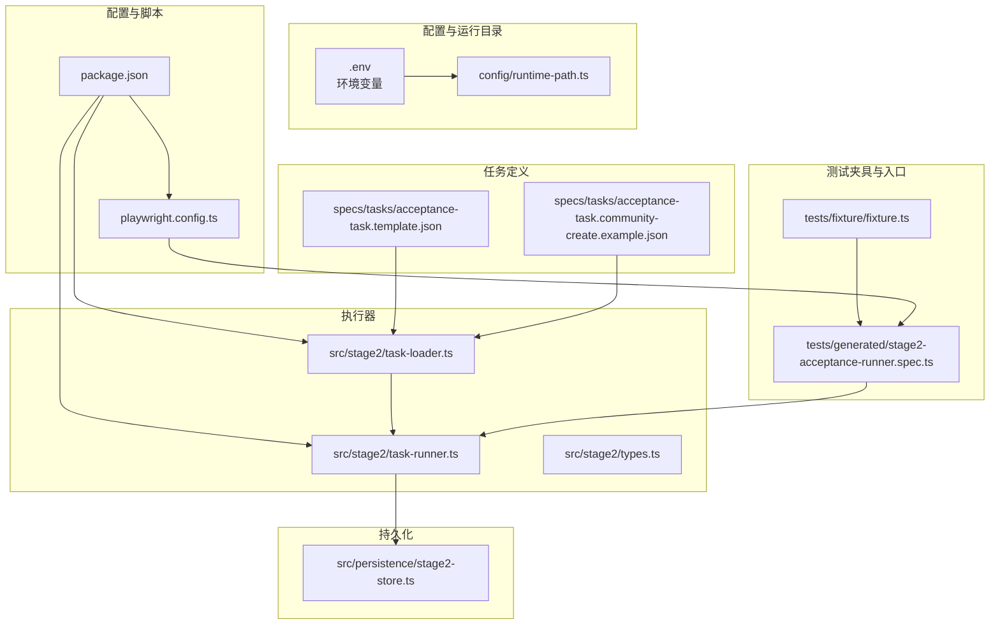
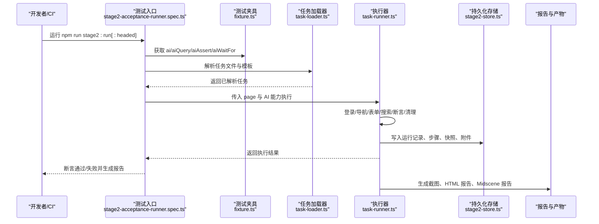
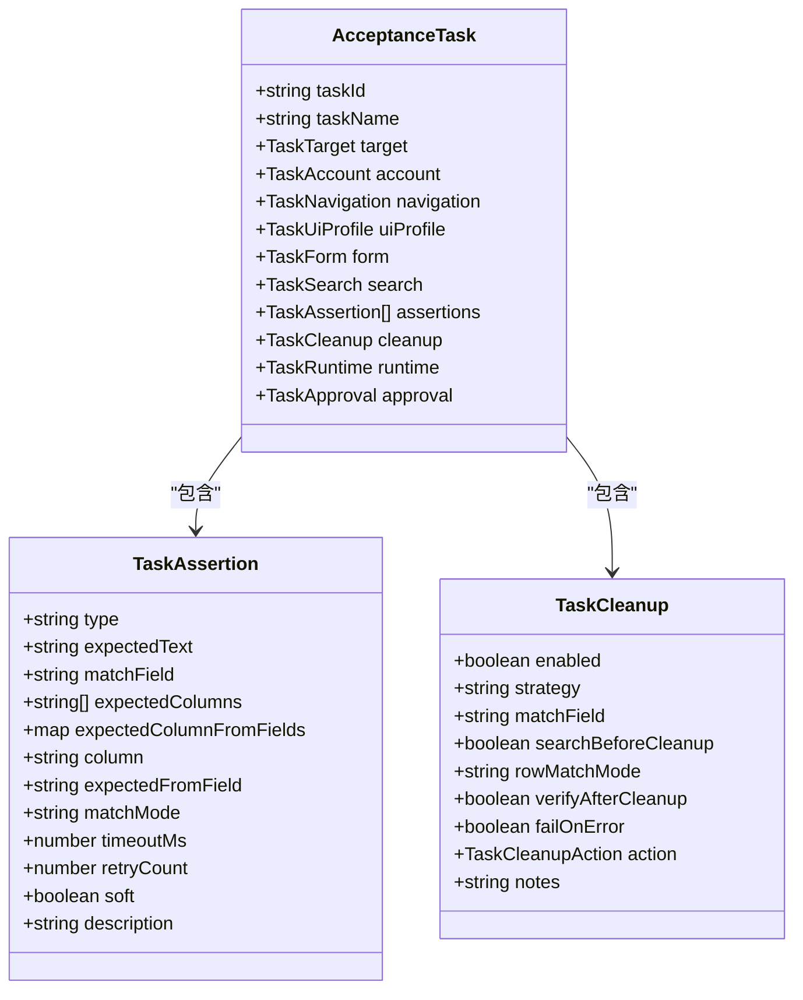
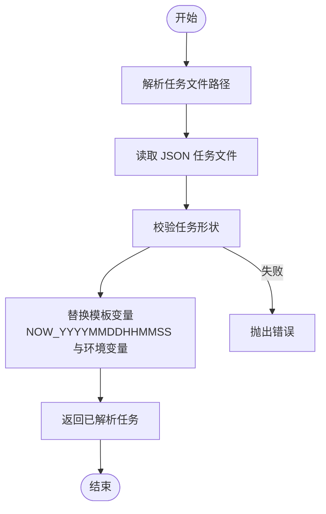
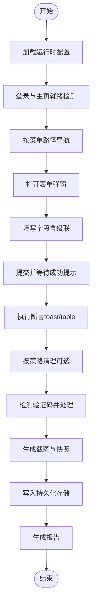
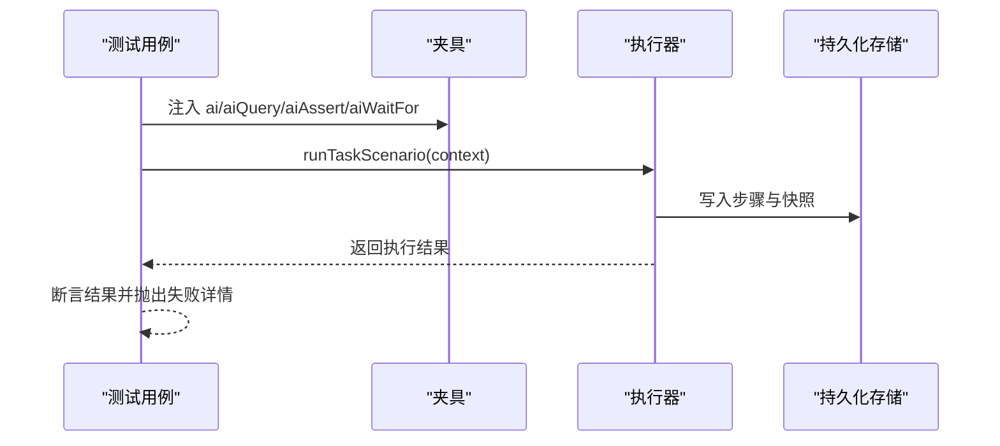
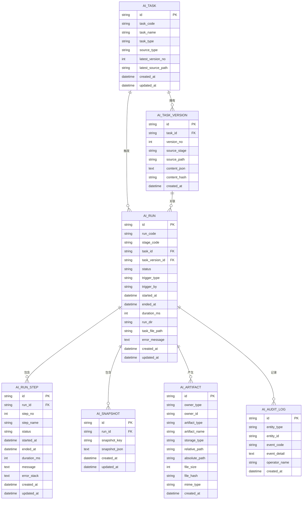
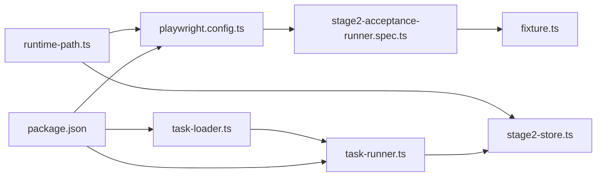

# 测试用例管理

<cite>
**本文引用的文件**   
- [README.md](file://README.md)
- [package.json](file://package.json)
- [playwright.config.ts](file://playwright.config.ts)
- [AGENTS.md](file://AGENTS.md)
- [config/runtim-path.ts](file://config/runtime-path.ts)
- [src/stage2/types.ts](file://src/stage2/types.ts)
- [src/stage2/task-loader.ts](file://src/stage2/task-loader.ts)
- [src/stage2/task-runner.ts](file://src/stage2/task-runner.ts)
- [src/persistence/stage2-store.ts](file://src/persistence/stage2-store.ts)
- [tests/fixture/fixture.ts](file://tests/fixture/fixture.ts)
- [tests/generated/stage2-acceptance-runner.spec.ts](file://tests/generated/stage2-acceptance-runner.spec.ts)
- [specs/tasks/acceptance-task.template.json](file://specs/tasks/acceptance-task.template.json)
- [specs/tasks/acceptance-task.community-create.example.json](file://specs/tasks/acceptance-task.community-create.example.json)
- [specs/basic-operations.md](file://specs/basic-operations.md)
- [specs/login-e2e.md](file://specs/login-e2e.md)
</cite>

## 目录
1. [简介](#简介)
2. [项目结构](#项目结构)
3. [核心组件](#核心组件)
4. [架构总览](#架构总览)
5. [详细组件分析](#详细组件分析)
6. [依赖关系分析](#依赖关系分析)
7. [性能考量](#性能考量)
8. [故障排查指南](#故障排查指南)
9. [结论](#结论)
10. [附录](#附录)

## 简介
本指南面向测试工程师与开发者，系统性讲解基于 JSON 的验收测试任务配置、测试夹具（Fixture）的使用、测试执行流程、断言策略与最佳实践、模板与参数化、条件执行、结果验证与报告、数据分析、设计原则与常见模式，以及与 CI/CD 的集成与自动化流水线配置。项目采用 Playwright + Midscene 的组合，通过 JSON 任务驱动第二段执行器，实现可复用、可维护、可追踪的验收测试体系。

## 项目结构
项目采用分层组织：配置与运行产物目录、任务定义模板、第二段执行器、持久化存储、测试夹具与入口、文档与示例。

**图表来源**
- [config/runtime-path.ts:1-41](file://config/runtime-path.ts#L1-L41)
- [specs/tasks/acceptance-task.template.json:1-141](file://specs/tasks/acceptance-task.template.json#L1-L141)
- [specs/tasks/acceptance-task.community-create.example.json:1-229](file://specs/tasks/acceptance-task.community-create.example.json#L1-L229)
- [src/stage2/task-loader.ts:1-91](file://src/stage2/task-loader.ts#L1-L91)
- [src/stage2/task-runner.ts:1-800](file://src/stage2/task-runner.ts#L1-L800)
- [src/stage2/types.ts:1-180](file://src/stage2/types.ts#L1-L180)
- [src/persistence/stage2-store.ts:1-655](file://src/persistence/stage2-store.ts#L1-L655)
- [tests/fixture/fixture.ts:1-100](file://tests/fixture/fixture.ts#L1-L100)
- [tests/generated/stage2-acceptance-runner.spec.ts:1-39](file://tests/generated/stage2-acceptance-runner.spec.ts#L1-L39)
- [package.json:1-26](file://package.json#L1-L26)
- [playwright.config.ts:1-95](file://playwright.config.ts#L1-L95)

**章节来源**
- [README.md:1-223](file://README.md#L1-L223)
- [AGENTS.md:1-61](file://AGENTS.md#L1-L61)

## 核心组件
- 任务配置模型与断言定义：定义了任务目标、账户、导航、UI 配置、表单、搜索、断言、清理、运行时与审批等字段，支撑跨平台通用化与强约束的断言策略。
- 任务加载器：负责解析任务文件、模板变量替换（如时间戳）、路径解析与形状校验。
- 执行器：封装页面交互、AI 操作与断言、验证码处理、截图与跟踪、步骤持久化与结果汇总。
- 持久化存储：将任务、版本、运行、步骤、快照与附件写入 SQLite，支持进度与最终结果的落库。
- 测试夹具：为测试提供 ai、aiQuery、aiAssert、aiWaitFor 等能力，并统一 Midscene 日志与报告目录。
- 测试入口：Playwright 测试文件，调用执行器并断言最终结果。

**章节来源**
- [src/stage2/types.ts:1-180](file://src/stage2/types.ts#L1-L180)
- [src/stage2/task-loader.ts:1-91](file://src/stage2/task-loader.ts#L1-L91)
- [src/stage2/task-runner.ts:1-800](file://src/stage2/task-runner.ts#L1-L800)
- [src/persistence/stage2-store.ts:1-655](file://src/persistence/stage2-store.ts#L1-L655)
- [tests/fixture/fixture.ts:1-100](file://tests/fixture/fixture.ts#L1-L100)
- [tests/generated/stage2-acceptance-runner.spec.ts:1-39](file://tests/generated/stage2-acceptance-runner.spec.ts#L1-L39)

## 架构总览
整体架构围绕“JSON 任务驱动 + Midscene + Playwright”的验收执行链路展开，强调可配置、可扩展、可观测与可追溯。

**图表来源**
- [tests/generated/stage2-acceptance-runner.spec.ts:1-39](file://tests/generated/stage2-acceptance-runner.spec.ts#L1-L39)
- [tests/fixture/fixture.ts:1-100](file://tests/fixture/fixture.ts#L1-L100)
- [src/stage2/task-loader.ts:1-91](file://src/stage2/task-loader.ts#L1-L91)
- [src/stage2/task-runner.ts:1-800](file://src/stage2/task-runner.ts#L1-L800)
- [src/persistence/stage2-store.ts:1-655](file://src/persistence/stage2-store.ts#L1-L655)
- [playwright.config.ts:1-95](file://playwright.config.ts#L1-L95)

## 详细组件分析

### 任务配置模型与断言策略
- 任务模型涵盖目标站点、账户、导航、UI 配置、表单字段、搜索、断言、清理、运行时与审批等字段，支持跨平台选择器优先级与行匹配模式。
- 断言类型覆盖 toast 提示、表格行存在/单元格相等/包含等，支持软断言与重试控制，推荐优先使用 Playwright 硬检测，AI 断言作为兜底。
- 清理策略支持删除新增数据、删除全部匹配、自定义清理，可配置匹配模式与清理后校验。

**图表来源**
- [src/stage2/types.ts:67-126](file://src/stage2/types.ts#L67-L126)

**章节来源**
- [src/stage2/types.ts:1-180](file://src/stage2/types.ts#L1-L180)
- [README.md:146-152](file://README.md#L146-L152)

### 任务加载器与模板解析
- 加载器负责：
  - 解析任务文件路径（支持绝对/相对与环境变量）。
  - 模板变量替换：支持 NOW_YYYYMMDDHHMMSS 时间戳与环境变量占位符。
  - 形状校验：确保关键字段存在。
- 示例任务文件展示了社区创建场景的完整字段与断言配置。

**图表来源**
- [src/stage2/task-loader.ts:71-91](file://src/stage2/task-loader.ts#L71-L91)

**章节来源**
- [src/stage2/task-loader.ts:1-91](file://src/stage2/task-loader.ts#L1-L91)
- [specs/tasks/acceptance-task.template.json:1-141](file://specs/tasks/acceptance-task.template.json#L1-L141)
- [specs/tasks/acceptance-task.community-create.example.json:1-229](file://specs/tasks/acceptance-task.community-create.example.json#L1-L229)

### 执行器：页面交互、AI 与断言
- 执行器职责：
  - 页面超时与运行时配置。
  - 登录、导航、表单填写、级联选择、搜索、断言与清理。
  - 验证码自动/人工/失败/忽略四种模式，自动模式通过 AI 查询滑块位置与轨迹模拟拖动。
  - 步骤截图与跟踪，软断言与重试控制。
  - 将步骤、快照与附件写入持久化存储。
- 关键流程：登录 → 导航 → 打开弹窗 → 填写表单 → 提交 → 断言 → 清理 → 生成报告。

**图表来源**
- [src/stage2/task-runner.ts:1-800](file://src/stage2/task-runner.ts#L1-L800)
- [src/persistence/stage2-store.ts:1-655](file://src/persistence/stage2-store.ts#L1-L655)

**章节来源**
- [src/stage2/task-runner.ts:1-800](file://src/stage2/task-runner.ts#L1-L800)
- [README.md:56-74](file://README.md#L56-L74)

### 测试夹具与测试入口
- 夹具提供 ai、aiAction、aiQuery、aiAssert、aiWaitFor 能力，并统一 Midscene 日志目录。
- 测试入口通过 Playwright 调用执行器，断言最终状态并抛出失败详情（包含步骤名、消息与截图路径）。

**图表来源**
- [tests/fixture/fixture.ts:1-100](file://tests/fixture/fixture.ts#L1-L100)
- [tests/generated/stage2-acceptance-runner.spec.ts:1-39](file://tests/generated/stage2-acceptance-runner.spec.ts#L1-L39)
- [src/persistence/stage2-store.ts:1-655](file://src/persistence/stage2-store.ts#L1-L655)

**章节来源**
- [tests/fixture/fixture.ts:1-100](file://tests/fixture/fixture.ts#L1-L100)
- [tests/generated/stage2-acceptance-runner.spec.ts:1-39](file://tests/generated/stage2-acceptance-runner.spec.ts#L1-L39)

### 运行产物与报告
- 运行产物目录由环境变量统一收敛至 t_runtime/，包括 Playwright 输出、HTML 报告、Midscene 报告、验收结果与数据库文件。
- Playwright 配置启用 HTML 报告与 Midscene 报告插件，支持 CI 控制重试与并行度。

**章节来源**
- [README.md:76-96](file://README.md#L76-L96)
- [playwright.config.ts:1-95](file://playwright.config.ts#L1-L95)

### 数据持久化与结果写库
- 持久化服务负责：
  - 任务与版本记录、运行记录、步骤记录、快照与附件写入。
  - 对敏感字段（如密码）进行掩码处理，仅落库结构化信息与文件路径。
  - 支持进度快照与最终结果写入，并记录审计日志。
- 与执行器配合，每步写库，最终汇总。

**图表来源**
- [src/persistence/stage2-store.ts:1-655](file://src/persistence/stage2-store.ts#L1-L655)

**章节来源**
- [README.md:97-130](file://README.md#L97-L130)
- [src/persistence/stage2-store.ts:1-655](file://src/persistence/stage2-store.ts#L1-L655)

## 依赖关系分析
- 配置与路径：运行产物目录通过 config/runtime-path.ts 读取 .env 并统一解析。
- 执行链路：package.json 的脚本调用 Playwright 执行测试入口；测试入口依赖夹具与执行器；执行器依赖加载器与持久化存储。
- 报告与插件：playwright.config.ts 配置 HTML 报告与 Midscene 报告插件，统一输出目录。

**图表来源**
- [package.json:1-26](file://package.json#L1-L26)
- [playwright.config.ts:1-95](file://playwright.config.ts#L1-L95)
- [src/stage2/task-loader.ts:1-91](file://src/stage2/task-loader.ts#L1-L91)
- [src/stage2/task-runner.ts:1-800](file://src/stage2/task-runner.ts#L1-L800)
- [src/persistence/stage2-store.ts:1-655](file://src/persistence/stage2-store.ts#L1-L655)
- [config/runtime-path.ts:1-41](file://config/runtime-path.ts#L1-L41)

**章节来源**
- [package.json:1-26](file://package.json#L1-L26)
- [playwright.config.ts:1-95](file://playwright.config.ts#L1-L95)
- [config/runtime-path.ts:1-41](file://config/runtime-path.ts#L1-L41)

## 性能考量
- 超时与重试：合理设置 step/page 超时与断言重试次数，避免过长等待与无效重试。
- 软断言：仅对关键列使用软断言，硬断言优先，降低误判与回溯成本。
- 截图与跟踪：按需开启截图与 trace，避免过多 IO 影响执行效率。
- 并行与重试：CI 环境启用有限重试与串行，保证稳定性与可重现性。

[本节为通用指导，无需列出具体文件来源]

## 故障排查指南
- 验证码处理失败：检查 STAGE2_CAPTCHA_MODE 与等待超时；自动模式失败可切换为 manual 模式或调整检测选择器。
- 任务文件缺失关键字段：加载器会抛出明确错误，需补齐 taskId、taskName、target.url、account.username/password、form.openButtonText/form.submitButtonText、form.fields。
- 截图与报告路径：确认 .env 中运行目录变量与 config/runtime-path.ts 解析一致。
- 执行失败定位：测试入口会收集最后失败步骤的名称、消息与截图路径，结合 Midscene 报告与 Playwright HTML 报告定位问题。

**章节来源**
- [src/stage2/task-runner.ts:650-706](file://src/stage2/task-runner.ts#L650-L706)
- [src/stage2/task-loader.ts:50-69](file://src/stage2/task-loader.ts#L50-L69)
- [tests/generated/stage2-acceptance-runner.spec.ts:27-36](file://tests/generated/stage2-acceptance-runner.spec.ts#L27-L36)
- [README.md:56-74](file://README.md#L56-L74)

## 结论
本项目通过“JSON 任务 + Midscene + Playwright + 持久化”的组合，构建了可配置、可扩展、可观测与可追溯的验收测试体系。遵循模板化任务、硬断言优先、软断言兜底、清理策略与强约束的 UI 配置，能够高效产出高质量的验收结果与报告。配合 CI/CD 的自动化流水线，可实现稳定的持续交付。

[本节为总结性内容，无需列出具体文件来源]

## 附录

### 测试用例模板与参数化
- 使用 acceptance-task.template.json 作为模板，复制并填充字段。
- 参数化支持：
  - NOW_YYYYMMDDHHMMSS：自动插入当前时间戳，避免重复数据。
  - 环境变量占位符：如 TEST_USERNAME/TEST_PASSWORD，通过 .env 注入。
- 示例任务文件展示了社区创建场景的字段、断言与清理策略。

**章节来源**
- [specs/tasks/acceptance-task.template.json:1-141](file://specs/tasks/acceptance-task.template.json#L1-L141)
- [specs/tasks/acceptance-task.community-create.example.json:1-229](file://specs/tasks/acceptance-task.community-create.example.json#L1-L229)
- [src/stage2/task-loader.ts:8-31](file://src/stage2/task-loader.ts#L8-L31)

### 断言策略与最佳实践
- 硬断言优先：使用 getByRole/getByLabel/getByTestId 等 Playwright 硬检测。
- AI 断言兜底：复杂语义场景使用 aiQuery + 代码断言，减少幻觉风险。
- 表格断言：table-row-exists 作为硬门槛；table-cell-equals/contains 仅校验少量关键列，建议 soft=true。
- 验证码处理：默认 auto，失败可切换 manual/fail/ignore，并设置等待超时。

**章节来源**
- [README.md:146-152](file://README.md#L146-L152)
- [README.md:56-74](file://README.md#L56-L74)

### 条件执行与清理
- 条件执行：通过断言的 matchMode（exact/contains）与 rowMatchMode 控制匹配严格度。
- 清理策略：delete-created/delete-all-matched/custom，支持清理前搜索与清理后校验，failOnError 控制失败是否中断。

**章节来源**
- [src/stage2/types.ts:78-126](file://src/stage2/types.ts#L78-L126)

### 测试结果验证与报告
- 结果文件：t_runtime/acceptance-results/<taskId>/<timestamp>/result.json 与 partial.json。
- 报告：Playwright HTML 报告与 Midscene 报告，截图保存在 screenshots 子目录。
- 数据库：ai_run、ai_run_step、ai_snapshot、ai_artifact、ai_audit_log 等表记录执行全过程。

**章节来源**
- [README.md:173-189](file://README.md#L173-L189)
- [playwright.config.ts:36-40](file://playwright.config.ts#L36-L40)
- [src/persistence/stage2-store.ts:397-493](file://src/persistence/stage2-store.ts#L397-L493)

### 设计原则与常见模式
- 统一规范：目录、命名、日志、配置均通过 .env 管理，避免硬编码。
- 可复用：UI 配置（table/dialog/toast 选择器）支持跨平台优先级列表。
- 可观测：每步截图、快照、步骤写库，失败定位清晰。
- 可追溯：任务版本入库并掩码敏感信息，审计日志完整。

**章节来源**
- [AGENTS.md:1-61](file://AGENTS.md#L1-L61)
- [README.md:191-201](file://README.md#L191-L201)

### 与 CI/CD 集成与自动化流水线
- 运行命令：npm run stage2:run 或 stage2:run:headed。
- CI 配置：Playwright 配置中启用重试与串行，报告输出到指定目录。
- 产物归档：.gitignore、CI 路径与 README 说明需同步更新。

**章节来源**
- [package.json:6-11](file://package.json#L6-L11)
- [playwright.config.ts:31-34](file://playwright.config.ts#L31-L34)
- [README.md:40-54](file://README.md#L40-L54)