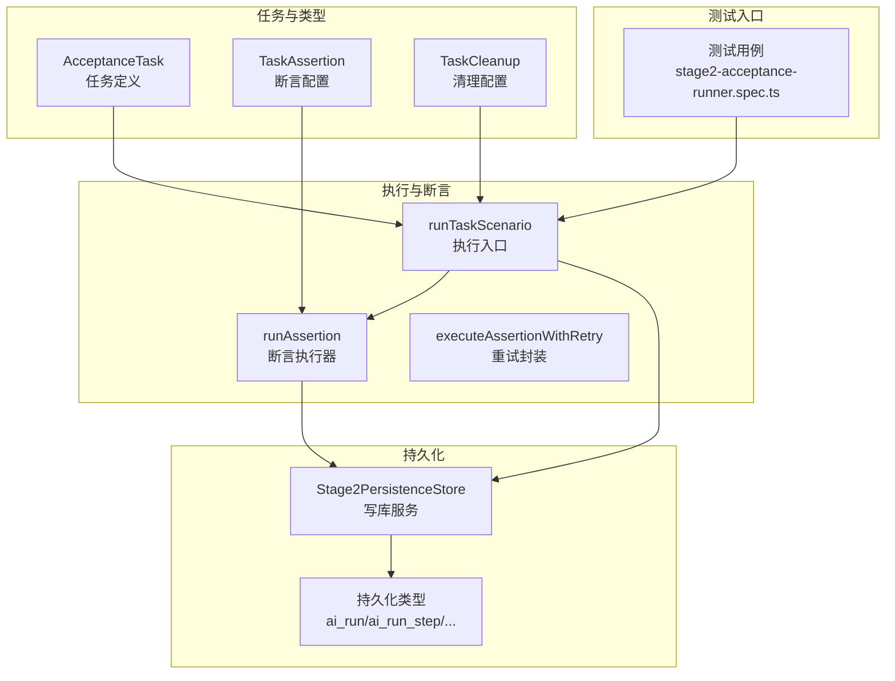
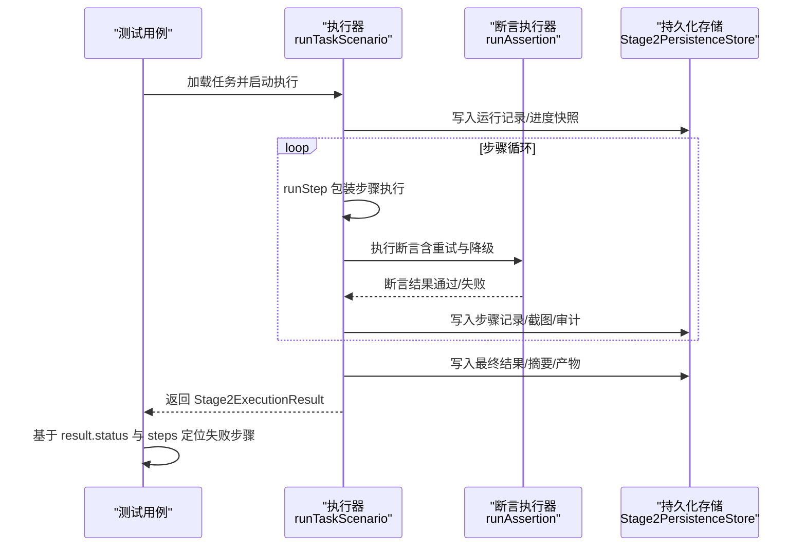
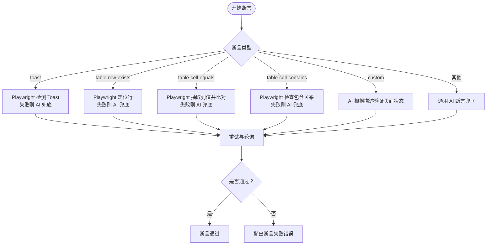
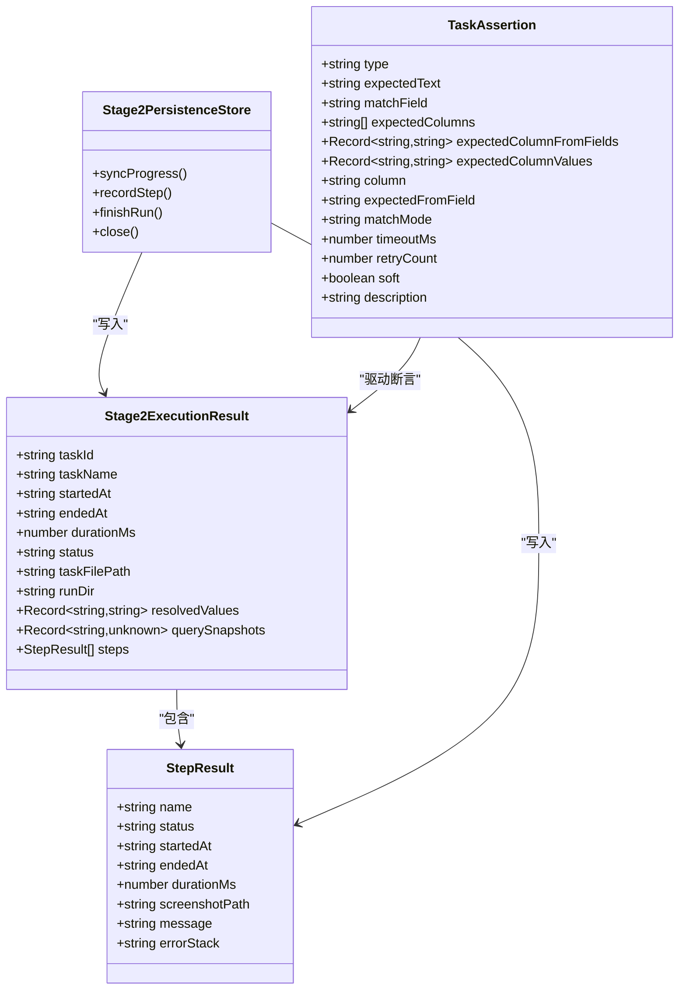

# 测试结果验证

<cite>
**本文引用的文件**
- [src/persistence/types.ts](file://src/persistence/types.ts)
- [src/persistence/stage2-store.ts](file://src/persistence/stage2-store.ts)
- [src/stage2/types.ts](file://src/stage2/types.ts)
- [src/stage2/task-runner.ts](file://src/stage2/task-runner.ts)
- [src/stage2/task-loader.ts](file://src/stage2/task-loader.ts)
- [specs/tasks/acceptance-task.community-create.example.json](file://specs/tasks/acceptance-task.community-create.example.json)
- [specs/tasks/acceptance-task.template.json](file://specs/tasks/acceptance-task.template.json)
- [tests/generated/stage2-acceptance-runner.spec.ts](file://tests/generated/stage2-acceptance-runner.spec.ts)
- [.github/workflows/playwright.yml](file://.github/workflows/playwright.yml)
</cite>

## 目录
1. [简介](#简介)
2. [项目结构](#项目结构)
3. [核心组件](#核心组件)
4. [架构总览](#架构总览)
5. [详细组件分析](#详细组件分析)
6. [依赖关系分析](#依赖关系分析)
7. [性能考量](#性能考量)
8. [故障排查指南](#故障排查指南)
9. [结论](#结论)
10. [附录](#附录)

## 简介
本指南聚焦于“测试结果验证”的完整流程与实现细节，围绕第二阶段执行结果的数据结构与状态管理，系统讲解 Stage2ExecutionResult 与 StepResult 的字段定义、断言机制（含 aiAssert 的使用与自定义断言策略）、失败步骤定位与错误信息收集、截图保存机制、日志记录与调试信息获取，以及与 CI/CD 的集成配置方法。读者无需深入编程背景，也能据此高效开展验收测试与问题定位。

## 项目结构
本项目采用分层设计：任务定义与加载、执行器与断言、持久化存储、测试入口与报告。关键目录与文件如下：
- 任务定义与类型：src/stage2/types.ts
- 任务加载与模板解析：src/stage2/task-loader.ts
- 执行器与断言：src/stage2/task-runner.ts
- 持久化存储与结果落盘：src/persistence/stage2-store.ts、src/persistence/types.ts
- 示例任务与模板：specs/tasks/*.json
- 测试入口：tests/generated/stage2-acceptance-runner.spec.ts
- CI 工作流：.github/workflows/playwright.yml

图表来源
- [src/stage2/types.ts:141-180](file://src/stage2/types.ts#L141-L180)
- [src/stage2/task-runner.ts:2318-2399](file://src/stage2/task-runner.ts#L2318-L2399)
- [src/persistence/stage2-store.ts:74-123](file://src/persistence/stage2-store.ts#L74-L123)
- [tests/generated/stage2-acceptance-runner.spec.ts:12-38](file://tests/generated/stage2-acceptance-runner.spec.ts#L12-L38)

章节来源
- [src/stage2/types.ts:141-180](file://src/stage2/types.ts#L141-L180)
- [src/stage2/task-runner.ts:2318-2399](file://src/stage2/task-runner.ts#L2318-L2399)
- [src/persistence/stage2-store.ts:74-123](file://src/persistence/stage2-store.ts#L74-L123)
- [tests/generated/stage2-acceptance-runner.spec.ts:12-38](file://tests/generated/stage2-acceptance-runner.spec.ts#L12-L38)

## 核心组件
本节聚焦测试结果验证的核心数据结构与状态管理，包括 Stage2ExecutionResult 与 StepResult 的字段定义、状态流转与持久化策略。

- Stage2ExecutionResult
  - 作用：承载一次任务执行的全局结果与统计信息。
  - 关键字段
    - taskId、taskName：任务标识与名称
    - startedAt、endedAt、durationMs：执行起止时间与耗时
    - status：执行状态（passed/failure）
    - taskFilePath、runDir：任务文件路径与运行目录
    - resolvedValues：字段解析后的键值对
    - querySnapshots：中间查询快照
    - steps：步骤结果数组
  - 状态管理
    - 初始化：执行开始时创建运行目录与截图目录，写入初始进度文件与进度快照
    - 中间态：每步执行后更新 steps 并写入进度文件与进度快照
    - 结束态：汇总最终状态、失败原因、写入最终结果 JSON 与审计日志

- StepResult
  - 作用：记录单步执行的详细信息与诊断数据。
  - 关键字段
    - name：步骤名称
    - status：状态（passed/failed/skipped）
    - startedAt、endedAt、durationMs：步骤起止时间与耗时
    - screenshotPath：失败或开启截图时的截图路径
    - message、errorStack：错误消息与堆栈

- 持久化存储
  - Stage2PersistenceStore
    - 负责将运行记录、步骤记录、快照与产物（截图、报告、结果 JSON）写入 SQLite
    - 提供安全执行包装，避免持久化异常影响主流程
    - 记录审计日志，便于追踪事件与失败原因

章节来源
- [src/stage2/types.ts:167-180](file://src/stage2/types.ts#L167-L180)
- [src/stage2/types.ts:156-165](file://src/stage2/types.ts#L156-L165)
- [src/persistence/stage2-store.ts:495-590](file://src/persistence/stage2-store.ts#L495-L590)
- [src/persistence/stage2-store.ts:592-630](file://src/persistence/stage2-store.ts#L592-L630)

## 架构总览
下图展示从任务加载到断言执行、再到持久化的整体流程，以及测试入口如何基于结果进行断言与失败定位。

图表来源
- [src/stage2/task-runner.ts:2318-2399](file://src/stage2/task-runner.ts#L2318-L2399)
- [src/stage2/task-runner.ts:1562-1917](file://src/stage2/task-runner.ts#L1562-L1917)
- [src/persistence/stage2-store.ts:470-493](file://src/persistence/stage2-store.ts#L470-L493)
- [src/persistence/stage2-store.ts:495-590](file://src/persistence/stage2-store.ts#L495-L590)
- [src/persistence/stage2-store.ts:592-630](file://src/persistence/stage2-store.ts#L592-L630)
- [tests/generated/stage2-acceptance-runner.spec.ts:12-38](file://tests/generated/stage2-acceptance-runner.spec.ts#L12-L38)

## 详细组件分析

### 数据结构与状态管理
- Stage2ExecutionResult
  - 作为全局结果载体，贯穿执行全过程，支持后续分析与报告生成
  - 通过 resolvedValues 与 querySnapshots 提供上下文信息，便于断言与清理策略
- StepResult
  - 记录每一步的执行状态、耗时与截图，是失败定位与复现的关键依据
  - 失败时自动截图并记录 message/errorStack，提升可追溯性

章节来源
- [src/stage2/types.ts:167-180](file://src/stage2/types.ts#L167-L180)
- [src/stage2/types.ts:156-165](file://src/stage2/types.ts#L156-L165)

### 断言机制与 aiAssert 使用
- 断言入口：runAssertion
  - 支持多种断言类型：toast、table-row-exists、table-cell-equals、table-cell-contains、custom
  - 默认策略：Playwright 硬检测优先，AI 断言兜底，结合重试与轮询
- 重试与轮询：executeAssertionWithRetry
  - 统一封装断言执行与重试，减少重复逻辑
  - 轮询间隔与超时可配置，兼顾稳定性与性能
- aiAssert 的使用
  - 在断言执行器内部通过 aiQuery 发送结构化提示词，实现 AI 辅助断言
  - 支持 soft 字段控制失败是否中断流程
- 自定义断言策略
  - custom 类型断言：通过 description 描述期望页面状态，由 AI 进行结构化验证
  - 未知断言类型：使用通用 AI 断言兜底，保证执行连续性

图表来源
- [src/stage2/task-runner.ts:1562-1917](file://src/stage2/task-runner.ts#L1562-L1917)
- [src/stage2/task-runner.ts:1532-1556](file://src/stage2/task-runner.ts#L1532-L1556)

章节来源
- [src/stage2/task-runner.ts:1562-1917](file://src/stage2/task-runner.ts#L1562-L1917)
- [src/stage2/task-runner.ts:1532-1556](file://src/stage2/task-runner.ts#L1532-L1556)

### 失败步骤定位与错误信息收集
- 失败定位
  - 测试入口基于 result.steps 逆序查找第一个 failed 步骤，提取 name、message、screenshotPath
  - 若无步骤失败，则记录 no step detail
- 错误信息
  - StepResult.message 与 errorStack 记录断言失败或步骤异常的详细信息
  - 持久化层在 run_record 与 run_step 中记录 errorMessage 与 errorStack，便于后续审计

章节来源
- [tests/generated/stage2-acceptance-runner.spec.ts:27-35](file://tests/generated/stage2-acceptance-runner.spec.ts#L27-L35)
- [src/persistence/stage2-store.ts:592-630](file://src/persistence/stage2-store.ts#L592-L630)

### 截图保存机制
- 截图触发时机
  - runStep 包装步骤执行时，若开启截图或步骤失败，自动截取全屏截图
  - 截图文件命名包含步骤序号与名称，便于快速定位
- 存储与关联
  - 截图作为产物写入 ai_artifact，并与 run_step 关联，形成可检索的证据链

章节来源
- [src/stage2/task-runner.ts:2382-2412](file://src/stage2/task-runner.ts#L2382-L2412)
- [src/persistence/stage2-store.ts:526-580](file://src/persistence/stage2-store.ts#L526-L580)

### 日志记录与调试信息
- 控制台日志
  - 断言执行器记录断言策略切换（如 Playwright 未命中降级为 AI）、重试次数、匹配详情等
- 审计日志
  - 持久化层记录 RUN_STARTED、STEP_FAILED、RUN_FINISHED 等事件，便于回溯
- 调试建议
  - 启用 trace（运行时配置）以捕获页面交互轨迹
  - 在断言配置中合理设置 timeoutMs 与 retryCount，平衡稳定性与执行效率

章节来源
- [src/stage2/task-runner.ts:1562-1917](file://src/stage2/task-runner.ts#L1562-L1917)
- [src/persistence/stage2-store.ts:581-588](file://src/persistence/stage2-store.ts#L581-L588)

### 与 CI/CD 的集成配置
- GitHub Actions 工作流
  - 设置运行时目录前缀与报告输出目录，确保产物可被上传
  - 安装 Playwright 依赖并执行测试
  - 上传 Playwright HTML 报告为工件，保留 30 天
- 产物与报告
  - 接受测试结果目录（ACCEPTANCE_RESULT_DIR）与 Playwright 报告目录（PLAYWRIGHT_HTML_REPORT_DIR）需与工作流环境变量一致
  - 建议在 CI 中保留 result.json 与 screenshots 目录，便于失败后分析

章节来源
- [.github/workflows/playwright.yml:1-33](file://.github/workflows/playwright.yml#L1-L33)

## 依赖关系分析
- 组件耦合
  - runTaskScenario 依赖任务加载器与持久化存储，负责整体执行编排
  - runAssertion 依赖 Playwright 与 AI 能力，提供断言执行与降级策略
  - Stage2PersistenceStore 对外暴露同步进度、写入步骤与结束运行的能力，内部封装 SQL 与文件系统操作
- 外部依赖
  - Playwright：页面交互、断言检测与截图
  - AI 能力：aiQuery/aiAssert/aiWaitFor 提供结构化提示词与等待策略
  - SQLite：本地持久化，兼容迁移方向

图表来源
- [src/stage2/types.ts:156-180](file://src/stage2/types.ts#L156-L180)
- [src/persistence/stage2-store.ts:470-630](file://src/persistence/stage2-store.ts#L470-L630)
- [src/stage2/types.ts:67-88](file://src/stage2/types.ts#L67-L88)

章节来源
- [src/stage2/types.ts:156-180](file://src/stage2/types.ts#L156-L180)
- [src/persistence/stage2-store.ts:470-630](file://src/persistence/stage2-store.ts#L470-L630)
- [src/stage2/types.ts:67-88](file://src/stage2/types.ts#L67-L88)

## 性能考量
- 断言重试与轮询
  - 合理设置 timeoutMs 与 retryCount，避免过度重试导致执行时间过长
  - 使用较短的轮询间隔（如 500ms）与分段超时（如将 timeoutMs 分配给 Playwright 检测与 AI 兜底），提升响应速度
- 截图与报告
  - 仅在必要时开启截图（screenshotOnStep），避免产生大量文件影响磁盘与上传性能
  - 在 CI 中按需保留报告与截图，避免不必要的工件体积
- 页面等待
  - 使用 aiWaitFor 与合理的页面超时（pageTimeoutMs）减少无效等待

## 故障排查指南
- 常见问题与定位
  - 断言失败：查看断言日志（Playwright 检测 vs AI 兜底）、对比期望列值与实际列值、核对 matchMode（exact/contains）
  - 步骤失败：检查 StepResult.message 与 errorStack，定位具体步骤与错误原因
  - 截图缺失：确认 screenshotOnStep 配置与 runStep 截图逻辑
- 任务配置校验
  - 使用模板与示例任务校验字段完整性（如 form.openButtonText、form.submitButtonText、form.fields）
  - 检查 assertions 与 cleanup 的 matchField 是否能在 resolvedValues 中解析到有效值
- CI 失败处理
  - 下载 Playwright 报告与接受测试结果目录，结合 result.json 与 screenshots 进行离线分析
  - 如需人工审批，检查 approval 字段与 STAGE2_REQUIRE_APPROVAL 环境变量

章节来源
- [src/stage2/task-runner.ts:1562-1917](file://src/stage2/task-runner.ts#L1562-L1917)
- [src/stage2/task-runner.ts:2382-2412](file://src/stage2/task-runner.ts#L2382-L2412)
- [specs/tasks/acceptance-task.community-create.example.json:157-216](file://specs/tasks/acceptance-task.community-create.example.json#L157-L216)

## 结论
本指南系统梳理了测试结果验证的全流程：从数据结构与状态管理，到断言机制与 AI 辅助策略，再到失败定位、截图与日志、CI 集成与性能优化。通过标准化的任务配置、健壮的断言执行器与完善的持久化体系，能够显著提升验收测试的稳定性与可维护性。建议在团队内推广使用示例任务与模板，统一断言策略与清理流程，持续优化断言超时与重试参数，以获得更可靠的自动化验收体验。

## 附录
- 示例任务与模板
  - 社区创建示例任务：包含断言与清理配置，可直接用于端到端验证
  - 通用模板：提供字段占位符与断言样例，便于快速生成新任务
- 测试入口
  - 基于 Playwright 的测试用例，对执行结果进行最终断言，并在失败时输出详细定位信息

章节来源
- [specs/tasks/acceptance-task.community-create.example.json:1-229](file://specs/tasks/acceptance-task.community-create.example.json#L1-L229)
- [specs/tasks/acceptance-task.template.json:1-141](file://specs/tasks/acceptance-task.template.json#L1-L141)
- [tests/generated/stage2-acceptance-runner.spec.ts:12-38](file://tests/generated/stage2-acceptance-runner.spec.ts#L12-L38)