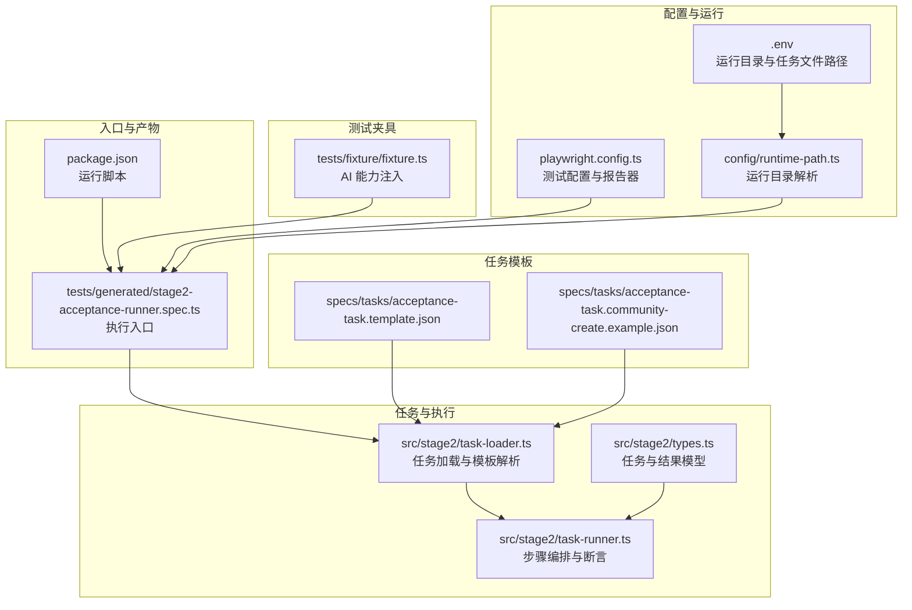
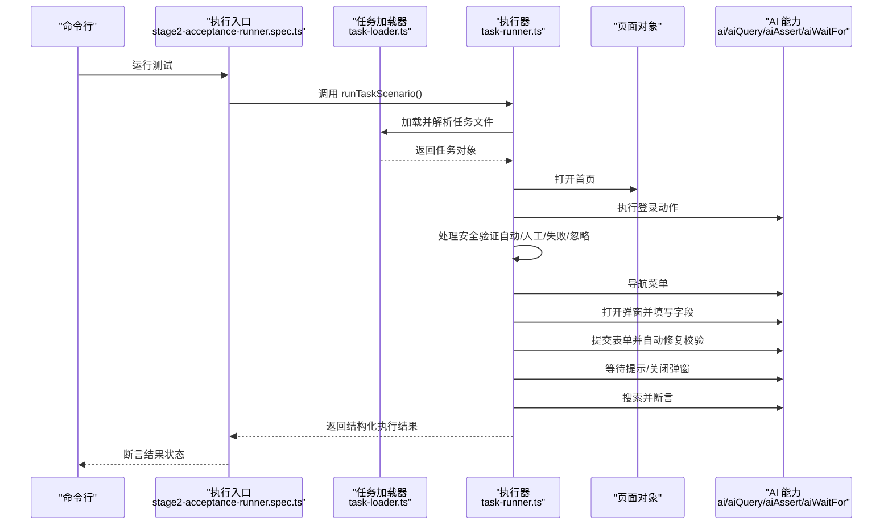
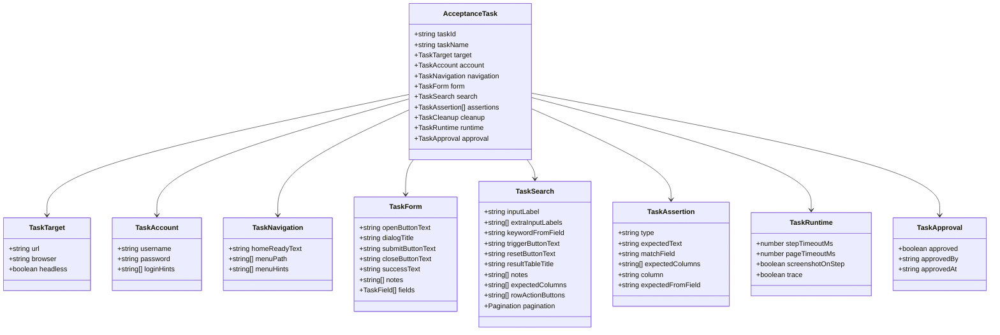
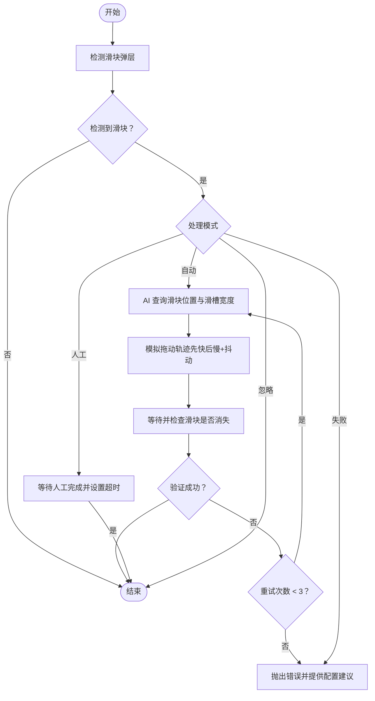
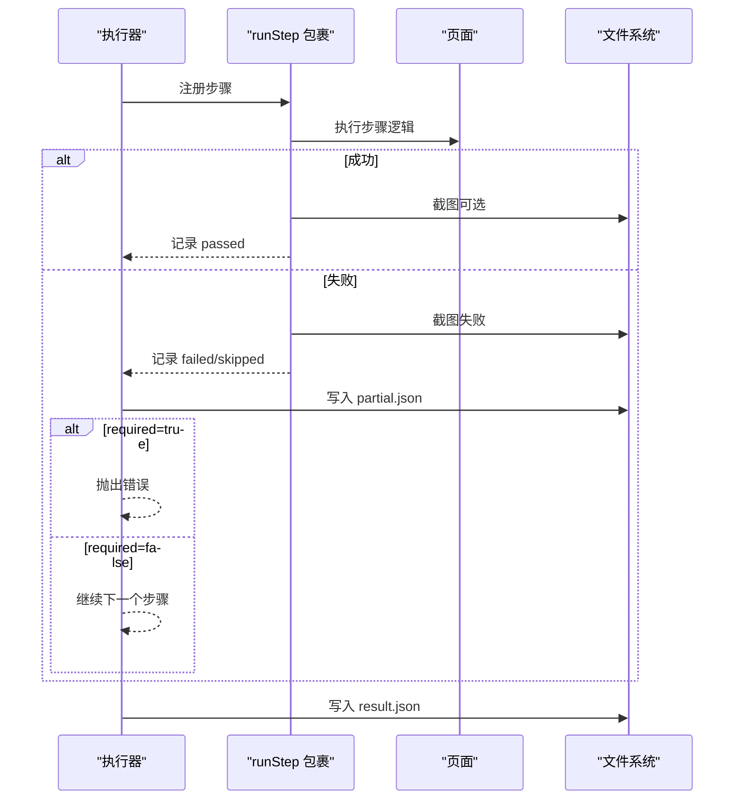
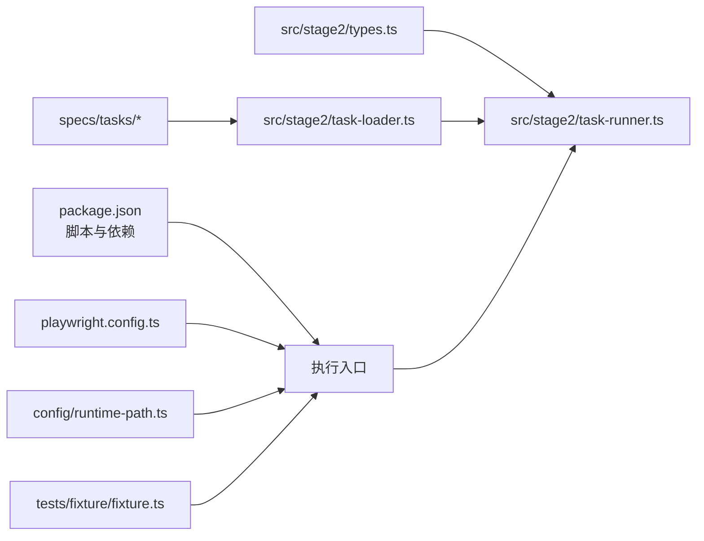

# 基础操作测试规范

<cite>
**本文引用的文件**
- [README.md](file://README.md)
- [playwright.config.ts](file://playwright.config.ts)
- [package.json](file://package.json)
- [config/runtime-path.ts](file://config/runtime-path.ts)
- [tests/fixture/fixture.ts](file://tests/fixture/fixture.ts)
- [tests/generated/stage2-acceptance-runner.spec.ts](file://tests/generated/stage2-acceptance-runner.spec.ts)
- [src/stage2/types.ts](file://src/stage2/types.ts)
- [src/stage2/task-loader.ts](file://src/stage2/task-loader.ts)
- [src/stage2/task-runner.ts](file://src/stage2/task-runner.ts)
- [specs/tasks/acceptance-task.template.json](file://specs/tasks/acceptance-task.template.json)
- [specs/tasks/acceptance-task.community-create.example.json](file://specs/tasks/acceptance-task.community-create.example.json)
- [.plans/stage2登录安全验证人工兜底方案_2026-03-12.md](file://.plans/stage2登录安全验证人工兜底方案_2026-03-12.md)
</cite>

## 目录
1. [引言](#引言)
2. [项目结构](#项目结构)
3. [核心组件](#核心组件)
4. [架构总览](#架构总览)
5. [详细组件分析](#详细组件分析)
6. [依赖关系分析](#依赖关系分析)
7. [性能考量](#性能考量)
8. [故障排查指南](#故障排查指南)
9. [结论](#结论)
10. [附录](#附录)

## 引言
本规范面向基础操作测试的设计与实施，围绕页面导航、元素交互与状态变化三大核心维度，结合项目中的 JSON 驱动执行器与 AI 辅助定位/断言能力，提供可落地的测试设计原则、验证标准、断言策略、数据管理与结果分析方法。通过统一的模板与流程，帮助测试人员编写清晰、可执行且高覆盖率的测试步骤，并建立可复用的验收执行链路。

## 项目结构
该仓库采用“配置驱动 + JSON 任务 + AI 协作”的测试执行架构：
- 配置层：环境变量与运行目录统一收敛至 t_runtime/，便于产物归档与 CI 复用
- 夹具层：封装 AI 能力（ai、aiQuery、aiAssert、aiWaitFor），统一注入到测试用例
- 任务层：以 JSON 描述业务流程（登录、导航、表单填写、提交、搜索、断言）
- 执行层：任务加载器解析模板变量，执行器按步骤编排并产出结构化结果与截图
- 报告层：Playwright HTML 报告与 Midscene 报告并行输出，便于问题定位

图表来源
- [playwright.config.ts](file://playwright.config.ts#L22-L94)
- [config/runtime-path.ts](file://config/runtime-path.ts#L1-L41)
- [tests/fixture/fixture.ts](file://tests/fixture/fixture.ts#L1-L100)
- [tests/generated/stage2-acceptance-runner.spec.ts](file://tests/generated/stage2-acceptance-runner.spec.ts#L1-L39)
- [src/stage2/task-loader.ts](file://src/stage2/task-loader.ts#L1-L91)
- [src/stage2/task-runner.ts](file://src/stage2/task-runner.ts#L1062-L1344)
- [src/stage2/types.ts](file://src/stage2/types.ts#L1-L125)
- [specs/tasks/acceptance-task.template.json](file://specs/tasks/acceptance-task.template.json#L1-L85)
- [specs/tasks/acceptance-task.community-create.example.json](file://specs/tasks/acceptance-task.community-create.example.json#L1-L184)
- [package.json](file://package.json#L6-L9)

章节来源
- [README.md](file://README.md#L1-L144)
- [playwright.config.ts](file://playwright.config.ts#L22-L94)
- [config/runtime-path.ts](file://config/runtime-path.ts#L1-L41)
- [tests/fixture/fixture.ts](file://tests/fixture/fixture.ts#L1-L100)
- [tests/generated/stage2-acceptance-runner.spec.ts](file://tests/generated/stage2-acceptance-runner.spec.ts#L1-L39)
- [src/stage2/task-loader.ts](file://src/stage2/task-loader.ts#L1-L91)
- [src/stage2/task-runner.ts](file://src/stage2/task-runner.ts#L1062-L1344)
- [src/stage2/types.ts](file://src/stage2/types.ts#L1-L125)
- [specs/tasks/acceptance-task.template.json](file://specs/tasks/acceptance-task.template.json#L1-L85)
- [specs/tasks/acceptance-task.community-create.example.json](file://specs/tasks/acceptance-task.community-create.example.json#L1-L184)
- [package.json](file://package.json#L6-L9)

## 核心组件
- 运行配置与产物目录
  - 通过环境变量集中管理运行目录，统一收敛到 t_runtime/，便于 CI 与本地调试
  - Playwright 报告、Midscene 报告、第二段执行结果与截图均在此目录下组织
- 测试夹具（AI 能力注入）
  - 将 AI 动作、查询、断言、等待能力注入到测试上下文，统一生成报告与缓存
- 任务加载与模板解析
  - 解析任务文件，校验必要字段，支持占位符替换（如时间戳、环境变量）
- 执行器（步骤编排与断言）
  - 按步骤执行：打开首页、登录、处理安全验证、菜单导航、弹窗打开、字段填写、提交、关闭弹窗、搜索、断言
  - 支持失败截图、步骤级状态记录、结构化结果输出
- 任务模板
  - 提供通用模板与示例任务，覆盖登录、导航、表单、搜索、断言、清理与审批等要素

章节来源
- [README.md](file://README.md#L74-L132)
- [tests/fixture/fixture.ts](file://tests/fixture/fixture.ts#L23-L99)
- [src/stage2/task-loader.ts](file://src/stage2/task-loader.ts#L50-L89)
- [src/stage2/task-runner.ts](file://src/stage2/task-runner.ts#L1062-L1344)
- [specs/tasks/acceptance-task.template.json](file://specs/tasks/acceptance-task.template.json#L1-L85)
- [specs/tasks/acceptance-task.community-create.example.json](file://specs/tasks/acceptance-task.community-create.example.json#L1-L184)

## 架构总览
以下序列图展示从任务 JSON 到执行结果的端到端流程，体现页面导航、元素交互与状态变化的编排逻辑。

图表来源
- [tests/generated/stage2-acceptance-runner.spec.ts](file://tests/generated/stage2-acceptance-runner.spec.ts#L12-L37)
- [src/stage2/task-loader.ts](file://src/stage2/task-loader.ts#L79-L89)
- [src/stage2/task-runner.ts](file://src/stage2/task-runner.ts#L1062-L1344)
- [tests/fixture/fixture.ts](file://tests/fixture/fixture.ts#L23-L99)

## 详细组件分析

### 组件A：任务模型与断言编排
- 任务模型
  - 包含目标站点、账户信息、导航、表单、搜索、断言、清理、运行时配置与审批信息
  - 字段覆盖页面导航、元素交互与状态变化的关键节点
- 断言编排
  - 支持 toast 提示、表格行存在、单元格等于/包含等断言类型
  - 未知断言类型时回退到 AI 文本断言，保证可扩展性

图表来源
- [src/stage2/types.ts](file://src/stage2/types.ts#L86-L98)
- [src/stage2/types.ts](file://src/stage2/types.ts#L5-L84)

章节来源
- [src/stage2/types.ts](file://src/stage2/types.ts#L1-L125)
- [src/stage2/task-runner.ts](file://src/stage2/task-runner.ts#L1020-L1060)

### 组件B：滑块验证码自动处理流程
- 检测机制
  - 基于常见文案与选择器识别滑块弹层
- 自动处理
  - 使用 AI 查询滑块位置与滑槽宽度，模拟真人拖动轨迹（先快后慢 + 随机抖动）
  - 最多重试 3 次，失败时抛出明确错误并提供配置建议
- 人工兜底
  - 支持等待人工完成并设置超时控制

图表来源
- [src/stage2/task-runner.ts](file://src/stage2/task-runner.ts#L480-L703)
- [.plans/stage2登录安全验证人工兜底方案_2026-03-12.md](file://.plans/stage2登录安全验证人工兜底方案_2026-03-12.md#L16-L31)

章节来源
- [src/stage2/task-runner.ts](file://src/stage2/task-runner.ts#L480-L703)
- [.plans/stage2登录安全验证人工兜底方案_2026-03-12.md](file://.plans/stage2登录安全验证人工兜底方案_2026-03-12.md#L1-L32)

### 组件C：步骤编排与失败处理
- 步骤编排
  - 以 runStep 包裹每个步骤，统一记录开始/结束时间、耗时、截图与消息
  - 支持可选步骤（required=false）在失败时不中断整体流程
- 失败处理
  - 失败时自动截图并写入步骤详情，最终汇总到 result.json
  - 执行入口根据最终状态抛出错误或断言通过

图表来源
- [src/stage2/task-runner.ts](file://src/stage2/task-runner.ts#L1110-L1155)
- [src/stage2/task-runner.ts](file://src/stage2/task-runner.ts#L1321-L1343)
- [tests/generated/stage2-acceptance-runner.spec.ts](file://tests/generated/stage2-acceptance-runner.spec.ts#L27-L36)

章节来源
- [src/stage2/task-runner.ts](file://src/stage2/task-runner.ts#L1110-L1155)
- [src/stage2/task-runner.ts](file://src/stage2/task-runner.ts#L1321-L1343)
- [tests/generated/stage2-acceptance-runner.spec.ts](file://tests/generated/stage2-acceptance-runner.spec.ts#L27-L36)

## 依赖关系分析
- 外部依赖
  - Playwright：页面自动化与报告
  - Midscene：AI 定位、提取与断言能力
- 内部依赖
  - 配置层依赖环境变量解析运行目录
  - 执行器依赖任务模型与夹具注入的 AI 能力
  - 任务模板用于驱动执行器，形成“配置-执行-结果”的闭环

图表来源
- [package.json](file://package.json#L6-L9)
- [playwright.config.ts](file://playwright.config.ts#L22-L94)
- [config/runtime-path.ts](file://config/runtime-path.ts#L1-L41)
- [tests/fixture/fixture.ts](file://tests/fixture/fixture.ts#L1-L100)
- [src/stage2/types.ts](file://src/stage2/types.ts#L1-L125)
- [src/stage2/task-runner.ts](file://src/stage2/task-runner.ts#L1062-L1344)
- [src/stage2/task-loader.ts](file://src/stage2/task-loader.ts#L1-L91)
- [specs/tasks/acceptance-task.template.json](file://specs/tasks/acceptance-task.template.json#L1-L85)

章节来源
- [package.json](file://package.json#L1-L24)
- [playwright.config.ts](file://playwright.config.ts#L22-L94)
- [config/runtime-path.ts](file://config/runtime-path.ts#L1-L41)
- [tests/fixture/fixture.ts](file://tests/fixture/fixture.ts#L1-L100)
- [src/stage2/types.ts](file://src/stage2/types.ts#L1-L125)
- [src/stage2/task-runner.ts](file://src/stage2/task-runner.ts#L1062-L1344)
- [src/stage2/task-loader.ts](file://src/stage2/task-loader.ts#L1-L91)
- [specs/tasks/acceptance-task.template.json](file://specs/tasks/acceptance-task.template.json#L1-L85)

## 性能考量
- 并行与重试
  - CI 环境启用重试，本地开发可关闭重试以快速反馈
- 超时与等待
  - 页面与步骤超时可按任务配置，避免长时间阻塞
- 截图与追踪
  - 按需开启步骤截图与追踪，平衡产物体积与定位效率
- 自动处理滑块
  - 自动拖动轨迹模拟真实用户行为，减少人工干预与失败重试成本

章节来源
- [playwright.config.ts](file://playwright.config.ts#L32-L34)
- [src/stage2/task-runner.ts](file://src/stage2/task-runner.ts#L1178-L1200)
- [README.md](file://README.md#L62-L72)

## 故障排查指南
- 滑块验证码处理
  - 自动模式失败时，检查页面截图确认滑块样式与检测选择器；可切换为人工模式或调整等待超时
- 登录后菜单点击失败
  - 确认登录后安全验证已处理；在菜单点击前再次检查
- 表单提交失败
  - 执行器具备自动修复校验提示的能力；若多次失败，检查字段映射与必填项
- 结果与截图定位
  - 查看 t_runtime/ 下的 Playwright 报告与 Midscene 报告，结合 result.json 与失败截图定位问题

章节来源
- [.plans/stage2登录安全验证人工兜底方案_2026-03-12.md](file://.plans/stage2登录安全验证人工兜底方案_2026-03-12.md#L16-L31)
- [src/stage2/task-runner.ts](file://src/stage2/task-runner.ts#L973-L1018)
- [README.md](file://README.md#L74-L132)

## 结论
本规范以 JSON 任务驱动与 AI 能力为核心，构建了覆盖页面导航、元素交互与状态变化的基础操作测试体系。通过统一的模板、步骤编排与断言策略，以及完善的产物与故障排查机制，能够有效提升测试的可维护性与可扩展性。建议在团队内推广使用统一模板与执行入口，持续优化断言与数据管理策略，逐步形成可复用的验收流水线。

## 附录

### 基础操作测试设计原则与验证标准
- 设计原则
  - 可重复性：通过 JSON 任务与夹具注入，确保跨环境一致性
  - 可观测性：每步均有截图与日志，失败时自动记录错误堆栈
  - 可扩展性：断言类型可扩展，未知断言回退到 AI 文本断言
  - 可维护性：模板化字段与占位符，降低硬编码风险
- 验证标准
  - 页面导航：首页加载、菜单可见、路径正确
  - 元素交互：输入、点击、滚动、拖拽等动作成功
  - 状态变化：提示出现、弹窗关闭、列表更新、断言通过

章节来源
- [src/stage2/task-runner.ts](file://src/stage2/task-runner.ts#L1157-L1323)
- [src/stage2/task-runner.ts](file://src/stage2/task-runner.ts#L1020-L1060)

### 测试用例设计方法（正向与反向平衡）
- 正向场景
  - 使用示例任务模板，覆盖新增、搜索、断言等完整链路
- 反向场景
  - 滑块验证码自动失败回退人工处理
  - 表单校验提示自动修复后仍失败的兜底断言
  - 可选步骤在失败时不影响整体流程

章节来源
- [specs/tasks/acceptance-task.community-create.example.json](file://specs/tasks/acceptance-task.community-create.example.json#L1-L184)
- [src/stage2/task-runner.ts](file://src/stage2/task-runner.ts#L647-L703)
- [src/stage2/task-runner.ts](file://src/stage2/task-runner.ts#L973-L1018)

### 操作流程标准化描述模板
- 通用模板
  - 步骤编号、操作对象、预期结果、失败截图命名
- 示例模板（参考）
  - “打开首页 -> 输入账号 -> 输入密码 -> 点击登录 -> 等待首页加载 -> 点击菜单 -> 打开弹窗 -> 填写字段 -> 提交 -> 关闭弹窗 -> 搜索 -> 断言”
- 模板字段
  - 任务 ID、任务名称、目标 URL、账户信息、导航路径、表单字段、断言类型与期望值

章节来源
- [specs/tasks/acceptance-task.template.json](file://specs/tasks/acceptance-task.template.json#L1-L85)
- [specs/tasks/acceptance-task.community-create.example.json](file://specs/tasks/acceptance-task.community-create.example.json#L1-L184)

### 断言标准制定（视觉、功能、性能）
- 视觉验证
  - toast 出现、弹窗标题可见、列表行存在
- 功能验证
  - 表单字段值等于/包含期望值、分页信息匹配
- 性能验证
  - 步骤耗时阈值、页面加载时间、截图生成耗时

章节来源
- [src/stage2/task-runner.ts](file://src/stage2/task-runner.ts#L1026-L1060)
- [src/stage2/task-runner.ts](file://src/stage2/task-runner.ts#L1117-L1155)

### 测试数据管理最佳实践
- 数据隔离
  - 使用时间戳占位符避免重复数据
- 环境变量
  - 用户名、密码等敏感信息通过环境变量注入
- 清理策略
  - 任务中预留清理开关与策略说明，便于后续回收测试数据

章节来源
- [src/stage2/task-loader.ts](file://src/stage2/task-loader.ts#L19-L48)
- [specs/tasks/acceptance-task.template.json](file://specs/tasks/acceptance-task.template.json#L9-L16)
- [specs/tasks/acceptance-task.community-create.example.json](file://specs/tasks/acceptance-task.community-create.example.json#L45-L51)

### 测试结果分析方法论
- 结构化结果
  - result.json 包含任务元信息、步骤明细、截图路径与错误信息
- 进度文件
  - result.partial.json 实时反映执行进度与状态
- 报告与产物
  - Playwright HTML 报告与 Midscene 报告并行输出，便于问题定位与复盘

章节来源
- [src/stage2/task-runner.ts](file://src/stage2/task-runner.ts#L1086-L1106)
- [src/stage2/task-runner.ts](file://src/stage2/task-runner.ts#L1340-L1343)
- [README.md](file://README.md#L74-L132)