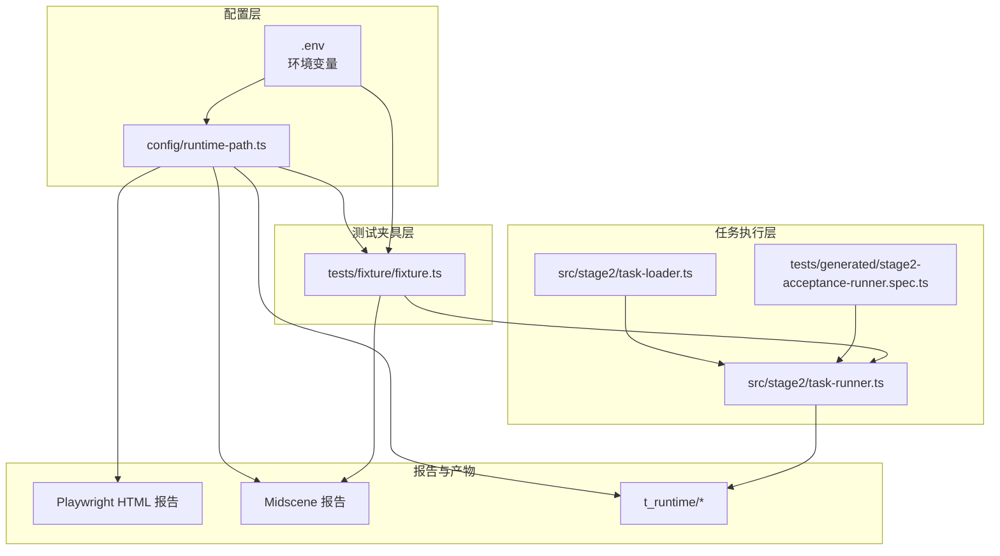
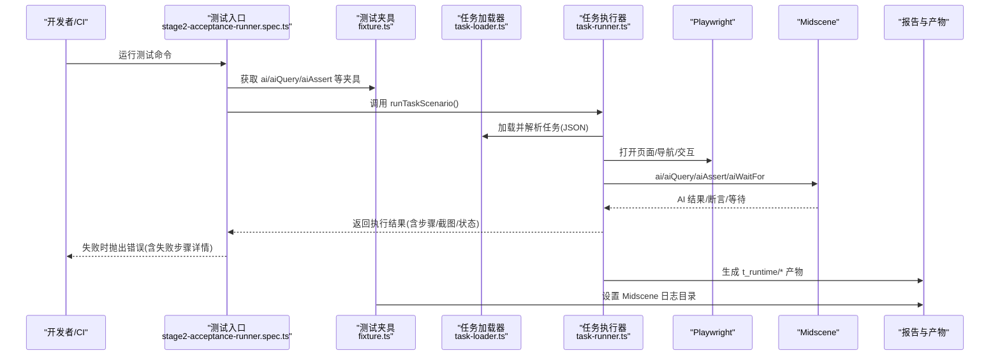
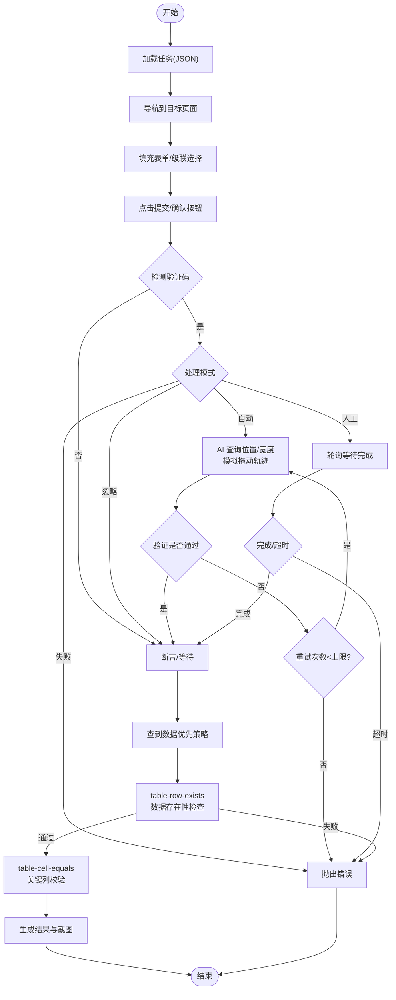
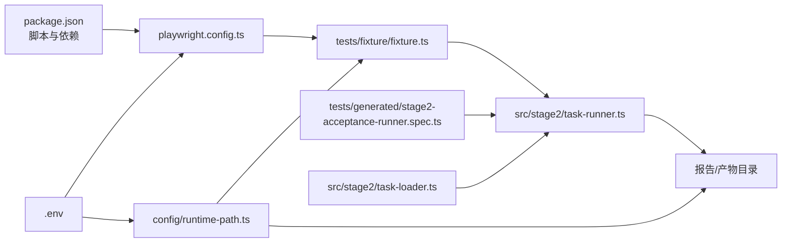

# 测试自动化实施指南

<cite>
**本文引用的文件**
- [README.md](file://README.md)
- [package.json](file://package.json)
- [playwright.config.ts](file://playwright.config.ts)
- [config/runtime-path.ts](file://config/runtime-path.ts)
- [tests/fixture/fixture.ts](file://tests/fixture/fixture.ts)
- [tests/generated/stage2-acceptance-runner.spec.ts](file://tests/generated/stage2-acceptance-runner.spec.ts)
- [src/stage2/task-runner.ts](file://src/stage2/task-runner.ts)
- [src/stage2/task-loader.ts](file://src/stage2/task-loader.ts)
- [src/stage2/types.ts](file://src/stage2/types.ts)
- [specs/tasks/acceptance-task.template.json](file://specs/tasks/acceptance-task.template.json)
- [specs/tasks/acceptance-task.community-create.example.json](file://specs/tasks/acceptance-task.community-create.example.json)
- [specs/login-e2e.md](file://specs/login-e2e.md)
- [AGENTS.md](file://AGENTS.md)
- [.tasks/AI自主代理验收系统开发改造方案_2026-03-11.md](file://.tasks/AI自主代理验收系统开发改造方案_2026-03-11.md)
</cite>

## 目录
1. [简介](#简介)
2. [项目结构](#项目结构)
3. [核心组件](#核心组件)
4. [架构总览](#架构总览)
5. [详细组件分析](#详细组件分析)
6. [依赖关系分析](#依赖关系分析)
7. [性能考量](#性能考量)
8. [故障排查指南](#故障排查指南)
9. [结论](#结论)
10. [附录](#附录)

## 简介
本指南面向希望构建可重复、可维护、可扩展的测试自动化流水线的团队，围绕 Playwright 与 Midscene 的集成方案，系统阐述测试环境搭建、依赖管理、配置优化、执行策略（并行、重试、失败处理）、报告生成与分析、CI/CD 集成、测试维护最佳实践以及性能优化技巧。项目采用 JSON 驱动的任务执行器，结合 AI 能力实现端到端验收测试，支持滑块验证码自动处理与人工兜底。

**更新** 根据最新的验收标准推荐，明确了最终验收口径为"查到数据优先，少量关键列辅助校验"的策略，优化了断言执行顺序和优先级。

## 项目结构
项目采用分层组织：配置层（环境变量与运行目录）、测试夹具层（Playwright + Midscene）、任务加载与执行层（JSON 任务驱动）、测试入口与报告层。整体结构清晰，职责分离，便于在 CI/CD 中稳定复用。

**图表来源**
- [config/runtime-path.ts](file://config/runtime-path.ts#L1-L41)
- [tests/fixture/fixture.ts](file://tests/fixture/fixture.ts#L1-L100)
- [src/stage2/task-runner.ts](file://src/stage2/task-runner.ts#L1-L120)
- [src/stage2/task-loader.ts](file://src/stage2/task-loader.ts#L1-L91)
- [tests/generated/stage2-acceptance-runner.spec.ts](file://tests/generated/stage2-acceptance-runner.spec.ts#L1-L39)

**章节来源**
- [README.md](file://README.md#L1-L144)
- [AGENTS.md](file://AGENTS.md#L1-L61)

## 核心组件
- 运行目录与环境变量管理：集中通过环境变量与公共配置模块解析运行产物目录，保证可移植性与一致性。
- 测试夹具（Playwright + Midscene）：封装 AI 能力（动作、查询、断言、等待），统一缓存与日志目录，便于调试与报告生成。
- 任务加载器：从 JSON 文件加载任务，支持模板变量与校验，保障任务输入的完整性与可追溯性。
- 任务执行器：负责页面交互、AI 辅助定位、滑块验证码处理、截图与结果持久化，提供失败步骤定位与重试策略。
- Playwright 配置：统一超时、并行度、重试、报告器与项目矩阵，适配本地与 CI 环境差异。

**章节来源**
- [config/runtime-path.ts](file://config/runtime-path.ts#L1-L41)
- [tests/fixture/fixture.ts](file://tests/fixture/fixture.ts#L1-L100)
- [src/stage2/task-loader.ts](file://src/stage2/task-loader.ts#L1-L91)
- [src/stage2/task-runner.ts](file://src/stage2/task-runner.ts#L1-L120)
- [playwright.config.ts](file://playwright.config.ts#L1-L95)

## 架构总览
下图展示了从测试入口到任务执行、AI 辅助与报告生成的整体流程，以及关键配置与产物落盘的关系。

**图表来源**
- [tests/generated/stage2-acceptance-runner.spec.ts](file://tests/generated/stage2-acceptance-runner.spec.ts#L1-L39)
- [tests/fixture/fixture.ts](file://tests/fixture/fixture.ts#L1-L100)
- [src/stage2/task-loader.ts](file://src/stage2/task-loader.ts#L1-L91)
- [src/stage2/task-runner.ts](file://src/stage2/task-runner.ts#L1-L120)
- [config/runtime-path.ts](file://config/runtime-path.ts#L1-L41)

## 详细组件分析

### 组件A：运行目录与环境变量管理
- 设计要点
  - 通过环境变量集中控制运行产物目录（Playwright 输出、HTML 报告、Midscene 日志、验收结果）。
  - 提供默认前缀与解析函数，避免硬编码路径，便于在不同环境复用。
- 关键配置项
  - RUNTIME_DIR_PREFIX：运行产物根目录前缀
  - PLAYWRIGHT_OUTPUT_DIR：Playwright 执行产物目录
  - PLAYWRIGHT_HTML_REPORT_DIR：Playwright HTML 报告目录
  - MIDSCENE_RUN_DIR：Midscene 运行日志与缓存目录
  - ACCEPTANCE_RESULT_DIR：验收结果目录（含截图与中间态）
- 最佳实践
  - 所有路径统一经由解析函数拼接，避免跨平台路径问题。
  - CI 中同步更新上传路径，确保 Artifacts 完整。

**章节来源**
- [config/runtime-path.ts](file://config/runtime-path.ts#L1-L41)
- [README.md](file://README.md#L74-L92)

### 组件B：测试夹具（Playwright + Midscene）
- 设计要点
  - 基于 Playwright Test 的扩展机制，注入 ai/aiAction/aiQuery/aiAssert/aiWaitFor 等 AI 能力。
  - 统一日志目录，启用报告生成，支持缓存 ID 清洗与分组信息。
- 关键行为
  - 为每个测试用例生成唯一的缓存 ID 与分组信息，便于报告聚合与定位。
  - 通过 setLogDir 将 Midscene 日志写入统一目录。
- 最佳实践
  - 保持夹具不变，将业务逻辑下沉至任务执行器，提高可维护性。
  - 在失败时利用报告与截图进行根因分析。

**章节来源**
- [tests/fixture/fixture.ts](file://tests/fixture/fixture.ts#L1-L100)
- [config/runtime-path.ts](file://config/runtime-path.ts#L1-L41)

### 组件C：任务加载器（JSON 任务）
- 设计要点
  - 支持从环境变量或默认路径加载任务文件，解析模板变量（如时间戳）。
  - 对任务结构进行严格校验，缺失关键字段时抛出明确错误。
- 关键行为
  - 解析模板字符串与对象，替换占位符为当前时间或环境变量。
  - 校验 taskId、taskName、target.url、account、form 字段等必需项。
- 最佳实践
  - 任务模板标准化，减少字段歧义；在 CI 中通过环境变量注入敏感信息。
  - 任务文件变更纳入版本管理，配合变更追踪与回归策略。

**章节来源**
- [src/stage2/task-loader.ts](file://src/stage2/task-loader.ts#L1-L91)
- [specs/tasks/acceptance-task.template.json](file://specs/tasks/acceptance-task.template.json#L1-L85)

### 组件D：任务执行器（JSON 驱动）
- 设计要点
  - 通过 AI 查询页面元素位置与滑槽宽度，模拟真人拖动轨迹自动处理滑块验证码。
  - 支持多种验证码处理模式（自动、人工、失败、忽略），并提供超时与重试控制。
  - 每步执行记录截图与状态，失败时抛出包含步骤详情的错误，便于定位。
- 关键流程
  - 任务加载 → 页面导航 → 表单填充/级联选择 → 操作按钮点击 → 断言与等待 → 结果持久化。
  - 验证码检测与处理：自动模式最多重试若干次；人工模式按超时轮询直至完成或超时。
- 最佳实践
  - 将复杂交互拆分为可读性强的步骤，便于报告与回放。
  - 对不稳定元素增加等待与重试，避免误判。

**更新** 根据新的验收标准，断言执行策略进行了优化：

**图表来源**
- [src/stage2/task-runner.ts](file://src/stage2/task-runner.ts#L480-L703)

**章节来源**
- [src/stage2/task-runner.ts](file://src/stage2/task-runner.ts#L1-L120)
- [src/stage2/task-runner.ts](file://src/stage2/task-runner.ts#L480-L703)

### 组件E：测试入口与报告
- 设计要点
  - 测试入口调用任务执行器，根据结果状态断言或抛出错误，错误中包含失败步骤与截图路径。
  - Playwright 配置启用 HTML 报告与 Midscene 报告器，统一输出目录。
- 关键行为
  - 失败时从最终结果中反向定位最后一个失败步骤，增强可诊断性。
  - 报告器输出到统一目录，便于 CI/CD 上传与归档。

**章节来源**
- [tests/generated/stage2-acceptance-runner.spec.ts](file://tests/generated/stage2-acceptance-runner.spec.ts#L1-L39)
- [playwright.config.ts](file://playwright.config.ts#L36-L40)

### 组件F：Playwright 配置与执行策略
- 设计要点
  - 统一超时、并行度、重试与报告器配置；CI 环境下限制并发、开启重试。
  - 项目矩阵包含 Chromium，可按需扩展 Firefox/Webkit/Mobile。
- 执行策略
  - 本地：完全并行，无重试。
  - CI：串行执行，启用重试，首次失败收集 Trace 以辅助定位。
- 最佳实践
  - 将浏览器矩阵与设备矩阵拆分，按风险与耗时权衡选择合适的组合。
  - 在 CI 中固定 workers 数量，避免资源争用导致的 flakiness。

**章节来源**
- [playwright.config.ts](file://playwright.config.ts#L22-L95)
- [package.json](file://package.json#L6-L9)

### 组件G：登录 E2E 测试（参考实现）
- 设计要点
  - 提供登录成功与密码错误两个典型场景，强调环境变量注入与断言设计。
  - 文档化运行说明、环境变量与后续改进建议。
- 最佳实践
  - 将凭据注入到 CI 安全凭据管理服务，避免明文泄露。
  - 为关键路径添加响应时间断言，监控性能回归。

**章节来源**
- [specs/login-e2e.md](file://specs/login-e2e.md#L1-L152)

### 组件H：验收标准与断言策略
**更新** 基于新的验收标准推荐，验收流程采用了"查到数据优先，少量关键列辅助校验"的策略：

- **最终验收口径**：优先验证数据是否成功创建并可在列表中查到，其次进行少量关键列的辅助校验
- **断言执行顺序优化**：
  - 首先执行 `table-row-exists` 断言，确保数据存在性
  - 仅在数据存在的情况下执行 `table-cell-equals` 关键列断言
  - 对于其他断言类型（如 `table-cell-contains`），采用 AI 兜底策略
- **断言降级机制**：
  - Playwright 硬检测失败时，自动降级为 AI 查询断言
  - 通过 `executeAssertionWithRetry` 机制确保断言的可靠性
- **软断言支持**：
  - 通过 `soft` 参数控制断言失败是否中断流程
  - 支持混合使用硬断言和软断言，提高验收的灵活性

**章节来源**
- [.tasks/AI自主代理验收系统开发改造方案_2026-03-11.md](file://.tasks/AI自主代理验收系统开发改造方案_2026-03-11.md#L86-L90)
- [src/stage2/task-runner.ts](file://src/stage2/task-runner.ts#L1617-L1816)

## 依赖关系分析
- 组件耦合
  - 任务执行器依赖任务加载器与夹具；测试入口依赖夹具与执行器。
  - 运行目录配置被多个模块共享，形成低耦合高内聚的配置中心。
- 外部依赖
  - Playwright 作为核心测试框架；Midscene 提供 AI 能力与报告。
  - 通过环境变量与公共配置模块解耦外部系统（如浏览器安装、模型接入）。

**图表来源**
- [package.json](file://package.json#L1-L24)
- [playwright.config.ts](file://playwright.config.ts#L1-L95)
- [config/runtime-path.ts](file://config/runtime-path.ts#L1-L41)
- [tests/fixture/fixture.ts](file://tests/fixture/fixture.ts#L1-L100)
- [tests/generated/stage2-acceptance-runner.spec.ts](file://tests/generated/stage2-acceptance-runner.spec.ts#L1-L39)
- [src/stage2/task-runner.ts](file://src/stage2/task-runner.ts#L1-L120)
- [src/stage2/task-loader.ts](file://src/stage2/task-loader.ts#L1-L91)

**章节来源**
- [package.json](file://package.json#L1-L24)
- [playwright.config.ts](file://playwright.config.ts#L1-L95)

## 性能考量
- 并行与并发
  - 本地完全并行，CI 串行执行，平衡稳定性与速度。
  - 通过 workers 控制并发度，避免资源争用。
- 超时与重试
  - 合理设置任务步超时与页面超时，避免过短导致误判、过长影响吞吐。
  - CI 环境启用重试，减少偶发失败对吞吐的影响。
- 报告与产物
  - 仅在首次重试时收集 Trace，兼顾诊断与性能。
  - 将报告与截图输出到统一目录，便于按需裁剪与压缩。
- 稳定性优化
  - 对不稳定元素增加等待与重试，避免误判。
  - 滑块自动处理采用缓动与抖动模拟真人轨迹，提升成功率。
- **断言性能优化**
  - **更新** 采用"查到数据优先"策略，减少不必要的关键列断言开销
  - 通过断言降级机制，避免重复的 AI 查询操作
  - 优化断言执行顺序，提高验收流程的整体效率

**章节来源**
- [playwright.config.ts](file://playwright.config.ts#L22-L48)
- [src/stage2/task-runner.ts](file://src/stage2/task-runner.ts#L558-L645)

## 故障排查指南
- 常见问题与定位
  - 任务加载失败：检查任务文件是否存在、必需字段是否齐全、模板变量是否可解析。
  - 验证码处理失败：切换为人工模式或调整检测选择器；增大等待超时。
  - 报告缺失：确认报告器配置与输出目录权限；CI 中检查上传 Artifacts 步骤。
  - 环境变量未生效：确认 .env 文件路径与加载顺序；在 CI 中通过环境注入。
  - **断言失败**：检查断言配置是否正确，验证数据唯一性，确认断言降级机制是否正常工作。
- 失败定位技巧
  - 查看最终结果中的失败步骤名称、消息与截图路径。
  - 利用 Trace 与 Midscene 报告回放关键交互。
  - **更新** 重点关注断言执行顺序，优先检查数据存在性断言是否通过。
- 回归与对比
  - 对比历史报告与截图，识别 UI 变更引发的断言失败。
  - 将失败用例归档到专用目录，便于后续回归。

**章节来源**
- [src/stage2/task-loader.ts](file://src/stage2/task-loader.ts#L50-L89)
- [src/stage2/task-runner.ts](file://src/stage2/task-runner.ts#L647-L703)
- [tests/generated/stage2-acceptance-runner.spec.ts](file://tests/generated/stage2-acceptance-runner.spec.ts#L27-L36)

## 结论
本项目以 Playwright + Midscene 为核心，结合 JSON 任务驱动与 AI 能力，提供了可重复、可观测、可维护的测试自动化方案。通过统一的运行目录与环境变量管理、严谨的任务加载与执行策略、完善的报告与失败处理机制，能够在本地与 CI/CD 中稳定落地。

**更新** 最新的验收标准推荐进一步优化了测试流程的可靠性和效率，通过"查到数据优先，少量关键列辅助校验"的策略，确保核心业务流程的稳定性，同时减少了不必要的断言开销。

建议团队在此基础上持续完善任务模板、加强变更追踪与回归策略，并结合性能指标持续优化执行效率与稳定性。

## 附录

### A. 测试环境搭建与依赖管理
- 安装与初始化
  - 克隆项目与安装依赖，安装浏览器二进制。
- 环境变量
  - 配置 OPENAI_API_KEY、OPENAI_BASE_URL、MIDSCENE_MODEL_NAME 等模型接入参数。
  - 通过 RUNTIME_DIR_PREFIX、PLAYWRIGHT_OUTPUT_DIR、PLAYWRIGHT_HTML_REPORT_DIR、MIDSCENE_RUN_DIR、ACCEPTANCE_RESULT_DIR 统一运行产物目录。
- 依赖管理
  - 通过 package.json 管理 Playwright 与 Midscene 版本，避免版本漂移。
  - 在 CI 中缓存依赖与浏览器二进制，提升执行速度。

**章节来源**
- [README.md](file://README.md#L10-L52)
- [package.json](file://package.json#L1-L24)

### B. 测试执行策略与配置
- 并行执行
  - 本地：fullyParallel=true；CI：workers=1。
- 重试机制
  - CI 环境启用 retries；本地禁用，避免掩盖问题。
- 失败处理
  - 首次失败收集 Trace；失败时抛出包含步骤详情的错误，便于定位。
- 报告器
  - list + html + Midscene 报告器组合，兼顾可读性与深度分析。

**章节来源**
- [playwright.config.ts](file://playwright.config.ts#L22-L48)

### C. 测试报告生成与分析
- 产物目录
  - Playwright HTML 报告、Midscene 报告、验收结果（含截图与中间态）统一收敛到 t_runtime 目录。
- 分析要点
  - 以步骤为单位回放交互，结合截图与 Trace 定位问题。
  - 对失败用例建立趋势分析，识别回归热点。

**章节来源**
- [README.md](file://README.md#L74-L132)
- [config/runtime-path.ts](file://config/runtime-path.ts#L18-L36)

### D. CI/CD 集成（GitHub Actions）
- 工作流配置建议
  - 任务：检出代码、安装依赖、安装浏览器、设置 .env、运行测试、上传报告与产物。
  - 矩阵：按浏览器/设备维度扩展，按风险与耗时权衡组合。
  - 触发条件：PR/Release/定时构建等，结合覆盖率与关键分支策略。
- 最佳实践
  - 缓存依赖与浏览器二进制；Artifacts 上传报告与截图。
  - 失败时发送通知并附带报告链接。

**章节来源**
- [playwright.config.ts](file://playwright.config.ts#L36-L40)
- [README.md](file://README.md#L106-L132)

### E. 测试维护最佳实践
- 版本管理与变更追踪
  - 任务模板纳入版本管理，每次变更记录变更说明与影响范围。
- 回归测试策略
  - 关键路径与高频功能建立回归集，结合性能阈值监控回归。
- 规范与协作
  - 统一命名、日志、配置与目录规范，减少沟通成本与维护成本。

**章节来源**
- [AGENTS.md](file://AGENTS.md#L1-L61)

### F. 验收标准与断言策略最佳实践
**更新** 基于新的验收标准推荐，建议采用以下断言策略：

- **断言优先级设置**
  - 将 `table-row-exists` 断言设置为硬断言（required: true）
  - 将 `table-cell-equals` 关键列断言设置为软断言（soft: true）
  - 其他断言类型根据业务重要性灵活配置
- **断言配置优化**
  - 关键列断言应选择最少但最具代表性的字段
  - 使用 `expectedColumnFromFields` 映射，避免硬编码期望值
  - 合理设置 `retryCount` 和 `timeoutMs` 参数
- **失败处理策略**
  - 数据存在性断言失败时，优先检查数据创建流程
  - 关键列断言失败时，检查数据回查逻辑和字段映射
  - 利用断言降级机制，确保验收流程的鲁棒性

**章节来源**
- [.tasks/AI自主代理验收系统开发改造方案_2026-03-11.md](file://.tasks/AI自主代理验收系统开发改造方案_2026-03-11.md#L86-L90)
- [src/stage2/task-runner.ts](file://src/stage2/task-runner.ts#L1617-L1816)
- [specs/tasks/acceptance-task.template.json](file://specs/tasks/acceptance-task.template.json#L75-L106)