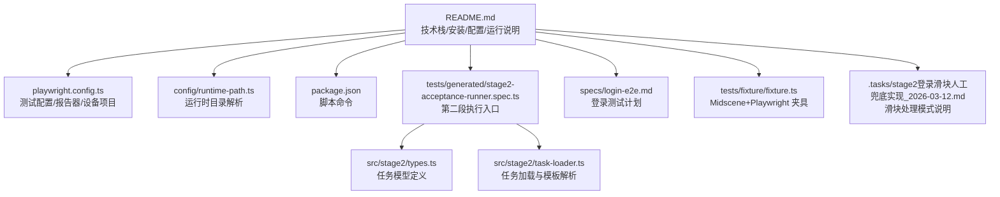
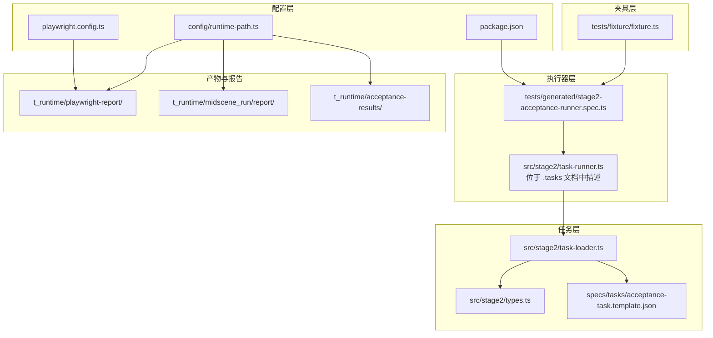
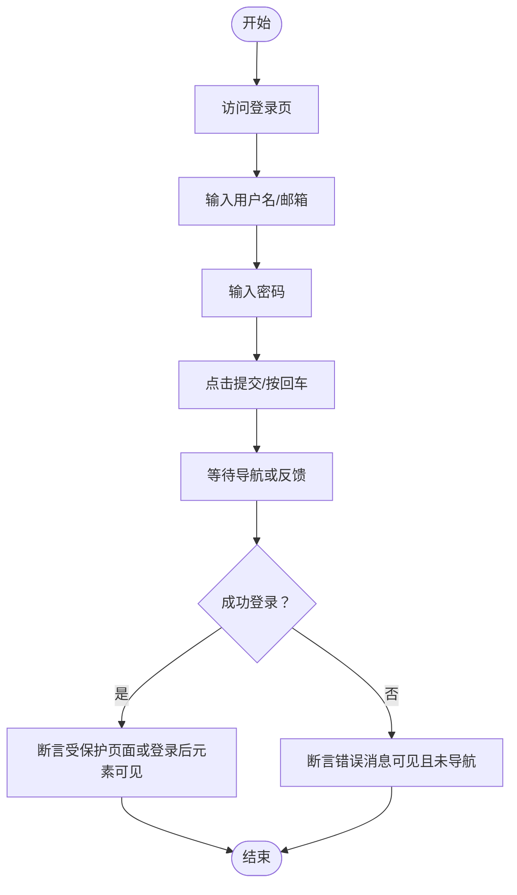
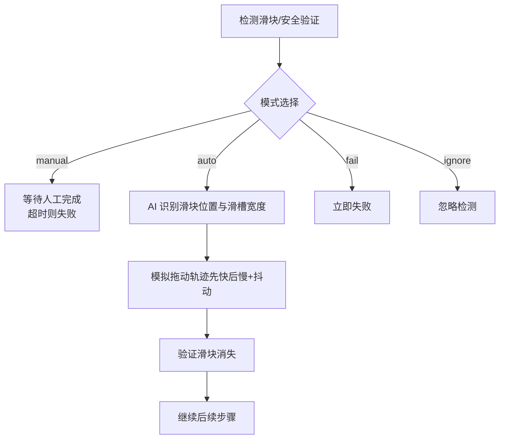
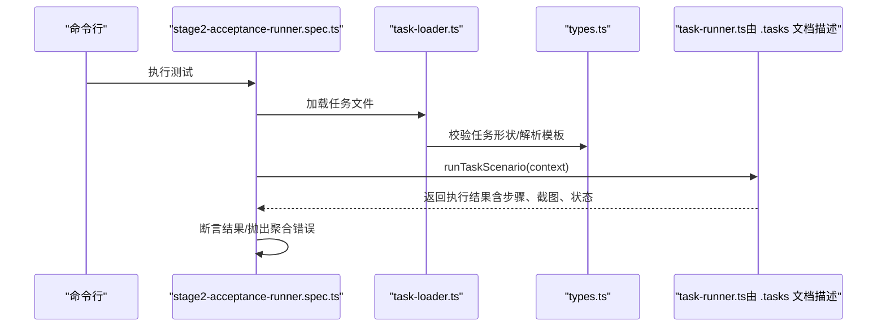
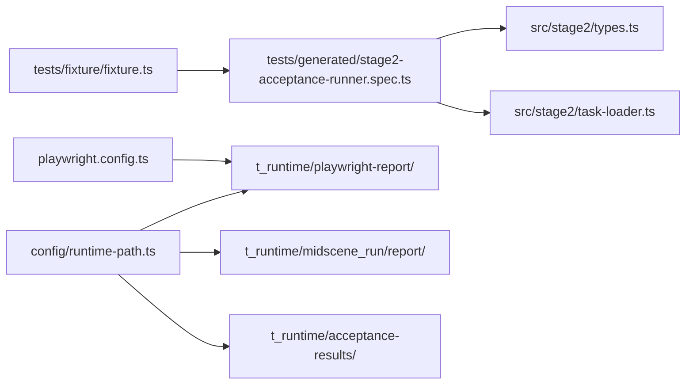

# 测试规范

<cite>
**本文引用的文件**
- [README.md](file://README.md)
- [playwright.config.ts](file://playwright.config.ts)
- [package.json](file://package.json)
- [config/runtime-path.ts](file://config/runtime-path.ts)
- [specs/basic-operations.md](file://specs/basic-operations.md)
- [specs/login-e2e.md](file://specs/login-e2e.md)
- [tests/generated/stage2-acceptance-runner.spec.ts](file://tests/generated/stage2-acceptance-runner.spec.ts)
- [tests/fixture/fixture.ts](file://tests/fixture/fixture.ts)
- [src/stage2/types.ts](file://src/stage2/types.ts)
- [src/stage2/task-loader.ts](file://src/stage2/task-loader.ts)
- [.tasks/stage2登录滑块人工兜底实现_2026-03-12.md](file://.tasks/stage2登录滑块人工兜底实现_2026-03-12.md)
</cite>

## 目录
1. [简介](#简介)
2. [项目结构](#项目结构)
3. [核心组件](#核心组件)
4. [架构总览](#架构总览)
5. [详细组件分析](#详细组件分析)
6. [依赖关系分析](#依赖关系分析)
7. [性能考量](#性能考量)
8. [故障排查指南](#故障排查指南)
9. [结论](#结论)
10. [附录](#附录)

## 简介
本文件面向 HI-TEST 项目，系统化梳理登录页面测试与基础操作测试的规范、测试用例设计方法、测试报告生成与分析、自动化流水线实施策略以及调试与故障分析方法论。项目采用 Playwright 与 Midscene.js 结合的 AI 驱动测试框架，支持结构化任务驱动的验收测试与滑块验证码的自动/人工处理。

## 项目结构
- 测试运行与产物目录通过环境变量集中管理，统一收敛至 t_runtime/ 目录，便于 CI/CD 与本地调试。
- 测试入口分为两类：
  - 第二段 JSON 任务执行入口：tests/generated/stage2-acceptance-runner.spec.ts
  - 登录页面 E2E 示例：specs/login-e2e.md（配套 tests/login.spec.ts）
- 配置层：
  - playwright.config.ts：测试运行器配置、超时、并行度、报告器与设备项目
  - config/runtime-path.ts：运行时目录解析与环境变量读取
  - package.json：脚本命令（stage2 运行）

图表来源
- [README.md](file://README.md#L1-L144)
- [playwright.config.ts](file://playwright.config.ts#L1-L95)
- [config/runtime-path.ts](file://config/runtime-path.ts#L1-L41)
- [package.json](file://package.json#L1-L24)
- [tests/generated/stage2-acceptance-runner.spec.ts](file://tests/generated/stage2-acceptance-runner.spec.ts#L1-L39)
- [specs/login-e2e.md](file://specs/login-e2e.md#L1-L152)
- [tests/fixture/fixture.ts](file://tests/fixture/fixture.ts#L1-L100)
- [src/stage2/types.ts](file://src/stage2/types.ts#L1-L125)
- [src/stage2/task-loader.ts](file://src/stage2/task-loader.ts#L1-L91)
- [.tasks/stage2登录滑块人工兜底实现_2026-03-12.md](file://.tasks/stage2登录滑块人工兜底实现_2026-03-12.md#L1-L34)

章节来源
- [README.md](file://README.md#L1-L144)
- [playwright.config.ts](file://playwright.config.ts#L1-L95)
- [config/runtime-path.ts](file://config/runtime-path.ts#L1-L41)
- [package.json](file://package.json#L1-L24)

## 核心组件
- 运行时目录与产物
  - 运行产物目录由 .env 与 config/runtime-path.ts 统一管理，包括 Playwright 输出目录、HTML 报告目录、Midscene 运行目录、验收结果目录等。
- 测试配置
  - playwright.config.ts 定义了测试目录、输出目录、超时、并行策略、重试策略、报告器（list/html/@midscene/web）、设备项目等。
- 夹具与 AI 能力
  - tests/fixture/fixture.ts 提供 ai、aiAction、aiQuery、aiAssert、aiWaitFor 等 AI 能力封装，统一设置 Midscene 日志目录与缓存标识。
- 第二段执行器
  - tests/generated/stage2-acceptance-runner.spec.ts 作为 JSON 任务执行入口，调用 src/stage2/task-runner.ts 的 runTaskScenario 并对结果进行断言与错误聚合。
- 任务模型与加载
  - src/stage2/types.ts 定义 AcceptanceTask、TaskForm、TaskField、TaskSearch、TaskAssertion、StepResult、Stage2ExecutionResult 等模型。
  - src/stage2/task-loader.ts 负责任务文件解析、模板变量替换（含 NOW_YYYYMMDDHHMMSS）与形状校验。
- 登录测试计划
  - specs/login-e2e.md 提供登录页面 E2E 测试场景（成功登录、密码错误）与实现要点、环境变量、运行说明与后续改进建议。
- 滑块验证码处理
  - README.md 与 .tasks/stage2登录滑块人工兜底实现_2026-03-12.md 描述了滑块验证码的检测、自动/人工/失败/忽略四种模式及自动模式的实现细节。

章节来源
- [README.md](file://README.md#L74-L144)
- [playwright.config.ts](file://playwright.config.ts#L22-L95)
- [tests/fixture/fixture.ts](file://tests/fixture/fixture.ts#L1-L100)
- [tests/generated/stage2-acceptance-runner.spec.ts](file://tests/generated/stage2-acceptance-runner.spec.ts#L1-L39)
- [src/stage2/types.ts](file://src/stage2/types.ts#L1-L125)
- [src/stage2/task-loader.ts](file://src/stage2/task-loader.ts#L1-L91)
- [specs/login-e2e.md](file://specs/login-e2e.md#L1-L152)
- [.tasks/stage2登录滑块人工兜底实现_2026-03-12.md](file://.tasks/stage2登录滑块人工兜底实现_2026-03-12.md#L1-L34)

## 架构总览
下图展示了测试运行的整体架构：配置层、夹具层、执行器层与任务层之间的关系，以及产物落盘与报告生成路径。

图表来源
- [playwright.config.ts](file://playwright.config.ts#L1-L95)
- [config/runtime-path.ts](file://config/runtime-path.ts#L1-L41)
- [package.json](file://package.json#L1-L24)
- [tests/fixture/fixture.ts](file://tests/fixture/fixture.ts#L1-L100)
- [tests/generated/stage2-acceptance-runner.spec.ts](file://tests/generated/stage2-acceptance-runner.spec.ts#L1-L39)
- [src/stage2/task-loader.ts](file://src/stage2/task-loader.ts#L1-L91)
- [src/stage2/types.ts](file://src/stage2/types.ts#L1-L125)
- [.tasks/stage2登录滑块人工兜底实现_2026-03-12.md](file://.tasks/stage2登录滑块人工兜底实现_2026-03-12.md#L1-L34)

## 详细组件分析

### 登录页面测试规范与验证要点
- 测试目标
  - 验证成功登录与密码错误两种场景下的 UI 导航、错误提示与状态一致性。
- 关键验证点
  - 成功登录：URL 导航至受保护页面或出现登录后 UI 元素（如“Logout”、“Profile”）。
  - 密码错误：页面出现明确错误消息（如包含“Invalid”、“incorrect”、“密码”、“用户名或密码错误”等关键字），且不发生导航。
- 输入与环境
  - 支持通过环境变量注入 BASE_URL、用户名、正确密码、错误密码等。
  - 测试实现中包含常见选择器兼容写法与按钮文本适配。
- 运行与定位
  - 可单独运行登录测试文件，或运行完整测试套件；必要时可在配置中启用 webServer 启动本地服务。
- 后续改进建议
  - 增加空用户名/空密码、账户锁定、多因素认证（MFA）等场景。
  - 使用安全凭据管理服务存储登录凭据。
  - 为关键路径添加断言计时（响应时间阈值）以监控性能回归。
  - 如需后端隔离，提供 mock/stub 方案。

图表来源
- [specs/login-e2e.md](file://specs/login-e2e.md#L50-L102)

章节来源
- [specs/login-e2e.md](file://specs/login-e2e.md#L1-L152)

### 基础操作测试规范与最佳实践
- 应用概述
  - TodoMVC 应用提供任务增删改查、批量操作、过滤与计数等典型 UI 行为，适合验证基础页面导航、元素交互与状态变化。
- 最佳实践
  - 使用稳定的选择器与可读的步骤描述，确保跨浏览器与跨版本稳定性。
  - 对关键 UI 状态（如计数、过滤状态、列表项可见性）进行断言。
  - 在 CI 中启用重试与并行，同时控制 workers 数量以平衡速度与稳定性。
  - 为复杂交互添加截图与 trace，便于问题定位。

章节来源
- [specs/basic-operations.md](file://specs/basic-operations.md#L1-L34)

### 测试用例设计指南
- 场景分类
  - 正向场景：成功登录、添加/编辑/删除/筛选等常规操作。
  - 异常场景：空输入、无效输入、网络异常、权限不足、验证码挑战等。
  - 边界场景：极值输入、超长字符串、特殊字符、国际化文案等。
- 用例优先级
  - P0：阻塞性缺陷（如无法登录、核心功能崩溃）
  - P1：高风险缺陷（如数据丢失、安全漏洞）
  - P2：一般缺陷（如 UI 不一致、文案错误）
  - P3：低优先级（如微小交互优化）
- 覆盖率要求
  - 功能路径覆盖率：关键业务路径 100%，通用路径 ≥ 80%。
  - UI 状态覆盖率：主要状态与交互节点覆盖 ≥ 90%。
  - 设备与浏览器覆盖率：至少覆盖主流桌面浏览器。
  - 环境覆盖率：本地、预发、生产环境配置差异验证。

章节来源
- [specs/basic-operations.md](file://specs/basic-operations.md#L1-L34)
- [specs/login-e2e.md](file://specs/login-e2e.md#L119-L125)

### 测试报告生成与分析
- 报告器配置
  - list：控制台输出测试进度与结果概览。
  - html：生成 HTML 报告，可配置输出目录。
  - @midscene/web：集成 Midscene 报告，支持 AI 执行摘要与截图。
- 产物目录
  - Playwright HTML 报告：t_runtime/playwright-report/
  - Midscene 报告：t_runtime/midscene_run/report/
  - 验收结果：t_runtime/acceptance-results/<taskId>/<timestamp>/result.json 与 partial.json、screenshots/
- 分析方法
  - 查看失败用例的截图、视频与 trace，结合 AI 报告定位问题。
  - 关注断言失败类型（元素不可见、URL 不匹配、超时）与重试次数。
  - 对关键路径添加响应时间阈值，监控回归。

章节来源
- [playwright.config.ts](file://playwright.config.ts#L36-L40)
- [README.md](file://README.md#L74-L132)

### 测试自动化实施策略
- 本地执行
  - 安装依赖与浏览器后，使用 npx playwright test 指定文件或完整套件运行。
- CI 集成
  - 在 CI 中设置环境变量（BASE_URL、用户名、密码等），启用 retries 与 workers 控制。
  - 将 t_runtime 目录作为工件上传，便于问题复现与审计。
- 可重复流水线
  - 使用 package.json 中的 stage2:run 与 stage2:run:headed 脚本，统一执行第二段任务。
  - 通过 playwright.config.ts 的 projects 配置多浏览器矩阵，提升覆盖率。

章节来源
- [README.md](file://README.md#L106-L132)
- [playwright.config.ts](file://playwright.config.ts#L22-L95)
- [package.json](file://package.json#L6-L8)

### 滑块验证码处理与登录安全验证
- 模式说明
  - manual：检测到滑块/安全验证后等待人工完成。
  - auto：AI 识别滑块位置并模拟真人拖动轨迹（先快后慢 + 随机抖动），最多重试若干次。
  - fail：检测到滑块即失败。
  - ignore：忽略滑块检测（不建议）。
- 自动模式流程
  - AI 识别滑块按钮位置与滑槽宽度 → 模拟拖动轨迹 → 验证滑块消失 → 继续后续步骤。
- 等待与超时
  - manual 模式下可配置等待超时时间，超时则终止任务并报错。

图表来源
- [README.md](file://README.md#L54-L73)
- [.tasks/stage2登录滑块人工兜底实现_2026-03-12.md](file://.tasks/stage2登录滑块人工兜底实现_2026-03-12.md#L26-L34)

章节来源
- [README.md](file://README.md#L54-L73)
- [.tasks/stage2登录滑块人工兜底实现_2026-03-12.md](file://.tasks/stage2登录滑块人工兜底实现_2026-03-12.md#L1-L34)

### 第二段执行器与任务模型
- 执行入口
  - tests/generated/stage2-acceptance-runner.spec.ts 调用 runTaskScenario，对执行结果进行断言与错误聚合。
- 任务模型
  - AcceptanceTask、TaskForm、TaskField、TaskSearch、TaskAssertion、StepResult、Stage2ExecutionResult 等模型定义清晰，便于结构化任务驱动测试。
- 任务加载与模板解析
  - src/stage2/task-loader.ts 支持模板变量替换（含 NOW_YYYYMMDDHHMMSS），并对任务文件进行形状校验，保证输入合法性。

图表来源
- [tests/generated/stage2-acceptance-runner.spec.ts](file://tests/generated/stage2-acceptance-runner.spec.ts#L1-L39)
- [src/stage2/task-loader.ts](file://src/stage2/task-loader.ts#L79-L91)
- [src/stage2/types.ts](file://src/stage2/types.ts#L86-L125)
- [.tasks/stage2登录滑块人工兜底实现_2026-03-12.md](file://.tasks/stage2登录滑块人工兜底实现_2026-03-12.md#L1-L34)

章节来源
- [tests/generated/stage2-acceptance-runner.spec.ts](file://tests/generated/stage2-acceptance-runner.spec.ts#L1-L39)
- [src/stage2/task-loader.ts](file://src/stage2/task-loader.ts#L1-L91)
- [src/stage2/types.ts](file://src/stage2/types.ts#L1-L125)

## 依赖关系分析
- 组件耦合
  - tests/fixture/fixture.ts 为所有测试提供统一的 AI 能力夹具，降低重复实现。
  - tests/generated/stage2-acceptance-runner.spec.ts 依赖 src/stage2/task-runner.ts（由 .tasks 文档描述）与 src/stage2/types.ts、src/stage2/task-loader.ts。
  - playwright.config.ts 与 config/runtime-path.ts 共同决定运行时目录与报告输出。
- 外部依赖
  - Playwright 与 Midscene Web 报告器集成，提供结构化报告与截图。
- 潜在循环依赖
  - 当前结构清晰，无明显循环依赖迹象。

图表来源
- [tests/fixture/fixture.ts](file://tests/fixture/fixture.ts#L1-L100)
- [tests/generated/stage2-acceptance-runner.spec.ts](file://tests/generated/stage2-acceptance-runner.spec.ts#L1-L39)
- [src/stage2/types.ts](file://src/stage2/types.ts#L1-L125)
- [src/stage2/task-loader.ts](file://src/stage2/task-loader.ts#L1-L91)
- [playwright.config.ts](file://playwright.config.ts#L1-L95)
- [config/runtime-path.ts](file://config/runtime-path.ts#L1-L41)

章节来源
- [tests/fixture/fixture.ts](file://tests/fixture/fixture.ts#L1-L100)
- [tests/generated/stage2-acceptance-runner.spec.ts](file://tests/generated/stage2-acceptance-runner.spec.ts#L1-L39)
- [src/stage2/types.ts](file://src/stage2/types.ts#L1-L125)
- [src/stage2/task-loader.ts](file://src/stage2/task-loader.ts#L1-L91)
- [playwright.config.ts](file://playwright.config.ts#L1-L95)
- [config/runtime-path.ts](file://config/runtime-path.ts#L1-L41)

## 性能考量
- 超时与重试
  - playwright.config.ts 设置全局超时与 CI 环境下的重试策略，有助于在不稳定环境中提升成功率。
- 并行与资源
  - CI 环境下禁用并行，减少资源竞争；本地可启用并行加速。
- 报告与截图
  - 合理开启截图与 trace，避免过大产物影响 CI 性能；在失败重试时收集 trace 以提高定位效率。
- 关键路径计时
  - 登录测试建议添加断言计时（响应时间阈值），用于性能回归检测与趋势分析。

章节来源
- [playwright.config.ts](file://playwright.config.ts#L25-L34)
- [specs/login-e2e.md](file://specs/login-e2e.md#L123-L124)

## 故障排查指南
- 常见问题定位
  - 选择器不匹配：检查页面实际 HTML 与测试中的选择器是否一致。
  - 环境变量缺失：确认 BASE_URL、用户名、密码等是否正确注入。
  - 服务未启动：在 CI 中通过 webServer 配置启动本地服务，或确保外部服务可用。
  - 滑块验证码：根据 STAGE2_CAPTCHA_MODE 切换 manual/auto/fail/ignore 模式；必要时增大等待超时。
- 调试方法
  - 使用 --headed 模式运行，观察交互过程。
  - 查看 t_runtime 目录下的截图、视频与 trace，结合 Midscene 报告定位问题。
  - 对失败步骤打印详细信息（失败步骤名、消息、截图路径），便于快速定位。
- 故障分析流程
  - 复现 → 截图/trace → 选择器/环境变量核对 → 模式切换（滑块）→ 修复 → 回归验证。

章节来源
- [specs/login-e2e.md](file://specs/login-e2e.md#L112-L116)
- [README.md](file://README.md#L54-L73)
- [tests/generated/stage2-acceptance-runner.spec.ts](file://tests/generated/stage2-acceptance-runner.spec.ts#L27-L36)

## 结论
本测试规范文档基于 HI-TEST 项目的现有实现，明确了登录页面测试与基础操作测试的流程、验证要点与最佳实践，给出了测试用例设计、报告生成与分析、自动化流水线实施与调试故障分析的方法论。通过统一的运行时目录、夹具与任务模型，项目实现了可重复、可观测、可扩展的 AI 驱动测试体系。

## 附录
- 运行命令参考
  - 运行登录测试：npx playwright test tests/login.spec.ts -c playwright.config.ts
  - 运行完整测试套件：npx playwright test -c playwright.config.ts
  - 第二段任务执行（无头）：npm run stage2:run
  - 第二段任务执行（有头）：npm run stage2:run:headed
- 目录与产物
  - t_runtime/playwright-report/：Playwright HTML 报告
  - t_runtime/midscene_run/report/：Midscene 报告
  - t_runtime/acceptance-results/<taskId>/<timestamp>/：验收结果与截图

章节来源
- [README.md](file://README.md#L106-L132)
- [package.json](file://package.json#L6-L8)