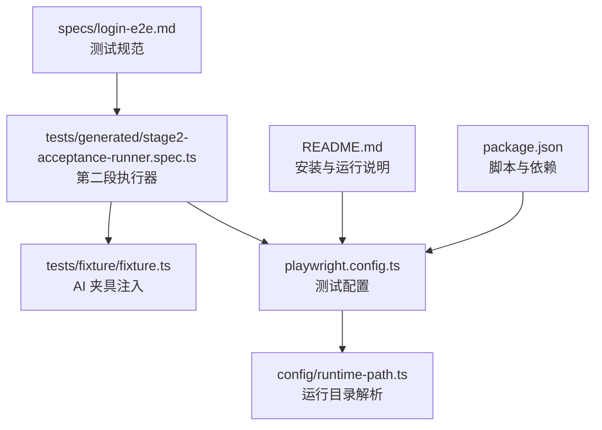
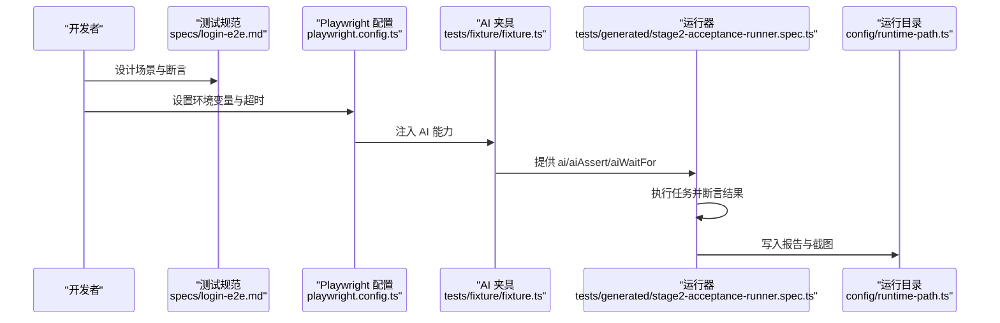
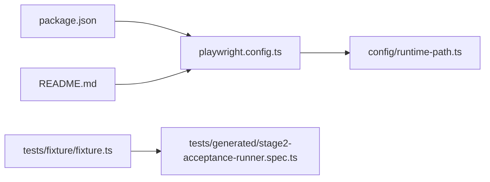

# 登录页面测试规范

<cite>
**本文引用的文件**
- [specs/login-e2e.md](file://specs/login-e2e.md)
- [playwright.config.ts](file://playwright.config.ts)
- [tests/fixture/fixture.ts](file://tests/fixture/fixture.ts)
- [tests/generated/stage2-acceptance-runner.spec.ts](file://tests/generated/stage2-acceptance-runner.spec.ts)
- [config/runtime-path.ts](file://config/runtime-path.ts)
- [package.json](file://package.json)
- [README.md](file://README.md)
</cite>

## 目录
1. [简介](#简介)
2. [项目结构](#项目结构)
3. [核心组件](#核心组件)
4. [架构总览](#架构总览)
5. [详细组件分析](#详细组件分析)
6. [依赖关系分析](#依赖关系分析)
7. [性能考量](#性能考量)
8. [故障排查指南](#故障排查指南)
9. [结论](#结论)
10. [附录](#附录)

## 简介
本文件面向登录页面的端到端测试，提供可落地的测试规范与实施指引。重点覆盖两类核心场景：
- 成功登录（Happy Path）：验证正常凭据登录后的导航与 UI 展示。
- 密码错误（Negative Case）：验证错误凭据触发的错误提示与未发生非预期导航。

同时，文档明确环境变量配置要求（BASE_URL、TEST_USERNAME、TEST_PASSWORD、TEST_INVALID_PASSWORD）、技术实现要点（选择器兼容、按钮文本适配、错误关键字检测）、调试最佳实践（选择器匹配、环境配置、断言失败排查）以及后续改进建议。

## 项目结构
本仓库采用“测试规范 + 配置 + 夹具 + 运行器”的分层组织方式：
- 规范文档：specs/login-e2e.md 提供测试场景、前置条件、步骤与期望结果。
- 配置：playwright.config.ts 定义测试目录、超时、并行策略、报告器与浏览器设备。
- 夹具：tests/fixture/fixture.ts 注入 AI 能力（ai、aiQuery、aiAssert、aiWaitFor）。
- 运行器：tests/generated/stage2-acceptance-runner.spec.ts 作为第二段执行入口。
- 运行目录：config/runtime-path.ts 与 .env 协同，集中管理输出目录与中间态产物。
- 说明文档：README.md 提供安装、模型配置、运行产物目录与运行入口说明。

图表来源
- [specs/login-e2e.md](file://specs/login-e2e.md#L1-L152)
- [tests/generated/stage2-acceptance-runner.spec.ts](file://tests/generated/stage2-acceptance-runner.spec.ts#L1-L39)
- [tests/fixture/fixture.ts](file://tests/fixture/fixture.ts#L1-L100)
- [playwright.config.ts](file://playwright.config.ts#L1-L95)
- [config/runtime-path.ts](file://config/runtime-path.ts#L1-L41)
- [README.md](file://README.md#L1-L144)
- [package.json](file://package.json#L1-L24)

章节来源
- [specs/login-e2e.md](file://specs/login-e2e.md#L1-L152)
- [playwright.config.ts](file://playwright.config.ts#L1-L95)
- [tests/fixture/fixture.ts](file://tests/fixture/fixture.ts#L1-L100)
- [tests/generated/stage2-acceptance-runner.spec.ts](file://tests/generated/stage2-acceptance-runner.spec.ts#L1-L39)
- [config/runtime-path.ts](file://config/runtime-path.ts#L1-L41)
- [README.md](file://README.md#L1-L144)
- [package.json](file://package.json#L1-L24)

## 核心组件
- 测试规范（specs/login-e2e.md）
  - 明确定义成功登录与密码错误两大场景的前置条件、执行步骤与期望结果。
  - 提供环境变量清单与运行示例，强调 BASE_URL、TEST_USERNAME、TEST_PASSWORD、TEST_INVALID_PASSWORD 的作用与设置方法。
  - 给出实现要点与调试优先级，包括选择器兼容、按钮文本适配与错误关键字检测。
- Playwright 配置（playwright.config.ts）
  - 指定测试目录、超时、并行策略、报告器（list、html、自定义 reporter）与浏览器设备。
  - 支持通过 dotenv 加载环境变量，便于在 CI/本地复用。
- AI 夹具（tests/fixture/fixture.ts）
  - 注入 ai、aiQuery、aiAssert、aiWaitFor 等 AI 能力，支持结构化断言与等待。
  - 通过 PlaywrightAgent 与 PlaywrightWebPage 结合，生成可追踪的测试报告。
- 运行器（tests/generated/stage2-acceptance-runner.spec.ts）
  - 作为第二段执行入口，调用 runTaskScenario 并对结果进行断言与错误聚合。
- 运行目录（config/runtime-path.ts）
  - 从环境变量读取运行目录前缀与各产物目录，统一收敛到 t_runtime/ 下。
- 说明文档（README.md）
  - 提供安装、模型接入、运行产物目录与运行入口说明，补充滑块验证码自动处理能力。

章节来源
- [specs/login-e2e.md](file://specs/login-e2e.md#L20-L116)
- [playwright.config.ts](file://playwright.config.ts#L22-L94)
- [tests/fixture/fixture.ts](file://tests/fixture/fixture.ts#L23-L99)
- [tests/generated/stage2-acceptance-runner.spec.ts](file://tests/generated/stage2-acceptance-runner.spec.ts#L9-L38)
- [config/runtime-path.ts](file://config/runtime-path.ts#L8-L40)
- [README.md](file://README.md#L31-L144)

## 架构总览
登录测试的整体执行链路如下：
- 规范定义场景与断言标准；
- Playwright 读取配置并加载夹具；
- 运行器驱动任务执行，AI 能力辅助定位与断言；
- 产物目录统一由运行目录解析模块管理。

图表来源
- [specs/login-e2e.md](file://specs/login-e2e.md#L50-L116)
- [playwright.config.ts](file://playwright.config.ts#L22-L94)
- [tests/fixture/fixture.ts](file://tests/fixture/fixture.ts#L23-L99)
- [tests/generated/stage2-acceptance-runner.spec.ts](file://tests/generated/stage2-acceptance-runner.spec.ts#L12-L37)
- [config/runtime-path.ts](file://config/runtime-path.ts#L18-L40)

## 详细组件分析

### 测试场景一：成功登录（Happy Path）
- 前置条件
  - 清净/新会话，未登录。
  - 应用可通过可配置的 BASE_URL 访问。
  - 已准备测试账号或通过环境变量注入凭据。
- 执行步骤
  - 访问 /login 页面。
  - 输入有效用户名（TEST_USERNAME）。
  - 输入正确密码（TEST_PASSWORD）。
  - 点击提交按钮或按回车。
  - 等待导航完成或登录后 UI 元素出现。
- 期望结果
  - 导航至受保护页面（URL 包含 dashboard/home/profile 等），或出现登录后 UI 元素（如 Logout/Profile/用户名）。
- 成功/失败判定
  - 成功：URL 匹配预期或登录后 UI 元素可见。
  - 失败：仍停留在 /login，或出现与登录无关的错误（如 5xx/崩溃）。
- 实现要点
  - 选择器兼容：对 username/email 字段采用并集选择器。
  - 按钮文本适配：尝试多种提交按钮文本（如 Login、登录）。
  - 环境变量复用：在不同环境（本地/CI）下复用凭据。
  - 调试优先级：优先检查 BASE_URL、表单字段 name、按钮文本与错误消息的实际 HTML 是否与测试一致；必要时在配置中启用 webServer。

章节来源
- [specs/login-e2e.md](file://specs/login-e2e.md#L50-L75)
- [specs/login-e2e.md](file://specs/login-e2e.md#L105-L116)

### 测试场景二：密码错误（Negative Case）
- 前置条件
  - 清净/新会话，未登录。
- 执行步骤
  - 访问 /login 页面。
  - 输入有效用户名（TEST_USERNAME）。
  - 输入错误密码（TEST_INVALID_PASSWORD）。
  - 点击提交按钮或按回车。
  - 等待错误提示出现。
- 期望结果
  - 页面显示明确的错误消息（包含关键字：Invalid、incorrect、密码、用户名或密码错误等）。
  - 页面不应导航到受保护页面，用户仍保持未登录状态。
- 成功/失败判定
  - 成功：错误消息可见，且 URL 未发生到登录后页面的导航。
  - 失败：未显示错误消息却发生了登录，或出现与表单无关的异常错误（如 500）。
- 实现要点
  - 错误关键字检测：针对常见文案进行关键字匹配。
  - 选择器适配：若默认关键字未命中，替换为具体错误元素选择器（如 .error-message）。
  - 环境变量复用：在不同环境（本地/CI）下复用凭据。
  - 调试优先级：优先检查 BASE_URL、表单字段 name、按钮文本与错误消息的实际 HTML 是否与测试一致；必要时在配置中启用 webServer。

章节来源
- [specs/login-e2e.md](file://specs/login-e2e.md#L78-L102)
- [specs/login-e2e.md](file://specs/login-e2e.md#L105-L116)

### 环境变量配置
- 关键配置项
  - BASE_URL 或 PLAYWRIGHT_BASE_URL：应用根 URL，默认 http://localhost:3000。
  - TEST_USERNAME：测试账号用户名或邮箱，默认 testuser。
  - TEST_PASSWORD：测试账号正确密码，默认 correct-password。
  - TEST_INVALID_PASSWORD：用于错误场景的错误密码，默认 wrong-password。
- 设置方法
  - 本地：PowerShell 中设置环境变量后运行 Playwright 测试。
  - CI：在流水线中以环境变量注入上述值，或使用安全的凭据注入机制。
- 运行目录
  - 运行产物目录由 .env 与 config/runtime-path.ts 统一管理，收敛到 t_runtime/ 下，便于报告与截图归档。

章节来源
- [specs/login-e2e.md](file://specs/login-e2e.md#L24-L46)
- [README.md](file://README.md#L39-L52)
- [config/runtime-path.ts](file://config/runtime-path.ts#L18-L36)

### 技术实现要点
- 选择器兼容
  - 对用户名/邮箱输入框采用并集选择器，兼容 username 与 email 字段。
  - 对提交按钮文本尝试多种可能（如 Login、登录），提升跨语言/主题适配性。
- 错误消息关键字检测
  - 针对常见错误文案进行关键字匹配，便于快速发现登录失败的 UI 反馈。
- 环境变量复用
  - 通过 dotenv 加载 .env，使测试在本地与 CI 下可复用同一套凭据。
- webServer 启动
  - 如需在测试前启动本地服务器，可在 playwright.config.ts 中配置 webServer，避免测试因服务未启动而失败。

章节来源
- [specs/login-e2e.md](file://specs/login-e2e.md#L107-L116)
- [playwright.config.ts](file://playwright.config.ts#L88-L94)

### 调试最佳实践
- 选择器匹配问题
  - 检查表单字段的 name、按钮文本或错误消息的实际 HTML 是否与测试中的选择器一致。
  - 若默认关键字未命中，替换为具体错误元素选择器。
- 环境配置错误
  - 确认 BASE_URL 正确且应用服务已启动；在 CI 中确保凭据注入正确。
- 断言失败
  - 优先检查 URL 导航与登录后 UI 元素可见性；若出现与登录无关的异常（如 5xx），需先修复后端或网络问题。
- 追踪与报告
  - 利用 Playwright HTML 报告与 Midscene 报告定位失败步骤与截图，结合运行器的错误聚合信息进行快速定位。

章节来源
- [specs/login-e2e.md](file://specs/login-e2e.md#L112-L116)
- [tests/generated/stage2-acceptance-runner.spec.ts](file://tests/generated/stage2-acceptance-runner.spec.ts#L27-L35)

## 依赖关系分析
- Playwright 配置与运行目录
  - playwright.config.ts 通过 dotenv 加载环境变量，指定测试目录、超时、并行策略与报告器；运行目录由 config/runtime-path.ts 解析。
- 夹具与 AI 能力
  - tests/fixture/fixture.ts 注入 ai、aiQuery、aiAssert、aiWaitFor，为运行器提供结构化断言与等待能力。
- 运行器与任务执行
  - tests/generated/stage2-acceptance-runner.spec.ts 作为入口，调用 runTaskScenario 并对结果进行断言与错误聚合。
- 说明文档与脚本
  - README.md 提供安装、模型接入、运行产物目录与运行入口说明；package.json 提供脚本与依赖。

图表来源
- [playwright.config.ts](file://playwright.config.ts#L22-L94)
- [config/runtime-path.ts](file://config/runtime-path.ts#L18-L40)
- [tests/fixture/fixture.ts](file://tests/fixture/fixture.ts#L23-L99)
- [tests/generated/stage2-acceptance-runner.spec.ts](file://tests/generated/stage2-acceptance-runner.spec.ts#L12-L37)
- [package.json](file://package.json#L6-L9)
- [README.md](file://README.md#L93-L116)

章节来源
- [playwright.config.ts](file://playwright.config.ts#L22-L94)
- [config/runtime-path.ts](file://config/runtime-path.ts#L18-L40)
- [tests/fixture/fixture.ts](file://tests/fixture/fixture.ts#L23-L99)
- [tests/generated/stage2-acceptance-runner.spec.ts](file://tests/generated/stage2-acceptance-runner.spec.ts#L12-L37)
- [package.json](file://package.json#L6-L9)
- [README.md](file://README.md#L93-L116)

## 性能考量
- 超时与重试
  - playwright.config.ts 设置了较长的测试超时（90 秒），并在 CI 环境启用重试策略，有助于减少偶发失败带来的影响。
- 并行与资源
  - 开启完全并行测试，但在 CI 环境限制工作进程数量，平衡吞吐与稳定性。
- 报告与产物
  - HTML 报告与 Midscene 报告并行输出，便于快速定位失败步骤与截图，降低回归成本。

章节来源
- [playwright.config.ts](file://playwright.config.ts#L25-L34)
- [README.md](file://README.md#L112-L116)

## 故障排查指南
- 选择器匹配失败
  - 确认表单字段的 name、按钮文本或错误消息的实际 HTML 与测试中的选择器一致；若默认关键字未命中，替换为具体错误元素选择器。
- 环境变量问题
  - 检查 BASE_URL 是否正确且应用服务已启动；在 CI 中确保凭据注入正确。
- 断言失败
  - 优先检查 URL 导航与登录后 UI 元素可见性；若出现与登录无关的异常（如 5xx），需先修复后端或网络问题。
- webServer 未启动
  - 在 playwright.config.ts 中配置 webServer，确保测试前本地服务可用。
- 运行器错误聚合
  - 查看第二段执行失败时的错误信息与截图路径，定位最后失败步骤并修正。

章节来源
- [specs/login-e2e.md](file://specs/login-e2e.md#L112-L116)
- [playwright.config.ts](file://playwright.config.ts#L88-L94)
- [tests/generated/stage2-acceptance-runner.spec.ts](file://tests/generated/stage2-acceptance-runner.spec.ts#L27-L35)

## 结论
本规范围绕登录页面的两类核心场景，提供了清晰的前置条件、执行步骤与期望结果定义，并配套环境变量配置、技术实现要点与调试最佳实践。通过 Playwright 配置、AI 夹具与运行器的协同，能够稳定地在本地与 CI 环境中执行登录测试，并通过报告与截图快速定位问题。建议在后续迭代中扩展更多边界场景（如空用户名/密码、账户锁定、MFA），并引入凭据管理服务以提升安全性与可维护性。

## 附录
- 运行入口与脚本
  - README.md 提供安装、模型接入、运行产物目录与运行入口说明。
  - package.json 提供 stage2 运行脚本，便于在本地或 CI 中一键执行第二段任务。
- 滑块验证码自动处理
  - README.md 说明当 STAGE2_CAPTCHA_MODE=auto 时，系统会自动处理登录页的滑块验证码，包括 AI 识别、模拟拖动与结果验证。

章节来源
- [README.md](file://README.md#L93-L144)
- [package.json](file://package.json#L6-L9)