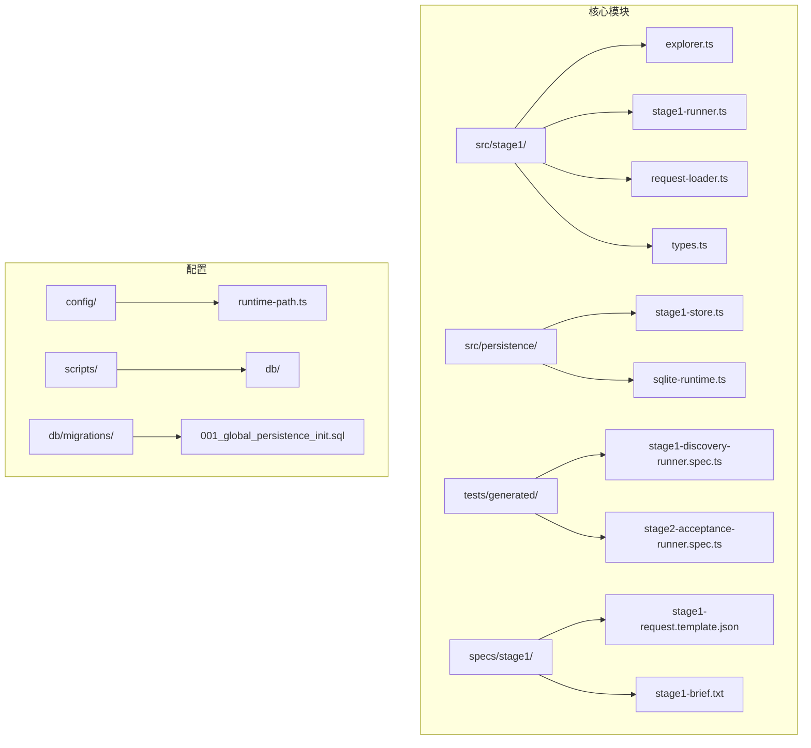
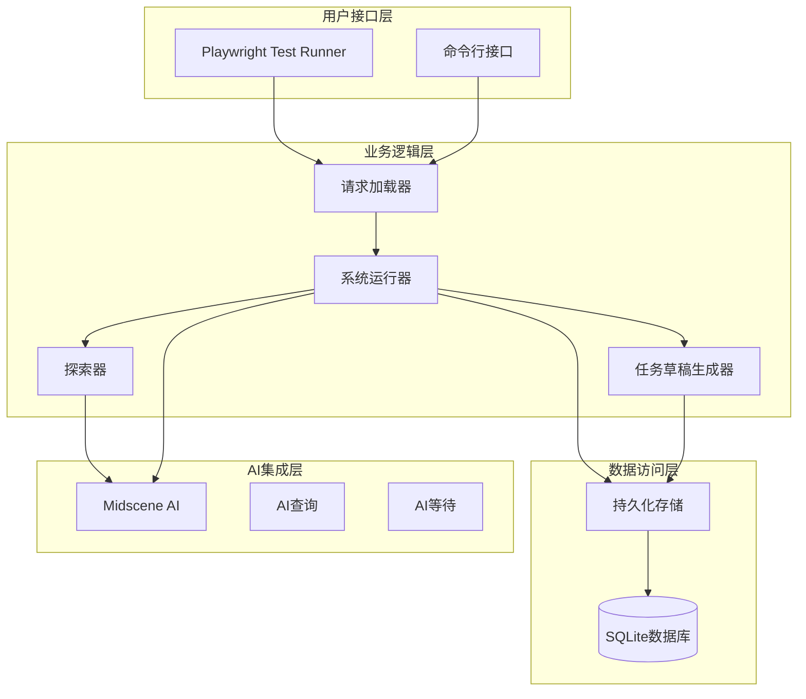
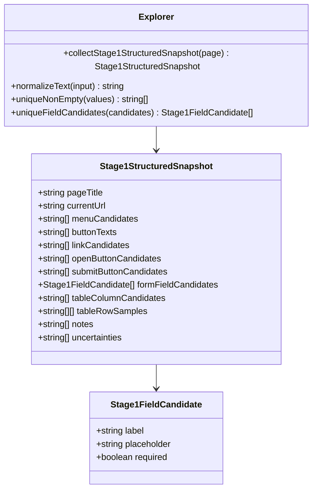
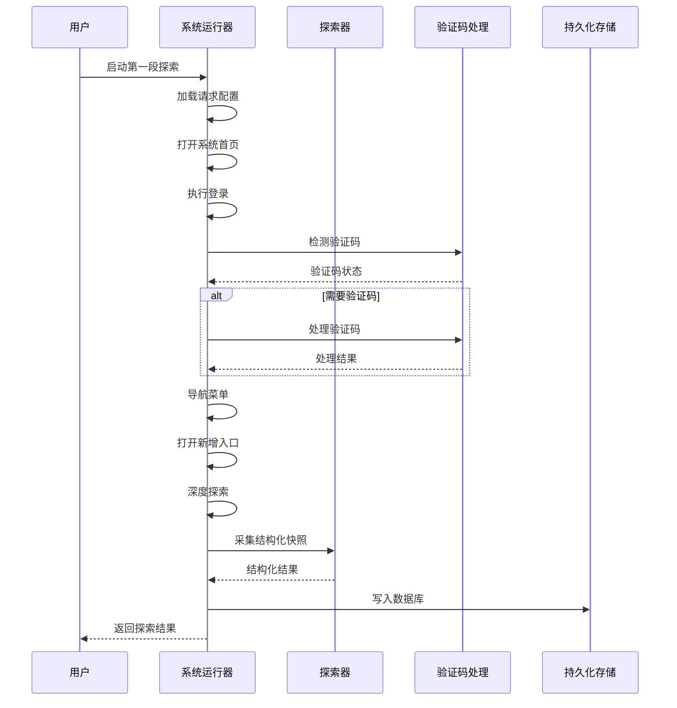
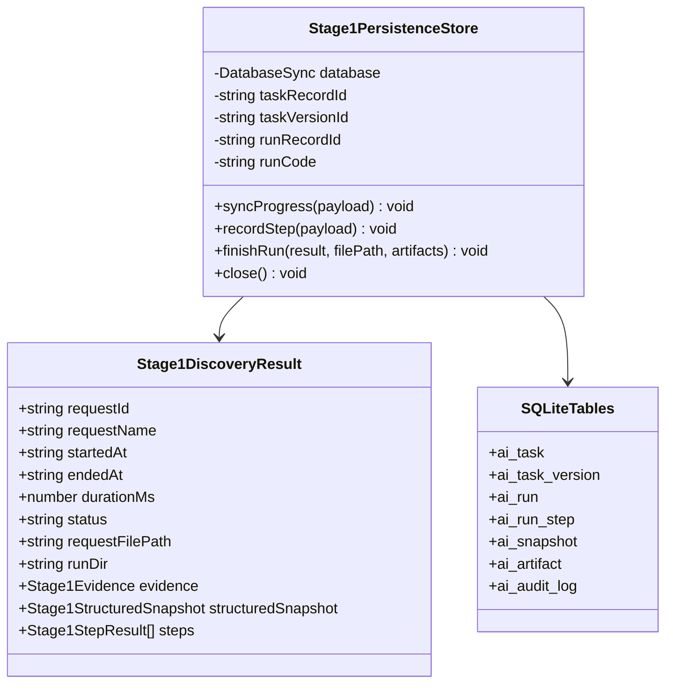
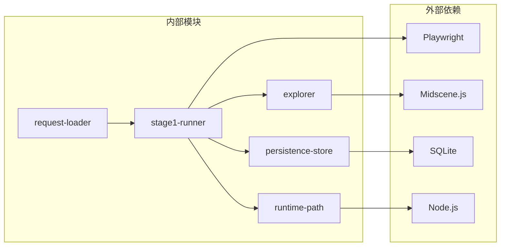

# 第一段菜单导航探索系统

<cite>
**本文档引用的文件**
- [README.md](file://README.md)
- [package.json](file://package.json)
- [src/stage1/explorer.ts](file://src/stage1/explorer.ts)
- [src/stage1/types.ts](file://src/stage1/types.ts)
- [src/stage1/stage1-runner.ts](file://src/stage1/stage1-runner.ts)
- [src/stage1/request-loader.ts](file://src/stage1/request-loader.ts)
- [src/persistence/stage1-store.ts](file://src/persistence/stage1-store.ts)
- [config/runtime-path.ts](file://config/runtime-path.ts)
- [tests/generated/stage1-discovery-runner.spec.ts](file://tests/generated/stage1-discovery-runner.spec.ts)
- [specs/stage1/stage1-request.template.json](file://specs/stage1/stage1-request.template.json)
- [specs/stage1/stage1-brief.txt](file://specs/stage1/stage1-brief.txt)
</cite>

## 目录
1. [简介](#简介)
2. [项目结构](#项目结构)
3. [核心组件](#核心组件)
4. [架构概览](#架构概览)
5. [详细组件分析](#详细组件分析)
6. [依赖关系分析](#依赖关系分析)
7. [性能考虑](#性能考虑)
8. [故障排除指南](#故障排除指南)
9. [结论](#结论)

## 简介

第一段菜单导航探索系统是基于 Playwright 和 Midscene.js 构建的 AI 自动化测试项目的核心模块。该系统能够通过自然语言请求自动探索Web应用的菜单导航结构，识别关键UI元素，并生成第二段任务执行所需的草稿。

系统的主要功能包括：
- **智能菜单导航**：根据用户提供的菜单路径提示自动定位和点击目标菜单
- **结构化探索**：采集页面可见DOM元素，提取按钮、表单字段、表格等关键信息
- **验证码处理**：支持自动和手动两种模式处理滑块验证码
- **数据持久化**：将探索结果和中间产物存储到SQLite数据库
- **草稿生成**：基于探索结果自动生成第二段任务执行草稿

## 项目结构

该项目采用模块化的组织方式，主要分为以下几个核心目录：

**图表来源**
- [src/stage1/explorer.ts:1-466](file://src/stage1/explorer.ts#L1-L466)
- [src/stage1/stage1-runner.ts:1-860](file://src/stage1/stage1-runner.ts#L1-L860)
- [src/persistence/stage1-store.ts:1-729](file://src/persistence/stage1-store.ts#L1-L729)

**章节来源**
- [README.md:1-311](file://README.md#L1-L311)
- [package.json:1-30](file://package.json#L1-L30)

## 核心组件

### 探索器 (Explorer)
负责从页面中提取结构化信息，包括菜单候选项、按钮、表单字段、表格等关键UI元素。

### 运行器 (Runner)
协调整个探索流程，包括登录、验证码处理、菜单导航、深度探索等步骤。

### 请求加载器
解析和验证第一段请求配置，支持环境变量模板替换。

### 持久化存储
将探索结果和中间产物写入SQLite数据库，支持实时进度同步。

**章节来源**
- [src/stage1/explorer.ts:48-466](file://src/stage1/explorer.ts#L48-L466)
- [src/stage1/stage1-runner.ts:546-860](file://src/stage1/stage1-runner.ts#L546-L860)
- [src/stage1/request-loader.ts:79-89](file://src/stage1/request-loader.ts#L79-L89)
- [src/persistence/stage1-store.ts:86-729](file://src/persistence/stage1-store.ts#L86-L729)

## 架构概览

系统采用分层架构设计，各层职责清晰分离：

**图表来源**
- [src/stage1/stage1-runner.ts:1-860](file://src/stage1/stage1-runner.ts#L1-L860)
- [src/stage1/explorer.ts:1-466](file://src/stage1/explorer.ts#L1-L466)
- [src/persistence/stage1-store.ts:1-729](file://src/persistence/stage1-store.ts#L1-L729)

## 详细组件分析

### 探索器组件分析

探索器通过多种策略从页面中提取结构化信息：

**图表来源**
- [src/stage1/explorer.ts:52-466](file://src/stage1/explorer.ts#L52-L466)
- [src/stage1/types.ts:77-117](file://src/stage1/types.ts#L77-L117)

探索器的关键功能包括：

1. **菜单元素识别**：通过多种CSS选择器识别不同UI框架的菜单项
2. **按钮分类**：自动区分新增、提交、取消、搜索等不同类型的按钮
3. **表单字段提取**：识别表单标签、占位符和必填字段
4. **表格结构分析**：提取表格列标题和样例行数据
5. **不确定性标记**：自动识别可能需要人工复核的项目

**章节来源**
- [src/stage1/explorer.ts:15-466](file://src/stage1/explorer.ts#L15-L466)
- [src/stage1/types.ts:71-117](file://src/stage1/types.ts#L71-L117)

### 系统运行器组件分析

运行器协调整个探索流程，包含完整的错误处理和状态管理：

**图表来源**
- [src/stage1/stage1-runner.ts:546-860](file://src/stage1/stage1-runner.ts#L546-L860)
- [src/persistence/stage1-store.ts:86-729](file://src/persistence/stage1-store.ts#L86-L729)

运行器的核心特性：

1. **多模式验证码处理**：支持自动、手动、失败、忽略四种模式
2. **智能菜单导航**：支持多种UI框架的菜单定位策略
3. **深度探索功能**：可选的深度探索模式，自动尝试各种交互控件
4. **实时进度同步**：将探索进度实时写入数据库
5. **错误恢复机制**：详细的错误信息和截图记录

**章节来源**
- [src/stage1/stage1-runner.ts:262-539](file://src/stage1/stage1-runner.ts#L262-L539)
- [src/stage1/stage1-runner.ts:546-860](file://src/stage1/stage1-runner.ts#L546-L860)

### 持久化存储组件分析

持久化存储确保所有探索结果和中间产物都被可靠地保存：

**图表来源**
- [src/persistence/stage1-store.ts:86-729](file://src/persistence/stage1-store.ts#L86-L729)

存储系统的设计特点：

1. **表结构设计**：遵循MySQL兼容子集，便于未来迁移
2. **内容哈希**：对任务内容进行SHA256哈希，支持版本控制
3. **审计日志**：完整的操作审计，便于追踪和调试
4. **文件关联**：将文件路径与数据库记录关联，支持文件系统和数据库的双重备份

**章节来源**
- [src/persistence/stage1-store.ts:19-729](file://src/persistence/stage1-store.ts#L19-L729)

## 依赖关系分析

系统依赖关系清晰，模块间耦合度适中：

**图表来源**
- [package.json:19-29](file://package.json#L19-L29)
- [src/stage1/stage1-runner.ts:1-17](file://src/stage1/stage1-runner.ts#L1-L17)

主要依赖关系：

1. **Playwright集成**：提供Web自动化测试能力
2. **Midscene集成**：提供AI驱动的UI元素识别和断言
3. **SQLite集成**：提供轻量级的数据持久化
4. **环境配置**：通过dotenv管理运行时配置

**章节来源**
- [package.json:1-30](file://package.json#L1-L30)
- [config/runtime-path.ts:1-46](file://config/runtime-path.ts#L1-L46)

## 性能考虑

系统在设计时充分考虑了性能优化：

1. **异步处理**：所有网络请求和文件操作都是异步的
2. **内存管理**：及时释放不需要的对象，避免内存泄漏
3. **数据库优化**：批量写入和事务处理，减少磁盘I/O
4. **缓存策略**：对重复的DOM查询结果进行缓存
5. **超时控制**：合理的超时设置，避免长时间阻塞

## 故障排除指南

### 常见问题及解决方案

1. **验证码处理失败**
   - 检查STAGE1_CAPTCHA_MODE配置
   - 确认AI模型能够正确识别滑块位置
   - 调整CAPTCHA_WAIT_TIMEOUT_MS参数

2. **菜单导航失败**
   - 验证menuPathHints配置是否正确
   - 检查页面UI框架是否被支持
   - 确认目标菜单是否在当前用户权限范围内

3. **探索结果不完整**
   - 检查explorationDepth配置
   - 验证interactionTargets设置
   - 确认页面加载状态

4. **数据库连接问题**
   - 检查DB_FILE_PATH配置
   - 确认SQLite驱动安装
   - 验证文件权限设置

**章节来源**
- [src/stage1/stage1-runner.ts:483-539](file://src/stage1/stage1-runner.ts#L483-L539)
- [src/stage1/stage1-runner.ts:262-310](file://src/stage1/stage1-runner.ts#L262-L310)

## 结论

第一段菜单导航探索系统是一个功能完整、设计合理的AI自动化测试框架。系统通过模块化设计实现了高度的可维护性和扩展性，同时提供了完善的错误处理和数据持久化机制。

系统的主要优势包括：

1. **智能化程度高**：通过AI技术自动识别UI元素和导航路径
2. **可扩展性强**：模块化设计便于添加新的功能和UI框架支持
3. **可靠性好**：完善的错误处理和数据持久化机制
4. **易用性佳**：简洁的配置接口和丰富的示例

该系统为后续的第二段任务执行奠定了坚实的基础，通过自动生成的任务草稿大大减少了人工工作量，提高了测试效率。