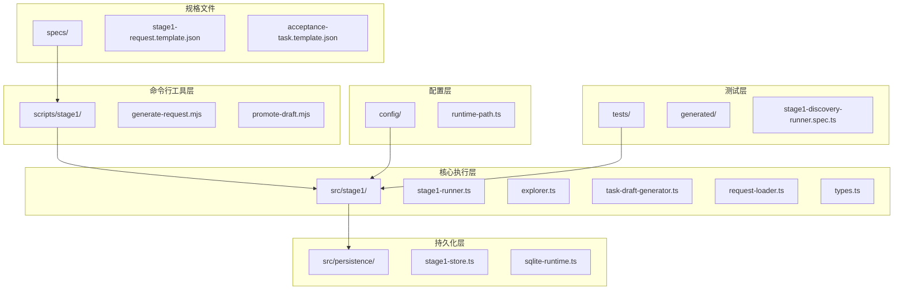
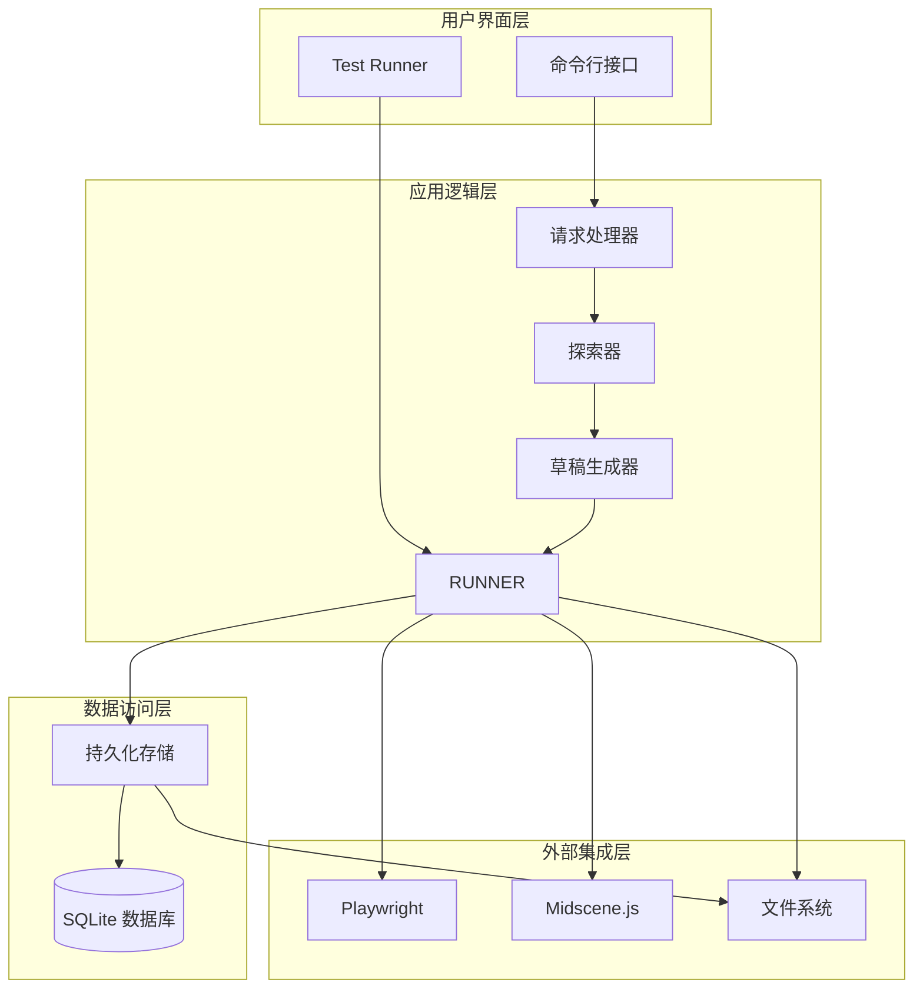
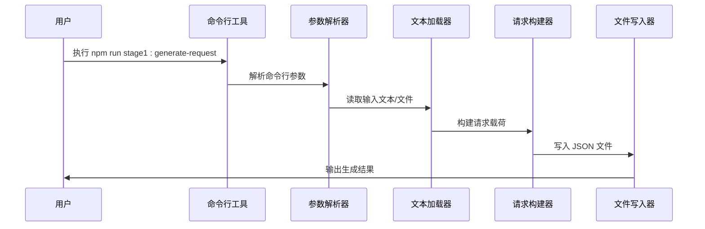
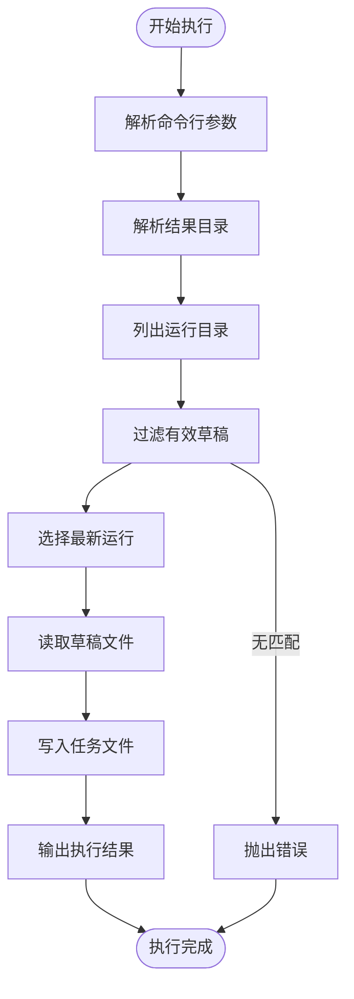
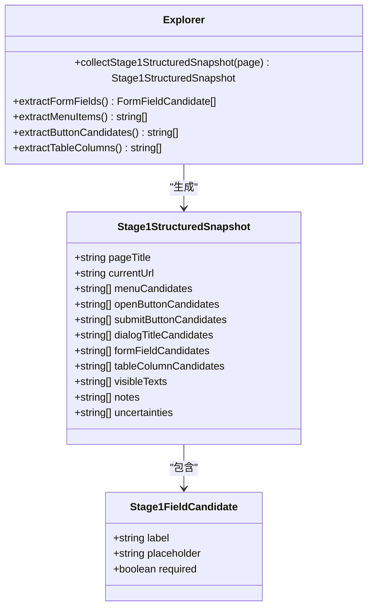
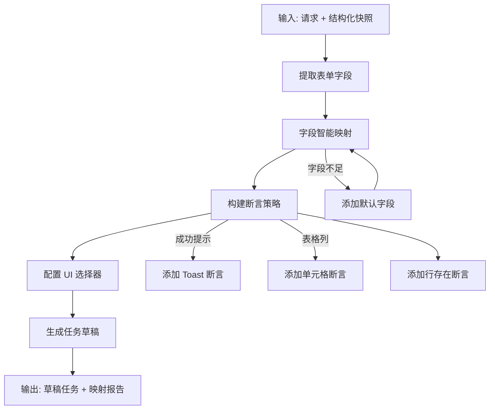
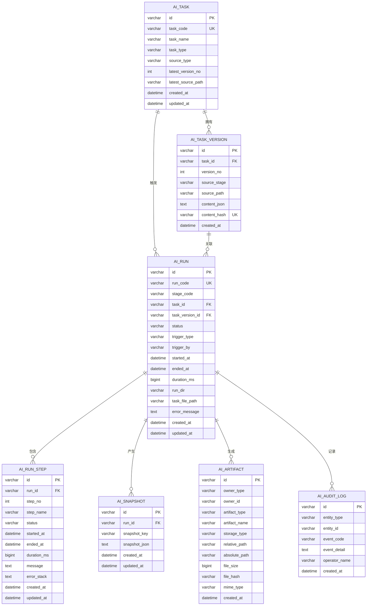

# 第一阶段命令行工具

<cite>
**本文档引用的文件**
- [README.md](file://README.md)
- [package.json](file://package.json)
- [generate-request.mjs](file://scripts/stage1/generate-request.mjs)
- [promote-draft.mjs](file://scripts/stage1/promote-draft.mjs)
- [explorer.ts](file://src/stage1/explorer.ts)
- [task-draft-generator.ts](file://src/stage1/task-draft-generator.ts)
- [types.ts](file://src/stage1/types.ts)
- [request-loader.ts](file://src/stage1/request-loader.ts)
- [stage1-runner.ts](file://src/stage1/stage1-runner.ts)
- [stage1-store.ts](file://src/persistence/stage1-store.ts)
- [stage1-request.template.json](file://specs/stage1/stage1-request.template.json)
- [acceptance-task.template.json](file://specs/tasks/acceptance-task.template.json)
- [stage1-discovery-runner.spec.ts](file://tests/generated/stage1-discovery-runner.spec.ts)
- [runtime-path.ts](file://config/runtime-path.ts)
- [migrate.mjs](file://scripts/db/migrate.mjs)
- [001_global_persistence_init.sql](file://db/migrations/001_global_persistence_init.sql)
</cite>

## 目录
1. [简介](#简介)
2. [项目结构](#项目结构)
3. [核心组件](#核心组件)
4. [架构概览](#架构概览)
5. [详细组件分析](#详细组件分析)
6. [依赖关系分析](#依赖关系分析)
7. [性能考虑](#性能考虑)
8. [故障排除指南](#故障排除指南)
9. [结论](#结论)

## 简介

第一阶段命令行工具是基于 Playwright 和 Midscene.js 构建的 AI 自动化测试项目的命令行接口。该项目提供了完整的端到端测试解决方案，从自然语言需求转换为可执行的测试任务，再到自动化执行和结果输出。

该工具的核心功能包括：
- 自然语言请求到 JSON 请求的转换
- 页面探索和结构化快照收集
- 第二段任务草稿生成
- 自动化测试执行和结果持久化
- 跨平台通用配置支持

## 项目结构

项目采用模块化的组织结构，主要分为以下几个核心部分：



**图表来源**
- [package.json:6-14](file://package.json#L6-L14)
- [stage1-runner.ts:1-376](file://src/stage1/stage1-runner.ts#L1-L376)
- [stage1-store.ts:86-715](file://src/persistence/stage1-store.ts#L86-L715)

**章节来源**
- [README.md:171-236](file://README.md#L171-L236)
- [package.json:6-14](file://package.json#L6-L14)

## 核心组件

### 命令行脚本组件

项目提供了三个主要的命令行脚本来支持第一阶段的完整工作流：

1. **请求生成器** (`scripts/stage1/generate-request.mjs`)
   - 将自然语言描述转换为标准化的 stage1 请求 JSON
   - 支持多种输入格式：直接文本、文件内容、环境变量
   - 自动生成结构化的请求载荷

2. **草稿提升器** (`scripts/stage1/promote-draft.mjs`)
   - 将第一段生成的任务草稿提升为第二段可执行的任务文件
   - 支持多种查找和过滤选项
   - 自动处理文件路径和命名规范

3. **数据库迁移工具** (`scripts/db/migrate.mjs`)
   - 管理 SQLite 数据库的迁移和初始化
   - 支持增量迁移和版本控制
   - 提供完整的数据库结构管理

**章节来源**
- [generate-request.mjs:1-280](file://scripts/stage1/generate-request.mjs#L1-L280)
- [promote-draft.mjs:1-184](file://scripts/stage1/promote-draft.mjs#L1-L184)
- [migrate.mjs:1-52](file://scripts/db/migrate.mjs#L1-L52)

### 执行引擎组件

核心执行引擎由多个相互协作的组件组成：

1. **探索器** (`src/stage1/explorer.ts`)
   - 通过页面可见 DOM 采集结构化探索结果
   - 提取菜单、按钮、表单字段、表格列等关键元素
   - 生成结构化快照供后续处理

2. **任务草稿生成器** (`src/stage1/task-draft-generator.ts`)
   - 基于结构化结果生成第二段任务草稿
   - 实现智能字段映射和断言策略
   - 生成可人工复核的草稿任务

3. **请求加载器** (`src/stage1/request-loader.ts`)
   - 加载和验证 stage1 请求文件
   - 处理模板字符串和环境变量替换
   - 确保请求数据的完整性和正确性

4. **运行器** (`src/stage1/stage1-runner.ts`)
   - 第一段探索建模的主执行器
   - 管理完整的执行流程和状态跟踪
   - 处理截图、日志和结果输出

**章节来源**
- [explorer.ts:37-310](file://src/stage1/explorer.ts#L37-L310)
- [task-draft-generator.ts:150-348](file://src/stage1/task-draft-generator.ts#L150-L348)
- [request-loader.ts:79-89](file://src/stage1/request-loader.ts#L79-L89)
- [stage1-runner.ts:115-376](file://src/stage1/stage1-runner.ts#L115-L376)

### 持久化存储组件

数据持久化层提供了完整的数据库管理和文件存储能力：

1. **Stage1 持久化存储** (`src/persistence/stage1-store.ts`)
   - 实现 SQLite 数据库的完整 CRUD 操作
   - 管理任务、运行、步骤、快照和附件的存储
   - 提供审计日志和状态跟踪功能

2. **数据库迁移** (`db/migrations/001_global_persistence_init.sql`)
   - 定义完整的数据库表结构
   - 包含任务管理、运行跟踪、审计日志等核心表
   - 支持索引优化和外键约束

**章节来源**
- [stage1-store.ts:86-715](file://src/persistence/stage1-store.ts#L86-L715)
- [001_global_persistence_init.sql:1-128](file://db/migrations/001_global_persistence_init.sql#L1-L128)

## 架构概览

项目采用分层架构设计，确保各组件之间的职责清晰分离：



**图表来源**
- [stage1-runner.ts:115-376](file://src/stage1/stage1-runner.ts#L115-L376)
- [stage1-store.ts:86-715](file://src/persistence/stage1-store.ts#L86-L715)

## 详细组件分析

### 命令行工具链分析

#### 请求生成器工作流程



**图表来源**
- [generate-request.mjs:253-280](file://scripts/stage1/generate-request.mjs#L253-L280)

#### 草稿提升器工作流程



**图表来源**
- [promote-draft.mjs:147-184](file://scripts/stage1/promote-draft.mjs#L147-L184)

**章节来源**
- [generate-request.mjs:34-103](file://scripts/stage1/generate-request.mjs#L34-L103)
- [promote-draft.mjs:19-98](file://scripts/stage1/promote-draft.mjs#L19-L98)

### 执行引擎深度分析

#### 探索器数据采集机制

探索器通过多层 DOM 选择器和智能算法来提取页面信息：



**图表来源**
- [explorer.ts:37-310](file://src/stage1/explorer.ts#L37-L310)
- [types.ts:75-93](file://src/stage1/types.ts#L75-L93)

#### 任务草稿生成算法

草稿生成器实现了复杂的字段映射和断言策略：



**图表来源**
- [task-draft-generator.ts:150-348](file://src/stage1/task-draft-generator.ts#L150-L348)

**章节来源**
- [explorer.ts:150-310](file://src/stage1/explorer.ts#L150-L310)
- [task-draft-generator.ts:67-348](file://src/stage1/task-draft-generator.ts#L67-L348)

### 数据持久化架构

#### 数据库设计模式



**图表来源**
- [001_global_persistence_init.sql:1-128](file://db/migrations/001_global_persistence_init.sql#L1-L128)

**章节来源**
- [stage1-store.ts:86-715](file://src/persistence/stage1-store.ts#L86-L715)
- [001_global_persistence_init.sql:1-128](file://db/migrations/001_global_persistence_init.sql#L1-L128)

## 依赖关系分析

项目采用了清晰的依赖层次结构：

```mermaid
graph TB
subgraph "外部依赖"
A[@playwright/test]
B[@midscene/web]
C[node:sqlite]
D[dotenv]
end
subgraph "内部模块"
E[stage1-runner]
F[explorer]
G[task-draft-generator]
H[request-loader]
I[stage1-store]
end
subgraph "配置管理"
J[runtime-path]
K[dotenv 配置]
end
subgraph "测试框架"
L[playwright test]
M[test fixtures]
end
A --> E
B --> E
C --> I
D --> J
E --> F
E --> G
E --> H
E --> I
J --> E
K --> E
L --> M
M --> E
```

**图表来源**
- [package.json:19-28](file://package.json#L19-L28)
- [stage1-runner.ts:1-15](file://src/stage1/stage1-runner.ts#L1-L15)

**章节来源**
- [package.json:19-28](file://package.json#L19-L28)
- [runtime-path.ts:1-46](file://config/runtime-path.ts#L1-L46)

## 性能考虑

### 执行效率优化

1. **异步处理机制**
   - 所有网络请求和文件操作均采用异步模式
   - 使用 Promise 链式调用避免阻塞主线程
   - 合理的超时设置防止长时间挂起

2. **内存管理策略**
   - 及时释放 DOM 引用和临时对象
   - 控制数组和对象的大小限制
   - 使用流式处理大文件内容

3. **数据库性能优化**
   - 批量插入和更新操作
   - 合理的索引设计和查询优化
   - 连接池管理和资源回收

### 资源使用监控

- **CPU 使用率**: 通过异步并发控制避免 CPU 过载
- **内存占用**: 限制单次处理的数据量和缓存大小
- **磁盘 I/O**: 优化文件写入频率和批量操作
- **网络带宽**: 合理的请求间隔和重试机制

## 故障排除指南

### 常见问题诊断

#### 命令行工具问题

1. **脚本执行失败**
   - 检查 Node.js 版本兼容性
   - 验证 `--experimental-sqlite` 参数设置
   - 确认依赖包安装完整性

2. **环境变量配置错误**
   - 验证 `.env` 文件格式和内容
   - 检查路径分隔符和权限设置
   - 确认相对路径解析正确性

#### 执行引擎问题

1. **页面元素识别失败**
   - 检查页面加载状态和超时设置
   - 验证 DOM 选择器的有效性
   - 确认动态内容的等待机制

2. **数据持久化异常**
   - 检查数据库文件权限和空间
   - 验证迁移脚本的执行状态
   - 确认事务的一致性处理

**章节来源**
- [generate-request.mjs:270-280](file://scripts/stage1/generate-request.mjs#L270-L280)
- [stage1-store.ts:137-145](file://src/persistence/stage1-store.ts#L137-L145)

### 调试和日志

1. **启用详细日志**
   - 设置 `DEBUG=true` 环境变量
   - 检查控制台输出和文件日志
   - 使用 `--verbose` 参数获取更多信息

2. **性能分析**
   - 使用 Node.js profiler 分析瓶颈
   - 监控内存使用和垃圾回收
   - 分析数据库查询性能

## 结论

第一阶段命令行工具提供了一个完整、可扩展的 AI 自动化测试解决方案。通过模块化的架构设计和清晰的职责分离，该工具能够有效地处理从自然语言需求到自动化执行的完整流程。

### 主要优势

1. **高度自动化**: 减少手动配置和重复性工作
2. **灵活扩展**: 模块化设计支持功能扩展和定制
3. **可靠持久化**: 完整的数据管理和审计跟踪
4. **跨平台支持**: 统一的配置管理和运行时路径

### 发展方向

1. **性能优化**: 进一步提升执行效率和资源利用率
2. **功能增强**: 扩展更多类型的页面元素识别和处理
3. **集成扩展**: 支持更多外部系统的集成和交互
4. **用户体验**: 改进命令行界面和错误提示

该工具为后续的第二阶段执行器奠定了坚实的基础，通过完整的数据持久化和结构化输出，确保了整个测试流程的可追溯性和可维护性。