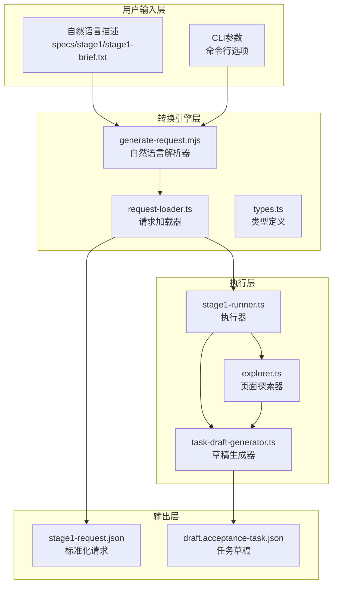
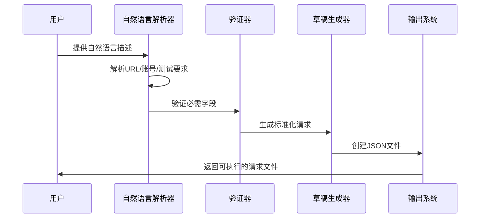
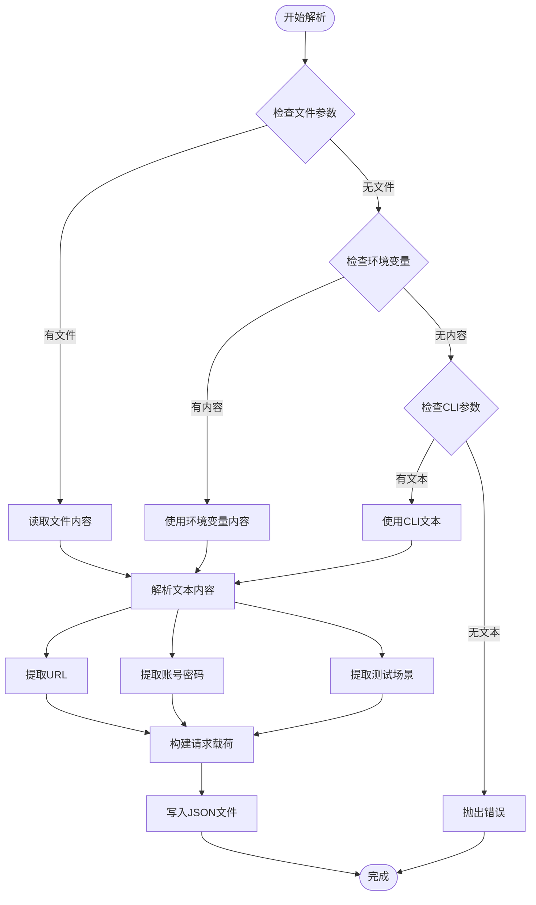
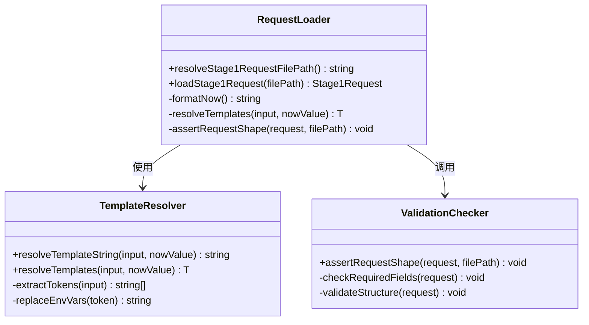
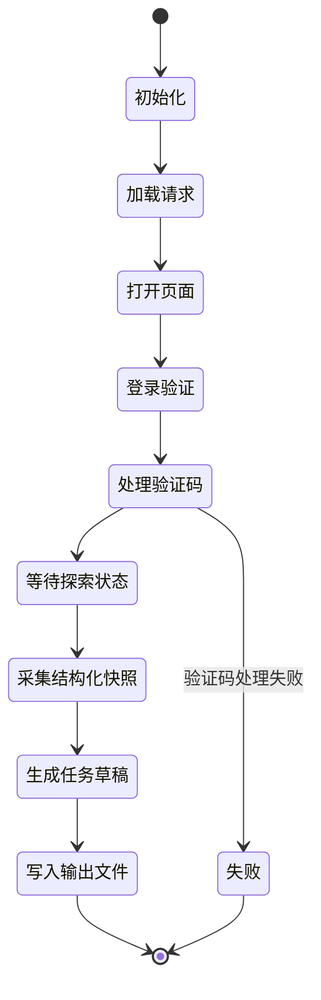

# 第一段自然语言请求转JSON

<cite>
**本文档引用的文件**
- [README.md](file://README.md)
- [generate-request.mjs](file://scripts/stage1/generate-request.mjs)
- [stage1-brief.txt](file://specs/stage1/stage1-brief.txt)
- [stage1-request.template.json](file://specs/stage1/stage1-request.template.json)
- [stage1-discovery-runner.spec.ts](file://tests/generated/stage1-discovery-runner.spec.ts)
- [stage1-runner.ts](file://src/stage1/stage1-runner.ts)
- [request-loader.ts](file://src/stage1/request-loader.ts)
- [explorer.ts](file://src/stage1/explorer.ts)
- [task-draft-generator.ts](file://src/stage1/task-draft-generator.ts)
- [types.ts](file://src/stage1/types.ts)
- [package.json](file://package.json)
- [playwright.config.ts](file://playwright.config.ts)
</cite>

## 目录
1. [简介](#简介)
2. [项目结构](#项目结构)
3. [核心组件](#核心组件)
4. [架构概览](#架构概览)
5. [详细组件分析](#详细组件分析)
6. [依赖关系分析](#依赖关系分析)
7. [性能考虑](#性能考虑)
8. [故障排除指南](#故障排除指南)
9. [结论](#结论)

## 简介

"第一段自然语言请求转JSON"是Playwright-Mind项目中的一个关键功能模块，负责将人类可读的自然语言描述转换为机器可执行的JSON格式请求。该功能允许用户通过简单的文本描述来定义自动化测试场景，系统会自动解析这些描述并生成标准化的请求对象。

该项目基于Playwright和Midscene.js构建，提供了完整的AI自动化测试解决方案。第一段功能专注于从自然语言到JSON的转换，为后续的页面探索和任务执行奠定基础。

## 项目结构

项目采用模块化的组织方式，主要分为以下几个核心部分：



**图表来源**
- [generate-request.mjs:1-308](file://scripts/stage1/generate-request.mjs#L1-L308)
- [stage1-runner.ts:1-632](file://src/stage1/stage1-runner.ts#L1-L632)
- [request-loader.ts:1-89](file://src/stage1/request-loader.ts#L1-L89)

**章节来源**
- [README.md:173-206](file://README.md#L173-L206)
- [package.json:6-14](file://package.json#L6-L14)

## 核心组件

### 自然语言解析器 (generate-request.mjs)

这是整个功能的核心组件，负责将自然语言描述转换为标准的JSON请求格式。它支持多种输入源，包括文件、环境变量和命令行参数。

主要功能特性：
- **多格式支持**：支持.txt和.html文件格式
- **智能提取**：自动识别URL、账号密码、测试要求等关键信息
- **模板处理**：支持环境变量和时间戳模板
- **错误处理**：提供详细的错误信息和回退机制

### 请求加载器 (request-loader.ts)

负责加载和验证生成的JSON请求文件，确保所有必需字段都已正确填充。

核心功能：
- **文件解析**：读取JSON文件内容
- **模板替换**：处理环境变量和动态时间戳
- **结构验证**：确保请求对象符合预期格式
- **路径解析**：支持绝对和相对路径

### 类型定义 (types.ts)

提供完整的类型系统，确保代码的类型安全性和可维护性。

**章节来源**
- [generate-request.mjs:1-308](file://scripts/stage1/generate-request.mjs#L1-L308)
- [request-loader.ts:1-89](file://src/stage1/request-loader.ts#L1-L89)
- [types.ts:1-109](file://src/stage1/types.ts#L1-L109)

## 架构概览

整个转换流程遵循"输入-解析-验证-输出"的架构模式：



**图表来源**
- [generate-request.mjs:217-266](file://scripts/stage1/generate-request.mjs#L217-L266)
- [request-loader.ts:79-89](file://src/stage1/request-loader.ts#L79-L89)

## 详细组件分析

### 自然语言解析器深度分析

#### 输入处理流程



**图表来源**
- [generate-request.mjs:99-130](file://scripts/stage1/generate-request.mjs#L99-L130)
- [generate-request.mjs:217-266](file://scripts/stage1/generate-request.mjs#L217-L266)

#### 关键解析算法

解析器使用正则表达式和字符串处理技术来提取关键信息：

1. **URL提取**：使用HTTP/HTTPS正则表达式匹配
2. **账号密码提取**：支持多种格式的账号密码识别
3. **菜单路径提取**：从测试场景描述中识别菜单导航路径
4. **场景描述提取**：标准化测试要求文本

**章节来源**
- [generate-request.mjs:140-177](file://scripts/stage1/generate-request.mjs#L140-L177)
- [generate-request.mjs:179-215](file://scripts/stage1/generate-request.mjs#L179-L215)

### 请求加载器详细分析

#### 模板处理机制



**图表来源**
- [request-loader.ts:79-89](file://src/stage1/request-loader.ts#L79-L89)
- [request-loader.ts:33-48](file://src/stage1/request-loader.ts#L33-L48)

#### 模板系统设计

请求加载器实现了强大的模板处理系统：

1. **时间戳模板**：`NOW_YYYYMMDDHHMMSS` 自动替换为当前时间
2. **环境变量模板**：`${ENV_VAR_NAME}` 替换为环境变量值
3. **递归处理**：支持嵌套对象和数组的模板替换
4. **安全检查**：缺失的环境变量替换为空字符串

**章节来源**
- [request-loader.ts:8-48](file://src/stage1/request-loader.ts#L8-L48)
- [request-loader.ts:50-69](file://src/stage1/request-loader.ts#L50-L69)

### 执行器集成分析

#### 生命周期管理



**图表来源**
- [stage1-runner.ts:367-632](file://src/stage1/stage1-runner.ts#L367-L632)

#### 错误处理策略

执行器采用了多层次的错误处理机制：

1. **步骤级错误**：每个执行步骤都有独立的错误处理
2. **截图记录**：失败时自动截取页面快照
3. **进度保存**：定期保存执行进度，支持断点续跑
4. **状态追踪**：完整记录每个步骤的开始、结束和状态

**章节来源**
- [stage1-runner.ts:443-490](file://src/stage1/stage1-runner.ts#L443-L490)
- [stage1-runner.ts:492-584](file://src/stage1/stage1-runner.ts#L492-L584)

## 依赖关系分析

项目各组件之间的依赖关系清晰明确：

```mermaid
graph TB
subgraph "外部依赖"
A[dotenv]
B[playwright]
C[@midscene/web]
end
subgraph "内部模块"
D[generate-request.mjs]
E[request-loader.ts]
F[stage1-runner.ts]
G[explorer.ts]
H[task-draft-generator.ts]
I[types.ts]
end
subgraph "配置文件"
J[package.json]
K[playwright.config.ts]
L[.env]
end
A --> D
B --> F
C --> F
D --> E
E --> F
F --> G
F --> H
I --> D
I --> E
I --> F
I --> G
I --> H
J --> D
J --> F
K --> F
L --> D
L --> F
```

**图表来源**
- [package.json:19-29](file://package.json#L19-L29)
- [playwright.config.ts:1-95](file://playwright.config.ts#L1-L95)

**章节来源**
- [package.json:1-30](file://package.json#L1-L30)
- [playwright.config.ts:1-95](file://playwright.config.ts#L1-L95)

## 性能考虑

### 解析性能优化

1. **正则表达式优化**：使用预编译的正则表达式减少重复编译开销
2. **字符串处理缓存**：对常用字符串操作结果进行缓存
3. **异步I/O**：文件读写采用异步方式，避免阻塞主线程
4. **内存管理**：及时释放不再使用的中间结果

### 执行效率提升

1. **并行处理**：支持多浏览器并行执行
2. **智能等待**：使用AI驱动的等待策略，避免不必要的超时
3. **断点续跑**：支持部分失败后的重新执行
4. **资源复用**：复用已建立的页面连接和会话

## 故障排除指南

### 常见问题及解决方案

#### 输入文件问题
- **问题**：自然语言文件格式不正确
- **解决**：检查文件编码为UTF-8，确保URL、账号密码格式正确
- **预防**：使用提供的模板文件作为参考

#### 解析失败
- **问题**：无法识别必要的信息字段
- **解决**：检查输入文本中是否包含"URL："、"账号/密码："等标识符
- **预防**：按照示例格式编写测试描述

#### 模板替换错误
- **问题**：环境变量未正确设置
- **解决**：检查.env文件中的变量定义，确保变量名拼写正确
- **预防**：使用package.json中的脚本自动加载环境变量

#### 权限问题
- **问题**：目标文件已存在且无法覆盖
- **解决**：使用--force参数强制覆盖，或手动删除现有文件
- **预防**：在执行前检查目标文件状态

**章节来源**
- [generate-request.mjs:280-307](file://scripts/stage1/generate-request.mjs#L280-L307)
- [request-loader.ts:79-89](file://src/stage1/request-loader.ts#L79-L89)

## 结论

"第一段自然语言请求转JSON"功能成功地实现了从人类可读描述到机器可执行格式的转换。该功能具有以下优势：

1. **易用性强**：用户只需提供简单的自然语言描述即可生成复杂的测试请求
2. **扩展性好**：模块化设计便于功能扩展和维护
3. **可靠性高**：完善的错误处理和验证机制确保系统的稳定性
4. **集成度高**：与整个Playwright-Mind生态系统无缝集成

该功能为后续的页面探索和任务执行奠定了坚实的基础，是整个AI自动化测试流程的重要起点。通过持续的优化和改进，该功能将继续为用户提供更好的使用体验。