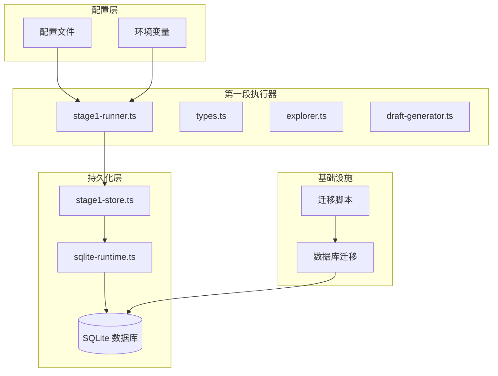
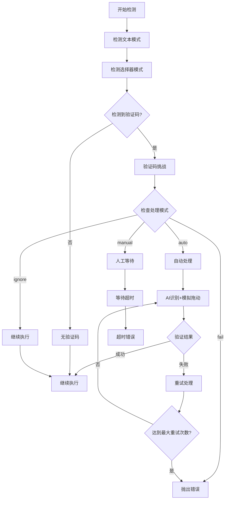
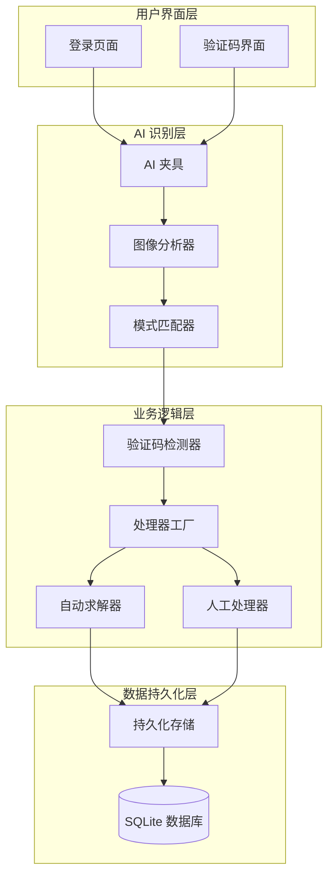
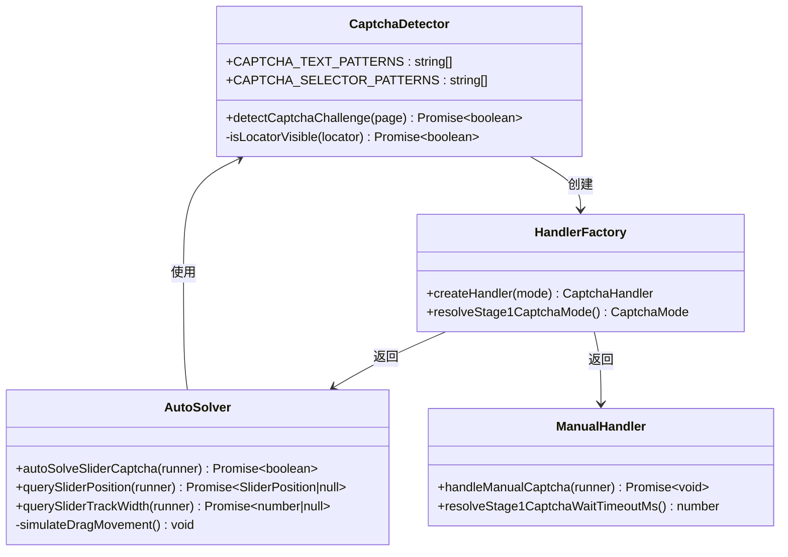
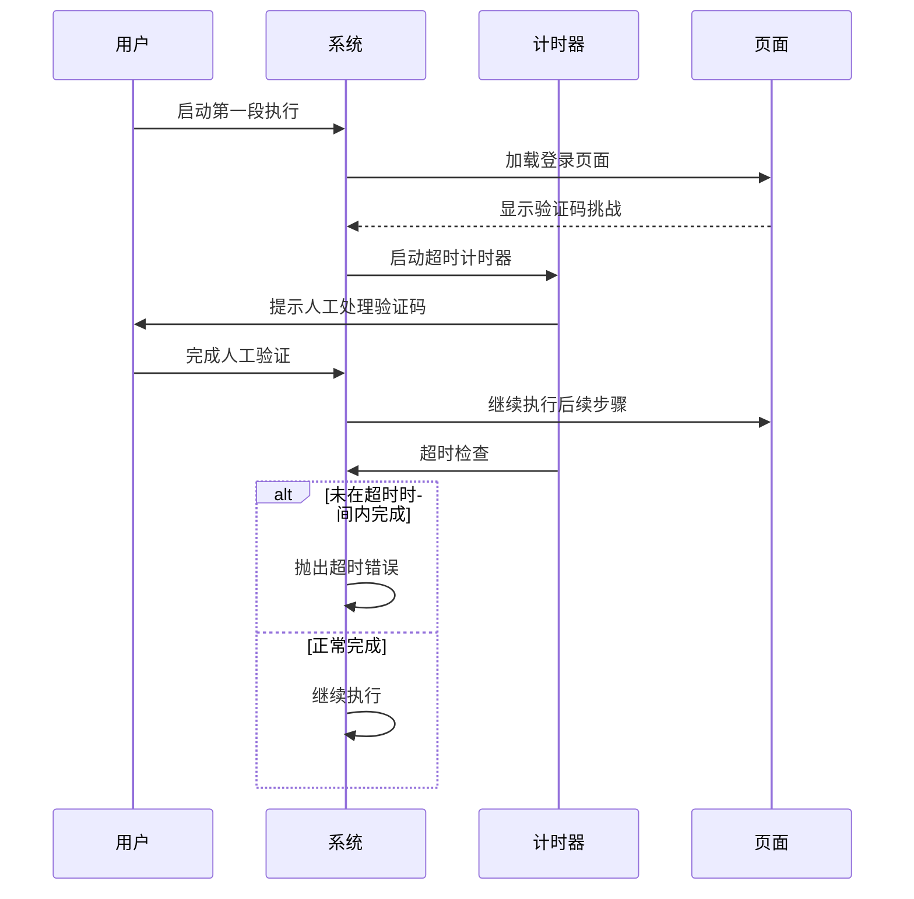
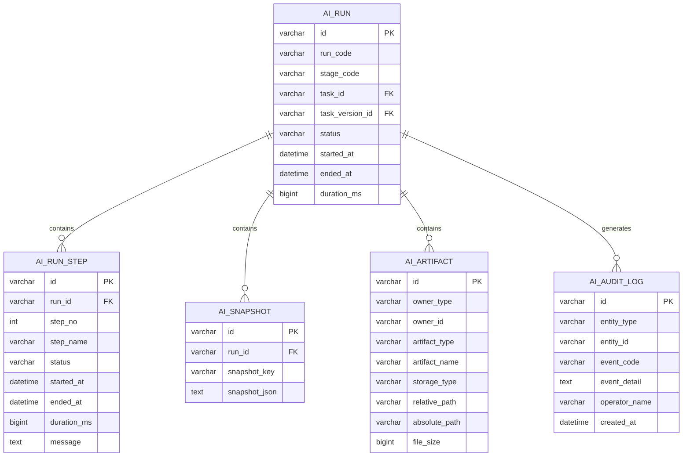
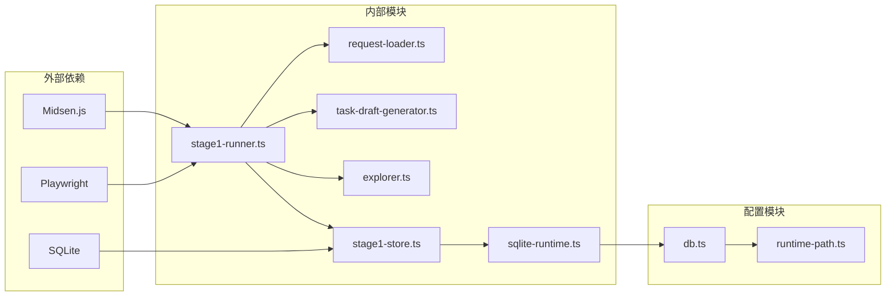

# 第一段登录验证码处理增强

<cite>
**本文档引用的文件**
- [README.md](file://README.md)
- [stage1-runner.ts](file://src/stage1/stage1-runner.ts)
- [types.ts](file://src/stage1/types.ts)
- [stage1-store.ts](file://src/persistence/stage1-store.ts)
- [sqlite-runtime.ts](file://src/persistence/sqlite-runtime.ts)
- [001_global_persistence_init.sql](file://db/migrations/001_global_persistence_init.sql)
- [db.ts](file://config/db.ts)
- [package.json](file://package.json)
- [login-e2e.md](file://specs/login-e2e.md)
</cite>

## 目录
1. [简介](#简介)
2. [项目结构](#项目结构)
3. [核心组件](#核心组件)
4. [架构概览](#架构概览)
5. [详细组件分析](#详细组件分析)
6. [依赖关系分析](#依赖关系分析)
7. [性能考虑](#性能考虑)
8. [故障排除指南](#故障排除指南)
9. [结论](#结论)

## 简介

本文档详细分析了 HI-TEST 项目中"第一段登录验证码处理增强"的实现方案。该项目基于 Playwright 和 Midscene.js 构建的 AI 自动化测试框架，专门针对登录页面的安全验证（主要是滑块验证码）提供了完整的自动化处理解决方案。

该增强功能实现了四种不同的验证码处理模式：自动处理（auto）、人工处理（manual）、失败终止（fail）和忽略（ignore），并通过 AI + Playwright 的组合方式实现了智能的验证码识别和模拟操作。

## 项目结构

项目采用模块化的分层架构，主要包含以下核心模块：

**图表来源**
- [stage1-runner.ts:1-632](file://src/stage1/stage1-runner.ts#L1-L632)
- [stage1-store.ts:1-729](file://src/persistence/stage1-store.ts#L1-L729)
- [sqlite-runtime.ts:1-116](file://src/persistence/sqlite-runtime.ts#L1-L116)

**章节来源**
- [README.md:1-306](file://README.md#L1-L306)
- [package.json:1-30](file://package.json#L1-L30)

## 核心组件

### 验证码处理模式系统

系统实现了四种不同的验证码处理模式，每种模式都有特定的适用场景：

| 模式 | 描述 | 适用场景 | 特点 |
|------|------|----------|------|
| auto | AI 自动处理滑块验证码 | 验证码规则相对简单、可预测 | 使用 AI 识别 + Playwright 模拟拖动 |
| manual | 人工处理 | 需要人工干预或复杂验证码 | 等待人工完成后再继续执行 |
| fail | 失败终止 | 验证码检测即刻失败 | 严格模式，遇到验证码直接报错 |
| ignore | 忽略检测 | 特殊场景需要绕过验证码 | 不进行验证码检测 |

### 智能验证码识别机制

系统通过多种方式检测和识别验证码挑战：

**图表来源**
- [stage1-runner.ts:190-360](file://src/stage1/stage1-runner.ts#L190-L360)

**章节来源**
- [stage1-runner.ts:30-81](file://src/stage1/stage1-runner.ts#L30-L81)

## 架构概览

整个验证码处理系统采用了分层架构设计，确保了高内聚、低耦合的特性：

**图表来源**
- [stage1-runner.ts:261-360](file://src/stage1/stage1-runner.ts#L261-L360)
- [stage1-store.ts:86-135](file://src/persistence/stage1-store.ts#L86-L135)

## 详细组件分析

### 验证码检测器实现

验证码检测器是整个系统的核心组件，负责识别各种类型的验证码挑战：

**图表来源**
- [stage1-runner.ts:190-360](file://src/stage1/stage1-runner.ts#L190-L360)

#### 自动滑块验证码处理

自动处理模式使用 AI 技术进行智能识别和模拟操作：

1. **AI 识别阶段**：使用 Midscene 的 `aiQuery` 方法分析页面截图，识别滑块按钮位置和滑槽宽度
2. **轨迹规划**：计算最优拖动轨迹，采用 15 步渐进拖动和 easeOut 缓动函数
3. **随机抖动**：添加 -3~3 像素的随机抖动，模拟真实用户的手部轨迹
4. **结果验证**：检查滑块是否成功消除，最多重试 3 次

#### 人工处理模式

人工处理模式提供了灵活的人机协作机制：

**图表来源**
- [stage1-runner.ts:346-360](file://src/stage1/stage1-runner.ts#L346-L360)

**章节来源**
- [stage1-runner.ts:261-312](file://src/stage1/stage1-runner.ts#L261-L312)

### 数据持久化集成

验证码处理过程中的所有关键信息都会被持久化存储，确保系统的可追溯性和审计能力：

**图表来源**
- [001_global_persistence_init.sql:1-128](file://db/migrations/001_global_persistence_init.sql#L1-L128)

**章节来源**
- [stage1-store.ts:482-704](file://src/persistence/stage1-store.ts#L482-L704)

## 依赖关系分析

系统的关键依赖关系如下：

**图表来源**
- [stage1-runner.ts:1-20](file://src/stage1/stage1-runner.ts#L1-L20)
- [stage1-store.ts:1-17](file://src/persistence/stage1-store.ts#L1-L17)
- [db.ts:1-28](file://config/db.ts#L1-L28)

**章节来源**
- [package.json:19-29](file://package.json#L19-L29)

## 性能考虑

### 验证码处理性能优化

1. **异步处理机制**：验证码检测采用异步非阻塞方式，不影响页面加载性能
2. **智能重试策略**：自动处理模式最多重试 3 次，避免无限循环
3. **超时控制**：人工处理模式支持可配置的超时时间，默认 120 秒
4. **内存管理**：及时释放 AI 识别资源和页面对象引用

### 数据持久化性能

1. **批量写入**：运行步骤和快照采用批量写入策略
2. **索引优化**：数据库表建立了适当的索引以提高查询性能
3. **文件系统优化**：运行产物采用统一目录结构，便于管理和清理

## 故障排除指南

### 常见问题及解决方案

| 问题类型 | 症状 | 可能原因 | 解决方案 |
|----------|------|----------|----------|
| 验证码识别失败 | AI 无法识别滑块位置 | 图像分析失败或网络延迟 | 检查网络连接，增加等待时间 |
| 自动处理超时 | 滑块拖动后仍未消除 | 滑块位置计算错误 | 调整拖动距离参数 |
| 人工处理超时 | 120 秒后仍然检测到验证码 | 人工操作超时 | 增加 STAGE1_CAPTCHA_WAIT_TIMEOUT_MS |
| 数据库连接失败 | 持久化写入失败 | 数据库文件权限问题 | 检查数据库文件权限 |

### 调试建议

1. **启用详细日志**：检查 `t_runtime/` 目录下的日志文件
2. **验证环境配置**：确认 `.env` 文件中的配置项正确
3. **测试网络连接**：确保能够访问目标网站
4. **检查依赖版本**：验证 Playwright 和 Midscene.js 的版本兼容性

**章节来源**
- [stage1-runner.ts:341-359](file://src/stage1/stage1-runner.ts#L341-L359)

## 结论

第一段登录验证码处理增强功能成功实现了智能化的验证码处理解决方案。通过 AI + Playwright 的技术组合，系统能够在不同场景下自动选择最适合的处理策略，既保证了自动化测试的连续性，又提供了灵活的人工干预选项。

该实现具有以下优势：

1. **多模式支持**：适应不同复杂度的验证码场景
2. **智能识别**：利用 AI 技术提高识别准确率
3. **可扩展性**：模块化设计便于功能扩展
4. **可观测性**：完整的数据持久化确保可追溯性
5. **可靠性**：完善的错误处理和重试机制

未来可以在以下方面进一步优化：
- 支持更多类型的验证码识别
- 增强 AI 识别的准确性
- 优化性能表现
- 扩展数据库支持