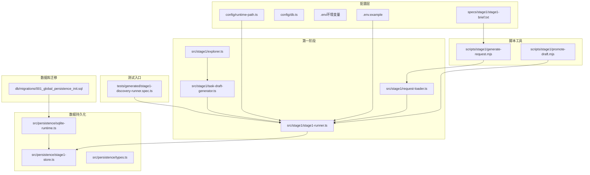
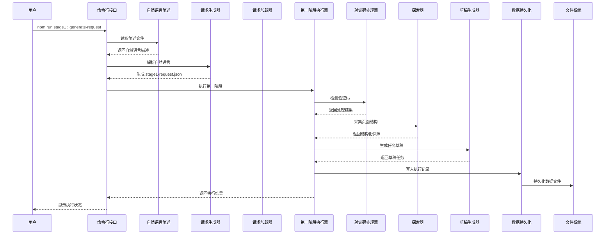
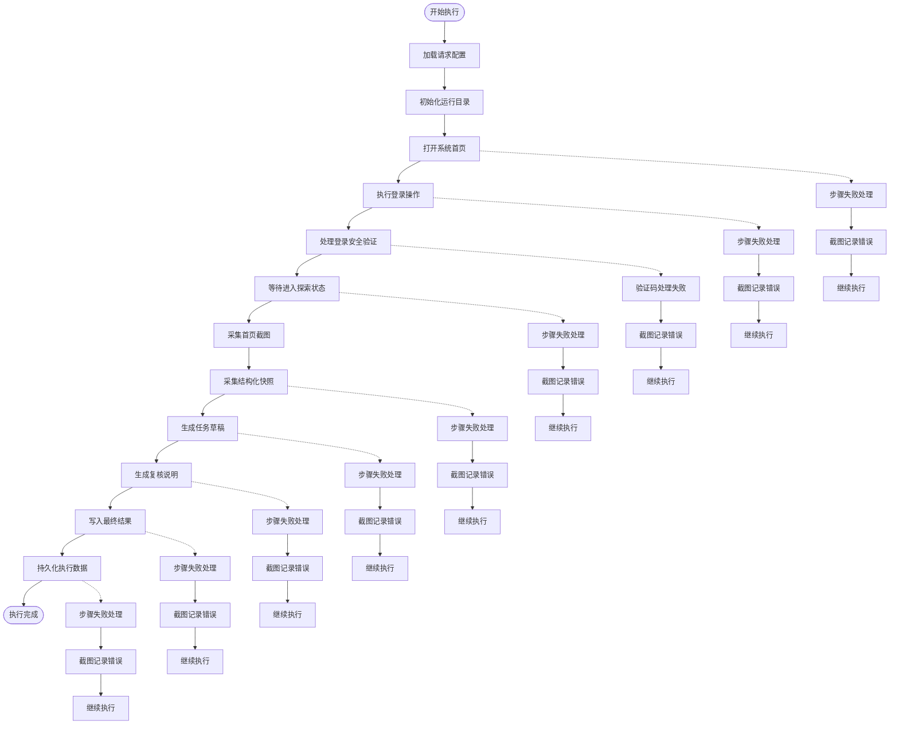
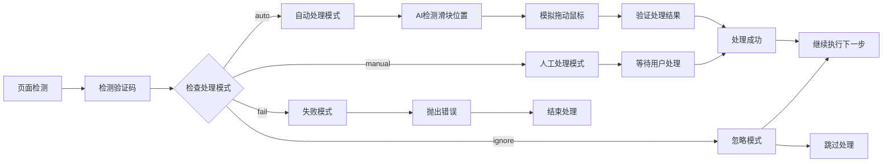
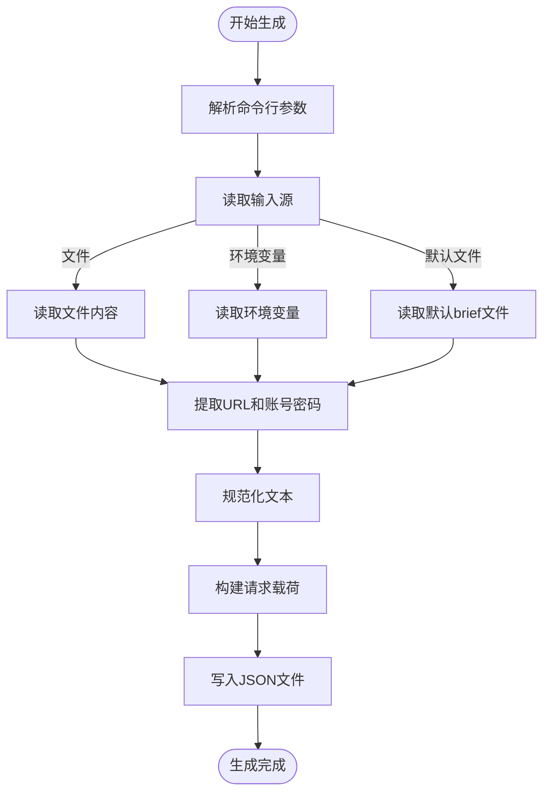
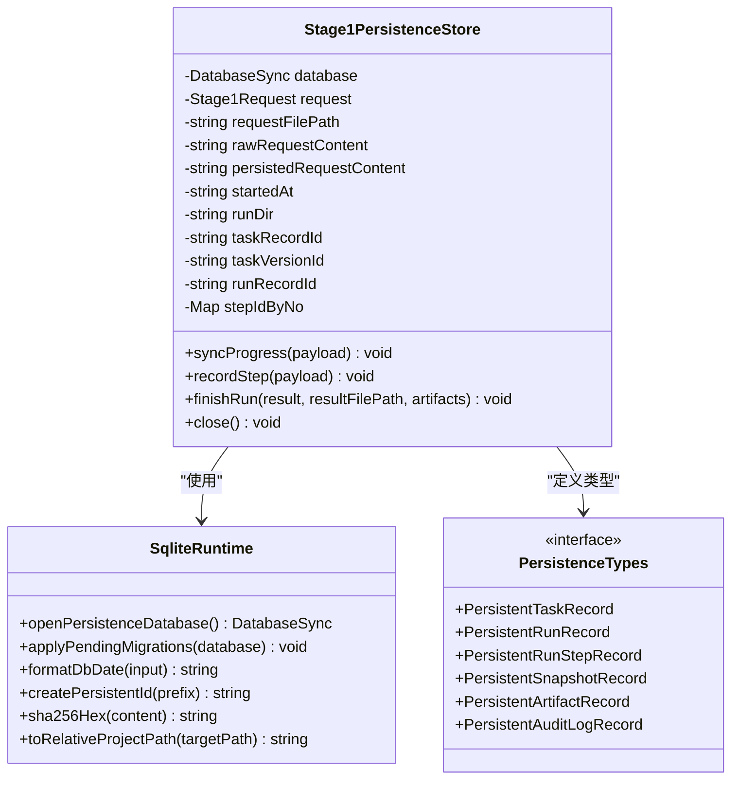

# 第一阶段开发工作流

<cite>
**本文档引用的文件**
- [README.md](file://README.md)
- [package.json](file://package.json)
- [src/stage1/types.ts](file://src/stage1/types.ts)
- [src/stage1/explorer.ts](file://src/stage1/explorer.ts)
- [src/stage1/task-draft-generator.ts](file://src/stage1/task-draft-generator.ts)
- [src/stage1/request-loader.ts](file://src/stage1/request-loader.ts)
- [src/stage1/stage1-runner.ts](file://src/stage1/stage1-runner.ts)
- [src/persistence/types.ts](file://src/persistence/types.ts)
- [src/persistence/stage1-store.ts](file://src/persistence/stage1-store.ts)
- [src/persistence/sqlite-runtime.ts](file://src/persistence/sqlite-runtime.ts)
- [scripts/stage1/generate-request.mjs](file://scripts/stage1/generate-request.mjs)
- [scripts/stage1/promote-draft.mjs](file://scripts/stage1/promote-draft.mjs)
- [tests/generated/stage1-discovery-runner.spec.ts](file://tests/generated/stage1-discovery-runner.spec.ts)
- [config/runtime-path.ts](file://config/runtime-path.ts)
- [specs/stage1/stage1-request.template.json](file://specs/stage1/stage1-request.template.json)
- [specs/tasks/acceptance-task.template.json](file://specs/tasks/acceptance-task.template.json)
- [db/migrations/001_global_persistence_init.sql](file://db/migrations/001_global_persistence_init.sql)
- [.env.example](file://.env.example)
- [specs/stage1/stage1-brief.txt](file://specs/stage1/stage1-brief.txt)
</cite>

## 更新摘要
**变更内容**
- 新增验证码处理增强功能，支持自动滑块处理和人工等待模式
- 新增自然语言请求生成功能，支持从自然语言快速生成可执行请求文件
- 更新配置说明和使用指南
- 增强第一阶段执行器的健壮性和用户体验

## 目录
1. [简介](#简介)
2. [项目结构](#项目结构)
3. [核心组件](#核心组件)
4. [架构概览](#架构概览)
5. [详细组件分析](#详细组件分析)
6. [依赖关系分析](#依赖关系分析)
7. [性能考虑](#性能考虑)
8. [故障排除指南](#故障排除指南)
9. [结论](#结论)

## 简介

第一阶段开发工作流是基于 Playwright 和 Midscene.js 的 AI 自动化测试项目的核心部分。该项目实现了从自然语言需求到可执行测试任务的完整自动化流程，主要包含三个核心阶段：

- **第一阶段（探索建模）**：通过页面探索和结构化分析生成第二段任务草稿
- **第二阶段（任务执行）**：基于 JSON 任务文件执行完整的验收测试
- **第三阶段（数据持久化）**：将整个执行过程和结果持久化存储

项目采用模块化设计，每个阶段都有独立的执行器和数据处理逻辑，同时通过统一的运行时配置和数据持久化层实现各阶段间的无缝衔接。

**更新** 新增验证码处理增强和自然语言请求生成功能，显著提升了系统的自动化程度和用户体验。

## 项目结构



**图表来源**
- [config/runtime-path.ts:1-46](file://config/runtime-path.ts#L1-L46)
- [src/stage1/stage1-runner.ts:1-632](file://src/stage1/stage1-runner.ts#L1-L632)
- [src/persistence/stage1-store.ts:1-729](file://src/persistence/stage1-store.ts#L1-L729)
- [scripts/stage1/generate-request.mjs:1-308](file://scripts/stage1/generate-request.mjs#L1-L308)

**章节来源**
- [README.md:1-306](file://README.md#L1-L306)
- [package.json:1-30](file://package.json#L1-L30)

## 核心组件

### 第一阶段执行器
第一阶段执行器是整个工作流的核心，负责协调各个组件完成页面探索、结构化分析和任务草稿生成。现已增强验证码处理能力，支持多种处理模式。

### 探索器组件
探索器专门负责从页面中提取结构化信息，包括按钮、表单字段、表格列等 UI 元素的识别和分类。

### 任务草稿生成器
基于探索结果自动生成第二阶段的任务草稿，包含导航路径、表单字段映射、断言策略等关键信息。

### 数据持久化服务
提供统一的数据持久化能力，将执行过程中的各种数据（运行记录、步骤详情、快照等）可靠地存储到 SQLite 数据库中。

### 验证码处理系统
新增的验证码处理系统支持四种模式：
- **自动模式**：AI 定位滑块并模拟真人拖动
- **人工模式**：检测到验证码后等待人工处理
- **失败模式**：检测到验证码立即失败
- **忽略模式**：跳过验证码检测

### 自然语言请求生成器
支持从自然语言描述快速生成可执行的 JSON 请求文件，降低使用门槛。

**章节来源**
- [src/stage1/stage1-runner.ts:314-360](file://src/stage1/stage1-runner.ts#L314-L360)
- [src/stage1/stage1-runner.ts:190-312](file://src/stage1/stage1-runner.ts#L190-L312)
- [scripts/stage1/generate-request.mjs:217-266](file://scripts/stage1/generate-request.mjs#L217-L266)

## 架构概览



**图表来源**
- [scripts/stage1/generate-request.mjs:280-296](file://scripts/stage1/generate-request.mjs#L280-L296)
- [src/stage1/stage1-runner.ts:314-360](file://src/stage1/stage1-runner.ts#L314-L360)
- [src/stage1/stage1-runner.ts:505-507](file://src/stage1/stage1-runner.ts#L505-L507)

## 详细组件分析

### 第一阶段执行器详细分析

第一阶段执行器采用模块化设计，通过 runStep 函数实现步骤化的执行控制，每个步骤都具备独立的错误处理和截图能力。现已增强验证码处理步骤。



**图表来源**
- [src/stage1/stage1-runner.ts:494-507](file://src/stage1/stage1-runner.ts#L494-L507)
- [src/stage1/stage1-runner.ts:505-507](file://src/stage1/stage1-runner.ts#L505-L507)

### 验证码处理系统分析

验证码处理系统提供了四种处理模式，支持自动检测和处理滑块验证码。



**图表来源**
- [src/stage1/stage1-runner.ts:314-360](file://src/stage1/stage1-runner.ts#L314-L360)
- [src/stage1/stage1-runner.ts:190-312](file://src/stage1/stage1-runner.ts#L190-L312)

### 自然语言请求生成器分析

自然语言请求生成器支持从多种输入源生成标准的 JSON 请求文件。



**图表来源**
- [scripts/stage1/generate-request.mjs:35-76](file://scripts/stage1/generate-request.mjs#L35-L76)
- [scripts/stage1/generate-request.mjs:99-130](file://scripts/stage1/generate-request.mjs#L99-L130)
- [scripts/stage1/generate-request.mjs:217-266](file://scripts/stage1/generate-request.mjs#L217-L266)

### 数据持久化服务分析

数据持久化服务提供统一的数据库访问接口，支持事务处理和错误恢复机制。



**图表来源**
- [src/persistence/stage1-store.ts:86-729](file://src/persistence/stage1-store.ts#L86-L729)
- [src/persistence/sqlite-runtime.ts:73-116](file://src/persistence/sqlite-runtime.ts#L73-L116)
- [src/persistence/types.ts:34-125](file://src/persistence/types.ts#L34-L125)

**章节来源**
- [src/stage1/stage1-runner.ts:367-632](file://src/stage1/stage1-runner.ts#L367-L632)
- [src/stage1/explorer.ts:37-310](file://src/stage1/explorer.ts#L37-L310)
- [src/stage1/task-draft-generator.ts:150-348](file://src/stage1/task-draft-generator.ts#L150-L348)
- [src/persistence/stage1-store.ts:86-729](file://src/persistence/stage1-store.ts#L86-L729)

## 依赖关系分析

```mermaid
graph TB
subgraph "外部依赖"
A[@playwright/test]
B[@midscene/web]
C[node:sqlite]
D[dotenv]
E[fs]
F[path]
end
subgraph "内部模块"
G[stage1-runner]
H[explorer]
I[task-draft-generator]
J[request-loader]
K[stage1-store]
L[sqlite-runtime]
M[types]
end
subgraph "工具脚本"
N[generate-request.mjs]
O[promote-draft.mjs]
end
subgraph "配置"
P[runtime-path.ts]
Q[db.ts]
R[.env.example]
S[specs/stage1/stage1-brief.txt]
end
A --> G
B --> G
C --> K
D --> P
D --> R
E --> N
F --> N
G --> H
G --> I
G --> J
G --> K
H --> M
I --> M
J --> M
K --> L
K --> M
L --> Q
N --> J
O --> G
P --> G
Q --> K
R --> G
S --> N
```

**图表来源**
- [package.json:19-29](file://package.json#L19-L29)
- [src/stage1/stage1-runner.ts:1-15](file://src/stage1/stage1-runner.ts#L1-L15)
- [src/persistence/stage1-store.ts:1-17](file://src/persistence/stage1-store.ts#L1-L17)

**章节来源**
- [package.json:1-30](file://package.json#L1-L30)
- [src/stage1/stage1-runner.ts:1-15](file://src/stage1/stage1-runner.ts#L1-L15)

## 性能考虑

### 执行效率优化
- **异步处理**：所有页面操作都采用异步模式，避免阻塞主线程
- **智能截图**：仅在需要时进行截图，减少 I/O 操作
- **增量持久化**：实时更新进度文件，支持断点续跑
- **验证码优化**：自动模式下最多重试3次，避免无限循环

### 内存管理
- **对象池**：复用临时对象，减少垃圾回收压力
- **流式处理**：大文件采用流式读取，避免内存溢出
- **及时释放**：确保数据库连接和文件句柄及时关闭

### 错误恢复机制
- **步骤隔离**：每个步骤独立执行，失败不影响其他步骤
- **状态回滚**：支持部分失败时的状态恢复
- **重试策略**：关键步骤具备自动重试能力
- **验证码降级**：自动处理失败时可降级为人工处理

### 验证码处理性能
- **AI查询缓存**：滑块位置和轨迹信息可重复利用
- **鼠标拖动优化**：15步渐进拖动，模拟真人轨迹
- **重试机制**：最多3次自动处理尝试
- **超时控制**：人工模式支持可配置超时时间

## 故障排除指南

### 常见问题诊断

**页面元素识别失败**
- 检查网络连接和页面加载状态
- 验证目标元素的选择器是否正确
- 确认页面是否处于预期的加载状态

**验证码处理异常**
- 检查验证码模式配置是否正确
- 验证AI模型是否正常工作
- 确认鼠标拖动权限是否被阻止

**数据库连接异常**
- 检查数据库文件权限设置
- 验证数据库路径配置是否正确
- 确认 SQLite 驱动版本兼容性

**任务执行超时**
- 调整页面超时时间配置
- 检查网络延迟和服务器响应时间
- 优化选择器性能

**自然语言生成失败**
- 检查输入文件格式是否正确
- 验证URL和账号密码提取规则
- 确认输出目录权限设置

**章节来源**
- [src/stage1/stage1-runner.ts:314-360](file://src/stage1/stage1-runner.ts#L314-L360)
- [src/stage1/stage1-runner.ts:94-108](file://src/stage1/stage1-runner.ts#L94-L108)
- [src/persistence/stage1-store.ts:137-145](file://src/persistence/stage1-store.ts#L137-L145)
- [scripts/stage1/generate-request.mjs:140-169](file://scripts/stage1/generate-request.mjs#L140-L169)

## 结论

第一阶段开发工作流通过模块化设计和标准化接口，实现了从需求分析到可执行测试的完整自动化流程。其核心优势包括：

1. **高度自动化**：从自然语言到可执行任务的端到端自动化
2. **强扩展性**：模块化架构支持功能扩展和定制化
3. **可靠持久化**：完整的执行记录和数据备份机制
4. **智能验证码处理**：支持多种处理模式，适应不同场景需求
5. **低门槛使用**：自然语言生成器大幅降低了使用门槛
6. **易于维护**：清晰的代码结构和完善的错误处理

**更新** 新增的验证码处理增强和自然语言请求生成功能，使系统更加健壮和易用，为后续的第二阶段任务执行和数据持久化奠定了坚实基础，形成了完整的 AI 自动化测试解决方案。