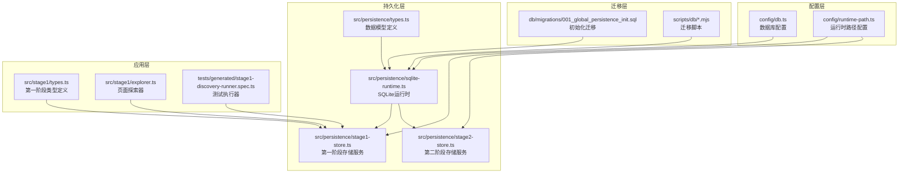
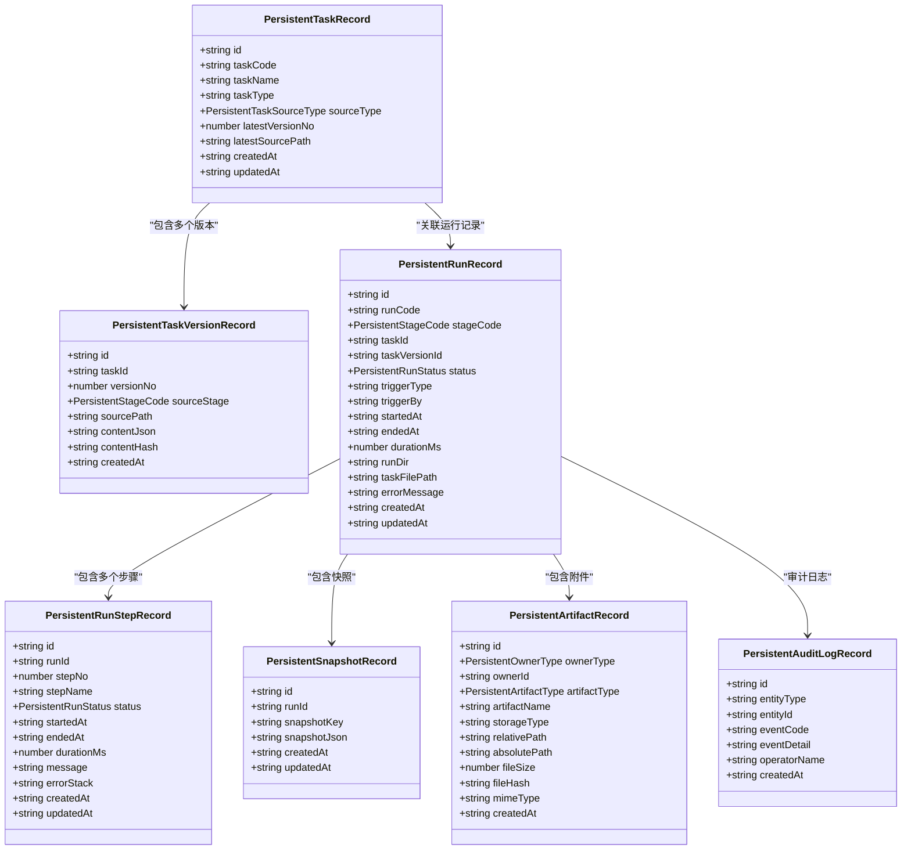
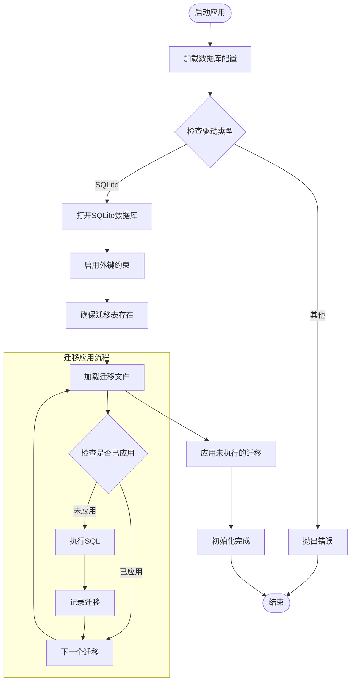
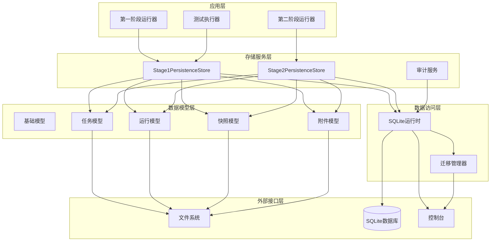
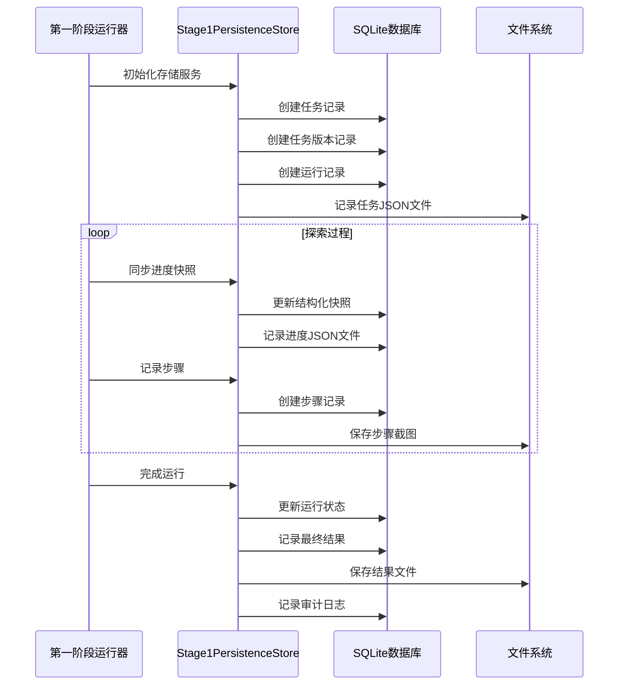
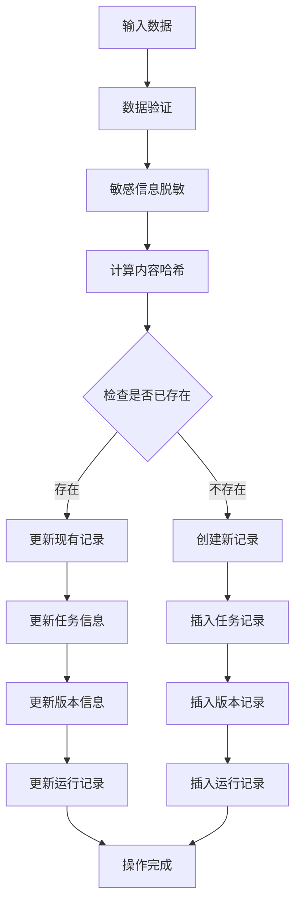
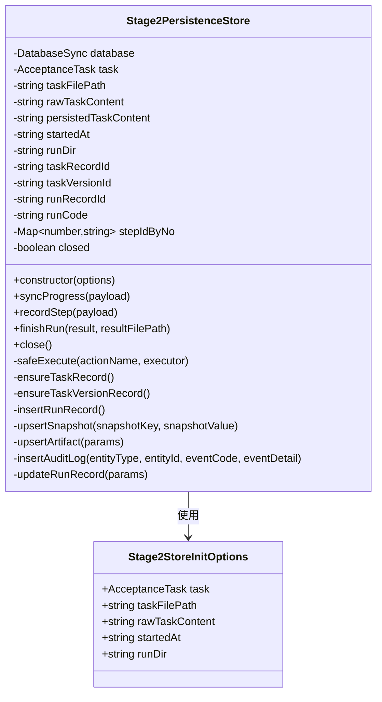
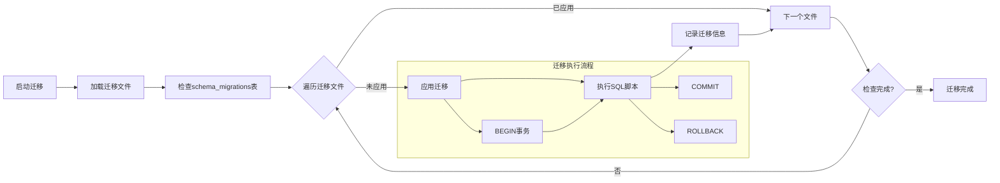
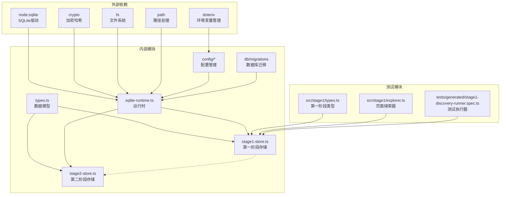

# 第一阶段持久化存储层

<cite>
**本文档引用的文件**
- [README.md](file://README.md)
- [package.json](file://package.json)
- [src/persistence/types.ts](file://src/persistence/types.ts)
- [src/persistence/sqlite-runtime.ts](file://src/persistence/sqlite-runtime.ts)
- [src/persistence/stage1-store.ts](file://src/persistence/stage1-store.ts)
- [src/persistence/stage2-store.ts](file://src/persistence/stage2-store.ts)
- [config/db.ts](file://config/db.ts)
- [config/runtime-path.ts](file://config/runtime-path.ts)
- [db/migrations/001_global_persistence_init.sql](file://db/migrations/001_global_persistence_init.sql)
- [scripts/db/common.mjs](file://scripts/db/common.mjs)
- [scripts/db/migrate.mjs](file://scripts/db/migrate.mjs)
- [src/stage1/types.ts](file://src/stage1/types.ts)
- [src/stage1/explorer.ts](file://src/stage1/explorer.ts)
- [tests/generated/stage1-discovery-runner.spec.ts](file://tests/generated/stage1-discovery-runner.spec.ts)
</cite>

## 目录
1. [简介](#简介)
2. [项目结构](#项目结构)
3. [核心组件](#核心组件)
4. [架构概览](#架构概览)
5. [详细组件分析](#详细组件分析)
6. [依赖关系分析](#依赖关系分析)
7. [性能考虑](#性能考虑)
8. [故障排除指南](#故障排除指南)
9. [结论](#结论)

## 简介

第一阶段持久化存储层是基于 Playwright 和 Midscene.js 的 AI 自动化测试项目的核心基础设施。该项目实现了完整的数据持久化解决方案，采用 SQLite 作为本地存储引擎，同时保持与 MySQL 的兼容性设计。

该存储层为整个自动化测试框架提供了统一的数据持久化能力，支持第一阶段（探索建模）和第二阶段（任务执行）的完整生命周期管理。通过标准化的数据模型和完善的迁移机制，确保了数据的一致性和可扩展性。

## 项目结构

项目采用模块化的组织结构，主要分为以下几个核心部分：

**图表来源**
- [src/persistence/types.ts:1-125](file://src/persistence/types.ts#L1-L125)
- [src/persistence/sqlite-runtime.ts:1-116](file://src/persistence/sqlite-runtime.ts#L1-L116)
- [src/persistence/stage1-store.ts:1-729](file://src/persistence/stage1-store.ts#L1-L729)
- [src/persistence/stage2-store.ts:1-655](file://src/persistence/stage2-store.ts#L1-L655)

**章节来源**
- [README.md:1-307](file://README.md#L1-L307)
- [package.json:1-30](file://package.json#L1-L30)

## 核心组件

### 数据模型体系

持久化存储层采用了统一的数据模型定义，确保第一阶段和第二阶段的数据一致性：

**图表来源**
- [src/persistence/types.ts:34-123](file://src/persistence/types.ts#L34-L123)

### SQLite 运行时管理

SQLite 运行时提供了完整的数据库连接管理和迁移支持：

**图表来源**
- [src/persistence/sqlite-runtime.ts:73-114](file://src/persistence/sqlite-runtime.ts#L73-L114)
- [scripts/db/common.mjs:47-58](file://scripts/db/common.mjs#L47-L58)

**章节来源**
- [src/persistence/types.ts:1-125](file://src/persistence/types.ts#L1-L125)
- [src/persistence/sqlite-runtime.ts:1-116](file://src/persistence/sqlite-runtime.ts#L1-L116)
- [config/db.ts:1-28](file://config/db.ts#L1-L28)

## 架构概览

第一阶段持久化存储层采用分层架构设计，确保了良好的关注点分离和可维护性：

**图表来源**
- [src/persistence/stage1-store.ts:86-135](file://src/persistence/stage1-store.ts#L86-L135)
- [src/persistence/stage2-store.ts:74-123](file://src/persistence/stage2-store.ts#L74-L123)

## 详细组件分析

### Stage1PersistenceStore 组件

Stage1PersistenceStore 是第一阶段的核心存储服务，负责管理探索建模过程中的所有数据持久化操作：

**图表来源**
- [src/persistence/stage1-store.ts:113-135](file://src/persistence/stage1-store.ts#L113-L135)
- [src/persistence/stage1-store.ts:482-504](file://src/persistence/stage1-store.ts#L482-L504)
- [src/persistence/stage1-store.ts:506-601](file://src/persistence/stage1-store.ts#L506-L601)
- [src/persistence/stage1-store.ts:603-704](file://src/persistence/stage1-store.ts#L603-L704)

#### 核心功能特性

1. **任务生命周期管理**：完整跟踪从任务创建到执行完成的全过程
2. **版本控制**：基于内容哈希的任务版本管理，支持回溯和比较
3. **进度监控**：实时记录探索过程中的结构化快照和进度状态
4. **文件附件管理**：统一管理截图、报告、结果文件等二进制附件
5. **审计追踪**：完整的操作日志记录，便于问题排查和合规审计

#### 数据完整性保障

**图表来源**
- [src/persistence/stage1-store.ts:49-60](file://src/persistence/stage1-store.ts#L49-L60)
- [src/persistence/stage1-store.ts:199-273](file://src/persistence/stage1-store.ts#L199-L273)

**章节来源**
- [src/persistence/stage1-store.ts:1-729](file://src/persistence/stage1-store.ts#L1-L729)

### Stage2PersistenceStore 组件

Stage2PersistenceStore 为第二阶段提供相似的存储服务，但针对任务执行场景进行了优化：

**图表来源**
- [src/persistence/stage2-store.ts:74-123](file://src/persistence/stage2-store.ts#L74-L123)

#### 主要差异特性

1. **任务内容脱敏**：对任务中的敏感信息进行掩码处理
2. **进度快照优化**：专门针对任务执行的进度数据结构
3. **执行结果管理**：完整的执行结果记录和状态跟踪
4. **资源清理**：提供安全的资源释放机制

**章节来源**
- [src/persistence/stage2-store.ts:1-655](file://src/persistence/stage2-store.ts#L1-L655)

### 数据库迁移系统

迁移系统确保数据库结构的演进和版本控制：

**图表来源**
- [scripts/db/migrate.mjs:15-51](file://scripts/db/migrate.mjs#L15-L51)
- [scripts/db/common.mjs:88-106](file://scripts/db/common.mjs#L88-L106)

**章节来源**
- [db/migrations/001_global_persistence_init.sql:1-128](file://db/migrations/001_global_persistence_init.sql#L1-L128)
- [scripts/db/migrate.mjs:1-52](file://scripts/db/migrate.mjs#L1-L52)
- [scripts/db/common.mjs:1-108](file://scripts/db/common.mjs#L1-L108)

## 依赖关系分析

持久化存储层的依赖关系体现了清晰的分层架构：

**图表来源**
- [src/persistence/stage1-store.ts:1-17](file://src/persistence/stage1-store.ts#L1-L17)
- [src/persistence/stage2-store.ts:1-13](file://src/persistence/stage2-store.ts#L1-L13)
- [config/db.ts:1-5](file://config/db.ts#L1-L5)

### 关键依赖特性

1. **模块化设计**：每个组件都有明确的职责边界
2. **配置驱动**：通过环境变量和配置文件控制行为
3. **异步处理**：充分利用 Node.js 的异步特性
4. **错误隔离**：每个操作都有独立的错误处理机制

**章节来源**
- [src/persistence/stage1-store.ts:1-17](file://src/persistence/stage1-store.ts#L1-L17)
- [src/persistence/stage2-store.ts:1-13](file://src/persistence/stage2-store.ts#L1-L13)
- [config/db.ts:1-28](file://config/db.ts#L1-L28)

## 性能考虑

持久化存储层在设计时充分考虑了性能优化：

### 数据库性能优化

1. **索引策略**：为常用查询字段建立索引，包括任务名称、运行状态、时间戳等
2. **批量操作**：在可能的情况下使用批量插入和更新操作
3. **连接池管理**：合理管理数据库连接，避免连接泄漏
4. **事务优化**：将相关的数据库操作包装在事务中，确保原子性

### 内存管理

1. **对象池**：对于频繁创建的对象，考虑使用对象池技术
2. **流式处理**：对于大文件处理，采用流式读取而非一次性加载
3. **垃圾回收**：及时清理不再使用的对象引用

### 缓存策略

1. **查询结果缓存**：对频繁查询的结果进行缓存
2. **文件元数据缓存**：缓存文件的元数据信息，避免重复查询
3. **连接状态缓存**：缓存数据库连接状态，减少连接开销

## 故障排除指南

### 常见问题及解决方案

#### 数据库连接问题

**问题症状**：初始化存储服务时抛出数据库连接错误

**可能原因**：
1. SQLite 驱动未正确安装
2. 数据库文件权限不足
3. 数据库文件路径不存在

**解决步骤**：
1. 确认已安装 `node:sqlite` 驱动
2. 检查数据库文件路径的可写权限
3. 确保数据库目录存在且可访问

#### 迁移失败问题

**问题症状**：数据库迁移执行失败

**可能原因**：
1. SQL 语法错误
2. 外键约束冲突
3. 迁移文件损坏

**解决步骤**：
1. 检查迁移文件的 SQL 语法
2. 查看具体的错误信息定位问题
3. 手动执行迁移脚本进行调试

#### 数据完整性问题

**问题症状**：发现数据不一致或丢失

**可能原因**：
1. 异常中断导致的事务未提交
2. 并发访问导致的数据竞争
3. 文件系统异常

**解决步骤**：
1. 检查数据库事务日志
2. 实施适当的并发控制机制
3. 增加重试和补偿逻辑

**章节来源**
- [src/persistence/stage1-store.ts:137-145](file://src/persistence/stage1-store.ts#L137-L145)
- [src/persistence/stage2-store.ts:125-133](file://src/persistence/stage2-store.ts#L125-L133)

## 结论

第一阶段持久化存储层为整个 AI 自动化测试项目提供了坚实的数据基础设施。通过采用标准化的数据模型、完善的迁移机制和健壮的错误处理，确保了系统的可靠性、可维护性和可扩展性。

该存储层的主要优势包括：

1. **统一的数据模型**：为不同阶段提供一致的数据抽象
2. **完整的生命周期管理**：从创建到销毁的全生命周期跟踪
3. **灵活的扩展性**：支持未来迁移到其他数据库系统
4. **强大的审计能力**：完整的操作日志和状态跟踪
5. **高效的性能表现**：经过优化的数据库设计和访问模式

随着项目的进一步发展，这个持久化存储层将继续发挥关键作用，为 AI 自动化测试的规模化应用提供可靠的数据支撑。