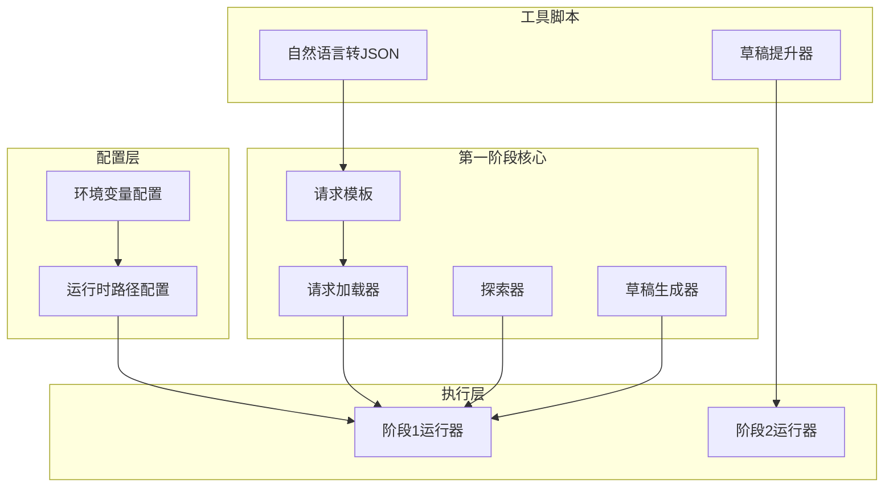
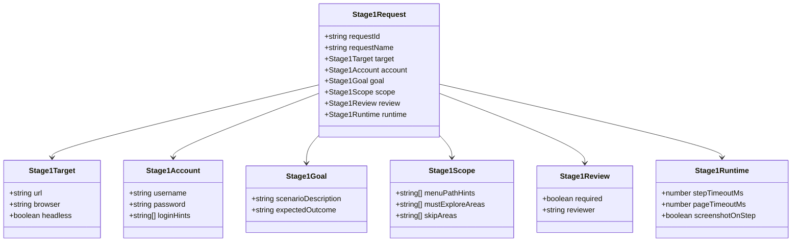
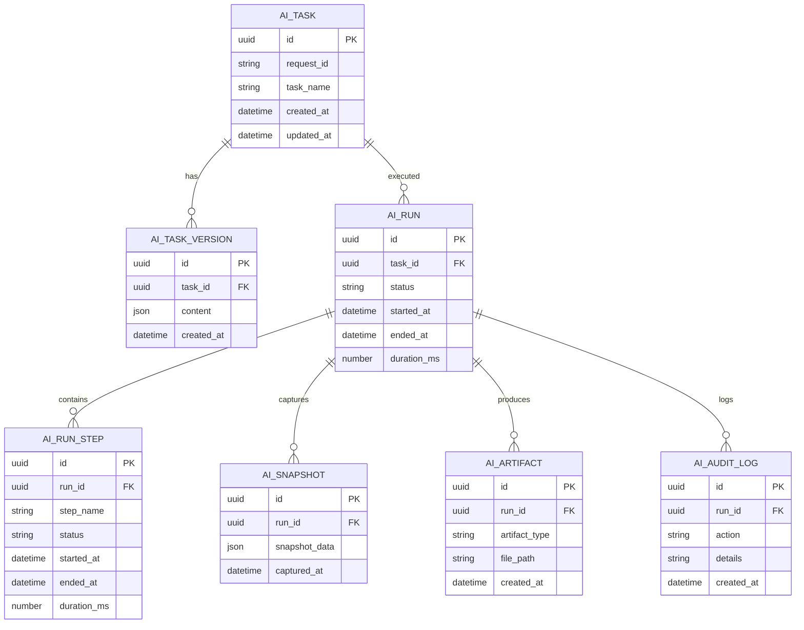
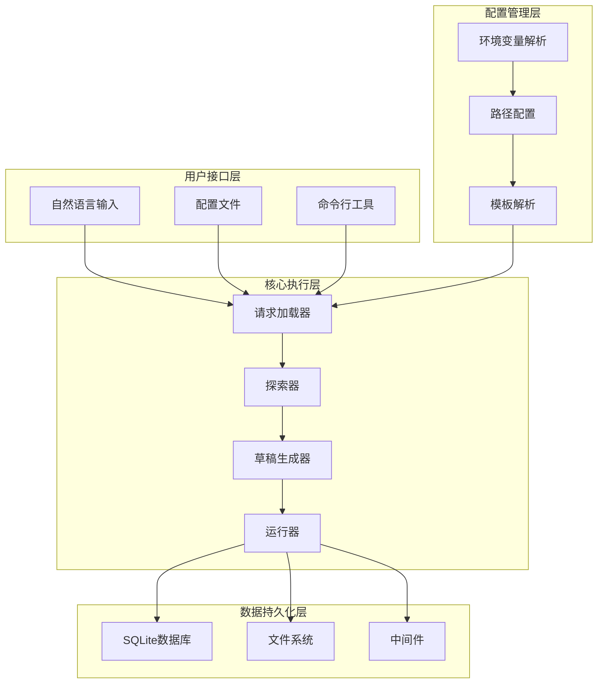
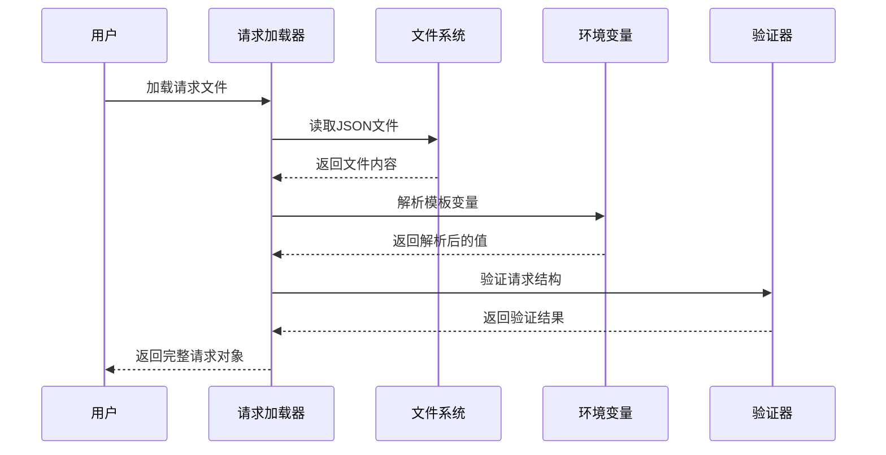
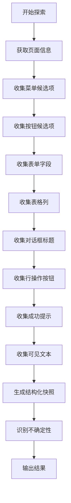
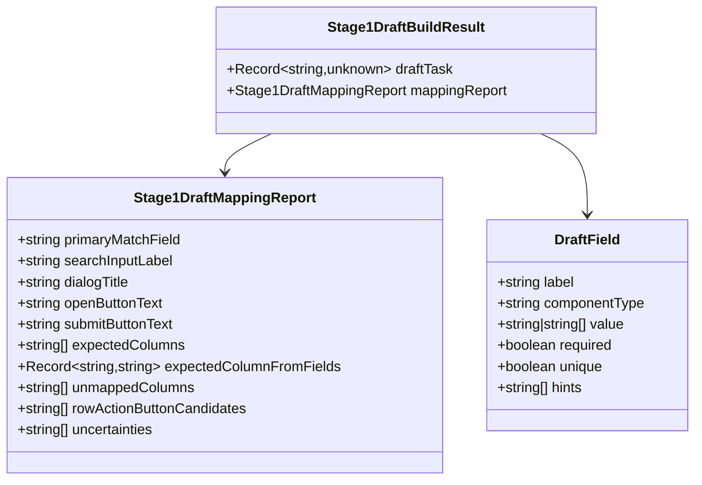
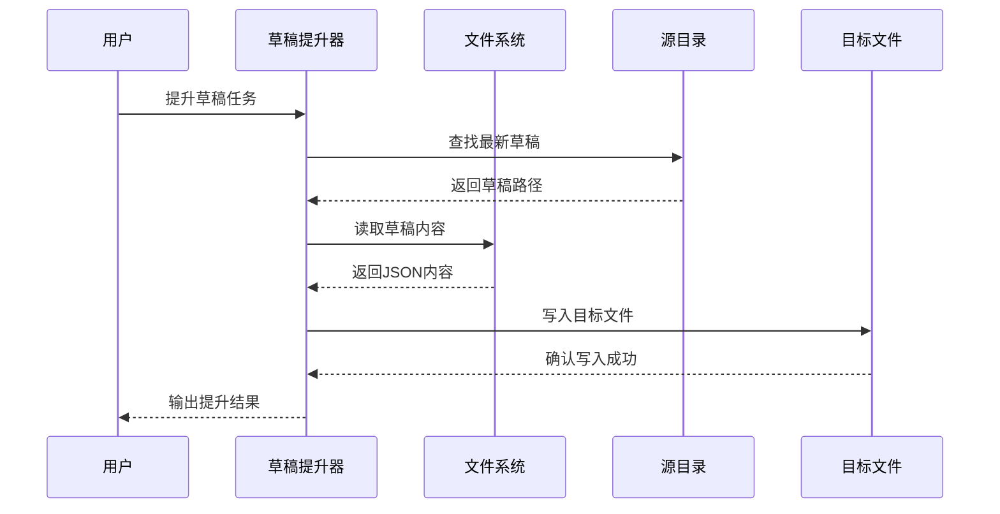
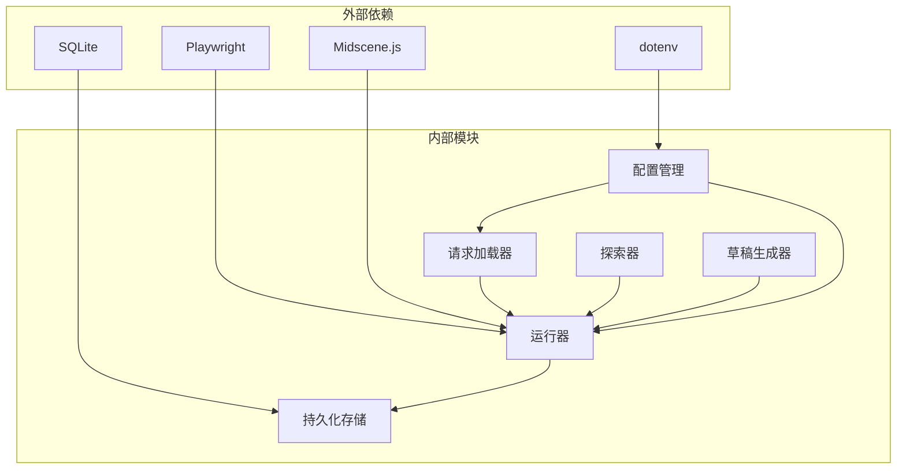

# 第一阶段请求模板

<cite>
**本文档引用的文件**
- [README.md](file://README.md)
- [stage1-request.template.json](file://specs/stage1/stage1-request.template.json)
- [stage1-request.community-create.example.json](file://specs/stage1/stage1-request.community-create.example.json)
- [types.ts](file://src/stage1/types.ts)
- [request-loader.ts](file://src/stage1/request-loader.ts)
- [generate-request.mjs](file://scripts/stage1/generate-request.mjs)
- [stage1-runner.ts](file://src/stage1/stage1-runner.ts)
- [explorer.ts](file://src/stage1/explorer.ts)
- [task-draft-generator.ts](file://src/stage1/task-draft-generator.ts)
- [promote-draft.mjs](file://scripts/stage1/promote-draft.mjs)
- [runtime-path.ts](file://config/runtime-path.ts)
- [package.json](file://package.json)
- [playwright.config.ts](file://playwright.config.ts)
</cite>

## 目录
1. [简介](#简介)
2. [项目结构](#项目结构)
3. [核心组件](#核心组件)
4. [架构概览](#架构概览)
5. [详细组件分析](#详细组件分析)
6. [依赖关系分析](#依赖关系分析)
7. [性能考虑](#性能考虑)
8. [故障排除指南](#故障排除指南)
9. [结论](#结论)

## 简介

第一阶段请求模板是 Playwright-Mind 项目中用于探索建模的核心配置文件，它定义了如何自动化的测试场景和期望的输出结果。该模板为 AI 驱动的自动化测试提供了标准化的输入格式，使得系统能够从自然语言描述自动生成结构化的测试请求，并最终产出第二阶段的任务草稿。

该项目基于 Playwright 和 Midscene.js 构建，实现了从自然语言到自动化测试的完整转换流程。第一阶段主要负责探索建模，通过结构化的方式识别页面元素、提取字段映射，并生成可人工复核的任务草稿。

## 项目结构

项目采用模块化架构，主要分为以下几个核心部分：

**图表来源**
- [runtime-path.ts:1-46](file://config/runtime-path.ts#L1-L46)
- [stage1-runner.ts:1-376](file://src/stage1/stage1-runner.ts#L1-L376)
- [generate-request.mjs:1-280](file://scripts/stage1/generate-request.mjs#L1-L280)

**章节来源**
- [README.md:1-307](file://README.md#L1-L307)
- [package.json:1-30](file://package.json#L1-L30)

## 核心组件

### 请求模板系统

第一阶段请求模板定义了完整的测试场景配置，包括目标网站、用户凭据、探索范围和运行时参数。

**图表来源**
- [types.ts:39-48](file://src/stage1/types.ts#L39-L48)
- [types.ts:5-9](file://src/stage1/types.ts#L5-L9)

### 数据持久化结构

系统实现了完整的数据持久化机制，支持将运行结果存储到 SQLite 数据库中：

**图表来源**
- [README.md:102-124](file://README.md#L102-L124)

**章节来源**
- [types.ts:1-109](file://src/stage1/types.ts#L1-L109)
- [README.md:102-124](file://README.md#L102-L124)

## 架构概览

第一阶段的整体架构采用分层设计，从上到下分别为：用户接口层、配置管理层、核心执行层和数据持久化层。

**图表来源**
- [stage1-runner.ts:115-376](file://src/stage1/stage1-runner.ts#L115-L376)
- [request-loader.ts:79-89](file://src/stage1/request-loader.ts#L79-L89)

## 详细组件分析

### 请求加载器组件

请求加载器负责解析和验证第一阶段请求文件，确保所有必需字段都已正确配置。

**图表来源**
- [request-loader.ts:79-89](file://src/stage1/request-loader.ts#L79-L89)
- [request-loader.ts:50-69](file://src/stage1/request-loader.ts#L50-L69)

#### 模板解析机制

请求加载器实现了强大的模板解析功能，支持多种变量类型：

| 变量类型 | 示例 | 描述 |
|---------|------|------|
| 环境变量 | `${TEST_USERNAME}` | 从环境变量读取值 |
| 时间戳 | `${NOW_YYYYMMDDHHMMSS}` | 动态生成当前时间戳 |
| 固定值 | `${STAGE1_REQUEST_FILE}` | 预定义的固定值 |

**章节来源**
- [request-loader.ts:1-89](file://src/stage1/request-loader.ts#L1-L89)

### 探索器组件

探索器负责从页面中提取结构化数据，识别各种 UI 元素和候选字段。

**图表来源**
- [explorer.ts:37-310](file://src/stage1/explorer.ts#L37-L310)

#### 字段识别算法

探索器使用智能算法识别表单字段，支持多种字段类型：

| 字段类型 | 识别特征 | 组件类型 |
|---------|---------|---------|
| 输入框 | label/placeholder/aria-label | input |
| 文本域 | 多行文本输入 | textarea |
| 级联选择器 | 省市区/区域选择 | cascader |
| 地址输入 | 地址/描述/备注 | textarea |

**章节来源**
- [explorer.ts:1-310](file://src/stage1/explorer.ts#L1-L310)

### 草稿生成器组件

草稿生成器基于探索结果生成第二阶段的任务草稿，包含完整的测试步骤和断言策略。

**图表来源**
- [task-draft-generator.ts:25-348](file://src/stage1/task-draft-generator.ts#L25-L348)

#### 断言策略生成

草稿生成器自动为每个场景生成断言策略：

| 断言类型 | 生成条件 | 配置示例 |
|---------|---------|---------|
| 表格行存在 | 存在成功文本 | `{ type: 'table-row-exists', matchMode: 'exact' }` |
| 表格单元格相等 | 有可映射的列 | `{ type: 'table-cell-equals', soft: true }` |
| 表格单元格包含 | 地址/地区字段 | `{ type: 'table-cell-contains', soft: true }` |
| Toast提示 | 成功提示文本 | `{ type: 'toast', timeoutMs: 10000 }` |

**章节来源**
- [task-draft-generator.ts:1-348](file://src/stage1/task-draft-generator.ts#L1-L348)

### 自然语言转JSON脚本

该脚本允许用户通过自然语言描述快速生成第一阶段请求文件。

**图表来源**
- [generate-request.mjs:190-239](file://scripts/stage1/generate-request.mjs#L190-L239)

#### 文本解析规则

脚本支持多种输入格式和解析规则：

| 输入格式 | 解析规则 | 示例 |
|---------|---------|------|
| 直接文本 | 使用 --text 参数 | `--text "url：https://example.com/ 账号/密码：user/pass 测试要求：..."` |
| 文件输入 | 支持 .txt/.html | `--file specs/brief.txt` |
| 环境变量 | 使用 STAGE1_BRIEF_TEXT | 在 .env 中设置 |

**章节来源**
- [generate-request.mjs:1-280](file://scripts/stage1/generate-request.mjs#L1-L280)

### 草稿提升器

草稿提升器负责将第一阶段生成的草稿任务提升为第二阶段可执行的任务文件。

**图表来源**
- [promote-draft.mjs:147-174](file://scripts/stage1/promote-draft.mjs#L147-L174)

**章节来源**
- [promote-draft.mjs:1-184](file://scripts/stage1/promote-draft.mjs#L1-L184)

## 依赖关系分析

项目各组件之间的依赖关系清晰明确，遵循单一职责原则：

**图表来源**
- [package.json:19-29](file://package.json#L19-L29)
- [stage1-runner.ts:1-376](file://src/stage1/stage1-runner.ts#L1-L376)

**章节来源**
- [package.json:1-30](file://package.json#L1-L30)
- [playwright.config.ts:1-95](file://playwright.config.ts#L1-L95)

## 性能考虑

### 内存管理

系统采用了高效的内存管理模式，避免不必要的内存占用：

- **延迟加载**：只有在需要时才加载大型数据结构
- **增量写入**：进度文件采用增量更新方式，减少磁盘IO
- **资源清理**：及时释放页面对象和临时文件句柄

### 并发处理

项目支持并行测试执行，提高整体效率：

- **并行测试**：默认启用完全并行测试
- **重试机制**：CI环境下自动重试失败的测试
- **分布式执行**：支持多worker并行执行

### 缓存策略

系统实现了多层次的缓存机制：

- **模板缓存**：解析后的模板结果缓存
- **页面缓存**：常用页面元素的缓存
- **结果缓存**：重复计算的结果缓存

## 故障排除指南

### 常见问题及解决方案

| 问题类型 | 症状 | 解决方案 |
|---------|------|---------|
| 请求文件缺失 | 报错"请求文件不存在" | 检查 STAGE1_REQUEST_FILE 环境变量 |
| 模板变量解析失败 | 变量未正确替换 | 检查环境变量是否设置 |
| 页面元素识别失败 | 探索结果为空 | 检查页面加载状态和网络连接 |
| 草稿生成失败 | 生成草稿任务失败 | 检查探索结果和字段映射 |

### 调试技巧

1. **启用详细日志**：使用 `--headed` 模式运行以查看详细执行过程
2. **检查截图**：查看 `t_runtime/stage1-results/` 目录下的截图文件
3. **分析进度文件**：检查 `stage1-result.partial.json` 了解执行进度
4. **验证模板**：使用在线JSON验证工具检查请求文件格式

### 性能优化建议

- **合理设置超时时间**：根据页面复杂度调整 `stepTimeoutMs` 和 `pageTimeoutMs`
- **优化探索范围**：合理设置 `mustExploreAreas` 减少不必要的探索
- **启用缓存**：利用系统内置的缓存机制提高执行效率

**章节来源**
- [stage1-runner.ts:191-238](file://src/stage1/stage1-runner.ts#L191-L238)
- [README.md:160-208](file://README.md#L160-L208)

## 结论

第一阶段请求模板系统为 AI 驱动的自动化测试提供了完整的基础设施。通过标准化的请求格式、智能的探索算法和完善的草稿生成机制，系统能够高效地从自然语言描述转换为可执行的测试任务。

该系统的主要优势包括：

1. **高度可配置性**：支持丰富的配置选项和环境变量
2. **智能探索能力**：能够自动识别页面元素和字段映射
3. **完整的生命周期管理**：从请求生成到结果输出的全流程支持
4. **强大的扩展性**：模块化设计便于功能扩展和定制

未来的发展方向包括：

- 增强 AI 辅助功能，提高探索准确性
- 扩展支持更多 UI 框架和组件库
- 优化性能表现，支持更大规模的测试场景
- 增强可视化调试工具，提升用户体验