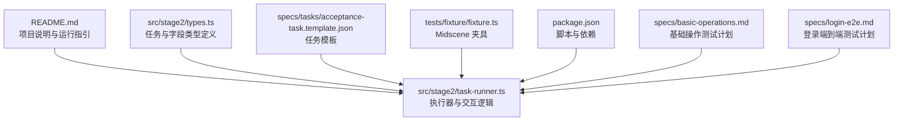
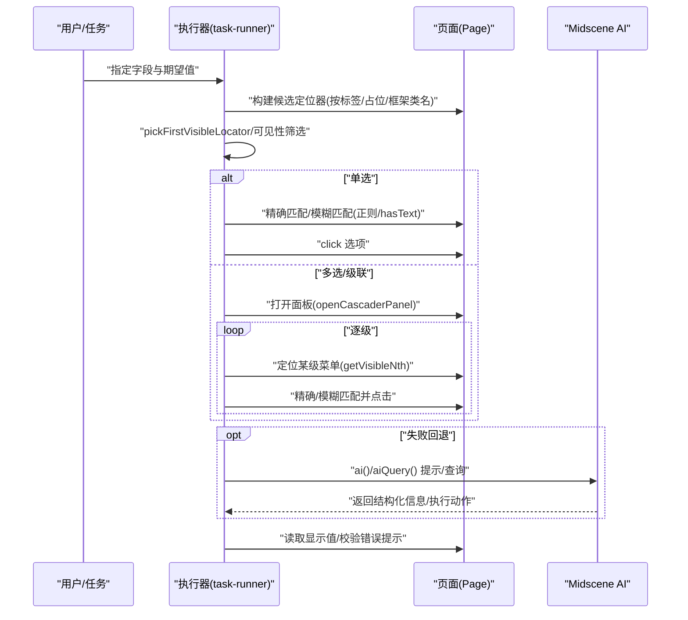
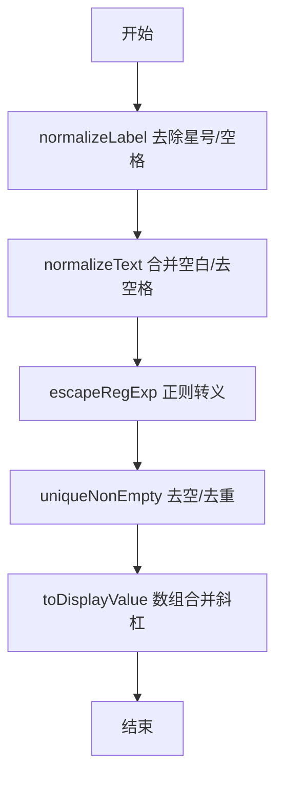
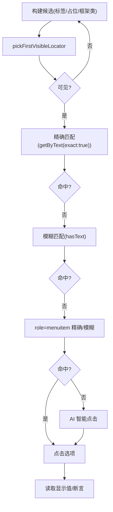
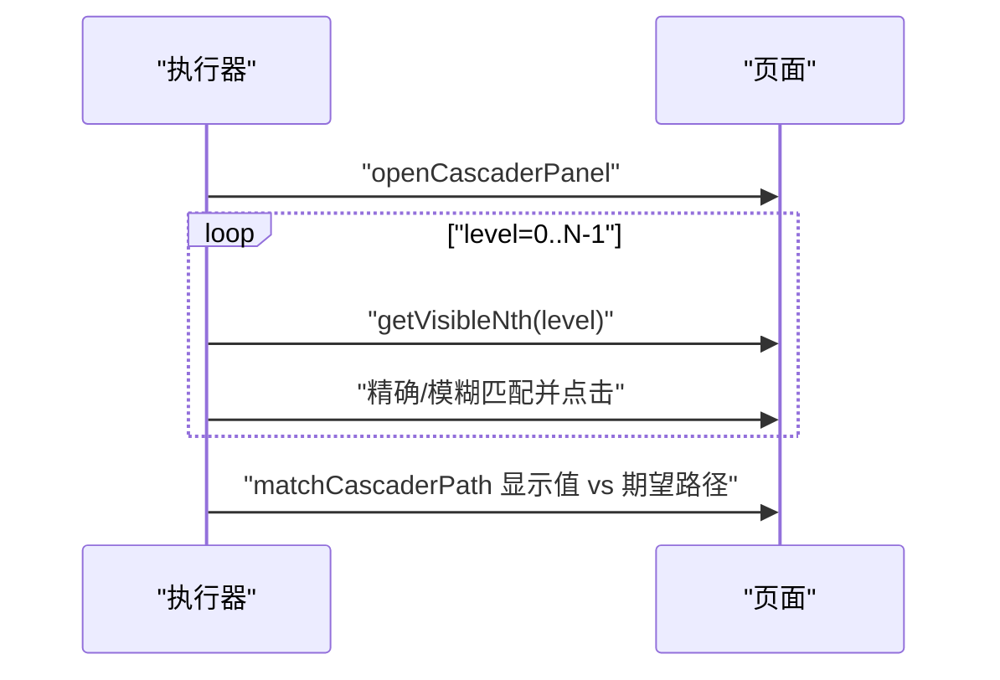
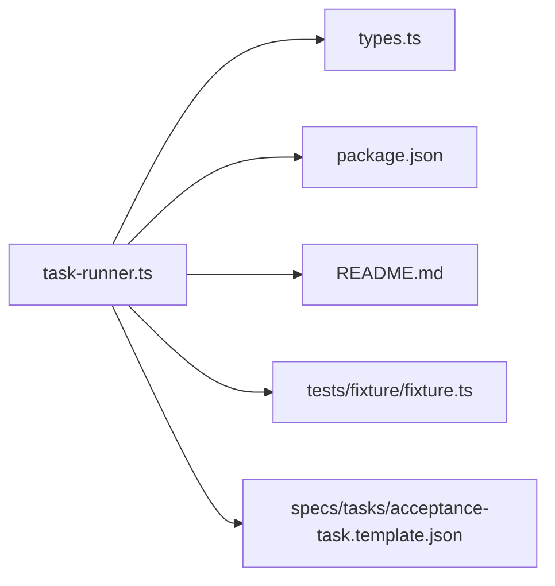

# 下拉选择器

<cite>
**本文引用的文件**
- [README.md](file://README.md)
- [package.json](file://package.json)
- [src/stage2/task-runner.ts](file://src/stage2/task-runner.ts)
- [src/stage2/types.ts](file://src/stage2/types.ts)
- [specs/tasks/acceptance-task.template.json](file://specs/tasks/acceptance-task.template.json)
- [specs/basic-operations.md](file://specs/basic-operations.md)
- [specs/login-e2e.md](file://specs/login-e2e.md)
- [tests/fixture/fixture.ts](file://tests/fixture/fixture.ts)
</cite>

## 目录
1. [简介](#简介)
2. [项目结构](#项目结构)
3. [核心组件](#核心组件)
4. [架构总览](#架构总览)
5. [详细组件分析](#详细组件分析)
6. [依赖关系分析](#依赖关系分析)
7. [性能考量](#性能考量)
8. [故障排除指南](#故障排除指南)
9. [结论](#结论)
10. [附录](#附录)

## 简介
本文件聚焦“下拉选择器”的处理机制，覆盖单选与多选场景、选项查找与选择算法（精确匹配、模糊匹配、可见性判断）、UI 框架（Element Plus、Ant Design、View UI）适配策略、选项值标准化（空格处理、特殊字符转义、多选值合并）、以及通过 Midscene AI 的智能辅助选择。文档同时提供实际使用示例与故障排除建议，帮助读者在复杂动态页面中稳定地定位与交互下拉组件。

## 项目结构
该项目基于 Playwright 与 Midscene.js 构建，提供第二段任务驱动的自动化执行器与夹具，支持通过 JSON 任务驱动 UI 交互，内置滑块验证码自动处理能力。与下拉选择器直接相关的模块集中在 stage2 执行器与类型定义中。

图示来源
- [README.md](file://README.md#L1-L144)
- [src/stage2/task-runner.ts](file://src/stage2/task-runner.ts#L1-L200)
- [src/stage2/types.ts](file://src/stage2/types.ts#L1-L125)
- [specs/tasks/acceptance-task.template.json](file://specs/tasks/acceptance-task.template.json#L1-L85)
- [tests/fixture/fixture.ts](file://tests/fixture/fixture.ts#L1-L21)
- [package.json](file://package.json#L1-L24)
- [specs/basic-operations.md](file://specs/basic-operations.md#L1-L34)
- [specs/login-e2e.md](file://specs/login-e2e.md#L1-L152)

章节来源
- [README.md](file://README.md#L1-L144)
- [package.json](file://package.json#L1-L24)

## 核心组件
- 执行器与交互逻辑：位于 stage2 执行器，负责构建候选定位器、可见性筛选、精确/模糊匹配、点击与回填、AI 辅助兜底等。
- 类型定义：定义了任务、字段、表单、运行时等结构，支撑下拉字段的单选/多选值处理与 UI 适配。
- Midscene 夹具：提供 ai/aiQuery/aiAssert 等能力，作为最后兜底手段与结构化信息提取的桥梁。

章节来源
- [src/stage2/task-runner.ts](file://src/stage2/task-runner.ts#L1-L200)
- [src/stage2/types.ts](file://src/stage2/types.ts#L23-L40)
- [tests/fixture/fixture.ts](file://tests/fixture/fixture.ts#L1-L21)

## 架构总览
下拉选择器处理的整体流程围绕“候选定位 → 可见性判断 → 选项匹配 → 选择动作 → 结果校验”展开。对于级联选择器，还包含面板打开、层级定位与路径匹配。

图示来源
- [src/stage2/task-runner.ts](file://src/stage2/task-runner.ts#L162-L200)
- [src/stage2/task-runner.ts](file://src/stage2/task-runner.ts#L705-L721)
- [src/stage2/task-runner.ts](file://src/stage2/task-runner.ts#L723-L785)
- [src/stage2/task-runner.ts](file://src/stage2/task-runner.ts#L335-L364)

## 详细组件分析

### 通用工具与标准化
- 文本标准化
  - 去除星号与多余空格：用于标签匹配。
  - 合并连续空白并去首尾空格：用于比较与提示词。
- 正则转义
  - 对用户输入进行正则转义，避免特殊字符破坏选择器。
- 候选去重
  - 去除空值与重复项，提升匹配效率。
- 多选值合并
  - 多选数组以斜杠连接为显示字符串，便于断言与记录。

图示来源
- [src/stage2/task-runner.ts](file://src/stage2/task-runner.ts#L140-L149)
- [src/stage2/task-runner.ts](file://src/stage2/task-runner.ts#L86-L91)

章节来源
- [src/stage2/task-runner.ts](file://src/stage2/task-runner.ts#L136-L153)
- [src/stage2/task-runner.ts](file://src/stage2/task-runner.ts#L86-L91)

### 单选下拉框处理
- 候选定位
  - 依据字段标签构建正则名称定位器。
  - 在对话框上下文中，针对 Element Plus、Ant Design、View UI 的输入类选择器进行补充。
- 可见性判断
  - 通过 pickFirstVisibleLocator 遍历候选并检查可见性，优先命中第一个可见元素。
- 选项查找与选择
  - 支持精确文本匹配与模糊匹配（hasText）。
  - 对菜单项使用 role="menuitem" 或框架节点类名进行定位。
  - 若均失败，调用 AI 进行智能点击。
- 回填与读取
  - 通过 inputValue/getAttribute 获取显示值，用于断言与记录。

图示来源
- [src/stage2/task-runner.ts](file://src/stage2/task-runner.ts#L204-L225)
- [src/stage2/task-runner.ts](file://src/stage2/task-runner.ts#L162-L200)
- [src/stage2/task-runner.ts](file://src/stage2/task-runner.ts#L787-L797)

章节来源
- [src/stage2/task-runner.ts](file://src/stage2/task-runner.ts#L204-L225)
- [src/stage2/task-runner.ts](file://src/stage2/task-runner.ts#L256-L274)
- [src/stage2/task-runner.ts](file://src/stage2/task-runner.ts#L787-L797)

### 多选/级联下拉处理
- 面板打开
  - 通过候选定位器点击打开面板，若失败则使用 AI 提示。
- 层级定位
  - 使用 getVisibleNth 获取第 N 个可见菜单容器。
- 选项选择
  - 逐级进行精确/模糊匹配并点击。
- 路径匹配与断言
  - 使用 matchCascaderPath 将显示值与期望路径进行包含匹配（支持去除分隔符的变体）。

图示来源
- [src/stage2/task-runner.ts](file://src/stage2/task-runner.ts#L705-L721)
- [src/stage2/task-runner.ts](file://src/stage2/task-runner.ts#L182-L200)
- [src/stage2/task-runner.ts](file://src/stage2/task-runner.ts#L723-L785)
- [src/stage2/task-runner.ts](file://src/stage2/task-runner.ts#L323-L333)

章节来源
- [src/stage2/task-runner.ts](file://src/stage2/task-runner.ts#L705-L721)
- [src/stage2/task-runner.ts](file://src/stage2/task-runner.ts#L723-L785)
- [src/stage2/task-runner.ts](file://src/stage2/task-runner.ts#L323-L333)

### UI 框架适配策略
- Element Plus
  - 输入类选择器：el-cascader-input、el-cascader-menu 等。
  - 表单错误提示：el-form-item__error。
- Ant Design
  - 输入类选择器：ant-cascader-input、ant-cascader-menu 等。
  - 表单错误提示：ant-form-item-explain-error。
- View UI
  - 输入类选择器：ivu-cascader-input、ivu-cascader-menu 等。
  - 表单错误提示：ivu-form-item-error-tip。
- 通用策略
  - 优先使用 role="dialog"/"menu" 等语义化属性定位容器与菜单。
  - 在对话框上下文中限定候选范围，减少误触。

章节来源
- [src/stage2/task-runner.ts](file://src/stage2/task-runner.ts#L213-L224)
- [src/stage2/task-runner.ts](file://src/stage2/task-runner.ts#L340-L344)
- [src/stage2/task-runner.ts](file://src/stage2/task-runner.ts#L728-L735)

### 选项值标准化与合并
- 空格处理
  - normalizeLabel 与 normalizeText 统一去除干扰字符与空白。
- 特殊字符转义
  - escapeRegExp 保证正则表达式安全。
- 多选值合并
  - toDisplayValue 将数组以斜杠连接，便于断言与记录。

章节来源
- [src/stage2/task-runner.ts](file://src/stage2/task-runner.ts#L140-L149)
- [src/stage2/task-runner.ts](file://src/stage2/task-runner.ts#L136-L138)
- [src/stage2/task-runner.ts](file://src/stage2/task-runner.ts#L86-L91)

### AI 辅助机制
- ai()/aiQuery() 能力
  - 在无法通过选择器定位或点击时，使用 AI 进行智能定位与交互。
  - 通过 aiQuery 提取结构化信息（如滑块位置、宽度），用于后续自动化操作。
- 使用建议
  - 将长流程拆分为多个短步骤，降低 AI 幻觉风险。
  - 关键断言优先使用结构化查询与 Playwright 硬断言。

章节来源
- [README.md](file://README.md#L100-L116)
- [tests/fixture/fixture.ts](file://tests/fixture/fixture.ts#L16-L21)
- [.tasks/AI自主代理验收系统开发改造方案_2026-03-11.md](file://.tasks/AI自主代理验收系统开发改造方案_2026-03-11.md#L60-L84)

## 依赖关系分析
- 执行器依赖
  - Playwright Page/Locator API：用于定位与交互。
  - Midscene AI 能力：ai/aiQuery/aiAssert，作为兜底与结构化信息提取。
  - 类型定义：AcceptanceTask/TaskField 等，约束字段值与组件类型。
- 任务驱动
  - 通过 JSON 任务模板提供字段值与期望行为，执行器据此进行 UI 交互。

图示来源
- [src/stage2/task-runner.ts](file://src/stage2/task-runner.ts#L1-L200)
- [src/stage2/types.ts](file://src/stage2/types.ts#L1-L125)
- [package.json](file://package.json#L1-L24)
- [README.md](file://README.md#L1-L144)
- [tests/fixture/fixture.ts](file://tests/fixture/fixture.ts#L1-L21)
- [specs/tasks/acceptance-task.template.json](file://specs/tasks/acceptance-task.template.json#L1-L85)

章节来源
- [src/stage2/task-runner.ts](file://src/stage2/task-runner.ts#L1-L200)
- [src/stage2/types.ts](file://src/stage2/types.ts#L1-L125)
- [package.json](file://package.json#L1-L24)
- [README.md](file://README.md#L1-L144)
- [tests/fixture/fixture.ts](file://tests/fixture/fixture.ts#L1-L21)
- [specs/tasks/acceptance-task.template.json](file://specs/tasks/acceptance-task.template.json#L1-L85)

## 性能考量
- 候选定位优先级
  - 先按角色/名称定位，再按占位/框架类扩展，减少全局扫描。
- 可见性优先
  - pickFirstVisibleLocator 与 getVisibleNth 降低无效交互成本。
- 正则与字符串处理
  - escapeRegExp 与 normalizeText 控制匹配复杂度，避免 O(n) 误匹配。
- AI 调用频率
  - 仅在必要时触发，避免频繁调用导致超时与资源消耗。

## 故障排除指南
- 无法定位到下拉输入框
  - 检查字段标签是否被 normalizeLabel 去除星号/空格后仍匹配。
  - 在对话框上下文中再次尝试框架类选择器。
  - 使用 AI 查询当前页面的输入框布局。
- 选项不可见或未展开
  - 确认已先点击打开面板（openCascaderPanel）。
  - 使用 getVisibleNth 精确定位层级菜单。
- 点击无效或未选中
  - 优先精确匹配，再尝试模糊匹配与 role=menuitem。
  - 若仍失败，使用 AI 提示点击具体选项。
- 错误提示未出现或不一致
  - 使用 collectValidationMessages 收集三框架的错误提示，结合 normalizeText 进行匹配。
- 多选/级联断言失败
  - 使用 matchCascaderPath 对比显示值与期望路径，支持去除分隔符的变体匹配。

章节来源
- [src/stage2/task-runner.ts](file://src/stage2/task-runner.ts#L204-L225)
- [src/stage2/task-runner.ts](file://src/stage2/task-runner.ts#L162-L200)
- [src/stage2/task-runner.ts](file://src/stage2/task-runner.ts#L335-L364)
- [src/stage2/task-runner.ts](file://src/stage2/task-runner.ts#L323-L333)

## 结论
本项目通过统一的工具链与 UI 适配策略，实现了对 Element Plus、Ant Design、View UI 下拉组件的稳健处理。借助 Midscene AI 的智能辅助与结构化断言，能够在复杂动态页面中可靠地完成单选、多选与级联选择。建议在任务设计中明确字段类型与值格式，合理拆分步骤并结合结构化断言，以获得更稳定的自动化体验。

## 附录

### 实际使用示例（基于任务模板）
- 单选输入框
  - 字段类型：input/textarea/cascader（单选）。
  - 值类型：字符串。
  - 建议：提供占位文案提示，便于候选构建。
- 级联选择器
  - 字段类型：cascader。
  - 值类型：字符串数组（省/市/区层级）。
  - 建议：提供期望路径，使用 matchCascaderPath 断言。
- 多选/级联断言
  - 使用 toDisplayValue 合并后的显示值进行断言。

章节来源
- [specs/tasks/acceptance-task.template.json](file://specs/tasks/acceptance-task.template.json#L35-L46)
- [src/stage2/types.ts](file://src/stage2/types.ts#L23-L40)
- [src/stage2/task-runner.ts](file://src/stage2/task-runner.ts#L86-L91)
- [src/stage2/task-runner.ts](file://src/stage2/task-runner.ts#L323-L333)

### 相关测试参考
- 基础操作测试计划与登录端到端测试计划提供了选择器与断言的实践范式，可借鉴其“占位文案/按钮文本”等提示词策略。

章节来源
- [specs/basic-operations.md](file://specs/basic-operations.md#L1-L34)
- [specs/login-e2e.md](file://specs/login-e2e.md#L1-L152)