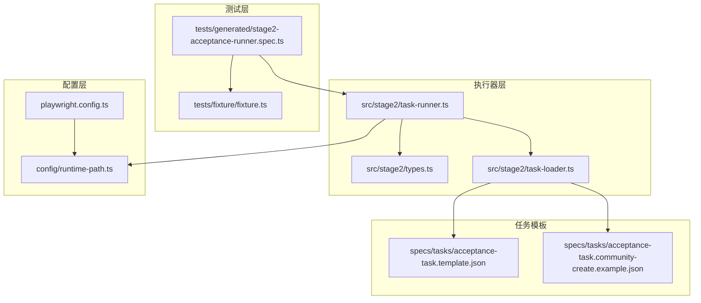
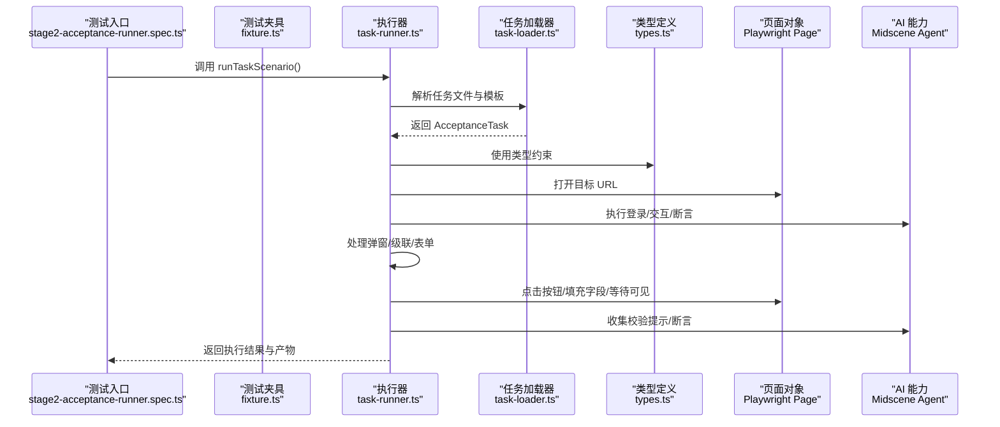
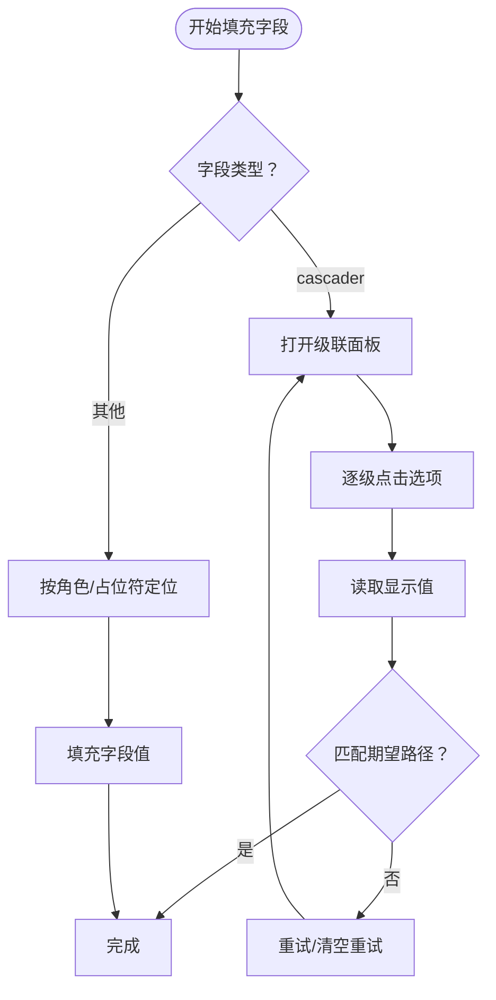
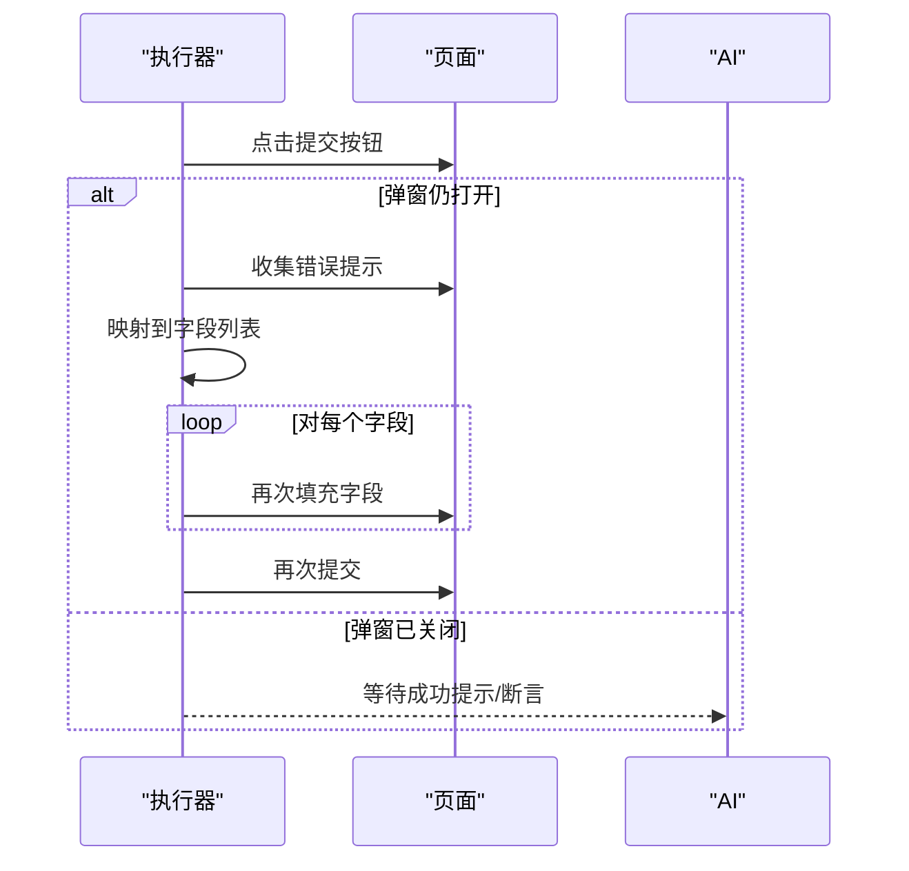
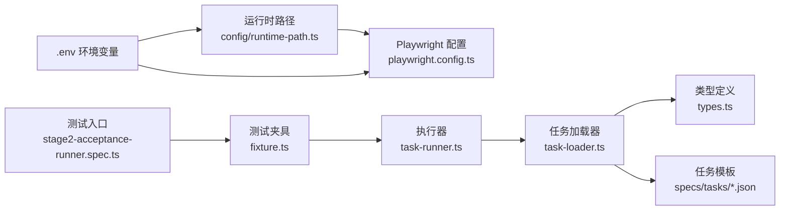

# 动态表单适配

<cite>
**本文引用的文件**
- [README.md](file://README.md)
- [package.json](file://package.json)
- [playwright.config.ts](file://playwright.config.ts)
- [config/runtime-path.ts](file://config/runtime-path.ts)
- [src/stage2/types.ts](file://src/stage2/types.ts)
- [src/stage2/task-loader.ts](file://src/stage2/task-loader.ts)
- [src/stage2/task-runner.ts](file://src/stage2/task-runner.ts)
- [tests/fixture/fixture.ts](file://tests/fixture/fixture.ts)
- [tests/generated/stage2-acceptance-runner.spec.ts](file://tests/generated/stage2-acceptance-runner.spec.ts)
- [specs/tasks/acceptance-task.community-create.example.json](file://specs/tasks/acceptance-task.community-create.example.json)
- [specs/tasks/acceptance-task.template.json](file://specs/tasks/acceptance-task.template.json)
</cite>

## 目录
1. [简介](#简介)
2. [项目结构](#项目结构)
3. [核心组件](#核心组件)
4. [架构总览](#架构总览)
5. [详细组件分析](#详细组件分析)
6. [依赖关系分析](#依赖关系分析)
7. [性能考量](#性能考量)
8. [故障排查指南](#故障排查指南)
9. [结论](#结论)
10. [附录](#附录)

## 简介
本项目基于 Playwright 与 Midscene.js 构建，提供面向真实业务场景的自动化测试与验收执行能力。其核心在于“第二段执行器”（Stage2）：通过 JSON 任务驱动，结合 AI 辅助的页面定位、交互与断言，实现对复杂表单、弹窗、列表等 UI 场景的稳健自动化。本文围绕“动态表单适配”的主题，系统阐述以下内容：
- 条件显示字段的处理机制：如何根据其他字段值动态显示或隐藏控件，并在表单中正确填充与校验。
- 动态表单的检测策略：DOM 变化监听、字段状态跟踪与响应式更新。
- 表单验证的动态适配：条件验证、实时反馈与错误消息处理。
- 扩展开发指南：如何支持新的动态行为模式。
- AI 辅助的动态表单处理：通过 Midscene AI 实现智能交互。
- 实际应用场景与最佳实践。

## 项目结构
该项目采用分层组织方式，核心集中在 stage2 执行器与测试夹具中，配合环境变量与运行目录配置，形成可复用的自动化流水线。

图表来源
- [tests/generated/stage2-acceptance-runner.spec.ts](file://tests/generated/stage2-acceptance-runner.spec.ts#L1-L39)
- [tests/fixture/fixture.ts](file://tests/fixture/fixture.ts#L1-L100)
- [src/stage2/task-runner.ts](file://src/stage2/task-runner.ts#L1062-L1344)
- [src/stage2/task-loader.ts](file://src/stage2/task-loader.ts#L79-L89)
- [src/stage2/types.ts](file://src/stage2/types.ts#L86-L98)
- [playwright.config.ts](file://playwright.config.ts#L1-L95)
- [config/runtime-path.ts](file://config/runtime-path.ts#L38-L41)
- [specs/tasks/acceptance-task.template.json](file://specs/tasks/acceptance-task.template.json#L1-L85)
- [specs/tasks/acceptance-task.community-create.example.json](file://specs/tasks/acceptance-task.community-create.example.json#L1-L184)

章节来源
- [README.md](file://README.md#L1-L144)
- [package.json](file://package.json#L1-L24)
- [playwright.config.ts](file://playwright.config.ts#L1-L95)
- [config/runtime-path.ts](file://config/runtime-path.ts#L1-L41)

## 核心组件
- 任务模型与类型定义：定义了任务、账户、导航、表单、搜索、断言、清理、运行时与审批等结构，支撑 JSON 任务驱动。
- 任务加载器：负责解析任务文件、模板变量替换、形状校验与路径解析。
- 执行器：封装页面交互、AI 辅助定位、弹窗与级联选择、表单提交与自动修复、断言与结果输出。
- 测试夹具：注入 AI 能力（ai、aiQuery、aiAssert、aiWaitFor），并与 Midscene Agent 协作。
- 运行时路径：集中管理 t_runtime 目录及其子目录，便于产物归档与报告生成。

章节来源
- [src/stage2/types.ts](file://src/stage2/types.ts#L1-L125)
- [src/stage2/task-loader.ts](file://src/stage2/task-loader.ts#L79-L89)
- [src/stage2/task-runner.ts](file://src/stage2/task-runner.ts#L1062-L1344)
- [tests/fixture/fixture.ts](file://tests/fixture/fixture.ts#L23-L99)
- [config/runtime-path.ts](file://config/runtime-path.ts#L38-L41)

## 架构总览
整体架构以“JSON 任务驱动 + AI 辅助 + Playwright 控制”为核心，通过执行器在页面上完成登录、菜单导航、弹窗打开、字段填充、提交与断言，同时在遇到滑块验证码等挑战时自动处理或人工兜底。

图表来源
- [tests/generated/stage2-acceptance-runner.spec.ts](file://tests/generated/stage2-acceptance-runner.spec.ts#L12-L37)
- [tests/fixture/fixture.ts](file://tests/fixture/fixture.ts#L23-L99)
- [src/stage2/task-runner.ts](file://src/stage2/task-runner.ts#L1062-L1344)
- [src/stage2/task-loader.ts](file://src/stage2/task-loader.ts#L79-L89)
- [src/stage2/types.ts](file://src/stage2/types.ts#L86-L98)

## 详细组件分析

### 动态表单字段填充与级联选择
- 级联选择器（cascader）：通过打开面板、逐级点击选项、读取显示值并匹配期望路径，支持多次重试与截图记录。
- 文本输入：优先通过角色与占位符定位，其次在弹窗上下文中尝试多种候选，最后回退到 AI 描述进行交互。
- 字段状态跟踪：在提交阶段收集弹窗内的错误提示，映射到具体字段并自动修复。

图表来源
- [src/stage2/task-runner.ts](file://src/stage2/task-runner.ts#L902-L971)
- [src/stage2/task-runner.ts](file://src/stage2/task-runner.ts#L913-L941)
- [src/stage2/task-runner.ts](file://src/stage2/task-runner.ts#L928-L931)

章节来源
- [src/stage2/task-runner.ts](file://src/stage2/task-runner.ts#L902-L971)
- [src/stage2/task-runner.ts](file://src/stage2/task-runner.ts#L913-L941)
- [src/stage2/task-runner.ts](file://src/stage2/task-runner.ts#L928-L931)

### 表单提交与动态修复
- 提交按钮点击与弹窗状态判断：若弹窗未关闭，收集校验提示并映射到字段，自动再次填充后重试。
- 错误消息收集与字段映射：通过常见 UI 组件的错误类选择器收集提示，结合字段标签与占位文案进行匹配。

图表来源
- [src/stage2/task-runner.ts](file://src/stage2/task-runner.ts#L973-L1018)
- [src/stage2/task-runner.ts](file://src/stage2/task-runner.ts#L335-L404)

章节来源
- [src/stage2/task-runner.ts](file://src/stage2/task-runner.ts#L973-L1018)
- [src/stage2/task-runner.ts](file://src/stage2/task-runner.ts#L335-L404)

### 条件显示字段的处理机制
- 动态可见性：通过可见性判断与弹窗定位，确保在正确的容器内进行交互。
- 回退策略：当基于 DOM 的定位失败时，回退到 AI 描述进行交互，保证在复杂布局下的鲁棒性。
- 截图记录：在关键步骤（如级联选择）进行截图，便于问题定位与回归验证。

章节来源
- [src/stage2/task-runner.ts](file://src/stage2/task-runner.ts#L162-L202)
- [src/stage2/task-runner.ts](file://src/stage2/task-runner.ts#L227-L254)
- [src/stage2/task-runner.ts](file://src/stage2/task-runner.ts#L919-L925)

### 动态表单的检测策略
- DOM 变化监听：通过可见性判断、文本等待、加载状态等待等方式，避免过早交互导致的不稳定。
- 字段状态跟踪：在提交阶段收集错误提示并映射到字段，形成“错误提示 -> 字段”的映射链路。
- 响应式更新：在每次交互后等待页面稳定（如 domcontentloaded），并在必要时进行二次尝试。

章节来源
- [src/stage2/task-runner.ts](file://src/stage2/task-runner.ts#L450-L464)
- [src/stage2/task-runner.ts](file://src/stage2/task-runner.ts#L466-L478)
- [src/stage2/task-runner.ts](file://src/stage2/task-runner.ts#L997-L1006)

### 表单验证的动态适配
- 条件验证：根据错误提示动态决定需要修复的字段集合，避免全量重填。
- 实时反馈：通过 AI 等待与断言，确保用户看到的提示与预期一致。
- 错误消息处理：统一收集错误提示，结合字段标签与占位文案进行匹配，提升诊断准确性。

章节来源
- [src/stage2/task-runner.ts](file://src/stage2/task-runner.ts#L335-L404)
- [src/stage2/task-runner.ts](file://src/stage2/task-runner.ts#L1020-L1060)

### AI 辅助的动态表单处理
- AI 能力注入：测试夹具注入 ai、aiQuery、aiAssert、aiWaitFor，统一由 Midscene Agent 执行。
- 智能交互：在 DOM 定位失败或复杂布局下，通过自然语言描述驱动交互，提升稳定性。
- 报告与缓存：Midscene Agent 支持报告生成与缓存，便于调试与复用。

章节来源
- [tests/fixture/fixture.ts](file://tests/fixture/fixture.ts#L23-L99)
- [README.md](file://README.md#L3-L52)

### 扩展开发指南
- 新增字段类型：在类型定义中扩展 TaskField.componentType，并在执行器中添加对应的填充逻辑。
- 新增断言类型：在断言执行器中添加新类型分支，并提供 AI 断言回退策略。
- 新增 UI 组件：扩展错误提示收集的选择器与字段映射规则，提升动态修复能力。
- 新增交互模式：在执行器中增加新的交互序列（如多步骤弹窗、异步加载），并配套截图与等待策略。

章节来源
- [src/stage2/types.ts](file://src/stage2/types.ts#L23-L40)
- [src/stage2/task-runner.ts](file://src/stage2/task-runner.ts#L1020-L1060)

### 实际应用场景与最佳实践
- 应用场景：复杂表单（含级联选择）、弹窗交互、列表搜索与断言、登录与安全验证处理。
- 最佳实践：
  - 使用任务模板与环境变量进行参数化，避免硬编码。
  - 在关键步骤开启截图与 trace，便于问题定位。
  - 合理设置超时与重试次数，平衡稳定性与执行效率。
  - 将 UI 组件的错误提示标准化，提升动态修复效果。

章节来源
- [specs/tasks/acceptance-task.template.json](file://specs/tasks/acceptance-task.template.json#L1-L85)
- [specs/tasks/acceptance-task.community-create.example.json](file://specs/tasks/acceptance-task.community-create.example.json#L1-L184)
- [README.md](file://README.md#L106-L144)

## 依赖关系分析
- 运行时路径：集中管理 t_runtime 目录，确保产物与报告的统一归档。
- 配置加载：Playwright 与 Midscene 的报告、输出目录由环境变量控制。
- 任务驱动：JSON 任务文件作为唯一输入，通过加载器解析与模板替换，驱动执行器完成端到端流程。

图表来源
- [config/runtime-path.ts](file://config/runtime-path.ts#L38-L41)
- [playwright.config.ts](file://playwright.config.ts#L36-L40)
- [tests/generated/stage2-acceptance-runner.spec.ts](file://tests/generated/stage2-acceptance-runner.spec.ts#L12-L37)
- [tests/fixture/fixture.ts](file://tests/fixture/fixture.ts#L23-L99)
- [src/stage2/task-runner.ts](file://src/stage2/task-runner.ts#L1062-L1344)
- [src/stage2/task-loader.ts](file://src/stage2/task-loader.ts#L79-L89)
- [src/stage2/types.ts](file://src/stage2/types.ts#L86-L98)
- [specs/tasks/acceptance-task.template.json](file://specs/tasks/acceptance-task.template.json#L1-L85)

章节来源
- [config/runtime-path.ts](file://config/runtime-path.ts#L1-L41)
- [playwright.config.ts](file://playwright.config.ts#L1-L95)
- [package.json](file://package.json#L1-L24)

## 性能考量
- 并行与重试：在 CI 环境启用并行与有限重试，减少构建时间。
- 超时与等待：合理设置步骤与页面超时，避免长时间阻塞。
- 截图与报告：按需开启截图与 trace，平衡可观测性与性能。
- 滑块验证码：自动模式下进行多次尝试与等待，失败时快速回退并给出明确错误。

章节来源
- [playwright.config.ts](file://playwright.config.ts#L28-L34)
- [src/stage2/task-runner.ts](file://src/stage2/task-runner.ts#L647-L703)

## 故障排查指南
- 滑块验证码处理：根据配置选择自动、人工、失败或忽略模式，必要时调整等待超时。
- 页面元素不可见：检查可见性判断与等待策略，必要时回退到 AI 交互。
- 级联选择失败：确认面板打开、选项文本精确匹配与路径顺序，启用截图辅助定位。
- 提交后弹窗未关闭：收集错误提示并映射到字段，进行针对性修复。

章节来源
- [src/stage2/task-runner.ts](file://src/stage2/task-runner.ts#L480-L498)
- [src/stage2/task-runner.ts](file://src/stage2/task-runner.ts#L647-L703)
- [src/stage2/task-runner.ts](file://src/stage2/task-runner.ts#L902-L971)
- [src/stage2/task-runner.ts](file://src/stage2/task-runner.ts#L973-L1018)

## 结论
本项目通过“JSON 任务驱动 + AI 辅助 + Playwright 控制”的组合，提供了对复杂动态表单的稳健自动化能力。其关键优势在于：
- 动态修复：基于错误提示的字段映射与自动修复，显著提升稳定性。
- AI 驱动：在 DOM 不稳定或布局复杂时，通过自然语言描述进行交互。
- 可扩展性：清晰的类型定义与模块划分，便于扩展新的字段类型、断言类型与交互模式。
- 可观测性：统一的运行时路径与产物归档，便于问题定位与回归验证。

## 附录
- 运行与产物：通过 npm scripts 启动，产物统一归档至 t_runtime 目录。
- 任务模板：提供通用模板与示例任务，便于快速上手与定制。

章节来源
- [README.md](file://README.md#L106-L144)
- [specs/tasks/acceptance-task.template.json](file://specs/tasks/acceptance-task.template.json#L1-L85)
- [specs/tasks/acceptance-task.community-create.example.json](file://specs/tasks/acceptance-task.community-create.example.json#L1-L184)