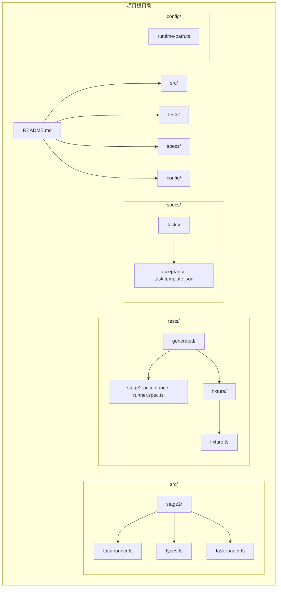
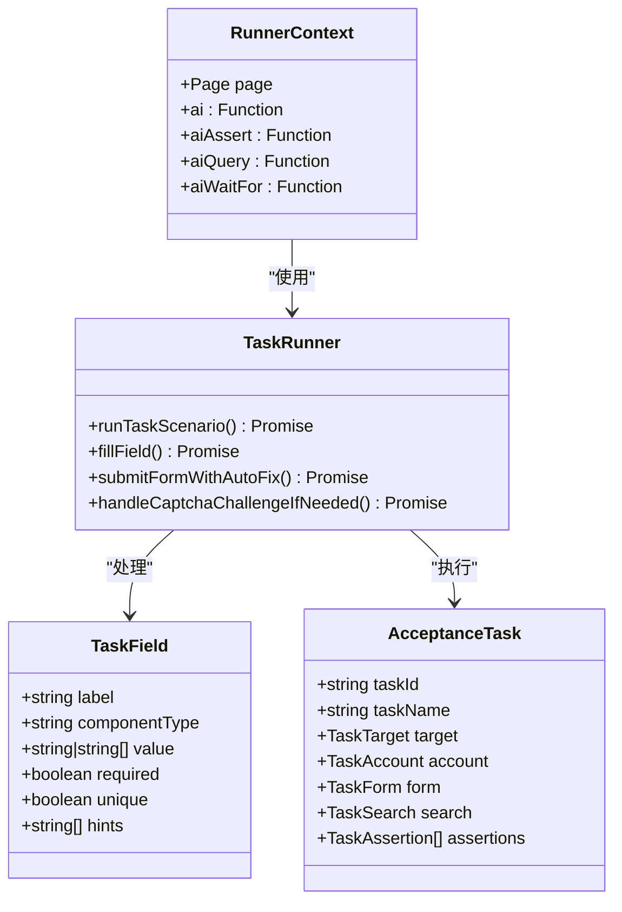
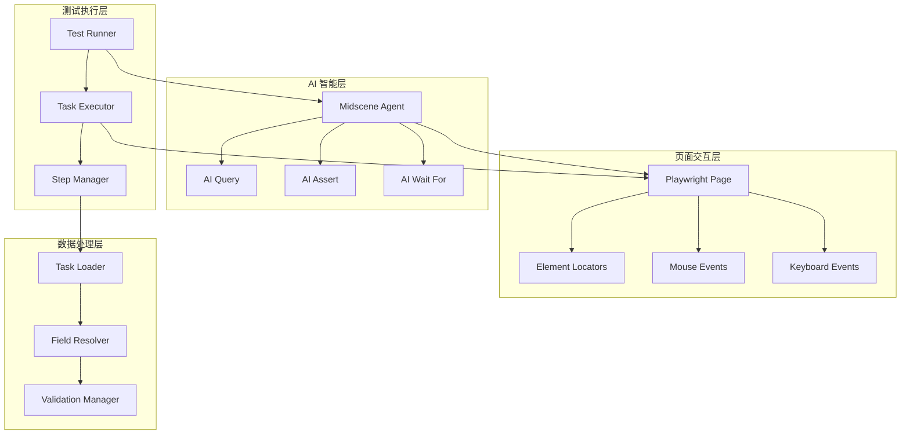
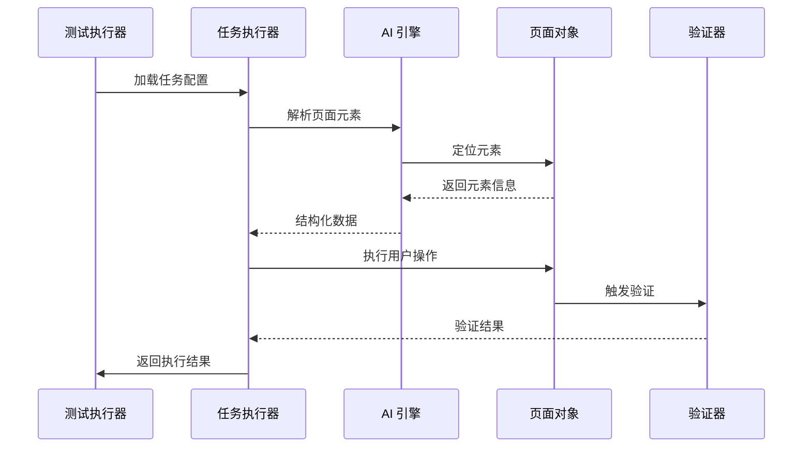
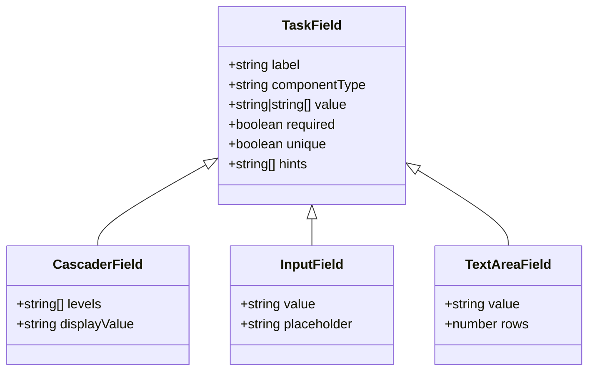
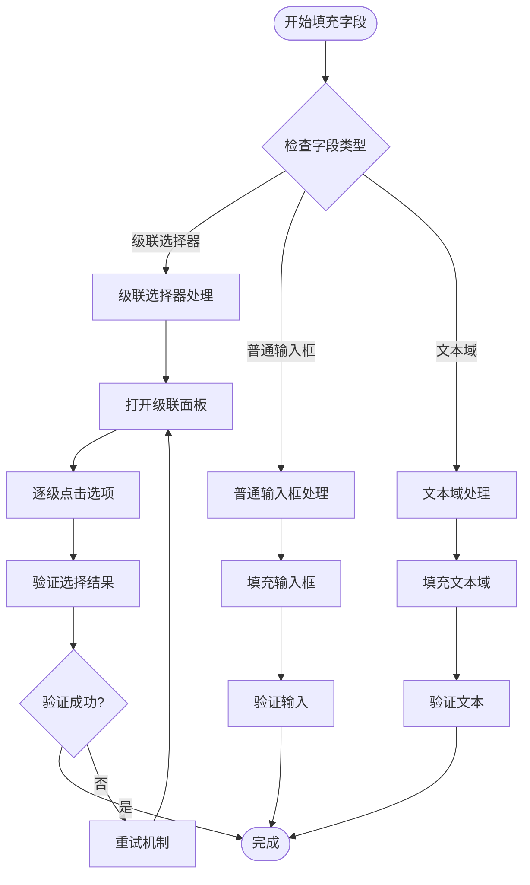
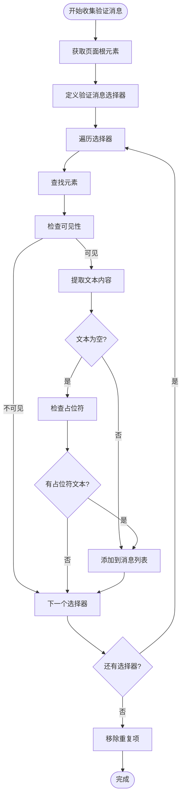
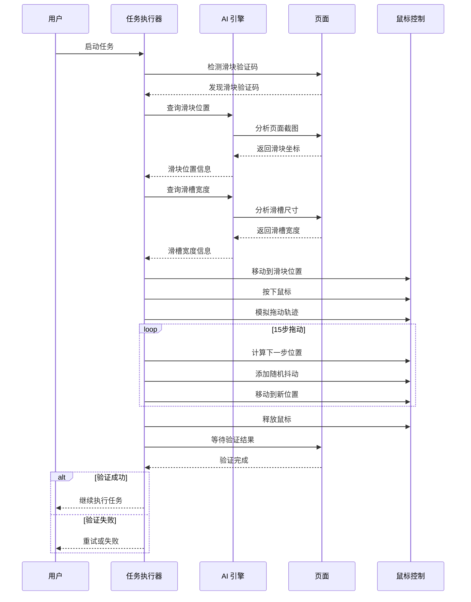
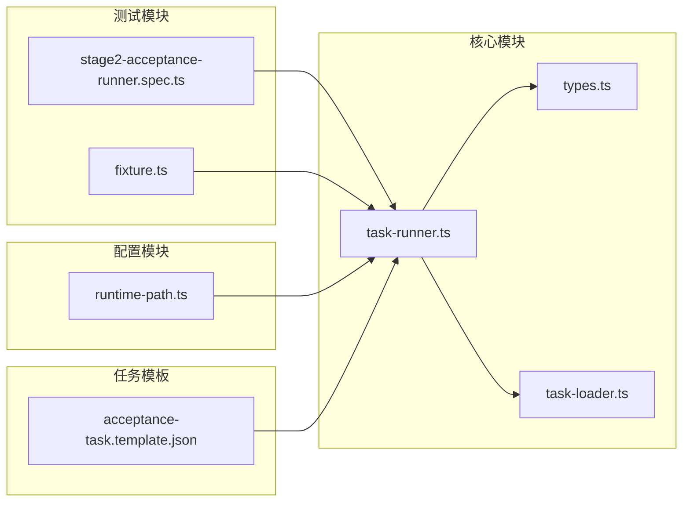
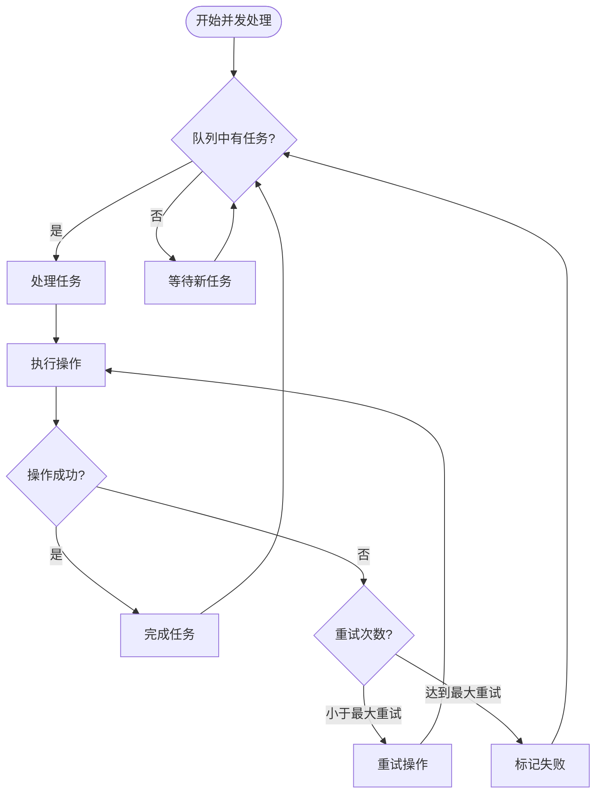

# 复选框和单选按钮

<cite>
**本文档引用的文件**
- [README.md](file://README.md)
- [task-runner.ts](file://src/stage2/task-runner.ts)
- [types.ts](file://src/stage2/types.ts)
- [stage2-acceptance-runner.spec.ts](file://tests/generated/stage2-acceptance-runner.spec.ts)
- [fixture.ts](file://tests/fixture/fixture.ts)
- [acceptance-task.template.json](file://specs/tasks/acceptance-task.template.json)
</cite>

## 目录
1. [简介](#简介)
2. [项目结构](#项目结构)
3. [核心组件](#核心组件)
4. [架构概览](#架构概览)
5. [详细组件分析](#详细组件分析)
6. [依赖关系分析](#依赖关系分析)
7. [性能考虑](#性能考虑)
8. [故障排除指南](#故障排除指南)
9. [结论](#结论)

## 简介

本项目是一个基于 Playwright 和 Midscene.js 的 AI 自动化测试项目，专注于企业级应用的验收测试自动化。虽然项目当前主要实现了滑块验证码处理和表单自动化功能，但本文档将为复选框和单选按钮处理提供完整的技术指导和最佳实践。

项目采用 JSON 驱动的任务执行模式，通过 AI 辅助的页面元素定位和交互，实现复杂的业务流程自动化。系统集成了多种 UI 框架的适配策略，包括 Element UI、Ant Design 和 iView 等主流前端组件库。

## 项目结构



**图表来源**
- [README.md](file://README.md#L1-L144)
- [task-runner.ts](file://src/stage2/task-runner.ts#L1-L50)
- [types.ts](file://src/stage2/types.ts#L1-L125)

**章节来源**
- [README.md](file://README.md#L1-L144)

## 核心组件

### 主要技术栈

项目采用以下核心技术栈：

- **Playwright**: Web UI 自动化测试框架，提供强大的页面交互能力
- **Midscene.js**: AI 定位、提取、断言能力，实现智能页面元素识别
- **TypeScript**: 类型安全的开发语言，确保代码质量和维护性
- **JSON 驱动**: 通过任务配置文件实现灵活的测试场景定义

### 关键模块职责



**图表来源**
- [task-runner.ts](file://src/stage2/task-runner.ts#L15-L31)
- [types.ts](file://src/stage2/types.ts#L23-L98)

**章节来源**
- [task-runner.ts](file://src/stage2/task-runner.ts#L1-L100)
- [types.ts](file://src/stage2/types.ts#L1-L125)

## 架构概览

### 整体架构设计



**图表来源**
- [stage2-acceptance-runner.spec.ts](file://tests/generated/stage2-acceptance-runner.spec.ts#L1-L39)
- [fixture.ts](file://tests/fixture/fixture.ts#L23-L99)

### 数据流架构



**图表来源**
- [task-runner.ts](file://src/stage2/task-runner.ts#L1062-L1344)
- [fixture.ts](file://tests/fixture/fixture.ts#L23-L99)

## 详细组件分析

### 表单字段处理系统

#### 字段类型定义



**图表来源**
- [types.ts](file://src/stage2/types.ts#L23-L40)

#### 字段填充策略



**图表来源**
- [task-runner.ts](file://src/stage2/task-runner.ts#L894-L971)

### 验证消息收集系统

#### 验证消息提取流程



**图表来源**
- [task-runner.ts](file://src/stage2/task-runner.ts#L335-L364)

**章节来源**
- [task-runner.ts](file://src/stage2/task-runner.ts#L335-L404)
- [types.ts](file://src/stage2/types.ts#L23-L40)

### 滑块验证码处理系统

#### 自动处理流程



**图表来源**
- [task-runner.ts](file://src/stage2/task-runner.ts#L558-L645)

**章节来源**
- [task-runner.ts](file://src/stage2/task-runner.ts#L480-L703)

## 依赖关系分析

### 外部依赖关系

```mermaid
graph TB
subgraph "核心依赖"
A[Playwright] --> B[页面交互]
C[Midscene.js] --> D[AI 功能]
E[TypeScript] --> F[类型安全]
end
subgraph "UI 框架适配"
G[Element UI] --> H[级联选择器]
I[Ant Design] --> J[级联选择器]
K[iView] --> L[级联选择器]
end
subgraph "测试框架"
M[@playwright/test] --> N[测试执行]
O[expect] --> P[断言]
end
A --> G
A --> I
A --> K
C --> M
```

**图表来源**
- [README.md](file://README.md#L5-L9)
- [task-runner.ts](file://src/stage2/task-runner.ts#L204-L225)

### 内部模块依赖



**图表来源**
- [task-runner.ts](file://src/stage2/task-runner.ts#L1-L13)
- [stage2-acceptance-runner.spec.ts](file://tests/generated/stage2-acceptance-runner.spec.ts#L1-L4)

**章节来源**
- [task-runner.ts](file://src/stage2/task-runner.ts#L1-L13)
- [stage2-acceptance-runner.spec.ts](file://tests/generated/stage2-acceptance-runner.spec.ts#L1-L39)

## 性能考虑

### 执行效率优化

1. **异步操作管理**: 使用 Promise 链式调用避免阻塞主线程
2. **重试机制**: 对不稳定的操作实施智能重试策略
3. **超时控制**: 为每个操作设置合理的超时时间
4. **内存管理**: 及时清理不再使用的元素引用

### 并发处理策略



## 故障排除指南

### 常见问题及解决方案

#### 滑块验证码处理问题

| 问题类型 | 症状 | 解决方案 |
|---------|------|----------|
| 检测失败 | 无法识别滑块位置 | 检查页面截图质量，调整检测选择器 |
| 拖动失败 | 滑块无法移动 | 调整拖动轨迹参数，增加随机抖动 |
| 验证失败 | 滑块验证未通过 | 增加重试次数，检查页面稳定性 |

#### 表单验证问题

| 问题类型 | 症状 | 解决方案 |
|---------|------|----------|
| 验证消息缺失 | 无法获取验证提示 | 检查 CSS 选择器，支持多框架适配 |
| 字段填充失败 | 输入框无法填充 | 使用 AI 辅助定位，提供备用策略 |
| 状态同步问题 | UI 状态与实际不符 | 实施轮询机制，确保状态一致性 |

**章节来源**
- [task-runner.ts](file://src/stage2/task-runner.ts#L647-L703)
- [task-runner.ts](file://src/stage2/task-runner.ts#L335-L404)

## 结论

本项目展示了现代 Web 自动化测试的最佳实践，通过 AI 辅助的智能元素定位和多框架适配策略，实现了高可靠性的测试执行。虽然当前版本主要聚焦于滑块验证码处理和表单自动化，但其架构设计为扩展复选框和单选按钮处理提供了良好的基础。

未来可以在此基础上：
1. 扩展复选框和单选按钮的专用处理模块
2. 实现更精细的状态检测和同步机制
3. 增强 AI 辅助的选择策略
4. 优化批量操作和去重逻辑

通过持续改进和扩展，该项目将成为企业级 Web 应用自动化测试的完整解决方案。