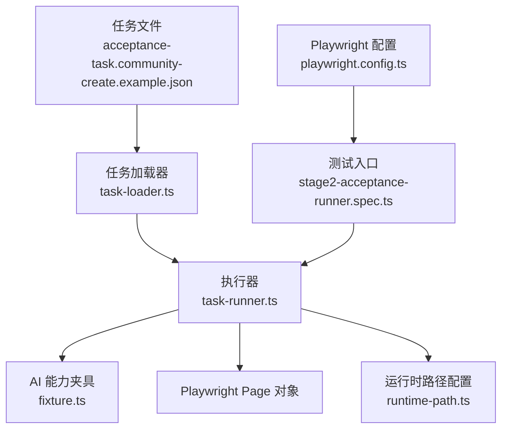
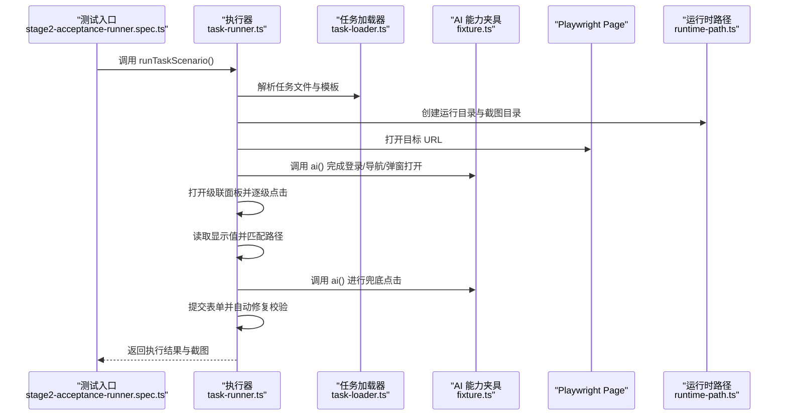
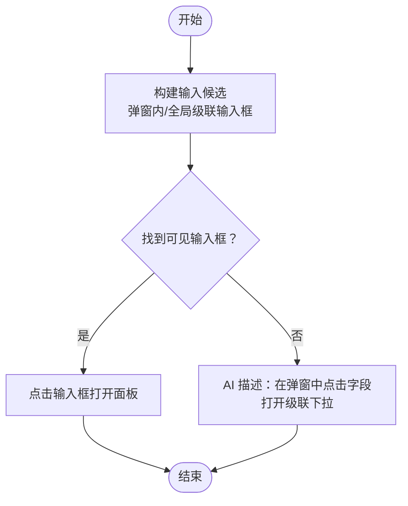
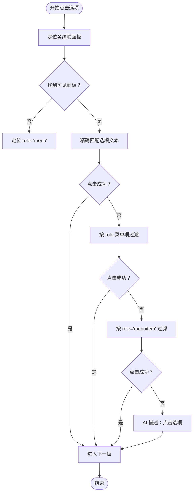
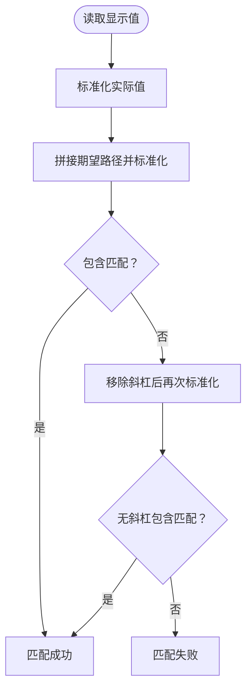
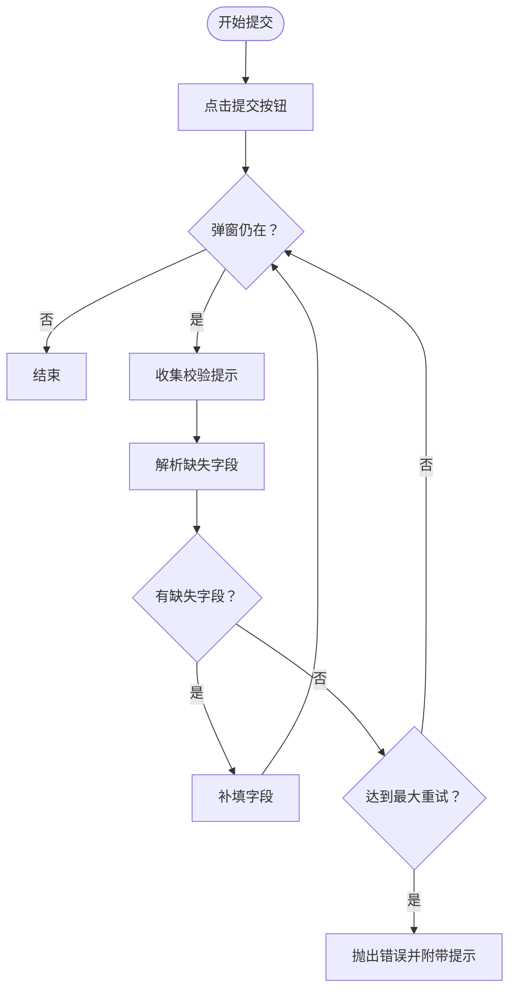
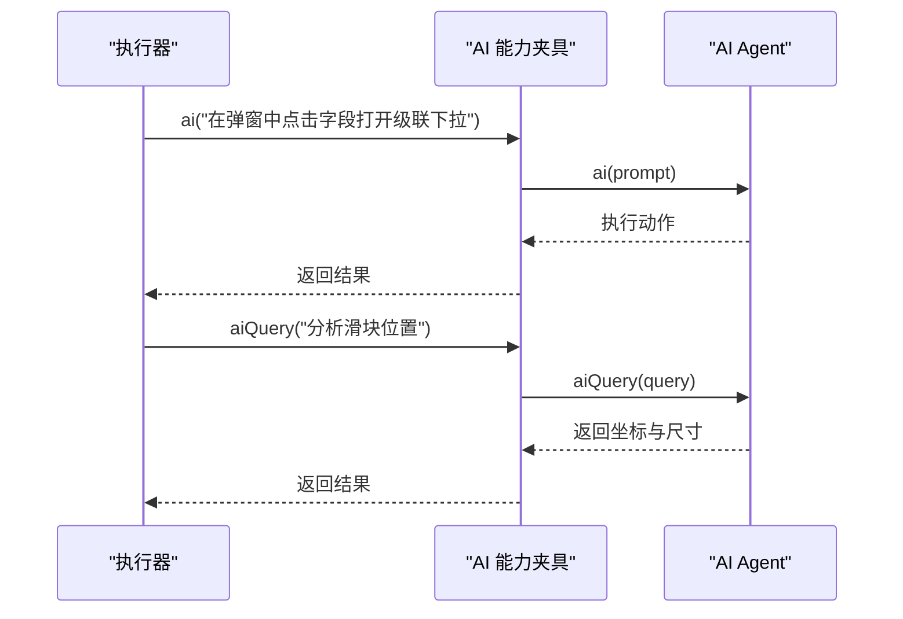
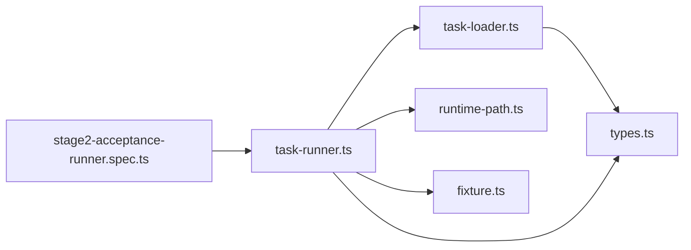

# 级联选择器

<cite>
**本文引用的文件**
- [README.md](file://README.md)
- [package.json](file://package.json)
- [playwright.config.ts](file://playwright.config.ts)
- [config/runtime-path.ts](file://config/runtime-path.ts)
- [src/stage2/types.ts](file://src/stage2/types.ts)
- [src/stage2/task-loader.ts](file://src/stage2/task-loader.ts)
- [src/stage2/task-runner.ts](file://src/stage2/task-runner.ts)
- [tests/fixture/fixture.ts](file://tests/fixture/fixture.ts)
- [tests/generated/stage2-acceptance-runner.spec.ts](file://tests/generated/stage2-acceptance-runner.spec.ts)
- [specs/tasks/acceptance-task.community-create.example.json](file://specs/tasks/acceptance-task.community-create.example.json)
- [specs/basic-operations.md](file://specs/basic-operations.md)
- [specs/login-e2e.md](file://specs/login-e2e.md)
</cite>

## 目录
1. [简介](#简介)
2. [项目结构](#项目结构)
3. [核心组件](#核心组件)
4. [架构总览](#架构总览)
5. [详细组件分析](#详细组件分析)
6. [依赖关系分析](#依赖关系分析)
7. [性能考量](#性能考量)
8. [故障排查指南](#故障排查指南)
9. [结论](#结论)
10. [附录](#附录)

## 简介
本文件围绕“级联选择器”的处理机制进行系统化说明，覆盖省市区级联、组织架构级联等多层级选择场景。重点阐述：
- 多层级展开策略：逐级点击、面板检测、选项选择
- 级联面板定位方法：通过对话框、弹窗容器与特定选择器定位
- 选项路径匹配算法：精确匹配、模糊匹配与文本标准化
- AI 辅助机制：通过 Midscene AI 实现智能路径导航
- 扩展开发指南：如何在现有框架基础上扩展自定义级联逻辑

## 项目结构
该项目采用“任务驱动 + AI 协作”的 E2E 自动化方案，核心模块包括：
- 任务定义与加载：JSON 任务文件 + 加载器
- 执行器：按步骤顺序执行，结合 Midscene AI 完成交互与断言
- 配置与运行时路径：集中管理输出目录与运行参数
- 测试夹具：封装 AI 能力（ai、aiQuery、aiAssert、aiWaitFor）

图表来源
- [specs/tasks/acceptance-task.community-create.example.json](file://specs/tasks/acceptance-task.community-create.example.json#L1-L184)
- [src/stage2/task-loader.ts](file://src/stage2/task-loader.ts#L79-L89)
- [src/stage2/task-runner.ts](file://src/stage2/task-runner.ts#L1062-L1343)
- [tests/fixture/fixture.ts](file://tests/fixture/fixture.ts#L23-L99)
- [config/runtime-path.ts](file://config/runtime-path.ts#L38-L40)
- [tests/generated/stage2-acceptance-runner.spec.ts](file://tests/generated/stage2-acceptance-runner.spec.ts#L1-L39)
- [playwright.config.ts](file://playwright.config.ts#L22-L94)

章节来源
- [README.md](file://README.md#L1-L144)
- [package.json](file://package.json#L1-L24)
- [playwright.config.ts](file://playwright.config.ts#L1-L95)
- [config/runtime-path.ts](file://config/runtime-path.ts#L1-L41)

## 核心组件
- 任务模型与字段类型：定义了 cascader 组件类型、字段值数组表示多级路径等
- 任务加载器：解析任务文件、模板变量替换、形状校验
- 执行器：按步骤执行，包含打开弹窗、填写字段（含级联）、提交与断言
- AI 能力夹具：封装 AI 动作、查询与等待断言
- 运行时路径：集中管理 t_runtime 下各产物目录

章节来源
- [src/stage2/types.ts](file://src/stage2/types.ts#L23-L40)
- [src/stage2/task-loader.ts](file://src/stage2/task-loader.ts#L79-L89)
- [src/stage2/task-runner.ts](file://src/stage2/task-runner.ts#L1062-L1343)
- [tests/fixture/fixture.ts](file://tests/fixture/fixture.ts#L23-L99)
- [config/runtime-path.ts](file://config/runtime-path.ts#L38-L40)

## 架构总览
下图展示了从任务文件到最终执行的关键流程，以及 AI 在其中的角色。

图表来源
- [tests/generated/stage2-acceptance-runner.spec.ts](file://tests/generated/stage2-acceptance-runner.spec.ts#L18-L37)
- [src/stage2/task-runner.ts](file://src/stage2/task-runner.ts#L1062-L1343)
- [src/stage2/task-loader.ts](file://src/stage2/task-loader.ts#L79-L89)
- [tests/fixture/fixture.ts](file://tests/fixture/fixture.ts#L23-L99)
- [config/runtime-path.ts](file://config/runtime-path.ts#L108-L117)

## 详细组件分析

### 级联面板定位与打开
- 输入候选构建：优先在弹窗内查找级联输入框，其次在全局范围内匹配“省市区/请选择省市区/只读输入/级联输入类选择器”
- 弹窗检测：通过对话框容器角色与标题文本进行可见性筛选
- 打开面板：若找到输入框则直接点击；否则通过 AI 描述“在弹窗中点击字段打开级联下拉”

图表来源
- [src/stage2/task-runner.ts](file://src/stage2/task-runner.ts#L204-L225)
- [src/stage2/task-runner.ts](file://src/stage2/task-runner.ts#L227-L254)
- [src/stage2/task-runner.ts](file://src/stage2/task-runner.ts#L705-L721)

章节来源
- [src/stage2/task-runner.ts](file://src/stage2/task-runner.ts#L204-L225)
- [src/stage2/task-runner.ts](file://src/stage2/task-runner.ts#L227-L254)
- [src/stage2/task-runner.ts](file://src/stage2/task-runner.ts#L705-L721)

### 逐级点击与选项选择
- 面板定位：针对 Element Plus、Ant Design、iView 等 UI 框架的级联菜单容器进行可见性筛选
- 选项点击：优先精确匹配文本，其次通过 role 菜单项过滤，最后兜底使用 AI 描述点击
- 层级索引：通过 levelIndex 控制当前应点击第几级菜单

图表来源
- [src/stage2/task-runner.ts](file://src/stage2/task-runner.ts#L723-L785)

章节来源
- [src/stage2/task-runner.ts](file://src/stage2/task-runner.ts#L723-L785)

### 选项路径匹配算法
- 文本标准化：去除空白与斜杠，支持“包含”与“无斜杠包含”两种匹配策略
- 匹配策略：
  - 精确匹配：期望路径与实际显示值进行标准化后比较
  - 模糊匹配：支持无斜杠拼接后的包含关系
- 重试与回退：若匹配失败，清空面板并重试，最多三次

图表来源
- [src/stage2/task-runner.ts](file://src/stage2/task-runner.ts#L323-L333)
- [src/stage2/task-runner.ts](file://src/stage2/task-runner.ts#L912-L941)

章节来源
- [src/stage2/task-runner.ts](file://src/stage2/task-runner.ts#L323-L333)
- [src/stage2/task-runner.ts](file://src/stage2/task-runner.ts#L912-L941)

### 提交与自动修复
- 提交按钮点击：优先通过按钮文案匹配，否则使用 AI 描述
- 弹窗关闭检测：若弹窗未关闭，收集校验提示并定位缺失字段，循环补填直至关闭或达到最大重试次数
- 最终断言：若仍无法关闭，抛出错误并附带校验提示

图表来源
- [src/stage2/task-runner.ts](file://src/stage2/task-runner.ts#L973-L1018)

章节来源
- [src/stage2/task-runner.ts](file://src/stage2/task-runner.ts#L973-L1018)

### AI 辅助机制与智能路径导航
- AI 能力封装：在夹具中为 ai、aiQuery、aiAssert、aiWaitFor 提供统一入口与缓存组管理
- 滑块验证码自动处理：通过 aiQuery 获取滑块位置与轨道宽度，模拟真人拖动轨迹
- 级联兜底点击：当定位不到选项时，使用 AI 描述进行点击
- 断言与等待：通过 aiWaitFor 等待特定 UI 出现，aiAssert 执行断言

图表来源
- [tests/fixture/fixture.ts](file://tests/fixture/fixture.ts#L23-L99)
- [src/stage2/task-runner.ts](file://src/stage2/task-runner.ts#L507-L556)
- [src/stage2/task-runner.ts](file://src/stage2/task-runner.ts#L718-L720)

章节来源
- [tests/fixture/fixture.ts](file://tests/fixture/fixture.ts#L23-L99)
- [src/stage2/task-runner.ts](file://src/stage2/task-runner.ts#L507-L556)
- [src/stage2/task-runner.ts](file://src/stage2/task-runner.ts#L718-L720)

### 扩展开发指南：自定义级联逻辑
- 新增 UI 框架适配：在面板定位与选项点击处增加对应选择器与 role 定位
- 自定义匹配策略：在路径匹配函数中扩展更复杂的文本标准化与匹配规则
- 任务字段扩展：在任务模型中为新的级联类型定义字段值结构与提示
- 兜底策略增强：在 AI 描述中加入更丰富的上下文，提升定位成功率

章节来源
- [src/stage2/task-runner.ts](file://src/stage2/task-runner.ts#L723-L785)
- [src/stage2/task-runner.ts](file://src/stage2/task-runner.ts#L323-L333)
- [src/stage2/types.ts](file://src/stage2/types.ts#L23-L40)

## 依赖关系分析
- 执行器依赖任务加载器与运行时路径配置
- 测试入口依赖执行器与 AI 能力夹具
- 配置文件集中管理输出目录与运行参数
- 任务文件定义字段类型与值结构，驱动执行器行为

图表来源
- [tests/generated/stage2-acceptance-runner.spec.ts](file://tests/generated/stage2-acceptance-runner.spec.ts#L1-L39)
- [src/stage2/task-runner.ts](file://src/stage2/task-runner.ts#L1062-L1343)
- [src/stage2/task-loader.ts](file://src/stage2/task-loader.ts#L79-L89)
- [config/runtime-path.ts](file://config/runtime-path.ts#L38-L40)
- [tests/fixture/fixture.ts](file://tests/fixture/fixture.ts#L23-L99)
- [src/stage2/types.ts](file://src/stage2/types.ts#L23-L40)

章节来源
- [tests/generated/stage2-acceptance-runner.spec.ts](file://tests/generated/stage2-acceptance-runner.spec.ts#L1-L39)
- [src/stage2/task-runner.ts](file://src/stage2/task-runner.ts#L1062-L1343)
- [src/stage2/task-loader.ts](file://src/stage2/task-loader.ts#L79-L89)
- [config/runtime-path.ts](file://config/runtime-path.ts#L38-L40)
- [tests/fixture/fixture.ts](file://tests/fixture/fixture.ts#L23-L99)
- [src/stage2/types.ts](file://src/stage2/types.ts#L23-L40)

## 性能考量
- 重试与等待：级联选择与提交流程内置重试与等待，避免因页面渲染延迟导致失败
- 截图与追踪：按步骤截图与追踪，便于定位问题并减少重复执行成本
- AI 查询与拖动：滑块自动处理采用少量步骤与抖动模拟，平衡成功率与性能

章节来源
- [src/stage2/task-runner.ts](file://src/stage2/task-runner.ts#L912-L941)
- [src/stage2/task-runner.ts](file://src/stage2/task-runner.ts#L973-L1018)
- [src/stage2/task-runner.ts](file://src/stage2/task-runner.ts#L558-L645)

## 故障排查指南
- 级联未选中：检查期望路径与实际显示值是否匹配，确认 UI 框架选择器是否正确
- 弹窗未关闭：查看校验提示，确认缺失字段是否被自动补填
- AI 未定位：检查 AI 描述是否包含足够上下文，必要时增加占位文案提示
- 滑块验证码：若自动处理失败，可切换为人工模式或调整检测选择器

章节来源
- [src/stage2/task-runner.ts](file://src/stage2/task-runner.ts#L936-L941)
- [src/stage2/task-runner.ts](file://src/stage2/task-runner.ts#L1014-L1018)
- [src/stage2/task-runner.ts](file://src/stage2/task-runner.ts#L647-L703)
- [src/stage2/task-runner.ts](file://src/stage2/task-runner.ts#L558-L645)

## 结论
本项目通过“任务驱动 + AI 协作”的方式，实现了对省市区、组织架构等复杂级联选择器的稳健处理。其核心在于：
- 多层级展开策略与面板定位
- 精准与模糊相结合的路径匹配
- AI 能力在定位失败时的兜底
- 可扩展的执行器与任务模型，便于定制化开发

## 附录
- 示例任务文件展示了 cascader 字段的多级路径配置与断言策略
- 基础操作与登录测试文档提供了通用测试实践参考

章节来源
- [specs/tasks/acceptance-task.community-create.example.json](file://specs/tasks/acceptance-task.community-create.example.json#L65-L80)
- [specs/basic-operations.md](file://specs/basic-operations.md#L1-L34)
- [specs/login-e2e.md](file://specs/login-e2e.md#L1-L152)