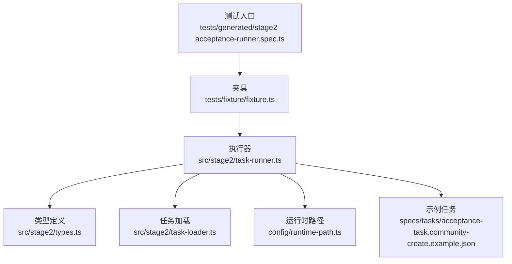
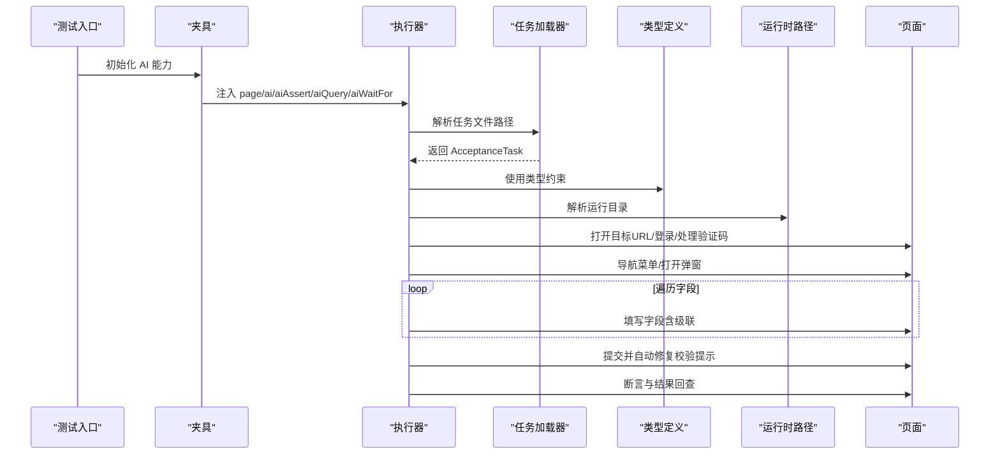
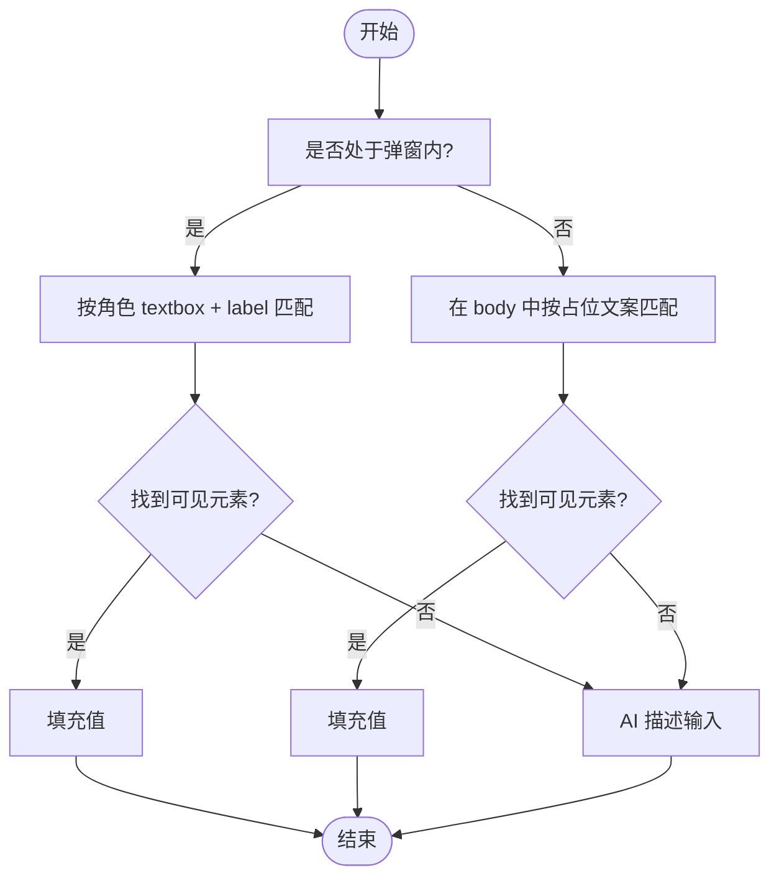
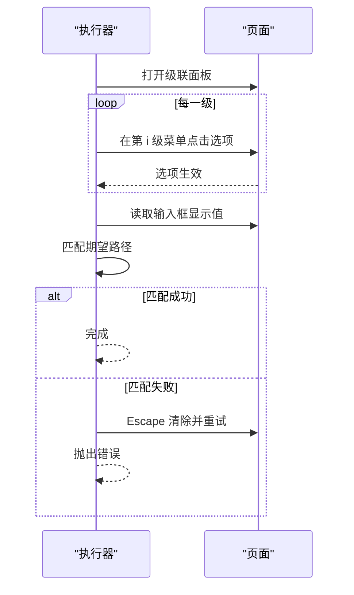
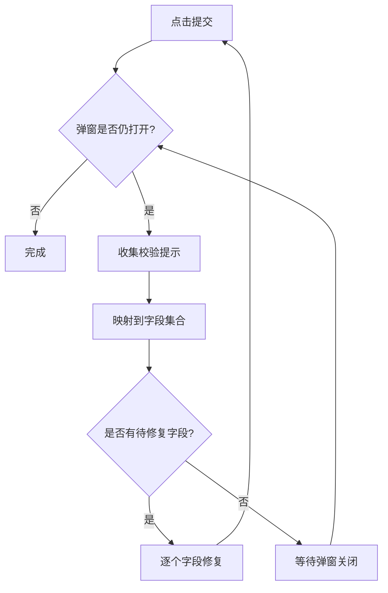
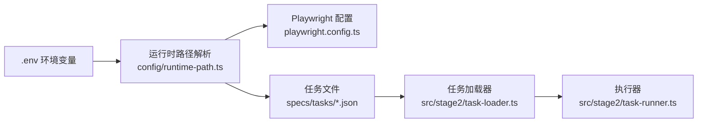

# 表单处理

<cite>
**本文引用的文件**
- [README.md](file://README.md)
- [package.json](file://package.json)
- [playwright.config.ts](file://playwright.config.ts)
- [config/runtime-path.ts](file://config/runtime-path.ts)
- [src/stage2/types.ts](file://src/stage2/types.ts)
- [src/stage2/task-loader.ts](file://src/stage2/task-loader.ts)
- [src/stage2/task-runner.ts](file://src/stage2/task-runner.ts)
- [tests/generated/stage2-acceptance-runner.spec.ts](file://tests/generated/stage2-acceptance-runner.spec.ts)
- [tests/fixture/fixture.ts](file://tests/fixture/fixture.ts)
- [specs/tasks/acceptance-task.community-create.example.json](file://specs/tasks/acceptance-task.community-create.example.json)
- [specs/tasks/acceptance-task.template.json](file://specs/tasks/acceptance-task.template.json)
</cite>

## 目录
1. [简介](#简介)
2. [项目结构](#项目结构)
3. [核心组件](#核心组件)
4. [架构总览](#架构总览)
5. [详细组件分析](#详细组件分析)
6. [依赖分析](#依赖分析)
7. [性能考虑](#性能考虑)
8. [故障排查指南](#故障排查指南)
9. [结论](#结论)
10. [附录](#附录)

## 简介
本项目基于 Playwright 与 Midscene.js 构建，提供“第二段”自动化执行能力，通过 JSON 任务驱动，实现登录、导航、表单填写、提交、断言与结果回查的全流程自动化。本文聚焦“表单处理”主题，系统性阐述多类型表单控件的识别与填充策略、级联选择器的处理逻辑、动态表单的适配策略（含条件显示、字段验证与实时反馈）、表单数据验证的实现细节（必填、格式与业务规则），以及扩展新控件类型的开发指南与最佳实践。

## 项目结构
- 核心执行器位于 src/stage2，包含类型定义、任务加载与执行器。
- 测试入口位于 tests，使用 Playwright + Midscene 夹具。
- 运行时路径与报告输出由 config/runtime-path.ts 统一解析。
- 示例任务模板位于 specs/tasks，用于指导任务编写。

图表来源
- [tests/generated/stage2-acceptance-runner.spec.ts](file://tests/generated/stage2-acceptance-runner.spec.ts#L1-L39)
- [tests/fixture/fixture.ts](file://tests/fixture/fixture.ts#L1-L100)
- [src/stage2/task-runner.ts](file://src/stage2/task-runner.ts#L1062-L1344)
- [src/stage2/types.ts](file://src/stage2/types.ts#L1-L125)
- [src/stage2/task-loader.ts](file://src/stage2/task-loader.ts#L1-L91)
- [config/runtime-path.ts](file://config/runtime-path.ts#L1-L41)
- [specs/tasks/acceptance-task.community-create.example.json](file://specs/tasks/acceptance-task.community-create.example.json#L1-L184)

章节来源
- [README.md](file://README.md#L1-L144)
- [package.json](file://package.json#L1-L24)
- [playwright.config.ts](file://playwright.config.ts#L1-L95)

## 核心组件
- 类型系统：定义 AcceptanceTask、TaskForm、TaskField 等核心数据结构，明确字段类型、必填、唯一、提示等元信息。
- 任务加载器：解析任务文件路径、模板变量替换、形状校验。
- 执行器：封装页面交互、AI 协作、滑块验证码处理、表单填写、提交与断言。
- 夹具与配置：集成 Midscene AI 能力，统一运行时路径与报告输出。

章节来源
- [src/stage2/types.ts](file://src/stage2/types.ts#L1-L125)
- [src/stage2/task-loader.ts](file://src/stage2/task-loader.ts#L1-L91)
- [src/stage2/task-runner.ts](file://src/stage2/task-runner.ts#L1062-L1344)
- [tests/fixture/fixture.ts](file://tests/fixture/fixture.ts#L1-L100)
- [config/runtime-path.ts](file://config/runtime-path.ts#L1-L41)

## 架构总览
整体流程：测试入口加载夹具，执行器加载任务，按步骤执行登录、菜单导航、弹窗打开、字段填写、提交与断言，期间穿插 AI 协作与滑块验证码处理。

图表来源
- [tests/generated/stage2-acceptance-runner.spec.ts](file://tests/generated/stage2-acceptance-runner.spec.ts#L1-L39)
- [tests/fixture/fixture.ts](file://tests/fixture/fixture.ts#L1-L100)
- [src/stage2/task-runner.ts](file://src/stage2/task-runner.ts#L1062-L1344)
- [src/stage2/task-loader.ts](file://src/stage2/task-loader.ts#L71-L91)
- [config/runtime-path.ts](file://config/runtime-path.ts#L38-L41)

## 详细组件分析

### 表单字段与控件类型
- 字段类型：支持 input、textarea、cascader 以及任意字符串作为扩展类型，便于兼容第三方组件库。
- 字段元信息：label、componentType、value、required、unique、hints。
- 候选提示：hints 中可包含“占位文案为 …”等描述，用于构建候选定位器。

章节来源
- [src/stage2/types.ts](file://src/stage2/types.ts#L23-L40)
- [specs/tasks/acceptance-task.community-create.example.json](file://specs/tasks/acceptance-task.community-create.example.json#L41-L102)

### 文本输入框与多行文本框
- 定位策略：优先按角色 textbox + label 精确匹配；其次按占位文案定位 input/textarea；最后回退到 AI 描述。
- 填充策略：可见性检查 + 填充 + 截图记录（可选）。
- 适用场景：单行输入框与多行文本框通用处理。

图表来源
- [src/stage2/task-runner.ts](file://src/stage2/task-runner.ts#L815-L844)
- [src/stage2/task-runner.ts](file://src/stage2/task-runner.ts#L944-L971)

章节来源
- [src/stage2/task-runner.ts](file://src/stage2/task-runner.ts#L815-L844)
- [src/stage2/task-runner.ts](file://src/stage2/task-runner.ts#L944-L971)

### 级联选择器（cascader）
- 打开面板：优先通过可见输入框点击打开；否则在弹窗上下文中按占位文案或只读输入定位。
- 逐级点击：遍历 value 数组，按层级索引在对应菜单中点击选项；每一步可截图记录。
- 结果校验：读取输入框显示值，与期望路径进行模糊匹配（支持去除分隔符后的包含关系）。
- 错误处理：多次重试后仍失败则抛出明确错误，包含期望路径与实际值。

图表来源
- [src/stage2/task-runner.ts](file://src/stage2/task-runner.ts#L705-L721)
- [src/stage2/task-runner.ts](file://src/stage2/task-runner.ts#L723-L785)
- [src/stage2/task-runner.ts](file://src/stage2/task-runner.ts#L907-L941)
- [src/stage2/task-runner.ts](file://src/stage2/task-runner.ts#L309-L333)

章节来源
- [src/stage2/task-runner.ts](file://src/stage2/task-runner.ts#L204-L225)
- [src/stage2/task-runner.ts](file://src/stage2/task-runner.ts#L309-L333)
- [src/stage2/task-runner.ts](file://src/stage2/task-runner.ts#L705-L785)
- [src/stage2/task-runner.ts](file://src/stage2/task-runner.ts#L907-L941)

### 动态表单适配策略
- 条件显示：通过弹窗可见性与标题文本判断当前对话框，仅在目标弹窗内进行字段定位与填充。
- 实时反馈：提交后收集表单校验提示，映射到具体字段，循环修复直至弹窗关闭或达到最大重试次数。
- 截图记录：每个步骤可选截图，便于问题定位与回溯。

图表来源
- [src/stage2/task-runner.ts](file://src/stage2/task-runner.ts#L973-L1018)
- [src/stage2/task-runner.ts](file://src/stage2/task-runner.ts#L335-L404)
- [src/stage2/task-runner.ts](file://src/stage2/task-runner.ts#L406-L409)

章节来源
- [src/stage2/task-runner.ts](file://src/stage2/task-runner.ts#L973-L1018)
- [src/stage2/task-runner.ts](file://src/stage2/task-runner.ts#L335-L404)

### 表单数据验证与错误定位
- 必填字段：通过 required 标记与字段值为空判断共同控制。
- 校验提示收集：针对 Element Plus、Ant Design、iView 等 UI 库的错误类名进行统一收集。
- 字段映射：将校验提示与字段 label、占位文案、提示词进行模糊匹配，定位待修复字段。
- 业务规则：示例任务中对省市区、小区名称等字段设置 required 与 unique，执行器据此进行严格校验。

章节来源
- [src/stage2/types.ts](file://src/stage2/types.ts#L23-L40)
- [src/stage2/task-runner.ts](file://src/stage2/task-runner.ts#L155-L160)
- [src/stage2/task-runner.ts](file://src/stage2/task-runner.ts#L335-L404)
- [specs/tasks/acceptance-task.community-create.example.json](file://specs/tasks/acceptance-task.community-create.example.json#L46-L74)

### 滑块验证码处理（与表单流程衔接）
- 检测：通过文本与选择器模式检测滑块挑战。
- 自动处理：AI 查询滑块位置与滑槽宽度，模拟真人拖动轨迹（先快后慢、带抖动），最多重试 3 次。
- 人工兜底：若自动失败，等待人工完成并在超时时间内轮询检测。

章节来源
- [src/stage2/task-runner.ts](file://src/stage2/task-runner.ts#L480-L498)
- [src/stage2/task-runner.ts](file://src/stage2/task-runner.ts#L507-L556)
- [src/stage2/task-runner.ts](file://src/stage2/task-runner.ts#L558-L645)
- [src/stage2/task-runner.ts](file://src/stage2/task-runner.ts#L647-L703)

### 任务加载与模板解析
- 路径解析：支持绝对/相对路径，结合环境变量默认值。
- 模板替换：支持 NOW_YYYYMMDDHHMMSS 时间令牌与环境变量占位符。
- 形状校验：对必需字段进行断言，保证任务完整性。

章节来源
- [src/stage2/task-loader.ts](file://src/stage2/task-loader.ts#L71-L91)
- [specs/tasks/acceptance-task.template.json](file://specs/tasks/acceptance-task.template.json#L1-L85)

## 依赖分析
- 运行时路径：由 config/runtime-path.ts 从 .env 读取并解析，统一输出目录、报告目录与 Midscene 运行目录。
- 配置：playwright.config.ts 将运行产物目录与报告目录注入 Playwright。
- 任务文件：示例任务展示字段类型、提示与断言配置，指导控件识别与校验策略。

图表来源
- [config/runtime-path.ts](file://config/runtime-path.ts#L1-L41)
- [playwright.config.ts](file://playwright.config.ts#L1-L95)
- [src/stage2/task-loader.ts](file://src/stage2/task-loader.ts#L71-L91)
- [specs/tasks/acceptance-task.community-create.example.json](file://specs/tasks/acceptance-task.community-create.example.json#L1-L184)

章节来源
- [config/runtime-path.ts](file://config/runtime-path.ts#L1-L41)
- [playwright.config.ts](file://playwright.config.ts#L1-L95)
- [src/stage2/task-loader.ts](file://src/stage2/task-loader.ts#L71-L91)

## 性能考虑
- 定位与可见性：优先使用角色与精确文本匹配，减少 DOM 遍历范围；对不可见元素跳过，降低无效交互。
- 重试与等待：提交后采用固定次数重试与等待，避免无限循环；滑块自动处理采用合理步数与抖动，兼顾稳定性与速度。
- 截图策略：仅在步骤开关开启时截图，避免过多 IO；命名规范化，便于归档与检索。
- 超时控制：页面与步骤超时可配置，平衡稳定性与执行效率。

## 故障排查指南
- 级联选择器未选中
  - 现象：最终显示值与期望路径不一致。
  - 排查：确认 value 数组层级顺序、每级选项名称与 UI 展示一致；检查弹窗内定位器是否正确；查看截图定位层级。
  - 参考
    - [src/stage2/task-runner.ts](file://src/stage2/task-runner.ts#L907-L941)
    - [src/stage2/task-runner.ts](file://src/stage2/task-runner.ts#L323-L333)
- 提交后弹窗不关闭
  - 现象：多次点击提交后仍弹窗。
  - 排查：收集校验提示并映射字段，逐一修复；确认 required/unique 等标记与实际 UI 校验一致。
  - 参考
    - [src/stage2/task-runner.ts](file://src/stage2/task-runner.ts#L973-L1018)
    - [src/stage2/task-runner.ts](file://src/stage2/task-runner.ts#L335-L404)
- 滑块验证码导致阻塞
  - 现象：页面出现滑块挑战。
  - 排查：检查 STAGE2_CAPTCHA_MODE 与 STAGE2_CAPTCHA_WAIT_TIMEOUT_MS；自动模式失败时可切换为 manual 或 fail。
  - 参考
    - [src/stage2/task-runner.ts](file://src/stage2/task-runner.ts#L558-L645)
    - [README.md](file://README.md#L54-L72)
- 字段定位失败
  - 现象：找不到输入框或点击无效。
  - 排查：确认 label 与 hints 中的占位文案；检查弹窗上下文；必要时使用 AI 描述回退。
  - 参考
    - [src/stage2/task-runner.ts](file://src/stage2/task-runner.ts#L815-L844)
    - [src/stage2/task-runner.ts](file://src/stage2/task-runner.ts#L944-L971)

## 结论
本系统通过类型化任务定义、AI 协作与稳健的定位策略，实现了对多类型表单控件的高兼容性处理。级联选择器的逐级点击与路径校验、提交后的自动修复机制、滑块验证码的自动/人工兜底，共同提升了表单自动化的成功率。建议在实际项目中充分利用 hints 与 unique 标记，完善断言与回查，持续优化定位器与重试策略以提升稳定性。

## 附录

### 支持的控件类型与处理要点
- input：单行文本输入，优先角色 + label，其次占位文案，最后 AI 回退。
- textarea：多行文本输入，处理方式同 input。
- cascader：三级级联，逐级点击并校验显示值，支持截图记录每步效果。
- 其他：通过 componentType 任意扩展，按需在执行器中增加分支处理。

章节来源
- [src/stage2/types.ts](file://src/stage2/types.ts#L23-L40)
- [src/stage2/task-runner.ts](file://src/stage2/task-runner.ts#L815-L844)
- [src/stage2/task-runner.ts](file://src/stage2/task-runner.ts#L907-L941)

### 扩展开发指南：新增控件类型
- 步骤
  - 在类型定义中扩展 componentType。
  - 在执行器中为新类型添加分支，实现打开面板/定位/填充/校验逻辑。
  - 若涉及 UI 特定交互（如日期选择器、上传控件），补充对应的面板打开与选项点击策略。
  - 为新控件补充截图与错误信息，便于问题定位。
- 参考
  - [src/stage2/types.ts](file://src/stage2/types.ts#L23-L40)
  - [src/stage2/task-runner.ts](file://src/stage2/task-runner.ts#L973-L1018)

### 最佳实践
- 明确标注 required 与 unique，配合 UI 校验，减少提交失败重试。
- 在 hints 中提供占位文案与 UI 特征，提升定位准确率。
- 对关键字段启用截图记录，便于回溯与审计。
- 合理设置 stepTimeoutMs 与 pageTimeoutMs，平衡稳定性与性能。
- 使用示例任务模板快速生成新任务，保持字段与断言一致性。

章节来源
- [specs/tasks/acceptance-task.template.json](file://specs/tasks/acceptance-task.template.json#L1-L85)
- [README.md](file://README.md#L106-L131)