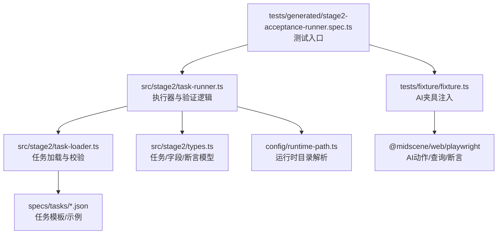
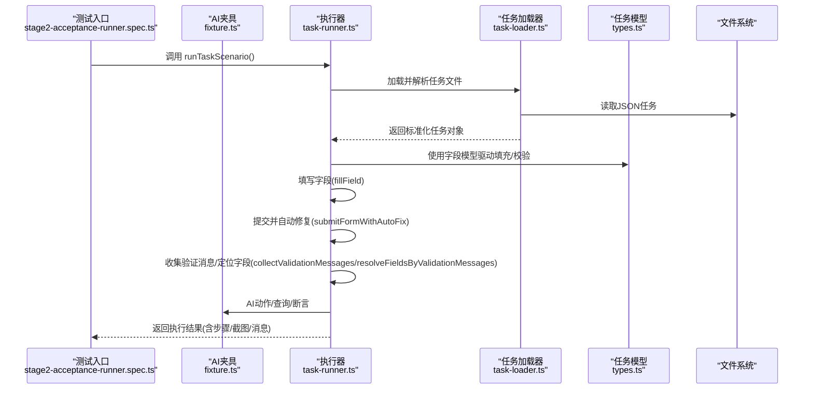
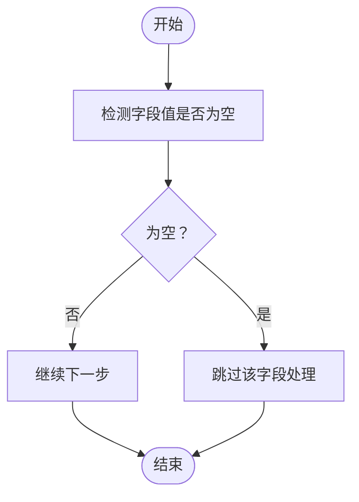
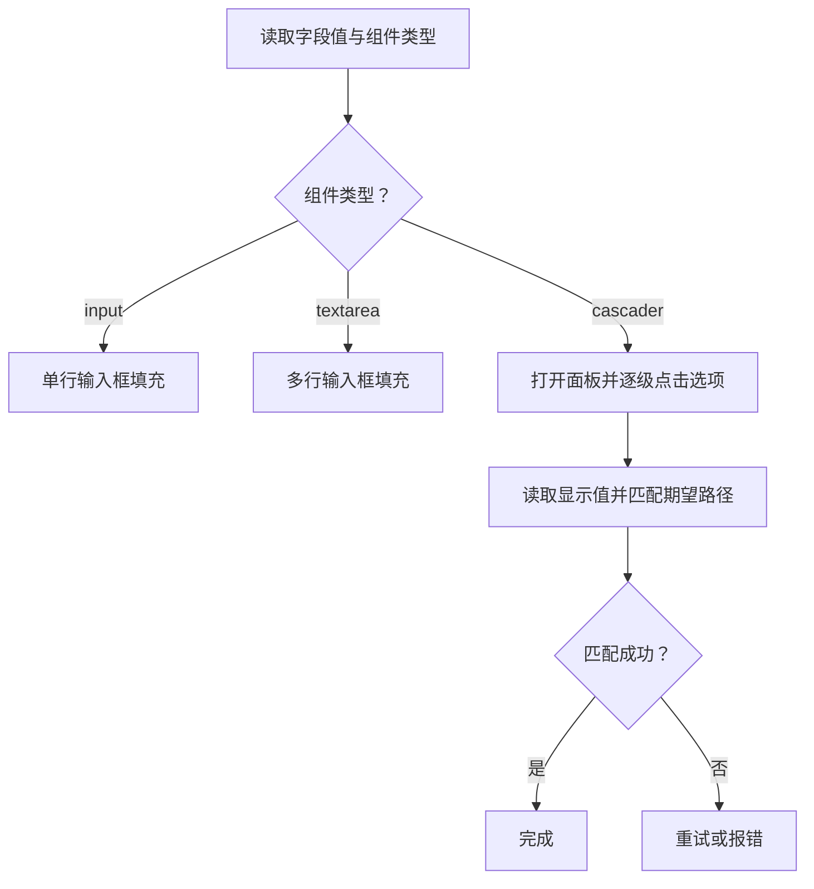
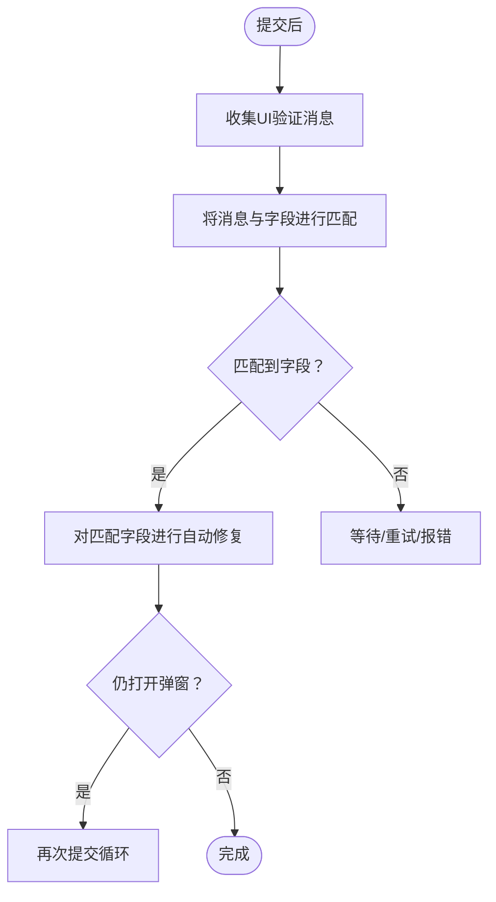
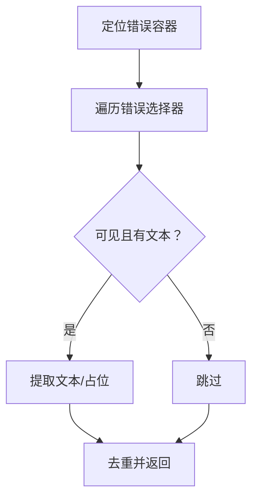
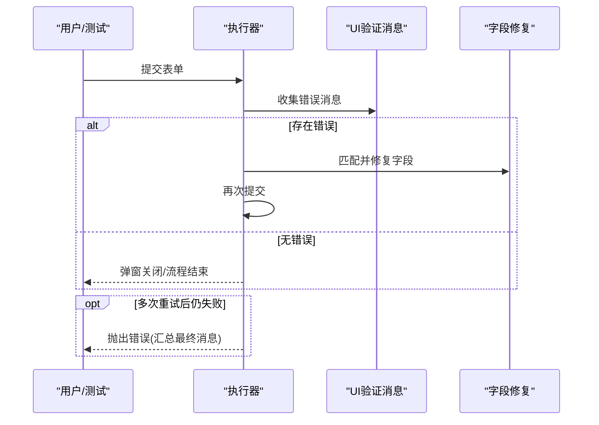
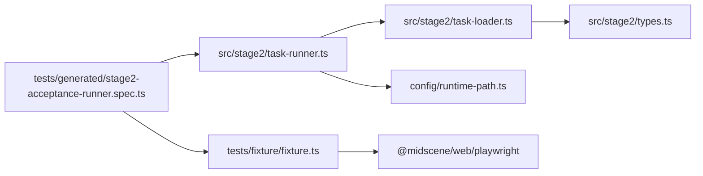

# 表单验证处理

<cite>
**本文引用的文件**
- [README.md](file://README.md)
- [package.json](file://package.json)
- [src/stage2/types.ts](file://src/stage2/types.ts)
- [src/stage2/task-runner.ts](file://src/stage2/task-runner.ts)
- [src/stage2/task-loader.ts](file://src/stage2/task-loader.ts)
- [specs/tasks/acceptance-task.template.json](file://specs/tasks/acceptance-task.template.json)
- [specs/tasks/acceptance-task.community-create.example.json](file://specs/tasks/acceptance-task.community-create.example.json)
- [tests/generated/stage2-acceptance-runner.spec.ts](file://tests/generated/stage2-acceptance-runner.spec.ts)
- [tests/fixture/fixture.ts](file://tests/fixture/fixture.ts)
- [config/runtime-path.ts](file://config/runtime-path.ts)
</cite>

## 目录
1. [简介](#简介)
2. [项目结构](#项目结构)
3. [核心组件](#核心组件)
4. [架构总览](#架构总览)
5. [详细组件分析](#详细组件分析)
6. [依赖分析](#依赖分析)
7. [性能考虑](#性能考虑)
8. [故障排查指南](#故障排查指南)
9. [结论](#结论)
10. [附录](#附录)

## 简介
本文件围绕“表单验证处理”的主题，系统梳理并解释该代码库中如何实现必填字段检查、格式验证策略、业务规则验证、验证消息收集与处理、验证失败的自动修复策略以及性能优化与AI辅助验证方法。文档以实际源码为依据，结合图示帮助读者快速理解从任务加载、表单填充、提交校验到自动修复的完整流程。

## 项目结构
该项目基于 Playwright 与 Midscene.js 的自动化测试框架，采用“任务驱动 + AI 辅助 + 自动化执行”的方式完成端到端验收流程。与表单验证直接相关的模块集中在 stage2 子系统，包含任务模型定义、任务加载器、执行器与运行时路径解析等。

图表来源
- [tests/generated/stage2-acceptance-runner.spec.ts](file://tests/generated/stage2-acceptance-runner.spec.ts#L1-L39)
- [src/stage2/task-runner.ts](file://src/stage2/task-runner.ts#L1062-L1344)
- [src/stage2/task-loader.ts](file://src/stage2/task-loader.ts#L79-L91)
- [specs/tasks/acceptance-task.template.json](file://specs/tasks/acceptance-task.template.json#L1-L85)
- [specs/tasks/acceptance-task.community-create.example.json](file://specs/tasks/acceptance-task.community-create.example.json#L1-L184)
- [src/stage2/types.ts](file://src/stage2/types.ts#L1-L125)
- [config/runtime-path.ts](file://config/runtime-path.ts#L1-L41)
- [tests/fixture/fixture.ts](file://tests/fixture/fixture.ts#L1-L100)

章节来源
- [README.md](file://README.md#L1-L144)
- [package.json](file://package.json#L1-L24)

## 核心组件
- 任务模型与字段定义：定义了表单字段的标签、组件类型、值、是否必填、唯一性等元信息，用于驱动验证与自动修复。
- 任务加载器：负责读取任务文件、进行基础形状校验、模板变量替换，并输出标准化的任务对象。
- 执行器：封装了表单填充、提交、验证消息采集、字段匹配与自动修复、断言等核心流程。
- 运行时路径：集中管理运行产物目录，便于结果与截图的落盘与定位。

章节来源
- [src/stage2/types.ts](file://src/stage2/types.ts#L23-L40)
- [src/stage2/task-loader.ts](file://src/stage2/task-loader.ts#L50-L89)
- [src/stage2/task-runner.ts](file://src/stage2/task-runner.ts#L1062-L1344)
- [config/runtime-path.ts](file://config/runtime-path.ts#L38-L41)

## 架构总览
下图展示了从测试入口到执行器、再到AI辅助与验证修复的整体流程：

图表来源
- [tests/generated/stage2-acceptance-runner.spec.ts](file://tests/generated/stage2-acceptance-runner.spec.ts#L18-L37)
- [src/stage2/task-runner.ts](file://src/stage2/task-runner.ts#L1062-L1344)
- [src/stage2/task-loader.ts](file://src/stage2/task-loader.ts#L79-L91)
- [src/stage2/types.ts](file://src/stage2/types.ts#L86-L98)
- [tests/fixture/fixture.ts](file://tests/fixture/fixture.ts#L23-L99)

## 详细组件分析

### 必填字段检查与空值检测
- 字段存在性与空值判断：通过统一的空值检测函数判断字段值是否为空（支持字符串与数组两种形态），用于跳过无效字段或作为验证消息定位的前置条件。
- 必填标记：字段模型包含必填标志，配合空值检测与验证消息匹配，决定是否触发自动修复。
- 级联字段路径校验：对于级联选择器，通过期望路径与实际显示值的匹配，间接实现“必填校验”。

图表来源
- [src/stage2/task-runner.ts](file://src/stage2/task-runner.ts#L155-L160)
- [src/stage2/types.ts](file://src/stage2/types.ts#L23-L30)

章节来源
- [src/stage2/task-runner.ts](file://src/stage2/task-runner.ts#L155-L160)
- [src/stage2/types.ts](file://src/stage2/types.ts#L23-L30)

### 格式验证策略
- 正则表达式与长度限制：代码中未直接使用正则表达式进行格式校验，而是通过“占位文案/提示文案”与“输入框属性”进行定位与填充，格式校验主要由前端UI组件或后端接口承担。
- 类型检查：字段模型区分输入框、多行输入框与级联选择器三类组件类型，执行器据此选择不同的填充策略与断言方式。
- 级联路径匹配：通过规范化后的实际显示值与期望路径进行包含关系匹配，实现对省市区等多级联动的格式一致性校验。

图表来源
- [src/stage2/task-runner.ts](file://src/stage2/task-runner.ts#L894-L971)
- [src/stage2/task-runner.ts](file://src/stage2/task-runner.ts#L323-L333)

章节来源
- [src/stage2/task-runner.ts](file://src/stage2/task-runner.ts#L894-L971)
- [src/stage2/task-runner.ts](file://src/stage2/task-runner.ts#L323-L333)
- [src/stage2/types.ts](file://src/stage2/types.ts#L23-L30)

### 业务规则验证
- 跨字段验证与依赖关系：通过“占位文案为...”等提示信息抽取候选标签，结合字段标签与常见提示词（如“请输入/请选择”）进行消息定位，从而识别哪些字段缺失或错误，实现跨字段的依赖关系检查。
- 自定义验证逻辑：执行器在提交后主动收集UI层面的错误提示，结合字段模型与提示文案，动态决定需要补全或修正的字段集合，形成“自定义验证逻辑”的行为。

图表来源
- [src/stage2/task-runner.ts](file://src/stage2/task-runner.ts#L973-L1018)
- [src/stage2/task-runner.ts](file://src/stage2/task-runner.ts#L335-L404)

章节来源
- [src/stage2/task-runner.ts](file://src/stage2/task-runner.ts#L973-L1018)
- [src/stage2/task-runner.ts](file://src/stage2/task-runner.ts#L335-L404)

### 验证消息的收集与处理
- 消息采集：遍历常见UI框架的错误提示选择器，过滤可见元素并提取文本或占位提示，去重后返回。
- 字段定位：将消息与字段标签、提示文案、常见引导语（请输入/请选择）进行模糊匹配，识别受影响字段。
- 用户反馈：执行器在失败时汇总最终验证消息，便于定位问题。

图表来源
- [src/stage2/task-runner.ts](file://src/stage2/task-runner.ts#L335-L364)
- [src/stage2/task-runner.ts](file://src/stage2/task-runner.ts#L366-L404)

章节来源
- [src/stage2/task-runner.ts](file://src/stage2/task-runner.ts#L335-L404)

### 验证失败的自动修复策略
- 重试机制：提交失败后最多重试固定次数，每次重试都会重新点击提交按钮、收集验证消息并自动修复匹配字段。
- 回滚处理：若多次重试仍无法关闭弹窗，则记录最终验证消息并抛出错误，避免无限循环。
- 截图与定位：在关键步骤（如级联选择）生成截图，便于问题复现与定位。

图表来源
- [src/stage2/task-runner.ts](file://src/stage2/task-runner.ts#L973-L1018)

章节来源
- [src/stage2/task-runner.ts](file://src/stage2/task-runner.ts#L973-L1018)

### AI辅助验证与智能定位
- AI动作/查询/断言：通过夹具注入的AI能力，对页面进行自然语言描述的动作执行、结构化数据查询与断言等待，提升复杂场景下的稳定性与鲁棒性。
- 验证消息辅助：在字段定位困难时，借助AI查询/断言能力进行二次确认与辅助修复。

章节来源
- [tests/fixture/fixture.ts](file://tests/fixture/fixture.ts#L23-L99)
- [src/stage2/task-runner.ts](file://src/stage2/task-runner.ts#L1020-L1060)

## 依赖分析
- 组件耦合：执行器依赖任务模型与加载器；测试入口依赖执行器；AI夹具为执行器提供自然语言交互能力。
- 外部依赖：Playwright 与 Midscene.js 提供页面自动化与AI能力；dotenv 用于环境变量解析；运行时路径统一收敛产物目录。

图表来源
- [tests/generated/stage2-acceptance-runner.spec.ts](file://tests/generated/stage2-acceptance-runner.spec.ts#L1-L39)
- [src/stage2/task-runner.ts](file://src/stage2/task-runner.ts#L1062-L1344)
- [src/stage2/task-loader.ts](file://src/stage2/task-loader.ts#L79-L91)
- [src/stage2/types.ts](file://src/stage2/types.ts#L1-L125)
- [config/runtime-path.ts](file://config/runtime-path.ts#L1-L41)
- [tests/fixture/fixture.ts](file://tests/fixture/fixture.ts#L1-L100)

章节来源
- [package.json](file://package.json#L13-L22)
- [README.md](file://README.md#L3-L52)

## 性能考虑
- 选择器与可见性检测：优先使用可见性检测减少无效交互，降低页面抖动与重绘开销。
- 去重与规范化：对消息与标签进行去重与规范化处理，避免重复匹配与误判。
- 截图与日志：按需生成截图与中间结果，避免在高频重试中产生过多IO。
- 超时控制：为页面加载、元素可见、提交等待设置合理超时，防止长时间阻塞。

## 故障排查指南
- 首页加载超时：检查目标URL与菜单提示文本，确认首页加载条件满足。
- 弹窗未出现：核对弹窗标题与打开按钮文案，必要时启用AI动作进行定位。
- 提交后弹窗不关闭：查看最终验证消息，确认是否仍有必填字段缺失或格式错误。
- 级联选择失败：检查期望路径与UI层级，适当增加重试次数或调整截图检测策略。
- 滑块验证码：根据配置模式选择自动/人工/失败/忽略策略，并调整等待超时时间。

章节来源
- [src/stage2/task-runner.ts](file://src/stage2/task-runner.ts#L1170-L1202)
- [src/stage2/task-runner.ts](file://src/stage2/task-runner.ts#L647-L703)
- [README.md](file://README.md#L54-L72)

## 结论
该代码库通过“任务驱动 + AI辅助 + 自动化执行”的方式，实现了对表单验证的闭环处理：以字段模型为依据进行必填与类型检查，以UI验证消息为线索进行自动修复，并在失败时提供清晰的错误定位与回退策略。配合合理的性能优化与运行时路径管理，能够在复杂前端界面中稳定地完成端到端验收流程。

## 附录
- 任务模板与示例：包含字段定义、断言与运行时参数，便于快速扩展与复用。
- 环境变量：通过 dotenv 管理运行时目录与任务文件路径，便于本地与CI环境统一配置。

章节来源
- [specs/tasks/acceptance-task.template.json](file://specs/tasks/acceptance-task.template.json#L1-L85)
- [specs/tasks/acceptance-task.community-create.example.json](file://specs/tasks/acceptance-task.community-create.example.json#L1-L184)
- [README.md](file://README.md#L39-L52)
- [config/runtime-path.ts](file://config/runtime-path.ts#L8-L41)