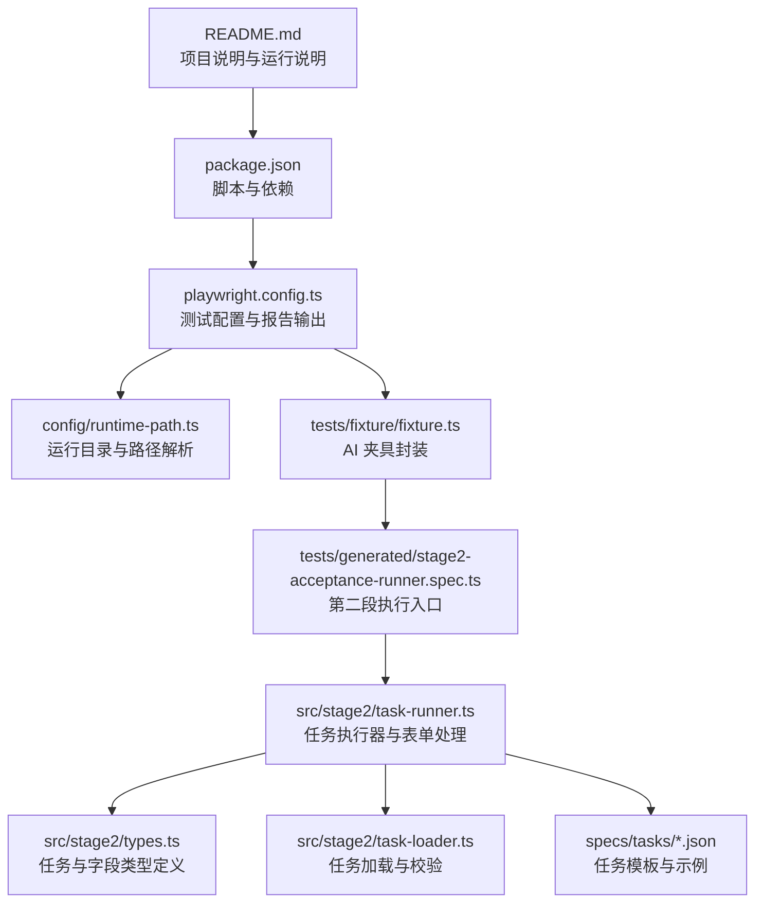
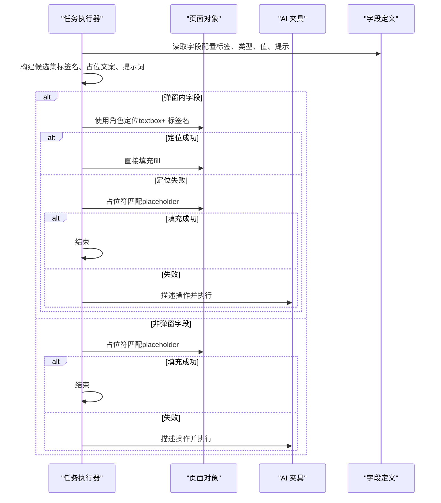
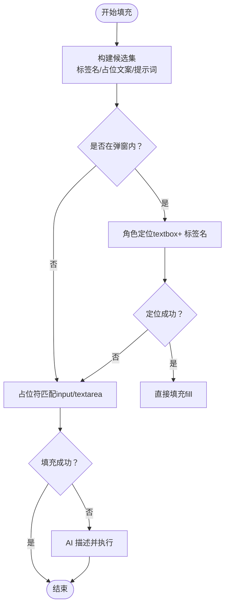
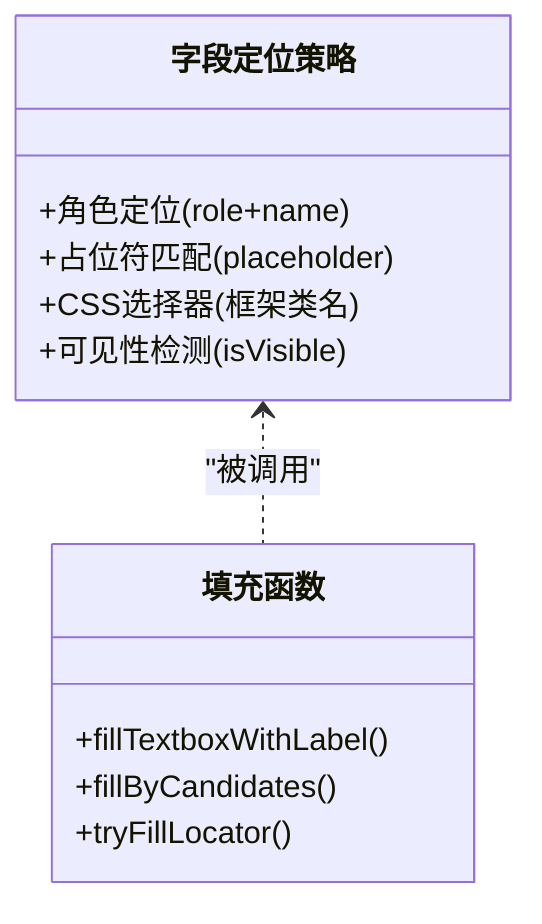
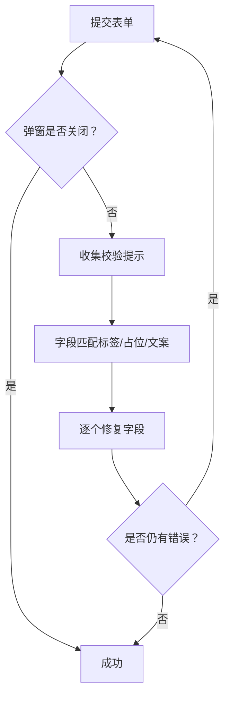
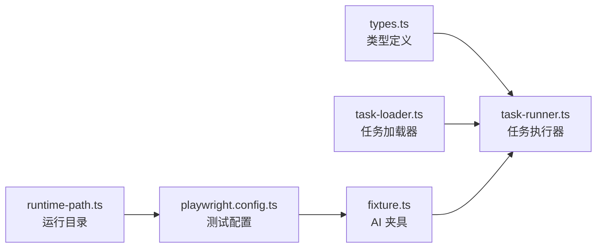

# 静态表单控件

<cite>
**本文引用的文件**
- [README.md](file://README.md)
- [package.json](file://package.json)
- [playwright.config.ts](file://playwright.config.ts)
- [config/runtime-path.ts](file://config/runtime-path.ts)
- [tests/fixture/fixture.ts](file://tests/fixture/fixture.ts)
- [tests/generated/stage2-acceptance-runner.spec.ts](file://tests/generated/stage2-acceptance-runner.spec.ts)
- [src/stage2/types.ts](file://src/stage2/types.ts)
- [src/stage2/task-runner.ts](file://src/stage2/task-runner.ts)
- [src/stage2/task-loader.ts](file://src/stage2/task-loader.ts)
- [specs/tasks/acceptance-task.template.json](file://specs/tasks/acceptance-task.template.json)
- [specs/tasks/acceptance-task.community-create.example.json](file://specs/tasks/acceptance-task.community-create.example.json)
</cite>

## 目录
1. [简介](#简介)
2. [项目结构](#项目结构)
3. [核心组件](#核心组件)
4. [架构概览](#架构概览)
5. [详细组件分析](#详细组件分析)
6. [依赖关系分析](#依赖关系分析)
7. [性能考虑](#性能考虑)
8. [故障排查指南](#故障排查指南)
9. [结论](#结论)
10. [附录](#附录)

## 简介
本文件聚焦于静态表单控件的处理机制，涵盖文本输入框、密码框、文本域等基础输入控件的定位与填充策略。文档详细说明了三种输入值填充策略：直接填充、占位符匹配、可见性检测；解释了多种定位方法：通过标签名、占位符、CSS 选择器等；并提供了输入验证的实现细节，包括值的读取、格式化与清理。最后给出实际代码示例的路径指引与常见问题的解决方案。

## 项目结构
该项目基于 Playwright 与 Midscene.js 构建，采用分层设计：
- 配置层：运行目录、环境变量与 Playwright 报告配置
- 夹具层：封装 AI 能力（ai、aiQuery、aiAssert、aiWaitFor）
- 执行层：第二段任务驱动器，负责表单字段解析、定位与填充、提交与断言
- 任务模板：JSON 驱动的任务定义，描述表单字段、断言与运行时参数

**图表来源**
- [README.md](file://README.md#L1-L144)
- [package.json](file://package.json#L1-L24)
- [playwright.config.ts](file://playwright.config.ts#L1-L95)
- [config/runtime-path.ts](file://config/runtime-path.ts#L1-L41)
- [tests/fixture/fixture.ts](file://tests/fixture/fixture.ts#L1-L100)
- [tests/generated/stage2-acceptance-runner.spec.ts](file://tests/generated/stage2-acceptance-runner.spec.ts#L1-L39)
- [src/stage2/task-runner.ts](file://src/stage2/task-runner.ts#L1-L1344)
- [src/stage2/types.ts](file://src/stage2/types.ts#L1-L125)
- [src/stage2/task-loader.ts](file://src/stage2/task-loader.ts#L1-L120)
- [specs/tasks/acceptance-task.template.json](file://specs/tasks/acceptance-task.template.json#L1-L85)
- [specs/tasks/acceptance-task.community-create.example.json](file://specs/tasks/acceptance-task.community-create.example.json#L1-L184)

**章节来源**
- [README.md](file://README.md#L1-L144)
- [package.json](file://package.json#L1-L24)
- [playwright.config.ts](file://playwright.config.ts#L1-L95)
- [config/runtime-path.ts](file://config/runtime-path.ts#L1-L41)
- [tests/fixture/fixture.ts](file://tests/fixture/fixture.ts#L1-L100)
- [tests/generated/stage2-acceptance-runner.spec.ts](file://tests/generated/stage2-acceptance-runner.spec.ts#L1-L39)
- [src/stage2/task-runner.ts](file://src/stage2/task-runner.ts#L1-L1344)
- [src/stage2/types.ts](file://src/stage2/types.ts#L1-L125)
- [src/stage2/task-loader.ts](file://src/stage2/task-loader.ts#L1-L120)
- [specs/tasks/acceptance-task.template.json](file://specs/tasks/acceptance-task.template.json#L1-L85)
- [specs/tasks/acceptance-task.community-create.example.json](file://specs/tasks/acceptance-task.community-create.example.json#L1-L184)

## 核心组件
- 任务驱动器（task-runner.ts）：负责表单字段解析、定位与填充、提交与断言、验证码处理、截图与进度记录
- 类型定义（types.ts）：定义任务、字段、表单、断言等结构
- 任务加载器（task-loader.ts）：加载与校验任务 JSON，支持模板变量解析
- 夹具（fixture.ts）：封装 AI 能力，提供 ai、aiQuery、aiAssert、aiWaitFor
- 运行配置（playwright.config.ts、runtime-path.ts）：统一管理运行目录、报告输出与路径解析

**章节来源**
- [src/stage2/task-runner.ts](file://src/stage2/task-runner.ts#L1-L1344)
- [src/stage2/types.ts](file://src/stage2/types.ts#L1-L125)
- [src/stage2/task-loader.ts](file://src/stage2/task-loader.ts#L1-L120)
- [tests/fixture/fixture.ts](file://tests/fixture/fixture.ts#L1-L100)
- [playwright.config.ts](file://playwright.config.ts#L1-L95)
- [config/runtime-path.ts](file://config/runtime-path.ts#L1-L41)

## 架构概览
静态表单控件处理的整体流程：
- 解析任务 JSON，构建字段候选集（标签名、占位文案、提示词）
- 在弹窗上下文中优先使用角色定位（role）与标签名匹配
- 回退到占位符匹配与可见性检测
- 对文本域与级联选择器分别处理
- 提交后收集校验提示，自动修复缺失字段并重试
- 记录截图与进度，最终生成结果文件

**图表来源**
- [src/stage2/task-runner.ts](file://src/stage2/task-runner.ts#L894-L971)
- [src/stage2/task-runner.ts](file://src/stage2/task-runner.ts#L815-L844)
- [src/stage2/task-runner.ts](file://src/stage2/task-runner.ts#L256-L274)
- [src/stage2/task-runner.ts](file://src/stage2/task-runner.ts#L411-L448)
- [tests/fixture/fixture.ts](file://tests/fixture/fixture.ts#L23-L99)

**章节来源**
- [src/stage2/task-runner.ts](file://src/stage2/task-runner.ts#L815-L971)
- [src/stage2/task-runner.ts](file://src/stage2/task-runner.ts#L256-L274)
- [src/stage2/task-runner.ts](file://src/stage2/task-runner.ts#L411-L448)
- [tests/fixture/fixture.ts](file://tests/fixture/fixture.ts#L23-L99)

## 详细组件分析

### 输入值填充策略
- 直接填充（角色定位 + 标签名）
  - 通过页面角色定位器（如 textbox）结合标签名进行精确匹配
  - 适用于弹窗内字段或具备明确语义的角色元素
  - 示例路径：[fillTextboxWithLabel](file://src/stage2/task-runner.ts#L815-L844)
- 占位符匹配（placeholder）
  - 基于占位符文案进行模糊匹配，适配不同语言与文案变化
  - 支持 input 与 textarea
  - 示例路径：[fillByCandidates](file://src/stage2/task-runner.ts#L256-L274)
- 可见性检测（isVisible）
  - 在定位后检查元素可见性，避免误触隐藏或不可见元素
  - 示例路径：[tryFillLocator](file://src/stage2/task-runner.ts#L430-L448)、[tryClickLocator](file://src/stage2/task-runner.ts#L411-L428)

**图表来源**
- [src/stage2/task-runner.ts](file://src/stage2/task-runner.ts#L894-L971)
- [src/stage2/task-runner.ts](file://src/stage2/task-runner.ts#L815-L844)
- [src/stage2/task-runner.ts](file://src/stage2/task-runner.ts#L256-L274)
- [src/stage2/task-runner.ts](file://src/stage2/task-runner.ts#L411-L448)

**章节来源**
- [src/stage2/task-runner.ts](file://src/stage2/task-runner.ts#L815-L971)
- [src/stage2/task-runner.ts](file://src/stage2/task-runner.ts#L256-L274)
- [src/stage2/task-runner.ts](file://src/stage2/task-runner.ts#L411-L448)

### 输入控件定位方法
- 通过标签名（role + name）
  - 使用页面角色定位器（如 textbox、button）并结合正则匹配标签名
  - 示例路径：[fillTextboxWithLabel](file://src/stage2/task-runner.ts#L815-L844)、[clickButtonWithCandidates](file://src/stage2/task-runner.ts#L787-L813)
- 通过占位符（placeholder）
  - 针对 input 与 textarea，使用包含占位符的 CSS 选择器
  - 示例路径：[fillByCandidates](file://src/stage2/task-runner.ts#L256-L274)
- 通过 CSS 选择器
  - 针对特定框架（如 Element Plus、Ant Design Vue、iView）的输入类名
  - 示例路径：[buildCascaderInputCandidates](file://src/stage2/task-runner.ts#L204-L225)

**图表来源**
- [src/stage2/task-runner.ts](file://src/stage2/task-runner.ts#L815-L844)
- [src/stage2/task-runner.ts](file://src/stage2/task-runner.ts#L256-L274)
- [src/stage2/task-runner.ts](file://src/stage2/task-runner.ts#L430-L448)
- [src/stage2/task-runner.ts](file://src/stage2/task-runner.ts#L204-L225)

**章节来源**
- [src/stage2/task-runner.ts](file://src/stage2/task-runner.ts#L815-L844)
- [src/stage2/task-runner.ts](file://src/stage2/task-runner.ts#L256-L274)
- [src/stage2/task-runner.ts](file://src/stage2/task-runner.ts#L430-L448)
- [src/stage2/task-runner.ts](file://src/stage2/task-runner.ts#L204-L225)

### 输入验证与清理
- 值读取与清理
  - 优先使用 inputValue 获取真实值；若失败则回退到 value 属性
  - 示例路径：[readInputDisplayValue](file://src/stage2/task-runner.ts#L289-L307)
- 校验提示收集
  - 统一收集框架特定的错误提示类名（Element Plus、Ant Design Vue、iView）
  - 示例路径：[collectValidationMessages](file://src/stage2/task-runner.ts#L335-L364)
- 字段匹配与自动修复
  - 将错误提示与字段标签进行归一化匹配，识别缺失或格式错误的字段
  - 示例路径：[resolveFieldsByValidationMessages](file://src/stage2/task-runner.ts#L366-L404)
- 提交与重试
  - 提交后若弹窗未关闭，自动收集提示并逐个修复字段，最多重试若干次
  - 示例路径：[submitFormWithAutoFix](file://src/stage2/task-runner.ts#L973-L1018)

**图表来源**
- [src/stage2/task-runner.ts](file://src/stage2/task-runner.ts#L973-L1018)
- [src/stage2/task-runner.ts](file://src/stage2/task-runner.ts#L335-L404)
- [src/stage2/task-runner.ts](file://src/stage2/task-runner.ts#L289-L307)

**章节来源**
- [src/stage2/task-runner.ts](file://src/stage2/task-runner.ts#L289-L307)
- [src/stage2/task-runner.ts](file://src/stage2/task-runner.ts#L335-L404)
- [src/stage2/task-runner.ts](file://src/stage2/task-runner.ts#L973-L1018)

### 实际代码示例（路径指引）
- 文本输入框填充（角色定位 + 标签名）
  - 示例路径：[fillTextboxWithLabel](file://src/stage2/task-runner.ts#L815-L844)
- 文本域填充（占位符匹配）
  - 示例路径：[fillByCandidates](file://src/stage2/task-runner.ts#L256-L274)
- 级联选择器（省市区）
  - 打开面板：[openCascaderPanel](file://src/stage2/task-runner.ts#L705-L721)
  - 点击选项：[clickCascaderOption](file://src/stage2/task-runner.ts#L723-L785)
  - 读取显示值：[readCascaderDisplayValue](file://src/stage2/task-runner.ts#L309-L321)
- 提交与自动修复
  - 示例路径：[submitFormWithAutoFix](file://src/stage2/task-runner.ts#L973-L1018)
- 值读取与清理
  - 示例路径：[readInputDisplayValue](file://src/stage2/task-runner.ts#L289-L307)

**章节来源**
- [src/stage2/task-runner.ts](file://src/stage2/task-runner.ts#L815-L844)
- [src/stage2/task-runner.ts](file://src/stage2/task-runner.ts#L256-L274)
- [src/stage2/task-runner.ts](file://src/stage2/task-runner.ts#L705-L785)
- [src/stage2/task-runner.ts](file://src/stage2/task-runner.ts#L309-L321)
- [src/stage2/task-runner.ts](file://src/stage2/task-runner.ts#L973-L1018)
- [src/stage2/task-runner.ts](file://src/stage2/task-runner.ts#L289-L307)

## 依赖关系分析
- 任务驱动器依赖类型定义与任务加载器，以确保字段结构与任务完整性
- 夹具提供 AI 能力，作为回退策略在定位与填充失败时执行
- 运行配置统一管理输出目录与报告，保证产物一致性

**图表来源**
- [src/stage2/types.ts](file://src/stage2/types.ts#L1-L125)
- [src/stage2/task-runner.ts](file://src/stage2/task-runner.ts#L1-L1344)
- [src/stage2/task-loader.ts](file://src/stage2/task-loader.ts#L1-L120)
- [tests/fixture/fixture.ts](file://tests/fixture/fixture.ts#L1-L100)
- [playwright.config.ts](file://playwright.config.ts#L1-L95)
- [config/runtime-path.ts](file://config/runtime-path.ts#L1-L41)

**章节来源**
- [src/stage2/types.ts](file://src/stage2/types.ts#L1-L125)
- [src/stage2/task-runner.ts](file://src/stage2/task-runner.ts#L1-L1344)
- [src/stage2/task-loader.ts](file://src/stage2/task-loader.ts#L1-L120)
- [tests/fixture/fixture.ts](file://tests/fixture/fixture.ts#L1-L100)
- [playwright.config.ts](file://playwright.config.ts#L1-L95)
- [config/runtime-path.ts](file://config/runtime-path.ts#L1-L41)

## 性能考虑
- 可见性检测与计数优化：在定位后先 count 再遍历可见项，减少不必要的交互
- 正则与转义：对标签名与占位符进行转义与归一化，避免正则误匹配
- 重试与等待：提交后等待与重试次数可控，避免无限循环
- 截图与进度：按步骤截图与进度文件写入，便于定位问题但需控制频率以免影响性能

[本节为通用指导，无需列出具体文件来源]

## 故障排查指南
- 定位不到输入框
  - 检查是否在弹窗上下文内，优先使用角色定位 + 标签名
  - 若失败，尝试占位符匹配与 CSS 选择器
  - 示例路径：[fillTextboxWithLabel](file://src/stage2/task-runner.ts#L815-L844)、[fillByCandidates](file://src/stage2/task-runner.ts#L256-L274)
- 填充无效或值为空
  - 使用值读取函数检查真实值，必要时清理前后空白
  - 示例路径：[readInputDisplayValue](file://src/stage2/task-runner.ts#L289-L307)
- 提交后弹窗未关闭
  - 收集校验提示并自动修复缺失字段，最多重试若干次
  - 示例路径：[submitFormWithAutoFix](file://src/stage2/task-runner.ts#L973-L1018)
- 级联选择器无法选中
  - 打开面板后逐级点击，每步截图便于回溯
  - 示例路径：[openCascaderPanel](file://src/stage2/task-runner.ts#L705-L721)、[clickCascaderOption](file://src/stage2/task-runner.ts#L723-L785)
- 验证码阻塞
  - 根据配置自动处理滑块验证码或人工等待
  - 示例路径：[handleCaptchaChallengeIfNeeded](file://src/stage2/task-runner.ts#L647-L703)

**章节来源**
- [src/stage2/task-runner.ts](file://src/stage2/task-runner.ts#L815-L844)
- [src/stage2/task-runner.ts](file://src/stage2/task-runner.ts#L256-L274)
- [src/stage2/task-runner.ts](file://src/stage2/task-runner.ts#L289-L307)
- [src/stage2/task-runner.ts](file://src/stage2/task-runner.ts#L973-L1018)
- [src/stage2/task-runner.ts](file://src/stage2/task-runner.ts#L705-L785)
- [src/stage2/task-runner.ts](file://src/stage2/task-runner.ts#L647-L703)

## 结论
本项目通过“角色定位 + 标签名”的优先策略与“占位符匹配 + 可见性检测”的回退机制，实现了对静态表单控件的稳健处理。配合自动修复与重试、统一的值读取与清理、以及清晰的错误提示收集，能够在复杂页面结构与多框架环境下可靠地完成表单填写与提交。建议在实际使用中结合任务模板与夹具能力，针对不同页面定制候选集与提示词，以提升稳定性与可维护性。

[本节为总结性内容，无需列出具体文件来源]

## 附录
- 任务模板与示例
  - 模板文件：[acceptance-task.template.json](file://specs/tasks/acceptance-task.template.json#L1-L85)
  - 示例任务：[acceptance-task.community-create.example.json](file://specs/tasks/acceptance-task.community-create.example.json#L1-L184)
- 运行与报告
  - 运行说明与报告目录：[README.md](file://README.md#L74-L131)
  - 配置与脚本：[package.json](file://package.json#L1-L24)、[playwright.config.ts](file://playwright.config.ts#L1-L95)

**章节来源**
- [specs/tasks/acceptance-task.template.json](file://specs/tasks/acceptance-task.template.json#L1-L85)
- [specs/tasks/acceptance-task.community-create.example.json](file://specs/tasks/acceptance-task.community-create.example.json#L1-L184)
- [README.md](file://README.md#L74-L131)
- [package.json](file://package.json#L1-L24)
- [playwright.config.ts](file://playwright.config.ts#L1-L95)