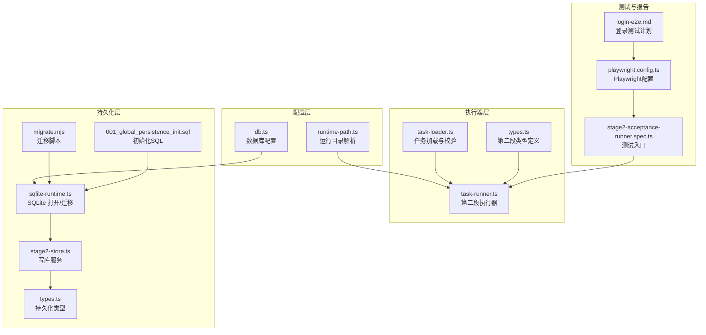
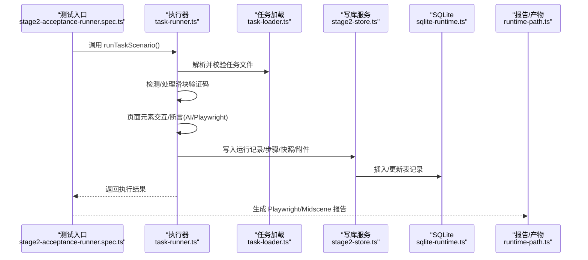
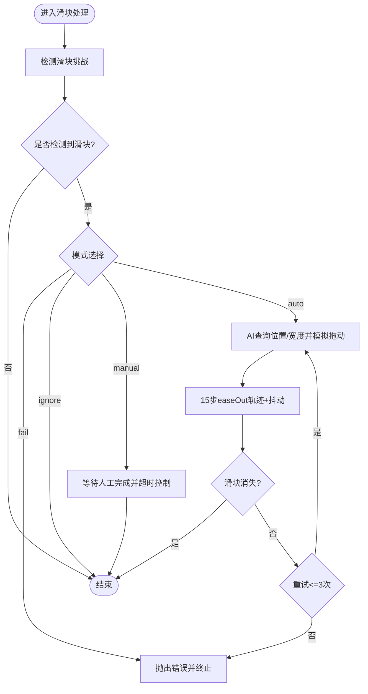
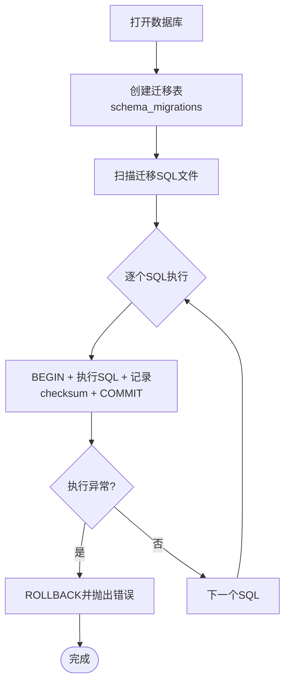
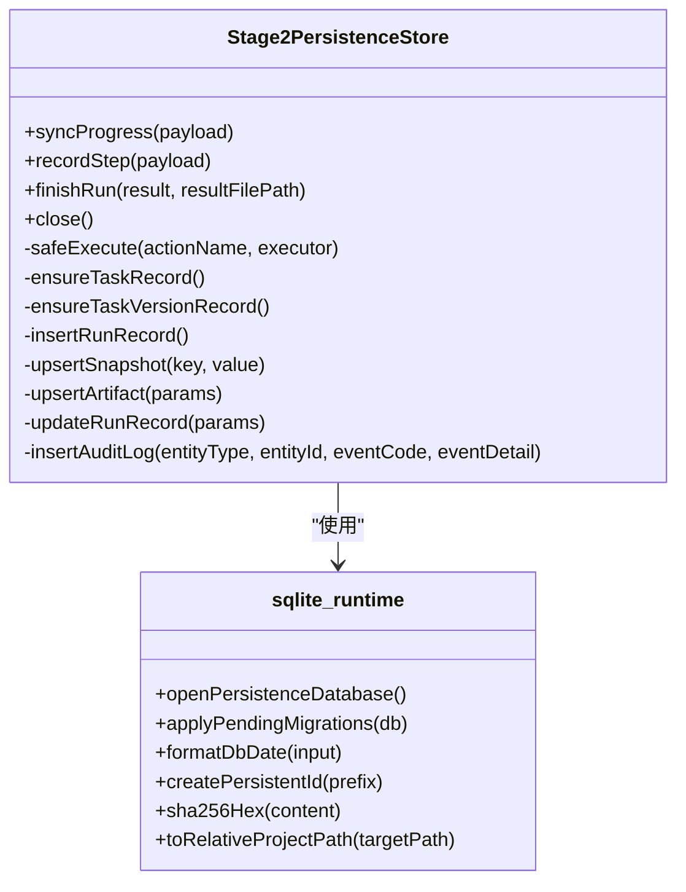
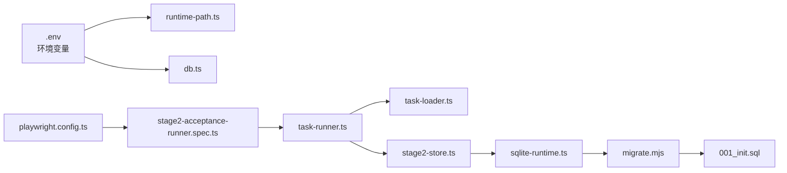

# 故障排查

<cite>
**本文引用的文件**   
- [README.md](file://README.md)
- [package.json](file://package.json)
- [playwright.config.ts](file://playwright.config.ts)
- [config/runtime-path.ts](file://config/runtime-path.ts)
- [config/db.ts](file://config/db.ts)
- [src/persistence/sqlite-runtime.ts](file://src/persistence/sqlite-runtime.ts)
- [src/persistence/stage2-store.ts](file://src/persistence/stage2-store.ts)
- [src/persistence/types.ts](file://src/persistence/types.ts)
- [src/stage2/task-runner.ts](file://src/stage2/task-runner.ts)
- [src/stage2/task-loader.ts](file://src/stage2/task-loader.ts)
- [src/stage2/types.ts](file://src/stage2/types.ts)
- [scripts/db/migrate.mjs](file://scripts/db/migrate.mjs)
- [db/migrations/001_global_persistence_init.sql](file://db/migrations/001_global_persistence_init.sql)
- [tests/generated/stage2-acceptance-runner.spec.ts](file://tests/generated/stage2-acceptance-runner.spec.ts)
- [specs/login-e2e.md](file://specs/login-e2e.md)
- [AGENTS.md](file://AGENTS.md)
</cite>

## 目录
1. [简介](#简介)
2. [项目结构](#项目结构)
3. [核心组件](#核心组件)
4. [架构总览](#架构总览)
5. [详细组件分析](#详细组件分析)
6. [依赖关系分析](#依赖关系分析)
7. [性能考虑](#性能考虑)
8. [故障排查指南](#故障排查指南)
9. [结论](#结论)
10. [附录](#附录)

## 简介
本指南面向使用基于 Playwright 与 Midscene.js 的 AI 自动化测试项目的工程师与测试人员，聚焦于常见问题的识别与解决、调试模式与日志分析、性能诊断、错误代码对照与解决方案索引、生产环境紧急修复与回滚策略，以及与 AI 集成相关的参数调整建议。文档结合仓库中的配置、执行器与持久化层，提供可操作的排障步骤与可视化图示。

## 项目结构
项目采用“配置收敛 + 执行器 + 持久化”的分层组织：
- 配置层：集中管理运行目录、数据库路径与环境变量解析
- 执行器层：第二段任务执行器负责滑块验证码处理、页面元素交互、断言与清理
- 持久化层：SQLite 本地数据库，落地任务、运行、步骤、快照与附件元数据
- 测试入口：Playwright 测试入口调用执行器，产出报告与结果

**图表来源**
- [config/runtime-path.ts:1-41](file://config/runtime-path.ts#L1-L41)
- [config/db.ts:1-28](file://config/db.ts#L1-L28)
- [src/stage2/task-runner.ts:1-800](file://src/stage2/task-runner.ts#L1-L800)
- [src/stage2/task-loader.ts:1-91](file://src/stage2/task-loader.ts#L1-L91)
- [src/stage2/types.ts:1-180](file://src/stage2/types.ts#L1-L180)
- [src/persistence/sqlite-runtime.ts:1-116](file://src/persistence/sqlite-runtime.ts#L1-L116)
- [src/persistence/stage2-store.ts:1-655](file://src/persistence/stage2-store.ts#L1-L655)
- [src/persistence/types.ts:1-125](file://src/persistence/types.ts#L1-L125)
- [scripts/db/migrate.mjs:1-52](file://scripts/db/migrate.mjs#L1-L52)
- [db/migrations/001_global_persistence_init.sql:1-128](file://db/migrations/001_global_persistence_init.sql#L1-L128)
- [playwright.config.ts:1-95](file://playwright.config.ts#L1-L95)
- [tests/generated/stage2-acceptance-runner.spec.ts:1-39](file://tests/generated/stage2-acceptance-runner.spec.ts#L1-L39)
- [specs/login-e2e.md:1-152](file://specs/login-e2e.md#L1-L152)

**章节来源**
- [README.md:1-223](file://README.md#L1-L223)
- [package.json:1-26](file://package.json#L1-L26)
- [playwright.config.ts:1-95](file://playwright.config.ts#L1-L95)
- [config/runtime-path.ts:1-41](file://config/runtime-path.ts#L1-L41)
- [config/db.ts:1-28](file://config/db.ts#L1-L28)
- [src/persistence/sqlite-runtime.ts:1-116](file://src/persistence/sqlite-runtime.ts#L1-L116)
- [src/persistence/stage2-store.ts:1-655](file://src/persistence/stage2-store.ts#L1-L655)
- [src/stage2/task-runner.ts:1-800](file://src/stage2/task-runner.ts#L1-L800)
- [src/stage2/task-loader.ts:1-91](file://src/stage2/task-loader.ts#L1-L91)
- [scripts/db/migrate.mjs:1-52](file://scripts/db/migrate.mjs#L1-L52)
- [db/migrations/001_global_persistence_init.sql:1-128](file://db/migrations/001_global_persistence_init.sql#L1-L128)
- [tests/generated/stage2-acceptance-runner.spec.ts:1-39](file://tests/generated/stage2-acceptance-runner.spec.ts#L1-L39)
- [specs/login-e2e.md:1-152](file://specs/login-e2e.md#L1-L152)
- [AGENTS.md:1-61](file://AGENTS.md#L1-L61)

## 核心组件
- 运行目录与环境变量
  - 通过集中配置模块解析 RUNTIME_DIR_PREFIX、PLAYWRIGHT_OUTPUT_DIR、PLAYWRIGHT_HTML_REPORT_DIR、MIDSCENE_RUN_DIR、ACCEPTANCE_RESULT_DIR 等，确保产物目录收敛与可追踪。
- 数据库与迁移
  - 通过 db.ts 读取 DB_DRIVER 与 DB_FILE_PATH，sqlite-runtime.ts 打开 SQLite 数据库并应用迁移脚本，保证表结构一致性与幂等。
- 第二段执行器
  - task-runner.ts 负责滑块验证码自动/人工处理、页面元素匹配、AI 查询与断言、步骤执行与截图、清理策略等。
- 持久化写库
  - stage2-store.ts 将任务、运行、步骤、快照与附件写入数据库，同时记录审计日志，便于回溯与分析。
- 测试入口与报告
  - playwright.config.ts 配置 reporter、trace、workers 等；测试入口 tests/generated/stage2-acceptance-runner.spec.ts 调用执行器并断言结果。

**章节来源**
- [config/runtime-path.ts:1-41](file://config/runtime-path.ts#L1-L41)
- [config/db.ts:1-28](file://config/db.ts#L1-L28)
- [src/persistence/sqlite-runtime.ts:1-116](file://src/persistence/sqlite-runtime.ts#L1-L116)
- [src/persistence/stage2-store.ts:1-655](file://src/persistence/stage2-store.ts#L1-L655)
- [src/stage2/task-runner.ts:1-800](file://src/stage2/task-runner.ts#L1-L800)
- [playwright.config.ts:1-95](file://playwright.config.ts#L1-L95)
- [tests/generated/stage2-acceptance-runner.spec.ts:1-39](file://tests/generated/stage2-acceptance-runner.spec.ts#L1-L39)

## 架构总览
下图展示从测试入口到执行器、AI 与数据库的交互路径，以及产物落盘与报告生成：

**图表来源**
- [tests/generated/stage2-acceptance-runner.spec.ts:1-39](file://tests/generated/stage2-acceptance-runner.spec.ts#L1-L39)
- [src/stage2/task-runner.ts:1-800](file://src/stage2/task-runner.ts#L1-L800)
- [src/stage2/task-loader.ts:1-91](file://src/stage2/task-loader.ts#L1-L91)
- [src/persistence/stage2-store.ts:1-655](file://src/persistence/stage2-store.ts#L1-L655)
- [src/persistence/sqlite-runtime.ts:1-116](file://src/persistence/sqlite-runtime.ts#L1-L116)
- [config/runtime-path.ts:1-41](file://config/runtime-path.ts#L1-L41)

## 详细组件分析

### 组件A：滑块验证码处理与页面元素匹配
- 滑块检测与自动处理
  - 通过文本关键词与选择器组合检测滑块挑战；AI 查询滑块位置与滑槽宽度；Playwright 模拟拖动轨迹（15步、easeOut、随机抖动）；最多重试3次。
- 页面元素匹配
  - 提供多候选定位器与可见性判断，支持级联选择器、对话框定位、占位文案匹配、可见索引定位等策略。
- 人工/失败/忽略模式
  - 支持 manual/fail/ignore/auto 四种模式，配合等待超时控制。

**图表来源**
- [src/stage2/task-runner.ts:483-706](file://src/stage2/task-runner.ts#L483-L706)

**章节来源**
- [src/stage2/task-runner.ts:35-75](file://src/stage2/task-runner.ts#L35-L75)
- [src/stage2/task-runner.ts:483-706](file://src/stage2/task-runner.ts#L483-L706)

### 组件B：数据库初始化与迁移
- 驱动与路径
  - 仅支持 sqlite 驱动；DB_FILE_PATH 默认位于运行目录下。
- 迁移机制
  - 通过 migrate.mjs 读取 migrations 目录 SQL 文件，记录 checksum 与执行时间，事务包裹执行与回滚。
- 表结构
  - 初始化包含 ai_task、ai_task_version、ai_run、ai_run_step、ai_snapshot、ai_artifact、ai_audit_log 等表，含索引与外键约束。

**图表来源**
- [src/persistence/sqlite-runtime.ts:86-114](file://src/persistence/sqlite-runtime.ts#L86-L114)
- [scripts/db/migrate.mjs:15-51](file://scripts/db/migrate.mjs#L15-L51)
- [db/migrations/001_global_persistence_init.sql:1-128](file://db/migrations/001_global_persistence_init.sql#L1-L128)

**章节来源**
- [config/db.ts:1-28](file://config/db.ts#L1-L28)
- [src/persistence/sqlite-runtime.ts:1-116](file://src/persistence/sqlite-runtime.ts#L1-L116)
- [scripts/db/migrate.mjs:1-52](file://scripts/db/migrate.mjs#L1-L52)
- [db/migrations/001_global_persistence_init.sql:1-128](file://db/migrations/001_global_persistence_init.sql#L1-L128)

### 组件C：第二段执行器与持久化写库
- 执行器职责
  - 任务加载与模板解析、页面交互、断言、清理、截图与报告路径生成。
- 写库服务
  - 创建任务/版本记录、运行记录、步骤记录、快照与附件，记录审计日志；失败时写入错误信息；最终汇总结果。

**图表来源**
- [src/persistence/stage2-store.ts:74-641](file://src/persistence/stage2-store.ts#L74-L641)
- [src/persistence/sqlite-runtime.ts:73-116](file://src/persistence/sqlite-runtime.ts#L73-L116)

**章节来源**
- [src/stage2/task-runner.ts:1-800](file://src/stage2/task-runner.ts#L1-L800)
- [src/persistence/stage2-store.ts:1-655](file://src/persistence/stage2-store.ts#L1-L655)
- [src/persistence/types.ts:1-125](file://src/persistence/types.ts#L1-L125)

## 依赖关系分析
- 配置依赖
  - runtime-path.ts 与 playwright.config.ts 依赖 .env 中的运行目录变量；db.ts 依赖 DB_DRIVER 与 DB_FILE_PATH。
- 执行器依赖
  - task-runner.ts 依赖 task-loader.ts 的任务解析；依赖 runtime-path.ts 的运行目录；依赖 stage2-store.ts 的持久化写入。
- 持久化依赖
  - stage2-store.ts 依赖 sqlite-runtime.ts 的数据库打开与迁移；依赖 db/migrations/* 的初始化 SQL。

**图表来源**
- [config/runtime-path.ts:1-41](file://config/runtime-path.ts#L1-L41)
- [config/db.ts:1-28](file://config/db.ts#L1-L28)
- [playwright.config.ts:1-95](file://playwright.config.ts#L1-L95)
- [tests/generated/stage2-acceptance-runner.spec.ts:1-39](file://tests/generated/stage2-acceptance-runner.spec.ts#L1-L39)
- [src/stage2/task-runner.ts:1-800](file://src/stage2/task-runner.ts#L1-L800)
- [src/stage2/task-loader.ts:1-91](file://src/stage2/task-loader.ts#L1-L91)
- [src/persistence/stage2-store.ts:1-655](file://src/persistence/stage2-store.ts#L1-L655)
- [src/persistence/sqlite-runtime.ts:1-116](file://src/persistence/sqlite-runtime.ts#L1-L116)
- [scripts/db/migrate.mjs:1-52](file://scripts/db/migrate.mjs#L1-L52)
- [db/migrations/001_global_persistence_init.sql:1-128](file://db/migrations/001_global_persistence_init.sql#L1-L128)

**章节来源**
- [README.md:1-223](file://README.md#L1-L223)
- [playwright.config.ts:1-95](file://playwright.config.ts#L1-L95)
- [src/stage2/task-runner.ts:1-800](file://src/stage2/task-runner.ts#L1-L800)
- [src/persistence/stage2-store.ts:1-655](file://src/persistence/stage2-store.ts#L1-L655)

## 性能考虑
- 并发与超时
  - Playwright fullyParallel 与 workers 在 CI/本地差异配置；测试超时与步骤超时通过 TaskRuntime 控制。
- 资源占用
  - 大量截图与报告生成会增加磁盘 IO；建议在非关键场景关闭 trace 或限制截图。
- 数据库写入
  - 写库服务采用事务与幂等写入，避免频繁 I/O；合理设置迁移与写库频率。

**章节来源**
- [playwright.config.ts:22-95](file://playwright.config.ts#L22-L95)
- [src/stage2/types.ts:128-133](file://src/stage2/types.ts#L128-L133)
- [src/persistence/stage2-store.ts:470-630](file://src/persistence/stage2-store.ts#L470-L630)

## 故障排查指南

### 一、验证码识别失败
- 现象
  - 自动模式下滑块拖动失败或滑块未消失；人工模式下等待超时。
- 诊断步骤
  - 检查 STAGE2_CAPTCHA_MODE 与 STAGE2_CAPTCHA_WAIT_TIMEOUT_MS 设置。
  - 查看 Midscene 报告与截图，确认滑块样式与检测选择器是否匹配。
  - 观察执行日志中“滑块自动处理”与“安全验证”相关输出。
- 解决方案
  - 调整 CAPTCHA 检测文本/选择器模式；必要时改为 manual 模式并延长等待时间；或改为 fail 模式快速失败定位问题。
  - 若自动失败，可逐步降低难度：增大等待、减少重试、简化拖动轨迹。

**章节来源**
- [README.md:56-74](file://README.md#L56-L74)
- [src/stage2/task-runner.ts:35-75](file://src/stage2/task-runner.ts#L35-L75)
- [src/stage2/task-runner.ts:650-706](file://src/stage2/task-runner.ts#L650-L706)

### 二、页面元素匹配错误
- 现象
  - getByRole/getByLabel/getByTestId 等定位失败；级联选择器点击无效；对话框未出现。
- 诊断步骤
  - 使用 playwright.config.ts 中的 trace，在首次重试时收集 trace 并分析元素可见性。
  - 检查任务 JSON 中 uiProfile 的选择器优先级与 matchMode。
  - 对比实际 DOM 与任务字段 hints，确认占位文案与标签是否一致。
- 解决方案
  - 优先使用 Playwright 硬检测；AI 断言仅作为兜底；必要时扩展 uiProfile 选择器列表。
  - 对复杂场景使用 aiQuery + 代码断言，减少幻觉风险。

**章节来源**
- [playwright.config.ts:42-48](file://playwright.config.ts#L42-L48)
- [src/stage2/task-runner.ts:207-288](file://src/stage2/task-runner.ts#L207-L288)
- [src/stage2/types.ts:58-65](file://src/stage2/types.ts#L58-L65)

### 三、数据库连接异常
- 现象
  - 初始化/迁移时报错；数据库文件不可写；驱动不支持。
- 诊断步骤
  - 检查 DB_DRIVER 是否为 sqlite；DB_FILE_PATH 是否可写；运行目录 t_runtime 是否存在。
  - 查看 migrate.mjs 输出与 sqlite-runtime.ts 抛出的错误。
- 解决方案
  - 确保使用 sqlite 驱动；为 DB_FILE_PATH 所在目录授予写权限；重新执行 npm run db:migrate。

**章节来源**
- [config/db.ts:1-28](file://config/db.ts#L1-L28)
- [src/persistence/sqlite-runtime.ts:73-84](file://src/persistence/sqlite-runtime.ts#L73-L84)
- [scripts/db/migrate.mjs:15-51](file://scripts/db/migrate.mjs#L15-L51)

### 四、调试模式与日志分析
- 启用调试
  - 使用 --headed 运行第二段任务；开启 trace（默认 on-first-retry）；在 playwright.config.ts 中调整 reporter。
- 日志与产物
  - 运行产物目录由 .env 与 runtime-path.ts 统一管理；查看 t_runtime 下的 test-results、playwright-report、midscene_run、acceptance-results。
- 分析技巧
  - 关注执行器日志中的“滑块自动处理/安全验证”、“写库服务”等关键节点；结合截图与 trace 定位问题。

**章节来源**
- [README.md:76-96](file://README.md#L76-L96)
- [config/runtime-path.ts:1-41](file://config/runtime-path.ts#L1-L41)
- [playwright.config.ts:36-40](file://playwright.config.ts#L36-L40)
- [src/persistence/stage2-store.ts:125-133](file://src/persistence/stage2-store.ts#L125-L133)

### 五、性能问题诊断
- 内存泄漏
  - 关注执行器与写库服务的资源释放；确保数据库连接在异常路径也能关闭。
- CPU 占用
  - 减少不必要的截图与报告；在 CI 中禁用 fullyParallel 或限制 workers。
- 网络延迟
  - 使用 specs/login-e2e.md 中的环境变量与断言计时建议，对关键路径进行响应时间阈值监控。

**章节来源**
- [playwright.config.ts:28-34](file://playwright.config.ts#L28-L34)
- [specs/login-e2e.md:119-124](file://specs/login-e2e.md#L119-L124)

### 六、错误代码对照与解决方案索引
- 常见错误类别
  - 滑块验证码：自动失败、等待超时、检测不到滑块
  - 页面元素：定位失败、可见性异常、交互无效
  - 数据库：驱动不支持、文件不可写、迁移失败
  - 任务加载：任务文件缺失、字段校验失败、模板解析异常
- 解决索引
  - 滑块验证码：调整 STAGE2_CAPTCHA_MODE 与等待时间；检查检测选择器；必要时改为 manual/fail
  - 页面元素：扩展 uiProfile；优先 Playwright 硬检测；使用 aiQuery + 代码断言
  - 数据库：确认 sqlite 驱动与 DB_FILE_PATH 权限；重新迁移
  - 任务加载：补齐任务必需字段；检查模板变量与环境变量

**章节来源**
- [src/stage2/task-runner.ts:650-706](file://src/stage2/task-runner.ts#L650-L706)
- [src/stage2/task-loader.ts:50-69](file://src/stage2/task-loader.ts#L50-L69)
- [config/db.ts:20-26](file://config/db.ts#L20-L26)

### 七、生产环境紧急修复与回滚策略
- 紧急修复
  - 临时调整 STAGE2_CAPTCHA_MODE 为 manual/fail；缩短等待时间；关闭非关键截图与 trace。
- 回滚策略
  - 保持数据库迁移幂等；回滚前备份 t_runtime 与 DB_FILE_PATH；必要时删除迁移记录后重新执行。
- 规范遵循
  - 遵循 AGENTS.md 的命名、日志、配置与目录规范，确保可追溯与可回滚。

**章节来源**
- [AGENTS.md:1-61](file://AGENTS.md#L1-L61)
- [README.md:120-130](file://README.md#L120-L130)

### 八、AI 集成相关故障排查与参数调整
- 常见问题
  - aiQuery 结果不稳定；aiAssert 幻觉；断言失败。
- 排障建议
  - 优先使用 Playwright 硬检测；AI 断言仅用于复杂语义；对关键列使用软断言（soft=true）。
  - 调整任务 JSON 中 assertions 的 matchMode、timeoutMs、retryCount；必要时降级到 aiQuery + 代码断言。
- 参数建议
  - table-row-exists 作为硬门槛；table-cell-equals/contains 仅校验少量关键列；合理设置断言超时与重试。

**章节来源**
- [README.md:146-152](file://README.md#L146-L152)
- [src/stage2/types.ts:67-88](file://src/stage2/types.ts#L67-L88)

## 结论
本指南围绕验证码、页面元素、数据库、AI 集成与性能等关键领域提供了系统化的排障流程与实操建议。通过统一的运行目录与配置、完善的持久化写库与审计日志、以及可追踪的报告与 trace，能够有效提升问题定位效率与修复速度。建议在日常工作中遵循 AGENTS.md 规范，确保变更可回滚、日志可追溯、产物可复现。

## 附录

### A. 关键配置与默认值速览
- 运行目录
  - RUNTIME_DIR_PREFIX、PLAYWRIGHT_OUTPUT_DIR、PLAYWRIGHT_HTML_REPORT_DIR、MIDSCENE_RUN_DIR、ACCEPTANCE_RESULT_DIR
- 数据库
  - DB_DRIVER、DB_FILE_PATH
- 验证码
  - STAGE2_CAPTCHA_MODE、STAGE2_CAPTCHA_WAIT_TIMEOUT_MS

**章节来源**
- [README.md:39-54](file://README.md#L39-L54)
- [config/runtime-path.ts:13-36](file://config/runtime-path.ts#L13-L36)
- [config/db.ts:20-26](file://config/db.ts#L20-L26)

### B. 命令与产物
- 命令
  - npm run db:init / db:migrate
  - npm run stage2:run / stage2:run:headed
- 产物
  - t_runtime 下的 test-results、playwright-report、midscene_run、acceptance-results、db/hi_test.sqlite

**章节来源**
- [package.json:6-11](file://package.json#L6-L11)
- [README.md:120-130](file://README.md#L120-L130)