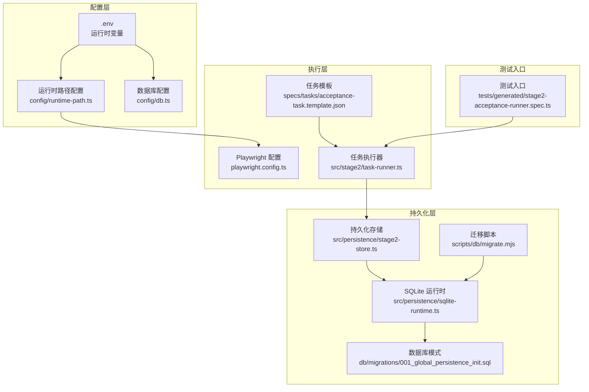
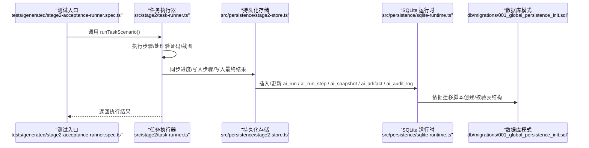
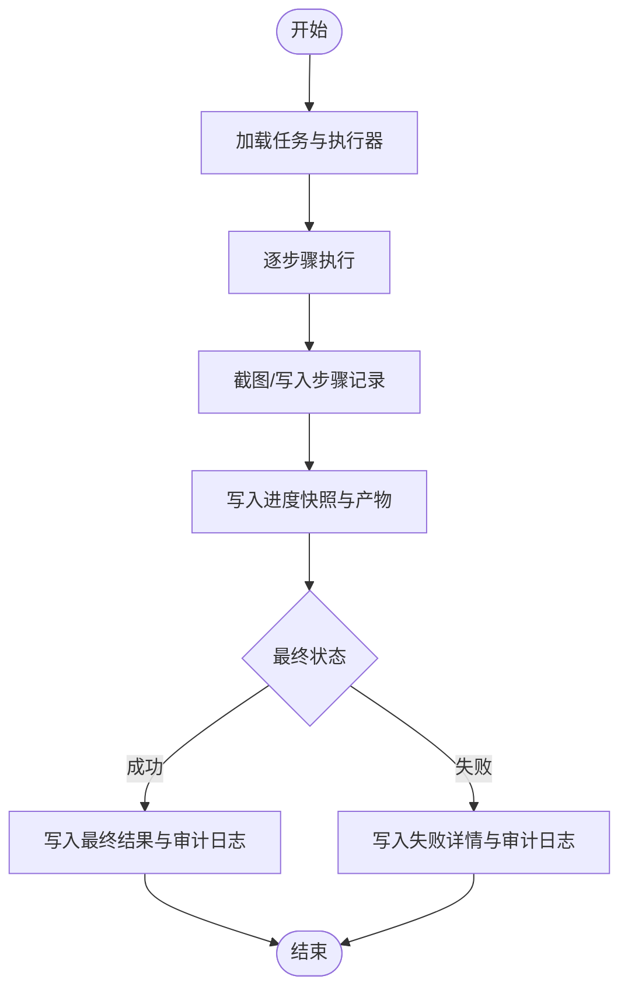
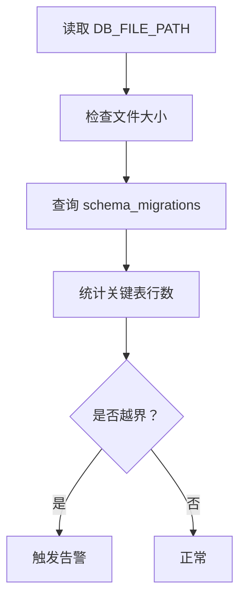
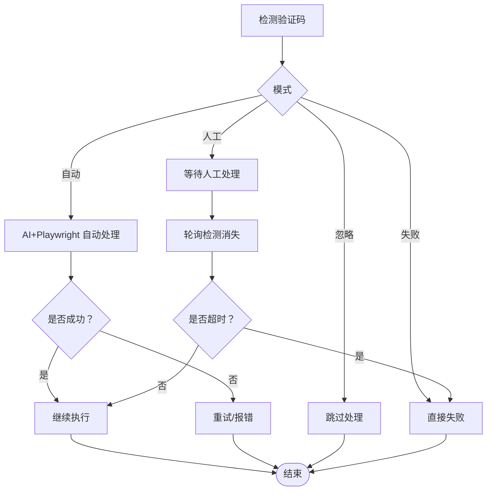
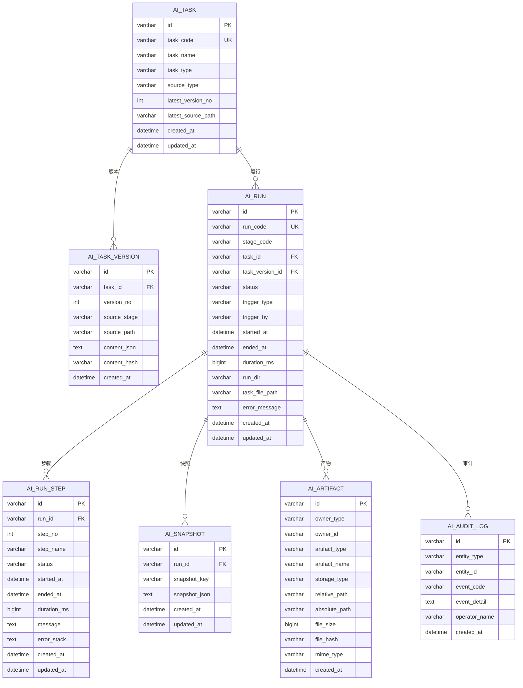

# 监控告警

<cite>
**本文引用的文件**
- [README.md](file://README.md)
- [package.json](file://package.json)
- [playwright.config.ts](file://playwright.config.ts)
- [config/runtime-path.ts](file://config/runtime-path.ts)
- [config/db.ts](file://config/db.ts)
- [src/persistence/sqlite-runtime.ts](file://src/persistence/sqlite-runtime.ts)
- [src/persistence/stage2-store.ts](file://src/persistence/stage2-store.ts)
- [src/stage2/task-runner.ts](file://src/stage2/task-runner.ts)
- [src/stage2/types.ts](file://src/stage2/types.ts)
- [scripts/db/migrate.mjs](file://scripts/db/migrate.mjs)
- [db/migrations/001_global_persistence_init.sql](file://db/migrations/001_global_persistence_init.sql)
- [specs/tasks/acceptance-task.template.json](file://specs/tasks/acceptance-task.template.json)
- [tests/generated/stage2-acceptance-runner.spec.ts](file://tests/generated/stage2-acceptance-runner.spec.ts)
</cite>

## 目录
1. [简介](#简介)
2. [项目结构](#项目结构)
3. [核心组件](#核心组件)
4. [架构总览](#架构总览)
5. [详细组件分析](#详细组件分析)
6. [依赖关系分析](#依赖关系分析)
7. [性能考量](#性能考量)
8. [故障排查指南](#故障排查指南)
9. [结论](#结论)
10. [附录](#附录)

## 简介
本指南围绕监控告警系统，结合仓库现有能力，给出执行结果监控、数据库状态监控与 AI 集成监控的配置方法，定义关键性能指标（KPI）并提供日志聚合、异常检测与告警规则实践，以及 Prometheus、Grafana 的集成思路与告警通知渠道配置建议。文档同时覆盖运行产物目录、数据库持久化与迁移机制，帮助团队建立可追踪、可观测、可预警的自动化测试体系。

## 项目结构
项目采用分层组织：配置层（环境变量与路径）、执行层（Playwright + Midscene）、持久化层（SQLite + 迁移）、测试入口与任务定义。运行产物与数据库文件均通过统一的运行时目录规范进行管理，便于采集与可视化。

**图表来源**
- [config/runtime-path.ts:1-41](file://config/runtime-path.ts#L1-L41)
- [config/db.ts:1-28](file://config/db.ts#L1-L28)
- [playwright.config.ts:1-95](file://playwright.config.ts#L1-L95)
- [src/stage2/task-runner.ts:1-800](file://src/stage2/task-runner.ts#L1-L800)
- [src/persistence/stage2-store.ts:1-655](file://src/persistence/stage2-store.ts#L1-L655)
- [src/persistence/sqlite-runtime.ts:1-116](file://src/persistence/sqlite-runtime.ts#L1-L116)
- [scripts/db/migrate.mjs:1-52](file://scripts/db/migrate.mjs#L1-L52)
- [db/migrations/001_global_persistence_init.sql:1-128](file://db/migrations/001_global_persistence_init.sql#L1-L128)
- [specs/tasks/acceptance-task.template.json:1-141](file://specs/tasks/acceptance-task.template.json#L1-L141)
- [tests/generated/stage2-acceptance-runner.spec.ts:1-39](file://tests/generated/stage2-acceptance-runner.spec.ts#L1-L39)

**章节来源**
- [README.md:1-223](file://README.md#L1-L223)
- [config/runtime-path.ts:1-41](file://config/runtime-path.ts#L1-L41)
- [config/db.ts:1-28](file://config/db.ts#L1-L28)
- [playwright.config.ts:1-95](file://playwright.config.ts#L1-L95)
- [src/stage2/task-runner.ts:1-800](file://src/stage2/task-runner.ts#L1-L800)
- [src/persistence/stage2-store.ts:1-655](file://src/persistence/stage2-store.ts#L1-L655)
- [src/persistence/sqlite-runtime.ts:1-116](file://src/persistence/sqlite-runtime.ts#L1-L116)
- [scripts/db/migrate.mjs:1-52](file://scripts/db/migrate.mjs#L1-L52)
- [db/migrations/001_global_persistence_init.sql:1-128](file://db/migrations/001_global_persistence_init.sql#L1-L128)
- [specs/tasks/acceptance-task.template.json:1-141](file://specs/tasks/acceptance-task.template.json#L1-L141)
- [tests/generated/stage2-acceptance-runner.spec.ts:1-39](file://tests/generated/stage2-acceptance-runner.spec.ts#L1-L39)

## 核心组件
- 运行时目录与产物管理：通过统一的运行时路径配置集中管理 Playwright 输出、HTML 报告、Midscene 运行目录、验收结果与数据库文件，便于采集与可视化。
- 数据库与迁移：SQLite 单文件数据库，提供迁移脚本与模式定义，确保表结构与索引一致，支持审计日志与运行快照。
- 任务执行器：封装滑块验证码处理、步骤执行、截图与结果写库，提供运行状态、步骤明细与最终结果的持久化。
- 测试入口：基于 Playwright 的测试入口，负责调用任务执行器并根据结果抛出错误，便于 CI/CD 中的失败判定。

**章节来源**
- [config/runtime-path.ts:1-41](file://config/runtime-path.ts#L1-L41)
- [config/db.ts:1-28](file://config/db.ts#L1-L28)
- [src/persistence/sqlite-runtime.ts:1-116](file://src/persistence/sqlite-runtime.ts#L1-L116)
- [src/persistence/stage2-store.ts:1-655](file://src/persistence/stage2-store.ts#L1-L655)
- [src/stage2/task-runner.ts:1-800](file://src/stage2/task-runner.ts#L1-L800)
- [tests/generated/stage2-acceptance-runner.spec.ts:1-39](file://tests/generated/stage2-acceptance-runner.spec.ts#L1-L39)

## 架构总览
下图展示从测试入口到数据库落盘的整体链路，以及运行时产物的落盘位置。

**图表来源**
- [tests/generated/stage2-acceptance-runner.spec.ts:1-39](file://tests/generated/stage2-acceptance-runner.spec.ts#L1-L39)
- [src/stage2/task-runner.ts:1-800](file://src/stage2/task-runner.ts#L1-L800)
- [src/persistence/stage2-store.ts:1-655](file://src/persistence/stage2-store.ts#L1-L655)
- [src/persistence/sqlite-runtime.ts:1-116](file://src/persistence/sqlite-runtime.ts#L1-L116)
- [db/migrations/001_global_persistence_init.sql:1-128](file://db/migrations/001_global_persistence_init.sql#L1-L128)

## 详细组件分析

### 执行结果监控
- 监控对象
  - 运行状态：通过 ai_run.status、duration_ms、error_message 记录任务整体成败与时长。
  - 步骤明细：ai_run_step 记录每个步骤的名称、状态、耗时与错误信息。
  - 产物与截图：ai_artifact 记录 result.json、progress.json、screenshot 等文件路径与大小。
  - 运行快照：ai_snapshot 记录 resolved_values、query_snapshots、final_result_summary 等关键中间态。
- KPI 定义与采集
  - 测试执行时间：ai_run.duration_ms（毫秒）。
  - 成功率：通过 ai_run.status='passed' 的占比统计。
  - 错误率：通过 ai_run.status='failed' 的占比统计。
  - 失败原因分布：基于 ai_audit_log.event_code 与 ai_run.error_message 的分类统计。
- 日志与异常
  - 执行器在关键节点写入审计日志（如 RUN_STARTED/RUN_FINISHED/STEP_FAILED）。
  - 失败时抛出错误，包含失败步骤、消息与截图路径，便于定位问题。
- 告警规则建议
  - 连续 N 次失败触发告警。
  - 执行时间超过阈值（如 P95 超过预设上限）触发告警。
  - 失败原因出现特定关键词（如验证码、网络超时）触发专项告警。

**图表来源**
- [src/stage2/task-runner.ts:1-800](file://src/stage2/task-runner.ts#L1-L800)
- [src/persistence/stage2-store.ts:1-655](file://src/persistence/stage2-store.ts#L1-L655)
- [db/migrations/001_global_persistence_init.sql:1-128](file://db/migrations/001_global_persistence_init.sql#L1-L128)

**章节来源**
- [src/stage2/task-runner.ts:1-800](file://src/stage2/task-runner.ts#L1-L800)
- [src/persistence/stage2-store.ts:1-655](file://src/persistence/stage2-store.ts#L1-L655)
- [db/migrations/001_global_persistence_init.sql:1-128](file://db/migrations/001_global_persistence_init.sql#L1-L128)

### 数据库状态监控
- 监控对象
  - 数据库文件大小与可用空间。
  - 迁移执行状态与完整性（schema_migrations）。
  - 关键表增长趋势（ai_task、ai_run、ai_run_step、ai_artifact、ai_audit_log）。
- KPI 定义与采集
  - 数据库文件大小：DB_FILE_PATH 对应文件大小。
  - 迁移执行数：schema_migrations 条目数量。
  - 表行数：各关键表的 COUNT(*)。
- 告警规则建议
  - 数据库文件大小超过阈值触发告警。
  - 迁移失败或缺失条目触发告警。
  - 表行数异常增长（如 ai_run_step 增长过快）触发告警。

**图表来源**
- [config/db.ts:1-28](file://config/db.ts#L1-L28)
- [src/persistence/sqlite-runtime.ts:1-116](file://src/persistence/sqlite-runtime.ts#L1-L116)
- [scripts/db/migrate.mjs:1-52](file://scripts/db/migrate.mjs#L1-L52)
- [db/migrations/001_global_persistence_init.sql:1-128](file://db/migrations/001_global_persistence_init.sql#L1-L128)

**章节来源**
- [config/db.ts:1-28](file://config/db.ts#L1-L28)
- [src/persistence/sqlite-runtime.ts:1-116](file://src/persistence/sqlite-runtime.ts#L1-L116)
- [scripts/db/migrate.mjs:1-52](file://scripts/db/migrate.mjs#L1-L52)
- [db/migrations/001_global_persistence_init.sql:1-128](file://db/migrations/001_global_persistence_init.sql#L1-L128)

### AI 集成监控
- 监控对象
  - 滑块验证码处理：自动/人工模式下的成功率、耗时与失败原因。
  - AI 查询与断言：aiQuery/aiAssert 的调用次数、失败次数与平均耗时。
  - Midscene 报告与截图：报告目录大小、截图数量与异常。
- KPI 定义与采集
  - 验证码处理成功率：自动模式成功次数 / 总尝试次数。
  - AI 查询/断言失败率：失败次数 / 总调用次数。
  - Midscene 报告与截图体积：目录统计。
- 告警规则建议
  - 验证码处理失败率升高触发告警。
  - AI 查询/断言失败率升高触发告警。
  - Midscene 报告/截图异常增长触发告警。

**图表来源**
- [src/stage2/task-runner.ts:1-800](file://src/stage2/task-runner.ts#L1-L800)

**章节来源**
- [src/stage2/task-runner.ts:1-800](file://src/stage2/task-runner.ts#L1-L800)

## 依赖关系分析
- 配置依赖
  - 运行时路径与数据库路径由 .env 与 config 模块统一解析，避免硬编码。
- 执行依赖
  - 测试入口依赖任务执行器；任务执行器依赖持久化存储；持久化存储依赖 SQLite 运行时与迁移脚本。
- 数据模型依赖
  - ai_run_step 外键关联 ai_run；ai_snapshot/ai_artifact/ai_audit_log 外键关联 ai_run；ai_task_version 外键关联 ai_task。

**图表来源**
- [db/migrations/001_global_persistence_init.sql:1-128](file://db/migrations/001_global_persistence_init.sql#L1-L128)

**章节来源**
- [db/migrations/001_global_persistence_init.sql:1-128](file://db/migrations/001_global_persistence_init.sql#L1-L128)

## 性能考量
- 执行时间
  - 使用 ai_run.duration_ms 作为总体耗时指标；结合步骤级 ai_run_step.duration_ms 进行热点定位。
- 资源占用
  - 数据库文件大小与表行数增长趋势监控，避免碎片化与查询性能退化。
- 并发与稳定性
  - Playwright 并行与重试策略在 CI 环境下谨慎配置，避免资源争用导致的抖动。
- 存储与 IO
  - Midscene 报告与截图体量较大，建议定期清理与归档，控制磁盘压力。

[本节为通用指导，无需列出具体文件来源]

## 故障排查指南
- 执行失败定位
  - 查看 ai_run.error_message 与 ai_audit_log.event_code 获取事件详情。
  - 通过 ai_run_step.message/error_stack 定位失败步骤与堆栈。
- 验证码问题
  - 检查 STAGE2_CAPTCHA_MODE 与 STAGE2_CAPTCHA_WAIT_TIMEOUT_MS 设置。
  - 若自动模式失败，可切换为人工模式观察页面样式差异。
- 数据库问题
  - 确认 DB_DRIVER 与 DB_FILE_PATH 配置正确。
  - 使用迁移脚本检查 schema_migrations 与表结构一致性。
- 产物与报告
  - 确认运行时目录配置（RUNTIME_DIR_PREFIX、PLAYWRIGHT_OUTPUT_DIR、PLAYWRIGHT_HTML_REPORT_DIR、MIDSCENE_RUN_DIR、ACCEPTANCE_RESULT_DIR）。
  - 检查 ai_artifact 中的相对/绝对路径与文件大小，确保产物完整。

**章节来源**
- [src/stage2/task-runner.ts:1-800](file://src/stage2/task-runner.ts#L1-L800)
- [src/persistence/stage2-store.ts:1-655](file://src/persistence/stage2-store.ts#L1-L655)
- [config/runtime-path.ts:1-41](file://config/runtime-path.ts#L1-L41)
- [config/db.ts:1-28](file://config/db.ts#L1-L28)
- [scripts/db/migrate.mjs:1-52](file://scripts/db/migrate.mjs#L1-L52)

## 结论
通过统一的运行时目录规范、完善的数据库持久化与迁移机制、以及任务执行器的可观测性设计，项目具备了构建监控告警体系的良好基础。建议在此基础上引入日志聚合与可视化工具，结合 Prometheus/Grafana 实现 KPI 可视化与智能告警，并完善通知渠道配置，形成闭环的质量保障与运维体系。

[本节为总结性内容，无需列出具体文件来源]

## 附录

### 关键性能指标（KPI）定义与采集
- 测试执行时间
  - 指标：ai_run.duration_ms（毫秒）
  - 采集：从 ai_run 表读取
- 成功率
  - 指标：status='passed' 的任务数 / 总任务数
  - 采集：按天/小时聚合 ai_run.status
- 错误率
  - 指标：status='failed' 的任务数 / 总任务数
  - 采集：按天/小时聚合 ai_run.status
- 失败原因分布
  - 指标：ai_audit_log.event_code 与 ai_run.error_message 分类
  - 采集：按事件码与错误关键字统计

**章节来源**
- [db/migrations/001_global_persistence_init.sql:1-128](file://db/migrations/001_global_persistence_init.sql#L1-L128)

### 日志聚合与异常检测实践
- 日志聚合
  - 将 t_runtime 下的 Playwright 报告、Midscene 报告与数据库日志纳入统一采集。
  - 使用日志采集器（如 Filebeat/Fluent Bit）收集运行时目录中的文本与 JSON 日志。
- 异常检测
  - 基于正则表达式检测常见错误（如验证码失败、网络超时、断言失败）。
  - 基于统计模型检测异常波动（如执行时间 P95 异常升高）。

[本节为通用指导，无需列出具体文件来源]

### Prometheus 与 Grafana 集成方案
- Prometheus 抓取
  - 通过 Exporter 或自定义采集器暴露数据库文件大小、表行数、任务成功率等指标。
  - 配置定时任务执行 SQL 查询并将结果暴露为文本格式供 Prometheus 抓取。
- Grafana 可视化
  - 创建仪表板：执行时间趋势、成功率/错误率、失败原因分布、数据库容量与增长趋势。
  - 设置阈值告警：连续失败、超时、容量告警等。

[本节为通用指导，无需列出具体文件来源]

### 告警通知渠道与阈值设置
- 通知渠道
  - 邮件：适用于严重级别告警。
  - 微信：适用于中高优先级告警，建议使用企业微信机器人。
  - Slack：适用于开发与测试团队即时沟通。
- 阈值建议
  - 连续 3 次失败触发告警。
  - 执行时间 P95 超过预设上限（如 3 分钟）触发告警。
  - 数据库文件大小超过阈值（如 5GB）触发告警。
  - 失败原因出现特定关键词（如验证码、网络超时）触发专项告警。

[本节为通用指导，无需列出具体文件来源]

### 监控仪表板设计与维护建议
- 设计建议
  - 分层展示：概览（成功率/错误率/执行时间）、详情（失败原因分布/步骤耗时）、诊断（日志与截图链接）。
  - 时间维度：支持近 1 小时、1 天、1 周、1 月等多粒度切换。
- 维护建议
  - 定期回顾告警阈值，结合历史数据动态调整。
  - 仪表板权限分级，区分开发、测试与运维视角。
  - 与 CI/CD 集成，失败任务自动标记与通知。

[本节为通用指导，无需列出具体文件来源]