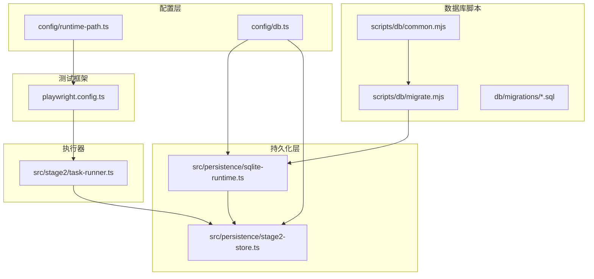
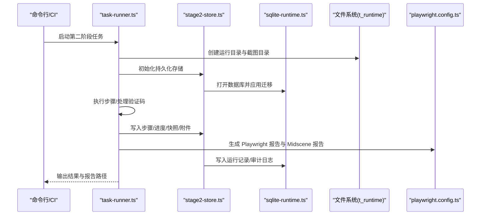
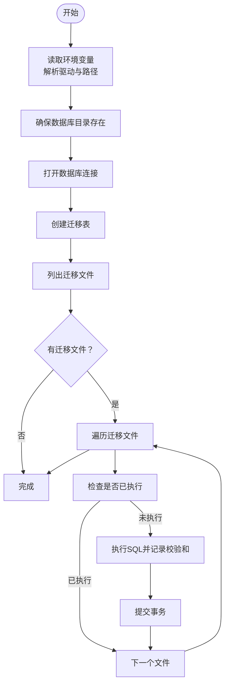
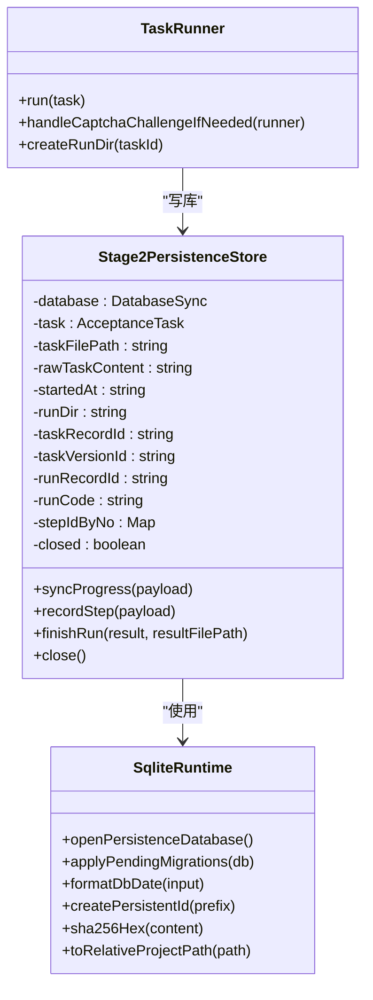
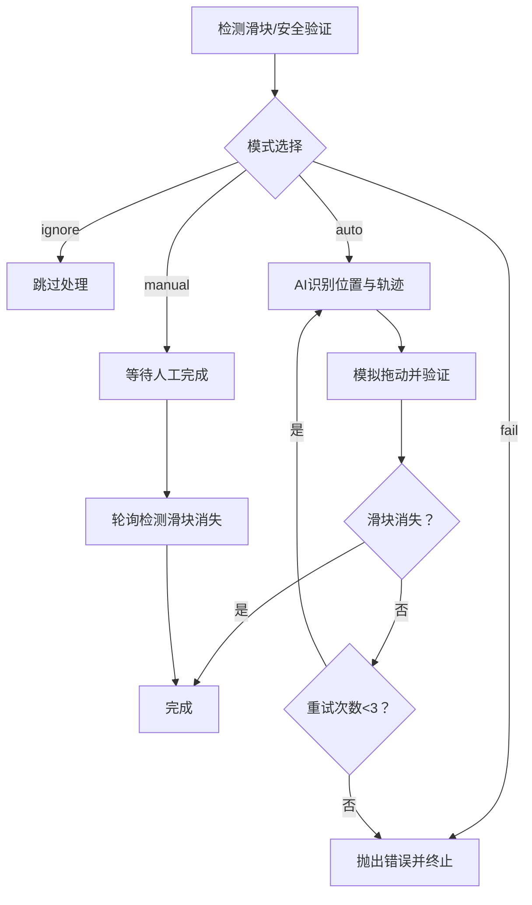
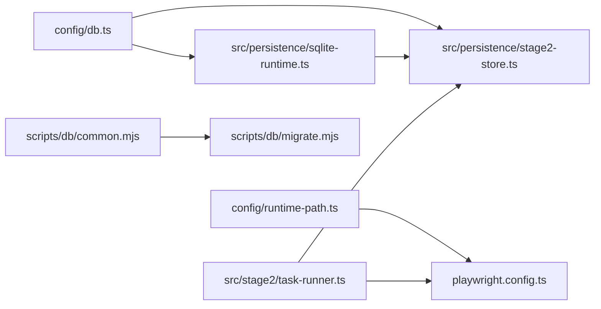

# 部署和运维

<cite>
**本文引用的文件**
- [README.md](file://README.md)
- [package.json](file://package.json)
- [playwright.config.ts](file://playwright.config.ts)
- [config/runtime-path.ts](file://config/runtime-path.ts)
- [config/db.ts](file://config/db.ts)
- [scripts/db/common.mjs](file://scripts/db/common.mjs)
- [scripts/db/migrate.mjs](file://scripts/db/migrate.mjs)
- [src/persistence/sqlite-runtime.ts](file://src/persistence/sqlite-runtime.ts)
- [src/persistence/stage2-store.ts](file://src/persistence/stage2-store.ts)
- [src/stage2/task-runner.ts](file://src/stage2/task-runner.ts)
- [db/migrations/001_global_persistence_init.sql](file://db/migrations/001_global_persistence_init.sql)
- [specs/login-e2e.md](file://specs/login-e2e.md)
- [.gitignore](file://.gitignore)
</cite>

## 目录
1. [简介](#简介)
2. [项目结构](#项目结构)
3. [核心组件](#核心组件)
4. [架构总览](#架构总览)
5. [详细组件分析](#详细组件分析)
6. [依赖关系分析](#依赖关系分析)
7. [性能考虑](#性能考虑)
8. [故障排查指南](#故障排查指南)
9. [结论](#结论)
10. [附录](#附录)

## 简介
本指南面向生产环境的部署与运维，覆盖容器化部署、CI/CD 集成、自动化运维、日志与错误追踪、容量规划与性能基准、安全与备份恢复、监控与告警以及应急响应流程。项目基于 Playwright 与 Midscene.js 的 AI 自动化测试体系，具备可落地的数据库持久化与运行产物目录管理能力，适合在企业内构建稳定的自动化验收与回归流水线。

## 项目结构
项目采用“配置驱动 + 脚本化迁移 + 持久化写库”的组织方式，关键目录与职责如下：
- config：集中管理运行时路径与数据库配置，统一从 .env 读取环境变量
- scripts/db：数据库迁移脚本与公共工具，支持本地 SQLite 单文件数据库
- src/persistence：SQLite 运行时与 Stage2 执行结果写库模块
- src/stage2：第二阶段任务执行器，集成滑块验证码自动处理与结果落库
- db/migrations：SQL 迁移文件，定义全局持久化表结构
- specs：测试用例与 E2E 测试计划文档
- playwright.config.ts：Playwright 测试框架配置，输出目录与报告器统一由 config/runtime-path.ts 解析
- package.json：脚本命令与依赖声明

图表来源
- [config/runtime-path.ts:1-41](file://config/runtime-path.ts#L1-L41)
- [config/db.ts:1-28](file://config/db.ts#L1-L28)
- [scripts/db/common.mjs:1-108](file://scripts/db/common.mjs#L1-L108)
- [scripts/db/migrate.mjs:1-52](file://scripts/db/migrate.mjs#L1-L52)
- [src/persistence/sqlite-runtime.ts:1-116](file://src/persistence/sqlite-runtime.ts#L1-L116)
- [src/persistence/stage2-store.ts:1-655](file://src/persistence/stage2-store.ts#L1-L655)
- [src/stage2/task-runner.ts:1-800](file://src/stage2/task-runner.ts#L1-L800)
- [playwright.config.ts:1-95](file://playwright.config.ts#L1-L95)

章节来源
- [README.md:10-223](file://README.md#L10-L223)
- [package.json:1-26](file://package.json#L1-L26)
- [playwright.config.ts:1-95](file://playwright.config.ts#L1-L95)
- [config/runtime-path.ts:1-41](file://config/runtime-path.ts#L1-L41)
- [config/db.ts:1-28](file://config/db.ts#L1-L28)
- [scripts/db/common.mjs:1-108](file://scripts/db/common.mjs#L1-L108)
- [scripts/db/migrate.mjs:1-52](file://scripts/db/migrate.mjs#L1-L52)
- [src/persistence/sqlite-runtime.ts:1-116](file://src/persistence/sqlite-runtime.ts#L1-L116)
- [src/persistence/stage2-store.ts:1-655](file://src/persistence/stage2-store.ts#L1-L655)
- [src/stage2/task-runner.ts:1-800](file://src/stage2/task-runner.ts#L1-L800)
- [db/migrations/001_global_persistence_init.sql:1-128](file://db/migrations/001_global_persistence_init.sql#L1-L128)

## 核心组件
- 运行时路径与产物目录
  - 通过 config/runtime-path.ts 统一解析 RUNTIME_DIR_PREFIX、PLAYWRIGHT_OUTPUT_DIR、PLAYWRIGHT_HTML_REPORT_DIR、MIDSCENE_RUN_DIR、ACCEPTANCE_RESULT_DIR 等环境变量，保证所有运行产物收敛至 t_runtime/ 目录
- 数据库配置与迁移
  - config/db.ts 读取 DB_DRIVER 与 DB_FILE_PATH，结合 scripts/db/common.mjs/openDatabase 与 scripts/db/migrate.mjs 实现迁移表创建、SQL 文件扫描、逐条执行与校验
  - src/persistence/sqlite-runtime.ts 提供数据库打开、迁移应用与辅助工具函数
- Stage2 执行器与持久化写库
  - src/stage2/task-runner.ts 负责任务执行、滑块验证码处理、截图与中间产物管理，并调用 src/persistence/stage2-store.ts 将任务、运行、步骤、快照、附件与审计日志写入数据库
  - src/persistence/stage2-store.ts 对外暴露 createStage2PersistenceStore，封装幂等写入、错误兜底与资源关闭
- 测试框架与报告
  - playwright.config.ts 读取 .env，设置超时、并行度、重试策略、报告器（HTML 与 Midscene），并将输出目录指向 config/runtime-path.ts 解析结果

章节来源
- [config/runtime-path.ts:1-41](file://config/runtime-path.ts#L1-L41)
- [config/db.ts:1-28](file://config/db.ts#L1-L28)
- [scripts/db/common.mjs:1-108](file://scripts/db/common.mjs#L1-L108)
- [scripts/db/migrate.mjs:1-52](file://scripts/db/migrate.mjs#L1-L52)
- [src/persistence/sqlite-runtime.ts:1-116](file://src/persistence/sqlite-runtime.ts#L1-L116)
- [src/persistence/stage2-store.ts:1-655](file://src/persistence/stage2-store.ts#L1-L655)
- [src/stage2/task-runner.ts:1-800](file://src/stage2/task-runner.ts#L1-L800)
- [playwright.config.ts:1-95](file://playwright.config.ts#L1-L95)

## 架构总览
下图展示了从任务执行到数据库落库与报告产出的整体流程，强调配置驱动与脚本化迁移的解耦。

图表来源
- [src/stage2/task-runner.ts:1-800](file://src/stage2/task-runner.ts#L1-L800)
- [src/persistence/stage2-store.ts:1-655](file://src/persistence/stage2-store.ts#L1-L655)
- [src/persistence/sqlite-runtime.ts:1-116](file://src/persistence/sqlite-runtime.ts#L1-L116)
- [playwright.config.ts:1-95](file://playwright.config.ts#L1-L95)

## 详细组件分析

### 组件A：数据库迁移与初始化
- 设计要点
  - 通过 scripts/db/common.mjs 统一读取环境变量、解析数据库路径与迁移目录
  - 迁移表 schema_migrations 记录已执行文件名与校验和，避免重复执行
  - 迁移脚本按文件名排序依次执行，失败回滚，成功记录
- 复杂度与性能
  - 时间复杂度 O(N) 遍历迁移文件，空间复杂度 O(1)，单文件 SQLite 写入具备良好顺序写性能
- 错误处理
  - 迁移失败时回滚事务并抛出错误，确保数据库一致性
- 优化建议
  - 大型迁移拆分批次，必要时增加索引重建批处理
  - 生产环境启用只读副本与离线迁移窗口

图表来源
- [scripts/db/common.mjs:31-108](file://scripts/db/common.mjs#L31-L108)
- [scripts/db/migrate.mjs:15-52](file://scripts/db/migrate.mjs#L15-L52)

章节来源
- [scripts/db/common.mjs:1-108](file://scripts/db/common.mjs#L1-L108)
- [scripts/db/migrate.mjs:1-52](file://scripts/db/migrate.mjs#L1-L52)
- [src/persistence/sqlite-runtime.ts:73-116](file://src/persistence/sqlite-runtime.ts#L73-L116)
- [db/migrations/001_global_persistence_init.sql:1-128](file://db/migrations/001_global_persistence_init.sql#L1-L128)

### 组件B：Stage2 执行器与持久化写库
- 设计要点
  - 任务执行器负责页面交互、AI 查询与断言、验证码处理、截图与中间产物管理
  - 持久化写库模块将任务、版本、运行、步骤、快照、附件与审计日志写入数据库，支持幂等更新与错误兜底
- 类关系与职责
  - Stage2PersistenceStore：对外唯一接口，负责生命周期管理与数据写入
  - sqlite-runtime：数据库打开、迁移应用与工具函数
  - task-runner：业务执行流程编排与产物目录管理

图表来源
- [src/persistence/stage2-store.ts:74-655](file://src/persistence/stage2-store.ts#L74-L655)
- [src/persistence/sqlite-runtime.ts:73-116](file://src/persistence/sqlite-runtime.ts#L73-L116)
- [src/stage2/task-runner.ts:111-706](file://src/stage2/task-runner.ts#L111-L706)

章节来源
- [src/persistence/stage2-store.ts:1-655](file://src/persistence/stage2-store.ts#L1-L655)
- [src/persistence/sqlite-runtime.ts:1-116](file://src/persistence/sqlite-runtime.ts#L1-L116)
- [src/stage2/task-runner.ts:1-800](file://src/stage2/task-runner.ts#L1-L800)

### 组件C：滑块验证码自动处理流程
- 设计要点
  - 通过 AI 查询识别滑块按钮位置与滑槽宽度，模拟真人拖动轨迹（先快后慢、带抖动），最多重试 3 次
  - 支持 manual/fail/ignore/auto 四种模式，配合超时控制
- 流程图

图表来源
- [src/stage2/task-runner.ts:483-706](file://src/stage2/task-runner.ts#L483-L706)

章节来源
- [src/stage2/task-runner.ts:35-87](file://src/stage2/task-runner.ts#L35-L87)
- [src/stage2/task-runner.ts:561-648](file://src/stage2/task-runner.ts#L561-L648)
- [src/stage2/task-runner.ts:650-706](file://src/stage2/task-runner.ts#L650-L706)

### 组件D：测试框架与报告
- 设计要点
  - playwright.config.ts 读取 .env，设置超时、并行度、重试策略与报告器
  - 输出目录由 config/runtime-path.ts 统一解析，确保报告与产物集中管理
- 关键配置项
  - timeout、fullyParallel、retries、workers、reporter（list/html/@midscene/web/playwright-report）

章节来源
- [playwright.config.ts:22-95](file://playwright.config.ts#L22-L95)
- [config/runtime-path.ts:18-36](file://config/runtime-path.ts#L18-L36)
- [README.md:154-164](file://README.md#L154-L164)

## 依赖关系分析
- 组件耦合
  - config/runtime-path.ts 与 config/db.ts 为底层配置源，被 scripts/db/*、src/persistence/*、playwright.config.ts 间接依赖
  - src/stage2/task-runner.ts 与 src/persistence/stage2-store.ts 强耦合，前者负责执行，后者负责落库
- 外部依赖
  - Playwright、Midscene、dotenv、node:sqlite
- 循环依赖
  - 未发现循环依赖，模块边界清晰

图表来源
- [config/runtime-path.ts:1-41](file://config/runtime-path.ts#L1-L41)
- [config/db.ts:1-28](file://config/db.ts#L1-L28)
- [scripts/db/common.mjs:1-108](file://scripts/db/common.mjs#L1-L108)
- [scripts/db/migrate.mjs:1-52](file://scripts/db/migrate.mjs#L1-L52)
- [src/persistence/sqlite-runtime.ts:1-116](file://src/persistence/sqlite-runtime.ts#L1-L116)
- [src/persistence/stage2-store.ts:1-655](file://src/persistence/stage2-store.ts#L1-L655)
- [src/stage2/task-runner.ts:1-800](file://src/stage2/task-runner.ts#L1-L800)
- [playwright.config.ts:1-95](file://playwright.config.ts#L1-L95)

章节来源
- [package.json:15-24](file://package.json#L15-L24)
- [playwright.config.ts:1-95](file://playwright.config.ts#L1-L95)
- [config/runtime-path.ts:1-41](file://config/runtime-path.ts#L1-L41)
- [config/db.ts:1-28](file://config/db.ts#L1-L28)
- [scripts/db/common.mjs:1-108](file://scripts/db/common.mjs#L1-L108)
- [scripts/db/migrate.mjs:1-52](file://scripts/db/migrate.mjs#L1-L52)
- [src/persistence/sqlite-runtime.ts:1-116](file://src/persistence/sqlite-runtime.ts#L1-L116)
- [src/persistence/stage2-store.ts:1-655](file://src/persistence/stage2-store.ts#L1-L655)
- [src/stage2/task-runner.ts:1-800](file://src/stage2/task-runner.ts#L1-L800)

## 性能考虑
- 运行时路径与产物
  - 将所有运行产物收敛至 t_runtime/，有利于磁盘配额与 IO 调优
- 数据库
  - 单文件 SQLite 适合中小规模数据与并发较低的场景；高并发或大数据量建议评估 MySQL/PostgreSQL
  - 迁移脚本顺序执行，建议在非高峰时段进行
- 测试执行
  - CI 环境禁用并行或限制 workers，避免资源争用
  - 合理设置 retries 与 timeout，平衡稳定性与吞吐
- 报告与日志
  - HTML 报告与 Midscene 报告建议定期清理，避免占用磁盘空间

[本节为通用指导，无需特定文件引用]

## 故障排查指南
- 数据库迁移失败
  - 现象：迁移执行报错或中断
  - 排查：检查 DB_DRIVER 与 DB_FILE_PATH 是否正确；确认 schema_migrations 表是否存在；查看具体 SQL 报错
  - 处理：修复 SQL 后重新执行迁移脚本
- 滑块验证码处理失败
  - 现象：自动模式多次尝试后仍失败
  - 排查：确认 STAGE2_CAPTCHA_MODE 与 STAGE2_CAPTCHA_WAIT_TIMEOUT_MS 设置；检查页面截图与选择器匹配
  - 处理：调整为 manual 模式或优化 AI 识别提示词
- 报告与产物缺失
  - 现象：Playwright/Midscene 报告未生成
  - 排查：确认 PLAYWRIGHT_OUTPUT_DIR、PLAYWRIGHT_HTML_REPORT_DIR、MIDSCENE_RUN_DIR、ACCEPTANCE_RESULT_DIR 是否正确解析
  - 处理：修正 .env 或运行命令行参数
- 测试无法启动
  - 现象：测试执行前无服务或页面不可达
  - 排查：检查 webServer 配置或外部服务可用性
  - 处理：在 CI 中预热服务或使用 playwright.config.ts 的 webServer 配置

章节来源
- [scripts/db/migrate.mjs:15-52](file://scripts/db/migrate.mjs#L15-L52)
- [src/stage2/task-runner.ts:650-706](file://src/stage2/task-runner.ts#L650-L706)
- [config/runtime-path.ts:18-36](file://config/runtime-path.ts#L18-L36)
- [playwright.config.ts:88-94](file://playwright.config.ts#L88-L94)

## 结论
本项目提供了可直接落地的自动化测试与验收执行能力，通过配置驱动与脚本化迁移实现了环境一致性与可维护性。生产部署建议结合 CI/CD、监控告警与容量规划，逐步引入 MySQL/PostgreSQL 与容器化部署，以满足更高并发与可靠性要求。

[本节为总结，无需特定文件引用]

## 附录

### A. 生产环境部署配置清单
- 环境变量
  - OPENAI_API_KEY、OPENAI_BASE_URL、MIDSCENE_MODEL_NAME、RUNTIME_DIR_PREFIX、PLAYWRIGHT_OUTPUT_DIR、PLAYWRIGHT_HTML_REPORT_DIR、MIDSCENE_RUN_DIR、ACCEPTANCE_RESULT_DIR、DB_DRIVER、DB_FILE_PATH、STAGE2_TASK_FILE、STAGE2_REQUIRE_APPROVAL、STAGE2_CAPTCHA_MODE、STAGE2_CAPTCHA_WAIT_TIMEOUT_MS
- 目录与权限
  - t_runtime/ 及其子目录具备写权限；数据库文件具备读写权限
- 依赖安装
  - 安装 Node 与 npm；安装浏览器二进制

章节来源
- [README.md:39-54](file://README.md#L39-L54)
- [README.md:120-130](file://README.md#L120-L130)

### B. 容器化部署建议
- 基础镜像
  - 使用官方 Node LTS 镜像，安装系统依赖与浏览器二进制
- 配置挂载
  - 将 t_runtime/ 挂载为持久卷；将 .env 通过密文管理注入
- 健康检查
  - 提供轻量健康检查端点，确保服务可用
- 日志采集
  - 将 stdout/stderr 与 t_runtime/ 日志统一采集到集中日志系统

[本节为通用指导，无需特定文件引用]

### C. CI/CD 集成最佳实践
- 触发策略
  - 主分支保护与 PR 触发测试；发布标签触发构建与制品上传
- 步骤建议
  - 安装依赖 → 安装浏览器 → 数据库迁移 → 运行测试 → 生成报告 → 清理产物
- 安全
  - 凭据使用密文管理；最小权限原则；扫描漏洞与许可证

[本节为通用指导，无需特定文件引用]

### D. 监控与告警
- 指标建议
  - 测试成功率、平均执行时长、数据库写入耗时、磁盘使用率、CPU/内存占用
- 告警规则
  - 成功率低于阈值、执行时长异常增长、数据库写入失败、磁盘空间不足
- 工具
  - Prometheus/Grafana/PagerDuty/AlertManager

[本节为通用指导，无需特定文件引用]

### E. 容量规划与性能基准
- 基准测试
  - 在相同硬件与网络条件下，运行固定套件，记录成功率与耗时
- 规划方法
  - 以峰值并发与最大数据量为依据，预留 30% 资源冗余

[本节为通用指导，无需特定文件引用]

### F. 安全配置与备份恢复
- 安全
  - 限制数据库访问权限；HTTPS 传输；敏感环境变量加密存储
- 备份
  - 定期备份 t_runtime/ 与数据库文件；验证恢复流程
- 恢复
  - 快速定位最近一次可用备份；按顺序恢复数据库与文件系统

[本节为通用指导，无需特定文件引用]

### G. 应急响应流程
- 分级
  - P0：服务不可用；P1：大面积失败；P2：个别功能异常
- 步骤
  - 快速隔离、回滚变更、恢复服务、根因分析、修复上线、复盘总结
- 文档
  - 事件报告模板、根因分析模板、复盘会议纪要

[本节为通用指导，无需特定文件引用]

### H. 常见运维问题与解决
- 数据库文件损坏
  - 处理：停止服务，恢复备份，重新迁移
- 磁盘空间不足
  - 处理：清理旧报告与临时文件，扩容磁盘
- 浏览器二进制缺失
  - 处理：在容器中安装或使用预装镜像

[本节为通用指导，无需特定文件引用]