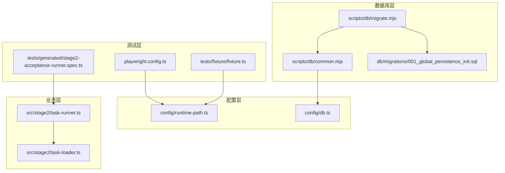
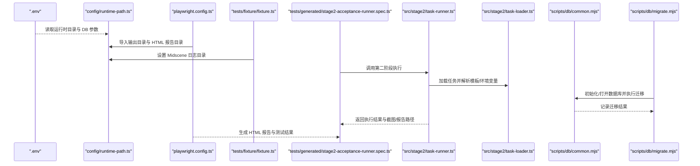
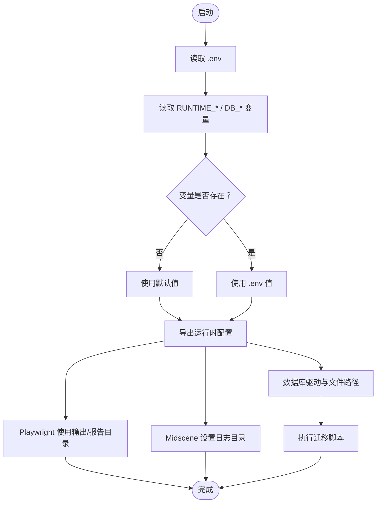
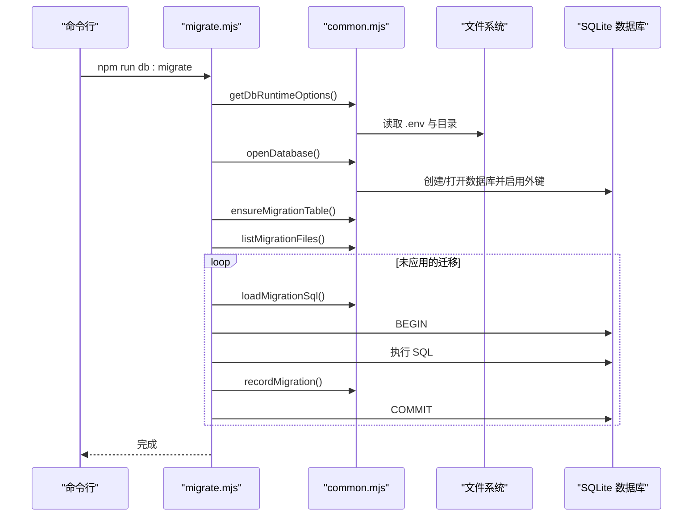
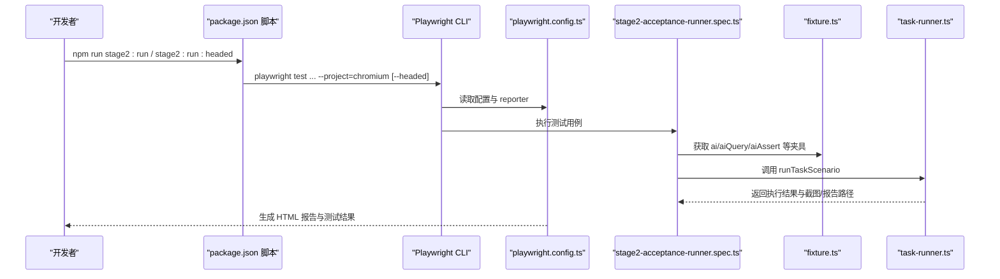
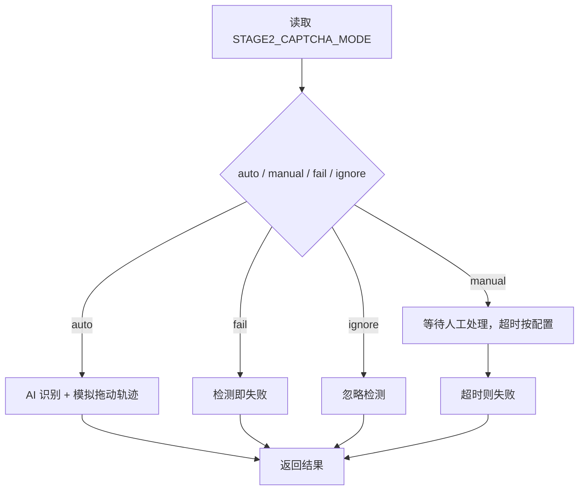
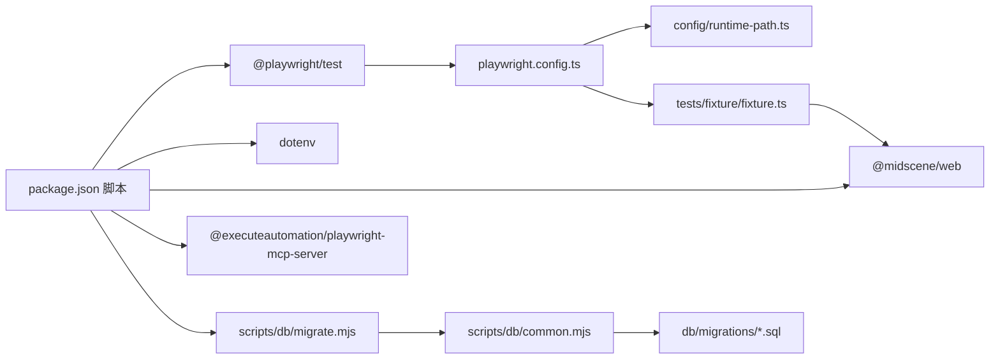

# 部署配置

<cite>
**本文引用的文件**
- [package.json](file://package.json)
- [playwright.config.ts](file://playwright.config.ts)
- [config/runtime-path.ts](file://config/runtime-path.ts)
- [config/db.ts](file://config/db.ts)
- [scripts/db/common.mjs](file://scripts/db/common.mjs)
- [scripts/db/migrate.mjs](file://scripts/db/migrate.mjs)
- [db/migrations/001_global_persistence_init.sql](file://db/migrations/001_global_persistence_init.sql)
- [tests/generated/stage2-acceptance-runner.spec.ts](file://tests/generated/stage2-acceptance-runner.spec.ts)
- [tests/fixture/fixture.ts](file://tests/fixture/fixture.ts)
- [src/stage2/task-runner.ts](file://src/stage2/task-runner.ts)
- [src/stage2/task-loader.ts](file://src/stage2/task-loader.ts)
- [README.md](file://README.md)
- [.gitignore](file://.gitignore)
- [AGENTS.md](file://AGENTS.md)
</cite>

## 目录
1. [简介](#简介)
2. [项目结构](#项目结构)
3. [核心组件](#核心组件)
4. [架构总览](#架构总览)
5. [详细组件分析](#详细组件分析)
6. [依赖关系分析](#依赖关系分析)
7. [性能考量](#性能考量)
8. [故障排查指南](#故障排查指南)
9. [结论](#结论)
10. [附录](#附录)

## 简介
本文件面向生产环境部署，系统性说明环境变量配置、数据库连接与迁移、运行时路径、Playwright 测试配置与执行、以及容器化部署最佳实践。同时给出开发、测试、生产三类环境的配置差异与切换方法，并提供静态资源与报告产物的部署、缓存与 CDN 集成思路。

## 项目结构
项目采用“配置模块 + 脚本 + 测试夹具 + 业务执行器”的分层组织方式：
- 配置层：集中于 config 目录，统一读取 .env 并导出运行时路径与数据库参数
- 数据库层：scripts/db 提供 SQLite 初始化与迁移逻辑，db/migrations 存放 SQL 迁移文件
- 测试层：tests 下的夹具与生成的执行入口，结合 Playwright 配置进行端到端执行
- 业务层：src/stage2 提供任务加载、执行与验证码处理等核心逻辑

图表来源
- [playwright.config.ts:1-95](file://playwright.config.ts#L1-L95)
- [config/runtime-path.ts:1-41](file://config/runtime-path.ts#L1-L41)
- [config/db.ts:1-28](file://config/db.ts#L1-L28)
- [scripts/db/common.mjs:1-108](file://scripts/db/common.mjs#L1-L108)
- [scripts/db/migrate.mjs:1-52](file://scripts/db/migrate.mjs#L1-L52)
- [db/migrations/001_global_persistence_init.sql:1-128](file://db/migrations/001_global_persistence_init.sql#L1-L128)
- [tests/fixture/fixture.ts:1-100](file://tests/fixture/fixture.ts#L1-L100)
- [tests/generated/stage2-acceptance-runner.spec.ts:1-39](file://tests/generated/stage2-acceptance-runner.spec.ts#L1-L39)
- [src/stage2/task-runner.ts:55-98](file://src/stage2/task-runner.ts#L55-L98)
- [src/stage2/task-loader.ts:1-31](file://src/stage2/task-loader.ts#L1-L31)

章节来源
- [README.md:1-223](file://README.md#L1-L223)

## 核心组件
- 环境变量与运行时路径
  - 通过 config/runtime-path.ts 从 .env 读取运行时目录前缀与各类产物目录，并提供路径解析函数
  - Playwright 配置读取该模块导出的输出目录与 HTML 报告目录
- 数据库配置与迁移
  - config/db.ts 读取数据库驱动与文件路径，支持 SQLite 单文件数据库
  - scripts/db/common.mjs 提供迁移所需的基础能力（打开数据库、校验迁移表、列出迁移文件、记录迁移）
  - scripts/db/migrate.mjs 逐个执行迁移文件并记录执行结果
  - db/migrations/001_global_persistence_init.sql 定义全局持久化表结构
- 测试与执行
  - tests/fixture/fixture.ts 注入 Midscene AI 能力与日志目录
  - tests/generated/stage2-acceptance-runner.spec.ts 作为第二阶段验收执行入口
  - src/stage2/task-runner.ts 解析验证码模式与超时等环境变量
  - src/stage2/task-loader.ts 支持模板字符串与环境变量注入

章节来源
- [config/runtime-path.ts:1-41](file://config/runtime-path.ts#L1-L41)
- [playwright.config.ts:1-95](file://playwright.config.ts#L1-L95)
- [config/db.ts:1-28](file://config/db.ts#L1-L28)
- [scripts/db/common.mjs:1-108](file://scripts/db/common.mjs#L1-L108)
- [scripts/db/migrate.mjs:1-52](file://scripts/db/migrate.mjs#L1-L52)
- [db/migrations/001_global_persistence_init.sql:1-128](file://db/migrations/001_global_persistence_init.sql#L1-L128)
- [tests/fixture/fixture.ts:1-100](file://tests/fixture/fixture.ts#L1-L100)
- [tests/generated/stage2-acceptance-runner.spec.ts:1-39](file://tests/generated/stage2-acceptance-runner.spec.ts#L1-L39)
- [src/stage2/task-runner.ts:55-98](file://src/stage2/task-runner.ts#L55-L98)
- [src/stage2/task-loader.ts:1-31](file://src/stage2/task-loader.ts#L1-L31)

## 架构总览
下图展示从环境变量到数据库、测试执行与产物输出的整体流程：

图表来源
- [config/runtime-path.ts:1-41](file://config/runtime-path.ts#L1-L41)
- [playwright.config.ts:1-95](file://playwright.config.ts#L1-L95)
- [tests/fixture/fixture.ts:1-100](file://tests/fixture/fixture.ts#L1-L100)
- [tests/generated/stage2-acceptance-runner.spec.ts:1-39](file://tests/generated/stage2-acceptance-runner.spec.ts#L1-L39)
- [src/stage2/task-runner.ts:55-98](file://src/stage2/task-runner.ts#L55-L98)
- [src/stage2/task-loader.ts:1-31](file://src/stage2/task-loader.ts#L1-L31)
- [scripts/db/common.mjs:1-108](file://scripts/db/common.mjs#L1-L108)
- [scripts/db/migrate.mjs:1-52](file://scripts/db/migrate.mjs#L1-L52)

## 详细组件分析

### 环境变量与运行时路径
- 关键变量
  - RUNTIME_DIR_PREFIX：运行时目录前缀，默认 t_runtime/
  - PLAYWRIGHT_OUTPUT_DIR：Playwright 执行产物目录
  - PLAYWRIGHT_HTML_REPORT_DIR：HTML 报告目录
  - MIDSCENE_RUN_DIR：Midscene 运行日志与缓存目录
  - ACCEPTANCE_RESULT_DIR：第二阶段验收结果目录
  - DB_DRIVER：数据库驱动（当前仅支持 sqlite）
  - DB_FILE_PATH：数据库文件路径（默认位于运行时目录下的 db 子目录）
- 读取机制
  - config/runtime-path.ts 与 config/db.ts 在模块加载时读取 .env 并提供默认值
  - playwright.config.ts 使用 runtime-path.ts 导出的目录常量作为 Playwright 输出与报告目录
- 路径解析
  - 提供 resolveRuntimePath 与 resolveDbPath，统一将相对路径解析为绝对路径

图表来源
- [config/runtime-path.ts:1-41](file://config/runtime-path.ts#L1-L41)
- [config/db.ts:1-28](file://config/db.ts#L1-L28)
- [playwright.config.ts:1-95](file://playwright.config.ts#L1-L95)

章节来源
- [config/runtime-path.ts:1-41](file://config/runtime-path.ts#L1-L41)
- [config/db.ts:1-28](file://config/db.ts#L1-L28)
- [playwright.config.ts:1-95](file://playwright.config.ts#L1-L95)
- [README.md:39-54](file://README.md#L39-L54)

### 数据库连接与迁移
- 驱动与文件路径
  - DB_DRIVER 固定为 sqlite，DB_FILE_PATH 默认位于运行时目录的 db 子目录
  - 通过 resolveDbPath 统一解析为绝对路径
- 迁移机制
  - scripts/db/common.mjs
    - getDbRuntimeOptions：读取运行时目录、驱动、数据库文件与迁移目录
    - openDatabase：确保目录存在并打开 SQLite 数据库，启用外键约束
    - ensureMigrationTable：创建迁移记录表
    - list/load/record：列出迁移文件、读取 SQL、记录执行结果
  - scripts/db/migrate.mjs
    - 逐个执行未应用的迁移，事务包裹，失败回滚
    - 输出执行日志与完成提示
- 表结构
  - db/migrations/001_global_persistence_init.sql 定义任务、版本、运行、步骤、快照、附件、审计日志等表及索引

图表来源
- [scripts/db/migrate.mjs:1-52](file://scripts/db/migrate.mjs#L1-L52)
- [scripts/db/common.mjs:1-108](file://scripts/db/common.mjs#L1-L108)
- [db/migrations/001_global_persistence_init.sql:1-128](file://db/migrations/001_global_persistence_init.sql#L1-L128)

章节来源
- [scripts/db/common.mjs:1-108](file://scripts/db/common.mjs#L1-L108)
- [scripts/db/migrate.mjs:1-52](file://scripts/db/migrate.mjs#L1-L52)
- [db/migrations/001_global_persistence_init.sql:1-128](file://db/migrations/001_global_persistence_init.sql#L1-L128)
- [README.md:120-130](file://README.md#L120-L130)

### Playwright 配置与测试执行
- 配置要点
  - testDir：测试目录
  - outputDir：测试产物目录（来自 runtime-path.ts）
  - timeout：单测超时时间
  - fullyParallel：文件内并行
  - forbidOnly：CI 环境下禁止遗留 test.only
  - retries：CI 环境重试次数
  - workers：CI 环境串行执行
  - reporter：list、html（禁开）、@midscene/web/playwright-report
  - use.trace：首次重试时收集 trace
- 浏览器与项目
  - 默认启用 Chromium 设备配置，其他浏览器与移动端配置可选启用
- 本地服务
  - 可配置 webServer 在本地启动服务（示例注释），避免在 CI 中复用已有服务
- 执行入口
  - tests/generated/stage2-acceptance-runner.spec.ts 作为第二阶段验收入口，集成 AI 能力与断言
  - package.json 提供 stage2:run 与 stage2:run:headed 两种执行脚本

图表来源
- [package.json:6-11](file://package.json#L6-L11)
- [playwright.config.ts:1-95](file://playwright.config.ts#L1-L95)
- [tests/generated/stage2-acceptance-runner.spec.ts:1-39](file://tests/generated/stage2-acceptance-runner.spec.ts#L1-L39)
- [tests/fixture/fixture.ts:1-100](file://tests/fixture/fixture.ts#L1-L100)
- [src/stage2/task-runner.ts:55-98](file://src/stage2/task-runner.ts#L55-L98)

章节来源
- [playwright.config.ts:1-95](file://playwright.config.ts#L1-L95)
- [package.json:6-11](file://package.json#L6-L11)
- [tests/generated/stage2-acceptance-runner.spec.ts:1-39](file://tests/generated/stage2-acceptance-runner.spec.ts#L1-L39)
- [tests/fixture/fixture.ts:1-100](file://tests/fixture/fixture.ts#L1-L100)
- [README.md:154-180](file://README.md#L154-L180)

### 验证码处理与任务加载
- 验证码模式
  - STAGE2_CAPTCHA_MODE：auto/manual/fail/ignore
  - STAGE2_CAPTCHA_WAIT_TIMEOUT_MS：人工模式等待超时（毫秒）
- 任务加载
  - 支持模板字符串与环境变量注入，便于动态替换时间戳、账号密码等

图表来源
- [src/stage2/task-runner.ts:55-98](file://src/stage2/task-runner.ts#L55-L98)

章节来源
- [src/stage2/task-runner.ts:55-98](file://src/stage2/task-runner.ts#L55-L98)
- [src/stage2/task-loader.ts:1-31](file://src/stage2/task-loader.ts#L1-L31)
- [README.md:56-62](file://README.md#L56-L62)

## 依赖关系分析
- 脚本命令
  - db:init / db:migrate：通过 Node 实验性 SQLite 能力执行迁移
  - stage2:run / stage2:run:headed：调用 Playwright 执行第二阶段验收测试
- 依赖管理
  - devDependencies：@playwright/test、@midscene/web、@types/node
  - dependencies：dotenv、playwright-mind、@executeautomation/playwright-mcp-server
- 外部集成
  - Midscene 提供 AI 能力与报告
  - Playwright 提供 UI 自动化与报告

图表来源
- [package.json:15-24](file://package.json#L15-L24)
- [playwright.config.ts:1-95](file://playwright.config.ts#L1-L95)
- [config/runtime-path.ts:1-41](file://config/runtime-path.ts#L1-L41)
- [scripts/db/migrate.mjs:1-52](file://scripts/db/migrate.mjs#L1-L52)
- [scripts/db/common.mjs:1-108](file://scripts/db/common.mjs#L1-L108)
- [db/migrations/001_global_persistence_init.sql:1-128](file://db/migrations/001_global_persistence_init.sql#L1-L128)

章节来源
- [package.json:1-26](file://package.json#L1-L26)

## 性能考量
- 并行与重试
  - 文件内并行执行提升吞吐，CI 环境下限制并发与启用重试，平衡稳定性与速度
- 超时与追踪
  - 合理设置 timeout 与 trace 收集策略，避免过长等待与过多磁盘 IO
- 数据库事务
  - 迁移使用事务，失败回滚，保证一致性与可恢复性
- 产物目录
  - 统一收敛到 t_runtime，便于清理与归档

[本节为通用指导，无需特定文件引用]

## 故障排查指南
- 环境变量未生效
  - 确认 .env 是否被正确加载（config/* 模块在导入时读取 .env）
  - 检查变量拼写与大小写（如 RUNTIME_DIR_PREFIX、DB_DRIVER 等）
- Playwright 报告缺失
  - 确认 PLAYWRIGHT_OUTPUT_DIR 与 PLAYWRIGHT_HTML_REPORT_DIR 是否正确
  - 检查 CI 环境变量 CI 是否导致 workers=1 或 forbidOnly 生效
- 数据库迁移失败
  - 查看迁移脚本输出，确认 SQL 语法与依赖文件存在
  - 检查 DB_DRIVER 与 DB_FILE_PATH 是否指向有效路径
- 验证码处理异常
  - 根据 STAGE2_CAPTCHA_MODE 切换模式，必要时提高 STAGE2_CAPTCHA_WAIT_TIMEOUT_MS
- 产物目录未生成
  - 确认 .gitignore 是否排除了 t_runtime 目录（开发环境可临时调整）

章节来源
- [config/runtime-path.ts:1-41](file://config/runtime-path.ts#L1-L41)
- [playwright.config.ts:29-34](file://playwright.config.ts#L29-L34)
- [scripts/db/migrate.mjs:15-51](file://scripts/db/migrate.mjs#L15-L51)
- [src/stage2/task-runner.ts:77-87](file://src/stage2/task-runner.ts#L77-L87)
- [.gitignore:1-4](file://.gitignore#L1-L4)

## 结论
通过集中化的环境变量与配置模块、标准化的数据库迁移流程、清晰的测试执行入口与产物目录，项目实现了可移植、可观测、可维护的部署基线。生产环境建议严格区分 CI 与本地执行行为，强化产物目录与日志管理，并结合外部报告与缓存策略完善交付链路。

[本节为总结，无需特定文件引用]

## 附录

### 不同部署环境的配置差异与切换
- 开发环境
  - 使用 --headed 模式便于调试
  - 可开启 webServer 本地服务
  - 适当放宽超时与重试
- 测试环境
  - CI 环境变量 CI 为真，禁用 test.only，启用有限重试，串行执行
- 生产环境
  - 严格控制超时与重试，确保报告与产物目录稳定输出
  - 通过 .env 管理所有路径与开关，避免硬编码

章节来源
- [playwright.config.ts:29-34](file://playwright.config.ts#L29-L34)
- [README.md:154-180](file://README.md#L154-L180)

### Docker 容器化部署建议
- 基础镜像
  - 使用官方 Node LTS 镜像，安装浏览器依赖
- 构建步骤
  - 复制 package*.json，执行安装
  - 复制源码与配置，执行 npx playwright install
- 运行步骤
  - 通过 .env 注入运行时目录与数据库路径
  - 执行 npm run db:migrate 初始化数据库
  - 执行 npm run stage2:run 或 playwright test 运行测试
- 产物与缓存
  - 将 t_runtime 映射为持久卷，便于报告与截图持久化
  - 如需 CDN，可将报告目录挂载至对象存储并配置访问域名

[本节为通用实践建议，无需特定文件引用]

### 静态资源部署、缓存策略与 CDN 集成
- 静态资源
  - 将 t_runtime 下的报告与截图作为静态资源发布
- 缓存策略
  - 对报告与截图设置合理的缓存头，避免频繁拉取
- CDN 集成
  - 将报告目录上传至对象存储并通过 CDN 分发
  - 通过 .env 控制报告输出目录，便于统一管理

[本节为通用实践建议，无需特定文件引用]