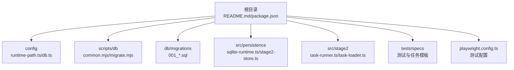
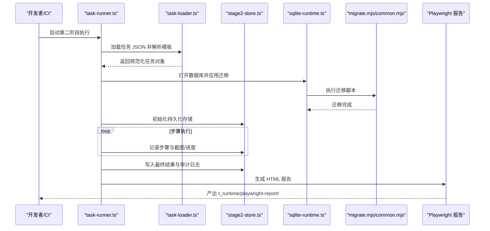
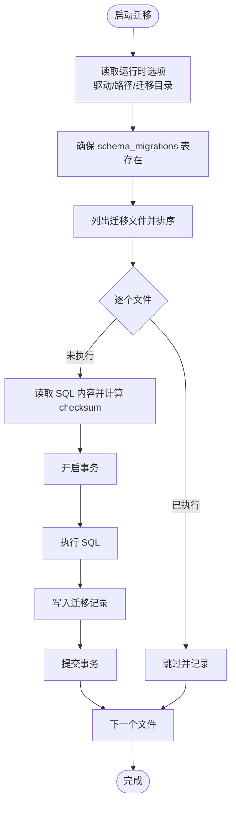
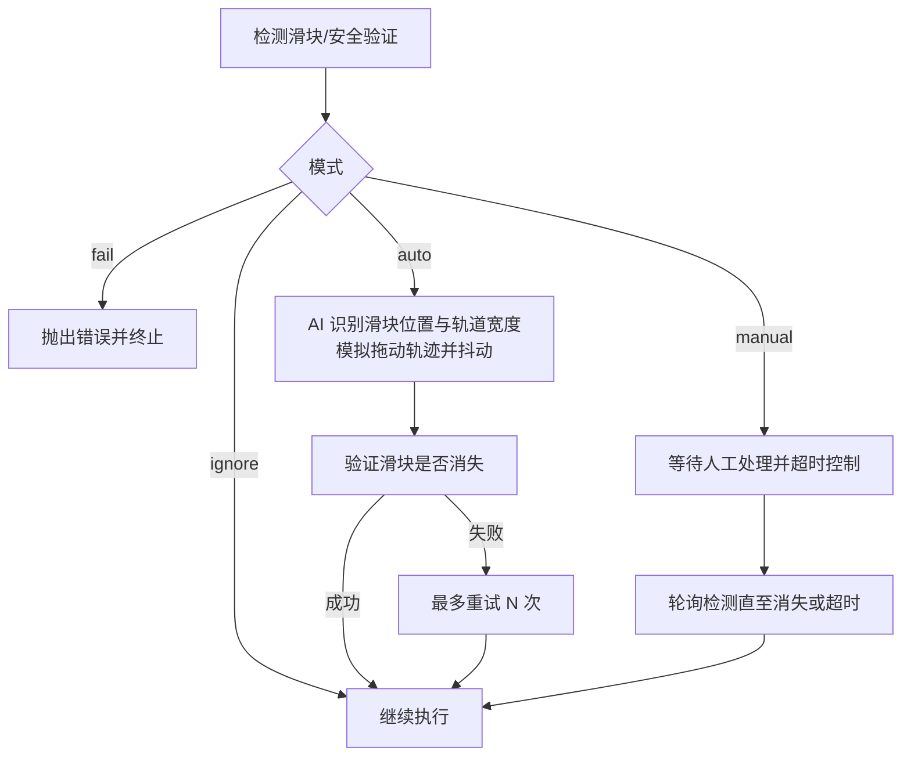
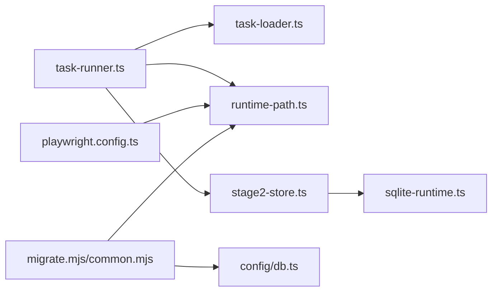

# 部署指南

<cite>
**本文引用的文件**
- [README.md](file://README.md)
- [package.json](file://package.json)
- [playwright.config.ts](file://playwright.config.ts)
- [config/runtime-path.ts](file://config/runtime-path.ts)
- [config/db.ts](file://config/db.ts)
- [scripts/db/common.mjs](file://scripts/db/common.mjs)
- [scripts/db/migrate.mjs](file://scripts/db/migrate.mjs)
- [db/migrations/001_global_persistence_init.sql](file://db/migrations/001_global_persistence_init.sql)
- [src/persistence/sqlite-runtime.ts](file://src/persistence/sqlite-runtime.ts)
- [src/persistence/stage2-store.ts](file://src/persistence/stage2-store.ts)
- [src/stage2/task-runner.ts](file://src/stage2/task-runner.ts)
- [src/stage2/task-loader.ts](file://src/stage2/task-loader.ts)
</cite>

## 目录
1. [简介](#简介)
2. [项目结构](#项目结构)
3. [核心组件](#核心组件)
4. [架构总览](#架构总览)
5. [详细组件分析](#详细组件分析)
6. [依赖关系分析](#依赖关系分析)
7. [性能考虑](#性能考虑)
8. [故障排除指南](#故障排除指南)
9. [结论](#结论)
10. [附录](#附录)

## 简介
本指南面向运维与开发团队，提供 HI-TEST 项目的生产环境部署与运维实践，覆盖系统依赖、环境变量、数据库设置、CI/CD 集成、监控与日志、安全配置、高可用与负载均衡、数据库维护策略以及常见问题排查。项目基于 Playwright 与 Midscene.js 实现 AI 驱动的 Web UI 自动化测试，并通过 SQLite 将运行期结构化数据持久化至本地文件。

## 项目结构
项目采用分层与功能模块结合的组织方式：
- 根目录包含安装与运行说明、包管理与脚本定义、Playwright 配置等
- config 子目录集中管理运行时路径与数据库配置
- scripts/db 提供数据库迁移与运行时选项解析
- db/migrations 存放 SQL 迁移脚本
- src 下按功能拆分：persistence（持久化）、stage2（执行器）
- tests 与 specs 提供测试用例与验收任务模板
- playwright.config.ts 统一测试运行参数与报告输出

图表来源
- [README.md:1-223](file://README.md#L1-L223)
- [package.json:1-26](file://package.json#L1-L26)
- [playwright.config.ts:1-95](file://playwright.config.ts#L1-L95)
- [config/runtime-path.ts:1-41](file://config/runtime-path.ts#L1-L41)
- [config/db.ts:1-28](file://config/db.ts#L1-L28)
- [scripts/db/common.mjs:1-108](file://scripts/db/common.mjs#L1-L108)
- [scripts/db/migrate.mjs:1-52](file://scripts/db/migrate.mjs#L1-L52)
- [db/migrations/001_global_persistence_init.sql:1-128](file://db/migrations/001_global_persistence_init.sql#L1-L128)
- [src/persistence/sqlite-runtime.ts:1-116](file://src/persistence/sqlite-runtime.ts#L1-L116)
- [src/persistence/stage2-store.ts:1-655](file://src/persistence/stage2-store.ts#L1-L655)
- [src/stage2/task-runner.ts:1-800](file://src/stage2/task-runner.ts#L1-L800)
- [src/stage2/task-loader.ts:1-91](file://src/stage2/task-loader.ts#L1-L91)

章节来源
- [README.md:1-223](file://README.md#L1-L223)
- [package.json:1-26](file://package.json#L1-L26)
- [playwright.config.ts:1-95](file://playwright.config.ts#L1-L95)

## 核心组件
- 运行时路径与产物目录：通过 RUNTIME_DIR_PREFIX 统一收敛 t_runtime/ 下的测试产物、报告、Midscene 日志与 SQLite 数据库文件
- 数据库配置：DB_DRIVER 与 DB_FILE_PATH 控制 SQLite 驱动与文件路径，支持通过 resolveDbPath 解析绝对路径
- 数据库迁移：scripts/db 提供迁移脚本与运行时选项解析，确保 schema_migrations 表存在并按序执行 SQL
- 测试框架：Playwright 配置集中管理超时、并行度、重试策略与报告输出
- 第二阶段执行器：加载任务 JSON、执行 UI 步骤、处理滑块验证码、写入持久化数据

章节来源
- [config/runtime-path.ts:1-41](file://config/runtime-path.ts#L1-L41)
- [config/db.ts:1-28](file://config/db.ts#L1-L28)
- [scripts/db/common.mjs:1-108](file://scripts/db/common.mjs#L1-L108)
- [scripts/db/migrate.mjs:1-52](file://scripts/db/migrate.mjs#L1-L52)
- [playwright.config.ts:1-95](file://playwright.config.ts#L1-L95)
- [src/stage2/task-runner.ts:1-800](file://src/stage2/task-runner.ts#L1-L800)

## 架构总览
下图展示从任务加载到执行、再到持久化的端到端流程，以及数据库迁移与报告输出的关键节点。

图表来源
- [src/stage2/task-runner.ts:1-800](file://src/stage2/task-runner.ts#L1-L800)
- [src/stage2/task-loader.ts:1-91](file://src/stage2/task-loader.ts#L1-L91)
- [src/persistence/stage2-store.ts:1-655](file://src/persistence/stage2-store.ts#L1-L655)
- [src/persistence/sqlite-runtime.ts:1-116](file://src/persistence/sqlite-runtime.ts#L1-L116)
- [scripts/db/migrate.mjs:1-52](file://scripts/db/migrate.mjs#L1-L52)
- [scripts/db/common.mjs:1-108](file://scripts/db/common.mjs#L1-L108)
- [playwright.config.ts:1-95](file://playwright.config.ts#L1-L95)

## 详细组件分析

### 数据库与迁移
- 运行时选项解析：getDbRuntimeOptions 从环境变量读取驱动与文件路径，计算迁移目录与绝对路径
- 迁移表与执行：ensureMigrationTable 创建 schema_migrations 表；按文件名排序依次执行 SQL，记录 checksum 与执行时间
- 数据库打开：openDatabase 确保目录存在并启用外键约束，仅支持 sqlite 驱动
- 迁移脚本：db/migrations/001_global_persistence_init.sql 定义 ai_task、ai_task_version、ai_run、ai_run_step、ai_snapshot、ai_artifact、ai_audit_log 等表及索引

图表来源
- [scripts/db/common.mjs:31-108](file://scripts/db/common.mjs#L31-L108)
- [scripts/db/migrate.mjs:12-52](file://scripts/db/migrate.mjs#L12-L52)
- [db/migrations/001_global_persistence_init.sql:1-128](file://db/migrations/001_global_persistence_init.sql#L1-L128)

章节来源
- [scripts/db/common.mjs:1-108](file://scripts/db/common.mjs#L1-L108)
- [scripts/db/migrate.mjs:1-52](file://scripts/db/migrate.mjs#L1-L52)
- [db/migrations/001_global_persistence_init.sql:1-128](file://db/migrations/001_global_persistence_init.sql#L1-L128)

### 运行时路径与产物目录
- 统一前缀：RUNTIME_DIR_PREFIX 控制 t_runtime/ 前缀
- 关键目录：PLAYWRIGHT_OUTPUT_DIR、PLAYWRIGHT_HTML_REPORT_DIR、MIDSCENE_RUN_DIR、ACCEPTANCE_RESULT_DIR
- 解析函数：resolveRuntimePath 将相对路径解析为绝对路径，便于持久化与报告输出

章节来源
- [config/runtime-path.ts:1-41](file://config/runtime-path.ts#L1-L41)

### 数据库配置与解析
- DB_DRIVER 与 DB_FILE_PATH：默认 sqlite 与 t_runtime/db/hi_test.sqlite
- resolveDbPath：将相对路径解析为绝对路径，确保数据库文件存在

章节来源
- [config/db.ts:1-28](file://config/db.ts#L1-L28)

### 第二阶段执行器与滑块验证码处理
- 任务加载：task-loader.ts 读取并校验任务 JSON，支持模板变量与环境变量替换
- 执行流程：task-runner.ts 负责 UI 步骤、AI 查询/断言、截图与报告生成
- 滑块验证码：支持 auto/manual/fail/ignore 四种模式，自动模式通过 AI 识别与 Playwright 模拟拖动轨迹

图表来源
- [src/stage2/task-runner.ts:55-706](file://src/stage2/task-runner.ts#L55-L706)

章节来源
- [src/stage2/task-runner.ts:1-800](file://src/stage2/task-runner.ts#L1-L800)
- [src/stage2/task-loader.ts:1-91](file://src/stage2/task-loader.ts#L1-L91)

### 持久化写入与审计
- Stage2PersistenceStore：负责任务、版本、运行、步骤、快照、附件与审计日志的写入
- 敏感信息掩码：任务内容中的密码字段在入库前被掩码处理
- 附件路径：相对路径与绝对路径均记录，便于报告与回溯

章节来源
- [src/persistence/stage2-store.ts:1-655](file://src/persistence/stage2-store.ts#L1-L655)

## 依赖关系分析
- 组件耦合
  - task-runner 依赖 task-loader、runtime-path、stage2-store
  - stage2-store 依赖 sqlite-runtime 与 runtime-path
  - playwright.config 依赖 runtime-path 以统一输出目录
  - scripts/db 与 config/db/runtime-path 共同决定数据库行为
- 外部依赖
  - Playwright 与 Midscene 报告插件用于测试与报告
  - Node SQLite 驱动用于本地数据库操作

图表来源
- [src/stage2/task-runner.ts:1-800](file://src/stage2/task-runner.ts#L1-L800)
- [src/stage2/task-loader.ts:1-91](file://src/stage2/task-loader.ts#L1-L91)
- [src/persistence/stage2-store.ts:1-655](file://src/persistence/stage2-store.ts#L1-L655)
- [src/persistence/sqlite-runtime.ts:1-116](file://src/persistence/sqlite-runtime.ts#L1-L116)
- [playwright.config.ts:1-95](file://playwright.config.ts#L1-L95)
- [scripts/db/migrate.mjs:1-52](file://scripts/db/migrate.mjs#L1-L52)
- [scripts/db/common.mjs:1-108](file://scripts/db/common.mjs#L1-L108)
- [config/db.ts:1-28](file://config/db.ts#L1-L28)
- [config/runtime-path.ts:1-41](file://config/runtime-path.ts#L1-L41)

章节来源
- [package.json:1-26](file://package.json#L1-L26)

## 性能考虑
- 并行与重试
  - CI 环境禁用并行测试，限制 workers 数量；仅在 CI 上启用重试，避免本地调试干扰
- 超时与稳定性
  - Playwright 默认超时约 90 秒；滑块验证码等待时间可通过环境变量配置
- 数据库性能
  - 迁移脚本按序执行并记录 checksum，避免重复执行；外键约束已启用
- 产物与存储
  - 运行产物统一收敛到 t_runtime/，便于清理与归档；数据库仅存结构化信息与文件路径，不存储大文件二进制

章节来源
- [playwright.config.ts:22-95](file://playwright.config.ts#L22-L95)
- [README.md:154-190](file://README.md#L154-L190)

## 故障排除指南
- 数据库无法打开或迁移失败
  - 检查 DB_DRIVER 是否为 sqlite；确认 DB_FILE_PATH 与 RUNTIME_DIR_PREFIX 组合的绝对路径存在
  - 查看迁移脚本执行日志，确认 schema_migrations 表创建成功
- 迁移重复执行或失败回滚
  - 迁移脚本在执行失败时会回滚事务；检查 SQL 语法与依赖对象是否存在
- 滑块验证码导致执行中断
  - 若使用 auto 模式但失败，可切换为 manual 模式并调大等待时间；必要时调整检测选择器
- 报告与产物缺失
  - 确认 PLAYWRIGHT_OUTPUT_DIR 与 PLAYWRIGHT_HTML_REPORT_DIR 路径可写；检查 CI 环境 workers 设置
- 任务文件加载错误
  - 确认 STAGE2_TASK_FILE 指向的 JSON 存在且包含必需字段；模板变量与环境变量替换是否正确

章节来源
- [scripts/db/common.mjs:47-58](file://scripts/db/common.mjs#L47-L58)
- [scripts/db/migrate.mjs:15-51](file://scripts/db/migrate.mjs#L15-L51)
- [src/stage2/task-runner.ts:650-706](file://src/stage2/task-runner.ts#L650-L706)
- [playwright.config.ts:22-49](file://playwright.config.ts#L22-L49)
- [src/stage2/task-loader.ts:71-91](file://src/stage2/task-loader.ts#L71-L91)

## 结论
本指南提供了从环境准备、数据库部署、CI/CD 集成到监控与故障排除的完整实践路径。通过统一的运行时路径与数据库配置、严谨的迁移机制与持久化写入策略，以及对滑块验证码与报告输出的细致处理，项目可在生产环境中稳定运行。建议在上线前完成数据库备份策略与监控告警配置，并定期评估迁移脚本与产物清理策略。

## 附录

### 生产环境部署步骤
- 系统依赖
  - Node.js（支持 node:sqlite 实验特性）
  - Playwright 浏览器依赖（安装一次即可）
- 环境变量
  - RUNTIME_DIR_PREFIX：统一运行产物目录前缀
  - DB_DRIVER：数据库驱动（默认 sqlite）
  - DB_FILE_PATH：数据库文件绝对或相对路径
  - PLAYWRIGHT_OUTPUT_DIR、PLAYWRIGHT_HTML_REPORT_DIR、MIDSCENE_RUN_DIR、ACCEPTANCE_RESULT_DIR：各产物目录
  - STAGE2_TASK_FILE：第二阶段任务 JSON 路径
  - STAGE2_CAPTCHA_MODE：滑块验证码处理模式（auto/manual/fail/ignore）
  - STAGE2_CAPTCHA_WAIT_TIMEOUT_MS：人工处理等待超时（毫秒）
- 数据库初始化与迁移
  - 初始化：执行数据库初始化脚本
  - 迁移：执行迁移脚本，按序应用 SQL 并记录 checksum
- 运行测试
  - 执行第二阶段任务：根据需要选择有头/无头模式
  - 生成报告：查看 Playwright HTML 报告与 Midscene 报告

章节来源
- [README.md:10-190](file://README.md#L10-L190)
- [package.json:6-11](file://package.json#L6-L11)
- [scripts/db/migrate.mjs:12-52](file://scripts/db/migrate.mjs#L12-L52)

### CI/CD 集成要点
- 在 CI 中禁用并行测试，限制 workers 数量；仅在 CI 环境启用重试
- 使用 npm run db:init 与 db:migrate 确保数据库一致
- 将 t_runtime/ 产物归档，以便后续审计与问题复现

章节来源
- [playwright.config.ts:29-34](file://playwright.config.ts#L29-L34)
- [README.md:120-130](file://README.md#L120-L130)

### 监控与日志最佳实践
- 性能监控
  - 关注测试超时与重试次数；在 CI 中观察迁移耗时与数据库连接稳定性
- 错误追踪
  - 利用 Playwright HTML 报告与 Midscene 报告定位失败步骤；结合数据库中的 ai_run_step 与 ai_audit_log 进行审计
- 日志
  - 运行时日志集中在 t_runtime/ 下，便于收集与留存

章节来源
- [playwright.config.ts:36-40](file://playwright.config.ts#L36-L40)
- [README.md:76-96](file://README.md#L76-L96)

### 数据库部署与维护策略
- 备份
  - 定期复制 DB_FILE_PATH 对应的 SQLite 文件；建议在迁移前后进行快照
- 迁移
  - 通过 db:migrate 应用变更；如需回滚，需手工处理（当前脚本未内置回滚）
- 性能优化
  - 保持 schema_migrations 表与索引有效；避免在运行期频繁写入大文件二进制

章节来源
- [scripts/db/common.mjs:60-108](file://scripts/db/common.mjs#L60-L108)
- [db/migrations/001_global_persistence_init.sql:120-128](file://db/migrations/001_global_persistence_init.sql#L120-L128)

### 安全配置指导
- API 密钥管理
  - 通过环境变量注入；在任务 JSON 中敏感字段会被掩码入库
- 访问控制
  - 本地 SQLite 文件权限控制；CI 中避免明文暴露密钥，使用受保护变量

章节来源
- [src/persistence/stage2-store.ts:37-48](file://src/persistence/stage2-store.ts#L37-L48)
- [README.md:31-54](file://README.md#L31-L54)

### 负载均衡与高可用
- 当前实现为本地单文件 SQLite，不涉及多实例共享存储
- 如需扩展，建议将 DB_FILE_PATH 迁移至共享存储或替换为 MySQL，并在 CI/CD 中增加数据库迁移与备份流程

章节来源
- [README.md:97-118](file://README.md#L97-L118)
- [config/db.ts:20-26](file://config/db.ts#L20-L26)