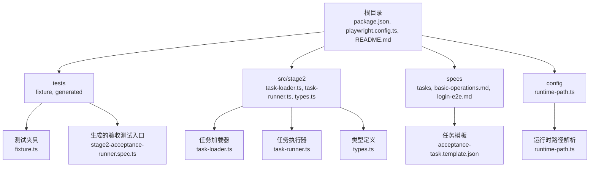
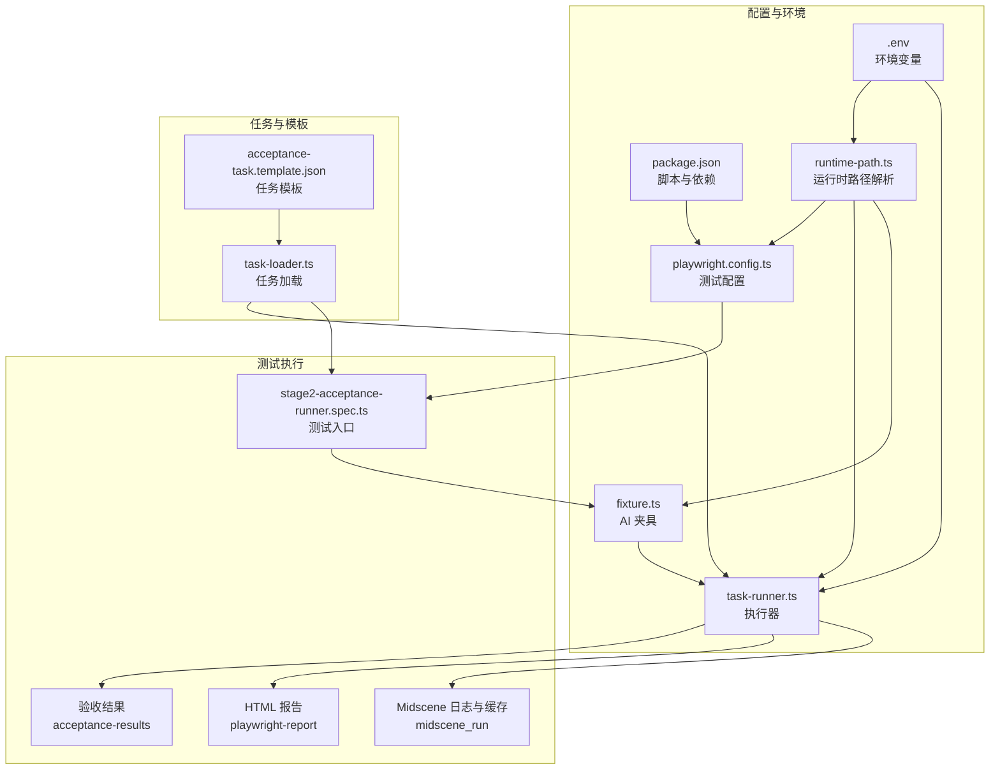
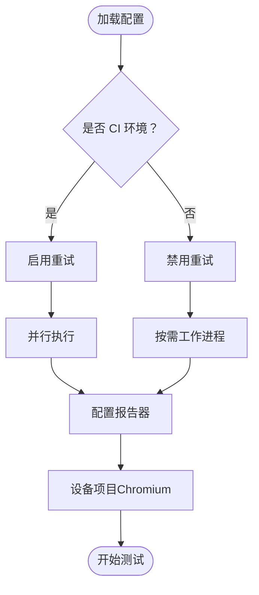
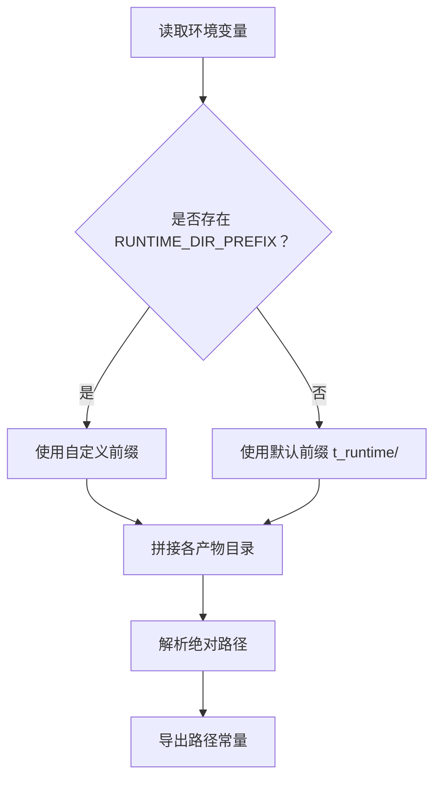
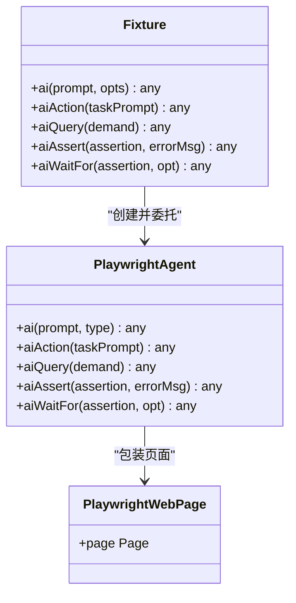
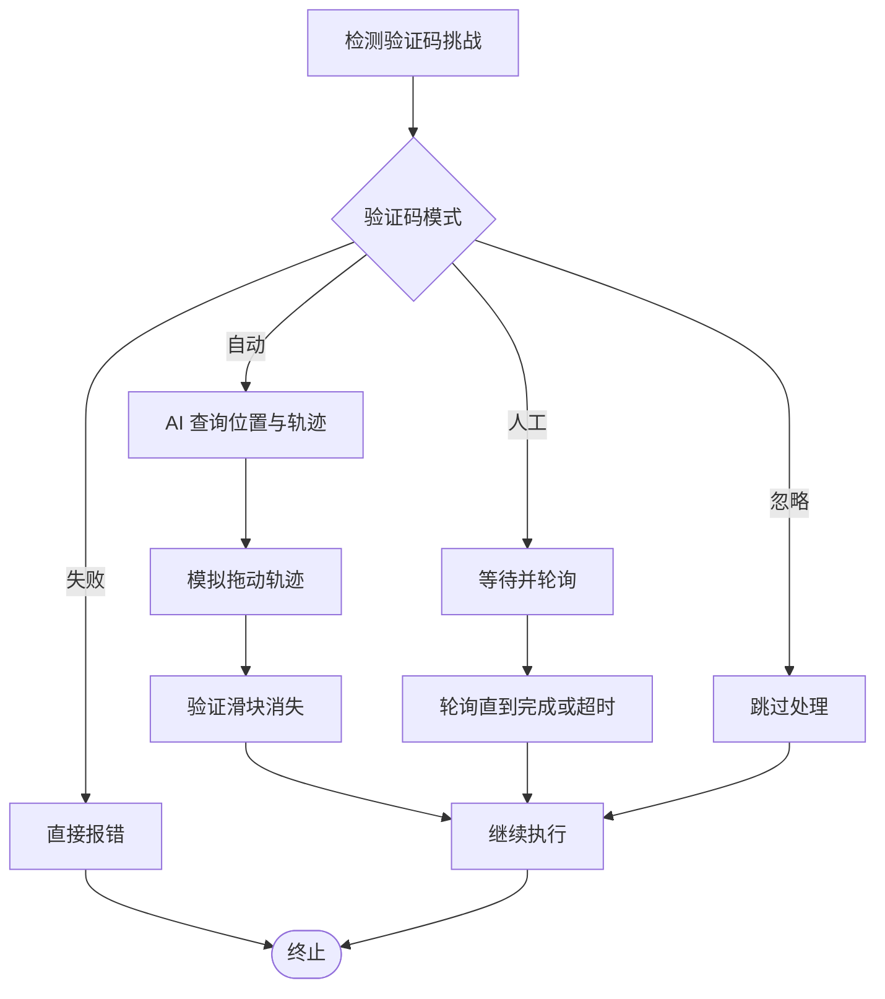
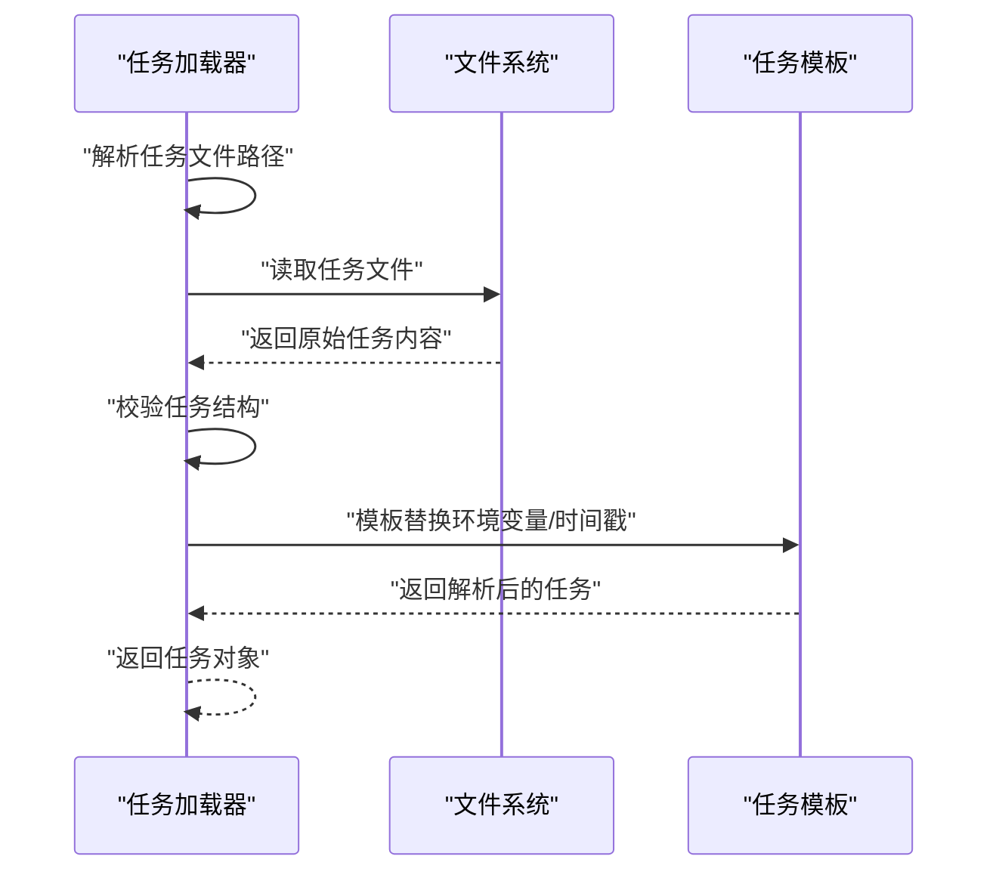
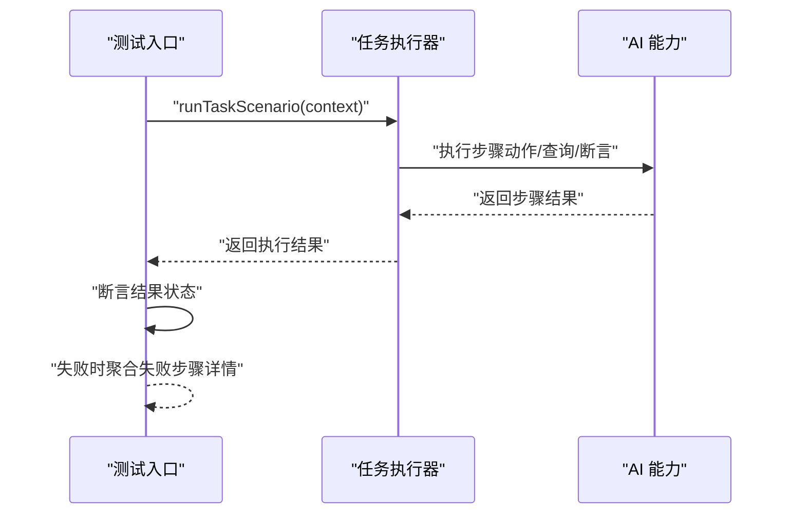
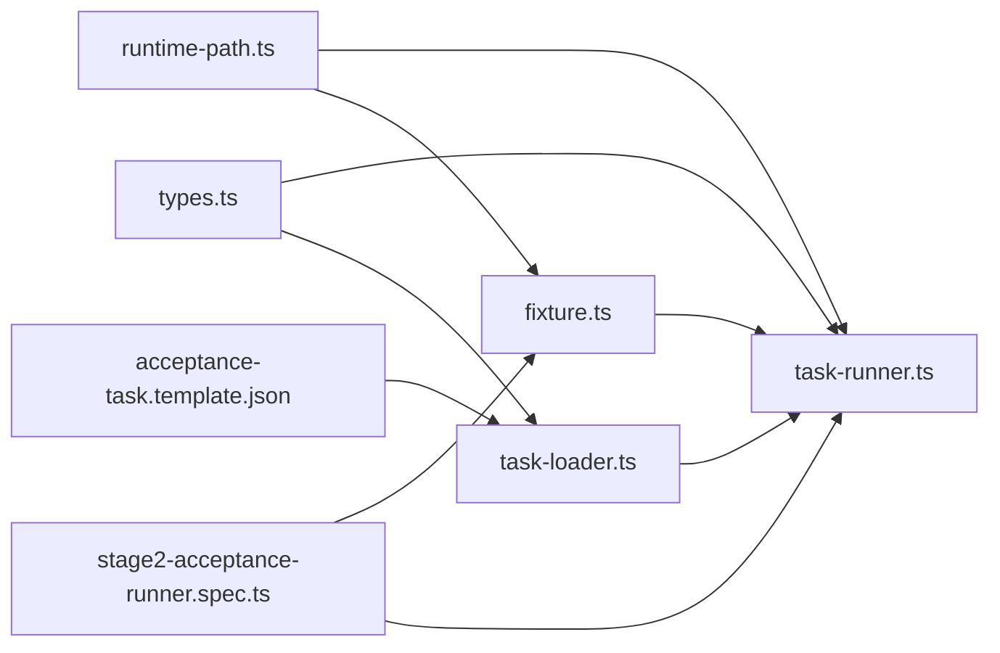

# CI/CD 集成

<cite>
**本文引用的文件**
- [package.json](file://package.json)
- [playwright.config.ts](file://playwright.config.ts)
- [README.md](file://README.md)
- [runtime-path.ts](file://config/runtime-path.ts)
- [fixture.ts](file://tests/fixture/fixture.ts)
- [stage2-acceptance-runner.spec.ts](file://tests/generated/stage2-acceptance-runner.spec.ts)
- [task-runner.ts](file://src/stage2/task-runner.ts)
- [task-loader.ts](file://src/stage2/task-loader.ts)
- [types.ts](file://src/stage2/types.ts)
- [acceptance-task.template.json](file://specs/tasks/acceptance-task.template.json)
</cite>

## 目录
1. [简介](#简介)
2. [项目结构](#项目结构)
3. [核心组件](#核心组件)
4. [架构总览](#架构总览)
5. [详细组件分析](#详细组件分析)
6. [依赖关系分析](#依赖关系分析)
7. [性能考量](#性能考量)
8. [故障排查指南](#故障排查指南)
9. [结论](#结论)
10. [附录](#附录)

## 简介
本文件面向 HI-TEST 项目的持续集成与持续交付（CI/CD）集成，聚焦于基于 GitHub Actions 的自动化测试流水线设计、构建触发条件与部署策略。文档涵盖代码质量检查、单元测试、端到端测试与报告生成的完整流程，以及多环境部署策略（开发、测试、生产）的配置差异说明。同时，详细阐述自动化测试执行流程，包括 Playwright 浏览器启动、AI 模型调用（Midscene）、结果验证与滑块验证码自动处理机制，并给出部署回滚与版本管理的最佳实践，以确保系统的稳定性与可追溯性。

## 项目结构
项目采用分层组织方式，核心围绕 Playwright 端到端测试、Midscene AI 能力与第二阶段任务执行器展开：
- 根目录包含包管理与脚本定义、Playwright 配置、运行时路径解析与测试样例。
- tests 目录提供测试夹具与生成的验收测试入口。
- src/stage2 目录提供任务加载、执行器与类型定义。
- specs 目录提供任务模板与基础操作说明。
- config 目录提供运行时路径解析与环境变量读取。

图表来源
- [package.json](file://package.json#L1-L24)
- [playwright.config.ts](file://playwright.config.ts#L1-L95)
- [runtime-path.ts](file://config/runtime-path.ts#L1-L41)
- [fixture.ts](file://tests/fixture/fixture.ts#L1-L100)
- [stage2-acceptance-runner.spec.ts](file://tests/generated/stage2-acceptance-runner.spec.ts#L1-L39)
- [task-runner.ts](file://src/stage2/task-runner.ts#L1-L800)
- [task-loader.ts](file://src/stage2/task-loader.ts#L1-L91)
- [types.ts](file://src/stage2/types.ts#L1-L125)
- [acceptance-task.template.json](file://specs/tasks/acceptance-task.template.json#L1-L85)

章节来源
- [package.json](file://package.json#L1-L24)
- [playwright.config.ts](file://playwright.config.ts#L1-L95)
- [runtime-path.ts](file://config/runtime-path.ts#L1-L41)

## 核心组件
- Playwright 测试配置与报告：通过配置文件集中管理超时、并行度、重试策略、报告器与项目设备配置，支持 CI 环境下的严格模式与 HTML 报告输出。
- 运行时路径解析：通过环境变量统一管理测试产物目录（Playwright 输出、HTML 报告、Midscene 运行日志、验收结果等），便于多环境一致性。
- 测试夹具：封装 AI 能力（动作、查询、断言、等待），并与 Midscene Agent 集成，生成可追踪的报告与缓存。
- 任务执行器：负责加载任务、执行步骤、处理滑块验证码、截图与结果记录，支持多种验证码模式与超时控制。
- 任务加载器：解析任务模板，支持环境变量与时间戳占位符替换，保证任务参数在不同环境的一致性。
- 任务模板：提供标准的验收任务结构，包含目标页面、账户信息、导航、表单、搜索、断言与清理策略等。

章节来源
- [playwright.config.ts](file://playwright.config.ts#L22-L94)
- [runtime-path.ts](file://config/runtime-path.ts#L8-L40)
- [fixture.ts](file://tests/fixture/fixture.ts#L23-L99)
- [task-runner.ts](file://src/stage2/task-runner.ts#L58-L84)
- [task-loader.ts](file://src/stage2/task-loader.ts#L79-L89)
- [acceptance-task.template.json](file://specs/tasks/acceptance-task.template.json#L1-L85)

## 架构总览
下图展示从任务模板到最终验收结果的端到端执行链路，以及关键的环境变量与配置项如何影响行为。

图表来源
- [package.json](file://package.json#L6-L9)
- [playwright.config.ts](file://playwright.config.ts#L22-L94)
- [runtime-path.ts](file://config/runtime-path.ts#L8-L40)
- [fixture.ts](file://tests/fixture/fixture.ts#L23-L99)
- [stage2-acceptance-runner.spec.ts](file://tests/generated/stage2-acceptance-runner.spec.ts#L9-L38)
- [task-runner.ts](file://src/stage2/task-runner.ts#L108-L126)
- [task-loader.ts](file://src/stage2/task-loader.ts#L79-L89)
- [acceptance-task.template.json](file://specs/tasks/acceptance-task.template.json#L1-L85)

## 详细组件分析

### 组件 A：Playwright 测试配置与报告
- 关键特性
  - 并行测试与重试策略：在 CI 环境启用重试并在本地禁用，提升稳定性与速度平衡。
  - 报告器组合：list、HTML 与第三方报告器，便于本地与 CI 的可视化反馈。
  - 设备项目：预置 Chromium，便于跨平台一致执行。
  - 严格模式：CI 环境下禁止遗留的 only 测试，避免误触发。
- 影响范围
  - 影响测试执行时间、资源占用与报告生成位置。
  - 与运行时路径解析配合，确保产物目录可控。

图表来源
- [playwright.config.ts](file://playwright.config.ts#L22-L94)

章节来源
- [playwright.config.ts](file://playwright.config.ts#L22-L94)

### 组件 B：运行时路径解析与环境变量
- 关键特性
  - 通过环境变量统一管理运行时目录前缀与各产物目录，支持多环境差异化。
  - 提供路径解析函数，确保产物落盘位置一致且可追踪。
- 影响范围
  - 影响测试产物、报告与日志的存储位置，便于 CI 缓存与归档。

图表来源
- [runtime-path.ts](file://config/runtime-path.ts#L8-L40)

章节来源
- [runtime-path.ts](file://config/runtime-path.ts#L8-L40)

### 组件 C：测试夹具与 AI 能力
- 关键特性
  - 封装 ai、aiAction、aiQuery、aiAssert、aiWaitFor 等方法，统一测试上下文与缓存标识。
  - 集成 Midscene Agent，生成可追踪报告与缓存，便于问题定位。
- 影响范围
  - 影响测试可读性、可维护性与可追溯性。

图表来源
- [fixture.ts](file://tests/fixture/fixture.ts#L23-L99)

章节来源
- [fixture.ts](file://tests/fixture/fixture.ts#L23-L99)

### 组件 D：任务执行器（滑块验证码与步骤执行）
- 关键特性
  - 支持多种验证码模式：自动、人工、失败、忽略，满足不同安全策略需求。
  - 自动模式通过 AI 查询滑块位置与滑槽宽度，模拟真人拖动轨迹并验证结果。
  - 提供步骤超时、页面超时、截图与跟踪等运行时配置。
- 影响范围
  - 影响测试稳定性与通过率，尤其在复杂安全验证场景。

图表来源
- [task-runner.ts](file://src/stage2/task-runner.ts#L480-L703)

章节来源
- [task-runner.ts](file://src/stage2/task-runner.ts#L58-L84)
- [task-runner.ts](file://src/stage2/task-runner.ts#L558-L645)
- [task-runner.ts](file://src/stage2/task-runner.ts#L647-L703)

### 组件 E：任务加载器与模板
- 关键特性
  - 解析任务文件路径，支持绝对与相对路径。
  - 对任务内容进行模板替换，支持环境变量与时间戳占位符。
  - 校验任务结构完整性，确保关键字段存在。
- 影响范围
  - 影响任务参数在不同环境的一致性与可复用性。

图表来源
- [task-loader.ts](file://src/stage2/task-loader.ts#L71-L89)

章节来源
- [task-loader.ts](file://src/stage2/task-loader.ts#L71-L89)
- [acceptance-task.template.json](file://specs/tasks/acceptance-task.template.json#L1-L85)

### 组件 F：测试入口与结果验证
- 关键特性
  - 测试入口加载任务并执行，对结果进行断言与错误聚合。
  - 失败时收集最后一步的详细信息（步骤名、消息、截图路径）用于定位。
- 影响范围
  - 影响测试失败时的可观测性与可诊断性。

图表来源
- [stage2-acceptance-runner.spec.ts](file://tests/generated/stage2-acceptance-runner.spec.ts#L12-L37)
- [task-runner.ts](file://src/stage2/task-runner.ts#L108-L126)

章节来源
- [stage2-acceptance-runner.spec.ts](file://tests/generated/stage2-acceptance-runner.spec.ts#L12-L37)

## 依赖关系分析
- 组件耦合与内聚
  - 测试夹具与执行器通过上下文接口耦合，职责清晰：夹具负责 AI 能力封装，执行器负责业务流程编排。
  - 任务加载器与执行器通过任务对象解耦，便于扩展新任务类型。
- 外部依赖与集成点
  - Playwright 与 Midscene 的集成通过夹具与 Agent 实现，报告与缓存由运行时路径统一管理。
- 潜在循环依赖
  - 当前结构无明显循环依赖，但应避免在执行器中直接引入测试入口的实现细节。

图表来源
- [fixture.ts](file://tests/fixture/fixture.ts#L23-L99)
- [task-runner.ts](file://src/stage2/task-runner.ts#L1-L800)
- [task-loader.ts](file://src/stage2/task-loader.ts#L1-L91)
- [types.ts](file://src/stage2/types.ts#L1-L125)
- [runtime-path.ts](file://config/runtime-path.ts#L8-L40)
- [stage2-acceptance-runner.spec.ts](file://tests/generated/stage2-acceptance-runner.spec.ts#L1-L39)
- [acceptance-task.template.json](file://specs/tasks/acceptance-task.template.json#L1-L85)

章节来源
- [fixture.ts](file://tests/fixture/fixture.ts#L23-L99)
- [task-runner.ts](file://src/stage2/task-runner.ts#L1-L800)
- [task-loader.ts](file://src/stage2/task-loader.ts#L1-L91)
- [types.ts](file://src/stage2/types.ts#L1-L125)
- [runtime-path.ts](file://config/runtime-path.ts#L8-L40)
- [stage2-acceptance-runner.spec.ts](file://tests/generated/stage2-acceptance-runner.spec.ts#L1-L39)
- [acceptance-task.template.json](file://specs/tasks/acceptance-task.template.json#L1-L85)

## 性能考量
- 并行与重试
  - 在 CI 环境启用重试与串行化，避免资源竞争；在本地禁用重试以提升迭代速度。
- 超时与截图
  - 合理设置步骤与页面超时，避免长时间阻塞；按需开启截图与跟踪，平衡可观测性与性能。
- 产物目录
  - 使用统一的运行时路径解析，便于缓存命中与产物归档，减少重复下载与构建时间。

## 故障排查指南
- 验证码处理失败
  - 若自动模式失败，检查滑块检测选择器与 AI 查询提示词；必要时切换为人工模式并延长等待时间。
- 任务模板缺失字段
  - 确保任务模板包含必需字段（如 taskId、taskName、target.url、account.username/password 等），否则加载器会抛出错误。
- 报告与产物不可见
  - 检查运行时路径解析与环境变量配置，确保产物目录可写且路径正确。
- 测试入口断言失败
  - 查看失败步骤详情（步骤名、消息、截图路径），结合 Midscene 报告定位问题。

章节来源
- [task-runner.ts](file://src/stage2/task-runner.ts#L647-L703)
- [task-loader.ts](file://src/stage2/task-loader.ts#L50-L69)
- [runtime-path.ts](file://config/runtime-path.ts#L8-L40)
- [stage2-acceptance-runner.spec.ts](file://tests/generated/stage2-acceptance-runner.spec.ts#L27-L36)

## 结论
本项目通过 Playwright 与 Midscene 的深度集成，构建了可扩展、可观测且可追溯的端到端测试体系。借助统一的运行时路径解析与任务模板机制，实现了多环境的一致性与可维护性。建议在 CI/CD 中结合上述组件与配置，完善自动化测试流水线与部署策略，确保系统稳定性与可追溯性。

## 附录
- 多环境部署策略建议
  - 开发环境：本地调试优先，禁用重试，开启头部浏览器与详细跟踪；使用本地数据库与测试账户。
  - 测试环境：启用重试与并行，使用独立测试账户与隔离数据库；开启 HTML 与 Midscene 报告。
  - 生产环境：严格模式，禁用头部浏览器，启用只读数据库与最小权限账户；失败即阻断发布。
- 部署回滚与版本管理最佳实践
  - 版本号与分支策略：采用语义化版本与分支保护，确保可回滚基线清晰。
  - 产物归档：将测试报告、截图与日志归档至制品库，保留至少一个季度历史。
  - 回滚流程：基于版本标签与制品库快速回滚，同时记录回滚原因与影响面。