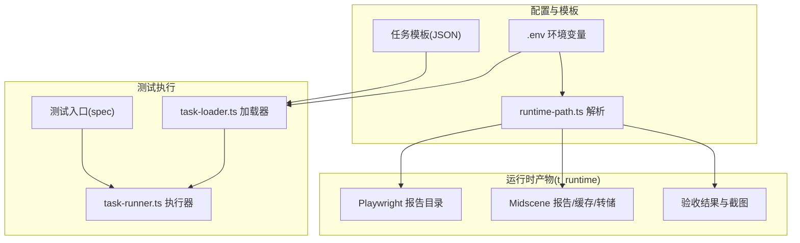
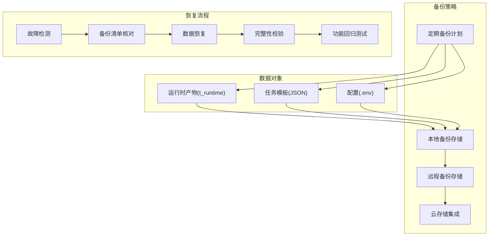
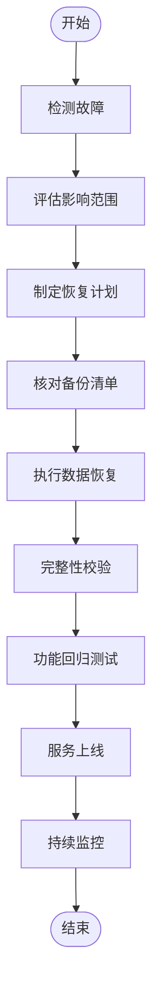
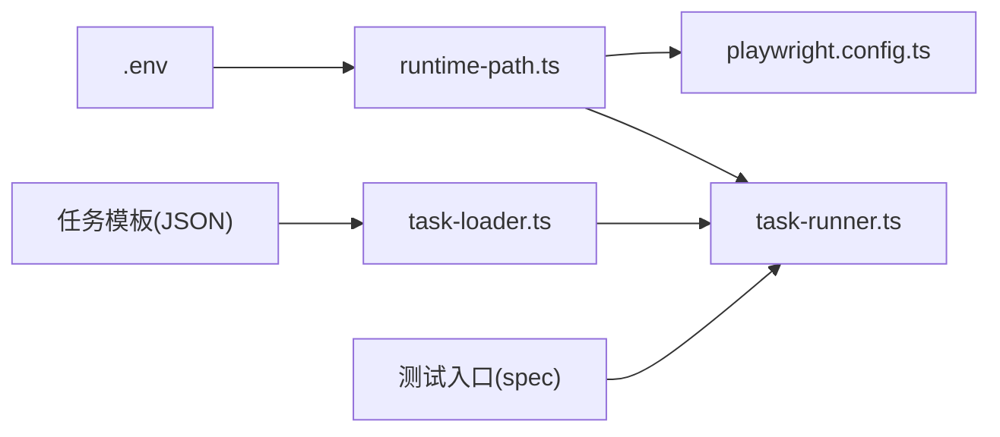

# 备份恢复

<cite>
**本文引用的文件**
- [README.md](file://README.md)
- [AGENTS.md](file://AGENTS.md)
- [.gitignore](file://.gitignore)
- [package.json](file://package.json)
- [playwright.config.ts](file://playwright.config.ts)
- [config/runtime-path.ts](file://config/runtime-path.ts)
- [src/stage2/task-runner.ts](file://src/stage2/task-runner.ts)
- [src/stage2/task-loader.ts](file://src/stage2/task-loader.ts)
- [src/stage2/types.ts](file://src/stage2/types.ts)
- [specs/tasks/acceptance-task.template.json](file://specs/tasks/acceptance-task.template.json)
- [specs/tasks/acceptance-task.community-create.example.json](file://specs/tasks/acceptance-task.community-create.example.json)
- [tests/generated/stage2-acceptance-runner.spec.ts](file://tests/generated/stage2-acceptance-runner.spec.ts)
- [tests/fixture/fixture.ts](file://tests/fixture/fixture.ts)
</cite>

## 目录
1. [引言](#引言)
2. [项目结构](#项目结构)
3. [核心组件](#核心组件)
4. [架构总览](#架构总览)
5. [详细组件分析](#详细组件分析)
6. [依赖关系分析](#依赖关系分析)
7. [性能考量](#性能考量)
8. [故障排查指南](#故障排查指南)
9. [结论](#结论)
10. [附录](#附录)

## 引言
本文件面向 HI-TEST 项目，围绕测试数据与配置文件的备份与恢复，制定可落地的策略与流程。重点覆盖：
- 运行时目录的定期备份与归档
- 任务模板的版本管理与变更记录
- 配置变更的审计与回溯
- 灾难恢复计划与业务连续性保障
- 备份存储配置（本地、远程、云存储）
- 恢复流程与数据完整性验证
- 备份策略的定期审查与更新机制
- 备份监控与告警配置

## 项目结构
HI-TEST 采用基于 Playwright 与 Midscene 的自动化测试体系，运行产物统一收敛至 t_runtime 目录，便于集中备份与归档。关键目录与文件如下：
- 运行产物目录：t_runtime（包含 Playwright 报告、Midscene 报告、AI 结果与截图等）
- 任务模板：specs/tasks 下的 JSON 模板与示例
- 配置来源：.env 环境变量与 runtime-path.ts 动态解析
- 测试入口：tests/generated/stage2-acceptance-runner.spec.ts
- 日志与报告：由 Playwright 与 Midscene 在运行时生成

图表来源
- [README.md](file://README.md#L74-L92)
- [config/runtime-path.ts](file://config/runtime-path.ts#L13-L36)
- [playwright.config.ts](file://playwright.config.ts#L22-L40)
- [tests/generated/stage2-acceptance-runner.spec.ts](file://tests/generated/stage2-acceptance-runner.spec.ts#L1-L39)
- [src/stage2/task-runner.ts](file://src/stage2/task-runner.ts#L108-L117)
- [src/stage2/task-loader.ts](file://src/stage2/task-loader.ts#L79-L89)

章节来源
- [README.md](file://README.md#L74-L92)
- [config/runtime-path.ts](file://config/runtime-path.ts#L1-L41)
- [playwright.config.ts](file://playwright.config.ts#L1-L95)
- [.gitignore](file://.gitignore#L1-L4)

## 核心组件
- 运行时路径解析：通过 runtime-path.ts 从 .env 读取并解析运行时目录前缀与子目录，保证所有产物目录可配置、可追踪。
- 任务加载与模板解析：task-loader.ts 支持环境变量与时间戳占位符替换，确保每次执行的任务参数可复现且可审计。
- 执行器与产物生成：task-runner.ts 生成验收结果目录、截图与中间文件，并在 acceptance-result 目录下按任务与时间戳分层存放。
- 测试入口与夹具：tests/generated/stage2-acceptance-runner.spec.ts 作为执行入口；tests/fixture/fixture.ts 设置 Midscene 日志目录与 AI 能力注入。

章节来源
- [config/runtime-path.ts](file://config/runtime-path.ts#L1-L41)
- [src/stage2/task-loader.ts](file://src/stage2/task-loader.ts#L1-L91)
- [src/stage2/task-runner.ts](file://src/stage2/task-runner.ts#L108-L117)
- [tests/generated/stage2-acceptance-runner.spec.ts](file://tests/generated/stage2-acceptance-runner.spec.ts#L1-L39)
- [tests/fixture/fixture.ts](file://tests/fixture/fixture.ts#L1-L100)

## 架构总览
下图展示备份与恢复策略在系统中的位置与交互关系：备份策略围绕运行时产物、任务模板与配置文件三类对象，结合本地/远程/云存储进行周期性归档与版本化管理；恢复流程在系统故障时依据备份清单进行数据回放与验证。

## 详细组件分析

### 运行时目录备份策略
- 备份范围：t_runtime 下的 Playwright 报告、Midscene 报告/缓存/转储、验收结果与截图。
- 备份频率：建议每日增量备份 + 每周全量备份；CI 场景可在流水线结束时触发备份。
- 存储位置：本地磁盘归档目录、远程服务器共享盘、云对象存储桶。
- 归档命名：按日期与时间戳命名，保留层级结构以便快速定位。
- 压缩与去重：启用压缩与重复数据删除，降低存储成本。
- 权限控制：限制访问权限，防止篡改；备份介质加密存储。

章节来源
- [README.md](file://README.md#L74-L92)
- [config/runtime-path.ts](file://config/runtime-path.ts#L13-L36)
- [playwright.config.ts](file://playwright.config.ts#L22-L40)
- [tests/fixture/fixture.ts](file://tests/fixture/fixture.ts#L10-L10)

### 任务模板版本管理
- 版本化：模板文件纳入版本控制系统，使用分支/标签区分不同版本。
- 变更记录：每次模板变更需在变更日志中记录变更原因、影响范围与回滚方案。
- 审批流程：重大模板变更需经评审与审批，确保与业务需求一致。
- 回归测试：模板升级后需执行回归测试，验证执行稳定性与结果一致性。
- 演化路径：通过分支策略支持并行演进，合并前进行冲突解决与集成测试。

章节来源
- [specs/tasks/acceptance-task.template.json](file://specs/tasks/acceptance-task.template.json#L1-L85)
- [specs/tasks/acceptance-task.community-create.example.json](file://specs/tasks/acceptance-task.community-create.example.json#L1-L184)
- [src/stage2/task-loader.ts](file://src/stage2/task-loader.ts#L79-L89)

### 配置变更记录
- 集中式配置：所有运行时目录与行为开关通过 .env 与 runtime-path.ts 统一管理。
- 变更审计：每次 .env 变更需记录变更项、生效时间、责任人与影响评估。
- 回滚机制：配置变更失败时可快速回滚至上一个稳定版本。
- 环境隔离：开发/测试/生产环境使用不同 .env 文件，避免交叉污染。
- 自动化校验：变更后执行基础校验，确认目录输出位置与行为符合预期。

章节来源
- [README.md](file://README.md#L39-L52)
- [config/runtime-path.ts](file://config/runtime-path.ts#L1-L41)
- [AGENTS.md](file://AGENTS.md#L22-L31)

### 灾难恢复计划
- 故障场景分类：硬件故障、网络中断、存储损坏、配置错误、模板破坏。
- 恢复优先级：业务连续性保障优先，其次为数据完整性，最后为系统可用性。
- 恢复步骤：
  1) 故障检测与报警
  2) 备份清单核对与可用性验证
  3) 数据恢复与系统重建
  4) 完整性校验与功能回归测试
  5) 服务上线与监控
- 业务连续性：通过异地多活、灾备演练与自动切换机制保障业务不中断。

### 恢复流程操作步骤
- 准备阶段：准备恢复介质、验证备份完整性、准备恢复环境。
- 数据恢复：按备份清单逐项恢复，注意目录结构与权限。
- 完整性验证：比对哈希值或校验和，确保数据未被篡改。
- 功能测试：执行关键用例，验证系统功能正常。
- 记录归档：记录恢复过程与结果，更新故障与恢复档案。

章节来源
- [README.md](file://README.md#L74-L92)
- [src/stage2/task-runner.ts](file://src/stage2/task-runner.ts#L108-L117)

### 备份存储配置方法
- 本地备份：使用本地磁盘或NAS，按天/周归档，保留多个版本。
- 远程备份：通过网络共享或FTP/SFTP将备份传输至远程服务器。
- 云存储集成：对接对象存储（如 OSS/COS/S3），支持生命周期管理与跨区域冗余。
- 加密与脱敏：对敏感配置与测试数据进行加密与脱敏处理。
- 成本优化：启用压缩、去重与冷热分层，降低长期存储成本。

### 备份策略定期审查与更新机制
- 审查周期：每季度对备份策略进行审查，结合业务变化与技术演进调整策略。
- 更新流程：变更需经过评审、测试与发布，确保不影响现有备份与恢复流程。
- 文档同步：变更记录与文档同步更新，确保团队成员了解最新策略。

### 备份监控与告警
- 监控指标：备份成功率、备份耗时、存储容量、传输速率、完整性校验结果。
- 告警阈值：设定失败率、超时、存储空间不足等阈值，触发即时告警。
- 告警渠道：邮件、IM、电话等方式通知相关人员。
- 自动化巡检：定期执行健康检查，提前发现潜在问题。

## 依赖关系分析
- 配置依赖：运行时目录由 .env 与 runtime-path.ts 决定，playwright.config.ts 使用解析后的目录配置。
- 执行依赖：测试入口依赖 task-runner.ts 与 task-loader.ts，后者负责模板解析与任务加载。
- 产物依赖：验收结果与截图由 task-runner.ts 生成，受 runtime-path.ts 与 Midscene 配置影响。

图表来源
- [config/runtime-path.ts](file://config/runtime-path.ts#L1-L41)
- [playwright.config.ts](file://playwright.config.ts#L1-L95)
- [src/stage2/task-runner.ts](file://src/stage2/task-runner.ts#L1-L1344)
- [src/stage2/task-loader.ts](file://src/stage2/task-loader.ts#L1-L91)
- [specs/tasks/acceptance-task.template.json](file://specs/tasks/acceptance-task.template.json#L1-L85)
- [specs/tasks/acceptance-task.community-create.example.json](file://specs/tasks/acceptance-task.community-create.example.json#L1-L184)
- [tests/generated/stage2-acceptance-runner.spec.ts](file://tests/generated/stage2-acceptance-runner.spec.ts#L1-L39)

章节来源
- [config/runtime-path.ts](file://config/runtime-path.ts#L1-L41)
- [playwright.config.ts](file://playwright.config.ts#L1-L95)
- [src/stage2/task-runner.ts](file://src/stage2/task-runner.ts#L1-L1344)
- [src/stage2/task-loader.ts](file://src/stage2/task-loader.ts#L1-L91)
- [specs/tasks/acceptance-task.template.json](file://specs/tasks/acceptance-task.template.json#L1-L85)
- [specs/tasks/acceptance-task.community-create.example.json](file://specs/tasks/acceptance-task.community-create.example.json#L1-L184)
- [tests/generated/stage2-acceptance-runner.spec.ts](file://tests/generated/stage2-acceptance-runner.spec.ts#L1-L39)

## 性能考量
- 备份性能：合理安排备份窗口，避免与高峰期冲突；使用并行与增量策略提升效率。
- 存储性能：根据数据访问频率选择合适的存储介质与分层策略。
- 恢复性能：优化恢复流程，缩短RTO/RPO，确保业务尽快恢复。

## 故障排查指南
- 运行时目录缺失：检查 .env 与 runtime-path.ts 配置，确认目录解析逻辑与权限。
- 任务模板加载失败：检查模板文件路径、JSON 格式与必填字段，确认 task-loader.ts 的解析逻辑。
- 报告与截图丢失：确认 Midscene 日志目录设置与 Playwright 报告输出配置。
- 配置变更导致异常：回滚至上一个稳定 .env 版本，重新执行基础校验。

章节来源
- [config/runtime-path.ts](file://config/runtime-path.ts#L1-L41)
- [src/stage2/task-loader.ts](file://src/stage2/task-loader.ts#L79-L89)
- [tests/fixture/fixture.ts](file://tests/fixture/fixture.ts#L10-L10)
- [playwright.config.ts](file://playwright.config.ts#L22-L40)

## 结论
通过统一的运行时目录管理、模板版本化与配置审计，结合本地/远程/云存储的多层备份与完善的灾难恢复流程，HI-TEST 项目能够有效保障测试数据与配置的安全性与可恢复性。建议持续完善监控与告警体系，定期审查与更新备份策略，确保在系统故障时快速恢复并维持业务连续性。

## 附录
- 关键配置项与默认值参考：见 .env 与 runtime-path.ts 中的运行时目录定义。
- 任务模型与字段定义：见 types.ts 中的 AcceptanceTask 与相关接口。
- 示例任务模板：见 acceptance-task.template.json 与 acceptance-task.community-create.example.json。

章节来源
- [README.md](file://README.md#L39-L52)
- [config/runtime-path.ts](file://config/runtime-path.ts#L13-L36)
- [src/stage2/types.ts](file://src/stage2/types.ts#L86-L98)
- [specs/tasks/acceptance-task.template.json](file://specs/tasks/acceptance-task.template.json#L1-L85)
- [specs/tasks/acceptance-task.community-create.example.json](file://specs/tasks/acceptance-task.community-create.example.json#L1-L184)