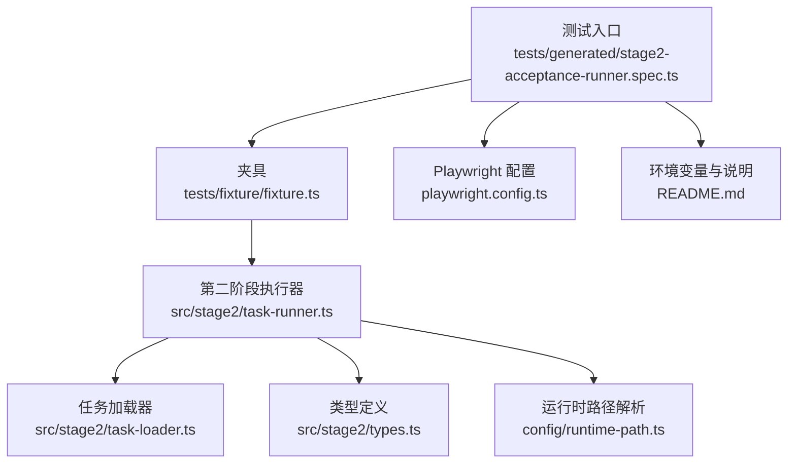
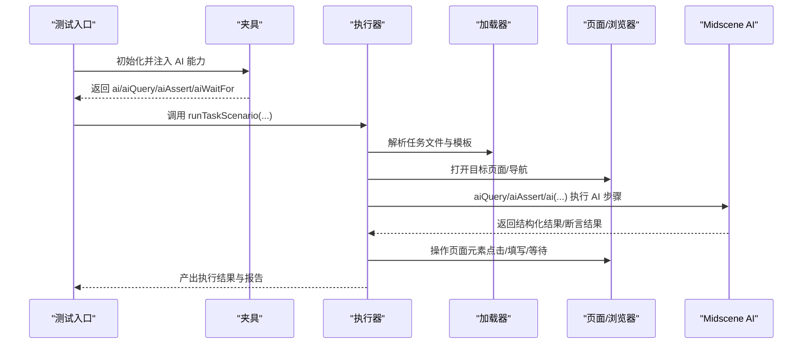
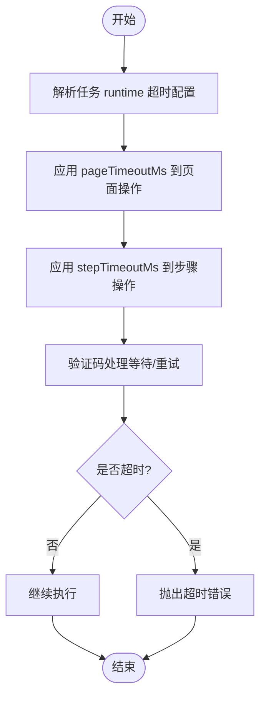
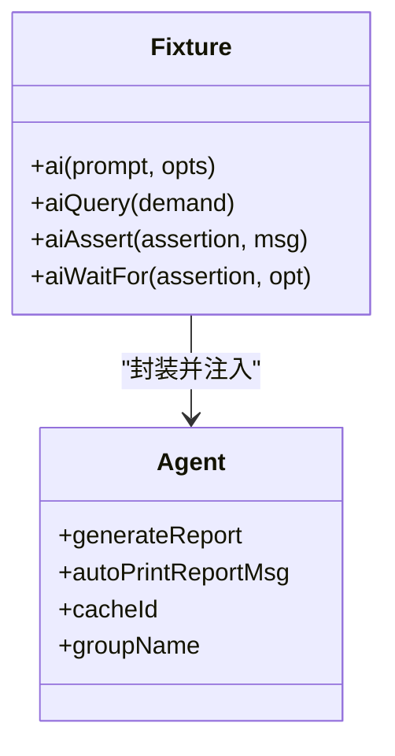
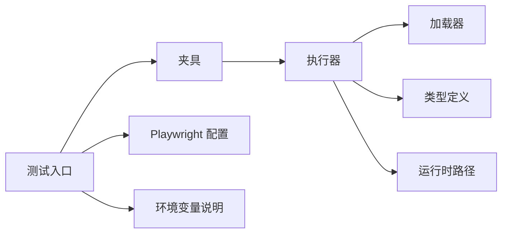

# 性能优化

<cite>
**本文引用的文件**
- [README.md](file://README.md)
- [package.json](file://package.json)
- [playwright.config.ts](file://playwright.config.ts)
- [config/runtime-path.ts](file://config/runtime-path.ts)
- [src/stage2/types.ts](file://src/stage2/types.ts)
- [src/stage2/task-runner.ts](file://src/stage2/task-runner.ts)
- [src/stage2/task-loader.ts](file://src/stage2/task-loader.ts)
- [tests/generated/stage2-acceptance-runner.spec.ts](file://tests/generated/stage2-acceptance-runner.spec.ts)
- [tests/fixture/fixture.ts](file://tests/fixture/fixture.ts)
- [specs/tasks/acceptance-task.community-create.example.json](file://specs/tasks/acceptance-task.community-create.example.json)
</cite>

## 目录
1. [简介](#简介)
2. [项目结构](#项目结构)
3. [核心组件](#核心组件)
4. [架构总览](#架构总览)
5. [详细组件分析](#详细组件分析)
6. [依赖关系分析](#依赖关系分析)
7. [性能考量](#性能考量)
8. [故障排查指南](#故障排查指南)
9. [结论](#结论)
10. [附录](#附录)

## 简介
本文件面向 HI-TEST 项目，聚焦高负载环境下的系统稳定性保障与性能优化，覆盖并发执行控制、资源限制与超时配置；浏览器性能优化（页面加载、内存与垃圾回收）；AI 处理性能（模型调用频率控制、缓存与批量）；数据库连接池与查询优化（若涉及）；以及资源使用监控与瓶颈分析方法，并提供性能基准测试与回归检测的实施建议。

## 项目结构
项目采用 Playwright + Midscene 的 UI 自动化与 AI 能力组合，核心运行链路由测试入口驱动，经由夹具注入 AI 能力，最终由第二阶段执行器驱动任务 JSON 的自动化执行。运行产物目录统一收敛至 t_runtime/，便于性能数据与报告的集中管理。

**图表来源**
- [tests/generated/stage2-acceptance-runner.spec.ts](file://tests/generated/stage2-acceptance-runner.spec.ts#L1-L39)
- [tests/fixture/fixture.ts](file://tests/fixture/fixture.ts#L1-L100)
- [src/stage2/task-runner.ts](file://src/stage2/task-runner.ts#L1-L120)
- [src/stage2/task-loader.ts](file://src/stage2/task-loader.ts#L1-L91)
- [src/stage2/types.ts](file://src/stage2/types.ts#L1-L125)
- [config/runtime-path.ts](file://config/runtime-path.ts#L1-L41)
- [playwright.config.ts](file://playwright.config.ts#L1-L95)
- [README.md](file://README.md#L1-L144)

**章节来源**
- [README.md](file://README.md#L1-L144)
- [playwright.config.ts](file://playwright.config.ts#L1-L95)
- [config/runtime-path.ts](file://config/runtime-path.ts#L1-L41)
- [tests/generated/stage2-acceptance-runner.spec.ts](file://tests/generated/stage2-acceptance-runner.spec.ts#L1-L39)
- [tests/fixture/fixture.ts](file://tests/fixture/fixture.ts#L1-L100)
- [src/stage2/task-runner.ts](file://src/stage2/task-runner.ts#L1-L120)
- [src/stage2/task-loader.ts](file://src/stage2/task-loader.ts#L1-L91)
- [src/stage2/types.ts](file://src/stage2/types.ts#L1-L125)

## 核心组件
- 测试入口与超时控制：测试入口设置较长的测试超时，确保复杂任务场景有足够时间完成。
- 夹具与 AI 能力：夹具为每个测试用例注入 AI 能力（ai、aiQuery、aiAssert、aiWaitFor），并启用 Midscene 报告与缓存标识，利于性能与结果追踪。
- 第二阶段执行器：负责任务加载、页面交互、AI 查询与断言、验证码处理、截图与报告生成等。
- 任务加载器：解析任务文件路径、模板变量替换、形状校验。
- 运行时路径：统一管理 t_runtime/ 下的输出目录，便于性能数据归档与分析。
- Playwright 配置：全局超时、并行策略、工作进程、报告器与追踪配置。

**章节来源**
- [tests/generated/stage2-acceptance-runner.spec.ts](file://tests/generated/stage2-acceptance-runner.spec.ts#L10-L37)
- [tests/fixture/fixture.ts](file://tests/fixture/fixture.ts#L23-L99)
- [src/stage2/task-runner.ts](file://src/stage2/task-runner.ts#L1-L120)
- [src/stage2/task-loader.ts](file://src/stage2/task-loader.ts#L71-L91)
- [config/runtime-path.ts](file://config/runtime-path.ts#L38-L41)
- [playwright.config.ts](file://playwright.config.ts#L22-L48)

## 架构总览
整体执行流从测试入口开始，经夹具注入 AI 能力，交由执行器按任务 JSON 驱动页面交互与 AI 查询，期间进行验证码处理、截图与断言，最终产出报告与结果。

**图表来源**
- [tests/generated/stage2-acceptance-runner.spec.ts](file://tests/generated/stage2-acceptance-runner.spec.ts#L12-L36)
- [tests/fixture/fixture.ts](file://tests/fixture/fixture.ts#L23-L99)
- [src/stage2/task-runner.ts](file://src/stage2/task-runner.ts#L558-L703)
- [src/stage2/task-loader.ts](file://src/stage2/task-loader.ts#L71-L91)

## 详细组件分析

### 组件一：并发执行控制与资源限制
- Playwright 并行策略
  - fullyParallel 启用，提升吞吐量。
  - workers 在 CI 环境设为 1，避免资源竞争；本地默认 undefined，按 CPU 自适应。
  - forbidOnly 与 retries 在 CI 环境严格控制构建质量。
- 测试超时
  - 测试入口设置较长超时，适配复杂任务与 AI 查询。
  - Playwright 全局 timeout 与各步骤 timeout（来自任务 runtime 配置）共同保障稳定性。
- 资源限制建议
  - CI 环境固定 workers=1，避免多实例竞争磁盘与网络。
  - 限制同时运行的测试数量，结合队列与信号量控制并发度。
  - 控制 Midscene 缓存大小与日志级别，减少磁盘 IO。

**章节来源**
- [playwright.config.ts](file://playwright.config.ts#L28-L34)
- [tests/generated/stage2-acceptance-runner.spec.ts](file://tests/generated/stage2-acceptance-runner.spec.ts#L10-L10)
- [src/stage2/types.ts](file://src/stage2/types.ts#L73-L78)

### 组件二：超时配置与稳定性保障
- 全局超时
  - Playwright 全局 timeout 设置为 90 秒，避免长时间阻塞。
- 测试超时
  - 测试入口设置 5 分钟超时，满足复杂任务与 AI 调用。
- 步骤与页面超时
  - 任务 runtime 支持 stepTimeoutMs 与 pageTimeoutMs，执行器按需传入页面操作。
- 验证码等待超时
  - 支持配置人工处理等待时间与自动处理重试次数，防止无限等待。

**图表来源**
- [src/stage2/task-runner.ts](file://src/stage2/task-runner.ts#L119-L126)
- [src/stage2/types.ts](file://src/stage2/types.ts#L73-L78)
- [src/stage2/task-runner.ts](file://src/stage2/task-runner.ts#L647-L703)

**章节来源**
- [playwright.config.ts](file://playwright.config.ts#L25-L26)
- [tests/generated/stage2-acceptance-runner.spec.ts](file://tests/generated/stage2-acceptance-runner.spec.ts#L10-L10)
- [src/stage2/types.ts](file://src/stage2/types.ts#L73-L78)
- [src/stage2/task-runner.ts](file://src/stage2/task-runner.ts#L119-L126)
- [src/stage2/task-runner.ts](file://src/stage2/task-runner.ts#L647-L703)

### 组件三：浏览器性能优化最佳实践
- 页面加载优化
  - 合理设置 pageTimeoutMs 与 stepTimeoutMs，避免过长等待导致资源占用。
  - 使用 waitForLoadState 与显式等待，减少不必要的轮询。
- 内存与垃圾回收
  - 控制截图与报告生成频率，避免大量临时对象堆积。
  - 在夹具中合理设置 Midscene 缓存 ID 与日志级别，降低内存压力。
- 拖动轨迹与交互
  - AI 模拟拖动轨迹采用分步与抖动，避免频繁重绘与布局抖动。
  - 对可见性检测与定位器使用 try/catch，减少无效查询造成的页面负担。

**章节来源**
- [src/stage2/task-runner.ts](file://src/stage2/task-runner.ts#L558-L645)
- [src/stage2/task-runner.ts](file://src/stage2/task-runner.ts#L411-L448)
- [tests/fixture/fixture.ts](file://tests/fixture/fixture.ts#L23-L99)

### 组件四：AI 处理性能优化
- 模型调用频率控制
  - 使用夹具中的缓存 ID 与组名，避免重复请求相同 prompt。
  - 合理拆分步骤，合并相似查询，减少往返次数。
- 缓存策略
  - Midscene 提供缓存目录与日志目录，统一收敛到 t_runtime/，便于清理与容量控制。
- 批量处理
  - 将多个相似步骤合并为批量查询，减少页面交互次数。
  - 对断言与查询进行去重与合并，避免重复计算。

**图表来源**
- [tests/fixture/fixture.ts](file://tests/fixture/fixture.ts#L23-L99)

**章节来源**
- [tests/fixture/fixture.ts](file://tests/fixture/fixture.ts#L23-L99)
- [config/runtime-path.ts](file://config/runtime-path.ts#L28-L36)

### 组件五：数据库连接池与查询优化（若涉及）
- 若项目涉及数据存储，建议：
  - 连接池大小：根据并发任务数与数据库承载能力设定最大连接数与空闲连接数。
  - 查询优化：使用索引、避免 N+1 查询、分页与投影字段裁剪。
  - 事务与超时：设置合理的事务超时与查询超时，防止长事务锁表。
  - 连接复用：在执行器中复用连接，避免频繁创建销毁连接。
- 当前仓库未见数据库相关实现，以上为通用建议。

[本节为通用指导，不直接分析具体文件]

### 组件六：资源使用监控与瓶颈分析
- 监控指标
  - CPU、内存、磁盘 IO、网络带宽、页面渲染耗时、AI 请求耗时。
- 分析方法
  - 结合 Playwright HTML 报告与 Midscene 报告，定位耗时步骤。
  - 使用操作系统监控工具（如 perf、top、iotop）与浏览器开发者工具分析瓶颈。
  - 对截图与报告进行容量统计，评估磁盘压力。
- 建议
  - 在 CI 中开启更详细的追踪与日志，定位异常耗时步骤。
  - 对高频 AI 查询建立缓存命中率统计，优化缓存策略。

**章节来源**
- [playwright.config.ts](file://playwright.config.ts#L36-L40)
- [README.md](file://README.md#L74-L91)

## 依赖关系分析
- 测试入口依赖夹具提供的 AI 能力与执行器。
- 执行器依赖任务加载器与运行时路径解析。
- 夹具依赖 Midscene SDK，统一日志与缓存目录。
- Playwright 配置影响整体并发与超时策略。

**图表来源**
- [tests/generated/stage2-acceptance-runner.spec.ts](file://tests/generated/stage2-acceptance-runner.spec.ts#L1-L39)
- [tests/fixture/fixture.ts](file://tests/fixture/fixture.ts#L1-L100)
- [src/stage2/task-runner.ts](file://src/stage2/task-runner.ts#L1-L120)
- [src/stage2/task-loader.ts](file://src/stage2/task-loader.ts#L1-L91)
- [src/stage2/types.ts](file://src/stage2/types.ts#L1-L125)
- [config/runtime-path.ts](file://config/runtime-path.ts#L1-L41)
- [playwright.config.ts](file://playwright.config.ts#L1-L95)
- [README.md](file://README.md#L1-L144)

**章节来源**
- [tests/generated/stage2-acceptance-runner.spec.ts](file://tests/generated/stage2-acceptance-runner.spec.ts#L1-L39)
- [tests/fixture/fixture.ts](file://tests/fixture/fixture.ts#L1-L100)
- [src/stage2/task-runner.ts](file://src/stage2/task-runner.ts#L1-L120)
- [src/stage2/task-loader.ts](file://src/stage2/task-loader.ts#L1-L91)
- [src/stage2/types.ts](file://src/stage2/types.ts#L1-L125)
- [config/runtime-path.ts](file://config/runtime-path.ts#L1-L41)
- [playwright.config.ts](file://playwright.config.ts#L1-L95)
- [README.md](file://README.md#L1-L144)

## 性能考量
- 并发与资源
  - CI 固定 workers=1，避免资源争用；本地按 CPU 自适应。
  - fullyParallel 提升吞吐，但需配合资源上限。
- 超时与稳定性
  - 全局与测试级超时双层保障；任务 runtime 超时细化到步骤与页面。
  - 验证码处理支持自动/人工/失败/忽略模式，结合等待超时避免死等。
- 浏览器与 AI
  - 合理设置页面与步骤超时；AI 查询尽量合并与去重；控制截图与报告频率。
- 数据落盘
  - 统一收敛到 t_runtime/，便于容量与 IO 监控。

**章节来源**
- [playwright.config.ts](file://playwright.config.ts#L28-L34)
- [tests/generated/stage2-acceptance-runner.spec.ts](file://tests/generated/stage2-acceptance-runner.spec.ts#L10-L10)
- [src/stage2/types.ts](file://src/stage2/types.ts#L73-L78)
- [src/stage2/task-runner.ts](file://src/stage2/task-runner.ts#L647-L703)
- [README.md](file://README.md#L74-L91)

## 故障排查指南
- 验证码处理失败
  - 检查 STAGE2_CAPTCHA_MODE 与 STAGE2_CAPTCHA_WAIT_TIMEOUT_MS 配置。
  - 自动模式下查看 AI 查询与拖动轨迹日志，确认滑块检测与轨迹参数。
- 页面交互失败
  - 检查步骤超时与页面超时配置，定位可见性检测与定位器问题。
  - 使用 trace 与截图辅助定位。
- 报告与产物异常
  - 检查 Midscene 日志目录与缓存目录权限与空间。
  - 确认 PLAYWRIGHT_OUTPUT_DIR、PLAYWRIGHT_HTML_REPORT_DIR、ACCEPTANCE_RESULT_DIR 路径解析。

**章节来源**
- [src/stage2/task-runner.ts](file://src/stage2/task-runner.ts#L558-L703)
- [src/stage2/task-runner.ts](file://src/stage2/task-runner.ts#L411-L448)
- [config/runtime-path.ts](file://config/runtime-path.ts#L18-L36)
- [playwright.config.ts](file://playwright.config.ts#L46-L48)

## 结论
通过合理的并发控制、超时配置与资源限制，结合浏览器与 AI 的性能优化策略，以及统一的运行产物目录管理，HI-TEST 项目能够在高负载环境下保持稳定与高效。建议在 CI 中强化监控与报告，持续跟踪性能指标，形成性能回归检测闭环。

## 附录
- 性能基准测试实施建议
  - 基准场景：固定任务集、固定并发、固定超时，记录每步耗时与总体耗时。
  - 指标：平均/中位/第95百分位耗时、成功率、截图/报告体积。
  - 工具：结合 Playwright 报告与自定义日志采集。
- 性能回归检测自动化
  - 在 CI 中对比基准与当前结果，设置阈值告警。
  - 对关键步骤建立断言计时，作为回归指标。

**章节来源**
- [specs/login-e2e.md](file://specs/login-e2e.md#L119-L125)
- [README.md](file://README.md#L74-L91)