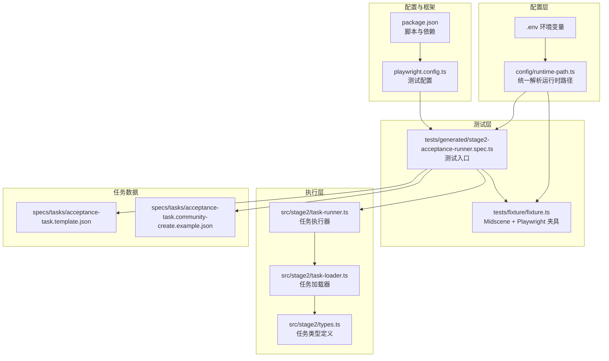
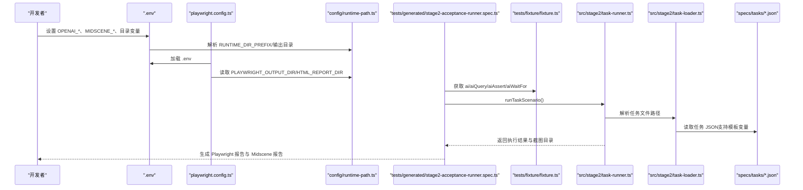
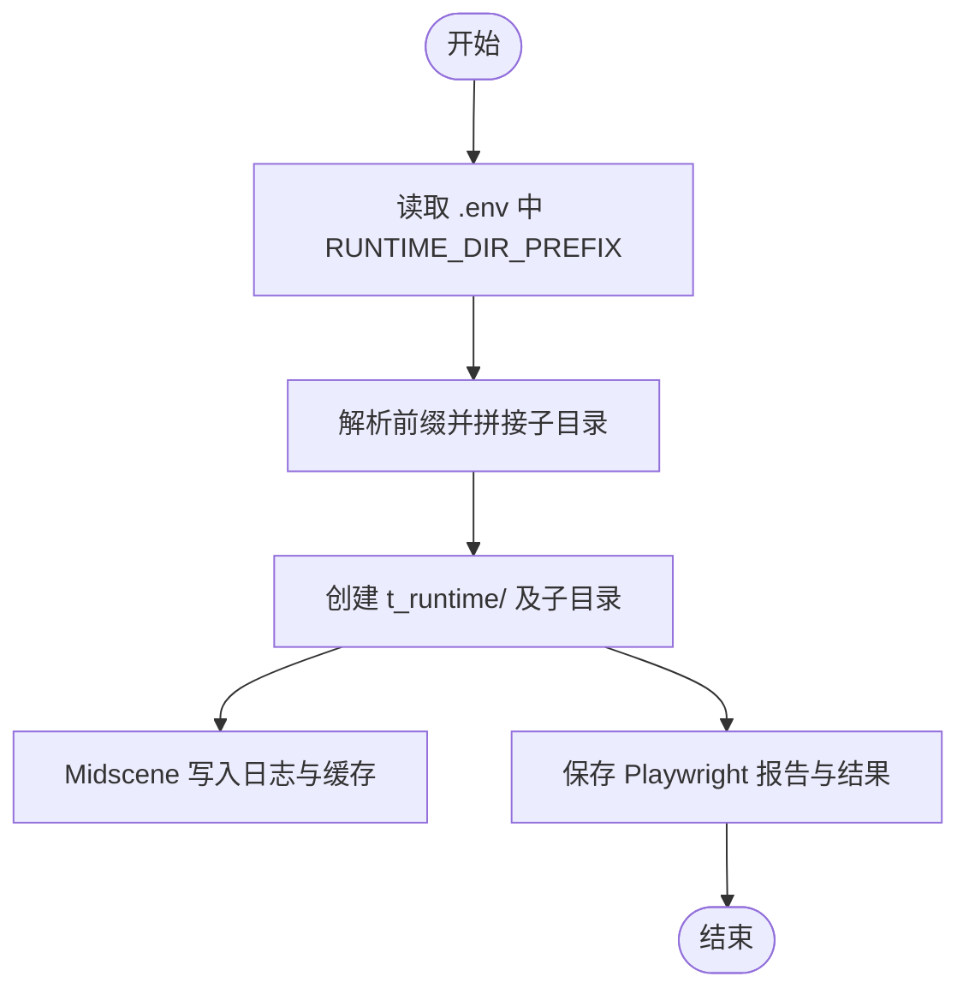
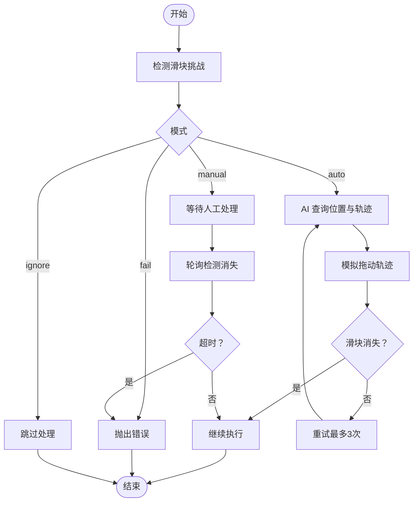
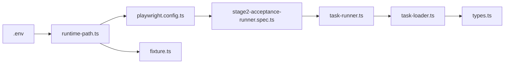

# 环境配置

<cite>
**本文引用的文件**
- [package.json](file://package.json)
- [playwright.config.ts](file://playwright.config.ts)
- [config/runtime-path.ts](file://config/runtime-path.ts)
- [README.md](file://README.md)
- [src/stage2/types.ts](file://src/stage2/types.ts)
- [src/stage2/task-loader.ts](file://src/stage2/task-loader.ts)
- [src/stage2/task-runner.ts](file://src/stage2/task-runner.ts)
- [specs/tasks/acceptance-task.community-create.example.json](file://specs/tasks/acceptance-task.community-create.example.json)
- [specs/tasks/acceptance-task.template.json](file://specs/tasks/acceptance-task.template.json)
- [tests/generated/stage2-acceptance-runner.spec.ts](file://tests/generated/stage2-acceptance-runner.spec.ts)
- [tests/fixture/fixture.ts](file://tests/fixture/fixture.ts)
</cite>

## 目录
1. [简介](#简介)
2. [项目结构](#项目结构)
3. [核心组件](#核心组件)
4. [架构总览](#架构总览)
5. [详细组件分析](#详细组件分析)
6. [依赖关系分析](#依赖关系分析)
7. [性能考虑](#性能考虑)
8. [故障排查指南](#故障排查指南)
9. [结论](#结论)
10. [附录](#附录)

## 简介
本文件面向生产环境部署与运维，提供 HI-TEST 项目的环境配置说明。内容涵盖：
- 生产环境服务器要求与硬件配置建议
- 操作系统兼容性、Node.js 版本要求与浏览器依赖
- 依赖安装流程（npm 依赖、Playwright 浏览器安装、Midscene.js 依赖配置）
- 完整 .env 环境变量配置说明（API 密钥、模型配置、运行时路径）
- 运行时目录结构与权限设置（t_runtime 目录创建与访问控制）
- Docker 容器化部署配置示例与 Kubernetes 部署清单思路
- 环境验证与健康检查方法，确保各组件正确配置与运行

## 项目结构
项目采用“测试框架 + AI 能力 + 运行时路径集中管理”的组织方式：
- 核心测试框架：Playwright
- AI 能力：Midscene.js（通过 @midscene/web 提供的 Playwright 集成）
- 运行时路径：通过 config/runtime-path.ts 统一解析并写入 .env 管理
- 任务驱动：tests/generated/stage2-acceptance-runner.spec.ts 作为入口，读取 specs/tasks 下的任务 JSON 并执行

图表来源
- [playwright.config.ts](file://playwright.config.ts#L1-L95)
- [config/runtime-path.ts](file://config/runtime-path.ts#L1-L41)
- [tests/generated/stage2-acceptance-runner.spec.ts](file://tests/generated/stage2-acceptance-runner.spec.ts#L1-L39)
- [tests/fixture/fixture.ts](file://tests/fixture/fixture.ts#L1-L100)
- [src/stage2/task-runner.ts](file://src/stage2/task-runner.ts#L1-L800)
- [src/stage2/task-loader.ts](file://src/stage2/task-loader.ts#L1-L91)
- [src/stage2/types.ts](file://src/stage2/types.ts#L1-L125)
- [specs/tasks/acceptance-task.template.json](file://specs/tasks/acceptance-task.template.json#L1-L85)
- [specs/tasks/acceptance-task.community-create.example.json](file://specs/tasks/acceptance-task.community-create.example.json#L1-L184)
- [package.json](file://package.json#L1-L24)

章节来源
- [README.md](file://README.md#L1-L144)
- [package.json](file://package.json#L1-L24)
- [playwright.config.ts](file://playwright.config.ts#L1-L95)
- [config/runtime-path.ts](file://config/runtime-path.ts#L1-L41)

## 核心组件
- 运行时路径管理：通过 config/runtime-path.ts 从 .env 读取并解析运行时目录前缀与子目录，统一输出给 Playwright 与 Midscene 使用。
- 测试配置：playwright.config.ts 加载 .env，并配置测试输出目录、报告器、并行策略等。
- 任务驱动：tests/generated/stage2-acceptance-runner.spec.ts 作为入口，调用 src/stage2/task-runner.ts 执行任务。
- 任务加载：src/stage2/task-loader.ts 从 .env 或命令行参数解析任务文件路径，支持模板变量替换（如 NOW_YYYYMMDDHHMMSS）。
- Midscene 夹具：tests/fixture/fixture.ts 初始化 Midscene 日志目录与 AI 能力（ai、aiQuery、aiAssert、aiWaitFor），并将日志写入 t_runtime/midscene_run。

章节来源
- [config/runtime-path.ts](file://config/runtime-path.ts#L1-L41)
- [playwright.config.ts](file://playwright.config.ts#L1-L95)
- [tests/generated/stage2-acceptance-runner.spec.ts](file://tests/generated/stage2-acceptance-runner.spec.ts#L1-L39)
- [src/stage2/task-loader.ts](file://src/stage2/task-loader.ts#L1-L91)
- [tests/fixture/fixture.ts](file://tests/fixture/fixture.ts#L1-L100)

## 架构总览
下图展示从 .env 到运行产物的端到端流程：

图表来源
- [playwright.config.ts](file://playwright.config.ts#L1-L95)
- [config/runtime-path.ts](file://config/runtime-path.ts#L1-L41)
- [tests/generated/stage2-acceptance-runner.spec.ts](file://tests/generated/stage2-acceptance-runner.spec.ts#L1-L39)
- [tests/fixture/fixture.ts](file://tests/fixture/fixture.ts#L1-L100)
- [src/stage2/task-runner.ts](file://src/stage2/task-runner.ts#L1-L800)
- [src/stage2/task-loader.ts](file://src/stage2/task-loader.ts#L1-L91)
- [specs/tasks/acceptance-task.community-create.example.json](file://specs/tasks/acceptance-task.community-create.example.json#L1-L184)

## 详细组件分析

### 运行时路径与目录结构
- 统一前缀：RUNTIME_DIR_PREFIX 控制 t_runtime/ 前缀（默认 t_runtime/）。
- 子目录：
  - PLAYWRIGHT_OUTPUT_DIR：Playwright 执行产物目录
  - PLAYWRIGHT_HTML_REPORT_DIR：Playwright HTML 报告目录
  - MIDSCENE_RUN_DIR：Midscene 运行日志、缓存、报告根目录
  - ACCEPTANCE_RESULT_DIR：第二段结构化结果目录（result.json、步骤截图）
- 目录创建：第二段执行器会在 acceptance-result 子目录下按 taskId 与时间戳创建运行目录，并递归创建 screenshots 子目录。

图表来源
- [config/runtime-path.ts](file://config/runtime-path.ts#L1-L41)
- [src/stage2/task-runner.ts](file://src/stage2/task-runner.ts#L108-L117)
- [tests/fixture/fixture.ts](file://tests/fixture/fixture.ts#L10-L10)

章节来源
- [README.md](file://README.md#L74-L92)
- [config/runtime-path.ts](file://config/runtime-path.ts#L1-L41)
- [src/stage2/task-runner.ts](file://src/stage2/task-runner.ts#L108-L117)
- [tests/fixture/fixture.ts](file://tests/fixture/fixture.ts#L10-L10)

### 依赖安装流程
- 安装 npm 依赖：执行 npm install。
- 安装 Playwright 浏览器：执行 npx playwright install。
- Midscene.js 依赖：通过 @midscene/web 提供的 Playwright 集成能力，无需额外浏览器安装（Midscene 在运行时使用 Playwright 的浏览器实例）。

章节来源
- [README.md](file://README.md#L18-L30)
- [package.json](file://package.json#L13-L22)
- [playwright.config.ts](file://playwright.config.ts#L1-L95)

### .env 环境变量配置说明
以下为关键 .env 变量及其用途（均来自仓库文档与配置文件）：
- OPENAI_API_KEY：用于模型访问的密钥（示例值见 README）。
- OPENAI_BASE_URL：模型服务基础 URL（示例值见 README）。
- MIDSCENE_MODEL_NAME：Midscene 使用的模型名称（示例值见 README）。
- RUNTIME_DIR_PREFIX：运行时根目录前缀（默认 t_runtime/）。
- PLAYWRIGHT_OUTPUT_DIR：Playwright 执行产物目录（默认 RUNTIME_DIR_PREFIX/test-results）。
- PLAYWRIGHT_HTML_REPORT_DIR：Playwright HTML 报告目录（默认 RUNTIME_DIR_PREFIX/playwright-report）。
- MIDSCENE_RUN_DIR：Midscene 运行日志、缓存、报告根目录（默认 RUNTIME_DIR_PREFIX/midscene_run）。
- ACCEPTANCE_RESULT_DIR：第二段结构化结果目录（默认 RUNTIME_DIR_PREFIX/acceptance-results）。
- STAGE2_TASK_FILE：第二段任务 JSON 文件路径（默认 specs/tasks/acceptance-task.community-create.example.json）。
- STAGE2_REQUIRE_APPROVAL：是否需要审批（布尔值）。
- STAGE2_CAPTCHA_MODE：滑块验证码处理模式（auto/manual/fail/ignore）。
- STAGE2_CAPTCHA_WAIT_TIMEOUT_MS：人工处理等待超时时间（毫秒）。

章节来源
- [README.md](file://README.md#L39-L52)
- [config/runtime-path.ts](file://config/runtime-path.ts#L13-L36)
- [src/stage2/task-loader.ts](file://src/stage2/task-loader.ts#L71-L77)
- [src/stage2/task-runner.ts](file://src/stage2/task-runner.ts#L58-L84)

### 任务模板与变量替换
- 模板变量：NOW_YYYYMMDDHHMMSS 会在加载任务时替换为当前时间戳，用于避免重复数据。
- 示例任务：acceptance-task.community-create.example.json 与 acceptance-task.template.json 提供了任务结构与字段说明。

章节来源
- [specs/tasks/acceptance-task.community-create.example.json](file://specs/tasks/acceptance-task.community-create.example.json#L1-L184)
- [specs/tasks/acceptance-task.template.json](file://specs/tasks/acceptance-task.template.json#L1-L85)
- [src/stage2/task-loader.ts](file://src/stage2/task-loader.ts#L8-L48)

### 滑块验证码自动处理机制
- 检测：通过文本与选择器模式检测页面是否存在滑块挑战。
- 自动模式：使用 Midscene AI 查询滑块位置与滑槽宽度，Playwright 模拟真人拖动轨迹（15 步、easeOut 缓动、随机抖动）。
- 人工兜底：在 STAGE2_CAPTCHA_MODE=manual 时，等待人工完成并在超时时间内轮询检测消失。
- 失败策略：fail 模式直接报错；ignore 模式跳过检测。

图表来源
- [src/stage2/task-runner.ts](file://src/stage2/task-runner.ts#L480-L703)

章节来源
- [README.md](file://README.md#L54-L72)
- [src/stage2/task-runner.ts](file://src/stage2/task-runner.ts#L58-L84)

## 依赖关系分析
- 配置依赖：playwright.config.ts 依赖 dotenv 加载 .env，并读取 config/runtime-path.ts 中的运行时路径。
- 运行时依赖：tests/fixture/fixture.ts 依赖 config/runtime-path.ts 设置 Midscene 日志目录。
- 任务依赖：tests/generated/stage2-acceptance-runner.spec.ts 依赖 src/stage2/task-runner.ts 与 src/stage2/task-loader.ts。
- 类型依赖：src/stage2/task-runner.ts 与 src/stage2/task-loader.ts 依赖 src/stage2/types.ts 的任务类型定义。

图表来源
- [playwright.config.ts](file://playwright.config.ts#L1-L95)
- [config/runtime-path.ts](file://config/runtime-path.ts#L1-L41)
- [tests/fixture/fixture.ts](file://tests/fixture/fixture.ts#L1-L100)
- [tests/generated/stage2-acceptance-runner.spec.ts](file://tests/generated/stage2-acceptance-runner.spec.ts#L1-L39)
- [src/stage2/task-runner.ts](file://src/stage2/task-runner.ts#L1-L800)
- [src/stage2/task-loader.ts](file://src/stage2/task-loader.ts#L1-L91)
- [src/stage2/types.ts](file://src/stage2/types.ts#L1-L125)

章节来源
- [playwright.config.ts](file://playwright.config.ts#L1-L95)
- [config/runtime-path.ts](file://config/runtime-path.ts#L1-L41)
- [tests/fixture/fixture.ts](file://tests/fixture/fixture.ts#L1-L100)
- [tests/generated/stage2-acceptance-runner.spec.ts](file://tests/generated/stage2-acceptance-runner.spec.ts#L1-L39)
- [src/stage2/task-runner.ts](file://src/stage2/task-runner.ts#L1-L800)
- [src/stage2/task-loader.ts](file://src/stage2/task-loader.ts#L1-L91)
- [src/stage2/types.ts](file://src/stage2/types.ts#L1-L125)

## 性能考虑
- 并行与重试：CI 环境启用重试与串行策略，非 CI 环境启用完全并行以提升吞吐。
- 超时与重试：滑块自动处理最大重试次数为 3 次，避免长时间阻塞。
- 截图与报告：按需开启截图与 trace，减少磁盘 IO 与存储占用。
- 目录隔离：所有运行产物收敛至 t_runtime/，便于清理与监控。

章节来源
- [playwright.config.ts](file://playwright.config.ts#L22-L95)
- [src/stage2/task-runner.ts](file://src/stage2/task-runner.ts#L664-L683)

## 故障排查指南
- 依赖缺失：确认已执行 npm install 与 npx playwright install。
- 模型配置：检查 OPENAI_API_KEY 与 OPENAI_BASE_URL 是否正确，模型名称是否与 Midscene 文档一致。
- 目录权限：确保运行用户对 RUNTIME_DIR_PREFIX 指定的目录具有读写权限，t_runtime/ 及其子目录应可递归创建。
- 滑块问题：若自动模式失败，可切换为 manual 模式并增大 STAGE2_CAPTCHA_WAIT_TIMEOUT_MS；必要时调整检测选择器。
- 报告定位：Playwright HTML 报告位于 PLAYWRIGHT_HTML_REPORT_DIR；Midscene 报告位于 MIDSCENE_RUN_DIR/report。

章节来源
- [README.md](file://README.md#L39-L52)
- [README.md](file://README.md#L106-L131)
- [src/stage2/task-runner.ts](file://src/stage2/task-runner.ts#L658-L702)

## 结论
通过 .env 集中管理运行时路径与模型配置，结合 Playwright 与 Midscene 的集成，HI-TEST 实现了可复用、可扩展的自动化测试执行框架。生产部署建议遵循本文档的服务器要求、依赖安装流程与目录权限设置，并通过环境验证与健康检查确保各组件稳定运行。

## 附录

### 生产环境服务器要求与硬件配置建议
- 操作系统：Linux（推荐 Ubuntu 20.04/22.04 或 CentOS 7/8）、Windows Server 2019+、macOS（用于本地开发与 CI 辅助）。
- CPU：至少 4 核，建议 8 核以上以支持并行测试。
- 内存：至少 8 GB，建议 16 GB+ 以容纳多个浏览器实例与 AI 推理。
- 存储：预留 t_runtime/ 目录空间（根据并发与报告规模估算），建议 SSD 以提升 I/O 性能。
- 网络：稳定的外网访问能力，以便下载 Playwright 浏览器与访问模型服务。

### Node.js 版本要求
- 基于 package.json 中的依赖版本范围，建议使用 Node.js LTS 版本（如 18.x 或 20.x）以获得最佳兼容性与稳定性。

章节来源
- [package.json](file://package.json#L13-L22)

### 浏览器依赖
- Playwright 浏览器：通过 npx playwright install 安装，支持 Chromium、Firefox、WebKit。
- Midscene.js：无需单独安装浏览器，使用 Playwright 的浏览器实例即可。

章节来源
- [README.md](file://README.md#L25-L29)
- [playwright.config.ts](file://playwright.config.ts#L50-L86)

### 运行时目录结构与权限设置
- 目录结构（默认收敛至 t_runtime/）：
  - test-results：Playwright 执行产物
  - playwright-report：Playwright HTML 报告
  - midscene_run/report、dump、tmp、cache：Midscene 运行日志与缓存
  - acceptance-results/<taskId>/<timestamp>/：第二段结构化结果与截图
- 权限设置：确保运行账户对 t_runtime/ 及子目录具备读写权限；在容器环境中，可通过挂载卷与用户映射保证权限一致性。

章节来源
- [README.md](file://README.md#L74-L92)
- [config/runtime-path.ts](file://config/runtime-path.ts#L13-L36)
- [src/stage2/task-runner.ts](file://src/stage2/task-runner.ts#L108-L117)

### Docker 容器化部署（配置示例思路）
- 基础镜像：node:alpine 或 node:slim
- 安装依赖：COPY package*.json ./ → RUN npm ci --only=production → COPY . .
- 安装浏览器：RUN npx playwright install
- 环境变量：COPY .env .env → ENV RUNTIME_DIR_PREFIX=/app/t_runtime
- 工作目录与权限：WORKDIR /app → RUN chmod -R 755 /app
- 启动命令：CMD ["npm", "run", "stage2:run:headed"]

章节来源
- [README.md](file://README.md#L18-L30)
- [package.json](file://package.json#L6-L9)

### Kubernetes 部署清单（思路）
- Deployment：设置资源限制（requests/limits）、环境变量（含 .env 注入）、持久卷挂载 t_runtime/。
- Service：如需对外暴露报告或服务接口，可配置 Service。
- Job/CronJob：按需调度执行，确保 Pod 具备网络与存储访问权限。

[本节为概念性说明，不直接对应具体源文件，故无图表来源与章节来源]