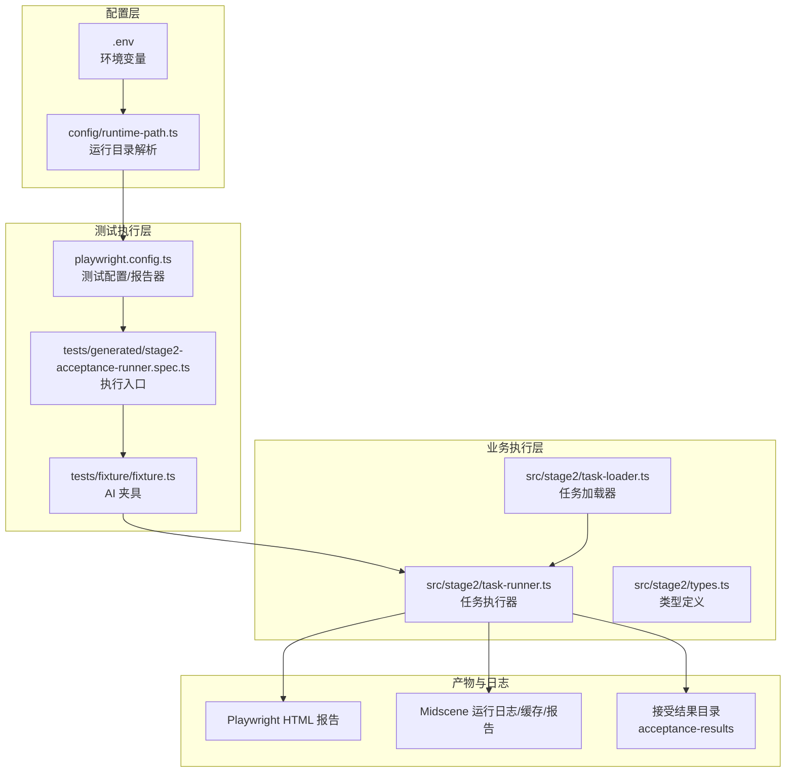
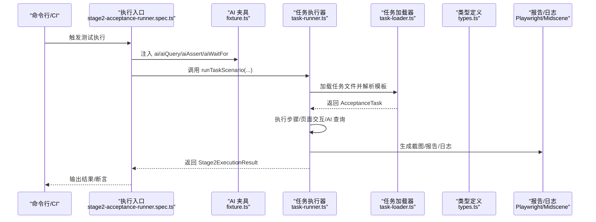
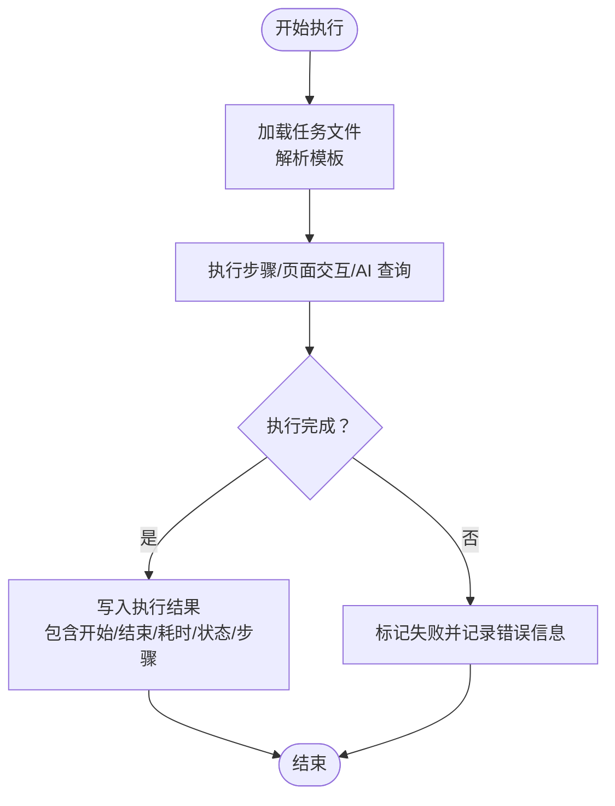

# 监控告警

<cite>
**本文引用的文件**
- [README.md](file://README.md)
- [package.json](file://package.json)
- [playwright.config.ts](file://playwright.config.ts)
- [config/runtime-path.ts](file://config/runtime-path.ts)
- [src/stage2/types.ts](file://src/stage2/types.ts)
- [src/stage2/task-runner.ts](file://src/stage2/task-runner.ts)
- [src/stage2/task-loader.ts](file://src/stage2/task-loader.ts)
- [tests/fixture/fixture.ts](file://tests/fixture/fixture.ts)
- [tests/generated/stage2-acceptance-runner.spec.ts](file://tests/generated/stage2-acceptance-runner.spec.ts)
- [specs/tasks/acceptance-task.community-create.example.json](file://specs/tasks/acceptance-task.community-create.example.json)
- [specs/basic-operations.md](file://specs/basic-operations.md)
- [specs/login-e2e.md](file://specs/login-e2e.md)
</cite>

## 目录
1. [简介](#简介)
2. [项目结构](#项目结构)
3. [核心组件](#核心组件)
4. [架构总览](#架构总览)
5. [组件详细分析](#组件详细分析)
6. [依赖关系分析](#依赖关系分析)
7. [性能考量](#性能考量)
8. [故障排查指南](#故障排查指南)
9. [结论](#结论)
10. [附录](#附录)

## 简介
本文件面向 HI-TEST 项目的监控告警体系，围绕任务执行状态监控（成功率、执行时间、错误率）、性能指标采集（浏览器响应时间、AI 处理延迟、内存使用）、日志聚合与分析、告警规则与通知渠道、系统健康检查以及监控仪表板配置进行系统化说明。文档同时给出可落地的实现建议与可视化图示，帮助运维团队快速定位问题并保障系统稳定性。

## 项目结构
HI-TEST 采用 Playwright + Midscene 的端到端自动化方案，核心运行产物与日志目录通过环境变量集中管理，便于统一采集与监控。

图表来源
- [playwright.config.ts](file://playwright.config.ts#L22-L94)
- [config/runtime-path.ts](file://config/runtime-path.ts#L13-L40)
- [tests/generated/stage2-acceptance-runner.spec.ts](file://tests/generated/stage2-acceptance-runner.spec.ts#L9-L38)
- [tests/fixture/fixture.ts](file://tests/fixture/fixture.ts#L10-L100)
- [src/stage2/task-runner.ts](file://src/stage2/task-runner.ts#L1-L120)
- [src/stage2/task-loader.ts](file://src/stage2/task-loader.ts#L71-L91)

章节来源
- [README.md](file://README.md#L74-L116)
- [config/runtime-path.ts](file://config/runtime-path.ts#L13-L40)
- [playwright.config.ts](file://playwright.config.ts#L22-L94)

## 核心组件
- 运行产物与日志目录：通过环境变量集中管理，便于统一采集与监控。
- 测试配置与报告器：定义测试超时、并行度、报告器（HTML、Midscene）等。
- AI 夹具与 Agent：封装 ai/aiQuery/aiAssert/aiWaitFor 等能力，支持报告生成与缓存。
- 任务执行器：负责任务加载、页面交互、AI 处理、滑块验证码处理、截图与结果落盘。
- 类型定义：标准化任务、步骤、执行结果的数据结构，支撑监控指标与告警规则。

章节来源
- [README.md](file://README.md#L74-L116)
- [playwright.config.ts](file://playwright.config.ts#L22-L94)
- [tests/fixture/fixture.ts](file://tests/fixture/fixture.ts#L23-L99)
- [src/stage2/task-runner.ts](file://src/stage2/task-runner.ts#L1-L120)
- [src/stage2/types.ts](file://src/stage2/types.ts#L86-L123)

## 架构总览
下图展示了从任务加载到执行、日志与报告产出的关键路径，以及可扩展的监控采集点。

图表来源
- [tests/generated/stage2-acceptance-runner.spec.ts](file://tests/generated/stage2-acceptance-runner.spec.ts#L12-L37)
- [tests/fixture/fixture.ts](file://tests/fixture/fixture.ts#L23-L99)
- [src/stage2/task-runner.ts](file://src/stage2/task-runner.ts#L1-L120)
- [src/stage2/task-loader.ts](file://src/stage2/task-loader.ts#L79-L91)
- [src/stage2/types.ts](file://src/stage2/types.ts#L86-L123)

## 组件详细分析

### 任务执行状态监控
- 指标定义
  - 任务成功率：成功任务数 / 总任务数
  - 任务平均/分位执行时间：从开始到结束的总耗时
  - 任务错误率：失败任务数 / 总任务数
  - 步骤级成功率与失败原因统计（来自步骤结果）
- 数据来源
  - 执行结果对象包含任务开始/结束时间、总耗时、状态与步骤明细
  - 失败时可结合截图路径与错误栈定位问题
- 建议采集点
  - 在执行入口处汇总每个任务的执行结果，写入统一指标存储
  - 对失败步骤提取 message/errorStack 作为告警标签

图表来源
- [src/stage2/task-runner.ts](file://src/stage2/task-runner.ts#L1-L120)
- [src/stage2/types.ts](file://src/stage2/types.ts#L111-L123)
- [tests/generated/stage2-acceptance-runner.spec.ts](file://tests/generated/stage2-acceptance-runner.spec.ts#L27-L36)

章节来源
- [src/stage2/types.ts](file://src/stage2/types.ts#L100-L123)
- [tests/generated/stage2-acceptance-runner.spec.ts](file://tests/generated/stage2-acceptance-runner.spec.ts#L27-L36)

### 性能指标采集与分析
- 浏览器响应时间
  - 可通过 Playwright 的内置计时与页面导航事件统计关键路径耗时
  - 建议在页面导航、关键按钮点击前后埋点，计算首屏/交互响应时间
- AI 处理延迟
  - 在 AI 查询/断言调用前后打点，统计 aiQuery/aiAssert 的耗时分布
  - 结合 Midscene 的报告与日志，定位模型调用与渲染耗时
- 内存使用情况
  - 通过系统级监控工具采集 Node/浏览器进程内存指标
  - 建议在 CI 中定期采样，绘制趋势图并设置阈值告警

章节来源
- [specs/login-e2e.md](file://specs/login-e2e.md#L119-L124)
- [tests/fixture/fixture.ts](file://tests/fixture/fixture.ts#L23-L99)

### 日志聚合与分析配置
- 运行时日志
  - Midscene 运行日志目录由环境变量控制，建议统一挂载到统一存储并开启轮转
- AI 处理日志
  - AI 夹具启用报告生成，建议将报告与日志集中采集，便于关联分析
- 浏览器日志
  - Playwright HTML 报告与 trace 文件可用于回放与分析
- 收集策略
  - 建议在 CI 中将 t_runtime 目录整体归档，包含 report、midscene_run、acceptance-results

章节来源
- [README.md](file://README.md#L74-L116)
- [config/runtime-path.ts](file://config/runtime-path.ts#L28-L36)
- [tests/fixture/fixture.ts](file://tests/fixture/fixture.ts#L10-L10)

### 告警规则设置
- 阈值配置
  - 任务成功率低于阈值（如 95%）
  - 任务平均耗时超过阈值（如 300s）
  - 步骤失败率超过阈值（如 5%）
  - 滑块验证码自动处理失败次数超过阈值
- 告警级别
  - 低：偶发失败、轻微超时
  - 中：连续失败、严重超时
  - 高：系统性失败、关键路径阻塞
- 通知渠道
  - 邮件、IM、电话（分级触发）
  - 建议在 CI 中集成告警插件，结合任务 ID、失败步骤、截图路径进行通知

章节来源
- [src/stage2/task-runner.ts](file://src/stage2/task-runner.ts#L647-L703)
- [src/stage2/types.ts](file://src/stage2/types.ts#L100-L123)

### 系统健康检查
- 关键组件可用性
  - Playwright 浏览器安装与可用性
  - Midscene 模型服务连通性
  - 任务文件与模板解析可用性
- 健康检查建议
  - 启动阶段执行轻量级任务（如登录页断言）
  - 对外依赖（如模型服务）增加探测接口
  - 在 CI 中增加“健康检查”步骤，失败即阻断后续执行

章节来源
- [README.md](file://README.md#L25-L29)
- [specs/login-e2e.md](file://specs/login-e2e.md#L112-L116)

### 监控仪表板配置示例
- 指标面板
  - 任务成功率趋势、失败率、平均耗时、P95/P99 耗时
  - 步骤失败分布、失败原因 Top-N
  - 滑块验证码处理成功率与失败次数
- 日志面板
  - 失败任务的截图链接、错误栈、AI 查询日志
  - 浏览器 trace 回放入口
- 关键指标解读
  - 成功率下降：检查页面结构变化、网络波动、模型服务异常
  - 耗时上升：关注页面渲染、AI 模型响应、浏览器性能
  - 失败率升高：聚焦最近变更的任务步骤或页面元素

章节来源
- [src/stage2/types.ts](file://src/stage2/types.ts#L100-L123)
- [README.md](file://README.md#L114-L116)

## 依赖关系分析
- 配置与路径
  - 环境变量驱动运行目录解析，确保报告与日志路径一致
- 执行链路
  - 执行入口 -> 夹具注入 AI 能力 -> 任务加载 -> 执行器 -> 产物与日志
- 外部依赖
  - Playwright、Midscene、Node 运行时

图表来源
- [config/runtime-path.ts](file://config/runtime-path.ts#L13-L40)
- [playwright.config.ts](file://playwright.config.ts#L22-L94)
- [tests/generated/stage2-acceptance-runner.spec.ts](file://tests/generated/stage2-acceptance-runner.spec.ts#L9-L38)
- [tests/fixture/fixture.ts](file://tests/fixture/fixture.ts#L23-L99)
- [src/stage2/task-runner.ts](file://src/stage2/task-runner.ts#L1-L120)

章节来源
- [config/runtime-path.ts](file://config/runtime-path.ts#L13-L40)
- [playwright.config.ts](file://playwright.config.ts#L22-L94)

## 性能考量
- 浏览器与 AI 的并发与资源占用
  - 控制并行度，避免资源争抢
  - 对关键路径增加超时与重试策略
- 日志与报告体积
  - 合理裁剪 trace 与截图，避免磁盘与带宽压力
- 模型服务稳定性
  - 增加重试与熔断，避免单点故障影响整体

## 故障排查指南
- 常见问题定位
  - 页面元素选择器失效：核对登录页选择器与文案
  - 滑块验证码处理失败：检查检测逻辑与拖动轨迹
  - 任务模板解析错误：检查模板变量与任务字段完整性
- 排查步骤
  - 查看 Playwright HTML 报告与 Midscene 日志
  - 定位失败步骤，提取截图与错误栈
  - 在 CI 中复现并缩小范围

章节来源
- [specs/login-e2e.md](file://specs/login-e2e.md#L112-L116)
- [src/stage2/task-runner.ts](file://src/stage2/task-runner.ts#L480-L703)
- [src/stage2/task-loader.ts](file://src/stage2/task-loader.ts#L50-L91)

## 结论
通过统一的运行目录与日志管理、完善的测试配置与报告器、以及可扩展的监控采集点，HI-TEST 项目具备了构建全面监控告警体系的基础。建议在现有基础上补充指标采集、告警规则与通知通道，并在 CI 中固化健康检查与故障演练，以持续提升系统的可观测性与稳定性。

## 附录
- 示例任务文件
  - 任务模板与字段定义可参考示例任务文件，便于统一规范与监控口径
- 基础操作与登录测试计划
  - 可作为性能回归与稳定性验证的基准用例

章节来源
- [specs/tasks/acceptance-task.community-create.example.json](file://specs/tasks/acceptance-task.community-create.example.json#L1-L184)
- [specs/basic-operations.md](file://specs/basic-operations.md#L1-L34)
- [specs/login-e2e.md](file://specs/login-e2e.md#L1-L152)