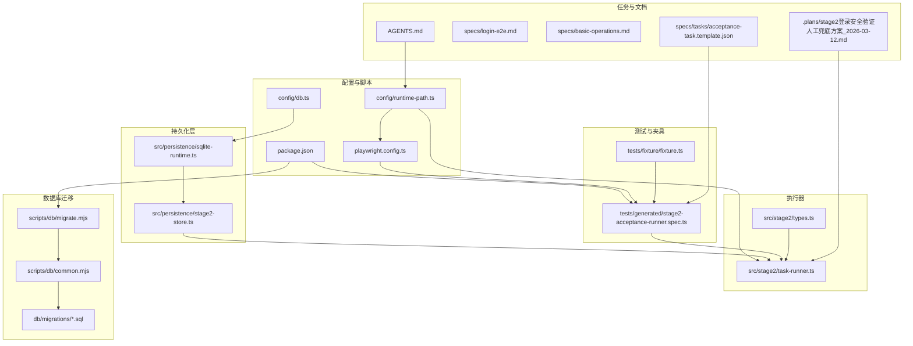
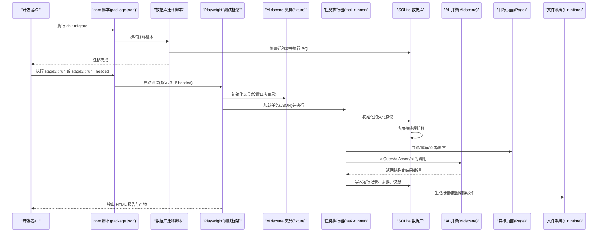
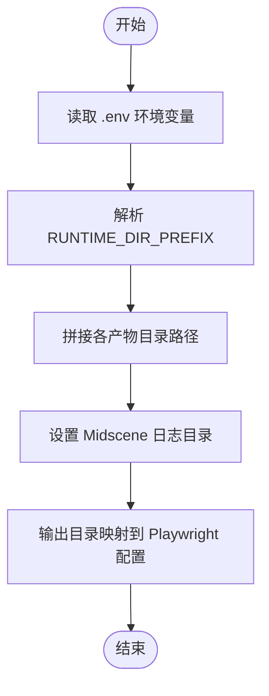
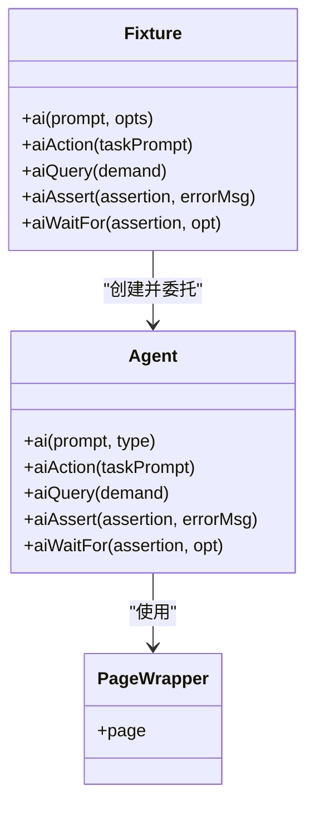
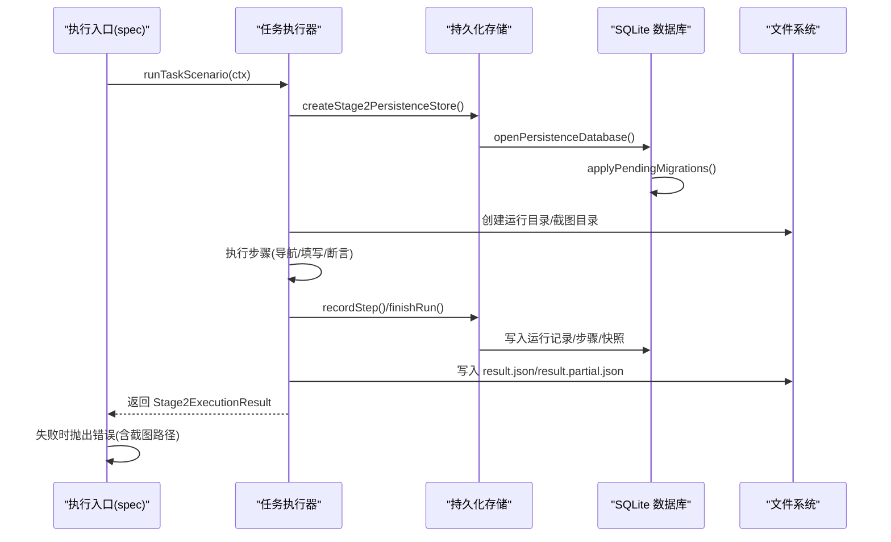
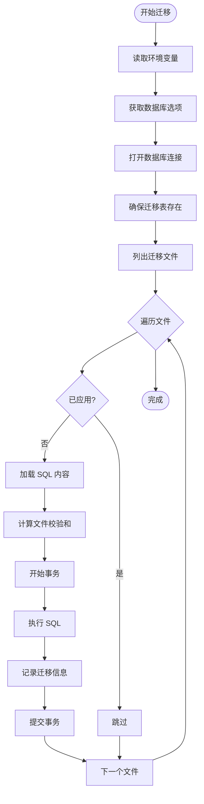
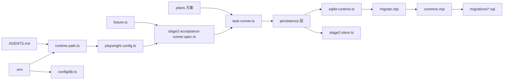

# 部署运维

<cite>
**本文引用的文件**
- [README.md](file://README.md)
- [package.json](file://package.json)
- [playwright.config.ts](file://playwright.config.ts)
- [config/runtime-path.ts](file://config/runtime-path.ts)
- [config/db.ts](file://config/db.ts)
- [src/stage2/task-runner.ts](file://src/stage2/task-runner.ts)
- [src/stage2/types.ts](file://src/stage2/types.ts)
- [src/persistence/sqlite-runtime.ts](file://src/persistence/sqlite-runtime.ts)
- [src/persistence/stage2-store.ts](file://src/persistence/stage2-store.ts)
- [scripts/db/common.mjs](file://scripts/db/common.mjs)
- [scripts/db/migrate.mjs](file://scripts/db/migrate.mjs)
- [db/migrations/001_global_persistence_init.sql](file://db/migrations/001_global_persistence_init.sql)
- [tests/generated/stage2-acceptance-runner.spec.ts](file://tests/generated/stage2-acceptance-runner.spec.ts)
- [tests/fixture/fixture.ts](file://tests/fixture/fixture.ts)
- [specs/tasks/acceptance-task.template.json](file://specs/tasks/acceptance-task.template.json)
- [specs/basic-operations.md](file://specs/basic-operations.md)
- [specs/login-e2e.md](file://specs/login-e2e.md)
- [.plans/stage2登录安全验证人工兜底方案_2026-03-12.md](file://.plans/stage2登录安全验证人工兜底方案_2026-03-12.md)
- [AGENTS.md](file://AGENTS.md)
</cite>

## 更新摘要
**所做更改**
- 新增数据库初始化与迁移管理章节，包含 SQLite 数据库配置、迁移脚本和执行流程
- 更新生产环境部署清单，增加数据库相关配置项
- 新增数据库监控与维护章节，涵盖性能优化和故障排查
- 更新 CI/CD 集成方案，增加数据库迁移步骤
- 新增备份与灾难恢复章节，包含数据库备份策略

## 目录
1. [简介](#简介)
2. [项目结构](#项目结构)
3. [核心组件](#核心组件)
4. [架构总览](#架构总览)
5. [详细组件分析](#详细组件分析)
6. [数据库初始化与迁移管理](#数据库初始化与迁移管理)
7. [依赖关系分析](#依赖关系分析)
8. [性能考虑](#性能考虑)
9. [故障排查指南](#故障排查指南)
10. [结论](#结论)
11. [附录](#附录)

## 简介
本文件面向生产环境的部署与运维，围绕 HI-TEST 项目提供从服务器配置、依赖安装、环境准备到 CI/CD 集成、监控告警、日志管理、性能优化、备份与灾难恢复以及版本与升级策略的系统化指导。项目基于 Playwright 与 Midscene.js 构建，采用 JSON 驱动的任务执行器，支持滑块验证码的自动处理与人工兜底，具备完善的运行产物目录与报告体系。**新增**数据库初始化、迁移管理和生产环境部署相关内容。

## 项目结构
项目采用"配置驱动 + 任务驱动 + 数据持久化"的组织方式，核心目录与文件职责如下：
- config/runtime-path.ts：集中读取 .env 并导出运行产物目录路径，统一 t_runtime/ 下的输出收敛。
- config/db.ts：数据库配置管理，支持 SQLite 驱动和文件路径配置。
- playwright.config.ts：Playwright 测试框架配置，含输出目录、报告器、并行度、重试策略、超时等。
- package.json：脚本与依赖声明，包含 stage2 执行脚本和数据库迁移脚本。
- src/stage2/*：第二段执行器，负责任务解析、页面交互、AI 辅助定位与断言、滑块验证码处理、结果落盘。
- src/persistence/*：数据库持久化层，包含 SQLite 连接、迁移管理和数据存储。
- scripts/db/*：数据库迁移脚本，支持迁移文件扫描、执行和回滚。
- db/migrations/*：SQL 迁移文件，包含完整的表结构定义和索引。
- tests/*：测试夹具与生成的执行入口，连接 Midscene 与 Playwright。
- specs/tasks/*：任务 JSON 模板与测试计划文档。
- .plans/* 与 AGENTS.md：规范与方案文档，约束命名、配置、日志与目录规范。

**图表来源**
- [package.json](file://package.json#L6-L11)
- [playwright.config.ts](file://playwright.config.ts#L22-L40)
- [config/runtime-path.ts](file://config/runtime-path.ts#L13-L36)
- [config/db.ts](file://config/db.ts#L1-L28)
- [src/stage2/task-runner.ts](file://src/stage2/task-runner.ts#L1-L40)
- [src/stage2/types.ts](file://src/stage2/types.ts#L1-L40)
- [src/persistence/sqlite-runtime.ts](file://src/persistence/sqlite-runtime.ts#L1-L116)
- [src/persistence/stage2-store.ts](file://src/persistence/stage2-store.ts#L1-L655)
- [scripts/db/common.mjs](file://scripts/db/common.mjs#L1-L108)
- [scripts/db/migrate.mjs](file://scripts/db/migrate.mjs#L1-L52)
- [db/migrations/001_global_persistence_init.sql](file://db/migrations/001_global_persistence_init.sql#L1-L128)

**章节来源**
- [README.md](file://README.md#L1-L144)
- [package.json](file://package.json#L1-L26)
- [playwright.config.ts](file://playwright.config.ts#L1-L95)
- [config/runtime-path.ts](file://config/runtime-path.ts#L1-L41)
- [config/db.ts](file://config/db.ts#L1-L28)
- [src/stage2/task-runner.ts](file://src/stage2/task-runner.ts#L1-L120)
- [src/stage2/types.ts](file://src/stage2/types.ts#L1-L125)
- [src/persistence/sqlite-runtime.ts](file://src/persistence/sqlite-runtime.ts#L1-L116)
- [src/persistence/stage2-store.ts](file://src/persistence/stage2-store.ts#L1-L655)
- [scripts/db/common.mjs](file://scripts/db/common.mjs#L1-L108)
- [scripts/db/migrate.mjs](file://scripts/db/migrate.mjs#L1-L52)
- [db/migrations/001_global_persistence_init.sql](file://db/migrations/001_global_persistence_init.sql#L1-L128)
- [tests/generated/stage2-acceptance-runner.spec.ts](file://tests/generated/stage2-acceptance-runner.spec.ts#L1-L39)
- [tests/fixture/fixture.ts](file://tests/fixture/fixture.ts#L1-L100)
- [specs/tasks/acceptance-task.template.json](file://specs/tasks/acceptance-task.template.json#L1-L85)
- [specs/basic-operations.md](file://specs/basic-operations.md#L1-L34)
- [specs/login-e2e.md](file://specs/login-e2e.md#L1-L152)
- [.plans/stage2登录安全验证人工兜底方案_2026-03-12.md](file://.plans/stage2登录安全验证人工兜底方案_2026-03-12.md#L1-L57)
- [AGENTS.md](file://AGENTS.md#L1-L61)

## 核心组件
- 运行产物目录统一管理：通过 RUNTIME_DIR_PREFIX 与多个目录变量集中控制，确保产物收敛至 t_runtime/ 下，便于运维收集与清理。
- Playwright 执行配置：含超时、并行、重试、报告器（list/html/@midscene/web）与 trace 收集策略。
- 任务驱动执行器：从 JSON 任务加载、执行、断言、截图与结果落盘，支持滑块验证码自动处理与人工兜底。
- **数据库持久化层**：SQLite 数据库存储任务执行历史、运行状态、快照和工件，支持迁移管理和事务处理。
- Midscene 夹具：封装 ai/aiQuery/aiAssert/aiWaitFor，统一日志与报告目录，保障 AI 执行可追踪。
- 任务模板与测试计划：提供标准任务结构与 E2E 测试场景，便于复用与扩展。

**章节来源**
- [README.md](file://README.md#L74-L131)
- [config/runtime-path.ts](file://config/runtime-path.ts#L13-L36)
- [playwright.config.ts](file://playwright.config.ts#L22-L48)
- [src/stage2/task-runner.ts](file://src/stage2/task-runner.ts#L1-L120)
- [src/persistence/stage2-store.ts](file://src/persistence/stage2-store.ts#L69-L123)
- [tests/fixture/fixture.ts](file://tests/fixture/fixture.ts#L1-L100)
- [specs/tasks/acceptance-task.template.json](file://specs/tasks/acceptance-task.template.json#L1-L85)
- [specs/login-e2e.md](file://specs/login-e2e.md#L20-L46)

## 架构总览
下图展示了从任务 JSON 到执行、数据库持久化、报告与产物落盘的整体流程，以及关键组件之间的依赖关系。

**图表来源**
- [package.json](file://package.json#L7-L8)
- [scripts/db/migrate.mjs](file://scripts/db/migrate.mjs#L15-L51)
- [src/persistence/sqlite-runtime.ts](file://src/persistence/sqlite-runtime.ts#L73-L84)
- [playwright.config.ts](file://playwright.config.ts#L22-L40)
- [tests/fixture/fixture.ts](file://tests/fixture/fixture.ts#L10-L10)
- [tests/generated/stage2-acceptance-runner.spec.ts](file://tests/generated/stage2-acceptance-runner.spec.ts#L12-L37)
- [src/stage2/task-runner.ts](file://src/stage2/task-runner.ts#L2341-L2348)
- [README.md](file://README.md#L117-L131)

## 详细组件分析

### 组件一：运行产物目录与环境准备
- 目录收敛：通过 RUNTIME_DIR_PREFIX、PLAYWRIGHT_OUTPUT_DIR、PLAYWRIGHT_HTML_REPORT_DIR、MIDSCENE_RUN_DIR、ACCEPTANCE_RESULT_DIR 统一管理，避免硬编码。
- 环境变量：.env 中提供默认值与用途说明，支持 CI 与本地差异化配置。
- 路径解析：resolveRuntimePath 统一解析绝对路径，避免跨平台差异。
- 产物位置：Playwright 报告、Midscene 日志与缓存、第二段结果与截图均落盘至 t_runtime/ 下，便于打包与归档。

**图表来源**
- [config/runtime-path.ts](file://config/runtime-path.ts#L8-L40)
- [playwright.config.ts](file://playwright.config.ts#L22-L26)
- [tests/fixture/fixture.ts](file://tests/fixture/fixture.ts#L10-L10)

**章节来源**
- [README.md](file://README.md#L39-L52)
- [README.md](file://README.md#L74-L91)
- [config/runtime-path.ts](file://config/runtime-path.ts#L1-L41)
- [playwright.config.ts](file://playwright.config.ts#L1-L95)
- [tests/fixture/fixture.ts](file://tests/fixture/fixture.ts#L1-L100)

### 组件二：滑块验证码处理（自动/人工/失败/忽略）
- 模式解析：支持 manual/auto/fail/ignore 四种模式，默认 manual。
- 自动处理：AI 查询滑块位置与滑槽宽度，Playwright 模拟拖动轨迹（easeOut 缓动 + 随机抖动），最多重试 3 次。
- 人工兜底：在 STAGE2_CAPTCHA_WAIT_TIMEOUT_MS 内轮询检测，超时则失败。
- 失败策略：fail 模式直接抛错；ignore 模式跳过检测。
- 登录后二次检查：避免登录后延迟弹窗导致误执行。

**图表来源**
- [src/stage2/task-runner.ts](file://src/stage2/task-runner.ts#L58-L72)
- [src/stage2/task-runner.ts](file://src/stage2/task-runner.ts#L558-L645)
- [src/stage2/task-runner.ts](file://src/stage2/task-runner.ts#L647-L703)
- [.plans/stage2登录安全验证人工兜底方案_2026-03-12.md](file://.plans/stage2登录安全验证人工兜底方案_2026-03-12.md#L16-L48)

**章节来源**
- [README.md](file://README.md#L54-L72)
- [src/stage2/task-runner.ts](file://src/stage2/task-runner.ts#L32-L84)
- [src/stage2/task-runner.ts](file://src/stage2/task-runner.ts#L558-L703)
- [.plans/stage2登录安全验证人工兜底方案_2026-03-12.md](file://.plans/stage2登录安全验证人工兜底方案_2026-03-12.md#L1-L57)

### 组件三：Midscene 夹具与 AI 执行
- 日志目录：初始化时设置 Midscene 日志目录，保证报告与缓存落地。
- AI 能力：ai/aiAction/aiQuery/aiAssert/aiWaitFor 统一封装，支持分组、缓存 ID、报告生成与自动打印。
- 与 Playwright 集成：通过 Page 对象包装，结合任务执行器完成页面交互与断言。

**图表来源**
- [tests/fixture/fixture.ts](file://tests/fixture/fixture.ts#L23-L99)
- [tests/fixture/fixture.ts](file://tests/fixture/fixture.ts#L10-L10)

**章节来源**
- [tests/fixture/fixture.ts](file://tests/fixture/fixture.ts#L1-L100)

### 组件四：任务执行入口与结果落盘
- 入口文件：tests/generated/stage2-acceptance-runner.spec.ts 作为 JSON 任务的执行入口，设置测试超时并收集失败步骤详情。
- 结果结构：Stage2ExecutionResult 包含任务元信息、运行目录、步骤明细、截图路径与错误栈，便于回溯与审计。
- 截图与报告：每步可选截图，最终生成 HTML 报告与 Midscene 报告。
- **数据库持久化**：通过 Stage2PersistenceStore 实例化数据库连接，应用迁移并写入执行记录。

**图表来源**
- [tests/generated/stage2-acceptance-runner.spec.ts](file://tests/generated/stage2-acceptance-runner.spec.ts#L12-L37)
- [src/stage2/task-runner.ts](file://src/stage2/task-runner.ts#L2341-L2348)
- [src/stage2/types.ts](file://src/stage2/types.ts#L111-L123)
- [src/persistence/stage2-store.ts](file://src/persistence/stage2-store.ts#L101-L123)

**章节来源**
- [tests/generated/stage2-acceptance-runner.spec.ts](file://tests/generated/stage2-acceptance-runner.spec.ts#L1-L39)
- [src/stage2/task-runner.ts](file://src/stage2/task-runner.ts#L2341-L2348)
- [src/stage2/types.ts](file://src/stage2/types.ts#L111-L123)
- [src/persistence/stage2-store.ts](file://src/persistence/stage2-store.ts#L69-L123)

### 组件五：Playwright 配置与报告
- 输出目录：统一由 runtime-path.ts 提供，避免硬编码。
- 报告器：list、html、@midscene/web 三路输出，便于本地与 CI 查看。
- 并行与重试：CI 环境启用重试与串行，本地开发可并行提升效率。
- Trace：首次重试时开启，便于问题复现。

**章节来源**
- [playwright.config.ts](file://playwright.config.ts#L22-L48)
- [config/runtime-path.ts](file://config/runtime-path.ts#L18-L36)

### 组件六：任务模板与测试计划
- 任务模板：acceptance-task.template.json 提供标准字段与注释，支持多组件类型、断言与清理策略。
- 登录测试计划：login-e2e.md 提供成功/失败场景与运行说明，便于复用与扩展。
- 基础操作测试：basic-operations.md 提供通用测试场景说明。

**章节来源**
- [specs/tasks/acceptance-task.template.json](file://specs/tasks/acceptance-task.template.json#L1-L85)
- [specs/login-e2e.md](file://specs/login-e2e.md#L1-L152)
- [specs/basic-operations.md](file://specs/basic-operations.md#L1-L34)

## 数据库初始化与迁移管理

### 数据库配置
项目使用 SQLite 作为默认数据库驱动，配置文件位于 config/db.ts：

- **驱动类型**：默认 sqlite，可通过 DB_DRIVER 环境变量覆盖
- **文件路径**：默认位于运行时目录下的 db/hi_test.sqlite
- **路径解析**：通过 resolveDbPath 统一解析绝对路径，支持相对路径转换
- **环境变量**：DB_DRIVER 和 DB_FILE_PATH 可通过 .env 文件配置

**章节来源**
- [config/db.ts](file://config/db.ts#L1-L28)

### 迁移脚本架构
数据库迁移采用 Node.js 脚本实现，位于 scripts/db/ 目录：

- **公共模块**：common.mjs 提供通用功能，包括环境变量读取、路径解析、数据库连接、迁移管理等
- **迁移执行器**：migrate.mjs 负责扫描、执行和记录迁移文件
- **迁移文件**：db/migrations/ 目录包含 SQL 迁移文件，当前版本包含全局持久化初始化

**图表来源**
- [scripts/db/migrate.mjs](file://scripts/db/migrate.mjs#L15-L51)
- [scripts/db/common.mjs](file://scripts/db/common.mjs#L60-L106)

**章节来源**
- [scripts/db/common.mjs](file://scripts/db/common.mjs#L1-L108)
- [scripts/db/migrate.mjs](file://scripts/db/migrate.mjs#L1-L52)

### 迁移文件管理
迁移文件位于 db/migrations/ 目录，采用数字前缀命名：

- **文件格式**：001_*.sql，确保执行顺序
- **表结构**：包含 ai_task、ai_task_version、ai_run、ai_run_step、ai_snapshot、ai_artifact、ai_audit_log 等核心表
- **索引优化**：为常用查询字段建立索引，提升查询性能
- **外键约束**：启用外键约束，确保数据一致性

**章节来源**
- [db/migrations/001_global_persistence_init.sql](file://db/migrations/001_global_persistence_init.sql#L1-L128)

### 数据持久化层
持久化层位于 src/persistence/ 目录，提供完整的数据访问抽象：

- **数据库连接**：openPersistenceDatabase 函数管理 SQLite 连接，启用外键约束
- **迁移应用**：applyPendingMigrations 自动检测并应用未执行的迁移
- **实体存储**：Stage2PersistenceStore 类封装任务、运行、步骤、快照等实体的 CRUD 操作
- **事务处理**：每个迁移和数据操作都在事务中执行，确保原子性

**章节来源**
- [src/persistence/sqlite-runtime.ts](file://src/persistence/sqlite-runtime.ts#L73-L114)
- [src/persistence/stage2-store.ts](file://src/persistence/stage2-store.ts#L69-L123)

### 迁移执行流程
数据库迁移通过 npm 脚本执行：

- **脚本命令**：npm run db:migrate 或 npm run db:init
- **执行步骤**：扫描迁移文件 → 检查应用状态 → 执行 SQL → 记录迁移信息
- **错误处理**：单个迁移失败时回滚整个事务，确保数据库一致性
- **幂等性**：重复执行不会产生副作用，已应用的迁移会被跳过

**章节来源**
- [package.json](file://package.json#L7-L8)
- [scripts/db/migrate.mjs](file://scripts/db/migrate.mjs#L15-L51)

## 依赖关系分析
- 配置耦合：playwright.config.ts 依赖 runtime-path.ts 提供的目录变量；runtime-path.ts 依赖 .env；config/db.ts 依赖 runtime-path.ts。
- 执行耦合：tests/generated/stage2-acceptance-runner.spec.ts 依赖 tests/fixture/fixture.ts 与 src/stage2/task-runner.ts；task-runner.ts 依赖 persistence 层。
- 持久化耦合：stage2-store.ts 依赖 sqlite-runtime.ts 进行数据库连接和迁移管理。
- 迁移耦合：migrate.mjs 依赖 common.mjs 提供的通用功能；common.mjs 依赖 dotenv 和 node:sqlite。
- 文档与规范：AGENTS.md 与 .plans/* 为执行器与配置提供约束与回滚策略。

**图表来源**
- [config/runtime-path.ts](file://config/runtime-path.ts#L1-L41)
- [config/db.ts](file://config/db.ts#L1-L28)
- [playwright.config.ts](file://playwright.config.ts#L1-L95)
- [tests/generated/stage2-acceptance-runner.spec.ts](file://tests/generated/stage2-acceptance-runner.spec.ts#L1-L39)
- [tests/fixture/fixture.ts](file://tests/fixture/fixture.ts#L1-L100)
- [src/stage2/task-runner.ts](file://src/stage2/task-runner.ts#L1-L40)
- [src/persistence/sqlite-runtime.ts](file://src/persistence/sqlite-runtime.ts#L1-L116)
- [src/persistence/stage2-store.ts](file://src/persistence/stage2-store.ts#L1-L655)
- [scripts/db/common.mjs](file://scripts/db/common.mjs#L1-L108)
- [scripts/db/migrate.mjs](file://scripts/db/migrate.mjs#L1-L52)
- [.plans/stage2登录安全验证人工兜底方案_2026-03-12.md](file://.plans/stage2登录安全验证人工兜底方案_2026-03-12.md#L1-L30)
- [AGENTS.md](file://AGENTS.md#L22-L46)

**章节来源**
- [config/runtime-path.ts](file://config/runtime-path.ts#L1-L41)
- [config/db.ts](file://config/db.ts#L1-L28)
- [playwright.config.ts](file://playwright.config.ts#L1-L95)
- [tests/generated/stage2-acceptance-runner.spec.ts](file://tests/generated/stage2-acceptance-runner.spec.ts#L1-L39)
- [tests/fixture/fixture.ts](file://tests/fixture/fixture.ts#L1-L100)
- [src/stage2/task-runner.ts](file://src/stage2/task-runner.ts#L1-L40)
- [src/persistence/sqlite-runtime.ts](file://src/persistence/sqlite-runtime.ts#L1-L116)
- [src/persistence/stage2-store.ts](file://src/persistence/stage2-store.ts#L1-L655)
- [scripts/db/common.mjs](file://scripts/db/common.mjs#L1-L108)
- [scripts/db/migrate.mjs](file://scripts/db/migrate.mjs#L1-L52)
- [.plans/stage2登录安全验证人工兜底方案_2026-03-12.md](file://.plans/stage2登录安全验证人工兜底方案_2026-03-12.md#L1-L57)
- [AGENTS.md](file://AGENTS.md#L1-L61)

## 性能考虑
- 并行与重试：本地开发可并行提升效率；CI 环境启用重试与串行，平衡稳定性与速度。
- 超时与重试：合理设置 step/page 超时与重试次数，避免长尾任务影响整体吞吐。
- 拖动轨迹：自动滑块处理采用 15 步 easeOut 与随机抖动，兼顾成功率与稳定性。
- 产物压缩：CI 中对 t_runtime/ 进行压缩归档，减少存储与传输开销。
- 资源隔离：容器化或虚拟机中限制 CPU/内存，避免页面渲染与 AI 推理互相抢占。
- **数据库性能**：SQLite 适用于中小规模数据；对于大量并发写入，考虑使用更强大的数据库系统。
- **索引优化**：迁移文件中已包含常用查询索引，可根据实际查询模式调整索引策略。

**章节来源**
- [playwright.config.ts](file://playwright.config.ts#L26-L34)
- [src/stage2/task-runner.ts](file://src/stage2/task-runner.ts#L590-L610)
- [README.md](file://README.md#L74-L91)
- [db/migrations/001_global_persistence_init.sql](file://db/migrations/001_global_persistence_init.sql#L120-L126)

## 故障排查指南
- 滑块验证码失败
  - 症状：自动处理多次失败或人工等待超时。
  - 排查：检查 STAGE2_CAPTCHA_MODE 与 STAGE2_CAPTCHA_WAIT_TIMEOUT_MS；核对页面截图与选择器；必要时切换为 manual 模式。
  - 参考：自动处理流程与回滚策略。
- 任务执行失败
  - 症状：result.json 中包含失败步骤与截图路径。
  - 排查：查看失败步骤 message 与 screenshotPath；结合 Midscene 报告定位 AI 查询/断言问题。
- 报告缺失
  - 症状：HTML 报告或 Midscene 报告未生成。
  - 排查：确认 PLAYWRIGHT_HTML_REPORT_DIR/MIDSCENE_RUN_DIR 是否正确；检查权限与磁盘空间。
- 环境变量问题
  - 症状：路径解析异常或产物目录不一致。
  - 排查：核对 .env 与 RUNTIME_DIR_PREFIX；确保 resolveRuntimePath 生效。
- **数据库连接失败**
  - 症状：迁移脚本报错或执行器无法连接数据库。
  - 排查：检查 DB_DRIVER 和 DB_FILE_PATH 环境变量；确认数据库文件路径可写；验证 SQLite 驱动可用性。
- **迁移执行失败**
  - 症状：特定迁移文件执行失败。
  - 排查：查看迁移文件语法；检查外键约束；确认数据库版本兼容性；必要时手动修复后重新执行。
- **数据不一致**
  - 症状：运行记录与实际执行状态不符。
  - 排查：检查事务提交状态；验证外键约束；重新应用迁移。

**章节来源**
- [.plans/stage2登录安全验证人工兜底方案_2026-03-12.md](file://.plans/stage2登录安全验证人工兜底方案_2026-03-12.md#L31-L48)
- [tests/generated/stage2-acceptance-runner.spec.ts](file://tests/generated/stage2-acceptance-runner.spec.ts#L27-L35)
- [README.md](file://README.md#L114-L116)
- [config/runtime-path.ts](file://config/runtime-path.ts#L38-L40)
- [config/db.ts](file://config/db.ts#L20-L26)
- [scripts/db/migrate.mjs](file://scripts/db/migrate.mjs#L41-L44)

## 结论
本部署运维文档基于项目现有配置与实现，提供了从环境准备、执行流程、CI/CD 集成、监控告警、日志管理到性能优化与灾难恢复的完整方案。**新增**的数据库初始化、迁移管理和持久化层为项目提供了可靠的数据存储能力。通过统一的运行产物目录、标准化的环境变量、严格的规范约束和完善的数据库管理机制，项目在高负载与复杂页面交互场景下具备良好的可维护性与稳定性。

## 附录

### A. 生产环境部署清单
- 服务器配置
  - 操作系统：Linux（推荐 Ubuntu 20.04+）
  - Node.js：使用 .nvmrc 指定版本（如需）
  - 浏览器：安装 Chromium（npx playwright install）
  - **数据库**：SQLite 文件权限可写，预留足够的磁盘空间
- 依赖安装
  - npm ci（锁定依赖）
  - 安装 Playwright 依赖
- 环境准备
  - 准备 .env 文件，设置 OPENAI_API_KEY、OPENAI_BASE_URL、MIDSCENE_MODEL_NAME、RUNTIME_DIR_PREFIX、各产物目录变量
  - **设置数据库配置**：DB_DRIVER=sqlite、DB_FILE_PATH=/path/to/hi_test.sqlite
  - 确认 t_runtime/ 和数据库文件路径可写且磁盘空间充足
- **数据库初始化**
  - 执行 npm run db:migrate 初始化数据库结构
  - 验证迁移表 schema_migrations 是否创建成功
- 运行与验证
  - 执行 npm run stage2:run 或 stage2:run:headed
  - 核对 t_runtime/ 下产物与 HTML 报告
  - **验证数据库连接**：检查 SQLite 文件是否存在，确认迁移已应用

**章节来源**
- [README.md](file://README.md#L18-L30)
- [README.md](file://README.md#L39-L52)
- [README.md](file://README.md#L106-L131)
- [config/db.ts](file://config/db.ts#L7-L26)
- [package.json](file://package.json#L7-L8)

### B. CI/CD 集成方案
- 触发策略
  - 主分支保护：禁止直接推送，强制 PR 合并
  - 自动化测试：PR 与主分支合并后触发
- 流水线步骤
  - 安装依赖与 Playwright
  - 设置 .env（敏感变量通过密钥管理）
  - **执行数据库迁移**：npm run db:migrate
  - 运行 npm run stage2:run（CI 环境串行+重试）
  - 上传 t_runtime/ 与报告制品
- 部署策略
  - 仅在主分支成功时发布制品或触发下游部署
  - 失败时发送通知并保留报告以便回溯
- **数据库迁移最佳实践**
  - 在部署前执行迁移，确保数据库结构一致
  - 使用幂等迁移，支持重复执行
  - 监控迁移执行状态，失败时回滚

**章节来源**
- [playwright.config.ts](file://playwright.config.ts#L30-L34)
- [README.md](file://README.md#L106-L116)
- [package.json](file://package.json#L7-L8)

### C. 监控与告警
- 执行状态
  - CI 状态：通过流水线状态与测试通过率监控
  - 报告健康：定期检查 t_runtime/ 产出完整性
- 性能指标
  - 关键步骤耗时：从 result.json 中提取步骤 durationMs
  - 页面加载时间：结合 Playwright trace 与浏览器性能面板
- 错误率
  - 失败率：统计 Stage2ExecutionResult.status 与失败步骤占比
  - 告警阈值：设定失败率与平均耗时阈值，超限邮件/IM 通知
- **数据库监控**
  - 迁移状态：监控迁移执行日志，确保所有迁移成功
  - 数据库健康：检查 SQLite 文件大小、连接数和查询性能
  - 存储空间：监控 t_runtime/ 和数据库文件的磁盘使用情况

**章节来源**
- [src/stage2/types.ts](file://src/stage2/types.ts#L111-L123)
- [playwright.config.ts](file://playwright.config.ts#L47-L47)
- [scripts/db/migrate.mjs](file://scripts/db/migrate.mjs#L22-L48)

### D. 日志与故障排查
- 运行时日志
  - Midscene 日志：位于 MIDSCENE_RUN_DIR，包含缓存与报告
  - Playwright 日志：HTML 报告与 trace
- AI 处理日志
  - aiQuery/aiAssert/ai 的调用记录与结果，结合截图定位问题
- 浏览器日志
  - 通过 Playwright trace 与浏览器开发者工具复现
- 分析技巧
  - 优先查看失败步骤的截图与错误栈
  - 使用 aiWaitFor 等能力增强等待与断言稳定性
- **数据库日志**
  - 迁移执行日志：检查迁移脚本输出，识别执行状态
  - 数据库连接日志：监控连接建立和事务提交
  - 性能日志：分析慢查询和锁等待情况

**章节来源**
- [README.md](file://README.md#L74-L116)
- [tests/fixture/fixture.ts](file://tests/fixture/fixture.ts#L10-L10)
- [src/stage2/task-runner.ts](file://src/stage2/task-runner.ts#L558-L645)
- [scripts/db/migrate.mjs](file://scripts/db/migrate.mjs#L22-L48)

### E. 性能优化与资源管理
- 优化建议
  - 合理设置 step/page 超时与重试次数
  - 使用自动滑块处理减少人工干预
  - 对长耗时步骤拆分并并行化（在不冲突前提下）
- 资源管理
  - 限制并发 worker 数量，避免页面渲染与 AI 推理竞争
  - 定期清理 t_runtime/ 旧产物，保留最近 N 个版本
- **数据库优化**
  - 索引优化：根据实际查询模式调整索引策略
  - 连接池：合理配置 SQLite 连接数，避免过度并发
  - 缓存策略：利用 schema_migrations 表避免重复执行迁移
  - 备份策略：定期备份 SQLite 文件，防止数据丢失

**章节来源**
- [playwright.config.ts](file://playwright.config.ts#L28-L34)
- [src/stage2/task-runner.ts](file://src/stage2/task-runner.ts#L590-L610)
- [db/migrations/001_global_persistence_init.sql](file://db/migrations/001_global_persistence_init.sql#L120-L126)

### F. 备份与灾难恢复
- 备份范围
  - 任务模板与测试计划
  - .env 示例与 CI 密钥
  - t_runtime/ 最近 N 次产物
  - **数据库文件**：hi_test.sqlite 文件及其备份
- 存储策略
  - 版本化归档，保留 30-90 天
  - 使用只读归档介质（如对象存储）
  - **数据库备份**：定期导出 SQLite 文件，验证备份完整性
- 恢复流程
  - 恢复 .env 与依赖
  - 重新安装 Playwright 依赖
  - **恢复数据库**：复制备份文件到正确位置，执行迁移验证
  - 重现最近一次成功产物，验证执行链路
- **灾难恢复**
  - 数据库损坏：使用最近备份恢复，重新应用迁移
  - 磁盘空间不足：清理旧产物和数据库文件，释放空间
  - 迁移失败：检查迁移文件，必要时手动修复后重新执行

**章节来源**
- [AGENTS.md](file://AGENTS.md#L40-L53)
- [README.md](file://README.md#L114-L116)
- [config/db.ts](file://config/db.ts#L24-L26)

### G. 版本管理与升级策略
- 版本规范
  - 语义化版本：主版本号.次版本号.修订号
  - 发布标签：vX.Y.Z
- 升级策略
  - 依赖升级：先在 PR 中验证，再合并到主分支
  - 配置迁移：通过 .env 默认值与 AGENTS.md 规范平滑过渡
  - 回滚：保留最近一次成功制品，必要时回退到上一个版本
  - **数据库升级**：新增迁移文件，确保向后兼容；在升级前备份数据库
- **迁移管理最佳实践**
  - 迁移文件命名：使用递增数字前缀，确保执行顺序
  - 幂等性：设计可重复执行的迁移，避免副作用
  - 测试：在测试环境中验证迁移安全性
  - 文档：为重要迁移添加注释说明

**章节来源**
- [AGENTS.md](file://AGENTS.md#L55-L61)
- [package.json](file://package.json#L1-L26)
- [scripts/db/common.mjs](file://scripts/db/common.mjs#L71-L86)
- [db/migrations/001_global_persistence_init.sql](file://db/migrations/001_global_persistence_init.sql#L15-L30)

### H. 数据库管理工具
- **迁移管理**
  - 查看迁移状态：检查 schema_migrations 表中的记录
  - 手动执行迁移：通过 migrate.mjs 脚本执行特定迁移
  - 回滚迁移：当前实现不支持回滚，需要手动处理
- **数据维护**
  - 清理旧数据：定期清理过期的运行记录和工件
  - 优化数据库：使用 VACUUM 命令优化 SQLite 文件
  - 监控性能：分析慢查询和锁等待情况
- **备份工具**
  - 自动备份：配置定时任务定期备份 SQLite 文件
  - 验证备份：定期验证备份文件的完整性和可恢复性
  - 远程存储：将备份文件上传到安全的远程存储

**章节来源**
- [scripts/db/common.mjs](file://scripts/db/common.mjs#L60-L106)
- [src/persistence/sqlite-runtime.ts](file://src/persistence/sqlite-runtime.ts#L43-L52)
- [db/migrations/001_global_persistence_init.sql](file://db/migrations/001_global_persistence_init.sql#L120-L126)