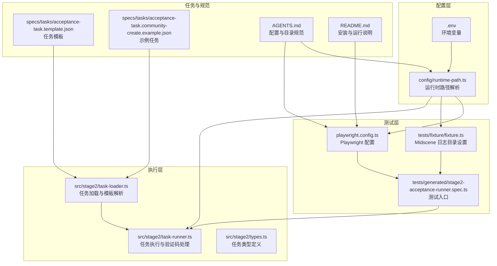
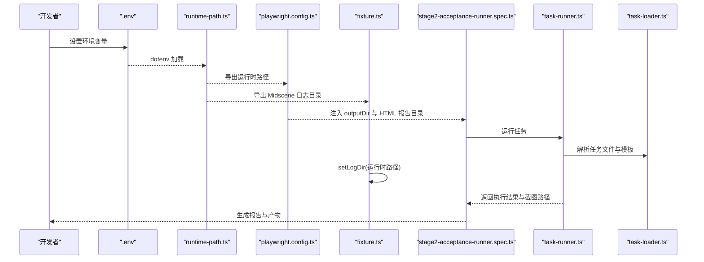
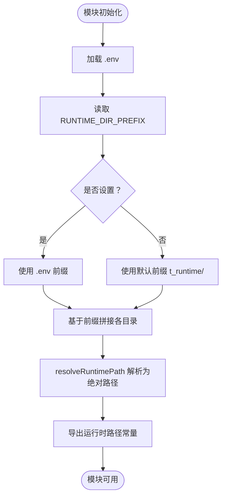
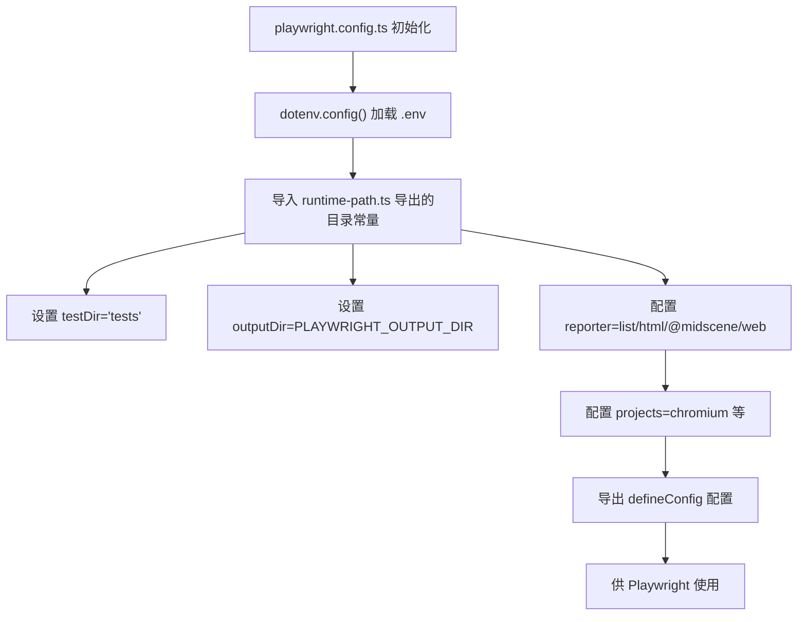
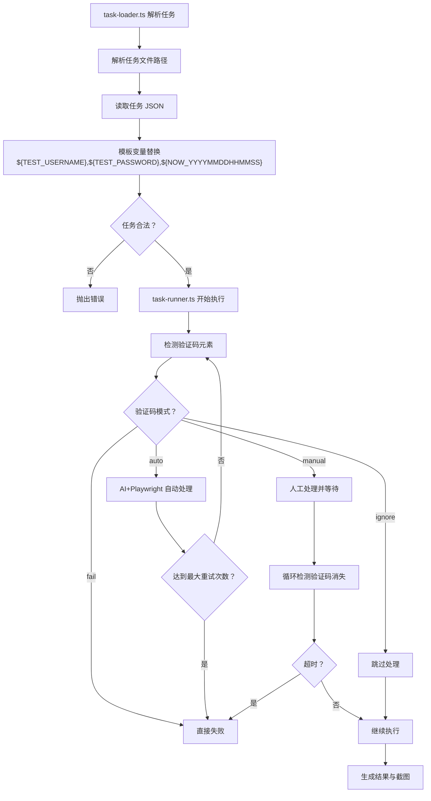
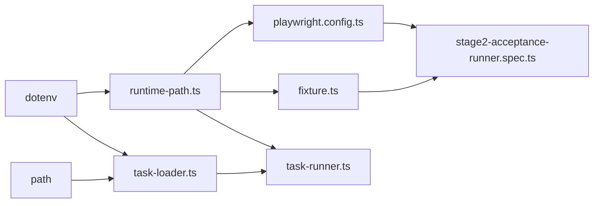

# 配置管理

<cite>
**本文引用的文件**
- [playwright.config.ts](file://playwright.config.ts)
- [runtime-path.ts](file://config/runtime-path.ts)
- [package.json](file://package.json)
- [README.md](file://README.md)
- [AGENTS.md](file://AGENTS.md)
- [.gitignore](file://.gitignore)
- [stage2-acceptance-runner.spec.ts](file://tests/generated/stage2-acceptance-runner.spec.ts)
- [fixture.ts](file://tests/fixture/fixture.ts)
- [task-runner.ts](file://src/stage2/task-runner.ts)
- [task-loader.ts](file://src/stage2/task-loader.ts)
- [types.ts](file://src/stage2/types.ts)
- [acceptance-task.template.json](file://specs/tasks/acceptance-task.template.json)
- [acceptance-task.community-create.example.json](file://specs/tasks/acceptance-task.community-create.example.json)
</cite>

## 目录
1. [简介](#简介)
2. [项目结构](#项目结构)
3. [核心组件](#核心组件)
4. [架构总览](#架构总览)
5. [详细组件分析](#详细组件分析)
6. [依赖关系分析](#依赖关系分析)
7. [性能考量](#性能考量)
8. [故障排查指南](#故障排查指南)
9. [结论](#结论)
10. [附录](#附录)

## 简介
本文件面向 HI-TEST 配置管理系统，系统基于 Playwright 与 Midscene.js 构建，围绕“环境变量 + 统一运行时路径 + Playwright 定制化配置”的模式，实现可移植、可维护、可扩展的自动化测试配置体系。本文重点覆盖：
- 环境变量配置清单与使用方法（运行时路径、报告目录、模型配置、任务与验证码策略等）
- 运行时路径管理机制与优先级规则
- Playwright 配置的定制化选项（浏览器、超时、报告、并行与重试等）
- 配置文件组织与优先级（.env、runtime-path.ts、playwright.config.ts）
- 配置验证与调试方法
- 最佳实践（开发/生产差异与迁移策略）

## 项目结构
项目采用“配置集中 + 运行时收敛”的组织方式：
- 配置层：.env 与 config/runtime-path.ts 提供统一的运行时路径与环境变量解析
- 测试层：playwright.config.ts 将运行时路径注入 Playwright，并定义项目与报告器
- 夹具与执行：tests/fixture/fixture.ts 设置 Midscene 日志目录；tests/generated/stage2-acceptance-runner.spec.ts 作为入口
- 任务与运行：src/stage2/* 负责任务加载、运行与验证码处理；specs/tasks/* 提供任务模板与示例

图表来源
- [runtime-path.ts](file://config/runtime-path.ts#L1-L41)
- [playwright.config.ts](file://playwright.config.ts#L1-L95)
- [fixture.ts](file://tests/fixture/fixture.ts#L1-L100)
- [stage2-acceptance-runner.spec.ts](file://tests/generated/stage2-acceptance-runner.spec.ts#L1-L39)
- [task-runner.ts](file://src/stage2/task-runner.ts#L1-L800)
- [task-loader.ts](file://src/stage2/task-loader.ts#L1-L89)
- [types.ts](file://src/stage2/types.ts#L1-L125)
- [acceptance-task.template.json](file://specs/tasks/acceptance-task.template.json#L1-L85)
- [acceptance-task.community-create.example.json](file://specs/tasks/acceptance-task.community-create.example.json#L1-L184)
- [AGENTS.md](file://AGENTS.md#L1-L61)
- [README.md](file://README.md#L1-L144)

章节来源
- [README.md](file://README.md#L1-L144)
- [AGENTS.md](file://AGENTS.md#L1-L61)

## 核心组件
- 运行时路径解析模块：集中读取环境变量并提供统一的运行产物目录，支持默认值与路径解析
- Playwright 配置：集中管理测试目录、输出目录、报告器、并行与重试、超时等
- Midscene 日志目录：通过夹具在测试启动阶段设置日志根目录
- 任务加载与执行：解析任务文件、模板变量、验证码策略与运行时超时
- 任务模板与示例：提供任务结构与运行时参数示例

章节来源
- [runtime-path.ts](file://config/runtime-path.ts#L1-L41)
- [playwright.config.ts](file://playwright.config.ts#L1-L95)
- [fixture.ts](file://tests/fixture/fixture.ts#L1-L100)
- [task-runner.ts](file://src/stage2/task-runner.ts#L1-L800)
- [task-loader.ts](file://src/stage2/task-loader.ts#L1-L89)
- [acceptance-task.template.json](file://specs/tasks/acceptance-task.template.json#L1-L85)
- [acceptance-task.community-create.example.json](file://specs/tasks/acceptance-task.community-create.example.json#L1-L184)

## 架构总览
下图展示配置在系统中的流向与耦合关系。

图表来源
- [runtime-path.ts](file://config/runtime-path.ts#L1-L41)
- [playwright.config.ts](file://playwright.config.ts#L1-L95)
- [fixture.ts](file://tests/fixture/fixture.ts#L1-L100)
- [stage2-acceptance-runner.spec.ts](file://tests/generated/stage2-acceptance-runner.spec.ts#L1-L39)
- [task-runner.ts](file://src/stage2/task-runner.ts#L1-L800)
- [task-loader.ts](file://src/stage2/task-loader.ts#L1-L89)

## 详细组件分析

### 运行时路径管理机制
- 统一入口：config/runtime-path.ts 通过 dotenv 加载 .env，提供运行时路径常量与路径解析函数
- 关键变量
  - RUNTIME_DIR_PREFIX：运行时目录前缀，默认 t_runtime/
  - PLAYWRIGHT_OUTPUT_DIR：Playwright 执行产物目录
  - PLAYWRIGHT_HTML_REPORT_DIR：Playwright HTML 报告目录
  - MIDSCENE_RUN_DIR：Midscene 运行日志、缓存、报告根目录
  - ACCEPTANCE_RESULT_DIR：第二段结构化结果目录（result.json、步骤截图）
- 路径解析：resolveRuntimePath 将相对路径解析为绝对路径，保证跨平台一致性
- 优先级规则
  - 若 .env 中未设置，则使用默认值（基于 RUNTIME_DIR_PREFIX）
  - 若 .env 中设置了 RUNTIME_DIR_PREFIX，则其余目录均基于该前缀拼接
  - 通过 dotenv.config() 在模块初始化时加载，确保全局可用

图表来源
- [runtime-path.ts](file://config/runtime-path.ts#L1-L41)

章节来源
- [runtime-path.ts](file://config/runtime-path.ts#L1-L41)
- [AGENTS.md](file://AGENTS.md#L22-L46)
- [.gitignore](file://.gitignore#L1-L4)

### Playwright 配置定制化
- 测试目录与输出
  - testDir：tests
  - outputDir：来自 runtime-path.ts 的 PLAYWRIGHT_OUTPUT_DIR
  - HTML 报告目录：来自 runtime-path.ts 的 PLAYWRIGHT_HTML_REPORT_DIR
- 超时与并行
  - timeout：90 秒
  - fullyParallel：启用文件级并行
  - workers：CI 环境单 worker，本地默认并发
  - retries：CI 环境重试 2 次，本地 0 次
  - forbidOnly：CI 环境禁止遗留 test.only
- 报告器
  - list、html（禁用自动打开）、@midscene/web/playwright-report
- 项目与设备
  - 默认包含 chromium 设备，其他浏览器可按需启用
- 本地服务
  - 可选 webServer 配置，用于本地开发服务器

图表来源
- [playwright.config.ts](file://playwright.config.ts#L1-L95)
- [runtime-path.ts](file://config/runtime-path.ts#L1-L41)

章节来源
- [playwright.config.ts](file://playwright.config.ts#L1-L95)
- [README.md](file://README.md#L106-L116)

### Midscene 日志目录与夹具
- 夹具在测试启动阶段调用 setLogDir，将 Midscene 日志、缓存、报告统一写入 runtime-path.ts 解析后的 MIDSCENE_RUN_DIR
- 通过 resolveRuntimePath 将相对目录转为绝对路径，确保跨平台一致性

章节来源
- [fixture.ts](file://tests/fixture/fixture.ts#L1-L100)
- [runtime-path.ts](file://config/runtime-path.ts#L1-L41)

### 任务加载与运行（含验证码策略）
- 任务文件解析
  - 默认任务文件：specs/tasks/acceptance-task.community-create.example.json
  - 支持模板变量：${TEST_USERNAME}、${TEST_PASSWORD}、${NOW_YYYYMMDDHHMMSS}
  - 支持绝对/相对路径解析，绝对路径直接使用，相对路径基于 process.cwd()
- 验证码策略
  - STAGE2_CAPTCHA_MODE：auto/manual/fail/ignore（默认 manual）
  - STAGE2_CAPTCHA_WAIT_TIMEOUT_MS：人工模式等待时长（毫秒，默认 120000）
  - 自动模式：AI 查询滑块位置与轨道宽度，模拟真人拖动轨迹，最多重试 3 次
  - 人工兜底：持续检测验证码元素，超时则失败
- 运行时超时
  - 页面级与步骤级超时可通过任务 runtime 字段配置（stepTimeoutMs/pageTimeoutMs）

图表来源
- [task-loader.ts](file://src/stage2/task-loader.ts#L1-L89)
- [task-runner.ts](file://src/stage2/task-runner.ts#L1-L800)
- [acceptance-task.template.json](file://specs/tasks/acceptance-task.template.json#L1-L85)
- [acceptance-task.community-create.example.json](file://specs/tasks/acceptance-task.community-create.example.json#L1-L184)

章节来源
- [task-loader.ts](file://src/stage2/task-loader.ts#L1-L89)
- [task-runner.ts](file://src/stage2/task-runner.ts#L1-L800)
- [types.ts](file://src/stage2/types.ts#L1-L125)
- [README.md](file://README.md#L54-L61)

### 配置文件组织与优先级规则
- .env：集中存放所有环境变量（模型、运行时路径、任务与验证码策略等）
- runtime-path.ts：统一解析与导出运行时路径，支持默认值与前缀拼接
- playwright.config.ts：读取 runtime-path.ts 导出的目录常量，注入 Playwright 配置
- 夹具与执行：通过 runtime-path.ts 获取 Midscene 日志目录与结果目录
- 优先级
  - .env > 默认值（基于 RUNTIME_DIR_PREFIX）
  - 任务模板变量优先使用 .env 中同名变量，否则为空字符串
  - CI 环境下 Playwright 并行与重试策略自动调整

章节来源
- [runtime-path.ts](file://config/runtime-path.ts#L1-L41)
- [playwright.config.ts](file://playwright.config.ts#L1-L95)
- [AGENTS.md](file://AGENTS.md#L22-L31)
- [README.md](file://README.md#L31-L52)

### 配置验证与调试方法
- 验证运行时路径
  - 在 runtime-path.ts 初始化处断点或打印，确认 dotenv 加载成功且前缀解析正确
  - 在夹具中打印 setLogDir 的最终路径，确认 Midscene 日志目录正确
- 验证 Playwright 配置
  - 运行 npx playwright test --headed tests/generated/stage2-acceptance-runner.spec.ts
  - 检查 PLAYWRIGHT_OUTPUT_DIR 与 PLAYWRIGHT_HTML_REPORT_DIR 是否生成产物
- 验证任务加载
  - 确认 STAGE2_TASK_FILE 指向的任务文件存在且可读
  - 检查模板变量是否被正确替换（如 ${NOW_YYYYMMDDHHMMSS}）
- 验证验证码策略
  - 设置 STAGE2_CAPTCHA_MODE=auto，观察自动拖动轨迹与重试逻辑
  - 设置 STAGE2_CAPTCHA_MODE=manual，观察等待与超时行为
- 常见问题定位
  - 目录不可写：检查 .gitignore 是否屏蔽了 t_runtime，确认权限
  - 报告缺失：确认 reporter 配置与 HTML 报告目录一致
  - 任务失败：查看 result.json 与截图，结合失败步骤定位

章节来源
- [runtime-path.ts](file://config/runtime-path.ts#L1-L41)
- [fixture.ts](file://tests/fixture/fixture.ts#L1-L100)
- [stage2-acceptance-runner.spec.ts](file://tests/generated/stage2-acceptance-runner.spec.ts#L1-L39)
- [README.md](file://README.md#L106-L131)

### 最佳实践
- 开发环境
  - 使用 --headed 便于调试
  - 适当提高页面与步骤超时，开启 trace 与截图
  - 保持 RUNTIME_DIR_PREFIX 为默认值，便于团队统一
- 生产/CI 环境
  - 关闭 --headed，启用 fullyParallel 与 workers=1（避免资源竞争）
  - CI 环境 retries=2，减少误报
  - 固定任务文件路径，避免相对路径导致的不确定性
- 配置迁移策略
  - 新增运行产物目录：必须在 .env 中新增变量并在 runtime-path.ts 导出
  - 更新 .gitignore 与 CI 工作流上传路径
  - 同步更新 README 与 AGENTS.md，确保文档一致

章节来源
- [playwright.config.ts](file://playwright.config.ts#L28-L34)
- [AGENTS.md](file://AGENTS.md#L48-L61)
- [README.md](file://README.md#L133-L144)

## 依赖关系分析
- 运行时路径模块被 Playwright 配置、夹具与任务执行共同依赖
- 任务加载依赖 dotenv 与 path，解析模板变量与任务文件路径
- Playwright 配置依赖 dotenv 与 runtime-path.ts
- 夹具依赖 runtime-path.ts 与 Midscene SDK

图表来源
- [runtime-path.ts](file://config/runtime-path.ts#L1-L41)
- [playwright.config.ts](file://playwright.config.ts#L1-L95)
- [fixture.ts](file://tests/fixture/fixture.ts#L1-L100)
- [stage2-acceptance-runner.spec.ts](file://tests/generated/stage2-acceptance-runner.spec.ts#L1-L39)
- [task-runner.ts](file://src/stage2/task-runner.ts#L1-L800)
- [task-loader.ts](file://src/stage2/task-loader.ts#L1-L89)

章节来源
- [package.json](file://package.json#L1-L24)

## 性能考量
- 并行与重试
  - fullyParallel 与 workers 控制并发度，CI 环境建议单 worker 以避免资源争用
  - retries 仅在 CI 环境启用，减少本地干扰
- 超时设置
  - 合理设置 timeout、pageTimeoutMs、stepTimeoutMs，避免过短导致误判，过长影响效率
- 报告与截图
  - trace 与截图有助于定位问题，但会增加 IO 压力，建议在失败重试时开启

## 故障排查指南
- 目录不可写或产物缺失
  - 检查 .gitignore 是否屏蔽 t_runtime
  - 确认 resolveRuntimePath 解析为期望的绝对路径
- 报告未生成
  - 确认 reporter 配置与 HTML 报告目录一致
  - 检查 CI 上传路径是否与 PLAYWRIGHT_HTML_REPORT_DIR 对齐
- 任务加载失败
  - 检查 STAGE2_TASK_FILE 是否存在且可读
  - 检查模板变量是否在 .env 中定义
- 验证码处理异常
  - 调整 STAGE2_CAPTCHA_MODE 与 STAGE2_CAPTCHA_WAIT_TIMEOUT_MS
  - 检查自动模式下的选择器与 AI 查询稳定性

章节来源
- [.gitignore](file://.gitignore#L1-L4)
- [playwright.config.ts](file://playwright.config.ts#L36-L40)
- [task-runner.ts](file://src/stage2/task-runner.ts#L58-L84)

## 结论
本配置体系通过“环境变量 + 统一运行时路径 + Playwright 定制化配置”的组合，实现了可移植、可维护、可扩展的测试运行环境。配合 AGENTS.md 的规范约束与 README 的使用说明，能够有效降低多人协作与后续维护成本。建议在新增运行产物目录或调整策略时，严格遵循“先 .env、再 runtime-path.ts、最后 Playwright 配置”的顺序，并同步更新文档与 CI。

## 附录

### 环境变量配置清单与使用方法
- 模型与 AI
  - OPENAI_API_KEY：AI 模型密钥
  - OPENAI_BASE_URL：AI 模型网关地址
  - MIDSCENE_MODEL_NAME：Midscene 模型名称
- 运行时路径
  - RUNTIME_DIR_PREFIX：运行时目录前缀（默认 t_runtime/）
  - PLAYWRIGHT_OUTPUT_DIR：Playwright 执行产物目录
  - PLAYWRIGHT_HTML_REPORT_DIR：Playwright HTML 报告目录
  - MIDSCENE_RUN_DIR：Midscene 运行日志、缓存、报告根目录
  - ACCEPTANCE_RESULT_DIR：第二段结构化结果目录
- 任务与验证码
  - STAGE2_TASK_FILE：默认任务文件路径
  - STAGE2_REQUIRE_APPROVAL：是否需要审批（布尔）
  - STAGE2_CAPTCHA_MODE：验证码处理模式（auto/manual/fail/ignore）
  - STAGE2_CAPTCHA_WAIT_TIMEOUT_MS：人工模式等待时长（毫秒）

章节来源
- [README.md](file://README.md#L31-L52)
- [AGENTS.md](file://AGENTS.md#L22-L46)
- [runtime-path.ts](file://config/runtime-path.ts#L13-L36)
- [task-runner.ts](file://src/stage2/task-runner.ts#L58-L84)
- [task-loader.ts](file://src/stage2/task-loader.ts#L71-L77)